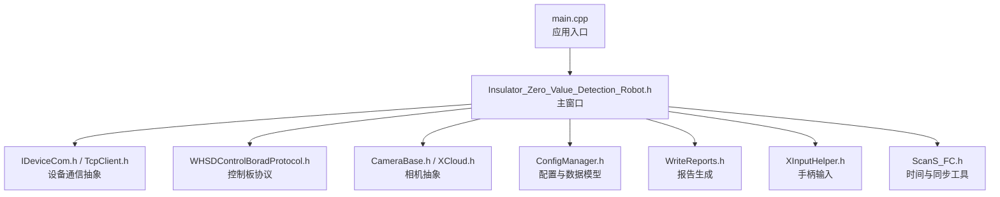
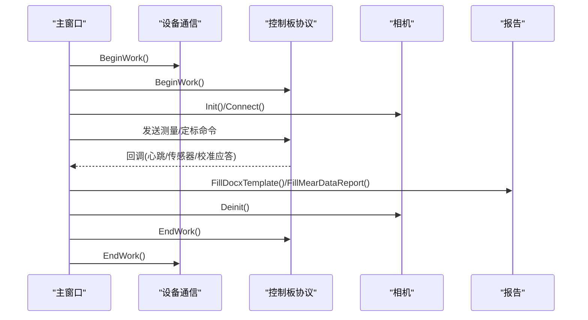
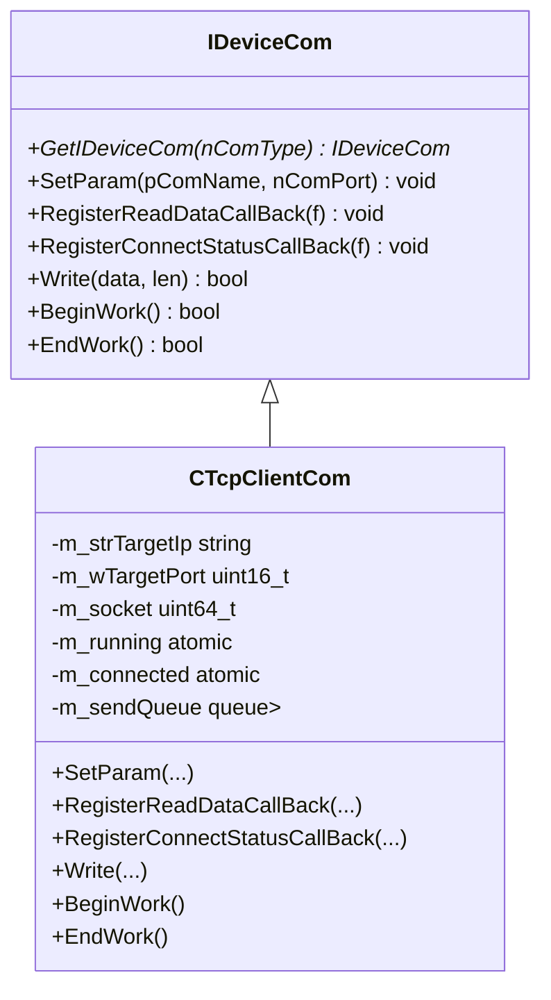
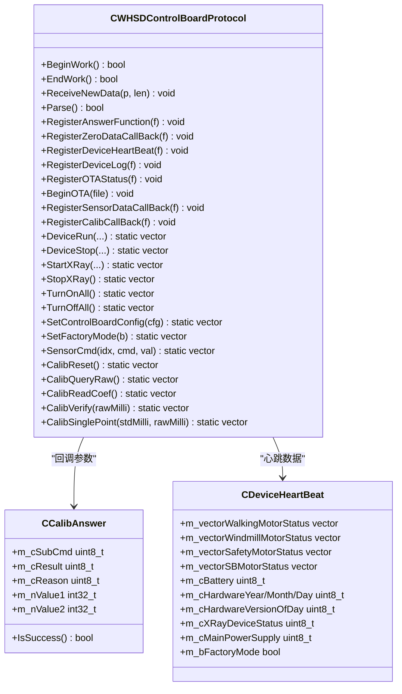
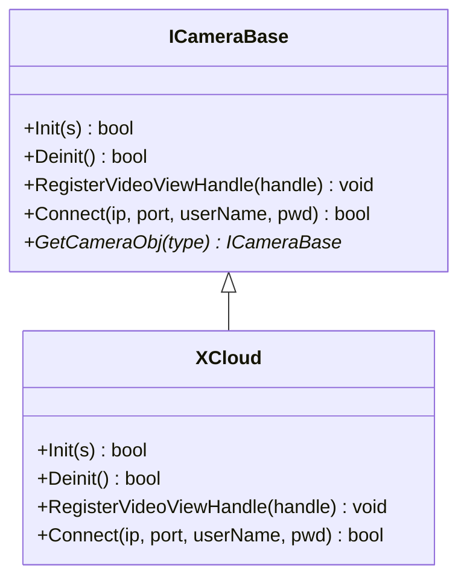
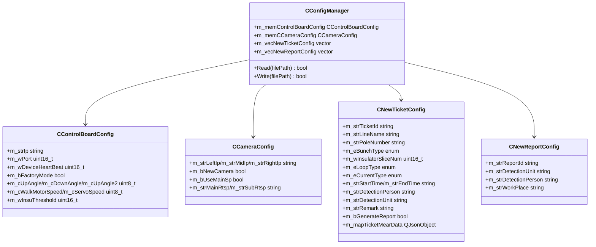
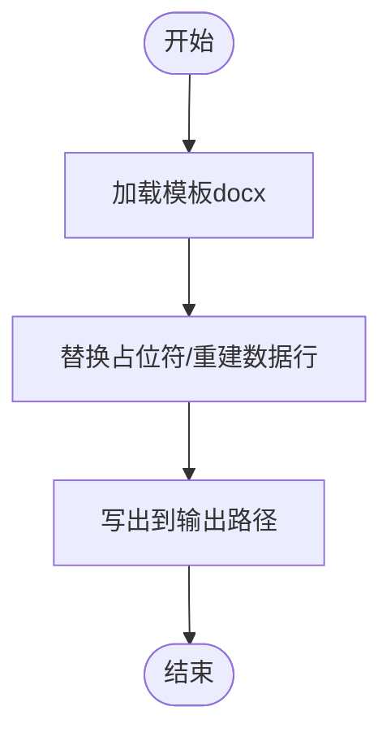
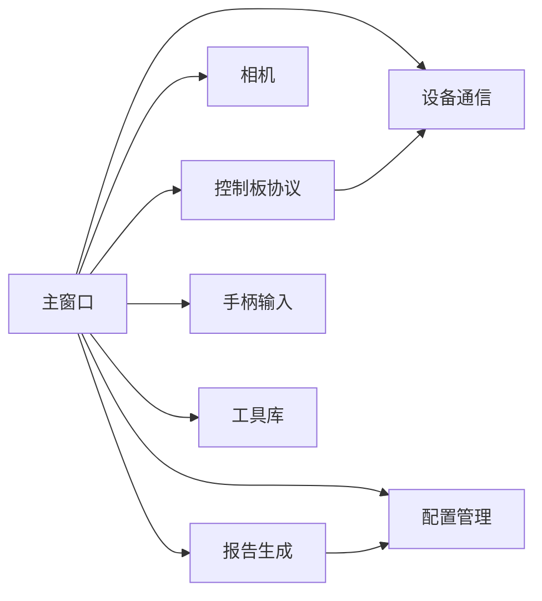

# API参考

<cite>
**本文引用的文件**
- [main.cpp](file://Insulator_Zero_Value_Detection_Robot/main.cpp)
- [Insulator_Zero_Value_Detection_Robot.h](file://Insulator_Zero_Value_Detection_Robot/UI/Insulator_Zero_Value_Detection_Robot.h)
- [ConfigManager.h](file://Insulator_Zero_Value_Detection_Robot/Config/ConfigManager.h)
- [IDeviceCom.h](file://Insulator_Zero_Value_Detection_Robot/DeviceCom/IDeviceCom.h)
- [TcpClient.h](file://Insulator_Zero_Value_Detection_Robot/DeviceCom/TcpClient.h)
- [CameraBase.h](file://Insulator_Zero_Value_Detection_Robot/Camera/CameraBase.h)
- [XCloud.h](file://Insulator_Zero_Value_Detection_Robot/Camera/XCloud.h)
- [WHSDControlBoradProtocol.h](file://Insulator_Zero_Value_Detection_Robot/Protocol/WHSDControlBoradProtocol.h)
- [ScanS_FC.h](file://Insulator_Zero_Value_Detection_Robot/Log/ScanS_FC.h)
- [WriteReports.h](file://Insulator_Zero_Value_Detection_Robot/Report/WriteReports.h)
- [NewTicketDialog.h](file://Insulator_Zero_Value_Detection_Robot/UI/NewTicketDialog.h)
- [NewReportDialog.h](file://Insulator_Zero_Value_Detection_Robot/UI/NewReportDialog.h)
- [XInputHelper.h](file://Insulator_Zero_Value_Detection_Robot/Tools/XInputHelper.h)
</cite>

## 目录
1. [简介](#简介)
2. [项目结构](#项目结构)
3. [核心组件](#核心组件)
4. [架构总览](#架构总览)
5. [详细组件分析](#详细组件分析)
6. [依赖关系分析](#依赖关系分析)
7. [性能与并发特性](#性能与并发特性)
8. [错误码与异常处理指南](#错误码与异常处理指南)
9. [使用示例与最佳实践](#使用示例与最佳实践)
10. [结论](#结论)

## 简介
本API参考面向绝缘子零值检测机器人V2的二次开发与集成，覆盖设备通信、相机采集、控制板协议、配置管理、报告生成、手柄输入等关键模块。文档以“接口定义—数据模型—调用流程—异步回调—错误处理”为主线，帮助开发者快速理解并扩展系统功能。

## 项目结构
- 入口：Qt应用主程序创建主窗口并启动事件循环
- UI层：主窗口承载测量流程、定标流程、工单/报告管理、告警展示
- 设备通信抽象：统一设备接入（如TCP）与回调注册
- 协议层：控制板协议封装，提供命令构造、解析与回调分发
- 相机抽象：统一摄像头接入与视频流回调
- 配置管理：控制板参数、相机参数、工单/报告数据结构
- 报告生成：基于模板填充docx报告
- 工具库：时间、转换、临界区等通用能力
- 手柄输入：控制器状态轮询与回调

图表来源
- [main.cpp:11-23](file://Insulator_Zero_Value_Detection_Robot/main.cpp#L11-L23)
- [Insulator_Zero_Value_Detection_Robot.h:26-384](file://Insulator_Zero_Value_Detection_Robot/UI/Insulator_Zero_Value_Detection_Robot.h#L26-L384)
- [IDeviceCom.h:4-15](file://Insulator_Zero_Value_Detection_Robot/DeviceCom/IDeviceCom.h#L4-L15)
- [TcpClient.h:8-46](file://Insulator_Zero_Value_Detection_Robot/DeviceCom/TcpClient.h#L8-L46)
- [WHSDControlBoradProtocol.h:189-355](file://Insulator_Zero_Value_Detection_Robot/Protocol/WHSDControlBoradProtocol.h#L189-L355)
- [CameraBase.h:5-14](file://Insulator_Zero_Value_Detection_Robot/Camera/CameraBase.h#L5-L14)
- [XCloud.h:6-33](file://Insulator_Zero_Value_Detection_Robot/Camera/XCloud.h#L6-L33)
- [ConfigManager.h:10-199](file://Insulator_Zero_Value_Detection_Robot/Config/ConfigManager.h#L10-L199)
- [WriteReports.h:24-88](file://Insulator_Zero_Value_Detection_Robot/Report/WriteReports.h#L24-L88)
- [XInputHelper.h:5-47](file://Insulator_Zero_Value_Detection_Robot/Tools/XInputHelper.h#L5-L47)
- [ScanS_FC.h:20-366](file://Insulator_Zero_Value_Detection_Robot/Log/ScanS_FC.h#L20-L366)

章节来源
- [main.cpp:11-23](file://Insulator_Zero_Value_Detection_Robot/main.cpp#L11-L23)
- [Insulator_Zero_Value_Detection_Robot.h:26-384](file://Insulator_Zero_Value_Detection_Robot/UI/Insulator_Zero_Value_Detection_Robot.h#L26-L384)

## 核心组件
- 设备通信抽象 IDeviceCom：统一读写、连接状态回调、开始/结束工作
- TCP客户端 CTcpClientCom：多线程收发、队列缓冲、连接重试
- 控制板协议 CWHSDControlBoardProtocol：命令构造、解析、心跳、校准、传感器数据、日志、OTA
- 相机抽象 ICameraBase 及实现 XCloud：初始化、连接、视频句柄注册、反初始化
- 配置管理 CConfigManager：读取/写入配置；数据模型包含控制板、相机、工单、报告
- 报告生成 CWriteReports：模板填充、测量数据表填充
- 手柄输入 CXInputHelper：控制器状态轮询与回调
- 工具库 ScanS_FC：时间、字符串/数值转换、临界区

章节来源
- [IDeviceCom.h:4-15](file://Insulator_Zero_Value_Detection_Robot/DeviceCom/IDeviceCom.h#L4-L15)
- [TcpClient.h:8-46](file://Insulator_Zero_Value_Detection_Robot/DeviceCom/TcpClient.h#L8-L46)
- [WHSDControlBoradProtocol.h:189-355](file://Insulator_Zero_Value_Detection_Robot/Protocol/WHSDControlBoradProtocol.h#L189-L355)
- [CameraBase.h:5-14](file://Insulator_Zero_Value_Detection_Robot/Camera/CameraBase.h#L5-L14)
- [XCloud.h:6-33](file://Insulator_Zero_Value_Detection_Robot/Camera/XCloud.h#L6-L33)
- [ConfigManager.h:10-199](file://Insulator_Zero_Value_Detection_Robot/Config/ConfigManager.h#L10-L199)
- [WriteReports.h:24-88](file://Insulator_Zero_Value_Detection_Robot/Report/WriteReports.h#L24-L88)
- [XInputHelper.h:5-47](file://Insulator_Zero_Value_Detection_Robot/Tools/XInputHelper.h#L5-L47)
- [ScanS_FC.h:20-366](file://Insulator_Zero_Value_Detection_Robot/Log/ScanS_FC.h#L20-L366)

## 架构总览
系统采用分层与插件化设计：
- 上层UI通过信号槽协调测量/定标流程，驱动设备与相机
- 设备通信抽象屏蔽底层差异，协议层负责帧组装与解析
- 相机抽象支持多型号接入，统一视频回调
- 配置集中管理，工单/报告数据贯穿流程
- 报告生成基于模板替换，支持动态表格行扩展

图表来源
- [Insulator_Zero_Value_Detection_Robot.h:142-161](file://Insulator_Zero_Value_Detection_Robot/UI/Insulator_Zero_Value_Detection_Robot.h#L142-L161)
- [WHSDControlBoradProtocol.h:192-216](file://Insulator_Zero_Value_Detection_Robot/Protocol/WHSDControlBoradProtocol.h#L192-L216)
- [CameraBase.h:8-13](file://Insulator_Zero_Value_Detection_Robot/Camera/CameraBase.h#L8-L13)
- [WriteReports.h:32-61](file://Insulator_Zero_Value_Detection_Robot/Report/WriteReports.h#L32-L61)

## 详细组件分析

### 设备通信抽象 IDeviceCom 与 TCP 实现
- 目的：统一设备接入，解耦具体通信方式
- 关键方法
  - GetIDeviceCom(int nComType)：按类型获取实例
  - SetParam(const char* pComName, int nComPort)：设置目标地址与端口
  - RegisterReadDataCallBack(...)：注册接收数据回调
  - RegisterConnectStatusCallBack(...)：注册连接状态回调
  - Write(uint8_t*, size_t)：发送数据
  - BeginWork()/EndWork()：生命周期管理
- 线程模型：CTcpClientCom内部维护连接、接收、发送线程，使用队列与条件变量保证并发安全

图表来源
- [IDeviceCom.h:4-15](file://Insulator_Zero_Value_Detection_Robot/DeviceCom/IDeviceCom.h#L4-L15)
- [TcpClient.h:8-46](file://Insulator_Zero_Value_Detection_Robot/DeviceCom/TcpClient.h#L8-L46)

章节来源
- [IDeviceCom.h:4-15](file://Insulator_Zero_Value_Detection_Robot/DeviceCom/IDeviceCom.h#L4-L15)
- [TcpClient.h:8-46](file://Insulator_Zero_Value_Detection_Robot/DeviceCom/TcpClient.h#L8-L46)

### 控制板协议 CWHSDControlBoardProtocol
- 职责：协议帧组装/解析、心跳、传感器数据、校准、日志、OTA
- 关键回调
  - RegisterAnswerFunction(...)：通用应答回调
  - RegisterZeroDataCallBack(...)：零值数据回调
  - RegisterDeviceHeartBeat(...)：设备心跳回调
  - RegisterDeviceLog(...)：日志回调
  - RegisterOTAStatus(...)：OTA状态回调
  - RegisterSensorDataCallBack(...)：传感器数据回调
  - RegisterCalibCallBack(...)：校准应答回调
- 静态命令构造（返回字节序列）
  - DeviceRun(...)/DeviceStop(...)/DeviceBreak()
  - StartXRay(...)/StopXRay()
  - TurnOnAll()/TurnOffAll()
  - SetControlBoardConfig(...)/SetFactoryMode(...)
  - SensorCmd(...)
  - CalibReset()/CalibQueryRaw()/CalibReadCoef()/CalibVerify(...)/CalibSinglePoint(...)
- 数据模型
  - CSensorData：传感器索引、命令、值
  - CCalibAnswer：子命令、结果、原因、参数1/2（毫值）
  - CDeviceHeartBeat：电机状态、电池、固件信息、电源状态、工厂模式
  - CControlBoardProtocolConfig：阈值与安全参数

图表来源
- [WHSDControlBoradProtocol.h:7-52](file://Insulator_Zero_Value_Detection_Robot/Protocol/WHSDControlBoradProtocol.h#L7-L52)
- [WHSDControlBoradProtocol.h:121-187](file://Insulator_Zero_Value_Detection_Robot/Protocol/WHSDControlBoradProtocol.h#L121-L187)
- [WHSDControlBoradProtocol.h:189-355](file://Insulator_Zero_Value_Detection_Robot/Protocol/WHSDControlBoradProtocol.h#L189-L355)

章节来源
- [WHSDControlBoradProtocol.h:7-52](file://Insulator_Zero_Value_Detection_Robot/Protocol/WHSDControlBoradProtocol.h#L7-L52)
- [WHSDControlBoradProtocol.h:121-187](file://Insulator_Zero_Value_Detection_Robot/Protocol/WHSDControlBoradProtocol.h#L121-L187)
- [WHSDControlBoradProtocol.h:189-355](file://Insulator_Zero_Value_Detection_Robot/Protocol/WHSDControlBoradProtocol.h#L189-L355)

### 相机抽象 ICameraBase 与 XCloud 实现
- 目的：统一不同相机SDK接入，提供初始化、连接、视频句柄注册、反初始化
- 关键方法
  - Init(vector<string>)：初始化相机参数
  - Connect(ip, port, user, pwd)：建立连接
  - RegisterVideoViewHandle(void*)：注册视频显示句柄
  - Deinit()：释放资源
  - GetCameraObj(int type)：按类型获取实例

图表来源
- [CameraBase.h:5-14](file://Insulator_Zero_Value_Detection_Robot/Camera/CameraBase.h#L5-L14)
- [XCloud.h:6-33](file://Insulator_Zero_Value_Detection_Robot/Camera/XCloud.h#L6-L33)

章节来源
- [CameraBase.h:5-14](file://Insulator_Zero_Value_Detection_Robot/Camera/CameraBase.h#L5-L14)
- [XCloud.h:6-33](file://Insulator_Zero_Value_Detection_Robot/Camera/XCloud.h#L6-L33)

### 配置管理 CConfigManager 与数据模型
- 控制板配置 CControlBoardConfig：IP、端口、心跳周期、工厂模式、探针角度、速度、绝缘阈值
- 相机配置 CCameraConfig：左右中IP、是否新款相机、主/子码流RTSP
- 工单配置 CNewTicketConfig：串数类型、回路数、电流类型、片数、起止时间、人员单位、备注、JSON测量数据
- 报告配置 CNewReportConfig：报告编号、检测单位、检测人员、作业地点
- 管理器 CConfigManager：Read/Write 配置文件

图表来源
- [ConfigManager.h:10-199](file://Insulator_Zero_Value_Detection_Robot/Config/ConfigManager.h#L10-L199)

章节来源
- [ConfigManager.h:10-199](file://Insulator_Zero_Value_Detection_Robot/Config/ConfigManager.h#L10-L199)

### 报告生成 CWriteReports
- 模板填充：将模板docx中的占位符替换为实际数据
- 测量数据表填充：根据QJsonObject动态构建表格行，适配双联测量数据
- 输出路径不存在时自动创建

图表来源
- [WriteReports.h:24-88](file://Insulator_Zero_Value_Detection_Robot/Report/WriteReports.h#L24-L88)

章节来源
- [WriteReports.h:24-88](file://Insulator_Zero_Value_Detection_Robot/Report/WriteReports.h#L24-L88)

### 手柄输入 CXInputHelper
- 控制器状态轮询，标准化扳机与摇杆值
- 回调上报ControllerState（连接状态、按钮、摇杆、方向键）

章节来源
- [XInputHelper.h:5-47](file://Insulator_Zero_Value_Detection_Robot/Tools/XInputHelper.h#L5-L47)

### 工具库 ScanS_FC
- 临界区 CCFRD_CriticalSection：Lock/UnLock
- 时间 CCFRD_Time：时间获取、比较、时间差计算、格式化
- 转换 CCFRD_Convert：数值/字符串互转、时间格式转换、字符串分割

章节来源
- [ScanS_FC.h:20-366](file://Insulator_Zero_Value_Detection_Robot/Log/ScanS_FC.h#L20-L366)

## 依赖关系分析
- 主窗口依赖设备通信、协议、相机、配置、报告、手柄输入与日志工具
- 协议层依赖设备通信进行数据收发，向上提供回调
- 相机抽象被主窗口用于采集与显示
- 配置管理贯穿工单/报告数据流转
- 报告生成依赖配置中的测量数据

图表来源
- [Insulator_Zero_Value_Detection_Robot.h:26-384](file://Insulator_Zero_Value_Detection_Robot/UI/Insulator_Zero_Value_Detection_Robot.h#L26-L384)
- [WHSDControlBoradProtocol.h:189-355](file://Insulator_Zero_Value_Detection_Robot/Protocol/WHSDControlBoradProtocol.h#L189-L355)
- [ConfigManager.h:10-199](file://Insulator_Zero_Value_Detection_Robot/Config/ConfigManager.h#L10-L199)
- [WriteReports.h:24-88](file://Insulator_Zero_Value_Detection_Robot/Report/WriteReports.h#L24-L88)

章节来源
- [Insulator_Zero_Value_Detection_Robot.h:26-384](file://Insulator_Zero_Value_Detection_Robot/UI/Insulator_Zero_Value_Detection_Robot.h#L26-L384)
- [WHSDControlBoradProtocol.h:189-355](file://Insulator_Zero_Value_Detection_Robot/Protocol/WHSDControlBoradProtocol.h#L189-L355)
- [ConfigManager.h:10-199](file://Insulator_Zero_Value_Detection_Robot/Config/ConfigManager.h#L10-L199)
- [WriteReports.h:24-88](file://Insulator_Zero_Value_Detection_Robot/Report/WriteReports.h#L24-L88)

## 性能与并发特性
- 设备通信：CTcpClientCom使用独立线程处理连接、接收、发送，配合队列与条件变量避免阻塞
- 协议层：心跳与解析在后台线程执行，通过回调切回UI线程处理界面更新
- 相机：视频流回调需高效处理，建议仅做轻量转发或缓存
- 记录与报告：批量写入与模板替换注意I/O开销，建议在空闲时段执行
- 同步原语：使用std::mutex与atomic确保跨线程安全

[本节为通用指导，不直接分析具体文件]

## 错误码与异常处理指南
- 校准应答 CCalibAnswer
  - m_cResult：0x01成功，0x00失败
  - m_cReason：0x01原始值已超时，0x04Flash写失败，0x05参数长度/格式错误，0x09参数非法
- 设备通信
  - Write/BeginWork/EndWork返回bool表示成功与否
  - 连接状态通过RegisterConnectStatusCallBack回调通知
- 相机
  - Init/Connect/Deinit返回bool表示成功与否
- 报告生成
  - FillDocxTemplate/FillMearDataReport返回bool表示成功与否
- 工具库
  - FUNCRETURN枚举：OK=0，ERR=-1，NG=1，NG2=2，ERR2=-2，ERR3=-3

章节来源
- [WHSDControlBoradProtocol.h:21-52](file://Insulator_Zero_Value_Detection_Robot/Protocol/WHSDControlBoradProtocol.h#L21-L52)
- [IDeviceCom.h:4-15](file://Insulator_Zero_Value_Detection_Robot/DeviceCom/IDeviceCom.h#L4-L15)
- [CameraBase.h:5-14](file://Insulator_Zero_Value_Detection_Robot/Camera/CameraBase.h#L5-L14)
- [WriteReports.h:24-88](file://Insulator_Zero_Value_Detection_Robot/Report/WriteReports.h#L24-L88)
- [ScanS_FC.h:10-18](file://Insulator_Zero_Value_Detection_Robot/Log/ScanS_FC.h#L10-L18)

## 使用示例与最佳实践

### 设备通信接入
- 步骤
  - 通过GetIDeviceCom获取实例
  - SetParam设置目标地址与端口
  - RegisterReadDataCallBack/RegisterConnectStatusCallBack注册回调
  - BeginWork启动工作
  - 使用Write发送数据
  - EndWork结束工作
- 最佳实践
  - 在回调中避免耗时操作，必要时入队到UI线程处理
  - 重连逻辑放在连接状态回调中实现

章节来源
- [IDeviceCom.h:4-15](file://Insulator_Zero_Value_Detection_Robot/DeviceCom/IDeviceCom.h#L4-L15)
- [TcpClient.h:8-46](file://Insulator_Zero_Value_Detection_Robot/DeviceCom/TcpClient.h#L8-L46)

### 控制板协议调用
- 步骤
  - BeginWork启动协议服务
  - 使用静态方法构造命令（如CalibSinglePoint、CalibReset等）
  - 通过设备通信Write发送
  - 在RegisterCalibCallBack/RegisterDeviceHeartBeat等回调中处理响应
  - EndWork结束服务
- 最佳实践
  - 校准命令后设置合理超时（例如写Flash需≥3秒）
  - 校验返回结果的m_cResult与m_cReason，结合业务逻辑重试或告警

章节来源
- [WHSDControlBoradProtocol.h:189-355](file://Insulator_Zero_Value_Detection_Robot/Protocol/WHSDControlBoradProtocol.h#L189-L355)

### 相机接入与视频流
- 步骤
  - 通过GetCameraObj获取相机对象
  - Init传入相机参数
  - RegisterVideoViewHandle注册显示句柄
  - Connect建立连接
  - 结束后调用Deinit释放资源
- 最佳实践
  - 视频回调中只做最小化处理，避免卡顿
  - 多相机场景下注意资源隔离与线程安全

章节来源
- [CameraBase.h:5-14](file://Insulator_Zero_Value_Detection_Robot/Camera/CameraBase.h#L5-L14)
- [XCloud.h:6-33](file://Insulator_Zero_Value_Detection_Robot/Camera/XCloud.h#L6-L33)

### 配置管理与数据模型
- 步骤
  - 使用CConfigManager读取/写入配置文件
  - 通过CNewTicketConfig/CNewReportConfig组织工单/报告数据
  - 将测量数据以QJsonObject形式存入工单配置
- 最佳实践
  - 对JSON数据进行合法性校验后再写入
  - 报告生成前确保数据完整与顺序正确

章节来源
- [ConfigManager.h:10-199](file://Insulator_Zero_Value_Detection_Robot/Config/ConfigManager.h#L10-L199)

### 报告生成
- 步骤
  - 准备模板docx与占位符映射
  - 调用FillDocxTemplate生成基础报告
  - 使用FillMearDataReport填充测量数据表
- 最佳实践
  - 输出路径不存在时由库自动创建，但仍建议提前检查权限
  - 大数据量时考虑分批生成与异步任务

章节来源
- [WriteReports.h:24-88](file://Insulator_Zero_Value_Detection_Robot/Report/WriteReports.h#L24-L88)

### 手柄输入
- 步骤
  - 创建CXInputHelper实例并BeginWork
  - RegisterControllerStateCallBack注册回调
  - 在回调中读取ControllerState并处理按键/摇杆
  - EndWork停止轮询
- 最佳实践
  - 回调中避免阻塞，必要时触发UI动作

章节来源
- [XInputHelper.h:5-47](file://Insulator_Zero_Value_Detection_Robot/Tools/XInputHelper.h#L5-L47)

### 异步调用模式与回调函数
- 设备通信：ReadDataCallback与ConnectStatusCallback
- 协议层：CalibAnswer、DeviceHeartBeat、ZeroData、SensorData、OTAStatus回调
- 相机：视频句柄回调
- 手柄：ControllerState回调
- 最佳实践
  - 所有回调均应在非UI线程触发，UI更新需切换到UI线程（如通过信号槽）
  - 使用原子变量与互斥锁保护共享状态

章节来源
- [IDeviceCom.h:4-15](file://Insulator_Zero_Value_Detection_Robot/DeviceCom/IDeviceCom.h#L4-L15)
- [WHSDControlBoradProtocol.h:189-355](file://Insulator_Zero_Value_Detection_Robot/Protocol/WHSDControlBoradProtocol.h#L189-L355)
- [CameraBase.h:5-14](file://Insulator_Zero_Value_Detection_Robot/Camera/CameraBase.h#L5-L14)
- [XInputHelper.h:5-47](file://Insulator_Zero_Value_Detection_Robot/Tools/XInputHelper.h#L5-L47)

## 结论
本API参考围绕设备通信、协议、相机、配置、报告与输入等核心模块，提供了清晰的接口定义、数据模型说明、调用流程与错误处理指南。遵循上述最佳实践可确保系统在多设备、多线程环境下稳定运行，并为后续扩展（新相机、新协议、新报告模板）提供良好基础。