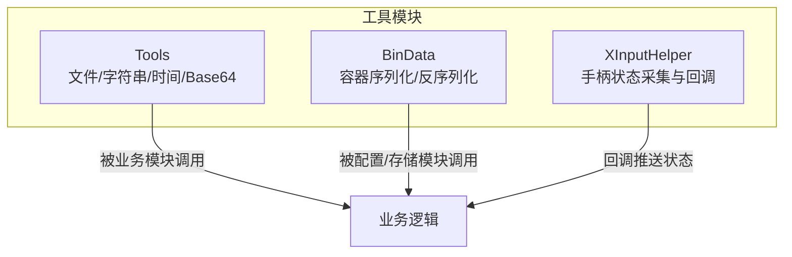
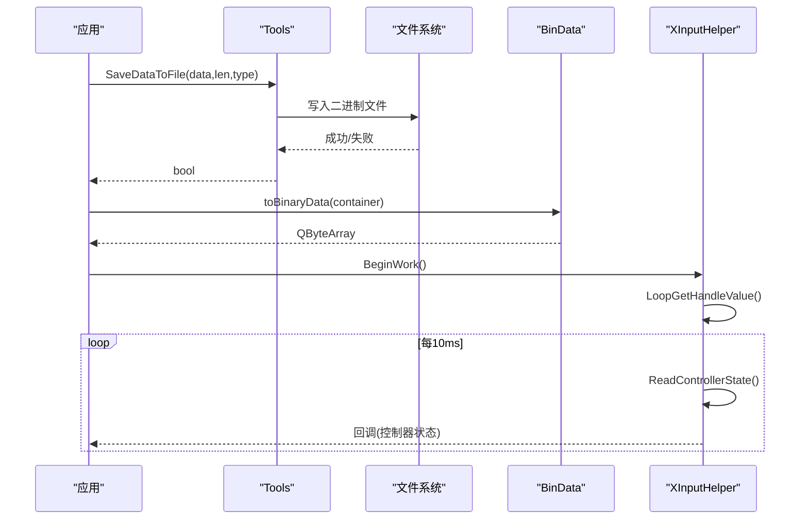
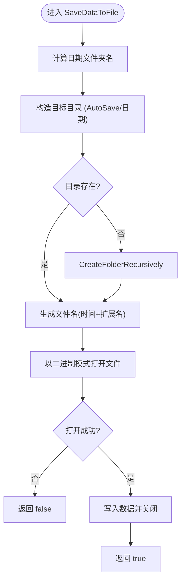
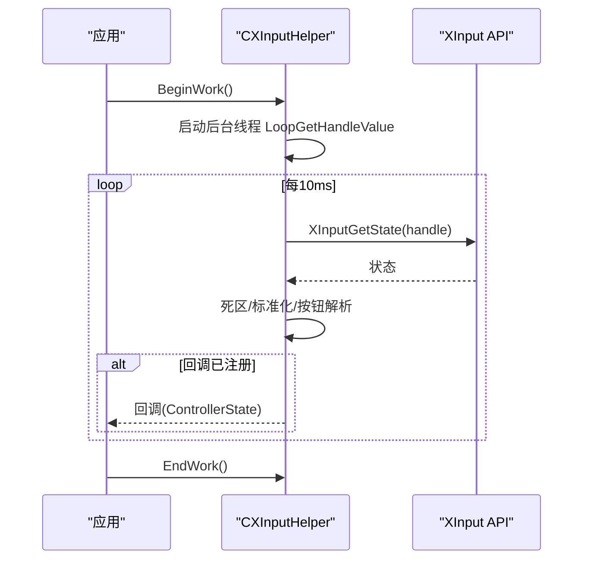
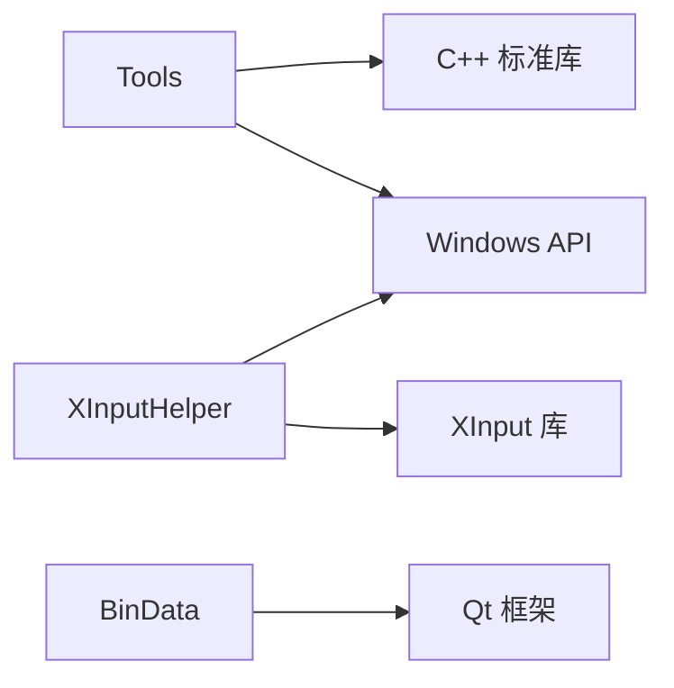

# 工具类接口

<cite>
**本文引用的文件**
- [Tools.h](file://Insulator_Zero_Value_Detection_Robot/Tools/Tools.h)
- [Tools.cpp](file://Insulator_Zero_Value_Detection_Robot/Tools/Tools.cpp)
- [BinData.h](file://Insulator_Zero_Value_Detection_Robot/Tools/BinData.h)
- [XInputHelper.h](file://Insulator_Zero_Value_Detection_Robot/Tools/XInputHelper.h)
- [XInputHelper.cpp](file://Insulator_Zero_Value_Detection_Robot/Tools/XInputHelper.cpp)
</cite>

## 目录
1. [简介](#简介)
2. [项目结构](#项目结构)
3. [核心组件](#核心组件)
4. [架构总览](#架构总览)
5. [详细组件分析](#详细组件分析)
6. [依赖关系分析](#依赖关系分析)
7. [性能考虑](#性能考虑)
8. [故障排查指南](#故障排查指南)
9. [结论](#结论)
10. [附录：API 参考与使用示例](#附录api-参考与使用示例)

## 简介
本文件为“工具类接口”的权威文档，聚焦以下三类能力：
- Tools 通用工具：文件读写、路径与目录管理、字符串处理、时间格式化、Base64 编解码、数组缩放等。
- BinData 二进制数据容器序列化/反序列化：基于 Qt 的数据流封装，提供容器到字节数组的双向转换及 Base64 文本化能力。
- XInputHelper 输入辅助：封装 Xbox 手柄状态读取、死区处理、标准化输出，并通过回调将控制器状态推送给上层。

文档包含每个方法的用途、参数说明、返回值、错误处理、线程安全与性能要点，并提供可复用的调用流程与时序图。

## 项目结构
工具模块位于 Insulator_Zero_Value_Detection_Robot/Tools 目录下，主要文件如下：
- Tools.h / Tools.cpp：通用工具函数集合（命名空间 WHSD_Tools）
- BinData.h：二进制数据序列化工具（模板函数 + Base64 转换）
- XInputHelper.h / XInputHelper.cpp：Xbox 手柄状态采集与回调通知



图表来源
- [Tools.h:20-78](file://Insulator_Zero_Value_Detection_Robot/Tools/Tools.h#L20-L78)
- [BinData.h:9-44](file://Insulator_Zero_Value_Detection_Robot/Tools/BinData.h#L9-L44)
- [XInputHelper.h:5-47](file://Insulator_Zero_Value_Detection_Robot/Tools/XInputHelper.h#L5-L47)

章节来源
- [Tools.h:1-79](file://Insulator_Zero_Value_Detection_Robot/Tools/Tools.h#L1-L79)
- [Tools.cpp:1-598](file://Insulator_Zero_Value_Detection_Robot/Tools/Tools.cpp#L1-L598)
- [BinData.h:1-73](file://Insulator_Zero_Value_Detection_Robot/Tools/BinData.h#L1-L73)
- [XInputHelper.h:1-48](file://Insulator_Zero_Value_Detection_Robot/Tools/XInputHelper.h#L1-L48)
- [XInputHelper.cpp:1-149](file://Insulator_Zero_Value_Detection_Robot/Tools/XInputHelper.cpp#L1-L149)

## 核心组件
- Tools（WHSD_Tools 命名空间）
  - 文件操作：保存二进制数据、按 GUID 组织目录并保存、读取文件到内存向量、批量分割向量、删除目录内容、递归创建目录、获取可执行目录、绝对路径拼接、枚举目录文件。
  - 字符串处理：按分隔符拆分字符串、从字符串中提取整数。
  - 时间处理：获取当前时间字符串（YYYYMMDD_HHMMSS）。
  - 数据处理：Base64 编码/解码、uint16_t 数组归一化缩放。
- BinData（模板函数）
  - toBinaryData：任意可序列化容器转 QByteArray。
  - fromBinaryData：QByteArray 还原容器。
  - binaryToBase64/base64ToBinary：二进制与 Base64 文本互转。
- XInputHelper（CXInputHelper 类）
  - BeginWork/EndWork：启动/停止后台轮询线程。
  - RegisterControllerStateCallBack：注册回调以接收控制器状态。
  - 内部：ReadControllerState、LoopGetHandleValue、NormalizeTrigger/NormalizeThumbstick。

章节来源
- [Tools.h:20-78](file://Insulator_Zero_Value_Detection_Robot/Tools/Tools.h#L20-L78)
- [Tools.cpp:9-598](file://Insulator_Zero_Value_Detection_Robot/Tools/Tools.cpp#L9-L598)
- [BinData.h:9-44](file://Insulator_Zero_Value_Detection_Robot/Tools/BinData.h#L9-L44)
- [XInputHelper.h:5-47](file://Insulator_Zero_Value_Detection_Robot/Tools/XInputHelper.h#L5-L47)
- [XInputHelper.cpp:15-149](file://Insulator_Zero_Value_Detection_Robot/Tools/XInputHelper.cpp#L15-L149)

## 架构总览
工具层通过独立职责划分，向上层暴露稳定接口：
- Tools 提供无状态的实用函数，适合跨模块复用。
- BinData 提供通用的容器序列化能力，便于配置持久化或网络传输。
- XInputHelper 在独立线程中轮询手柄状态，通过回调将结果推送到 UI/控制线程。



图表来源
- [Tools.cpp:27-77](file://Insulator_Zero_Value_Detection_Robot/Tools/Tools.cpp#L27-L77)
- [BinData.h:9-19](file://Insulator_Zero_Value_Detection_Robot/Tools/BinData.h#L9-L19)
- [XInputHelper.cpp:22-32](file://Insulator_Zero_Value_Detection_Robot/Tools/XInputHelper.cpp#L22-L32)
- [XInputHelper.cpp:121-131](file://Insulator_Zero_Value_Detection_Robot/Tools/XInputHelper.cpp#L121-L131)

## 详细组件分析

### Tools（WHSD_Tools）
- 设计要点
  - 所有方法均为无状态函数，便于多线程环境直接调用。
  - 文件 I/O 采用异常捕获与返回布尔值的方式统一错误信号。
  - 路径构建优先使用标准库 filesystem，Windows API 用于特定场景（如 GetExeDirectory、文件枚举）。
- 关键方法与行为
  - 时间字符串：GetCurrentTimeString 返回 YYYYMMDD_HHMMSS。
  - 文件保存：SaveDataToFile/SafeDataToFile2/SaveFileByGuid 支持自动建目录、按时间命名、按 GUID 分目录。
  - 文件读取：ReadFileToVector 分块读取避免大文件内存峰值。
  - 数据切分：SplitVectorData 将连续缓冲区切分为固定大小块。
  - 路径工具：GetExeDirectory/GetAbsolutePath/GetAllFilesInDirectory/CreateFolderRecursively/DeleteDirectoryContents。
  - 字符串与数值：SplitString/ExtractIntegers。
  - 数据格式：Base64Encode/Base64Decode。
  - 数值处理：ScaleUInt16Array 将 uint16_t 数组线性缩放到满量程。
- 错误处理
  - 文件打开失败、IO 异常均返回 false；目录创建失败抛出运行时异常；Base64 解码非法字符抛异常；ScaleUInt16Array 对空指针/非法长度抛异常。
- 线程安全
  - 工具函数本身无共享状态，线程安全；但文件操作受操作系统限制，并发写同一文件需外部同步。
- 性能
  - 读取文件采用 4KB 分块；Base64 编解码为 O(n)；SplitVectorData 预分配避免多次扩容；ScaleUInt16Array 一次遍历完成。

章节来源
- [Tools.h:20-78](file://Insulator_Zero_Value_Detection_Robot/Tools/Tools.h#L20-L78)
- [Tools.cpp:9-598](file://Insulator_Zero_Value_Detection_Robot/Tools/Tools.cpp#L9-L598)

#### 流程图：SaveDataToFile 写入流程


图表来源
- [Tools.cpp:27-77](file://Insulator_Zero_Value_Detection_Robot/Tools/Tools.cpp#L27-L77)
- [Tools.cpp:471-516](file://Insulator_Zero_Value_Detection_Robot/Tools/Tools.cpp#L471-L516)

### BinData（容器序列化）
- 设计要点
  - 基于 QDataStream 的强类型序列化，固定 Qt 版本以保证跨版本兼容。
  - 提供二进制与 Base64 文本互转，便于存入 ini/xml 等仅支持字符串的配置系统。
- 关键方法
  - toBinaryData<TContainer>(container) -> QByteArray
  - fromBinaryData<TContainer>(data, outContainer) -> bool
  - binaryToBase64(QByteArray) -> QString
  - base64ToBinary(QString) -> QByteArray
- 错误处理
  - fromBinaryData 在数据为空或流状态非 Ok 时返回 false。
- 线程安全
  - 无共享状态，线程安全。
- 性能
  - 序列化/反序列化复杂度 O(n)，内存占用与容器规模成正比。

章节来源
- [BinData.h:9-44](file://Insulator_Zero_Value_Detection_Robot/Tools/BinData.h#L9-L44)

### XInputHelper（手柄状态采集）
- 设计要点
  - 后台线程循环读取 XINPUT_STATE，应用死区与标准化，通过回调将 ControllerState 推送给调用方。
  - 提供 BeginWork/EndWork 生命周期管理。
- 数据结构
  - ControllerState：连接状态、按钮位图、扳机值、摇杆轴值、方向键映射。
- 关键方法
  - BeginWork：启动后台线程（每 10ms 轮询一次）。
  - EndWork：设置退出标志，等待线程结束（注意：当前实现未 join 线程，需调用方保证对象生命周期）。
  - RegisterControllerStateCallBack：注册回调函数。
  - 内部：ReadControllerState、LoopGetHandleValue、NormalizeTrigger/NormalizeThumbstick。
- 错误处理
  - 若 XInputGetState 失败，connected 置为 false，不触发回调。
- 线程安全
  - 读取与回调发生在后台线程；回调中访问 UI 需确保线程安全（例如通过事件/队列转发到主线程）。
- 性能
  - 低开销轮询（Sleep 10ms），CPU 占用极低；死区与标准化计算为常数时间。

```mermaid
classDiagram
class CXInputHelper {
-int m_nHandleIndex
-bool m_bIsNeedExit
-ControllerState m_memControllerState
-function<void(int, ControllerState*)> m_function_ControllerStateCallBack
+CXInputHelper(index)
+BeginWork() bool
+EndWork() void
+RegisterControllerStateCallBack(callback) void
-ReadControllerState() bool
-LoopGetHandleValue() void
-NormalizeTrigger(value) float
-NormalizeThumbstick(value) float
}
class ControllerState {
+bool connected
+bool buttons[14]
+float leftTrigger
+float rightTrigger
+float leftThumbX
+float leftThumbY
+float rightThumbX
+float rightThumbY
+int dpad
}
CXInputHelper --> ControllerState : "维护与更新"
```

图表来源
- [XInputHelper.h:5-47](file://Insulator_Zero_Value_Detection_Robot/Tools/XInputHelper.h#L5-L47)
- [XInputHelper.cpp:15-149](file://Insulator_Zero_Value_Detection_Robot/Tools/XInputHelper.cpp#L15-L149)



图表来源
- [XInputHelper.cpp:22-32](file://Insulator_Zero_Value_Detection_Robot/Tools/XInputHelper.cpp#L22-L32)
- [XInputHelper.cpp:44-119](file://Insulator_Zero_Value_Detection_Robot/Tools/XInputHelper.cpp#L44-L119)
- [XInputHelper.cpp:121-131](file://Insulator_Zero_Value_Detection_Robot/Tools/XInputHelper.cpp#L121-L131)

## 依赖关系分析
- Tools 依赖
  - 标准库：fstream、filesystem、sstream、ctime
  - Windows API：shlwapi（路径处理）、Win32 文件枚举 API
  - 无第三方库依赖
- BinData 依赖
  - Qt：QByteArray、QDataStream、QSettings（注释代码中使用）
- XInputHelper 依赖
  - Windows：XInput 库、Sleep、ZeroMemory
  - C++ 线程：std::thread



图表来源
- [Tools.cpp:1-7](file://Insulator_Zero_Value_Detection_Robot/Tools/Tools.cpp#L1-L7)
- [BinData.h:1-7](file://Insulator_Zero_Value_Detection_Robot/Tools/BinData.h#L1-L7)
- [XInputHelper.cpp:1-8](file://Insulator_Zero_Value_Detection_Robot/Tools/XInputHelper.cpp#L1-L8)

章节来源
- [Tools.cpp:1-7](file://Insulator_Zero_Value_Detection_Robot/Tools/Tools.cpp#L1-L7)
- [BinData.h:1-7](file://Insulator_Zero_Value_Detection_Robot/Tools/BinData.h#L1-L7)
- [XInputHelper.cpp:1-8](file://Insulator_Zero_Value_Detection_Robot/Tools/XInputHelper.cpp#L1-L8)

## 性能考虑
- 文件 I/O
  - 读取采用 4KB 分块，降低大文件内存占用峰值。
  - 写入前确保目录存在，避免重复检查；批量写入建议合并以减少系统调用。
- 字符串与数据
  - SplitVectorData 预分配结果容器，减少动态扩容开销。
  - Base64 编解码为线性复杂度，适合中等大小数据；超大数据建议分片处理。
- 数值处理
  - ScaleUInt16Array 单次遍历完成缩放，避免多次扫描。
- 输入轮询
  - 10ms 周期兼顾响应性与 CPU 占用；死区阈值可按设备校准调整。
- 线程模型
  - XInputHelper 后台线程与 UI 分离，回调中应避免耗时操作；必要时使用事件队列异步处理。

## 故障排查指南
- 文件保存失败
  - 检查路径权限与磁盘空间；确认 CreateFolderRecursively 是否成功；查看 SaveDataToFile 返回值。
- 目录删除失败
  - 检查文件是否只读/隐藏/系统属性；DeleteDirectoryContents 会尝试移除属性后删除；仍失败时检查进程占用。
- Base64 解码异常
  - 输入长度必须为 4 的倍数且仅含合法字符；否则抛出异常。
- 手柄未连接
  - ReadControllerState 返回 false 且 connected=false；检查设备连接与索引。
- 回调未触发
  - 确认已调用 RegisterControllerStateCallBack；BeginWork 已启动；EndWork 未过早调用。

章节来源
- [Tools.cpp:27-77](file://Insulator_Zero_Value_Detection_Robot/Tools/Tools.cpp#L27-L77)
- [Tools.cpp:518-598](file://Insulator_Zero_Value_Detection_Robot/Tools/Tools.cpp#L518-L598)
- [Tools.cpp:409-469](file://Insulator_Zero_Value_Detection_Robot/Tools/Tools.cpp#L409-L469)
- [XInputHelper.cpp:44-119](file://Insulator_Zero_Value_Detection_Robot/Tools/XInputHelper.cpp#L44-L119)

## 结论
本工具集提供了稳定的文件与数据处理能力、通用的容器序列化方案以及可靠的手柄状态采集机制。遵循文档中的错误处理与线程安全建议，可在多模块环境中高效复用这些能力。

## 附录：API 参考与使用示例

### Tools（WHSD_Tools）
- GetCurrentTimeString()
  - 作用：获取当前时间字符串（YYYYMMDD_HHMMSS）
  - 返回：std::string
  - 示例：用于日志或文件命名
- SaveDataToFile(data, len, fileType=".sdraw")
  - 作用：将二进制数据保存到 AutoSave/日期/时间.ext
  - 参数：data 指针、len 长度、可选扩展名
  - 返回：bool 表示成功与否
  - 示例：保存传感器原始数据
- SaveDataToFile2(data, len, fullPath)
  - 作用：将二进制数据保存到指定完整路径
  - 返回：bool
  - 示例：覆盖式保存调试快照
- SaveFileByGuid(data, len, guid, workMode, fileType=".sdraw")
  - 作用：按 GUID 建立 pic/temp 子目录并保存
  - 返回：bool
  - 示例：按任务 ID 归档图片
- SplitString(str, delimiter)
  - 作用：按分隔符拆分字符串
  - 返回：vector<string>
  - 示例：解析 CSV 行
- ReadFileToVector(filename, buffer)
  - 作用：将文件读取到 vector<uint8_t>
  - 返回：bool
  - 示例：加载配置文件或数据包
- SplitVectorData(data, n)
  - 作用：将数据切分为大小为 n 的块
  - 返回：vector<vector<uint8_t>>
  - 示例：分包发送
- GetExeDirectory()
  - 作用：获取可执行文件所在目录
  - 返回：std::string
  - 示例：定位资源目录
- GetAllFilesInDirectory(directory, fileExt)
  - 作用：列举目录下的文件（可过滤扩展名）
  - 返回：vector<string>
  - 示例：扫描待处理文件列表
- ExtractIntegers(strs)
  - 作用：从字符串列表中提取有效整数
  - 返回：vector<int>
  - 示例：解析版本号
- GetAbsolutePath(s)
  - 作用：拼接绝对路径（调试/发布模式不同）
  - 返回：std::string
  - 示例：统一资源路径
- ScaleUInt16Array(data, len)
  - 作用：将 uint16_t 数组线性缩放到满量程
  - 异常：空指针或非法长度
  - 示例：传感器数据归一化
- Base64Encode(data)/Base64Decode(base64_str)
  - 作用：二进制与 Base64 互转
  - 异常：非法 Base64 输入
  - 示例：将图像数据转为字符串存储
- CreateFolderRecursively(folderPath)
  - 作用：递归创建目录
  - 异常：创建失败抛异常
  - 示例：准备输出目录
- GetGuidPath(guid, fName)
  - 作用：生成以 GUID 命名的子目录路径
  - 返回：路径或空串
  - 示例：按任务隔离输出
- DeleteDirectoryContents(dirPath)
  - 作用：清空目录内容（保留目录）
  - 返回：bool
  - 示例：清理临时文件

章节来源
- [Tools.h:20-78](file://Insulator_Zero_Value_Detection_Robot/Tools/Tools.h#L20-L78)
- [Tools.cpp:9-598](file://Insulator_Zero_Value_Detection_Robot/Tools/Tools.cpp#L9-L598)

### BinData
- toBinaryData<TContainer>(container)
  - 作用：容器序列化为 QByteArray
  - 返回：QByteArray
  - 示例：将 QMap<QString,int> 转为二进制
- fromBinaryData<TContainer>(data, outContainer)
  - 作用：从 QByteArray 反序列化为容器
  - 返回：bool（成功/失败）
  - 示例：恢复上次会话数据
- binaryToBase64(binData)/base64ToBinary(base64Str)
  - 作用：二进制与 Base64 文本互转
  - 示例：将二进制配置写入 ini

章节来源
- [BinData.h:9-44](file://Insulator_Zero_Value_Detection_Robot/Tools/BinData.h#L9-L44)

### XInputHelper（CXInputHelper）
- 构造函数 CXInputHelper(int index)
  - 作用：初始化手柄索引
- BeginWork()
  - 作用：启动后台轮询线程
  - 返回：bool（是否成功启动）
- EndWork()
  - 作用：请求线程退出
- RegisterControllerStateCallBack(callback)
  - 作用：注册回调以接收控制器状态
  - 回调签名：void(int handleIndex, ControllerState* state)
- 内部方法（供理解）
  - ReadControllerState：读取并解析手柄状态
  - LoopGetHandleValue：后台循环，每 10ms 读取一次
  - NormalizeTrigger/NormalizeThumbstick：标准化输入值

使用示例（描述性）
- 启动采集：实例化 CXInputHelper(0)，调用 BeginWork，注册回调。
- 回调处理：在回调中读取 ControllerState 的按钮、摇杆、扳机值，驱动 UI 或控制逻辑。
- 停止采集：调用 EndWork，并在合适时机销毁对象。

章节来源
- [XInputHelper.h:5-47](file://Insulator_Zero_Value_Detection_Robot/Tools/XInputHelper.h#L5-L47)
- [XInputHelper.cpp:15-149](file://Insulator_Zero_Value_Detection_Robot/Tools/XInputHelper.cpp#L15-L149)