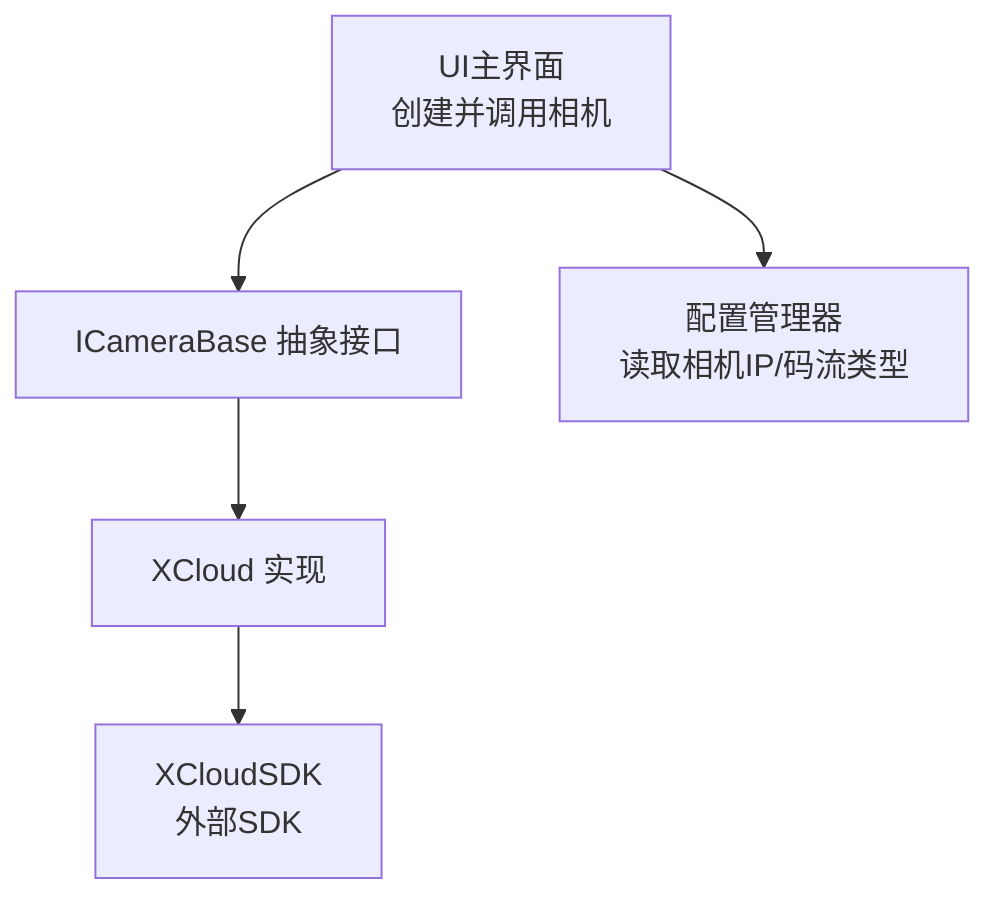
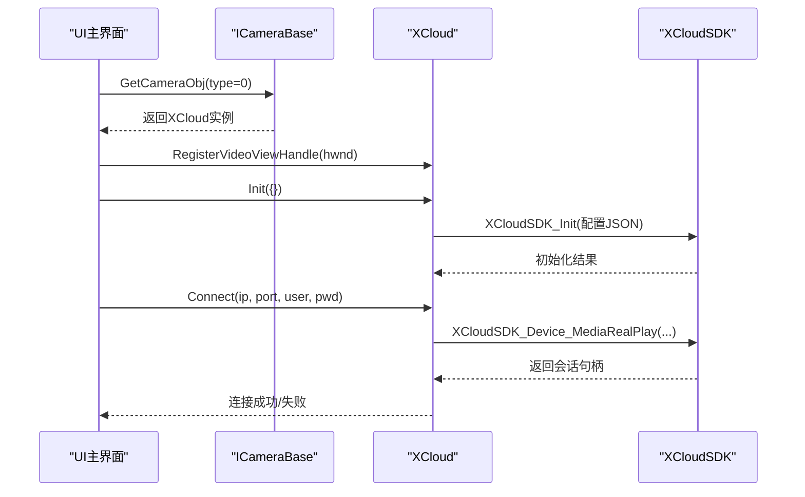
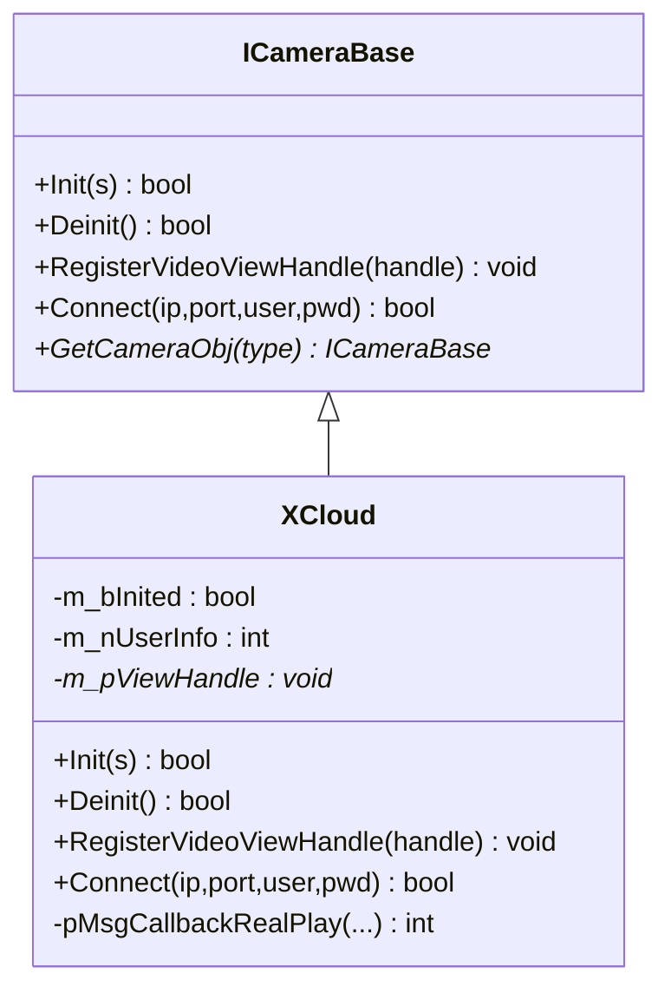
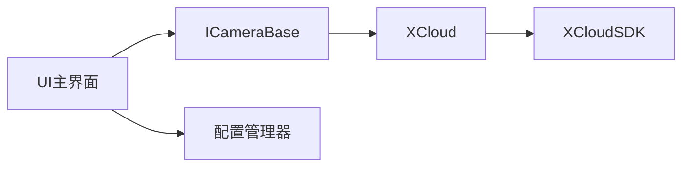

# 摄像头接口

<cite>
**本文引用的文件**
- [CameraBase.h](file://Insulator_Zero_Value_Detection_Robot/Camera/CameraBase.h)
- [CameraBase.cpp](file://Insulator_Zero_Value_Detection_Robot/Camera/CameraBase.cpp)
- [XCloud.h](file://Insulator_Zero_Value_Detection_Robot/Camera/XCloud.h)
- [XCloud.cpp](file://Insulator_Zero_Value_Detection_Robot/Camera/XCloud.cpp)
- [ConfigManager.h](file://Insulator_Zero_Value_Detection_Robot/Config/ConfigManager.h)
- [ConfigManager.cpp](file://Insulator_Zero_Value_Detection_Robot/Config/ConfigManager.cpp)
- [UI主界面](file://Insulator_Zero_Value_Detection_Robot/UI/Insulator_Zero_Value_Detection_Robot.cpp)
</cite>

## 目录
1. [简介](#简介)
2. [项目结构](#项目结构)
3. [核心组件](#核心组件)
4. [架构总览](#架构总览)
5. [详细组件分析](#详细组件分析)
6. [依赖关系分析](#依赖关系分析)
7. [性能与内存管理](#性能与内存管理)
8. [故障排查指南](#故障排查指南)
9. [结论](#结论)
10. [附录：配置与示例](#附录配置与示例)

## 简介
本文件为摄像头接口的API文档，聚焦于抽象接口 ICameraBase 及其具体实现 XCloud。内容涵盖相机初始化、视频流控制（实时播放）、图像捕获（通过回调或外部渲染）、设备连接、资源释放与异常处理等。同时说明 XCloud SDK 的集成方式与关键配置参数，并提供设备枚举、分辨率设置、编码格式的配置思路与最佳实践建议。

## 项目结构
摄像头相关代码位于 Camera 目录，包含抽象接口与具体实现；配置由 Config 模块提供；UI 层负责实例化相机对象、注册视图句柄并发起连接。

图表来源
- [UI主界面:292-313](file://Insulator_Zero_Value_Detection_Robot/UI/Insulator_Zero_Value_Detection_Robot.cpp#L292-L313)
- [CameraBase.h:5-14](file://Insulator_Zero_Value_Detection_Robot/Camera/CameraBase.h#L5-L14)
- [XCloud.h:6-15](file://Insulator_Zero_Value_Detection_Robot/Camera/XCloud.h#L6-L15)
- [XCloud.cpp:18-61](file://Insulator_Zero_Value_Detection_Robot/Camera/XCloud.cpp#L18-L61)
- [ConfigManager.h:26-37](file://Insulator_Zero_Value_Detection_Robot/Config/ConfigManager.h#L26-L37)

章节来源
- [CameraBase.h:5-14](file://Insulator_Zero_Value_Detection_Robot/Camera/CameraBase.h#L5-L14)
- [CameraBase.cpp:8-18](file://Insulator_Zero_Value_Detection_Robot/Camera/CameraBase.cpp#L8-L18)
- [XCloud.h:6-15](file://Insulator_Zero_Value_Detection_Robot/Camera/XCloud.h#L6-L15)
- [XCloud.cpp:18-61](file://Insulator_Zero_Value_Detection_Robot/Camera/XCloud.cpp#L18-L61)
- [ConfigManager.h:26-37](file://Insulator_Zero_Value_Detection_Robot/Config/ConfigManager.h#L26-L37)
- [UI主界面:292-313](file://Insulator_Zero_Value_Detection_Robot/UI/Insulator_Zero_Value_Detection_Robot.cpp#L292-L313)

## 核心组件
- ICameraBase 抽象接口：定义统一的相机能力契约，包括初始化、反初始化、注册视频显示句柄、建立媒体连接，以及工厂方法获取具体相机对象。
- XCloud 实现：基于 XCloudSDK 完成 SDK 初始化、回调注册、媒体实时播放（Connect）和反初始化流程。
- 配置模块：提供左右中相机IP、是否使用新款相机、主/子码流RTSP地址等配置项。

章节来源
- [CameraBase.h:5-14](file://Insulator_Zero_Value_Detection_Robot/Camera/CameraBase.h#L5-L14)
- [XCloud.h:6-15](file://Insulator_Zero_Value_Detection_Robot/Camera/XCloud.h#L6-L15)
- [ConfigManager.h:26-37](file://Insulator_Zero_Value_Detection_Robot/Config/ConfigManager.h#L26-L37)

## 架构总览
下图展示了从UI到SDK的整体调用链：UI 通过工厂方法获取 ICameraBase 实例，注册窗口句柄后调用 Connect 启动实时播放；XCloud 内部调用 XCloudSDK 进行媒体拉流与渲染。

图表来源
- [UI主界面:292-313](file://Insulator_Zero_Value_Detection_Robot/UI/Insulator_Zero_Value_Detection_Robot.cpp#L292-L313)
- [CameraBase.cpp:8-18](file://Insulator_Zero_Value_Detection_Robot/Camera/CameraBase.cpp#L8-L18)
- [XCloud.cpp:18-61](file://Insulator_Zero_Value_Detection_Robot/Camera/XCloud.cpp#L18-L61)

## 详细组件分析

### ICameraBase 抽象接口
- 职责
  - 初始化：Init(const std::vector<std::string>& s)
  - 反初始化：Deinit()
  - 注册视频显示句柄：RegisterVideoViewHandle(void* handle)
  - 建立媒体连接：Connect(std::string ip, int port, std::string userName, std::string pwd)
  - 工厂方法：GetCameraObj(int type)
- 设计要点
  - 纯虚接口统一上层对相机的访问方式，便于替换不同厂商SDK。
  - 工厂方法根据类型返回具体实现，当前仅支持类型0（XCloud）。

章节来源
- [CameraBase.h:5-14](file://Insulator_Zero_Value_Detection_Robot/Camera/CameraBase.h#L5-L14)
- [CameraBase.cpp:8-18](file://Insulator_Zero_Value_Detection_Robot/Camera/CameraBase.cpp#L8-L18)

### XCloud 实现
- 职责
  - 封装 XCloudSDK 的初始化、回调注册、媒体实时播放与反初始化。
  - 维护全局初始化标志与用户信息ID，确保资源正确释放。
- 关键成员与方法
  - m_bInited：标记SDK是否已初始化，避免重复初始化。
  - m_nUserInfo：SDK回调注册返回的用户信息ID，用于注销。
  - m_pViewHandle：保存UI传入的视频渲染窗口句柄。
  - pMsgCallbackRealPlay：SDK消息回调占位实现。
- 生命周期
  - 构造：初始化成员为空。
  - 析构：调用 Deinit 确保资源释放。
  - Init：执行 SDK 初始化并注册回调。
  - Connect：调用 SDK 媒体实时播放接口，将视频渲染至指定窗口句柄。
  - Deinit：注销回调并反初始化SDK。

图表来源
- [CameraBase.h:5-14](file://Insulator_Zero_Value_Detection_Robot/Camera/CameraBase.h#L5-L14)
- [XCloud.h:6-15](file://Insulator_Zero_Value_Detection_Robot/Camera/XCloud.h#L6-L15)
- [XCloud.cpp:5-69](file://Insulator_Zero_Value_Detection_Robot/Camera/XCloud.cpp#L5-L69)

章节来源
- [XCloud.h:6-15](file://Insulator_Zero_Value_Detection_Robot/Camera/XCloud.h#L6-L15)
- [XCloud.cpp:5-69](file://Insulator_Zero_Value_Detection_Robot/Camera/XCloud.cpp#L5-L69)

### 视频流控制与帧率/分辨率/编码
- 当前实现
  - 视频流通过 Connect 启动实时播放，渲染到注册的窗口句柄。
  - 未暴露帧率、分辨率、编码格式等参数设置接口。
- 扩展建议
  - 在 ICameraBase 中增加 SetResolution/SetFramerate/SetCodec 等方法，并在 XCloud 中映射到对应 SDK API。
  - 若需动态切换码流，可在 Connect 中增加 streamType 参数以选择主/子码流。

章节来源
- [XCloud.cpp:58-61](file://Insulator_Zero_Value_Detection_Robot/Camera/XCloud.cpp#L58-L61)

### 图像捕获
- 当前实现
  - 未提供显式的“抓帧”接口；视频数据通过 SDK 回调或渲染管线输出。
- 扩展建议
  - 在回调中截取帧数据，或通过 SDK 提供的抓帧接口（若有）实现离线抓取。
  - 结合 UI 层的 OpenCV 新相机模式，可复用 grab/retrieve 流程作为参考。

章节来源
- [XCloud.cpp:64-69](file://Insulator_Zero_Value_Detection_Robot/Camera/XCloud.cpp#L64-L69)

### 设备枚举
- 当前实现
  - 未提供设备枚举接口；Connect 直接按给定 IP 建立连接。
- 扩展建议
  - 新增 EnumDevices 接口，返回可用设备列表（IP、名称、能力等），供UI选择。

章节来源
- [XCloud.cpp:58-61](file://Insulator_Zero_Value_Detection_Robot/Camera/XCloud.cpp#L58-L61)

## 依赖关系分析
- UI 依赖 ICameraBase 抽象接口，通过工厂方法获取具体实现，降低耦合。
- XCloud 依赖 XCloudSDK，封装其初始化、回调、媒体播放与反初始化。
- 配置模块提供相机IP与码流类型，UI 据此决定连接目标与策略。

图表来源
- [UI主界面:292-313](file://Insulator_Zero_Value_Detection_Robot/UI/Insulator_Zero_Value_Detection_Robot.cpp#L292-L313)
- [CameraBase.cpp:8-18](file://Insulator_Zero_Value_Detection_Robot/Camera/CameraBase.cpp#L8-L18)
- [XCloud.cpp:18-61](file://Insulator_Zero_Value_Detection_Robot/Camera/XCloud.cpp#L18-L61)
- [ConfigManager.cpp:84-130](file://Insulator_Zero_Value_Detection_Robot/Config/ConfigManager.cpp#L84-L130)

章节来源
- [UI主界面:292-313](file://Insulator_Zero_Value_Detection_Robot/UI/Insulator_Zero_Value_Detection_Robot.cpp#L292-L313)
- [ConfigManager.cpp:84-130](file://Insulator_Zero_Value_Detection_Robot/Config/ConfigManager.cpp#L84-L130)

## 性能与内存管理
- 初始化与反初始化
  - 使用 m_bInited 防止重复初始化；析构时确保 Deinit 被调用，注销回调并反初始化SDK，避免资源泄漏。
- 回调与渲染
  - 注册窗口句柄后，SDK 将视频帧渲染到该窗口；确保窗口句柄有效且线程安全。
- 低延迟与缓冲
  - 在新相机模式下，OpenCV 侧设置了最小缓冲区以降低延迟；对于 XCloud 模式，建议在后续版本中引入类似策略（如减少中间缓冲、优化回调频率）。
- 线程模型
  - UI 在独立线程中执行相机连接流程，避免阻塞主线程；注意跨线程访问共享资源的同步。

章节来源
- [XCloud.cpp:18-51](file://Insulator_Zero_Value_Detection_Robot/Camera/XCloud.cpp#L18-L51)
- [UI主界面:1315-1369](file://Insulator_Zero_Value_Detection_Robot/UI/Insulator_Zero_Value_Detection_Robot.cpp#L1315-L1369)

## 故障排查指南
- 初始化失败
  - 检查 Init 返回值；确认 SDK 初始化所需路径与权限（日志、临时目录、配置文件）。
  - 若已初始化，再次调用 Init 会直接返回失败，应先 Deinit 再重试。
- 连接失败
  - 检查 IP、端口、用户名、密码是否正确；确认网络可达与设备在线。
  - 若窗口句柄无效，可能导致渲染失败；确保 RegisterVideoViewHandle 在 Connect 之前调用且句柄有效。
- 回调未触发
  - 检查回调注册是否成功（m_nUserInfo >= 0）；确认回调函数未被覆盖或提前释放。
- 资源泄漏
  - 确保程序退出前调用 Deinit；析构函数会自动调用，但需保证对象生命周期合理。
- 日志定位
  - 查看设备日志与UI日志，定位初始化、连接、回调的关键节点。

章节来源
- [XCloud.cpp:18-51](file://Insulator_Zero_Value_Detection_Robot/Camera/XCloud.cpp#L18-L51)
- [UI主界面:1315-1369](file://Insulator_Zero_Value_Detection_Robot/UI/Insulator_Zero_Value_Detection_Robot.cpp#L1315-L1369)

## 结论
本摄像头接口通过 ICameraBase 抽象出统一能力，XCloud 实现基于 XCloudSDK 完成初始化、回调注册与媒体实时播放。当前版本聚焦于基础连接与渲染，尚未暴露帧率、分辨率、编码格式等高级参数。建议在后续迭代中完善这些能力，并增强设备枚举与错误诊断，以提升易用性与稳定性。

## 附录：配置与示例

### XCloud SDK 集成与配置
- 初始化参数（JSON字符串）
  - 字段包括：日志级别、临时路径、配置路径、平台标识与应用密钥、移动卡开关、服务器IP与端口等。
  - 初始化成功后，注册消息回调并保存用户信息ID。
- 媒体实时播放
  - 调用媒体实时播放接口，传入用户信息ID、设备IP、窗口句柄等参数，启动视频流渲染。
- 反初始化
  - 先注销回调，再反初始化SDK，确保资源释放。

章节来源
- [XCloud.cpp:18-61](file://Insulator_Zero_Value_Detection_Robot/Camera/XCloud.cpp#L18-L61)

### 配置项说明（来自配置管理器）
- 相机IP
  - Left/Mid/Right：分别表示左、中、右相机IP地址。
- 新型相机模式
  - NewCamera：是否启用新版相机（RTSP）模式。
  - UseMainSp：是否使用主码流。
  - MainRtsp/SubRtsp：主/子码流的RTSP URL。
- 写入与读取
  - 配置通过 XML 文件读写，UI 修改后可持久化保存。

章节来源
- [ConfigManager.h:26-37](file://Insulator_Zero_Value_Detection_Robot/Config/ConfigManager.h#L26-L37)
- [ConfigManager.cpp:84-130](file://Insulator_Zero_Value_Detection_Robot/Config/ConfigManager.cpp#L84-L130)
- [ConfigManager.cpp:315-347](file://Insulator_Zero_Value_Detection_Robot/Config/ConfigManager.cpp#L315-L347)

### 使用流程示例（步骤式）
- 获取相机对象
  - 通过工厂方法 GetCameraObj(0) 获取 XCloud 实例。
- 注册视频窗口
  - 将UI控件的窗口句柄传递给 RegisterVideoViewHandle。
- 初始化SDK
  - 调用 Init({}) 完成SDK初始化与回调注册。
- 建立连接
  - 调用 Connect(ip, port, user, pwd) 启动实时播放。
- 资源释放
  - 退出前调用 Deinit 或依赖析构自动释放。

章节来源
- [UI主界面:292-313](file://Insulator_Zero_Value_Detection_Robot/UI/Insulator_Zero_Value_Detection_Robot.cpp#L292-L313)
- [UI主界面:1315-1369](file://Insulator_Zero_Value_Detection_Robot/UI/Insulator_Zero_Value_Detection_Robot.cpp#L1315-L1369)
- [XCloud.cpp:18-61](file://Insulator_Zero_Value_Detection_Robot/Camera/XCloud.cpp#L18-L61)