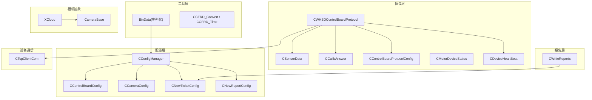
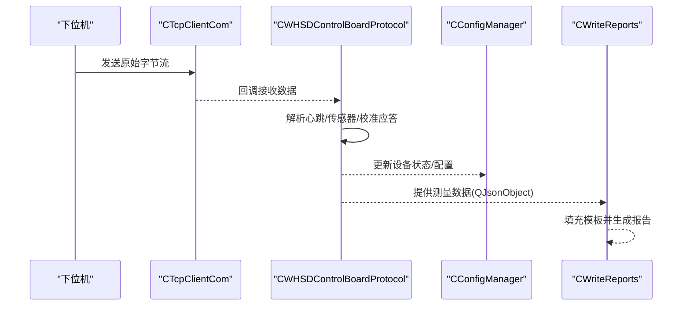
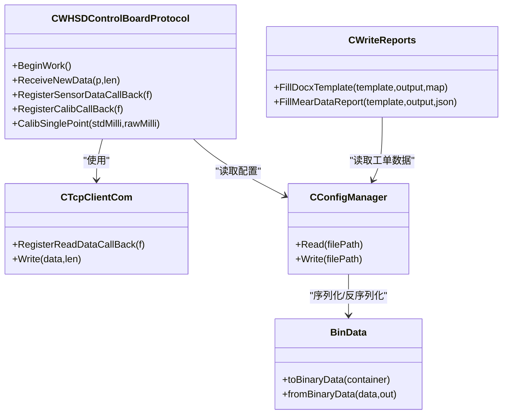

# 数据结构定义

<cite>
**本文引用的文件**
- [WHSDControlBoradProtocol.h](file://Insulator_Zero_Value_Detection_Robot/Protocol/WHSDControlBoradProtocol.h)
- [WHSDControlBoradProtocol.cpp](file://Insulator_Zero_Value_Detection_Robot/Protocol/WHSDControlBoradProtocol.cpp)
- [ConfigManager.h](file://Insulator_Zero_Value_Detection_Robot/Config/ConfigManager.h)
- [ConfigManager.cpp](file://Insulator_Zero_Value_Detection_Robot/Config/ConfigManager.cpp)
- [BinData.h](file://Insulator_Zero_Value_Detection_Robot/Tools/BinData.h)
- [WriteReports.h](file://Insulator_Zero_Value_Detection_Robot/Report/WriteReports.h)
- [TcpClient.h](file://Insulator_Zero_Value_Detection_Robot/DeviceCom/TcpClient.h)
- [CameraBase.h](file://Insulator_Zero_Value_Detection_Robot/Camera/CameraBase.h)
- [XCloud.h](file://Insulator_Zero_Value_Detection_Robot/Camera/XCloud.h)
- [ScanS_FC.h](file://Insulator_Zero_Value_Detection_Robot/Log/ScanS_FC.h)
</cite>

## 目录
1. [简介](#简介)
2. [项目结构](#项目结构)
3. [核心数据结构总览](#核心数据结构总览)
4. [架构总览](#架构总览)
5. [详细组件分析](#详细组件分析)
6. [依赖关系分析](#依赖关系分析)
7. [性能与内存布局](#性能与内存布局)
8. [序列化与反序列化指南](#序列化与反序列化指南)
9. [数据验证规则与默认值](#数据验证规则与默认值)
10. [版本兼容性与迁移策略](#版本兼容性与迁移策略)
11. [故障排查指南](#故障排查指南)
12. [结论](#结论)

## 简介
本文件面向开发者，系统化梳理绝缘子零值检测机器人系统中的核心数据结构，覆盖传感器数据、设备状态、测量结果、配置对象等。文档重点说明：
- 每个结构的字段含义、数据类型、取值范围与默认值
- 协议层与业务层的数据流转关系
- 序列化和反序列化方式（二进制、JSON、XML）
- 数据校验规则与异常处理建议
- 版本兼容性与迁移策略
- 内存布局与性能注意事项

## 项目结构
本项目采用分层组织：
- 协议层：控制板通信协议与心跳、校准应答、传感器数据封装
- 配置层：设备参数、相机参数、工单与报告配置
- 工具层：二进制序列化、时间转换、字符串转换
- 报告层：基于模板的Word报告生成，包含测量数据填充
- 设备通信：TCP客户端抽象
- 相机抽象：统一摄像头接口与具体实现

图表来源
- [WHSDControlBoradProtocol.h:7-355](file://Insulator_Zero_Value_Detection_Robot/Protocol/WHSDControlBoradProtocol.h#L7-L355)
- [ConfigManager.h:10-199](file://Insulator_Zero_Value_Detection_Robot/Config/ConfigManager.h#L10-L199)
- [BinData.h:9-73](file://Insulator_Zero_Value_Detection_Robot/Tools/BinData.h#L9-L73)
- [WriteReports.h:24-89](file://Insulator_Zero_Value_Detection_Robot/Report/WriteReports.h#L24-L89)
- [TcpClient.h:8-47](file://Insulator_Zero_Value_Detection_Robot/DeviceCom/TcpClient.h#L8-L47)
- [CameraBase.h:5-14](file://Insulator_Zero_Value_Detection_Robot/Camera/CameraBase.h#L5-L14)
- [XCloud.h:6-33](file://Insulator_Zero_Value_Detection_Robot/Camera/XCloud.h#L6-L33)

章节来源
- [WHSDControlBoradProtocol.h:7-355](file://Insulator_Zero_Value_Detection_Robot/Protocol/WHSDControlBoradProtocol.h#L7-L355)
- [ConfigManager.h:10-199](file://Insulator_Zero_Value_Detection_Robot/Config/ConfigManager.h#L10-L199)
- [BinData.h:9-73](file://Insulator_Zero_Value_Detection_Robot/Tools/BinData.h#L9-L73)
- [WriteReports.h:24-89](file://Insulator_Zero_Value_Detection_Robot/Report/WriteReports.h#L24-L89)
- [TcpClient.h:8-47](file://Insulator_Zero_Value_Detection_Robot/DeviceCom/TcpClient.h#L8-L47)
- [CameraBase.h:5-14](file://Insulator_Zero_Value_Detection_Robot/Camera/CameraBase.h#L5-L14)
- [XCloud.h:6-33](file://Insulator_Zero_Value_Detection_Robot/Camera/XCloud.h#L6-L33)

## 核心数据结构总览
本节概述系统中关键数据结构及其职责：
- 传感器数据：CSensorData
- 校准应答：CCalibAnswer
- 控制板协议配置：CControlBoardProtocolConfig
- 电机设备状态：CMotorDeviceStatus
- 设备心跳：CDeviceHeartBeat
- 控制板协议主类：CWHSDControlBoardProtocol
- 配置对象：CControlBoardConfig、CCameraConfig、CNewTicketConfig、CNewReportConfig、CConfigManager
- 报告数据模型：QJsonObject（用于测量数据表）
- 二进制序列化：toBinaryData/fromBinaryData
- 时间与字符串转换：CCFRD_Convert、CCFRD_Time

章节来源
- [WHSDControlBoradProtocol.h:7-355](file://Insulator_Zero_Value_Detection_Robot/Protocol/WHSDControlBoradProtocol.h#L7-L355)
- [ConfigManager.h:10-199](file://Insulator_Zero_Value_Detection_Robot/Config/ConfigManager.h#L10-L199)
- [BinData.h:9-73](file://Insulator_Zero_Value_Detection_Robot/Tools/BinData.h#L9-L73)
- [WriteReports.h:24-89](file://Insulator_Zero_Value_Detection_Robot/Report/WriteReports.h#L24-L89)
- [ScanS_FC.h:65-367](file://Insulator_Zero_Value_Detection_Robot/Log/ScanS_FC.h#L65-L367)

## 架构总览
系统通过协议层解析下位机数据，转换为上层可理解的结构体；配置层负责持久化与读取；报告层将测量结果写入模板生成报告；工具层提供通用序列化与时间转换能力；设备通信层负责TCP收发；相机抽象层屏蔽不同相机差异。

图表来源
- [TcpClient.h:8-47](file://Insulator_Zero_Value_Detection_Robot/DeviceCom/TcpClient.h#L8-L47)
- [WHSDControlBoradProtocol.h:189-355](file://Insulator_Zero_Value_Detection_Robot/Protocol/WHSDControlBoradProtocol.h#L189-L355)
- [ConfigManager.h:185-199](file://Insulator_Zero_Value_Detection_Robot/Config/ConfigManager.h#L185-L199)
- [WriteReports.h:24-89](file://Insulator_Zero_Value_Detection_Robot/Report/WriteReports.h#L24-L89)

## 详细组件分析

### 传感器数据 CSensorData
- 用途：表示单个传感器的命令与测量值
- 字段：
  - m_cSensorIndex：传感器索引，uint8_t
  - m_cCmd：命令类型，uint8_t
  - m_wValue：测量值，uint16_t
- 默认值：构造函数中初始化为0
- 使用场景：协议层回调上报传感器数据

章节来源
- [WHSDControlBoradProtocol.h:7-15](file://Insulator_Zero_Value_Detection_Robot/Protocol/WHSDControlBoradProtocol.h#L7-L15)
- [WHSDControlBoradProtocol.cpp:14-19](file://Insulator_Zero_Value_Detection_Robot/Protocol/WHSDControlBoradProtocol.cpp#L14-L19)

### 校准应答 CCalibAnswer
- 用途：响应0x17校准命令的结果与参数
- 字段：
  - m_cSubCmd：子命令（恢复默认/查询原始值/读回系数/补偿验证/单点定标），uint8_t
  - m_cResult：结果（0x01成功，0x00失败），uint8_t
  - m_cReason：失败原因（原始值已超时/Flash写失败/参数长度或格式错误/参数非法），uint8_t
  - m_nValue1：参数1（毫值），int32_t
  - m_nValue2：参数2（毫值），int32_t
- 方法：IsSuccess()判断是否成功
- 默认值：构造函数中初始化为0

章节来源
- [WHSDControlBoradProtocol.h:21-52](file://Insulator_Zero_Value_Detection_Robot/Protocol/WHSDControlBoradProtocol.h#L21-L52)
- [WHSDControlBoradProtocol.cpp:21-33](file://Insulator_Zero_Value_Detection_Robot/Protocol/WHSDControlBoradProtocol.cpp#L21-L33)

### 控制板协议配置 CControlBoardProtocolConfig
- 用途：下发到控制板的阈值与运行参数
- 字段：
  - m_wLidarMinDis：激光测距最近距离阈值，uint16_t
  - m_wLidarMaxDis：激光测距最远距离阈值，uint16_t
  - m_fSafeAngle：安全轮角度判断阈值（度），float
  - m_fSBAngle：成像板角度判断阈值（度），float
  - m_fWalkingV：行走电机异常电压阈值，float
  - m_fSafeV：安全轮电机异常电压阈值，float
  - m_fSBV：成像板电机异常电压阈值，float
  - m_fJYV：卷扬电机异常电压阈值，float
  - m_fJY2V：备用卷扬电机异常电压阈值，float
  - m_nSBRun：成像板运行时间阈值（毫秒），uint32_t
- 方法：GetDataByte()按顺序打包为字节数组

章节来源
- [WHSDControlBoradProtocol.h:54-111](file://Insulator_Zero_Value_Detection_Robot/Protocol/WHSDControlBoradProtocol.h#L54-L111)
- [WHSDControlBoradProtocol.cpp:35-98](file://Insulator_Zero_Value_Detection_Robot/Protocol/WHSDControlBoradProtocol.cpp#L35-L98)

### 电机设备状态 CMotorDeviceStatus
- 用途：描述单个电机的使能与状态
- 字段：
  - m_bDeviceEnable：设备使能，bool
  - m_cDeviceStatus：设备状态，uint8_t
- 默认值：构造函数中初始化

章节来源
- [WHSDControlBoradProtocol.h:113-119](file://Insulator_Zero_Value_Detection_Robot/Protocol/WHSDControlBoradProtocol.h#L113-L119)
- [WHSDControlBoradProtocol.cpp:100-104](file://Insulator_Zero_Value_Detection_Robot/Protocol/WHSDControlBoradProtocol.cpp#L100-L104)

### 设备心跳 CDeviceHeartBeat
- 用途：汇总设备各子系统状态与固件信息
- 字段：
  - m_vectorWalkingMotorStatus：行走电机状态向量，std::vector<CMotorDeviceStatus>
  - m_vectorWindmillMotorStatus：卷扬电机状态向量，std::vector<CMotorDeviceStatus>
  - m_vectorSafetyMotorStatus：安全电机状态向量，std::vector<CMotorDeviceStatus>
  - m_vectorSBMotorStatus：采样板电机状态向量，std::vector<CMotorDeviceStatus>
  - m_cBattery：电池百分比，uint8_t
  - m_cHardwareYear：固件发布年份（如2025以0x19表示），uint8_t
  - m_cHardwareMonth：固件发布月份，uint8_t
  - m_cHardwareDay：固件发布日期，uint8_t
  - m_cHardwareVersionOfDay：固件当天编译次数，uint8_t
  - m_cXRayDeviceStatus：射线机状态（空闲/延时开启中/工作完成），uint8_t
  - m_cMainPowerSupply：总电源（关/开），uint8_t
  - m_bFactoryMode：工厂模式标志，bool
- 方法：ExtractMotorStatus()从原始字节提取电机状态
- 默认值：构造函数中初始化向量大小与默认值

章节来源
- [WHSDControlBoradProtocol.h:121-187](file://Insulator_Zero_Value_Detection_Robot/Protocol/WHSDControlBoradProtocol.h#L121-L187)
- [WHSDControlBoradProtocol.cpp:106-177](file://Insulator_Zero_Value_Detection_Robot/Protocol/WHSDControlBoradProtocol.cpp#L106-L177)

### 控制板协议主类 CWHSDControlBoardProtocol
- 用途：管理协议生命周期、注册回调、构造命令、解析数据、OTA升级
- 主要方法：
  - BeginWork()/EndWork()：开始/结束工作
  - ReceiveNewData()/Parse()：接收并解析数据
  - RegisterAnswerFunction/RegisterZeroDataCallBack/RegisterDeviceHeartBeat/RegisterDeviceLog/RegisterOTAStatus/RegisterSensorDataCallBack/RegisterCalibCallBack：注册各类回调
  - DeviceRun/DeviceStop/DeviceBreak/SendNumberOfPulses/SendDelayTime/StartXRay/StopXRay/TurnOnAll/TurnOffAll/SetControlBoardConfig/SetFactoryMode/SensorCmd：设备控制命令
  - CalibReset/CalibQueryRaw/CalibReadCoef/CalibVerify/CalibSinglePoint：校准相关命令
- 私有成员：缓冲区、回调函数、心跳时间、OTA状态等

章节来源
- [WHSDControlBoradProtocol.h:189-355](file://Insulator_Zero_Value_Detection_Robot/Protocol/WHSDControlBoradProtocol.h#L189-L355)
- [WHSDControlBoradProtocol.cpp:179-200](file://Insulator_Zero_Value_Detection_Robot/Protocol/WHSDControlBoradProtocol.cpp#L179-L200)

### 配置对象
- CControlBoardConfig：控制板连接与行为配置（IP、端口、心跳间隔、工厂模式、探针角度、电机速度、绝缘阈值）
- CCameraConfig：相机配置（左右中IP、新相机标志、主码流/子码流URL）
- CNewTicketConfig：工单配置（串数类型、回路数、电流类型、线路名称、杆塔号、绝缘子片数、时间、人员、单位、备注、测量数据JSON）
- CNewReportConfig：报告配置（报告编号、检测单位、检测人员、作业地点）
- CConfigManager：配置管理器，读写XML配置文件，维护上述配置对象集合

章节来源
- [ConfigManager.h:10-199](file://Insulator_Zero_Value_Detection_Robot/Config/ConfigManager.h#L10-L199)
- [ConfigManager.cpp:8-200](file://Insulator_Zero_Value_Detection_Robot/Config/ConfigManager.cpp#L8-L200)

### 报告数据模型
- QJsonObject：用于承载测量数据，键为侧别与相别，值为测量值数组
- CWriteReports：提供模板填充与测量数据行重建方法

章节来源
- [WriteReports.h:24-89](file://Insulator_Zero_Value_Detection_Robot/Report/WriteReports.h#L24-L89)

### 二进制序列化
- toBinaryData/fromBinaryData：固定Qt版本序列化容器，支持Base64转换以便存储到INI/XML

章节来源
- [BinData.h:9-73](file://Insulator_Zero_Value_Detection_Robot/Tools/BinData.h#L9-L73)

### 时间与字符串转换
- CCFRD_Convert：数值、浮点数、时间字符串互转
- CCFRD_Time：时间对象，支持比较、时间差计算、格式化输出

章节来源
- [ScanS_FC.h:65-367](file://Insulator_Zero_Value_Detection_Robot/Log/ScanS_FC.h#L65-L367)

## 依赖关系分析
- 协议层依赖设备通信层进行数据收发
- 配置层被协议层与报告层使用
- 工具层为配置层与协议层提供序列化与时间处理能力
- 报告层依赖配置层的测量数据模型

图表来源
- [WHSDControlBoradProtocol.h:189-355](file://Insulator_Zero_Value_Detection_Robot/Protocol/WHSDControlBoradProtocol.h#L189-L355)
- [TcpClient.h:8-47](file://Insulator_Zero_Value_Detection_Robot/DeviceCom/TcpClient.h#L8-L47)
- [ConfigManager.h:185-199](file://Insulator_Zero_Value_Detection_Robot/Config/ConfigManager.h#L185-L199)
- [WriteReports.h:24-89](file://Insulator_Zero_Value_Detection_Robot/Report/WriteReports.h#L24-L89)
- [BinData.h:9-73](file://Insulator_Zero_Value_Detection_Robot/Tools/BinData.h#L9-L73)

章节来源
- [WHSDControlBoradProtocol.h:189-355](file://Insulator_Zero_Value_Detection_Robot/Protocol/WHSDControlBoradProtocol.h#L189-L355)
- [TcpClient.h:8-47](file://Insulator_Zero_Value_Detection_Robot/DeviceCom/TcpClient.h#L8-L47)
- [ConfigManager.h:185-199](file://Insulator_Zero_Value_Detection_Robot/Config/ConfigManager.h#L185-L199)
- [WriteReports.h:24-89](file://Insulator_Zero_Value_Detection_Robot/Report/WriteReports.h#L24-L89)
- [BinData.h:9-73](file://Insulator_Zero_Value_Detection_Robot/Tools/BinData.h#L9-L73)

## 性能与内存布局
- 协议层使用std::vector<uint8_t>作为数据缓冲，避免频繁分配；心跳与OTA状态使用原子变量保证线程安全
- 设备心跳中的电机状态向量固定大小为MOTOR_COUNT，减少动态扩容开销
- 配置对象的字段多为基本类型，序列化时按顺序拷贝，提升效率
- 报告生成采用模板替换与XML重写，避免全量解析与重建，提高性能

章节来源
- [WHSDControlBoradProtocol.cpp:8-11](file://Insulator_Zero_Value_Detection_Robot/Protocol/WHSDControlBoradProtocol.cpp#L8-L11)
- [WHSDControlBoradProtocol.cpp:106-177](file://Insulator_Zero_Value_Detection_Robot/Protocol/WHSDControlBoradProtocol.cpp#L106-L177)
- [ConfigManager.cpp:49-98](file://Insulator_Zero_Value_Detection_Robot/Config/ConfigManager.cpp#L49-L98)
- [WriteReports.h:73-89](file://Insulator_Zero_Value_Detection_Robot/Report/WriteReports.h#L73-L89)

## 序列化与反序列化指南
- 二进制序列化：使用toBinaryData/fromBinaryData，固定Qt_6_10版本，确保跨版本兼容
- Base64转换：binaryToBase64/base64ToBinary，便于存储到INI/XML等文本格式
- JSON序列化：配置层使用QJsonObject/QJsonDocument进行工单与报告数据的读写
- XML序列化：配置层使用tinyxml2读取/写入XML配置文件

示例路径（不展示代码内容）：
- 二进制序列化：[BinData.h:9-32](file://Insulator_Zero_Value_Detection_Robot/Tools/BinData.h#L9-L32)
- Base64转换：[BinData.h:34-44](file://Insulator_Zero_Value_Detection_Robot/Tools/BinData.h#L34-L44)
- JSON读写：[ConfigManager.cpp:1-200](file://Insulator_Zero_Value_Detection_Robot/Config/ConfigManager.cpp#L1-L200)
- XML读写：[ConfigManager.cpp:16-200](file://Insulator_Zero_Value_Detection_Robot/Config/ConfigManager.cpp#L16-L200)

章节来源
- [BinData.h:9-73](file://Insulator_Zero_Value_Detection_Robot/Tools/BinData.h#L9-L73)
- [ConfigManager.cpp:1-200](file://Insulator_Zero_Value_Detection_Robot/Config/ConfigManager.cpp#L1-L200)

## 数据验证规则与默认值
- 传感器数据：m_wValue为uint16_t，需结合传感器量程进行范围校验
- 校准应答：m_cResult为0x01表示成功，m_cReason非0表示失败原因
- 控制板协议配置：角度与电压阈值需符合硬件规格，运行时间阈值为正数
- 设备心跳：电池百分比应在0-100之间，总电源默认为关（0）
- 配置对象：IP地址需合法，端口范围为1-65535，布尔标志默认false
- 工单配置：串数类型、回路数、电流类型需枚举匹配，时间格式为yyyy-MM-dd HH:mm:ss

章节来源
- [WHSDControlBoradProtocol.h:21-52](file://Insulator_Zero_Value_Detection_Robot/Protocol/WHSDControlBoradProtocol.h#L21-L52)
- [WHSDControlBoradProtocol.h:54-111](file://Insulator_Zero_Value_Detection_Robot/Protocol/WHSDControlBoradProtocol.h#L54-L111)
- [WHSDControlBoradProtocol.h:121-187](file://Insulator_Zero_Value_Detection_Robot/Protocol/WHSDControlBoradProtocol.h#L121-L187)
- [ConfigManager.h:10-199](file://Insulator_Zero_Value_Detection_Robot/Config/ConfigManager.h#L10-L199)
- [ConfigManager.cpp:8-200](file://Insulator_Zero_Value_Detection_Robot/Config/ConfigManager.cpp#L8-L200)

## 版本兼容性与迁移策略
- 二进制序列化固定Qt_6_10版本，避免Qt升级导致无法解析
- 协议层多字节整数采用大端序，确保跨平台一致性
- 配置层XML结构向后兼容：新增字段应提供默认值与可选解析逻辑
- 报告模板占位符${key}需保持命名一致，新增字段需在模板中扩展

章节来源
- [BinData.h:14-17](file://Insulator_Zero_Value_Detection_Robot/Tools/BinData.h#L14-L17)
- [WHSDControlBoradProtocol.h:293-300](file://Insulator_Zero_Value_Detection_Robot/Protocol/WHSDControlBoradProtocol.h#L293-L300)
- [ConfigManager.cpp:16-200](file://Insulator_Zero_Value_Detection_Robot/Config/ConfigManager.cpp#L16-L200)
- [WriteReports.h:27-35](file://Insulator_Zero_Value_Detection_Robot/Report/WriteReports.h#L27-L35)

## 故障排查指南
- 传感器数据为空：检查回调是否注册，确认ReceiveNewData调用时机
- 校准失败：查看m_cReason，常见原因为原始值超时或参数非法
- 设备心跳异常：检查向量大小与电机状态提取逻辑，确认MOTOR_COUNT定义
- 配置读取失败：验证XML节点是否存在，字段类型转换是否成功
- 报告生成失败：检查模板路径、占位符映射、JSON数据完整性

章节来源
- [WHSDControlBoradProtocol.cpp:21-33](file://Insulator_Zero_Value_Detection_Robot/Protocol/WHSDControlBoradProtocol.cpp#L21-L33)
- [WHSDControlBoradProtocol.cpp:106-177](file://Insulator_Zero_Value_Detection_Robot/Protocol/WHSDControlBoradProtocol.cpp#L106-L177)
- [ConfigManager.cpp:16-200](file://Insulator_Zero_Value_Detection_Robot/Config/ConfigManager.cpp#L16-L200)
- [WriteReports.h:73-89](file://Insulator_Zero_Value_Detection_Robot/Report/WriteReports.h#L73-L89)

## 结论
本文件系统化梳理了绝缘子零值检测机器人系统的核心数据结构，涵盖传感器数据、设备状态、测量结果、配置对象等。通过明确字段含义、数据类型、取值范围与默认值，以及序列化、验证、兼容性策略，帮助开发者正确使用这些结构进行数据交换与存储。建议在扩展新功能时遵循现有设计原则，保持向后兼容与性能优化。