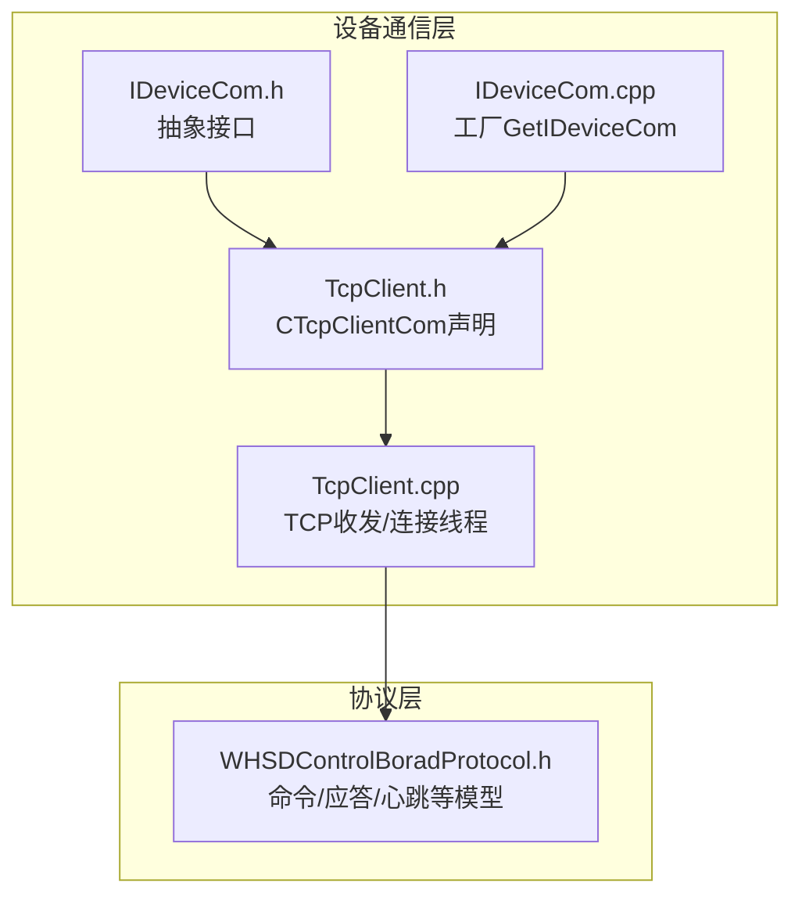
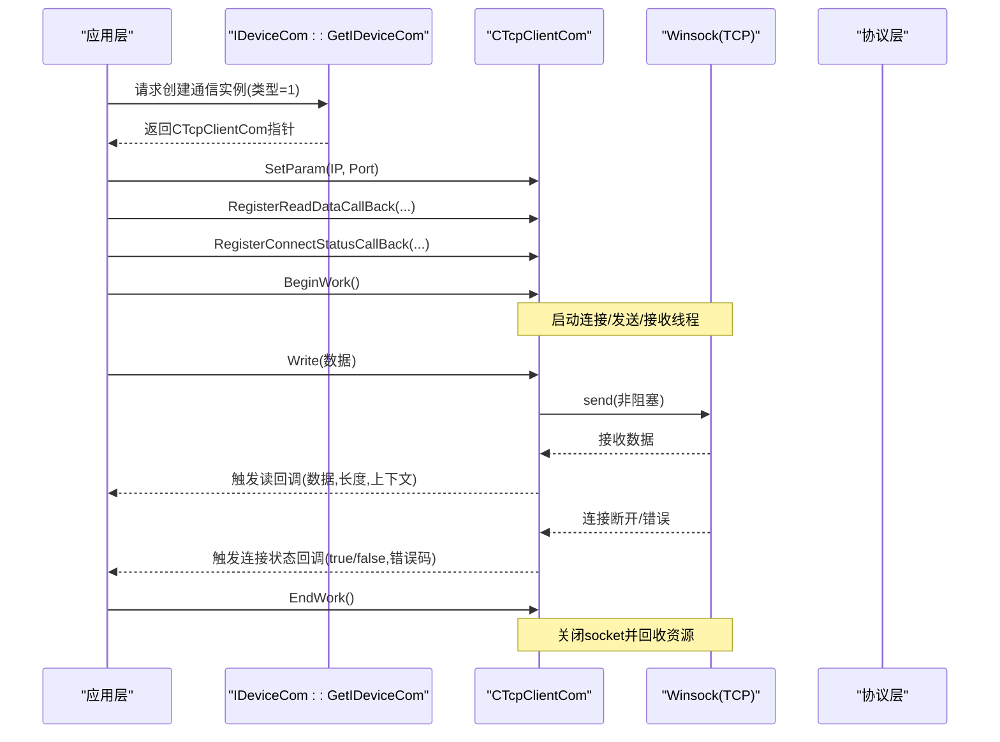
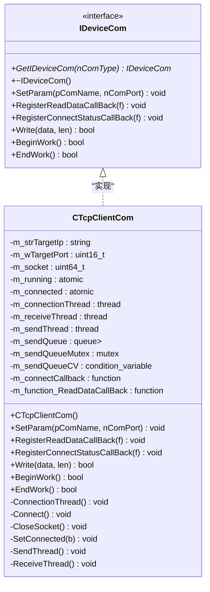
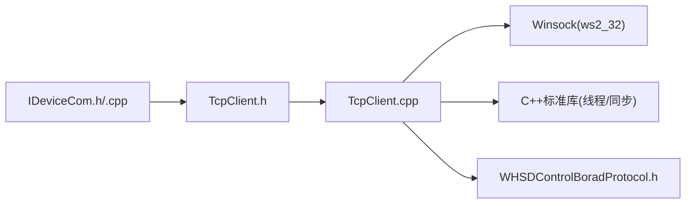

# 设备通信接口

<cite>
**本文引用的文件**
- [IDeviceCom.h](file://Insulator_Zero_Value_Detection_Robot/DeviceCom/IDeviceCom.h)
- [IDeviceCom.cpp](file://Insulator_Zero_Value_Detection_Robot/DeviceCom/IDeviceCom.cpp)
- [TcpClient.h](file://Insulator_Zero_Value_Detection_Robot/DeviceCom/TcpClient.h)
- [TcpClient.cpp](file://Insulator_Zero_Value_Detection_Robot/DeviceCom/TcpClient.cpp)
- [WHSDControlBoradProtocol.h](file://Insulator_Zero_Value_Detection_Robot/Protocol/WHSDControlBoradProtocol.h)
</cite>

## 目录
1. [简介](#简介)
2. [项目结构](#项目结构)
3. [核心组件](#核心组件)
4. [架构总览](#架构总览)
5. [详细组件分析](#详细组件分析)
6. [依赖关系分析](#依赖关系分析)
7. [性能与优化建议](#性能与优化建议)
8. [故障排查指南](#故障排查指南)
9. [结论](#结论)
10. [附录：配置选项与状态管理](#附录：配置选项与状态管理)

## 简介
本文件为设备通信接口的API文档，聚焦于抽象接口 IDeviceCom 及其 TCP 实现 CTcpClientCom。文档覆盖以下要点：
- 公共方法 API：SetParam、RegisterReadDataCallBack、RegisterConnectStatusCallBack、Write、BeginWork、EndWork 的参数、返回值与使用示例
- 工厂模式 GetIDeviceCom 的使用方法
- 回调注册机制与数据传输协议说明
- 连接管理、错误处理与性能优化的最佳实践
- TCP 通信配置选项与连接状态管理详解

## 项目结构
设备通信相关代码位于 DeviceCom 目录，包含抽象接口与具体实现；协议定义位于 Protocol 目录，提供上层业务数据模型与命令封装。

图表来源
- [IDeviceCom.h:1-15](file://Insulator_Zero_Value_Detection_Robot/DeviceCom/IDeviceCom.h#L1-L15)
- [IDeviceCom.cpp:1-13](file://Insulator_Zero_Value_Detection_Robot/DeviceCom/IDeviceCom.cpp#L1-L13)
- [TcpClient.h:1-47](file://Insulator_Zero_Value_Detection_Robot/DeviceCom/TcpClient.h#L1-L47)
- [TcpClient.cpp:1-382](file://Insulator_Zero_Value_Detection_Robot/DeviceCom/TcpClient.cpp#L1-L382)
- [WHSDControlBoradProtocol.h:1-356](file://Insulator_Zero_Value_Detection_Robot/Protocol/WHSDControlBoradProtocol.h#L1-L356)

章节来源
- [IDeviceCom.h:1-15](file://Insulator_Zero_Value_Detection_Robot/DeviceCom/IDeviceCom.h#L1-L15)
- [TcpClient.h:1-47](file://Insulator_Zero_Value_Detection_Robot/DeviceCom/TcpClient.h#L1-L47)

## 核心组件
- IDeviceCom：设备通信抽象接口，定义统一的参数设置、回调注册、写数据、生命周期控制等方法，并提供工厂方法 GetIDeviceCom 用于按类型创建具体实现。
- CTcpClientCom：基于 Winsock 的 TCP 客户端实现，维护连接、发送队列、接收线程，并通过回调将数据上报给调用方。

章节来源
- [IDeviceCom.h:1-15](file://Insulator_Zero_Value_Detection_Robot/DeviceCom/IDeviceCom.h#L1-L15)
- [TcpClient.h:1-47](file://Insulator_Zero_Value_Detection_Robot/DeviceCom/TcpClient.h#L1-L47)

## 架构总览
整体采用“抽象接口 + 具体实现”的分层设计：
- 应用层通过 IDeviceCom 接口进行通信，屏蔽底层细节
- 工厂方法根据传入类型返回具体实现（当前支持 TCP）
- CTcpClientCom 内部使用多线程（连接、发送、接收）和条件变量协调工作
- 协议层对数据进行编解码与业务语义解析

图表来源
- [IDeviceCom.cpp:4-12](file://Insulator_Zero_Value_Detection_Robot/DeviceCom/IDeviceCom.cpp#L4-L12)
- [TcpClient.cpp:27-121](file://Insulator_Zero_Value_Detection_Robot/DeviceCom/TcpClient.cpp#L27-L121)
- [TcpClient.cpp:163-236](file://Insulator_Zero_Value_Detection_Robot/DeviceCom/TcpClient.cpp#L163-L236)
- [TcpClient.cpp:238-382](file://Insulator_Zero_Value_Detection_Robot/DeviceCom/TcpClient.cpp#L238-L382)

## 详细组件分析

### IDeviceCom 抽象接口
- 职责
  - 统一设备通信能力：参数设置、回调注册、写数据、开始/结束工作
  - 提供工厂方法以多态方式获取具体通信实现
- 关键方法
  - GetIDeviceCom(int nComType)：根据类型创建实例，当前仅支持 TCP（nComType=1）
  - SetParam(const char* pComName, int nComPort)：设置目标IP与端口
  - RegisterReadDataCallBack(...)：注册读取数据回调
  - RegisterConnectStatusCallBack(...)：注册连接状态回调
  - Write(uint8_t* data, size_t len)：写入数据
  - BeginWork()/EndWork()：生命周期控制

章节来源
- [IDeviceCom.h:1-15](file://Insulator_Zero_Value_Detection_Robot/DeviceCom/IDeviceCom.h#L1-L15)
- [IDeviceCom.cpp:1-13](file://Insulator_Zero_Value_Detection_Robot/DeviceCom/IDeviceCom.cpp#L1-L13)

### CTcpClientCom 实现类
- 职责
  - 实现 TCP 客户端连接、重连、发送队列、接收循环
  - 通过回调向调用方上报数据与连接状态变化
- 关键成员与方法
  - SetParam：保存目标 IP 与端口
  - RegisterReadDataCallBack：保存读回调函数
  - RegisterConnectStatusCallBack：保存连接状态回调函数
  - Write：将数据入队并发通知发送线程
  - BeginWork：初始化 Winsock，启动连接/发送/接收线程
  - EndWork：停止运行、关闭 socket、等待线程退出、清理 Winsock
  - ConnectionThread/Connect：建立/维持连接，失败时周期性重试
  - SendThread：从队列取数据并发送，处理发送错误
  - ReceiveThread：使用 select 轮询接收数据，触发读回调，处理断链与错误
  - CloseSocket/SetConnected：安全关闭 socket 并更新连接状态

图表来源
- [IDeviceCom.h:1-15](file://Insulator_Zero_Value_Detection_Robot/DeviceCom/IDeviceCom.h#L1-L15)
- [TcpClient.h:1-47](file://Insulator_Zero_Value_Detection_Robot/DeviceCom/TcpClient.h#L1-L47)

#### 工厂模式 GetIDeviceCom 使用方法
- 用法
  - 调用 IDeviceCom::GetIDeviceCom(1) 获取 TCP 通信实例
  - 使用返回的 IDeviceCom 指针进行后续操作（SetParam、回调注册、BeginWork/EndWork、Write）
- 注意
  - 当前仅支持 nComType=1（TCP），其他值返回 nullptr
  - 需确保在 EndWork 之后释放对象（new 出的实例由调用方负责释放）

章节来源
- [IDeviceCom.cpp:4-12](file://Insulator_Zero_Value_Detection_Robot/DeviceCom/IDeviceCom.cpp#L4-L12)

#### 回调函数的注册机制
- 读数据回调
  - 注册：RegisterReadDataCallBack(std::function<void(uint8_t*, int, uint64_t)>& f)
  - 触发时机：ReceiveThread 成功 recv 到数据后
  - 参数含义：数据指针、数据长度、上下文（当前实现固定为0）
- 连接状态回调
  - 注册：RegisterConnectStatusCallBack(std::function<void(bool, int)>& f)
  - 触发时机：连接状态发生变化时（连接成功/失败、断开、错误）
  - 参数含义：是否连接、错误码（当前实现固定为0）

章节来源
- [TcpClient.cpp:33-41](file://Insulator_Zero_Value_Detection_Robot/DeviceCom/TcpClient.cpp#L33-L41)
- [TcpClient.cpp:137-150](file://Insulator_Zero_Value_Detection_Robot/DeviceCom/TcpClient.cpp#L137-L150)
- [TcpClient.cpp:323-329](file://Insulator_Zero_Value_Detection_Robot/DeviceCom/TcpClient.cpp#L323-L329)

#### 数据传输协议
- 传输层
  - 基于 TCP 流式传输，无内置帧边界或校验
- 应用层协议
  - 由协议层 WHSDControlBoradProtocol 负责打包/解析
  - 提供多种命令与应答模型（如校准、心跳、传感器数据等）
  - 多字节整数采用大端序，X值为有符号整型
- 集成方式
  - 在 ReadDataCallBack 中收到原始字节流后，交由协议层进行解析与分发

章节来源
- [WHSDControlBoradProtocol.h:17-52](file://Insulator_Zero_Value_Detection_Robot/Protocol/WHSDControlBoradProtocol.h#L17-L52)
- [WHSDControlBoradProtocol.h:189-356](file://Insulator_Zero_Value_Detection_Robot/Protocol/WHSDControlBoradProtocol.h#L189-L356)

#### 使用示例（步骤化）
- 典型流程
  1) 通过工厂获取实例：IDeviceCom* com = IDeviceCom::GetIDeviceCom(1);
  2) 设置目标地址：com->SetParam("192.168.1.100", 8080);
  3) 注册回调：
     - 读数据回调：com->RegisterReadDataCallBack({ ... });
     - 连接状态回调：com->RegisterConnectStatusCallBack({ ... });
  4) 启动通信：bool ok = com->BeginWork();
  5) 发送数据：bool sent = com->Write(buf, len);
  6) 停止通信：com->EndWork();
  7) 释放对象：delete com;
- 注意事项
  - BeginWork 前必须完成 SetParam 与回调注册
  - Write 仅在 BeginWork 且已连接时有效
  - EndWork 会关闭 socket 并等待线程退出，确保资源释放

章节来源
- [IDeviceCom.cpp:4-12](file://Insulator_Zero_Value_Detection_Robot/DeviceCom/IDeviceCom.cpp#L4-L12)
- [TcpClient.cpp:27-121](file://Insulator_Zero_Value_Detection_Robot/DeviceCom/TcpClient.cpp#L27-L121)
- [TcpClient.cpp:43-57](file://Insulator_Zero_Value_Detection_Robot/DeviceCom/TcpClient.cpp#L43-L57)

## 依赖关系分析
- 模块耦合
  - IDeviceCom 与 CTcpClientCom 通过继承解耦，便于扩展新的通信方式
  - TcpClient 依赖 Winsock（ws2_32.lib）与标准库线程/同步原语
  - 协议层独立于传输层，可在不同传输上复用
- 外部依赖
  - Windows 平台网络栈（WSAStartup/WSACleanup、socket/select/send/recv）
  - std::thread、std::mutex、std::condition_variable、std::atomic

图表来源
- [IDeviceCom.h:1-15](file://Insulator_Zero_Value_Detection_Robot/DeviceCom/IDeviceCom.h#L1-L15)
- [TcpClient.h:1-47](file://Insulator_Zero_Value_Detection_Robot/DeviceCom/TcpClient.h#L1-L47)
- [TcpClient.cpp:1-19](file://Insulator_Zero_Value_Detection_Robot/DeviceCom/TcpClient.cpp#L1-L19)
- [WHSDControlBoradProtocol.h:1-356](file://Insulator_Zero_Value_Detection_Robot/Protocol/WHSDControlBoradProtocol.h#L1-L356)

章节来源
- [TcpClient.cpp:1-19](file://Insulator_Zero_Value_Detection_Robot/DeviceCom/TcpClient.cpp#L1-L19)

## 性能与优化建议
- 发送路径
  - 使用队列+条件变量避免频繁锁竞争，批量发送可降低系统调用开销
  - 建议在应用层合并小包，减少 send 次数
- 接收路径
  - 当前使用 select 轮询，超时较短（约1秒），适合低延迟场景
  - 若数据量大，可考虑增大缓冲区或改用异步I/O（如IOCP）
- 连接管理
  - 重连间隔固定为5秒，可根据网络环境调整
  - 非阻塞套接字配合 select 提高并发能力
- 资源管理
  - 确保 BeginWork/EndWork 成对调用，避免句柄泄漏
  - 在 EndWork 中先置 m_running=false 再关闭 socket，保证线程安全退出

[本节为通用性能指导，不直接分析具体文件]

## 故障排查指南
- 常见问题
  - 无法连接：检查 IP/端口是否正确，防火墙策略，服务端是否监听
  - 频繁断连：检查网络质量，服务端是否主动断开，错误码定位
  - 发送失败：确认 BeginWork 已调用且已连接，检查队列是否被清空
- 定位手段
  - 启用调试日志（DEBUG 模式下可输出发送/接收十六进制）
  - 关注连接状态回调中的布尔值与错误码
  - 检查 select 返回值与 WSAGetLastError 的错误码
- 恢复策略
  - 连接断开后自动重连，必要时在应用层增加退避策略
  - 长时间不可达时，提示用户并允许手动重试

章节来源
- [TcpClient.cpp:163-236](file://Insulator_Zero_Value_Detection_Robot/DeviceCom/TcpClient.cpp#L163-L236)
- [TcpClient.cpp:238-382](file://Insulator_Zero_Value_Detection_Robot/DeviceCom/TcpClient.cpp#L238-L382)

## 结论
本接口通过抽象与工厂模式提供了可扩展的设备通信能力，CTcpClientCom 实现了稳定可靠的 TCP 客户端功能，结合协议层可实现完整的设备交互。遵循本文档的使用规范与最佳实践，可有效提升系统的稳定性与性能。

[本节为总结性内容，不直接分析具体文件]

## 附录：配置选项与状态管理
- TCP 配置选项
  - 目标IP：字符串形式，例如 "192.168.1.100"
  - 目标端口：无符号短整型，范围 1-65535
- 连接状态管理
  - 内部原子标志：m_running（运行）、m_connected（已连接）
  - 状态变更通过 SetConnected 统一处理，并触发连接状态回调
- 线程与同步
  - 发送队列使用互斥量保护，条件变量唤醒发送线程
  - 接收线程使用 select 进行非阻塞轮询
- 生命周期
  - BeginWork：初始化网络库、启动线程
  - EndWork：停止运行、关闭 socket、等待线程退出、清理网络库

章节来源
- [TcpClient.h:18-46](file://Insulator_Zero_Value_Detection_Robot/DeviceCom/TcpClient.h#L18-L46)
- [TcpClient.cpp:59-121](file://Insulator_Zero_Value_Detection_Robot/DeviceCom/TcpClient.cpp#L59-L121)
- [TcpClient.cpp:123-161](file://Insulator_Zero_Value_Detection_Robot/DeviceCom/TcpClient.cpp#L123-L161)