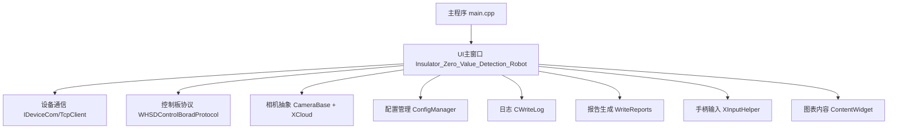
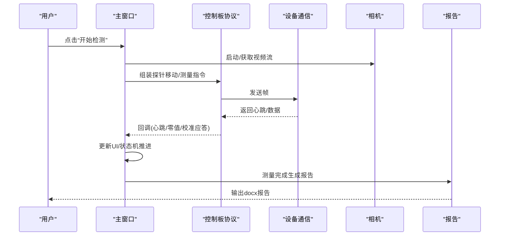
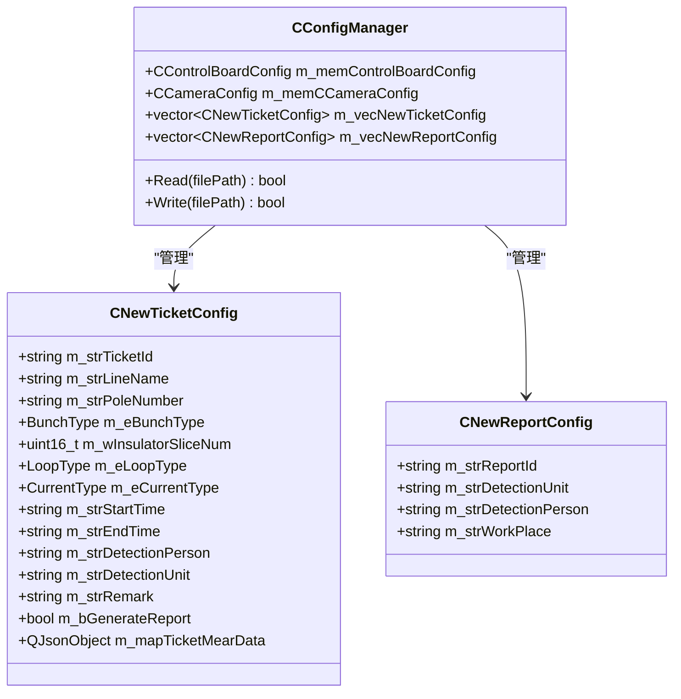
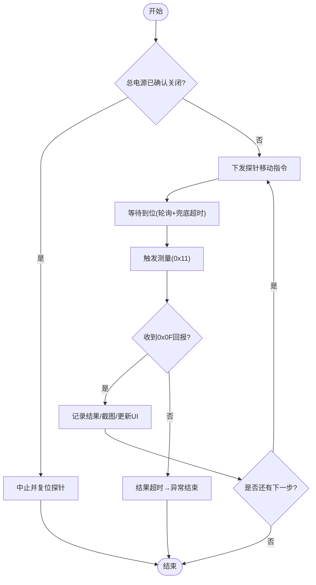
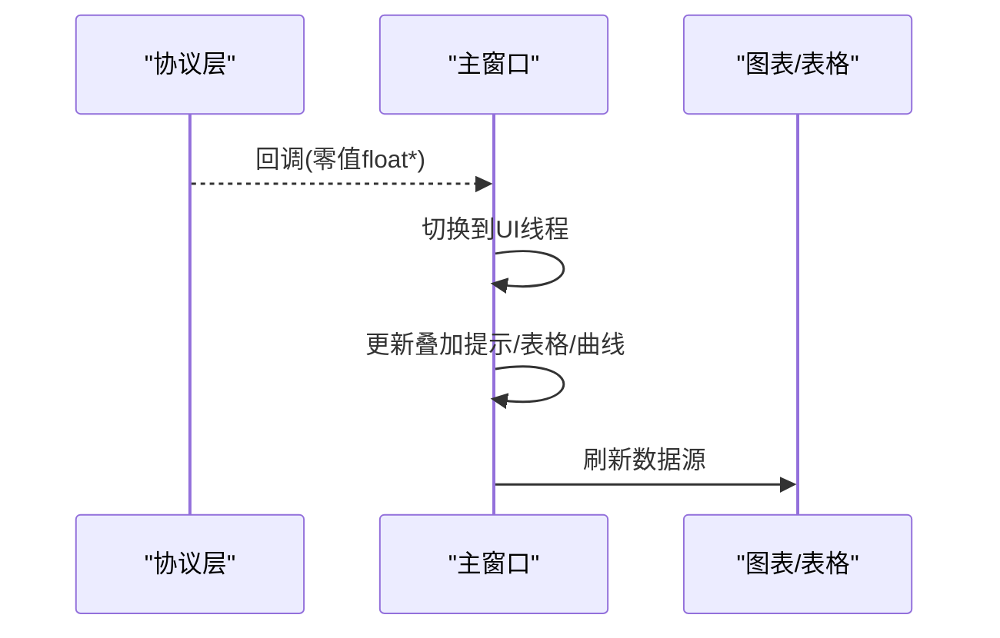
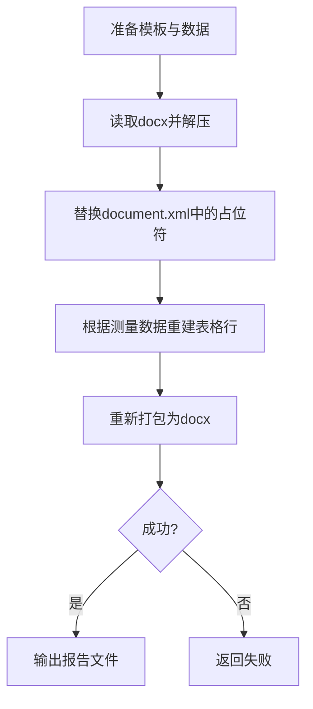
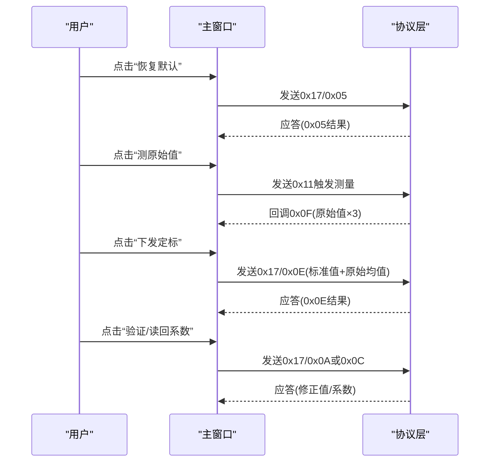
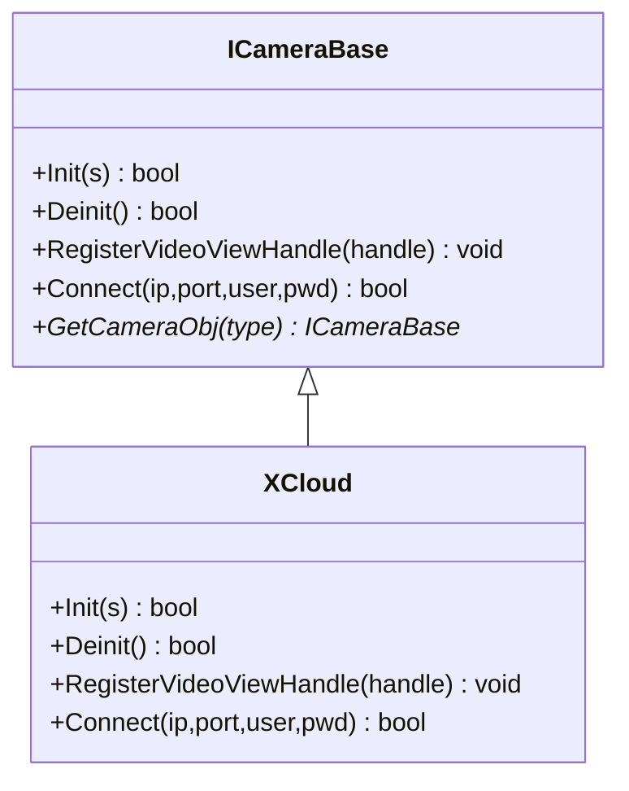
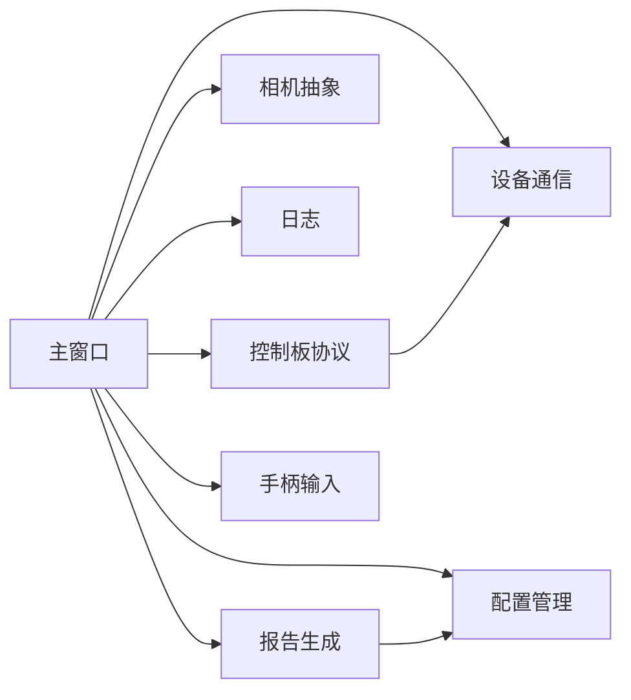

# 功能特性

<cite>
**本文引用的文件**
- [main.cpp](file://Insulator_Zero_Value_Detection_Robot/main.cpp)
- [Insulator_Zero_Value_Detection_Robot.h](file://Insulator_Zero_Value_Detection_Robot/UI/Insulator_Zero_Value_Detection_Robot.h)
- [Insulator_Zero_Value_Detection_Robot.cpp](file://Insulator_Zero_Value_Detection_Robot/UI/Insulator_Zero_Value_Detection_Robot.cpp)
- [ConfigManager.h](file://Insulator_Zero_Value_Detection_Robot/Config/ConfigManager.h)
- [IDeviceCom.h](file://Insulator_Zero_Value_Detection_Robot/DeviceCom/IDeviceCom.h)
- [WHSDControlBoradProtocol.h](file://Insulator_Zero_Value_Detection_Robot/Protocol/WHSDControlBoradProtocol.h)
- [WriteReports.h](file://Insulator_Zero_Value_Detection_Robot/Report/WriteReports.h)
- [CameraBase.h](file://Insulator_Zero_Value_Detection_Robot/Camera/CameraBase.h)
- [XCloud.h](file://Insulator_Zero_Value_Detection_Robot/Camera/XCloud.h)
- [ScanS_WriteLog.h](file://Insulator_Zero_Value_Detection_Robot/Log/ScanS_WriteLog.h)
- [XInputHelper.h](file://Insulator_Zero_Value_Detection_Robot/Tools/XInputHelper.h)
- [contentwidget.h](file://Insulator_Zero_Value_Detection_Robot/UI/contentwidget.h)
- [Insulator_Zero_Value_Detection_Robot.vcxproj](file://Insulator_Zero_Value_Detection_Robot/Insulator_Zero_Value_Detection_Robot.vcxproj)
</cite>

## 目录
1. [简介](#简介)
2. [项目结构](#项目结构)
3. [核心组件](#核心组件)
4. [架构总览](#架构总览)
5. [详细组件分析](#详细组件分析)
6. [依赖关系分析](#依赖关系分析)
7. [性能考虑](#性能考虑)
8. [故障排查指南](#故障排查指南)
9. [结论](#结论)
10. [附录：使用场景与操作示例](#附录使用场景与操作示例)

## 简介
本文件为“绝缘子零值检测机器人V2”的功能特性文档，面向现场工程师与运维人员，系统阐述检测作业管理、设备控制、数据处理与分析、报告生成、校准功能等模块的工作原理、操作流程、配置项与高级选项。文档同时说明各模块之间的关联性与数据流转过程，并提供常见使用场景与实际操作示例，帮助用户高效完成绝缘子零值检测任务。

## 项目结构
本项目采用分层模块化设计：
- UI层：Qt主窗口与对话框，承载工单管理、报告管理、测量流程交互、图表展示等。
- 协议与设备通信层：控制板协议解析、心跳与状态上报、指令封装；设备通信抽象接口与TCP实现。
- 相机子系统：统一相机抽象接口与具体实现（如XCloud），负责视频流接入与显示。
- 配置与持久化：集中管理控制板参数、相机参数、工单与报告配置。
- 日志与记录：线程安全日志写入，支持同步/异步模式。
- 报告生成：基于docx模板的占位符替换与表格数据填充。
- 工具与输入：手柄输入封装、通用工具函数、XML处理等。

图示来源
- [main.cpp:11-23](file://Insulator_Zero_Value_Detection_Robot/main.cpp#L11-L23)
- [Insulator_Zero_Value_Detection_Robot.h:26-385](file://Insulator_Zero_Value_Detection_Robot/UI/Insulator_Zero_Value_Detection_Robot.h#L26-L385)

章节来源
- [Insulator_Zero_Value_Detection_Robot.vcxproj:105-131](file://Insulator_Zero_Value_Detection_Robot/Insulator_Zero_Value_Detection_Robot.vcxproj#L105-L131)

## 核心组件
- 主窗口与流程编排：负责界面初始化、动作绑定、测量流程状态机、校准流程状态机、告警面板、工单/报告表维护。
- 设备通信抽象：提供统一的连接、读写、回调注册能力，屏蔽底层传输差异。
- 控制板协议：封装电机控制、传感器命令、校准命令、心跳解析、零值数据回调等。
- 相机子系统：统一接口对接不同相机SDK，支持主/子码流切换与视图句柄注入。
- 配置管理：集中读取/写入控制板、相机、工单、报告等配置。
- 日志系统：多线程安全写入，支持循环覆盖与格式化输出。
- 报告生成：基于docx模板的占位符替换与测量数据表格自适应填充。
- 手柄输入：轮询手柄状态并回调到UI线程进行控制映射。

章节来源
- [Insulator_Zero_Value_Detection_Robot.h:26-385](file://Insulator_Zero_Value_Detection_Robot/UI/Insulator_Zero_Value_Detection_Robot.h#L26-L385)
- [IDeviceCom.h:4-15](file://Insulator_Zero_Value_Detection_Robot/DeviceCom/IDeviceCom.h#L4-L15)
- [WHSDControlBoradProtocol.h:189-356](file://Insulator_Zero_Value_Detection_Robot/Protocol/WHSDControlBoradProtocol.h#L189-L356)
- [CameraBase.h:5-15](file://Insulator_Zero_Value_Detection_Robot/Camera/CameraBase.h#L5-L15)
- [ConfigManager.h:10-199](file://Insulator_Zero_Value_Detection_Robot/Config/ConfigManager.h#L10-L199)
- [ScanS_WriteLog.h:5-43](file://Insulator_Zero_Value_Detection_Robot/Log/ScanS_WriteLog.h#L5-L43)
- [WriteReports.h:24-89](file://Insulator_Zero_Value_Detection_Robot/Report/WriteReports.h#L24-L89)
- [XInputHelper.h:5-48](file://Insulator_Zero_Value_Detection_Robot/Tools/XInputHelper.h#L5-L48)

## 架构总览
系统以主窗口为核心编排器，通过信号槽机制协调各子系统：
- 用户操作触发测量或校准流程，主窗口根据当前状态机推进步骤。
- 设备通信层将协议指令下发至控制板，接收心跳与数据回调。
- 协议层解析心跳、零值数据、校准应答，并通过回调通知主窗口。
- 相机子系统提供实时画面，用于定位与截图。
- 配置模块提供运行参数与阈值。
- 日志模块记录关键事件与异常。
- 报告模块在测量完成后生成结构化报告。

图示来源
- [Insulator_Zero_Value_Detection_Robot.cpp:675-703](file://Insulator_Zero_Value_Detection_Robot/UI/Insulator_Zero_Value_Detection_Robot.cpp#L675-L703)
- [WHSDControlBoradProtocol.h:189-356](file://Insulator_Zero_Value_Detection_Robot/Protocol/WHSDControlBoradProtocol.h#L189-L356)
- [WriteReports.h:24-89](file://Insulator_Zero_Value_Detection_Robot/Report/WriteReports.h#L24-L89)

## 详细组件分析

### 检测作业管理（工单与报告）
- 工单管理：创建、加载、修改、删除工单；维护线路、杆塔、串数、回路、交直流类型、片数、时间戳等信息；维护测量数据JSON结构（侧别→相别/方向→测量数组）。
- 报告管理：创建、加载、删除报告；维护检测单位、人员、地点等元信息；支持生成报告标记。
- 数据模型：通过配置管理器集中存储与读写，支持跨线程传递（QVariant注册）。

图示来源
- [ConfigManager.h:39-199](file://Insulator_Zero_Value_Detection_Robot/Config/ConfigManager.h#L39-L199)

章节来源
- [ConfigManager.h:39-199](file://Insulator_Zero_Value_Detection_Robot/Config/ConfigManager.h#L39-L199)
- [Insulator_Zero_Value_Detection_Robot.h:129-133](file://Insulator_Zero_Value_Detection_Robot/UI/Insulator_Zero_Value_Detection_Robot.h#L129-L133)

### 设备控制（行走、探针、电源、电机）
- 控制指令：行走、停止、刹车、全部开/关、设置工厂模式、传感器命令等。
- 探针控制：按角度移动，配合到位轮询与兜底超时，确保测量时机准确。
- 电源管理：通过心跳判断总电源开关状态，避免在无电状态下误发指令。
- 速度/角度配置：行走电机速度、舵机速度、探针角度等由配置管理。

图示来源
- [Insulator_Zero_Value_Detection_Robot.cpp:67-73](file://Insulator_Zero_Value_Detection_Robot/UI/Insulator_Zero_Value_Detection_Robot.cpp#L67-L73)
- [Insulator_Zero_Value_Detection_Robot.cpp:2141-2176](file://Insulator_Zero_Value_Detection_Robot/UI/Insulator_Zero_Value_Detection_Robot.cpp#L2141-L2176)
- [WHSDControlBoradProtocol.h:220-255](file://Insulator_Zero_Value_Detection_Robot/Protocol/WHSDControlBoradProtocol.h#L220-L255)

章节来源
- [Insulator_Zero_Value_Detection_Robot.h:188-197](file://Insulator_Zero_Value_Detection_Robot/UI/Insulator_Zero_Value_Detection_Robot.h#L188-L197)
- [Insulator_Zero_Value_Detection_Robot.cpp:2030-2176](file://Insulator_Zero_Value_Detection_Robot/UI/Insulator_Zero_Value_Detection_Robot.cpp#L2030-L2176)
- [WHSDControlBoradProtocol.h:220-255](file://Insulator_Zero_Value_Detection_Robot/Protocol/WHSDControlBoradProtocol.h#L220-L255)

### 数据处理与分析（零值数据、曲线、图表）
- 零值数据回调：协议线程收到0x0F后，切到UI线程推进测量流程，更新叠加提示与表格/曲线。
- 数据组织：按侧别、相别/方向组织测量数组，便于后续报告填充与可视化。
- 图表展示：ContentWidget提供图表容器，结合ModelDataWidget进行数据绑定与渲染。

图示来源
- [Insulator_Zero_Value_Detection_Robot.cpp:675-703](file://Insulator_Zero_Value_Detection_Robot/UI/Insulator_Zero_Value_Detection_Robot.cpp#L675-L703)
- [contentwidget.h:12-32](file://Insulator_Zero_Value_Detection_Robot/UI/contentwidget.h#L12-L32)

章节来源
- [Insulator_Zero_Value_Detection_Robot.h:156-158](file://Insulator_Zero_Value_Detection_Robot/UI/Insulator_Zero_Value_Detection_Robot.h#L156-L158)
- [Insulator_Zero_Value_Detection_Robot.cpp:675-703](file://Insulator_Zero_Value_Detection_Robot/UI/Insulator_Zero_Value_Detection_Robot.cpp#L675-L703)

### 报告生成（docx模板与数据表填充）
- 模板填充：将docx中的${key}占位符替换为实际数据，保持样式与图片不变。
- 数据表填充：根据双联测量数据自动重建表格行，适配不同片数，单元格按固定顺序填充。
- 输出路径：自动创建输出目录，失败返回错误。

图示来源
- [WriteReports.h:24-89](file://Insulator_Zero_Value_Detection_Robot/Report/WriteReports.h#L24-L89)

章节来源
- [WriteReports.h:24-89](file://Insulator_Zero_Value_Detection_Robot/Report/WriteReports.h#L24-L89)

### 校准功能（X值单点定标）
- 流程步骤：恢复默认→测原始值（连测3次取平均）→下发定标→验证→读回系数/离线抽查。
- 协议命令：0x17子命令包括恢复默认(0x05)、查询原始值(0x06)、读回系数(0x0C)、补偿验证(0x0A)、单点定标(0x0E)。
- 超时与状态：每步进入等待态，单次超时定时器驱动；失败原因码转文字便于定位问题。

图示来源
- [Insulator_Zero_Value_Detection_Robot.h:108-127](file://Insulator_Zero_Value_Detection_Robot/UI/Insulator_Zero_Value_Detection_Robot.h#L108-L127)
- [WHSDControlBoradProtocol.h:256-287](file://Insulator_Zero_Value_Detection_Robot/Protocol/WHSDControlBoradProtocol.h#L256-L287)

章节来源
- [Insulator_Zero_Value_Detection_Robot.h:315-374](file://Insulator_Zero_Value_Detection_Robot/UI/Insulator_Zero_Value_Detection_Robot.h#L315-L374)
- [WHSDControlBoradProtocol.h:256-287](file://Insulator_Zero_Value_Detection_Robot/Protocol/WHSDControlBoradProtocol.h#L256-L287)

### 相机子系统（视频流与截图）
- 抽象接口：统一Init/Deinit/Connect/视图句柄注入，屏蔽不同相机SDK差异。
- 具体实现：XCloud对接XCloud SDK，支持主/子码流选择与用户名密码登录。
- 截图与录像：测量过程中截图保存；支持录制期间缓存帧并编码为视频文件。

图示来源
- [CameraBase.h:5-15](file://Insulator_Zero_Value_Detection_Robot/Camera/CameraBase.h#L5-L15)
- [XCloud.h:6-34](file://Insulator_Zero_Value_Detection_Robot/Camera/XCloud.h#L6-L34)

章节来源
- [Insulator_Zero_Value_Detection_Robot.h:376-384](file://Insulator_Zero_Value_Detection_Robot/UI/Insulator_Zero_Value_Detection_Robot.h#L376-L384)
- [XCloud.h:6-34](file://Insulator_Zero_Value_Detection_Robot/Camera/XCloud.h#L6-L34)

### 日志与记录
- 多线程安全：支持多对象写不同文件，单对象可跨线程调用。
- 循环覆盖：最大行数限制，防止日志无限增长。
- 同步/异步：可选择立即落盘或批量写入。

章节来源
- [ScanS_WriteLog.h:5-43](file://Insulator_Zero_Value_Detection_Robot/Log/ScanS_WriteLog.h#L5-L43)

### 手柄输入与键盘控制
- 手柄轮询：周期性读取手柄状态，标准化扳机与摇杆值，回调到UI线程。
- 键盘映射：支持探针位置、行走、停止、开始测量等操作，与手柄一致。

章节来源
- [XInputHelper.h:5-48](file://Insulator_Zero_Value_Detection_Robot/Tools/XInputHelper.h#L5-L48)
- [Insulator_Zero_Value_Detection_Robot.h:213-215](file://Insulator_Zero_Value_Detection_Robot/UI/Insulator_Zero_Value_Detection_Robot.h#L213-L215)

## 依赖关系分析
- 主窗口依赖设备通信、协议、相机、配置、日志、报告、手柄输入等模块。
- 协议层依赖设备通信进行数据收发，并向上层提供心跳、零值、校准应答等回调。
- 报告生成依赖配置中的工单/报告数据与测量结果。
- 相机子系统通过抽象接口解耦具体SDK，便于扩展。

图示来源
- [Insulator_Zero_Value_Detection_Robot.h:26-385](file://Insulator_Zero_Value_Detection_Robot/UI/Insulator_Zero_Value_Detection_Robot.h#L26-L385)
- [IDeviceCom.h:4-15](file://Insulator_Zero_Value_Detection_Robot/DeviceCom/IDeviceCom.h#L4-L15)
- [WHSDControlBoradProtocol.h:189-356](file://Insulator_Zero_Value_Detection_Robot/Protocol/WHSDControlBoradProtocol.h#L189-L356)
- [WriteReports.h:24-89](file://Insulator_Zero_Value_Detection_Robot/Report/WriteReports.h#L24-L89)

章节来源
- [Insulator_Zero_Value_Detection_Robot.h:26-385](file://Insulator_Zero_Value_Detection_Robot/UI/Insulator_Zero_Value_Detection_Robot.h#L26-L385)

## 性能考虑
- 超时与轮询：探针到位轮询周期与兜底超时、测量结果超时需合理设置，避免长时间阻塞。
- 线程安全：协议回调与UI线程分离，使用信号槽与队列连接避免竞态。
- 资源管理：相机流与录像缓存需及时释放，避免内存占用过高。
- 日志策略：生产环境建议异步写入，减少I/O阻塞。

[本节为通用指导，不直接分析具体文件]

## 故障排查指南
- 测量无返回值：检查测量结果超时逻辑与探针到位轮询；确认设备连接与电源状态。
- 校准失败：查看校准应答的原因码，对应原始值超时、Flash写失败、参数非法等。
- 报告生成失败：检查模板路径、输出目录权限、数据完整性。
- 相机无法连接：核对IP、端口、用户名密码与码流配置。

章节来源
- [Insulator_Zero_Value_Detection_Robot.cpp:2141-2176](file://Insulator_Zero_Value_Detection_Robot/UI/Insulator_Zero_Value_Detection_Robot.cpp#L2141-L2176)
- [WHSDControlBoradProtocol.h:21-52](file://Insulator_Zero_Value_Detection_Robot/Protocol/WHSDControlBoradProtocol.h#L21-L52)
- [WriteReports.h:24-89](file://Insulator_Zero_Value_Detection_Robot/Report/WriteReports.h#L24-L89)

## 结论
本系统通过清晰的模块化设计与状态机编排，实现了绝缘子零值检测的全流程自动化：从工单管理、设备控制、数据采集与分析，到报告生成与校准维护。合理的超时与轮询机制、线程安全的回调处理、以及可扩展的相机与报告模块，确保了系统的稳定性与易用性。用户可依据本文档快速上手并充分利用各项功能提升工作效率。

[本节为总结，不直接分析具体文件]

## 附录：使用场景与操作示例
- 场景一：常规检测
  - 新建工单→选择号侧与相别→点击“开始检测”→等待探针到位与测量→查看结果与曲线→生成报告。
- 场景二：复检
  - 选择目标相别→点击“复检”→软件删除最近一次测量值并重新执行流程→回填新结果。
- 场景三：手动对位
  - 使用前进/后退/探针按钮或手柄进行手动控制→确认探针角度与位置→再执行测量。
- 场景四：校准维护
  - 恢复默认→测原始值→下发定标→验证→读回系数→离线抽查。

章节来源
- [操作说明书.md:200-226](file://操作说明书.md#L200-L226)
- [Insulator_Zero_Value_Detection_Robot.cpp:2030-2176](file://Insulator_Zero_Value_Detection_Robot/UI/Insulator_Zero_Value_Detection_Robot.cpp#L2030-L2176)
- [Insulator_Zero_Value_Detection_Robot.h:108-127](file://Insulator_Zero_Value_Detection_Robot/UI/Insulator_Zero_Value_Detection_Robot.h#L108-L127)