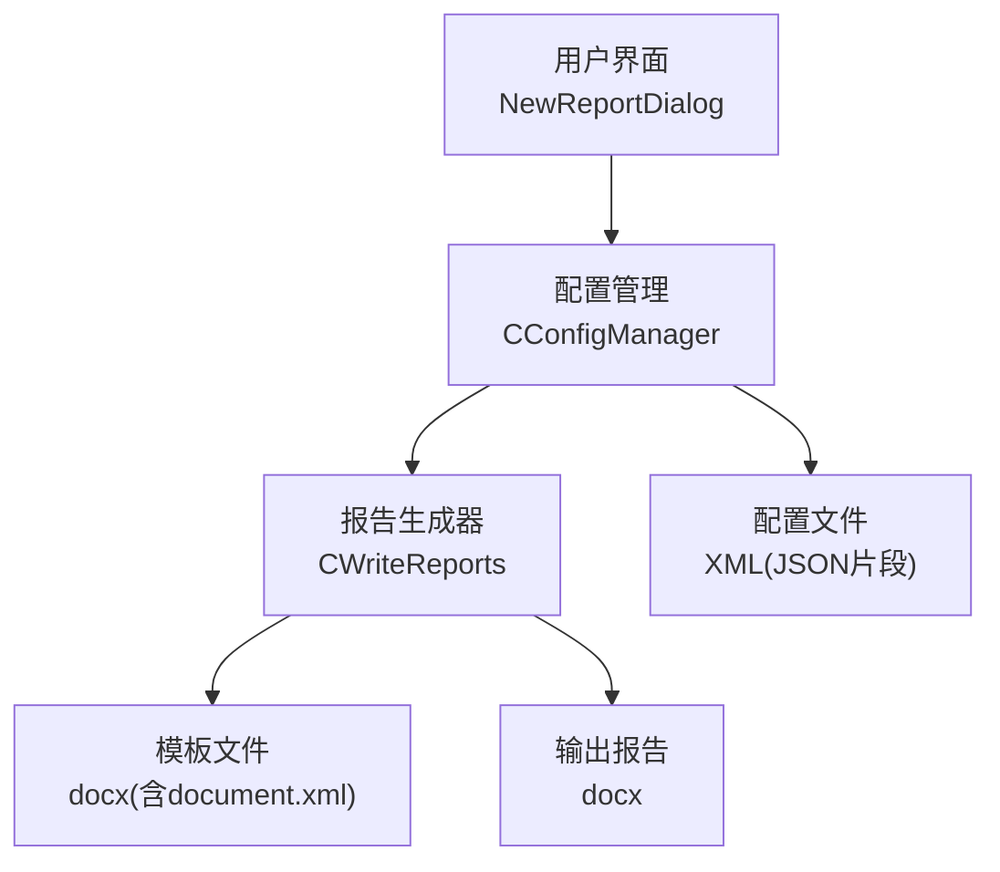
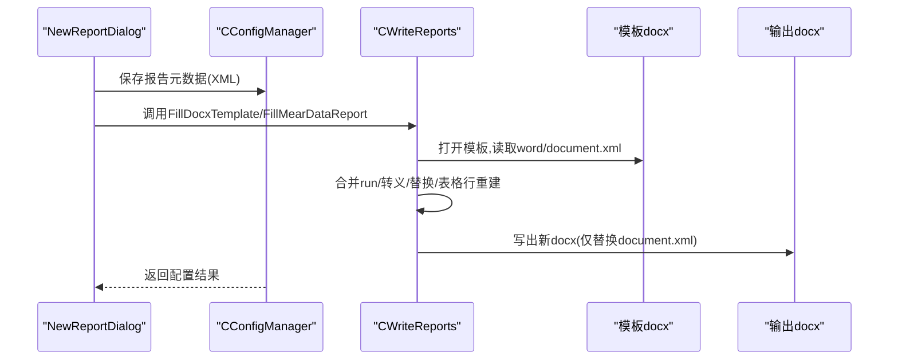
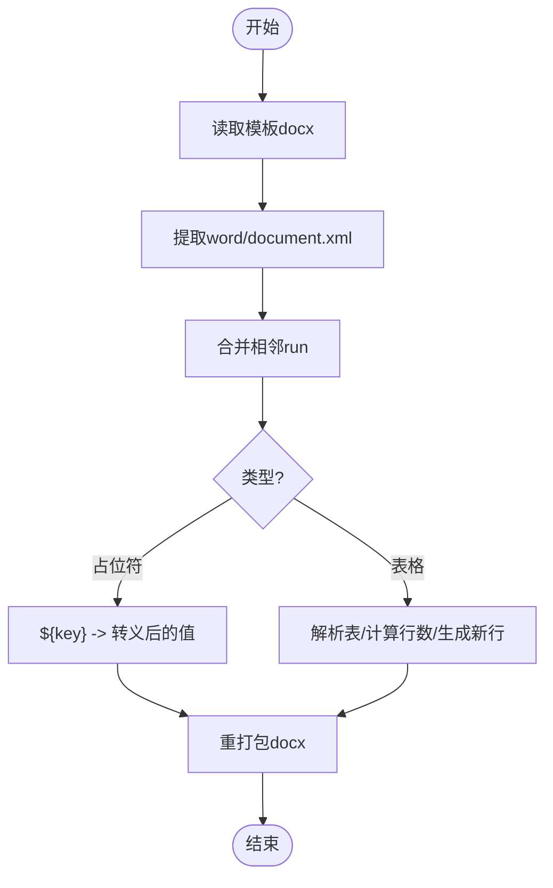
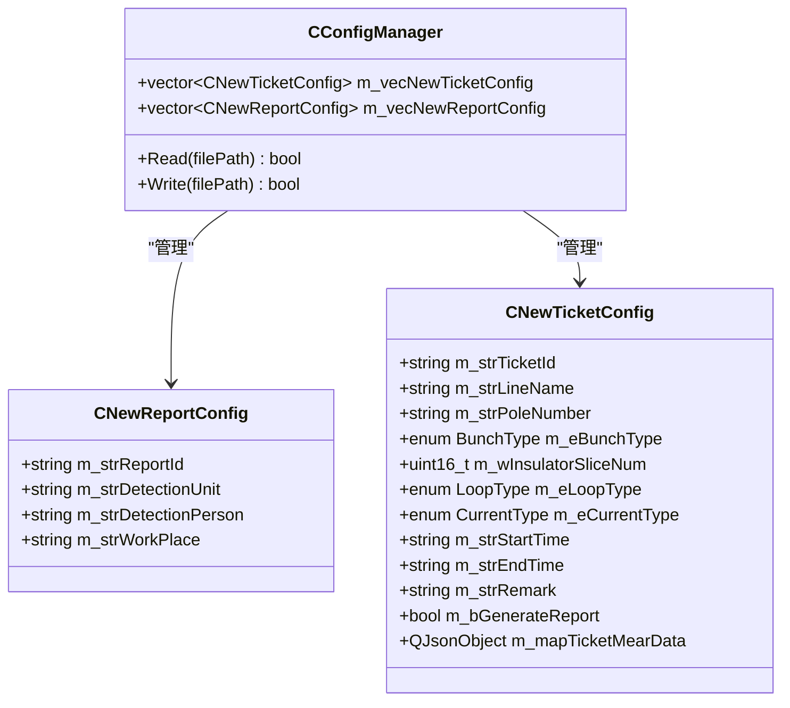
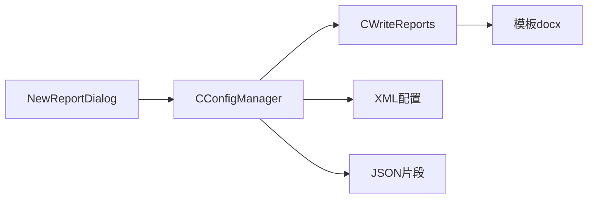

# 报告生成系统

<cite>
**本文引用的文件**
- [WriteReports.h](file://Insulator_Zero_Value_Detection_Robot/Report/WriteReports.h)
- [WriteReports.cpp](file://Insulator_Zero_Value_Detection_Robot/Report/WriteReports.cpp)
- [document.xml](file://Insulator_Zero_Value_Detection_Robot/Report/document.xml)
- [example.cpp](file://Insulator_Zero_Value_Detection_Robot/Report/example.cpp)
- [ConfigManager.h](file://Insulator_Zero_Value_Detection_Robot/Config/ConfigManager.h)
- [ConfigManager.cpp](file://Insulator_Zero_Value_Detection_Robot/Config/ConfigManager.cpp)
- [NewReportDialog.h](file://Insulator_Zero_Value_Detection_Robot/UI/NewReportDialog.h)
- [NewReportDialog.cpp](file://Insulator_Zero_Value_Detection_Robot/UI/NewReportDialog.cpp)
</cite>

## 目录
1. [简介](#简介)
2. [项目结构](#项目结构)
3. [核心组件](#核心组件)
4. [架构总览](#架构总览)
5. [详细组件分析](#详细组件分析)
6. [依赖关系分析](#依赖关系分析)
7. [性能与质量保障](#性能与质量保障)
8. [故障排查指南](#故障排查指南)
9. [结论](#结论)
10. [附录](#附录)

## 简介
本系统为绝缘子零值检测机器人提供自动化报告生成功能。其核心能力包括：
- 基于 Word docx 模板的占位符替换，生成可编辑、带样式的检测报告
- 针对“数据表”的测量数据自动填充（行数自适应）
- 报告元数据（编号、单位、人员、地点等）的配置化输入与持久化
- 通过 XML/JSON 配置管理实现历史报告的存储与检索
- 支持跨平台运行，无需安装 Microsoft Word

该系统以 Qt 为核心，采用“模板 + 数据”的方式，将业务数据注入到预定义的文档结构中，确保报告格式统一、内容准确、易于扩展。

## 项目结构
报告相关代码集中在 Report 目录，UI 与配置分别位于 UI 和 Config 目录。关键文件职责如下：
- WriteReports.h/.cpp：报告生成的核心逻辑，负责读取模板、处理 XML、写入输出
- document.xml：Word 模板正文 XML（示例），包含标题、段落、表格等结构
- example.cpp：最小可用示例，演示占位符替换流程
- ConfigManager.h/.cpp：配置读写，包含报告与工单信息、测量数据的序列化/反序列化
- NewReportDialog.h/.cpp：用户界面，用于录入报告元数据并触发后续流程

图表来源
- [NewReportDialog.cpp:19-44](file://Insulator_Zero_Value_Detection_Robot/UI/NewReportDialog.cpp#L19-L44)
- [ConfigManager.cpp:16-257](file://Insulator_Zero_Value_Detection_Robot/Config/ConfigManager.cpp#L16-L257)
- [WriteReports.cpp:40-105](file://Insulator_Zero_Value_Detection_Robot/Report/WriteReports.cpp#L40-L105)

章节来源
- [WriteReports.h:20-88](file://Insulator_Zero_Value_Detection_Robot/Report/WriteReports.h#L20-L88)
- [WriteReports.cpp:10-321](file://Insulator_Zero_Value_Detection_Robot/Report/WriteReports.cpp#L10-L321)
- [ConfigManager.h:39-199](file://Insulator_Zero_Value_Detection_Robot/Config/ConfigManager.h#L39-L199)
- [ConfigManager.cpp:16-452](file://Insulator_Zero_Value_Detection_Robot/Config/ConfigManager.cpp#L16-L452)
- [NewReportDialog.cpp:1-50](file://Insulator_Zero_Value_Detection_Robot/UI/NewReportDialog.cpp#L1-L50)

## 核心组件
- CWriteReports：提供两类报告生成能力
  - FillDocxTemplate：基于键值对占位符替换（如 ${key}）
  - FillMearDataReport：基于 JSON 测量数据填充表格行（行数自适应）
- CConfigManager：负责配置文件的读取与写入，包含报告与工单信息、测量数据（JSON）
- NewReportDialog：收集报告元数据（编号、单位、人员、地点），并通过信号传递给上层流程

章节来源
- [WriteReports.h:24-88](file://Insulator_Zero_Value_Detection_Robot/Report/WriteReports.h#L24-L88)
- [WriteReports.cpp:108-151](file://Insulator_Zero_Value_Detection_Robot/Report/WriteReports.cpp#L108-L151)
- [ConfigManager.h:39-199](file://Insulator_Zero_Value_Detection_Robot/Config/ConfigManager.h#L39-L199)
- [ConfigManager.cpp:220-257](file://Insulator_Zero_Value_Detection_Robot/Config/ConfigManager.cpp#L220-L257)
- [NewReportDialog.cpp:19-44](file://Insulator_Zero_Value_Detection_Robot/UI/NewReportDialog.cpp#L19-L44)

## 架构总览
报告生成采用“模板解析 + 数据注入”的流水线模式：
- 读取模板 docx（ZIP 容器），提取 word/document.xml
- 对 XML 执行占位符替换或表格行重建
- 保留其他资源（样式、图片、页眉页脚等）原样复制
- 写出新的 docx 文件

图表来源
- [WriteReports.cpp:40-105](file://Insulator_Zero_Value_Detection_Robot/Report/WriteReports.cpp#L40-L105)
- [WriteReports.cpp:108-151](file://Insulator_Zero_Value_Detection_Robot/Report/WriteReports.cpp#L108-L151)
- [ConfigManager.cpp:220-257](file://Insulator_Zero_Value_Detection_Robot/Config/ConfigManager.cpp#L220-L257)
- [NewReportDialog.cpp:19-44](file://Insulator_Zero_Value_Detection_Robot/UI/NewReportDialog.cpp#L19-L44)

## 详细组件分析

### 报告生成器 CWriteReports
- 技术路线
  - 将 docx 视为 ZIP 容器，直接操作内部文件
  - 仅修改 word/document.xml，其余部件（样式、图片、页眉页脚）原样保留
- 占位符替换
  - 使用 ${key} 形式的占位符
  - 自动合并被 Word 拆分的 run，使占位符成为连续文本
  - 对数据进行 XML 转义，避免 < > & 导致显示异常
- 表格数据填充
  - 解析第一张表，识别数据行（14 单元格且首列为片号数字）
  - 根据测量数据计算行数（按最大片数自适应）
  - 以样板行为模板生成多行，剥离重复 ID 避免 Word 报错
  - 每行 14 列映射：[片号, 大号A内, 大号A外, 大号B内, 大号B外, 大号C内, 大号C外, 小号A内, 小号A外, 小号B内, 小号B外, 小号C内, 小号C外]
- 数据结构
  - 测量数据为 QJsonObject，结构为 {侧别: {相别: [内侧,外侧,...]}}
  - 侧别 key 含“大号”对应左半表，“小号”对应右半表
  - 相别 key 含 'A'/'B'/'C' 对应相应列组

图表来源
- [WriteReports.cpp:20-38](file://Insulator_Zero_Value_Detection_Robot/Report/WriteReports.cpp#L20-L38)
- [WriteReports.cpp:206-320](file://Insulator_Zero_Value_Detection_Robot/Report/WriteReports.cpp#L206-L320)
- [WriteReports.cpp:40-105](file://Insulator_Zero_Value_Detection_Robot/Report/WriteReports.cpp#L40-L105)

章节来源
- [WriteReports.h:24-88](file://Insulator_Zero_Value_Detection_Robot/Report/WriteReports.h#L24-L88)
- [WriteReports.cpp:10-321](file://Insulator_Zero_Value_Detection_Robot/Report/WriteReports.cpp#L10-L321)

### 配置管理 CConfigManager
- 功能
  - 从 XML 配置中读取设备、相机、工单、报告等配置
  - 将测量数据序列化为 JSON 字符串存储在 XML 节点中
  - 支持写回配置，便于历史报告管理与复用
- 关键字段
  - 报告配置 CNewReportConfig：报告编号、检测单位、检测人员、作业地点
  - 工单配置 CNewTicketConfig：线路名称、杆塔号、串数、回路数、交直流类型、时间、备注、测量数据（QJsonObject）
- 数据流
  - 读取时：XML -> 对象（含 JSON 解析）
  - 写入时：对象 -> XML（含 JSON 序列化）

图表来源
- [ConfigManager.h:39-199](file://Insulator_Zero_Value_Detection_Robot/Config/ConfigManager.h#L39-L199)
- [ConfigManager.cpp:16-257](file://Insulator_Zero_Value_Detection_Robot/Config/ConfigManager.cpp#L16-L257)
- [ConfigManager.cpp:349-452](file://Insulator_Zero_Value_Detection_Robot/Config/ConfigManager.cpp#L349-L452)

章节来源
- [ConfigManager.h:39-199](file://Insulator_Zero_Value_Detection_Robot/Config/ConfigManager.h#L39-L199)
- [ConfigManager.cpp:16-452](file://Insulator_Zero_Value_Detection_Robot/Config/ConfigManager.cpp#L16-L452)

### 用户界面 NewReportDialog
- 功能
  - 提供表单输入报告元数据（编号、单位、人员、地点）
  - 将输入封装为 CNewReportConfig 并通过信号发出
- 交互
  - 按钮点击触发接受/拒绝槽函数
  - 设置/获取报告配置，便于编辑与展示

章节来源
- [NewReportDialog.h:10-31](file://Insulator_Zero_Value_Detection_Robot/UI/NewReportDialog.h#L10-L31)
- [NewReportDialog.cpp:4-49](file://Insulator_Zero_Value_Detection_Robot/UI/NewReportDialog.cpp#L4-L49)

### 模板与示例
- document.xml：示例模板正文，包含标题、段落、表格等结构，可用于占位符与表格填充测试
- example.cpp：最小示例，演示如何读取模板、替换占位符、写出报告

章节来源
- [document.xml:1-2](file://Insulator_Zero_Value_Detection_Robot/Report/document.xml#L1-L2)
- [example.cpp:17-71](file://Insulator_Zero_Value_Detection_Robot/Report/example.cpp#L17-L71)

## 依赖关系分析
- 模块耦合
  - UI 层依赖配置管理，用于持久化报告元数据
  - 报告生成器依赖模板文件与配置数据，不依赖外部 Word 应用
  - 配置管理依赖 XML/JSON 库进行序列化/反序列化
- 外部依赖
  - Qt Core（含私有头 qzipreader_p/qzipwriter_p）用于 ZIP 操作
  - tinyxml2 用于配置 XML 读写
  - QJsonDocument 用于 JSON 序列化/反序列化

图表来源
- [NewReportDialog.cpp:19-44](file://Insulator_Zero_Value_Detection_Robot/UI/NewReportDialog.cpp#L19-L44)
- [ConfigManager.cpp:16-257](file://Insulator_Zero_Value_Detection_Robot/Config/ConfigManager.cpp#L16-L257)
- [WriteReports.cpp:40-105](file://Insulator_Zero_Value_Detection_Robot/Report/WriteReports.cpp#L40-L105)

章节来源
- [ConfigManager.cpp:16-452](file://Insulator_Zero_Value_Detection_Robot/Config/ConfigManager.cpp#L16-L452)
- [WriteReports.cpp:40-105](file://Insulator_Zero_Value_Detection_Robot/Report/WriteReports.cpp#L40-L105)

## 性能与质量保障
- 性能特性
  - 仅处理 word/document.xml，避免全量解析复杂结构，提升效率
  - 使用正则表达式批量匹配与替换，减少多次遍历
  - 表格行重建基于样板行克隆，避免重复构造开销
- 质量控制
  - XML 转义防止特殊字符破坏文档结构
  - 合并相邻 run 保证占位符完整性
  - 剥离重复 ID 避免 Word 报“内容有问题”
  - 路径校验与空值检查，防止无效输入导致失败
- 数据验证
  - 表格数据行识别要求首列为纯数字片号，确保结构正确
  - 测量数据为空时给出警告，避免生成无意义表格
  - JSON 解析错误时跳过填充，保持模板原始结构

章节来源
- [WriteReports.cpp:10-38](file://Insulator_Zero_Value_Detection_Robot/Report/WriteReports.cpp#L10-L38)
- [WriteReports.cpp:206-320](file://Insulator_Zero_Value_Detection_Robot/Report/WriteReports.cpp#L206-L320)
- [WriteReports.cpp:40-105](file://Insulator_Zero_Value_Detection_Robot/Report/WriteReports.cpp#L40-L105)

## 故障排查指南
- 常见问题
  - 模板路径为空或模板不存在：检查输入路径与模板文件是否存在
  - 输出目录创建失败：确认权限与磁盘空间
  - 未找到数据表：检查模板是否包含 w:tbl 及数据行结构
  - 未找到数据行：确保首列为数字片号且表格有 14 列
  - JSON 解析失败：检查 TicketMearData 字段是否为合法 JSON
- 定位方法
  - 查看日志输出（qWarning）定位具体失败点
  - 对比模板结构与预期（w:tbl、w:tr、w:tc、w:t）
  - 验证测量数据键名（大号/小号、A/B/C）与数组长度

章节来源
- [WriteReports.cpp:40-105](file://Insulator_Zero_Value_Detection_Robot/Report/WriteReports.cpp#L40-L105)
- [WriteReports.cpp:206-320](file://Insulator_Zero_Value_Detection_Robot/Report/WriteReports.cpp#L206-L320)
- [ConfigManager.cpp:203-212](file://Insulator_Zero_Value_Detection_Robot/Config/ConfigManager.cpp#L203-L212)

## 结论
本报告生成系统通过模板与数据分离的设计，实现了高效、稳定、可扩展的报告自动化生成。其优势包括：
- 无需安装 Word，跨平台运行
- 模板灵活，支持占位符与表格动态填充
- 配置化管理，便于历史报告存储与检索
- 严格的数据验证与错误处理，保障报告质量

建议在实际使用中：
- 规范模板结构，确保占位符与表格布局一致
- 维护好配置文件的 JSON/XML 格式，避免解析错误
- 结合 UI 流程，完善批量生成与导出能力

## 附录

### Word 模板创建与修改指南
- 占位符定义
  - 在模板正文中使用 ${key} 形式占位符，例如 ${name}、${dept}、${phone}
  - 占位符会被替换为实际数据，支持特殊字符自动转义
- 表格模板
  - 设计包含 14 列的数据行，首列为片号（数字）
  - 列顺序需与代码映射一致：[片号, 大号A内, 大号A外, 大号B内, 大号B外, 大号C内, 大号C外, 小号A内, 小号A外, 小号B内, 小号B外, 小号C内, 小号C外]
- 样式与资源
  - 模板中的样式、图片、页眉页脚将被原样保留
  - 仅需关注 document.xml 的内容结构

章节来源
- [WriteReports.h:20-35](file://Insulator_Zero_Value_Detection_Robot/Report/WriteReports.h#L20-L35)
- [WriteReports.h:43-55](file://Insulator_Zero_Value_Detection_Robot/Report/WriteReports.h#L43-L55)
- [example.cpp:17-71](file://Insulator_Zero_Value_Detection_Robot/Report/example.cpp#L17-L71)

### 数据处理逻辑与自动化流程
- 数据源
  - 报告元数据来自 UI 输入，持久化至 XML 配置
  - 测量数据以 JSON 存储于 XML 节点，支持复杂结构
- 自动化流程
  - 读取配置 -> 组装数据 -> 调用报告生成器 -> 写出报告
  - 支持占位符替换与表格行自适应两种模式

章节来源
- [ConfigManager.cpp:16-257](file://Insulator_Zero_Value_Detection_Robot/Config/ConfigManager.cpp#L16-L257)
- [WriteReports.cpp:108-151](file://Insulator_Zero_Value_Detection_Robot/Report/WriteReports.cpp#L108-L151)

### 报告定制与格式化
- 定制选项
  - 通过占位符插入任意文本（如检测单位、人员、地点）
  - 表格行数量由数据决定，支持增删行
- 格式化功能
  - 模板样式保持不变，确保报告外观统一
  - 单元格文本自动转义，避免格式错乱

章节来源
- [WriteReports.cpp:10-38](file://Insulator_Zero_Value_Detection_Robot/Report/WriteReports.cpp#L10-L38)
- [WriteReports.cpp:153-204](file://Insulator_Zero_Value_Detection_Robot/Report/WriteReports.cpp#L153-L204)

### 历史报告存储、检索与管理
- 存储机制
  - 报告元数据与测量数据保存在 XML 配置文件中
  - 测量数据以 JSON 字符串形式嵌入 XML 节点
- 检索与管理
  - 通过 CConfigManager::Read 加载配置
  - 通过 CConfigManager::Write 更新配置，便于版本管理与归档

章节来源
- [ConfigManager.cpp:16-257](file://Insulator_Zero_Value_Detection_Robot/Config/ConfigManager.cpp#L16-L257)
- [ConfigManager.cpp:349-452](file://Insulator_Zero_Value_Detection_Robot/Config/ConfigManager.cpp#L349-L452)

### 模板扩展与自定义字段添加
- 扩展方法
  - 在模板中添加新的占位符 ${newField}
  - 在数据组装阶段注入 newField 的值
- 自定义字段
  - 可在 CNewReportConfig 或 CNewTicketConfig 中增加字段
  - 同步更新配置读写逻辑，确保持久化

章节来源
- [ConfigManager.h:39-199](file://Insulator_Zero_Value_Detection_Robot/Config/ConfigManager.h#L39-L199)
- [ConfigManager.cpp:220-257](file://Insulator_Zero_Value_Detection_Robot/Config/ConfigManager.cpp#L220-L257)

### 导出格式支持与批量生成
- 当前支持
  - 输出为 docx 格式，兼容 Microsoft Word 与其他办公软件
- 批量生成建议
  - 循环调用 FillDocxTemplate 或 FillMearDataReport，传入不同数据集合
  - 注意输出路径唯一性，避免覆盖

章节来源
- [WriteReports.cpp:108-151](file://Insulator_Zero_Value_Detection_Robot/Report/WriteReports.cpp#L108-L151)

### 质量控制与数据验证
- 控制点
  - XML 转义、run 合并、ID 剥离
  - 表格结构校验（14 列、首列数字）
  - JSON 解析错误处理
- 验证策略
  - 输入路径与模板存在性检查
  - 输出目录创建与权限检查
  - 数据为空时的警告提示

章节来源
- [WriteReports.cpp:10-38](file://Insulator_Zero_Value_Detection_Robot/Report/WriteReports.cpp#L10-L38)
- [WriteReports.cpp:206-320](file://Insulator_Zero_Value_Detection_Robot/Report/WriteReports.cpp#L206-L320)
- [WriteReports.cpp:40-105](file://Insulator_Zero_Value_Detection_Robot/Report/WriteReports.cpp#L40-L105)