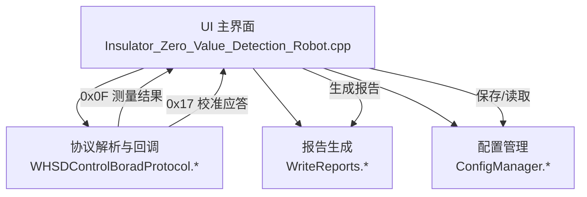
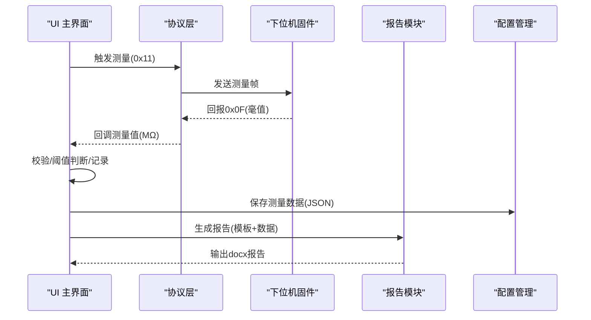
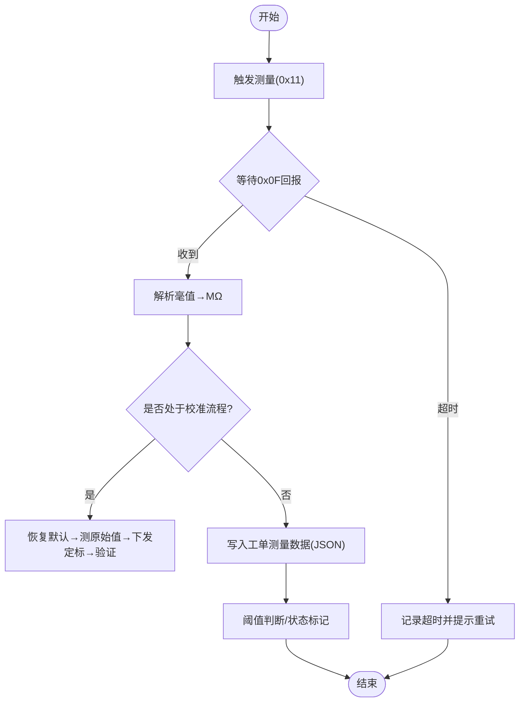
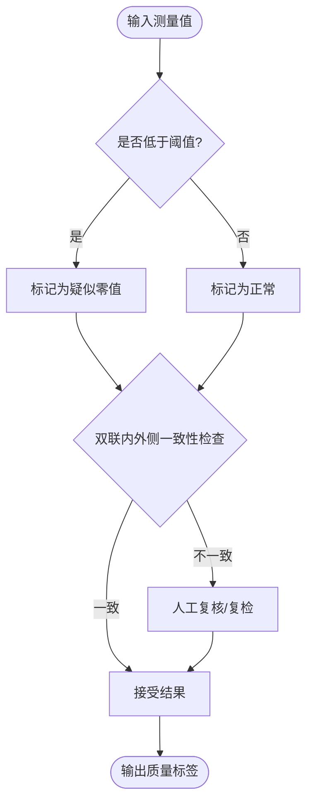
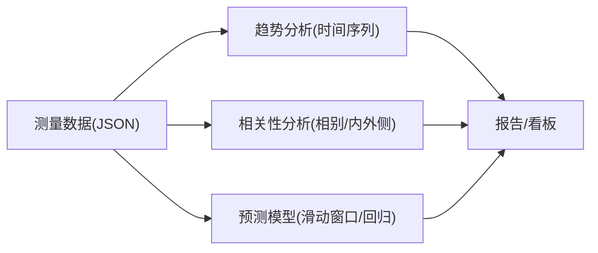
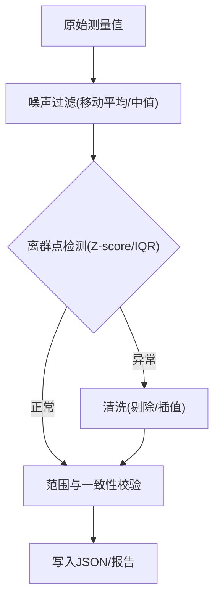
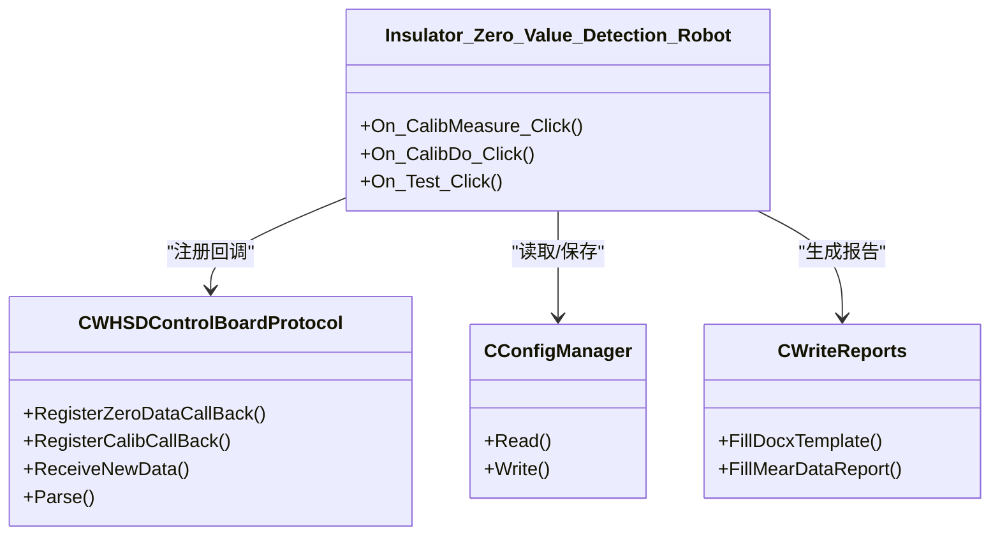
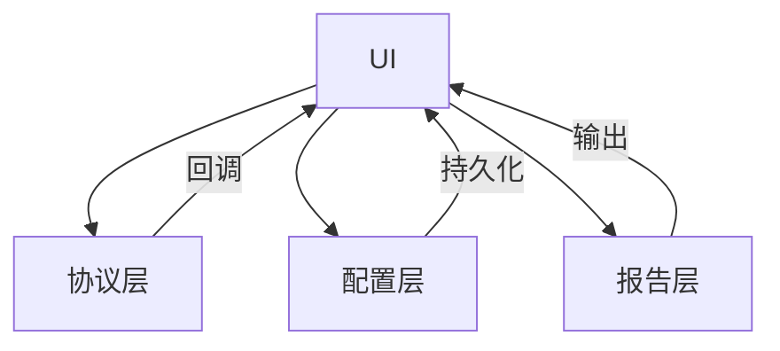

# 数据分析算法

<cite>
**本文引用的文件**
- [Insulator_Zero_Value_Detection_Robot.cpp](file://Insulator_Zero_Value_Detection_Robot/UI/Insulator_Zero_Value_Detection_Robot.cpp)
- [WHSDControlBoradProtocol.cpp](file://Insulator_Zero_Value_Detection_Robot/Protocol/WHSDControlBoradProtocol.cpp)
- [WHSDControlBoradProtocol.h](file://Insulator_Zero_Value_Detection_Robot/Protocol/WHSDControlBoradProtocol.h)
- [WriteReports.cpp](file://Insulator_Zero_Value_Detection_Robot/Report/WriteReports.cpp)
- [WriteReports.h](file://Insulator_Zero_Value_Detection_Robot/Report/WriteReports.h)
- [ConfigManager.cpp](file://Insulator_Zero_Value_Detection_Robot/Config/ConfigManager.cpp)
- [ConfigManager.h](file://Insulator_Zero_Value_Detection_Robot/Config/ConfigManager.h)
- [单点定标协议与流程_V1.0.html](file://Insulator_Zero_Value_Detection_Robot/单点定标协议与流程_V1.0.html)
- [操作说明书.md](file://操作说明书.md)
</cite>

## 目录
1. [简介](#简介)
2. [项目结构](#项目结构)
3. [核心组件](#核心组件)
4. [架构总览](#架构总览)
5. [详细组件分析](#详细组件分析)
6. [依赖关系分析](#依赖关系分析)
7. [性能考虑](#性能考虑)
8. [故障排查指南](#故障排查指南)
9. [结论](#结论)
10. [附录](#附录)

## 简介
本文件面向绝缘子零值检测机器人的“数据分析算法”部分，聚焦阻值计算、质量评估、统计分析、异常检测以及扩展接口与实时处理策略。系统通过控制板协议采集原始阻值（毫值），在固件侧完成校准补偿，上位机负责数据组织、阈值判定、报告生成与可配置参数管理。文档基于仓库中的实际代码与协议说明进行梳理，确保内容与实际实现一致。

## 项目结构
与数据分析相关的关键模块分布如下：
- UI层：测量流程控制、校准流程、结果展示与超时保护
- 协议层：帧解析、测量结果回调、校准应答解析、心跳与设备状态
- 报告层：模板填充、表格行自适应、占位符替换
- 配置层：设备参数、工单与测量数据持久化（XML+JSON）
- 协议文档：单点定标流程、命令帧与注意事项

图表来源
- [Insulator_Zero_Value_Detection_Robot.cpp:67-73](file://Insulator_Zero_Value_Detection_Robot/UI/Insulator_Zero_Value_Detection_Robot.cpp#L67-L73)
- [WHSDControlBoradProtocol.cpp:321-362](file://Insulator_Zero_Value_Detection_Robot/Protocol/WHSDControlBoradProtocol.cpp#L321-L362)
- [WriteReports.cpp:108-139](file://Insulator_Zero_Value_Detection_Robot/Report/WriteReports.cpp#L108-L139)
- [ConfigManager.cpp:16-257](file://Insulator_Zero_Value_Detection_Robot/Config/ConfigManager.cpp#L16-L257)

章节来源
- [Insulator_Zero_Value_Detection_Robot.cpp:67-73](file://Insulator_Zero_Value_Detection_Robot/UI/Insulator_Zero_Value_Detection_Robot.cpp#L67-L73)
- [操作说明书.md:376-392](file://操作说明书.md#L376-L392)

## 核心组件
- 数据采集与回调：协议层将下位机返回的测量值（毫值）转换为浮点兆欧并回调至UI层；校准应答包含成功标志、原因码与参数（系数a/b等）。
- 校准与误差评估：单点定标流程由UI驱动，依据协议文档在固件内计算补偿系数；上位机计算验证误差百分比用于显示与记录。
- 质量评估与阈值判断：配置中维护绝缘阈值；UI层结合测量数据与阈值进行状态判断（正常/疑似零值/异常）。
- 报告与统计：报告模块将测量数据按相别与号侧组织为表格行，支持双联每片内外侧两值；配置层以JSON序列化存储测量数据，便于后续趋势分析。
- 异常检测与清洗：基于阈值与历史数据的离群点识别、噪声过滤与数据清洗可在报告与配置层扩展实现。

章节来源
- [WHSDControlBoradProtocol.cpp:321-362](file://Insulator_Zero_Value_Detection_Robot/Protocol/WHSDControlBoradProtocol.cpp#L321-L362)
- [WHSDControlBoradProtocol.h:21-52](file://Insulator_Zero_Value_Detection_Robot/Protocol/WHSDControlBoradProtocol.h#L21-L52)
- [Insulator_Zero_Value_Detection_Robot.cpp:1064-1114](file://Insulator_Zero_Value_Detection_Robot/UI/Insulator_Zero_Value_Detection_Robot.cpp#L1064-L1114)
- [WriteReports.cpp:207-321](file://Insulator_Zero_Value_Detection_Robot/Report/WriteReports.cpp#L207-L321)
- [ConfigManager.cpp:16-257](file://Insulator_Zero_Value_Detection_Robot/Config/ConfigManager.cpp#L16-L257)

## 架构总览
数据流从硬件到报告的端到端路径如下：
- 触发测量：UI发送测量命令，协议层封装帧并通过串口/TCP下发
- 结果回报：协议层解析0x0F帧，提取毫值并回调给UI
- 校准流程：UI执行恢复默认、测原始值、下发定标、验证与读回系数
- 数据存储：测量数据写入工单配置（JSON），供报告生成与后续分析使用
- 报告生成：报告模块读取模板，填充占位符与动态表格行

图表来源
- [Insulator_Zero_Value_Detection_Robot.cpp:67-73](file://Insulator_Zero_Value_Detection_Robot/UI/Insulator_Zero_Value_Detection_Robot.cpp#L67-L73)
- [WHSDControlBoradProtocol.cpp:321-362](file://Insulator_Zero_Value_Detection_Robot/Protocol/WHSDControlBoradProtocol.cpp#L321-L362)
- [WriteReports.cpp:108-139](file://Insulator_Zero_Value_Detection_Robot/Report/WriteReports.cpp#L108-L139)
- [ConfigManager.cpp:16-257](file://Insulator_Zero_Value_Detection_Robot/Config/ConfigManager.cpp#L16-L257)

## 详细组件分析

### 阻值计算与校准算法
- 数据采集：协议层将0x0F回报的int32毫值转换为MΩ（除以1000），作为测量值传入UI层。
- 校准模型：单点定标时，固件内部根据标准值与实测原始值计算补偿系数c（公式参考协议文档），上位机仅做合法性检查与误差显示。
- 误差评估：验证阶段计算修正值相对标准值的误差百分比，用于显示与日志记录。
- 超时与容错：测量结果约3.2秒回报，设置超时保护避免阻塞；校准写Flash需1~2秒，应答超时建议≥3秒。

图表来源
- [Insulator_Zero_Value_Detection_Robot.cpp:67-73](file://Insulator_Zero_Value_Detection_Robot/UI/Insulator_Zero_Value_Detection_Robot.cpp#L67-L73)
- [Insulator_Zero_Value_Detection_Robot.cpp:1064-1114](file://Insulator_Zero_Value_Detection_Robot/UI/Insulator_Zero_Value_Detection_Robot.cpp#L1064-L1114)
- [单点定标协议与流程_V1.0.html:93-138](file://Insulator_Zero_Value_Detection_Robot/单点定标协议与流程_V1.0.html#L93-L138)

章节来源
- [WHSDControlBoradProtocol.cpp:321-362](file://Insulator_Zero_Value_Detection_Robot/Protocol/WHSDControlBoradProtocol.cpp#L321-L362)
- [Insulator_Zero_Value_Detection_Robot.cpp:1064-1114](file://Insulator_Zero_Value_Detection_Robot/UI/Insulator_Zero_Value_Detection_Robot.cpp#L1064-L1114)
- [单点定标协议与流程_V1.0.html:93-138](file://Insulator_Zero_Value_Detection_Robot/单点定标协议与流程_V1.0.html#L93-L138)

### 质量评估与故障识别
- 阈值判定：配置项维护绝缘阈值；UI层在测量完成后根据阈值对每片绝缘子进行状态判断（正常/疑似零值/异常）。
- 故障识别：若测量值低于阈值或出现连续低值，标记为潜在零值串；结合双联内外侧数据与历史数据进行交叉验证。
- 可靠性分析：通过多次测量取平均、校准后验证误差百分比评估测量可靠性；超差或漂移时提示重新校准。

图表来源
- [ConfigManager.h:10-24](file://Insulator_Zero_Value_Detection_Robot/Config/ConfigManager.h#L10-L24)
- [Insulator_Zero_Value_Detection_Robot.cpp:2030-2053](file://Insulator_Zero_Value_Detection_Robot/UI/Insulator_Zero_Value_Detection_Robot.cpp#L2030-L2053)

章节来源
- [ConfigManager.h:10-24](file://Insulator_Zero_Value_Detection_Robot/Config/ConfigManager.h#L10-L24)
- [Insulator_Zero_Value_Detection_Robot.cpp:2030-2053](file://Insulator_Zero_Value_Detection_Robot/UI/Insulator_Zero_Value_Detection_Robot.cpp#L2030-L2053)

### 统计分析方法
- 趋势分析：配置层将测量数据以JSON格式持久化，键结构为“侧别→相别→数组”，便于按时间序列进行趋势可视化与回归分析。
- 相关性分析：可对同串不同相别、内外侧数据进行相关性计算，识别系统性偏差或接触不良。
- 预测模型：基于历史JSON数据，可采用滑动窗口统计（均值、方差）或简单线性回归进行短期趋势预测，辅助维护决策。

图表来源
- [ConfigManager.cpp:16-257](file://Insulator_Zero_Value_Detection_Robot/Config/ConfigManager.cpp#L16-L257)
- [WriteReports.cpp:207-321](file://Insulator_Zero_Value_Detection_Robot/Report/WriteReports.cpp#L207-L321)

章节来源
- [ConfigManager.cpp:16-257](file://Insulator_Zero_Value_Detection_Robot/Config/ConfigManager.cpp#L16-L257)
- [WriteReports.cpp:207-321](file://Insulator_Zero_Value_Detection_Robot/Report/WriteReports.cpp#L207-L321)

### 异常检测与数据清洗
- 离群点识别：基于阈值与统计分布（如Z-score或IQR）识别异常值；结合双联内外侧一致性进行二次确认。
- 噪声过滤：对短时间内的波动采用移动平均或中值滤波平滑；对明显跳变点进行剔除或插值修复。
- 数据清洗：在写入JSON前进行范围校验、重复值去重、缺失值补全；报告生成时对无效数据行进行跳过或标注。

图表来源
- [ConfigManager.cpp:16-257](file://Insulator_Zero_Value_Detection_Robot/Config/ConfigManager.cpp#L16-L257)
- [WriteReports.cpp:207-321](file://Insulator_Zero_Value_Detection_Robot/Report/WriteReports.cpp#L207-L321)

章节来源
- [ConfigManager.cpp:16-257](file://Insulator_Zero_Value_Detection_Robot/Config/ConfigManager.cpp#L16-L257)
- [WriteReports.cpp:207-321](file://Insulator_Zero_Value_Detection_Robot/Report/WriteReports.cpp#L207-L321)

### 自定义分析算法扩展接口
- 回调机制：协议层提供测量结果回调与校准应答回调，可在UI层接入自定义逻辑（如在线异常检测、实时趋势更新）。
- 配置扩展：配置管理器支持读写设备参数、相机参数、工单与报告信息；可在XML中添加新的分析参数节点，并在UI中暴露配置入口。
- 报告模板：报告模块支持占位符替换与表格行自适应，可通过扩展模板字段引入自定义指标（如置信区间、风险等级）。

图表来源
- [WHSDControlBoradProtocol.h:202-216](file://Insulator_Zero_Value_Detection_Robot/Protocol/WHSDControlBoradProtocol.h#L202-L216)
- [Insulator_Zero_Value_Detection_Robot.cpp:1064-1114](file://Insulator_Zero_Value_Detection_Robot/UI/Insulator_Zero_Value_Detection_Robot.cpp#L1064-L1114)
- [ConfigManager.cpp:16-257](file://Insulator_Zero_Value_Detection_Robot/Config/ConfigManager.cpp#L16-L257)
- [WriteReports.cpp:108-139](file://Insulator_Zero_Value_Detection_Robot/Report/WriteReports.cpp#L108-L139)

章节来源
- [WHSDControlBoradProtocol.h:202-216](file://Insulator_Zero_Value_Detection_Robot/Protocol/WHSDControlBoradProtocol.h#L202-L216)
- [Insulator_Zero_Value_Detection_Robot.cpp:1064-1114](file://Insulator_Zero_Value_Detection_Robot/UI/Insulator_Zero_Value_Detection_Robot.cpp#L1064-L1114)
- [ConfigManager.cpp:16-257](file://Insulator_Zero_Value_Detection_Robot/Config/ConfigManager.cpp#L16-L257)
- [WriteReports.cpp:108-139](file://Insulator_Zero_Value_Detection_Robot/Report/WriteReports.cpp#L108-L139)

### 实时计算与性能优化
- 超时保护：测量结果约3.2秒回报，设置8秒超时；探针到位轮询周期100ms，兜底等待4秒，避免长时间阻塞。
- 批量处理：校准流程连测3次取平均，降低随机噪声影响；报告生成时动态构建表格行，减少内存占用。
- I/O优化：配置读写采用XML+JSON混合存储，测量数据紧凑序列化；报告生成直接操作ZIP容器中的XML，避免中间文件过多。

章节来源
- [Insulator_Zero_Value_Detection_Robot.cpp:67-73](file://Insulator_Zero_Value_Detection_Robot/UI/Insulator_Zero_Value_Detection_Robot.cpp#L67-L73)
- [Insulator_Zero_Value_Detection_Robot.cpp:979-1005](file://Insulator_Zero_Value_Detection_Robot/UI/Insulator_Zero_Value_Detection_Robot.cpp#L979-L1005)
- [WriteReports.cpp:41-105](file://Insulator_Zero_Value_Detection_Robot/Report/WriteReports.cpp#L41-L105)

## 依赖关系分析
- UI与协议：UI通过协议层回调接收测量值与校准应答；协议层负责帧解析与错误处理。
- UI与配置：UI读取/保存设备参数与工单数据；配置层负责XML与JSON的序列化/反序列化。
- UI与报告：UI调用报告模块生成docx；报告模块依赖模板与测量数据。

图表来源
- [WHSDControlBoradProtocol.cpp:321-362](file://Insulator_Zero_Value_Detection_Robot/Protocol/WHSDControlBoradProtocol.cpp#L321-L362)
- [ConfigManager.cpp:16-257](file://Insulator_Zero_Value_Detection_Robot/Config/ConfigManager.cpp#L16-L257)
- [WriteReports.cpp:108-139](file://Insulator_Zero_Value_Detection_Robot/Report/WriteReports.cpp#L108-L139)

章节来源
- [WHSDControlBoradProtocol.cpp:321-362](file://Insulator_Zero_Value_Detection_Robot/Protocol/WHSDControlBoradProtocol.cpp#L321-L362)
- [ConfigManager.cpp:16-257](file://Insulator_Zero_Value_Detection_Robot/Config/ConfigManager.cpp#L16-L257)
- [WriteReports.cpp:108-139](file://Insulator_Zero_Value_Detection_Robot/Report/WriteReports.cpp#L108-L139)

## 性能考虑
- 测量时序：合理设置探针到位轮询与结果超时，避免死锁与资源浪费。
- 校准稳定性：连测多次取平均，减少瞬时噪声；校准前后进行验证，确保系数有效。
- 报告生成：模板占位符合并与表格行动态构建，提升渲染效率；避免频繁I/O，批量写入。

[本节为通用指导，不直接分析具体文件]

## 故障排查指南
- 校准失败：检查原因码（如参数非法、Flash写失败），确认标准值与原始值范围；必要时重新恢复默认并复测。
- 测量超时：确认心跳与链路状态；检查探针到位信号与测量模块工作状态。
- 报告异常：检查模板路径与占位符匹配；确认测量数据JSON结构正确。

章节来源
- [Insulator_Zero_Value_Detection_Robot.cpp:1267-1292](file://Insulator_Zero_Value_Detection_Robot/UI/Insulator_Zero_Value_Detection_Robot.cpp#L1267-L1292)
- [单点定标协议与流程_V1.0.html:93-138](file://Insulator_Zero_Value_Detection_Robot/单点定标协议与流程_V1.0.html#L93-L138)
- [操作说明书.md:376-392](file://操作说明书.md#L376-L392)

## 结论
本系统通过协议层可靠的数据采集与回调机制，结合UI层的校准流程与阈值判定，实现了绝缘子阻值的准确测量与质量评估。配置层与报告层提供了灵活的数据持久化与可视化能力，支持趋势分析、相关性分析与预测模型的扩展。通过超时保护、批量处理与I/O优化，系统在实时性与稳定性方面具备良好表现。未来可在异常检测与预测模型上进一步引入更复杂的统计学习方法，以提升诊断精度与维护效率。

[本节为总结性内容，不直接分析具体文件]

## 附录
- 单点定标协议要点：恢复默认、测原始值、下发定标、验证与读回系数；注意心跳保持与超时设置。
- 配置项说明：设备IP、端口、心跳间隔、探针角度、电机速度、绝缘阈值等；工单与报告信息持久化。
- 报告模板：占位符替换与表格行自适应；支持双联内外侧数据填充。

章节来源
- [单点定标协议与流程_V1.0.html:93-138](file://Insulator_Zero_Value_Detection_Robot/单点定标协议与流程_V1.0.html#L93-L138)
- [ConfigManager.h:10-24](file://Insulator_Zero_Value_Detection_Robot/Config/ConfigManager.h#L10-L24)
- [WriteReports.h:20-55](file://Insulator_Zero_Value_Detection_Robot/Report/WriteReports.h#L20-L55)