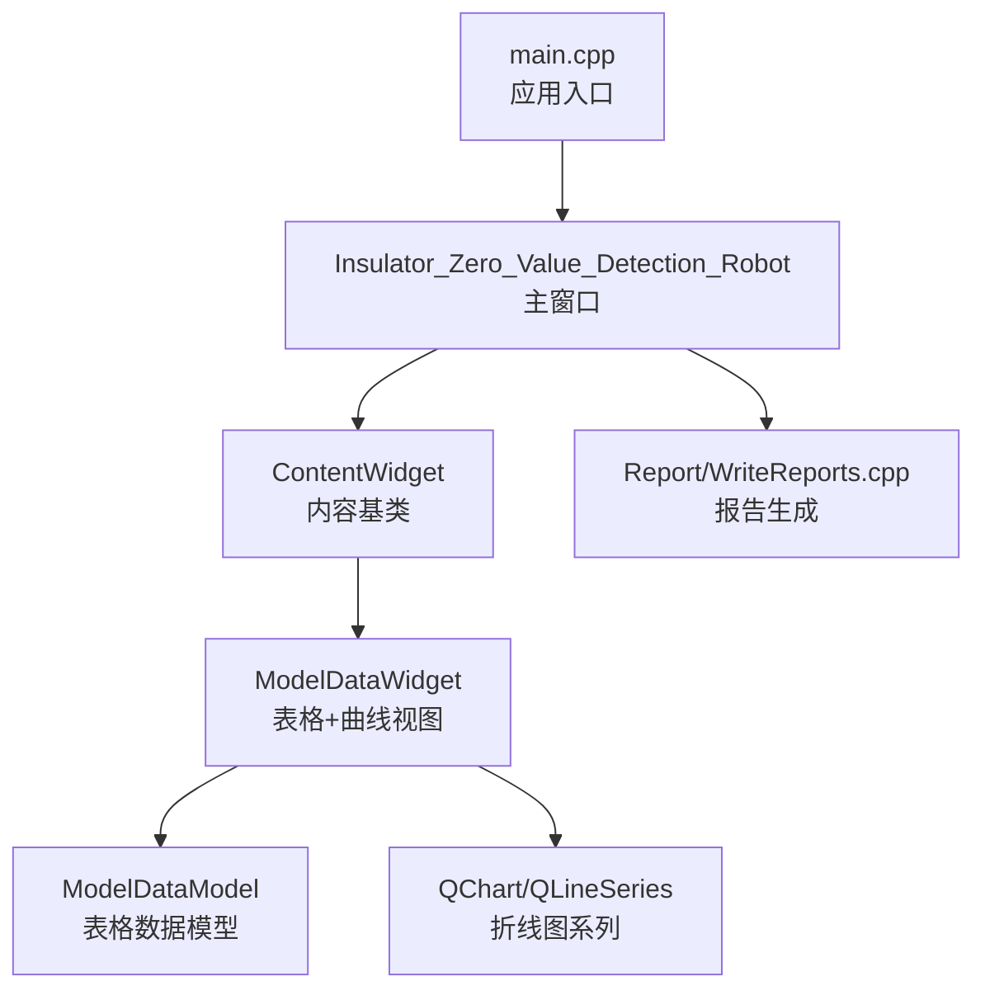
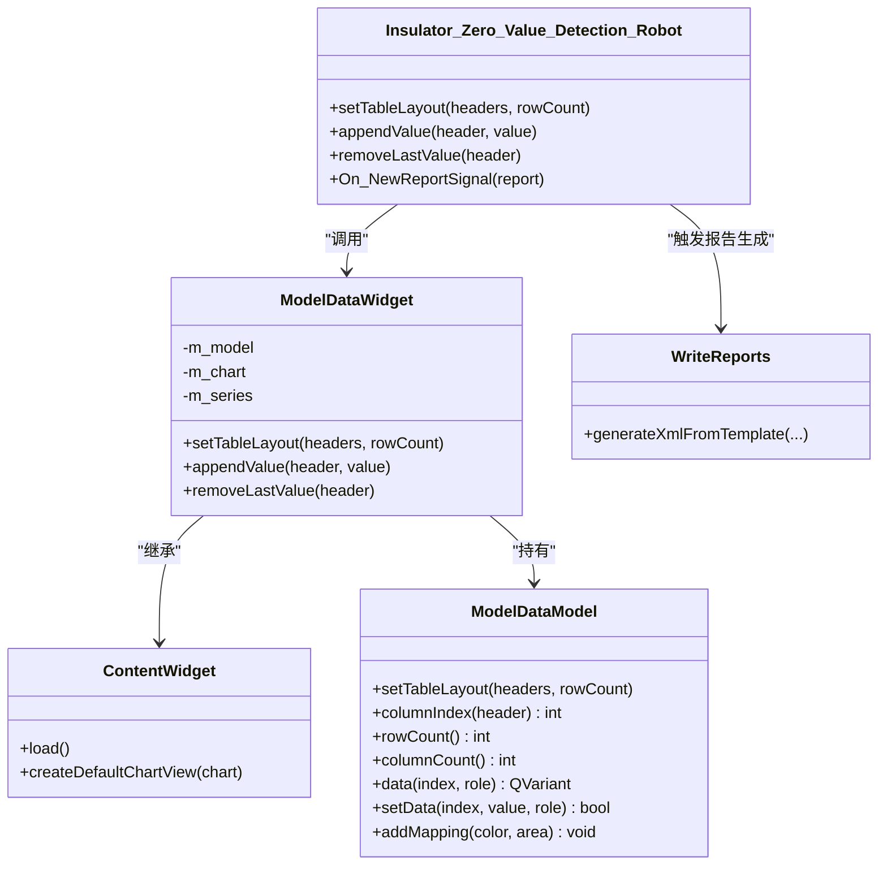
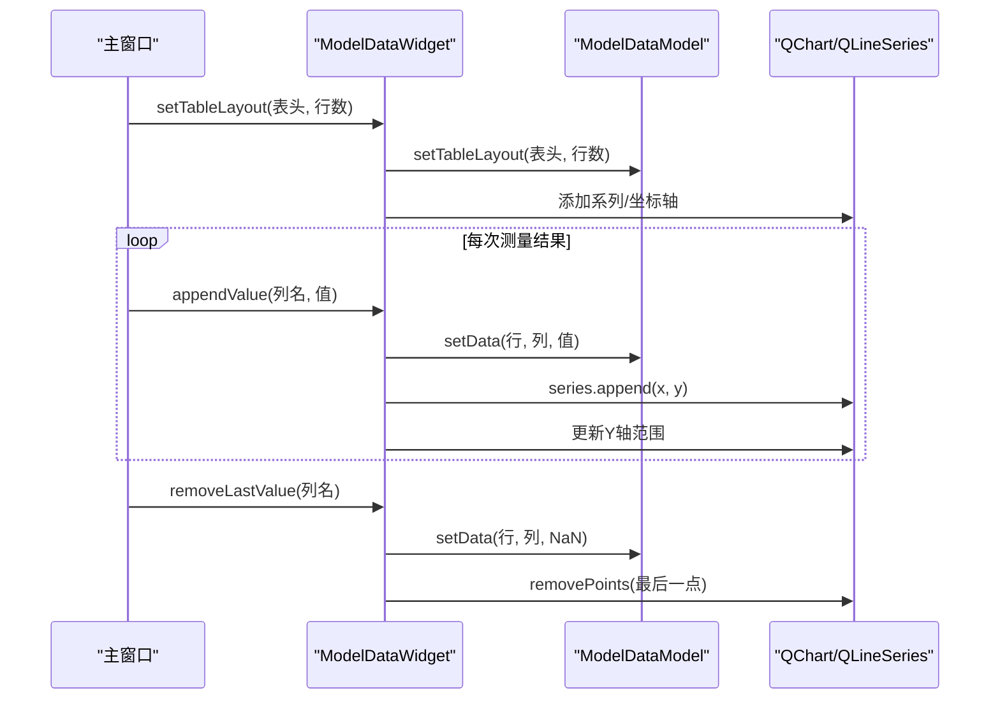
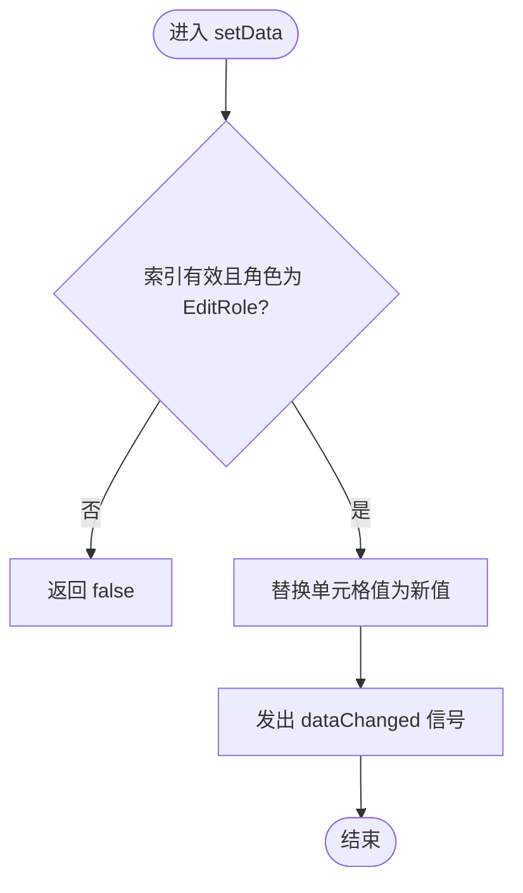
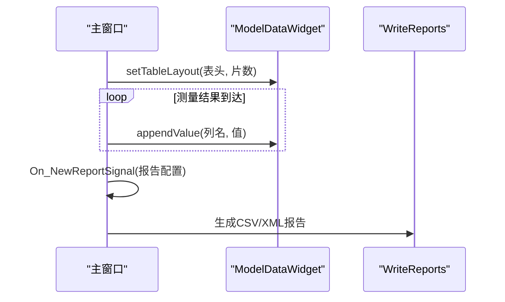
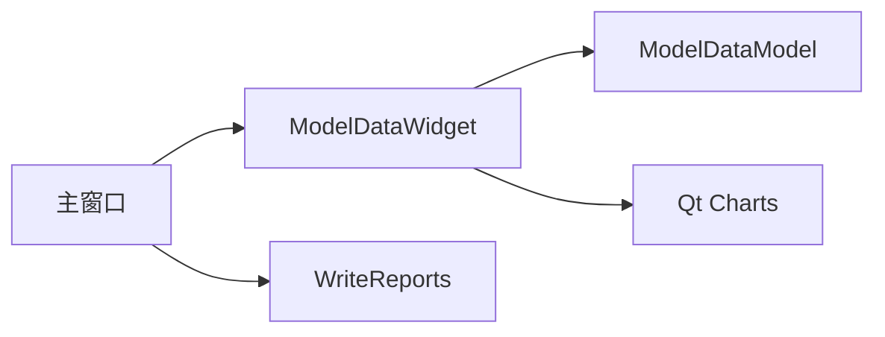

# 数据可视化

<cite>
**本文引用的文件**
- [main.cpp](file://Insulator_Zero_Value_Detection_Robot/main.cpp)
- [Insulator_Zero_Value_Detection_Robot.h](file://Insulator_Zero_Value_Detection_Robot/UI/Insulator_Zero_Value_Detection_Robot.h)
- [Insulator_Zero_Value_Detection_Robot.cpp](file://Insulator_Zero_Value_Detection_Robot/UI/Insulator_Zero_Value_Detection_Robot.cpp)
- [contentwidget.h](file://Insulator_Zero_Value_Detection_Robot/UI/contentwidget.h)
- [contentwidget.cpp](file://Insulator_Zero_Value_Detection_Robot/UI/contentwidget.cpp)
- [modeldatawidget.h](file://Insulator_Zero_Value_Detection_Robot/UI/modeldatawidget.h)
- [modeldatawidget.cpp](file://Insulator_Zero_Value_Detection_Robot/UI/modeldatawidget.cpp)
- [modeldatamodel.h](file://Insulator_Zero_Value_Detection_Robot/UI/modeldatamodel.h)
- [modeldatamodel.cpp](file://Insulator_Zero_Value_Detection_Robot/UI/modeldatamodel.cpp)
- [WriteReports.cpp](file://Insulator_Zero_Value_Detection_Robot/Report/WriteReports.cpp)
</cite>

## 目录
1. [简介](#简介)
2. [项目结构](#项目结构)
3. [核心组件](#核心组件)
4. [架构总览](#架构总览)
5. [详细组件分析](#详细组件分析)
6. [依赖关系分析](#依赖关系分析)
7. [性能考虑](#性能考虑)
8. [故障排查指南](#故障排查指南)
9. [结论](#结论)
10. [附录](#附录)

## 简介
本文件面向绝缘子零值检测机器人的“数据可视化”能力，聚焦于图表显示组件的实现与使用：表格视图、折线图表、交互式界面；说明渲染机制（实时更新、动态刷新、性能优化）、可视化定制选项（颜色主题、样式配置、交互模式）；描述趋势分析与统计图表的生成方式（历史数据展示、对比分析、报告导出）；并提供扩展接口与自定义图表开发指南，以及响应式设计与多分辨率适配方案。

## 项目结构
- 应用入口与主窗口：
  - 程序入口创建 QApplication 并启动主窗口，主窗口负责初始化 UI、绑定动作、管理各功能模块。
- 可视化内容容器：
  - ContentWidget 作为通用内容基类，提供默认图表视图创建与加载流程。
- 数据可视化组件：
  - ModelDataWidget：组合 QTableView 与 QChart（QLineSeries），实现“表格+曲线”联动视图，支持按列追加/删除测量值、动态坐标轴范围、可分割布局。
  - ModelDataModel：基于 QAbstractTableModel 的数据模型，维护二维数据、表头映射、单元格背景色映射。
- 主界面集成：
  - Insulator_Zero_Value_Detection_Robot 将 ModelDataWidget 嵌入到标签页容器中，并在测量流程中驱动数据更新与报表导出。

**图示来源**
- [main.cpp:11-23](file://Insulator_Zero_Value_Detection_Robot/main.cpp#L11-L23)
- [Insulator_Zero_Value_Detection_Robot.cpp:188-196](file://Insulator_Zero_Value_Detection_Robot/UI/Insulator_Zero_Value_Detection_Robot.cpp#L188-L196)
- [contentwidget.cpp:17-35](file://Insulator_Zero_Value_Detection_Robot/UI/contentwidget.cpp#L17-L35)
- [modeldatawidget.cpp:24-68](file://Insulator_Zero_Value_Detection_Robot/UI/modeldatawidget.cpp#L24-L68)
- [modeldatamodel.cpp:20-38](file://Insulator_Zero_Value_Detection_Robot/UI/modeldatamodel.cpp#L20-L38)
- [WriteReports.cpp:251-296](file://Insulator_Zero_Value_Detection_Robot/Report/WriteReports.cpp#L251-L296)

**章节来源**
- [main.cpp:11-23](file://Insulator_Zero_Value_Detection_Robot/main.cpp#L11-L23)
- [Insulator_Zero_Value_Detection_Robot.cpp:188-196](file://Insulator_Zero_Value_Detection_Robot/UI/Insulator_Zero_Value_Detection_Robot.cpp#L188-L196)

## 核心组件
- 主窗口（Insulator_Zero_Value_Detection_Robot）
  - 负责初始化 UI、绑定事件、管理测量流程状态机、调用可视化组件进行数据更新与报表导出。
- 内容基类（ContentWidget）
  - 提供统一的加载流程与默认图表视图封装，便于扩展新的可视化页面。
- 可视化组件（ModelDataWidget）
  - 组合表格与折线图，支持：
    - 按表头（列）动态创建曲线系列
    - 逐条追加测量值并自动扩展 Y 轴范围
    - 重测时移除最后一个值及其曲线点
    - 表格宽度自适应与 Splitter 可拖拽调整
- 数据模型（ModelDataModel）
  - 基于 QAbstractTableModel，维护二维数据、表头映射、单元格背景色映射，支持编辑与数据变更通知。

**章节来源**
- [Insulator_Zero_Value_Detection_Robot.h:26-133](file://Insulator_Zero_Value_Detection_Robot/UI/Insulator_Zero_Value_Detection_Robot.h#L26-L133)
- [contentwidget.h:12-31](file://Insulator_Zero_Value_Detection_Robot/UI/contentwidget.h#L12-L31)
- [modeldatawidget.h:20-49](file://Insulator_Zero_Value_Detection_Robot/UI/modeldatawidget.h#L20-L49)
- [modeldatamodel.h:12-39](file://Insulator_Zero_Value_Detection_Robot/UI/modeldatamodel.h#L12-L39)

## 架构总览
下图展示了从主窗口到可视化组件再到数据模型的调用关系，以及报表生成的集成点。

**图示来源**
- [Insulator_Zero_Value_Detection_Robot.cpp:1975-1989](file://Insulator_Zero_Value_Detection_Robot/UI/Insulator_Zero_Value_Detection_Robot.cpp#L1975-L1989)
- [modeldatawidget.cpp:71-120](file://Insulator_Zero_Value_Detection_Robot/UI/modeldatawidget.cpp#L71-L120)
- [modeldatamodel.cpp:20-38](file://Insulator_Zero_Value_Detection_Robot/UI/modeldatamodel.cpp#L20-L38)
- [WriteReports.cpp:251-296](file://Insulator_Zero_Value_Detection_Robot/Report/WriteReports.cpp#L251-L296)

## 详细组件分析

### 表格视图与折线图联动（ModelDataWidget）
- 初始化与布局
  - 创建 QTableView 并绑定 ModelDataModel；创建 QChart 与 QLineSeries；通过 QSplitter 控制表格与图表比例。
- 表格布局设置
  - setTableLayout 根据表头重建表格与曲线系列，清空旧数据与映射，设置坐标轴范围。
- 数据追加与删除
  - appendValue 在对应列找到下一个空单元格填充，并向曲线追加点，同时动态扩展 Y 轴范围。
  - removeLastValue 删除最近一个测量值及其曲线点，用于重测场景。
- 响应式布局
  - resizeEvent 延迟应用表格宽度，避免与父级 Splitter 拖拽冲突；applyTableWidth 精确分配表格与图表宽度。

**图示来源**
- [modeldatawidget.cpp:71-120](file://Insulator_Zero_Value_Detection_Robot/UI/modeldatawidget.cpp#L71-L120)
- [modeldatawidget.cpp:139-186](file://Insulator_Zero_Value_Detection_Robot/UI/modeldatawidget.cpp#L139-L186)
- [modeldatamodel.cpp:72-101](file://Insulator_Zero_Value_Detection_Robot/UI/modeldatamodel.cpp#L72-L101)

**章节来源**
- [modeldatawidget.cpp:24-68](file://Insulator_Zero_Value_Detection_Robot/UI/modeldatawidget.cpp#L24-L68)
- [modeldatawidget.cpp:71-120](file://Insulator_Zero_Value_Detection_Robot/UI/modeldatawidget.cpp#L71-L120)
- [modeldatawidget.cpp:139-186](file://Insulator_Zero_Value_Detection_Robot/UI/modeldatawidget.cpp#L139-L186)
- [modeldatamodel.cpp:20-38](file://Insulator_Zero_Value_Detection_Robot/UI/modeldatamodel.cpp#L20-L38)
- [modeldatamodel.cpp:72-101](file://Insulator_Zero_Value_Detection_Robot/UI/modeldatamodel.cpp#L72-L101)

### 数据模型（ModelDataModel）
- 数据结构
  - 二维 QList<QList<qreal>> 存储测量值，未测量单元格初始化为 NaN。
  - QMultiHash<QString, QRect> 维护列区域与背景色的映射，用于表格着色。
- 接口
  - setTableLayout：重置模型、重建行列、填充空值。
  - columnIndex：根据表头查找列索引。
  - data/headerData：返回显示值与表头文本，处理背景色映射。
  - setData：写入编辑值并触发 dataChanged。
  - addMapping：为某列区域添加背景色映射。

**图示来源**
- [modeldatamodel.cpp:94-101](file://Insulator_Zero_Value_Detection_Robot/UI/modeldatamodel.cpp#L94-L101)

**章节来源**
- [modeldatamodel.cpp:20-38](file://Insulator_Zero_Value_Detection_Robot/UI/modeldatamodel.cpp#L20-L38)
- [modeldatamodel.cpp:72-101](file://Insulator_Zero_Value_Detection_Robot/UI/modeldatamodel.cpp#L72-L101)
- [modeldatamodel.cpp:109-112](file://Insulator_Zero_Value_Detection_Robot/UI/modeldatamodel.cpp#L109-L112)

### 主窗口集成与数据流
- 初始化与嵌入
  - 在主窗口中创建 ModelDataWidget 并放入 ui.widget 容器，使用布局管理器使其自适应尺寸。
- 数据更新驱动
  - 在测量流程中，根据当前工单配置设置表格布局（表头与行数），随后逐条调用 appendValue 推送测量值。
  - 重测或异常时调用 removeLastValue 回滚最新值。
- 报表导出
  - 新增报告时，将 m_mapTicketMearData（侧别→方向→测量值数组）导出为 CSV，并标记报告生成标志。

**图示来源**
- [Insulator_Zero_Value_Detection_Robot.cpp:188-196](file://Insulator_Zero_Value_Detection_Robot/UI/Insulator_Zero_Value_Detection_Robot.cpp#L188-L196)
- [Insulator_Zero_Value_Detection_Robot.cpp:1975-1989](file://Insulator_Zero_Value_Detection_Robot/UI/Insulator_Zero_Value_Detection_Robot.cpp#L1975-L1989)
- [Insulator_Zero_Value_Detection_Robot.cpp:2745-2845](file://Insulator_Zero_Value_Detection_Robot/UI/Insulator_Zero_Value_Detection_Robot.cpp#L2745-L2845)
- [WriteReports.cpp:251-296](file://Insulator_Zero_Value_Detection_Robot/Report/WriteReports.cpp#L251-L296)

**章节来源**
- [Insulator_Zero_Value_Detection_Robot.cpp:188-196](file://Insulator_Zero_Value_Detection_Robot/UI/Insulator_Zero_Value_Detection_Robot.cpp#L188-L196)
- [Insulator_Zero_Value_Detection_Robot.cpp:1975-1989](file://Insulator_Zero_Value_Detection_Robot/UI/Insulator_Zero_Value_Detection_Robot.cpp#L1975-L1989)
- [Insulator_Zero_Value_Detection_Robot.cpp:2745-2845](file://Insulator_Zero_Value_Detection_Robot/UI/Insulator_Zero_Value_Detection_Robot.cpp#L2745-L2845)

### 实时渲染与动态刷新机制
- 增量更新
  - 每次测量值到达即调用 appendValue，仅追加一个点到曲线并更新一个单元格，减少重绘开销。
- 动态坐标轴
  - 首次值确定 Y 轴基准，后续根据最小/最大值动态扩展，并加入一定边距提升可读性。
- 布局自适应
  - 使用 QTimer::singleShot 延迟应用表格宽度，避免与 Splitter 拖拽冲突；resizeEvent 中统一处理。

**章节来源**
- [modeldatawidget.cpp:139-186](file://Insulator_Zero_Value_Detection_Robot/UI/modeldatawidget.cpp#L139-L186)
- [modeldatawidget.cpp:130-137](file://Insulator_Zero_Value_Detection_Robot/UI/modeldatawidget.cpp#L130-L137)

### 可视化定制选项
- 颜色主题
  - 曲线颜色由 QLineSeries 默认笔色决定，表格列背景色映射使用该颜色的十六进制值，形成一致的主题。
- 样式配置
  - 表格列宽按表头文字宽度计算，垂直表头拉伸铺满；图表启用抗锯齿与动画。
- 用户交互模式
  - Splitter 允许用户拖动调整表格与图表宽度；表格支持编辑（Qt::ItemIsEditable）。

**章节来源**
- [modeldatawidget.cpp:71-120](file://Insulator_Zero_Value_Detection_Robot/UI/modeldatawidget.cpp#L71-L120)
- [modeldatamodel.cpp:104-107](file://Insulator_Zero_Value_Detection_Robot/UI/modeldatamodel.cpp#L104-L107)

### 趋势分析与统计图表
- 历史数据展示
  - 每列代表一个测量维度（如不同相别/方向），X 轴为片号，Y 轴为测量值，形成趋势折线。
- 对比分析
  - 多列曲线并列显示，便于对比不同通道/方向的测量趋势。
- 报告生成
  - 新增报告时将 JSON 中的测量值数组导出为 CSV，供外部工具进行统计分析。

**章节来源**
- [modeldatawidget.cpp:71-120](file://Insulator_Zero_Value_Detection_Robot/UI/modeldatawidget.cpp#L71-L120)
- [Insulator_Zero_Value_Detection_Robot.cpp:2745-2845](file://Insulator_Zero_Value_Detection_Robot/UI/Insulator_Zero_Value_Detection_Robot.cpp#L2745-L2845)

### 扩展接口与自定义图表开发指南
- 扩展点
  - 继承 ContentWidget 实现 doLoad，以复用默认图表视图与加载流程。
  - 在 ModelDataWidget 中增加新的系列类型（如面积图、柱状图）或交互行为（缩放、平移）。
- 自定义步骤
  - 定义新的 QAbstractTableModel 子类以适配复杂数据结构。
  - 在 ModelDataWidget 中注册新的系列与坐标轴，保持 appendValue/removeLastValue 的一致性。
- 集成建议
  - 在主窗口中按需实例化并嵌入到标签页容器，确保布局管理与响应式适配。

**章节来源**
- [contentwidget.h:12-31](file://Insulator_Zero_Value_Detection_Robot/UI/contentwidget.h#L12-L31)
- [contentwidget.cpp:17-35](file://Insulator_Zero_Value_Detection_Robot/UI/contentwidget.cpp#L17-L35)
- [modeldatawidget.h:20-49](file://Insulator_Zero_Value_Detection_Robot/UI/modeldatawidget.h#L20-L49)

### 响应式设计及多分辨率适配
- 布局策略
  - 使用 QSplitter 与布局管理器，使表格与图表按比例自适应窗口大小。
  - 表格宽度按表头文字宽度计算，避免过度拉伸导致信息拥挤。
- 渲染优化
  - 图表启用抗锯齿与动画，提升视觉质量；延迟应用布局以避免重绘抖动。
- 多分辨率
  - 通过 resizeEvent 与定时器延迟应用宽度，保证在不同分辨率下均能正确显示。

**章节来源**
- [modeldatawidget.cpp:122-137](file://Insulator_Zero_Value_Detection_Robot/UI/modeldatawidget.cpp#L122-L137)
- [modeldatawidget.cpp:24-68](file://Insulator_Zero_Value_Detection_Robot/UI/modeldatawidget.cpp#L24-L68)

## 依赖关系分析
- 组件耦合
  - 主窗口依赖 ModelDataWidget 进行数据可视化；ModelDataWidget 依赖 ModelDataModel 与 Qt Charts。
  - 报表生成依赖主窗口的测量数据 JSON 结构。
- 外部依赖
  - Qt Widgets/Charts：表格、图表、布局与交互。
  - OpenCV：视频流与截图（与可视化间接相关）。
- 潜在循环依赖
  - 无直接循环依赖；主窗口与可视化组件单向调用。

**图示来源**
- [Insulator_Zero_Value_Detection_Robot.cpp:188-196](file://Insulator_Zero_Value_Detection_Robot/UI/Insulator_Zero_Value_Detection_Robot.cpp#L188-L196)
- [modeldatawidget.cpp:24-68](file://Insulator_Zero_Value_Detection_Robot/UI/modeldatawidget.cpp#L24-L68)
- [modeldatamodel.cpp:20-38](file://Insulator_Zero_Value_Detection_Robot/UI/modeldatamodel.cpp#L20-L38)
- [WriteReports.cpp:251-296](file://Insulator_Zero_Value_Detection_Robot/Report/WriteReports.cpp#L251-L296)

**章节来源**
- [Insulator_Zero_Value_Detection_Robot.cpp:188-196](file://Insulator_Zero_Value_Detection_Robot/UI/Insulator_Zero_Value_Detection_Robot.cpp#L188-L196)
- [modeldatawidget.cpp:24-68](file://Insulator_Zero_Value_Detection_Robot/UI/modeldatawidget.cpp#L24-L68)
- [modeldatamodel.cpp:20-38](file://Insulator_Zero_Value_Detection_Robot/UI/modeldatamodel.cpp#L20-L38)
- [WriteReports.cpp:251-296](file://Insulator_Zero_Value_Detection_Robot/Report/WriteReports.cpp#L251-L296)

## 性能考虑
- 增量更新：每次仅追加一个数据点与单元格，避免全量重绘。
- 动态坐标轴：仅在必要时扩展 Y 轴范围，减少重排开销。
- 布局延迟：使用 QTimer::singleShot 延迟应用宽度，避免与 Splitter 拖拽冲突。
- 渲染优化：启用抗锯齿与动画，提升视觉体验的同时注意帧率。
- 数据规模：当列数或行数较大时，建议分页或虚拟滚动以减少内存占用。

[本节为通用指导，不直接分析具体文件]

## 故障排查指南
- 表格不显示或空白
  - 检查是否调用了 setTableLayout 并正确设置表头与行数。
  - 确认 ModelDataModel 的 data/headerData 返回值是否正确。
- 曲线不更新
  - 确认 appendValue 被调用且列名匹配；检查 series 是否已添加到 chart。
- 坐标轴范围异常
  - 检查首次值设置与动态扩展逻辑；确认 padding 计算合理。
- 报表导出失败
  - 检查 m_mapTicketMearData 结构是否为预期的 JSON；确认文件路径与权限。

**章节来源**
- [modeldatawidget.cpp:71-120](file://Insulator_Zero_Value_Detection_Robot/UI/modeldatawidget.cpp#L71-L120)
- [modeldatawidget.cpp:139-186](file://Insulator_Zero_Value_Detection_Robot/UI/modeldatawidget.cpp#L139-L186)
- [Insulator_Zero_Value_Detection_Robot.cpp:2745-2845](file://Insulator_Zero_Value_Detection_Robot/UI/Insulator_Zero_Value_Detection_Robot.cpp#L2745-L2845)

## 结论
本项目实现了稳定、可扩展的数据可视化能力：通过 ModelDataWidget 与 ModelDataModel 的组合，提供了表格与折线图的联动展示；主窗口在测量流程中驱动数据更新，并支持报表导出。系统具备良好的响应式设计与性能优化措施，适合在高频率数据场景下使用。未来可通过继承 ContentWidget 与扩展 ModelDataWidget 来支持更多图表类型与交互模式。

[本节为总结性内容，不直接分析具体文件]

## 附录
- 关键 API 参考
  - ModelDataWidget::setTableLayout(headers, rowCount)
  - ModelDataWidget::appendValue(header, value)
  - ModelDataWidget::removeLastValue(header)
  - ModelDataModel::setTableLayout(headers, rowCount)
  - ModelDataModel::columnIndex(header)
  - Insulator_Zero_Value_Detection_Robot::On_NewReportSignal(report)

**章节来源**
- [modeldatawidget.h:24-32](file://Insulator_Zero_Value_Detection_Robot/UI/modeldatawidget.h#L24-L32)
- [modeldatamodel.h:16-31](file://Insulator_Zero_Value_Detection_Robot/UI/modeldatamodel.h#L16-L31)
- [Insulator_Zero_Value_Detection_Robot.h:130-133](file://Insulator_Zero_Value_Detection_Robot/UI/Insulator_Zero_Value_Detection_Robot.h#L130-L133)