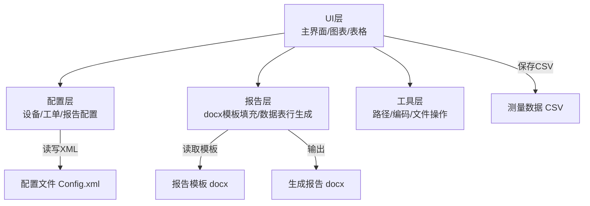
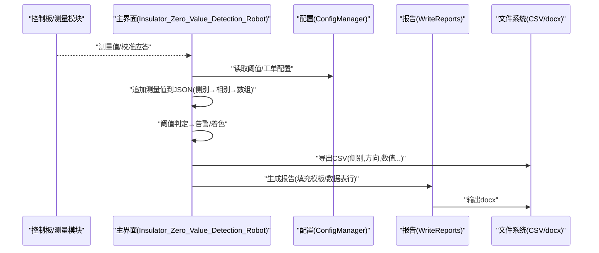
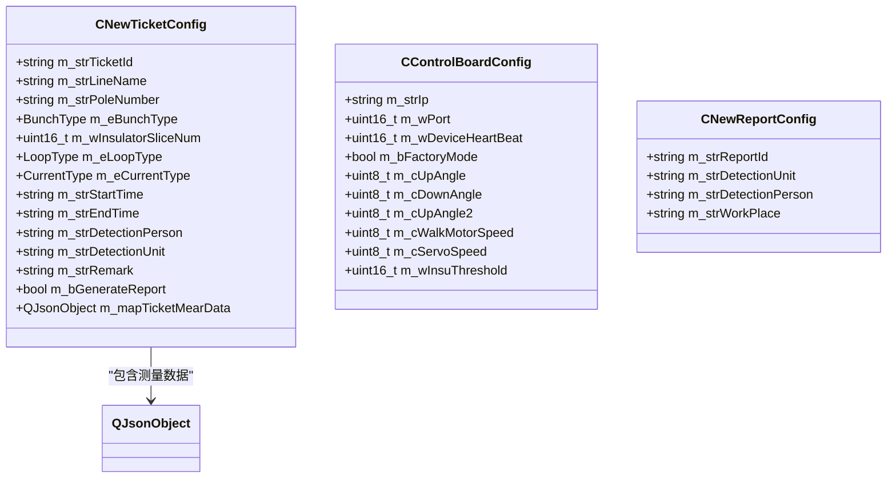
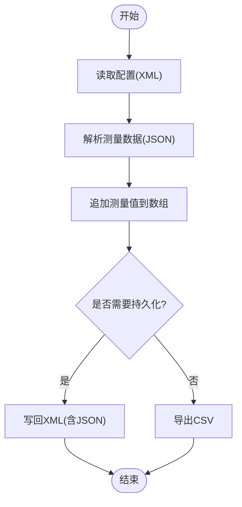
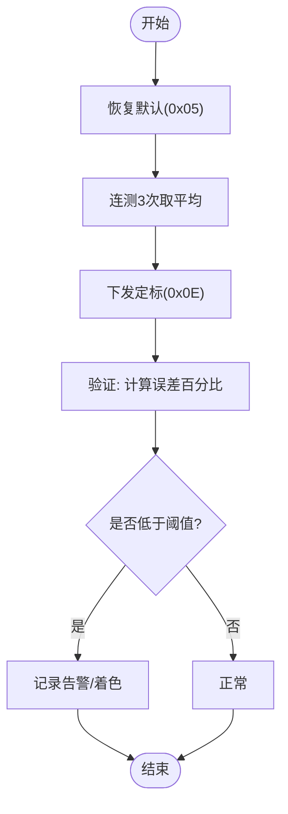
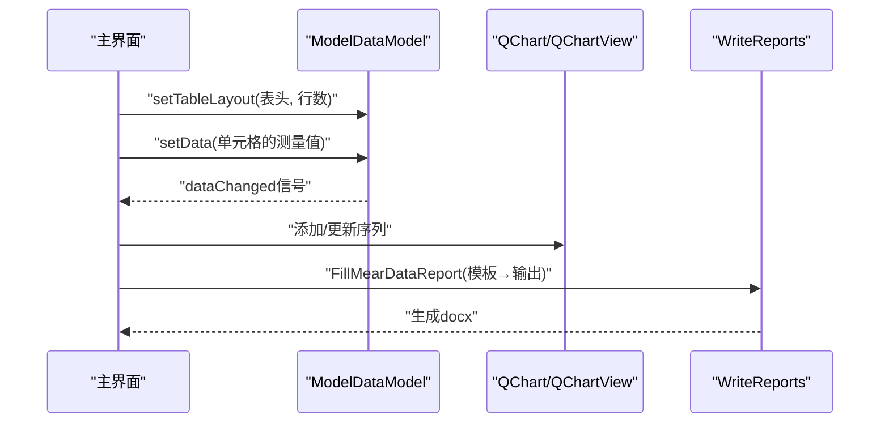
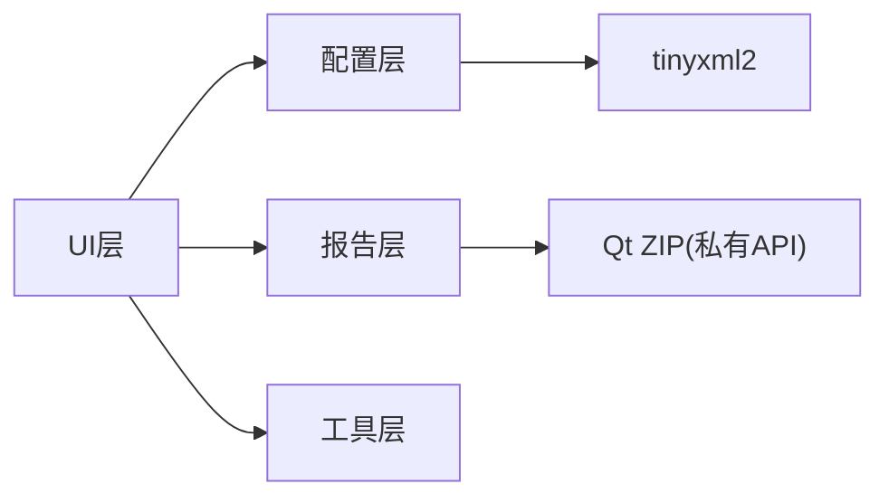

# 数据处理和分析

<cite>
**本文引用的文件**
- [Insulator_Zero_Value_Detection_Robot.cpp](file://Insulator_Zero_Value_Detection_Robot/Insulator_Zero_Value_Detection_Robot.cpp)
- [ConfigManager.h](file://Insulator_Zero_Value_Detection_Robot/Config/ConfigManager.h)
- [ConfigManager.cpp](file://Insulator_Zero_Value_Detection_Robot/Config/ConfigManager.cpp)
- [WriteReports.h](file://Insulator_Zero_Value_Detection_Robot/Report/WriteReports.h)
- [WriteReports.cpp](file://Insulator_Zero_Value_Detection_Robot/Report/WriteReports.cpp)
- [modeldatamodel.h](file://Insulator_Zero_Value_Detection_Robot/UI/modeldatamodel.h)
- [modeldatamodel.cpp](file://Insulator_Zero_Value_Detection_Robot/UI/modeldatamodel.cpp)
- [modeldatawidget.cpp](file://Insulator_Zero_Value_Detection_Robot/UI/modeldatawidget.cpp)
- [Tools.h](file://Insulator_Zero_Value_Detection_Robot/Tools/Tools.h)
</cite>

## 目录
1. [简介](#简介)
2. [项目结构](#项目结构)
3. [核心组件](#核心组件)
4. [架构总览](#架构总览)
5. [详细组件分析](#详细组件分析)
6. [依赖关系分析](#依赖关系分析)
7. [性能考虑](#性能考虑)
8. [故障排查指南](#故障排查指南)
9. [结论](#结论)
10. [附录](#附录)

## 简介
本章节面向绝缘子零值检测机器人的“数据处理与分析”能力，覆盖测量数据的采集、存储与管理；数据分析算法与计算方法（阻值计算、误差分析、质量评估）；数据可视化（图表显示、趋势分析、统计报告）；数据模型与数据结构定义；数据导入导出与格式支持；高级功能与自定义分析选项；以及数据质量保证与异常数据处理策略。文档以代码为依据，提供可追溯的源码路径与图示，帮助读者快速理解并扩展系统能力。

## 项目结构
本项目采用分层组织：UI层负责交互与可视化；配置层管理设备参数、工单与报告模板；报告层负责将测量数据写入Word模板生成报告；工具层提供通用IO与字符串处理；协议与设备通信由独立模块负责（不在本文重点）。

**图表来源**
- [Insulator_Zero_Value_Detection_Robot.cpp:2776-2818](file://Insulator_Zero_Value_Detection_Robot/Insulator_Zero_Value_Detection_Robot.cpp#L2776-L2818)
- [WriteReports.cpp:40-105](file://Insulator_Zero_Value_Detection_Robot/Report/WriteReports.cpp#L40-L105)
- [ConfigManager.cpp:16-46](file://Insulator_Zero_Value_Detection_Robot/Config/ConfigManager.cpp#L16-L46)

**章节来源**
- [Insulator_Zero_Value_Detection_Robot.cpp:166-190](file://Insulator_Zero_Value_Detection_Robot/Insulator_Zero_Value_Detection_Robot.cpp#L166-L190)
- [ConfigManager.cpp:16-46](file://Insulator_Zero_Value_Detection_Robot/Config/ConfigManager.cpp#L16-L46)
- [WriteReports.cpp:40-105](file://Insulator_Zero_Value_Detection_Robot/Report/WriteReports.cpp#L40-L105)

## 核心组件
- 数据采集与存储
  - 测量值按“侧别→相别→数值数组”的层级结构保存在工单的JSON字段中，并在运行时追加新值。
  - 运行结束后导出为CSV，便于离线分析与二次加工。
- 数据分析与质量评估
  - 基于配置的绝缘阈值进行零值/低值判定，触发告警。
  - 校准流程包含原始值三次平均、补偿系数下发与验证误差百分比计算。
- 可视化与报告
  - 表格+曲线图联动展示测量结果，支持按片号查看趋势。
  - 通过docx模板填充报告，自动适配数据行数，生成标准格式报告。

**章节来源**
- [Insulator_Zero_Value_Detection_Robot.cpp:40-53](file://Insulator_Zero_Value_Detection_Robot/Insulator_Zero_Value_Detection_Robot.cpp#L40-L53)
- [Insulator_Zero_Value_Detection_Robot.cpp:756-784](file://Insulator_Zero_Value_Detection_Robot/Insulator_Zero_Value_Detection_Robot.cpp#L756-L784)
- [Insulator_Zero_Value_Detection_Robot.cpp:1064-1070](file://Insulator_Zero_Value_Detection_Robot/Insulator_Zero_Value_Detection_Robot.cpp#L1064-L1070)
- [modeldatawidget.cpp:42-68](file://Insulator_Zero_Value_Detection_Robot/UI/modeldatawidget.cpp#L42-L68)
- [WriteReports.cpp:206-320](file://Insulator_Zero_Value_Detection_Robot/Report/WriteReports.cpp#L206-L320)

## 架构总览
下图展示了从测量到可视化的端到端数据流：设备返回测量值后，UI层将其追加到工单的JSON结构中；随后根据阈值判断是否告警；用户可导出CSV或生成报告；同时UI中的表格与曲线实时反映最新数据。

**图表来源**
- [Insulator_Zero_Value_Detection_Robot.cpp:40-53](file://Insulator_Zero_Value_Detection_Robot/Insulator_Zero_Value_Detection_Robot.cpp#L40-L53)
- [Insulator_Zero_Value_Detection_Robot.cpp:756-784](file://Insulator_Zero_Value_Detection_Robot/Insulator_Zero_Value_Detection_Robot.cpp#L756-L784)
- [Insulator_Zero_Value_Detection_Robot.cpp:2776-2818](file://Insulator_Zero_Value_Detection_Robot/Insulator_Zero_Value_Detection_Robot.cpp#L2776-L2818)
- [WriteReports.cpp:206-320](file://Insulator_Zero_Value_Detection_Robot/Report/WriteReports.cpp#L206-L320)

## 详细组件分析

### 数据模型与数据结构
- 工单配置与测量数据
  - 工单对象包含线路信息、串型、回路数、交直流类型、起止时间、人员单位等元数据。
  - 测量数据以QJsonObject存储，键层次为“侧别→相别→数值数组”，用于后续CSV导出与报告填充。
- 设备与相机配置
  - 设备配置包括IP、端口、心跳、工厂模式、探针角度、电机/舵机速度、绝缘阈值等。
  - 相机配置包含左右中相机IP、码流选择等。
- 报告配置
  - 报告编号、检测单位、检测人员、作业地点等元数据。

**图表来源**
- [ConfigManager.h:52-183](file://Insulator_Zero_Value_Detection_Robot/Config/ConfigManager.h#L52-L183)
- [ConfigManager.h:10-24](file://Insulator_Zero_Value_Detection_Robot/Config/ConfigManager.h#L10-L24)
- [ConfigManager.h:39-50](file://Insulator_Zero_Value_Detection_Robot/Config/ConfigManager.h#L39-L50)

**章节来源**
- [ConfigManager.h:52-183](file://Insulator_Zero_Value_Detection_Robot/Config/ConfigManager.h#L52-L183)
- [ConfigManager.h:10-24](file://Insulator_Zero_Value_Detection_Robot/Config/ConfigManager.h#L10-L24)
- [ConfigManager.h:39-50](file://Insulator_Zero_Value_Detection_Robot/Config/ConfigManager.h#L39-L50)

### 数据采集、存储与管理
- 采集与追加
  - 每次收到测量值后，调用辅助函数将值追加到当前侧别/相别的数组末尾，保持顺序一致。
- 持久化
  - 工单配置在内存中维护，并通过配置管理器读写XML；测量数据随工单一起序列化到XML的特定节点。
  - 运行结束后可导出CSV，列包含侧别、方向及该方向下的所有测量值。
- 导入
  - 启动时从XML加载工单与报告配置，解析测量数据JSON文本为QJsonObject供后续使用。

**图表来源**
- [ConfigManager.cpp:16-46](file://Insulator_Zero_Value_Detection_Robot/Config/ConfigManager.cpp#L16-L46)
- [ConfigManager.cpp:190-214](file://Insulator_Zero_Value_Detection_Robot/Config/ConfigManager.cpp#L190-L214)
- [Insulator_Zero_Value_Detection_Robot.cpp:40-53](file://Insulator_Zero_Value_Detection_Robot/Insulator_Zero_Value_Detection_Robot.cpp#L40-L53)
- [Insulator_Zero_Value_Detection_Robot.cpp:2776-2818](file://Insulator_Zero_Value_Detection_Robot/Insulator_Zero_Value_Detection_Robot.cpp#L2776-L2818)

**章节来源**
- [ConfigManager.cpp:16-46](file://Insulator_Zero_Value_Detection_Robot/Config/ConfigManager.cpp#L16-L46)
- [ConfigManager.cpp:190-214](file://Insulator_Zero_Value_Detection_Robot/Config/ConfigManager.cpp#L190-L214)
- [Insulator_Zero_Value_Detection_Robot.cpp:40-53](file://Insulator_Zero_Value_Detection_Robot/Insulator_Zero_Value_Detection_Robot.cpp#L40-L53)
- [Insulator_Zero_Value_Detection_Robot.cpp:2776-2818](file://Insulator_Zero_Value_Detection_Robot/Insulator_Zero_Value_Detection_Robot.cpp#L2776-L2818)

### 数据分析算法与计算方法
- 阻值计算与校准
  - 校准流程：恢复默认→连测3次取平均→下发定标（固件内部计算补偿系数）→验证实测值与标准值的误差百分比。
  - 误差百分比 = (修正值 − 标准值) / 标准值 × 100%。
- 质量评估
  - 依据配置的绝缘阈值对测量值进行判定：低于阈值视为零值/低值，记录告警并高亮显示。
  - 双联模式下内侧/外侧分别着色，便于直观识别异常。

**图表来源**
- [Insulator_Zero_Value_Detection_Robot.cpp:55-65](file://Insulator_Zero_Value_Detection_Robot/Insulator_Zero_Value_Detection_Robot.cpp#L55-L65)
- [Insulator_Zero_Value_Detection_Robot.cpp:1064-1070](file://Insulator_Zero_Value_Detection_Robot/Insulator_Zero_Value_Detection_Robot.cpp#L1064-L1070)
- [Insulator_Zero_Value_Detection_Robot.cpp:756-784](file://Insulator_Zero_Value_Detection_Robot/Insulator_Zero_Value_Detection_Robot.cpp#L756-L784)

**章节来源**
- [Insulator_Zero_Value_Detection_Robot.cpp:55-65](file://Insulator_Zero_Value_Detection_Robot/Insulator_Zero_Value_Detection_Robot.cpp#L55-L65)
- [Insulator_Zero_Value_Detection_Robot.cpp:1064-1070](file://Insulator_Zero_Value_Detection_Robot/Insulator_Zero_Value_Detection_Robot.cpp#L1064-L1070)
- [Insulator_Zero_Value_Detection_Robot.cpp:756-784](file://Insulator_Zero_Value_Detection_Robot/Insulator_Zero_Value_Detection_Robot.cpp#L756-L784)

### 数据可视化实现
- 表格与曲线联动
  - 使用ModelDataModel作为表格模型，未测量单元格初始化为NaN，到达测量值后逐个填充。
  - ModelDataWidget创建QChart与QValueAxis，横轴为片号，纵轴为测量值；表格与曲线通过Splitter布局并列显示。
- 趋势分析
  - 曲线图随数据更新动态刷新，支持拖动调节表格与曲线宽度，便于观察趋势变化。
- 统计报告
  - 报告层将测量数据映射到docx模板的数据表中，按实际片数自适应增删行，生成标准化报告。

**图表来源**
- [modeldatamodel.cpp:20-38](file://Insulator_Zero_Value_Detection_Robot/UI/modeldatamodel.cpp#L20-L38)
- [modeldatamodel.cpp:72-101](file://Insulator_Zero_Value_Detection_Robot/UI/modeldatamodel.cpp#L72-L101)
- [modeldatawidget.cpp:42-68](file://Insulator_Zero_Value_Detection_Robot/UI/modeldatawidget.cpp#L42-L68)
- [WriteReports.cpp:206-320](file://Insulator_Zero_Value_Detection_Robot/Report/WriteReports.cpp#L206-L320)

**章节来源**
- [modeldatamodel.cpp:20-38](file://Insulator_Zero_Value_Detection_Robot/UI/modeldatamodel.cpp#L20-L38)
- [modeldatamodel.cpp:72-101](file://Insulator_Zero_Value_Detection_Robot/UI/modeldatamodel.cpp#L72-L101)
- [modeldatawidget.cpp:42-68](file://Insulator_Zero_Value_Detection_Robot/UI/modeldatawidget.cpp#L42-L68)
- [WriteReports.cpp:206-320](file://Insulator_Zero_Value_Detection_Robot/Report/WriteReports.cpp#L206-L320)

### 数据导入导出与格式支持
- 导出
  - CSV：侧别、方向、数值数组逐行列出，UTF-8编码，便于Excel打开。
  - 报告：基于docx模板填充占位符与数据表行，输出新的docx文件。
- 导入
  - XML：读取设备与相机配置、工单与报告配置，解析测量数据JSON文本。
- 格式说明
  - CSV：无固定表头，首两列为侧别与方向，其后为该方向的所有测量值。
  - docx：模板需包含占位符${key}与数据表样板行（14列），报告层会自适应行数。

**章节来源**
- [Insulator_Zero_Value_Detection_Robot.cpp:2776-2818](file://Insulator_Zero_Value_Detection_Robot/Insulator_Zero_Value_Detection_Robot.cpp#L2776-L2818)
- [WriteReports.cpp:107-127](file://Insulator_Zero_Value_Detection_Robot/Report/WriteReports.cpp#L107-L127)
- [WriteReports.cpp:206-320](file://Insulator_Zero_Value_Detection_Robot/Report/WriteReports.cpp#L206-L320)
- [ConfigManager.cpp:16-46](file://Insulator_Zero_Value_Detection_Robot/Config/ConfigManager.cpp#L16-L46)
- [ConfigManager.cpp:190-214](file://Insulator_Zero_Value_Detection_Robot/Config/ConfigManager.cpp#L190-L214)

### 高级功能与自定义分析选项
- 校准流程参数可调
  - 连测次数、超时时间、命令响应等待时间等常量可在界面或配置中调整，以适应不同硬件与环境。
- 阈值与告警策略
  - 绝缘阈值来自设备配置，可针对不同线路/工况设置不同阈值，实现定制化质量评估。
- 可视化定制
  - 表格列头与曲线坐标轴标题可配置，支持按业务需求扩展更多维度（如温度、湿度等）。

**章节来源**
- [Insulator_Zero_Value_Detection_Robot.cpp:55-65](file://Insulator_Zero_Value_Detection_Robot/Insulator_Zero_Value_Detection_Robot.cpp#L55-L65)
- [ConfigManager.h:10-24](file://Insulator_Zero_Value_Detection_Robot/Config/ConfigManager.h#L10-L24)
- [modeldatawidget.cpp:42-68](file://Insulator_Zero_Value_Detection_Robot/UI/modeldatawidget.cpp#L42-L68)

### 数据质量保证与异常数据处理
- 异常检测
  - 低于阈值的测量值触发告警，并在UI中高亮显示，便于现场快速定位问题。
- 容错与兜底
  - 校准与测量流程具备超时保护，避免长时间阻塞；连接断开或电源关闭时自动中止流程并提示。
- 数据一致性
  - JSON结构保证侧别/相别/数值顺序一致；CSV导出与报告填充均基于同一数据结构，确保多端一致性。

**章节来源**
- [Insulator_Zero_Value_Detection_Robot.cpp:756-784](file://Insulator_Zero_Value_Detection_Robot/Insulator_Zero_Value_Detection_Robot.cpp#L756-L784)
- [Insulator_Zero_Value_Detection_Robot.cpp:2030-2053](file://Insulator_Zero_Value_Detection_Robot/Insulator_Zero_Value_Detection_Robot.cpp#L2030-L2053)
- [Insulator_Zero_Value_Detection_Robot.cpp:2099-2110](file://Insulator_Zero_Value_Detection_Robot/Insulator_Zero_Value_Detection_Robot.cpp#L2099-L2110)

## 依赖关系分析
- UI层依赖配置层获取阈值与工单信息，依赖报告层生成docx，依赖工具层进行路径与文件操作。
- 报告层依赖Qt的ZIP读写能力（私有头）直接操作docx内部XML，无需安装Word。
- 配置层依赖tinyxml2解析XML，并将测量数据以JSON文本形式嵌入。

**图表来源**
- [WriteReports.h:10-18](file://Insulator_Zero_Value_Detection_Robot/Report/WriteReports.h#L10-L18)
- [ConfigManager.cpp:1-7](file://Insulator_Zero_Value_Detection_Robot/Config/ConfigManager.cpp#L1-L7)
- [Tools.h:43-77](file://Insulator_Zero_Value_Detection_Robot/Tools/Tools.h#L43-L77)

**章节来源**
- [WriteReports.h:10-18](file://Insulator_Zero_Value_Detection_Robot/Report/WriteReports.h#L10-L18)
- [ConfigManager.cpp:1-7](file://Insulator_Zero_Value_Detection_Robot/Config/ConfigManager.cpp#L1-L7)
- [Tools.h:43-77](file://Insulator_Zero_Value_Detection_Robot/Tools/Tools.h#L43-L77)

## 性能考虑
- 数据追加与导出
  - JSON数组追加为O(1)，CSV导出为O(N)，N为测量点总数；建议在批量导出前合并多次写入以减少I/O。
- 报告生成
  - docx模板填充涉及XML正则匹配与替换，复杂度与模板大小和数据量线性相关；建议模板尽量简洁，减少冗余节点。
- 可视化刷新
  - 曲线图频繁更新可能带来渲染开销；可采用增量更新与动画开关优化。

[本节为通用指导，不直接分析具体文件]

## 故障排查指南
- 校准失败
  - 检查标准电阻值输入是否合法；确认原始值平均值大于0且小于标准值；若读数偏高，检查接线与硬件后再尝试定标。
- 测量中断
  - 若控制板断开或电源已关闭，到位轮询会自动中止并提示；确认设备连接与供电状态后重试。
- 报告生成失败
  - 确认模板路径有效、输出目录存在；检查模板中是否存在数据表样板行与占位符；查看日志中的警告信息。

**章节来源**
- [Insulator_Zero_Value_Detection_Robot.cpp:1078-1114](file://Insulator_Zero_Value_Detection_Robot/Insulator_Zero_Value_Detection_Robot.cpp#L1078-L1114)
- [Insulator_Zero_Value_Detection_Robot.cpp:2099-2110](file://Insulator_Zero_Value_Detection_Robot/Insulator_Zero_Value_Detection_Robot.cpp#L2099-L2110)
- [WriteReports.cpp:40-105](file://Insulator_Zero_Value_Detection_Robot/Report/WriteReports.cpp#L40-L105)

## 结论
本系统围绕“测量—分析—可视化—报告”的主线，提供了完整的数据处理与分析能力。通过JSON结构化管理测量数据、阈值驱动的质量评估、灵活的可视化与标准化的报告生成，满足了现场检测与归档的需求。未来可扩展更多统计指标（如均值、方差、趋势拟合）与更丰富的导出格式（如Excel、PDF），进一步提升数据分析深度与可用性。

[本节为总结性内容，不直接分析具体文件]

## 附录
- 关键常量与流程
  - 校准连测次数、超时时间、命令响应等待时间等常量定义了校准与测量的时序行为。
- 工具函数
  - 路径获取、Base64编解码、文件分割与递归创建目录等工具函数支撑了数据导入导出与文件管理。

**章节来源**
- [Insulator_Zero_Value_Detection_Robot.cpp:55-65](file://Insulator_Zero_Value_Detection_Robot/Insulator_Zero_Value_Detection_Robot.cpp#L55-L65)
- [Tools.h:43-77](file://Insulator_Zero_Value_Detection_Robot/Tools/Tools.h#L43-L77)