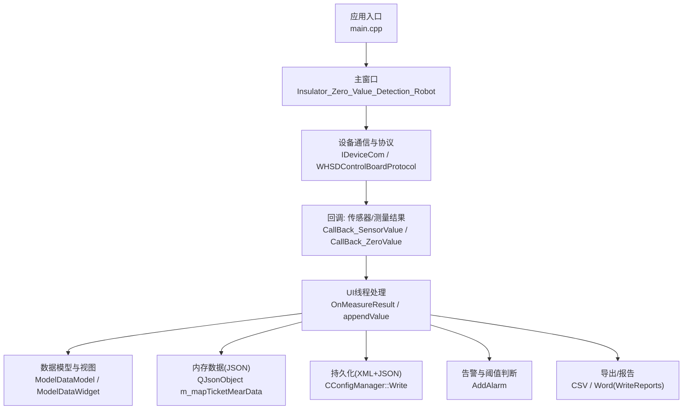
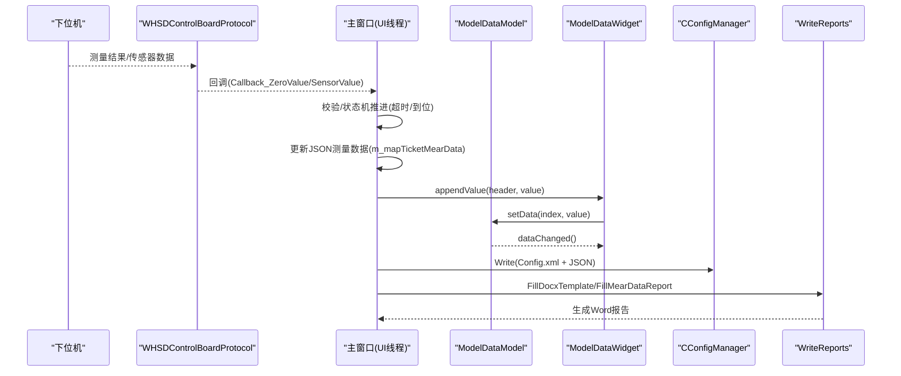
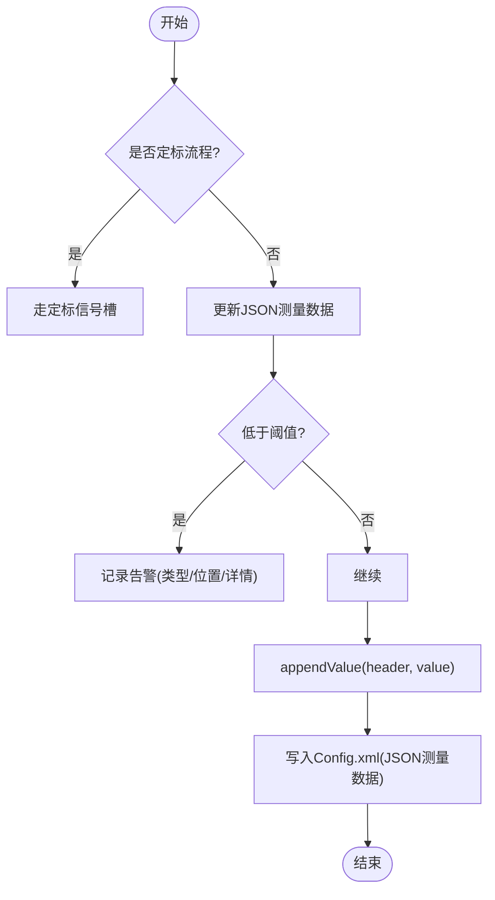
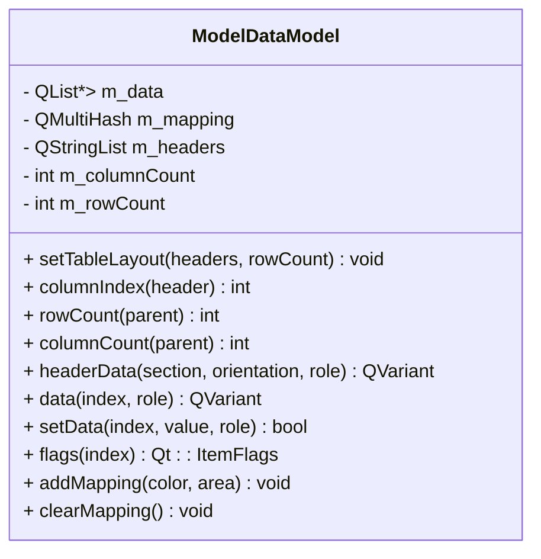
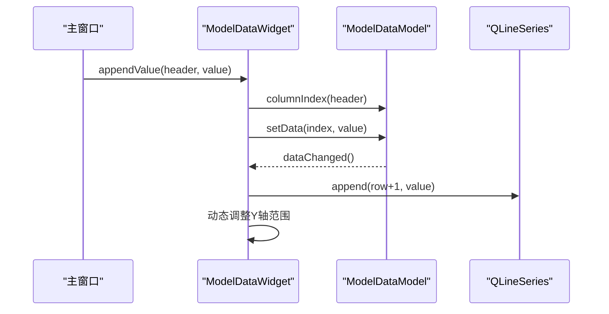
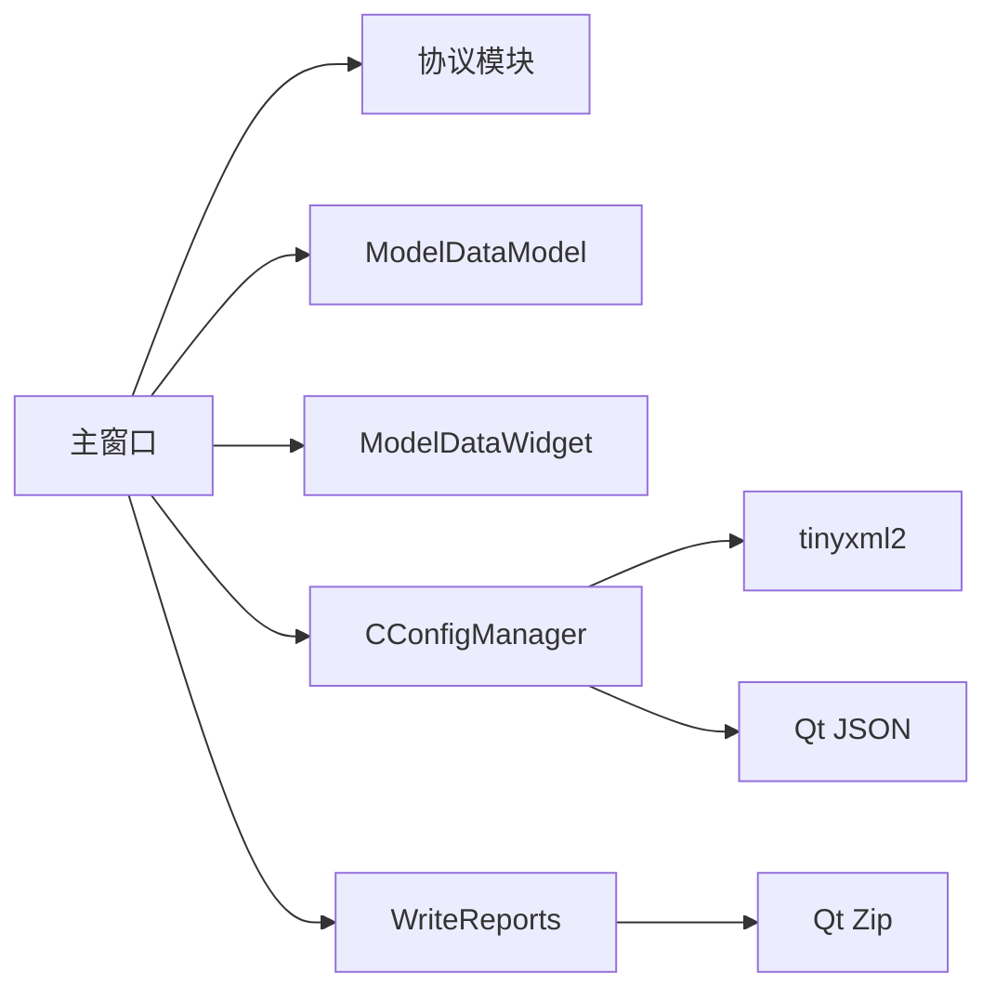

# 数据采集与存储

<cite>
**本文引用的文件**
- [main.cpp](file://Insulator_Zero_Value_Detection_Robot/main.cpp)
- [Insulator_Zero_Value_Detection_Robot.h](file://Insulator_Zero_Value_Detection_Robot/UI/Insulator_Zero_Value_Detection_Robot.h)
- [Insulator_Zero_Value_Detection_Robot.cpp](file://Insulator_Zero_Value_Detection_Robot/UI/Insulator_Zero_Value_Detection_Robot.cpp)
- [modeldatamodel.h](file://Insulator_Zero_Value_Detection_Robot/UI/modeldatamodel.h)
- [modeldatamodel.cpp](file://Insulator_Zero_Value_Detection_Robot/UI/modeldatamodel.cpp)
- [modeldatawidget.h](file://Insulator_Zero_Value_Detection_Robot/UI/modeldatawidget.h)
- [modeldatawidget.cpp](file://Insulator_Zero_Value_Detection_Robot/UI/modeldatawidget.cpp)
- [contentwidget.h](file://Insulator_Zero_Value_Detection_Robot/UI/contentwidget.h)
- [contentwidget.cpp](file://Insulator_Zero_Value_Detection_Robot/UI/contentwidget.cpp)
- [ConfigManager.h](file://Insulator_Zero_Value_Detection_Robot/Config/ConfigManager.h)
- [ConfigManager.cpp](file://Insulator_Zero_Value_Detection_Robot/Config/ConfigManager.cpp)
- [WriteReports.h](file://Insulator_Zero_Value_Detection_Robot/Report/WriteReports.h)
- [WriteReports.cpp](file://Insulator_Zero_Value_Detection_Robot/Report/WriteReports.cpp)
</cite>

## 目录
1. [简介](#简介)
2. [项目结构](#项目结构)
3. [核心组件](#核心组件)
4. [架构总览](#架构总览)
5. [详细组件分析](#详细组件分析)
6. [依赖关系分析](#依赖关系分析)
7. [性能考虑](#性能考虑)
8. [故障排查指南](#故障排查指南)
9. [结论](#结论)
10. [附录](#附录)

## 简介
本章节面向绝缘子零值检测机器人的“数据采集与存储”能力，系统说明测量数据的实时采集机制（传感器数据读取、格式转换、数据验证）、内存数据结构与持久化方案（XML配置+JSON测量数据）、ModelDataModel的数据模型实现（表格布局管理、数据映射、状态维护）、数据导入导出（CSV/Word报告）与批量处理能力，以及数据质量保证（异常处理、完整性检查、错误恢复）和性能优化建议。

## 项目结构
- 入口与主窗口：应用启动后创建主窗口并初始化UI、参数、设备通信与日志等子系统。
- 数据采集链路：协议线程接收传感器/测量结果回调，切到UI线程更新界面与数据模型，同时写入内存与持久化。
- 数据存储：使用XML配置文件保存工单、报告模板与测量数据（JSON文本），支持运行时增量落盘。
- 可视化与交互：基于Qt的表格与曲线视图，提供实时展示与重测删除能力。
- 报告生成：基于docx模板替换与表格行重建，输出Word报告；同时支持CSV导出。

图表来源
- [main.cpp:11-23](file://Insulator_Zero_Value_Detection_Robot/main.cpp#L11-L23)
- [Insulator_Zero_Value_Detection_Robot.cpp:231-315](file://Insulator_Zero_Value_Detection_Robot/UI/Insulator_Zero_Value_Detection_Robot.cpp#L231-L315)
- [Insulator_Zero_Value_Detection_Robot.cpp:649-753](file://Insulator_Zero_Value_Detection_Robot/UI/Insulator_Zero_Value_Detection_Robot.cpp#L649-L753)
- [ConfigManager.cpp:259-452](file://Insulator_Zero_Value_Detection_Robot/Config/ConfigManager.cpp#L259-L452)
- [WriteReports.cpp:107-151](file://Insulator_Zero_Value_Detection_Robot/Report/WriteReports.cpp#L107-L151)

章节来源
- [main.cpp:11-23](file://Insulator_Zero_Value_Detection_Robot/main.cpp#L11-L23)
- [Insulator_Zero_Value_Detection_Robot.cpp:231-315](file://Insulator_Zero_Value_Detection_Robot/UI/Insulator_Zero_Value_Detection_Robot.cpp#L231-L315)

## 核心组件
- 主窗口与流程控制：负责设备连接、定时器轮询、探针到位等待、测量超时、截图与录像、告警面板、工单/报告管理等。
- 数据模型与视图：ModelDataModel提供二维表格数据与颜色映射；ModelDataWidget将测量值追加到表格与曲线图，支持重测删除。
- 配置与持久化：CConfigManager读写XML，包含设备参数、相机参数、工单与报告列表，以及以JSON文本嵌入的测量数据。
- 报告生成：CWriteReports通过docx模板替换与表格行重建生成Word报告；同时支持CSV导出。

章节来源
- [Insulator_Zero_Value_Detection_Robot.h:26-385](file://Insulator_Zero_Value_Detection_Robot/UI/Insulator_Zero_Value_Detection_Robot.h#L26-L385)
- [modeldatamodel.h:12-39](file://Insulator_Zero_Value_Detection_Robot/UI/modeldatamodel.h#L12-L39)
- [modeldatawidget.h:20-49](file://Insulator_Zero_Value_Detection_Robot/UI/modeldatawidget.h#L20-L49)
- [ConfigManager.h:10-199](file://Insulator_Zero_Value_Detection_Robot/Config/ConfigManager.h#L10-L199)
- [WriteReports.h:24-89](file://Insulator_Zero_Value_Detection_Robot/Report/WriteReports.h#L24-L89)

## 架构总览
数据采集与存储采用“协议回调→UI线程→模型/视图→持久化/导出”的分层架构：
- 协议线程收到测量结果或传感器状态，通过信号槽切换到UI线程执行。
- UI线程更新内存中的JSON测量数据、刷新表格与曲线、进行阈值告警，并即时落盘XML（含JSON测量数据）。
- 用户触发导出时，生成CSV或Word报告。

图表来源
- [Insulator_Zero_Value_Detection_Robot.cpp:675-753](file://Insulator_Zero_Value_Detection_Robot/UI/Insulator_Zero_Value_Detection_Robot.cpp#L675-L753)
- [modeldatawidget.cpp:139-166](file://Insulator_Zero_Value_Detection_Robot/UI/modeldatawidget.cpp#L139-L166)
- [modeldatamodel.cpp:94-102](file://Insulator_Zero_Value_Detection_Robot/UI/modeldatamodel.cpp#L94-L102)
- [ConfigManager.cpp:259-452](file://Insulator_Zero_Value_Detection_Robot/Config/ConfigManager.cpp#L259-L452)
- [WriteReports.cpp:107-151](file://Insulator_Zero_Value_Detection_Robot/Report/WriteReports.cpp#L107-L151)

## 详细组件分析

### 实时数据采集机制
- 传感器数据读取：定时器周期发送传感器查询命令，协议回调更新状态（状态、电量、结果码）。
- 测量结果处理：收到0x0F测量结果后，先判断是否处于定标流程；否则进入工单测量流程，记录侧别/相别/方向，计算片号与阈值告警。
- 数据格式转换：原始浮点值转换为double用于显示与曲线绘制；JSON数组按顺序追加测量值。
- 数据验证：在触发测量前校验当前相/侧的测量数量上限（单联=片数，双联=2×片数），防止越界；对输入IP等字段使用正则校验。

图表来源
- [Insulator_Zero_Value_Detection_Robot.cpp:675-753](file://Insulator_Zero_Value_Detection_Robot/UI/Insulator_Zero_Value_Detection_Robot.cpp#L675-L753)
- [Insulator_Zero_Value_Detection_Robot.cpp:2030-2053](file://Insulator_Zero_Value_Detection_Robot/UI/Insulator_Zero_Value_Detection_Robot.cpp#L2030-L2053)

章节来源
- [Insulator_Zero_Value_Detection_Robot.cpp:413-559](file://Insulator_Zero_Value_Detection_Robot/UI/Insulator_Zero_Value_Detection_Robot.cpp#L413-L559)
- [Insulator_Zero_Value_Detection_Robot.cpp:649-753](file://Insulator_Zero_Value_Detection_Robot/UI/Insulator_Zero_Value_Detection_Robot.cpp#L649-L753)
- [Insulator_Zero_Value_Detection_Robot.cpp:2030-2053](file://Insulator_Zero_Value_Detection_Robot/UI/Insulator_Zero_Value_Detection_Robot.cpp#L2030-L2053)

### 数据存储结构设计
- 内存数据结构：
  - QJsonObject m_mapTicketMearData：第一层key为侧别，第二层key为相别/方向，值为该相测量值数组(QJsonArray)。
  - 每获得一个测量值即追加到对应数组，便于后续导出与报告填充。
- 持久化存储方案：
  - XML配置文件：保存设备参数、相机参数、工单与报告列表，并在每个工单子节点中嵌入JSON文本作为测量数据。
  - 运行时增量落盘：每次收到测量值后更新当前工单的JSON测量数据并立即写回XML，保证数据不丢失。
- 数据库设计：
  - 本项目未引入关系型数据库，采用XML+JSON组合存储，满足轻量级、易读、可移植的需求。

章节来源
- [Insulator_Zero_Value_Detection_Robot.h:286-290](file://Insulator_Zero_Value_Detection_Robot/UI/Insulator_Zero_Value_Detection_Robot.h#L286-L290)
- [Insulator_Zero_Value_Detection_Robot.cpp:32-53](file://Insulator_Zero_Value_Detection_Robot/UI/Insulator_Zero_Value_Detection_Robot.cpp#L32-L53)
- [Insulator_Zero_Value_Detection_Robot.cpp:710-733](file://Insulator_Zero_Value_Detection_Robot/UI/Insulator_Zero_Value_Detection_Robot.cpp#L710-L733)
- [ConfigManager.cpp:132-217](file://Insulator_Zero_Value_Detection_Robot/Config/ConfigManager.cpp#L132-L217)
- [ConfigManager.cpp:349-414](file://Insulator_Zero_Value_Detection_Robot/Config/ConfigManager.cpp#L349-L414)

### ModelDataModel 实现详解
- 表格布局管理：
  - setTableLayout(headers, rowCount)：重置模型，初始化行列，未测量单元格用NaN占位，确保首次渲染为空。
  - headerData：水平表头返回列名，垂直表头返回行号。
- 数据映射与状态维护：
  - addMapping(color, area)：为指定区域设置背景色映射，用于区分不同列/区域。
  - data(role)：DisplayRole/EditRole返回数值或空；BackgroundRole根据映射返回颜色。
  - setData：编辑模式下更新单元格值并触发dataChanged。
  - flags：允许编辑。
- 复杂度与性能：
  - 行列访问O(1)，颜色映射查找为线性扫描，但通常列数有限，影响较小。

图表来源
- [modeldatamodel.h:12-39](file://Insulator_Zero_Value_Detection_Robot/UI/modeldatamodel.h#L12-L39)
- [modeldatamodel.cpp:20-113](file://Insulator_Zero_Value_Detection_Robot/UI/modeldatamodel.cpp#L20-L113)

章节来源
- [modeldatamodel.h:12-39](file://Insulator_Zero_Value_Detection_Robot/UI/modeldatamodel.h#L12-L39)
- [modeldatamodel.cpp:20-113](file://Insulator_Zero_Value_Detection_Robot/UI/modeldatamodel.cpp#L20-L113)

### ModelDataWidget 与可视化
- 表格与曲线联动：
  - setTableLayout：清理旧曲线，重建表格布局，为每列创建QLineSeries并绑定坐标轴。
  - appendValue：找到列对应下一个空单元格填充，追加曲线点，动态扩展Y轴范围。
  - removeLastValue：删除最近一次测量值及其曲线点，支持重测。
- 布局与自适应：
  - 表格宽度按表头文字宽度计算，Splitter分配剩余空间给曲线图，避免拉伸失真。
  - resizeEvent延迟应用宽度，避免拖拽冲突。

图表来源
- [modeldatawidget.cpp:71-120](file://Insulator_Zero_Value_Detection_Robot/UI/modeldatawidget.cpp#L71-L120)
- [modeldatawidget.cpp:139-166](file://Insulator_Zero_Value_Detection_Robot/UI/modeldatawidget.cpp#L139-L166)
- [modeldatamodel.cpp:94-102](file://Insulator_Zero_Value_Detection_Robot/UI/modeldatamodel.cpp#L94-L102)

章节来源
- [modeldatawidget.h:20-49](file://Insulator_Zero_Value_Detection_Robot/UI/modeldatawidget.h#L20-L49)
- [modeldatawidget.cpp:71-187](file://Insulator_Zero_Value_Detection_Robot/UI/modeldatawidget.cpp#L71-L187)

### 数据导入导出与批量处理
- CSV导出：
  - 遍历m_mapTicketMearData的侧别/方向层级，逐行写入CSV，保留测量值顺序，支持批量导出。
- Word报告生成：
  - 使用CWriteReports.FillDocxTemplate填充模板占位符。
  - 使用FillMearDataReport将双联测量数据填入报告数据表，自动增删行以适应实际片数。
- 批量能力：
  - 报告数据行按最大片数重建，支持多相多侧的大批量数据一次性生成。

章节来源
- [Insulator_Zero_Value_Detection_Robot.cpp:2767-2819](file://Insulator_Zero_Value_Detection_Robot/UI/Insulator_Zero_Value_Detection_Robot.cpp#L2767-L2819)
- [WriteReports.h:24-89](file://Insulator_Zero_Value_Detection_Robot/Report/WriteReports.h#L24-L89)
- [WriteReports.cpp:107-151](file://Insulator_Zero_Value_Detection_Robot/Report/WriteReports.cpp#L107-L151)
- [WriteReports.cpp:206-321](file://Insulator_Zero_Value_Detection_Robot/Report/WriteReports.cpp#L206-L321)

### 数据质量保证机制
- 异常数据处理：
  - 测量结果超时：若未在设定时间内收到回报，视为失败并自动结束流程，记录告警。
  - 探针到位兜底超时：未收到到位信号时，超过兜底时间也触发测量或中止。
- 数据完整性检查：
  - 触发前校验当前相/侧测量数量上限，防止越界。
  - JSON解析失败时跳过写入，避免损坏配置。
- 错误恢复策略：
  - 每次测量后立即落盘XML，减少数据丢失风险。
  - 告警面板记录类型、位置与详情，便于回溯与定位问题。

章节来源
- [Insulator_Zero_Value_Detection_Robot.cpp:67-73](file://Insulator_Zero_Value_Detection_Robot/UI/Insulator_Zero_Value_Detection_Robot.cpp#L67-L73)
- [Insulator_Zero_Value_Detection_Robot.cpp:710-733](file://Insulator_Zero_Value_Detection_Robot/UI/Insulator_Zero_Value_Detection_Robot.cpp#L710-L733)
- [ConfigManager.cpp:203-212](file://Insulator_Zero_Value_Detection_Robot/Config/ConfigManager.cpp#L203-L212)

## 依赖关系分析
- 主窗口依赖设备通信与协议模块，订阅传感器与测量结果回调。
- 数据模型与视图依赖Qt框架，提供表格与曲线展示。
- 配置管理器依赖tinyxml2与Qt JSON库，完成XML与JSON互转。
- 报告生成依赖docx内部结构与Qt Zip工具，进行模板替换与表格重建。

图表来源
- [Insulator_Zero_Value_Detection_Robot.cpp:231-315](file://Insulator_Zero_Value_Detection_Robot/UI/Insulator_Zero_Value_Detection_Robot.cpp#L231-L315)
- [ConfigManager.cpp:1-7](file://Insulator_Zero_Value_Detection_Robot/Config/ConfigManager.cpp#L1-L7)
- [WriteReports.cpp:1-8](file://Insulator_Zero_Value_Detection_Robot/Report/WriteReports.cpp#L1-L8)

章节来源
- [Insulator_Zero_Value_Detection_Robot.cpp:231-315](file://Insulator_Zero_Value_Detection_Robot/UI/Insulator_Zero_Value_Detection_Robot.cpp#L231-L315)
- [ConfigManager.cpp:1-7](file://Insulator_Zero_Value_Detection_Robot/Config/ConfigManager.cpp#L1-L7)
- [WriteReports.cpp:1-8](file://Insulator_Zero_Value_Detection_Robot/Report/WriteReports.cpp#L1-L8)

## 性能考虑
- 高频回调与UI线程隔离：协议回调通过信号槽切到UI线程，避免跨线程直接操作UI，降低锁竞争与重绘开销。
- 表格与曲线增量更新：仅追加新点与更新受影响单元格，减少全量刷新。
- 动态坐标轴范围：根据最新值动态扩展Y轴，避免频繁重置导致的重绘。
- 持久化频率：每次测量值到达即落盘XML，兼顾数据安全与I/O压力；如需更高吞吐，可改为批量化落盘（例如每N条或定时合并）。
- 大数据量处理：
  - 当测量数据规模较大时，建议在导出阶段进行分页或分片处理，避免一次性构建超大字符串。
  - 报告生成时，表格行重建已按最大片数自适应，注意模板行数与性能平衡。

[本节为通用性能指导，无需特定文件引用]

## 故障排查指南
- 测量无结果：
  - 检查设备连接状态与心跳计数，确认控制板已连接。
  - 查看测量等待弹窗与超时定时器是否激活，确认探针到位逻辑与兜底超时。
- 数据未持久化：
  - 检查Config.xml写入路径与权限，确认Write返回值与日志输出。
  - 验证JSON序列化与解析过程，确保无解析错误。
- 报告生成失败：
  - 确认模板路径有效且非只读，输出目录存在或可创建。
  - 检查模板中是否存在数据表与占位符，确保文档结构符合预期。

章节来源
- [Insulator_Zero_Value_Detection_Robot.cpp:635-640](file://Insulator_Zero_Value_Detection_Robot/UI/Insulator_Zero_Value_Detection_Robot.cpp#L635-L640)
- [Insulator_Zero_Value_Detection_Robot.cpp:710-733](file://Insulator_Zero_Value_Detection_Robot/UI/Insulator_Zero_Value_Detection_Robot.cpp#L710-L733)
- [ConfigManager.cpp:445-452](file://Insulator_Zero_Value_Detection_Robot/Config/ConfigManager.cpp#L445-L452)
- [WriteReports.cpp:40-105](file://Insulator_Zero_Value_Detection_Robot/Report/WriteReports.cpp#L40-L105)

## 结论
本系统实现了从传感器数据采集、实时可视化、内存与持久化存储到报告导出的完整闭环。通过协议回调与UI线程分离、增量更新与动态坐标轴、XML+JSON组合存储与docx模板报告生成，既保证了数据一致性与可追溯性，又兼顾了用户体验与性能。未来可在批量化落盘、异步导出与缓存策略方面进一步优化，以应对更大规模的数据场景。

[本节为总结性内容，无需特定文件引用]

## 附录
- 关键常量与时序：
  - 探针到位轮询周期、兜底等待时间、测量结果超时时间等参数定义于主窗口文件中，可根据现场环境调整。
- 数据模型接口：
  - ModelDataModel提供表格布局、数据映射与编辑能力；ModelDataWidget提供追加与删除测量值的便捷接口。
- 配置项说明：
  - 设备控制板参数、相机参数、工单与报告列表均在XML中管理，测量数据以JSON文本嵌入。

[本节为补充信息，无需特定文件引用]