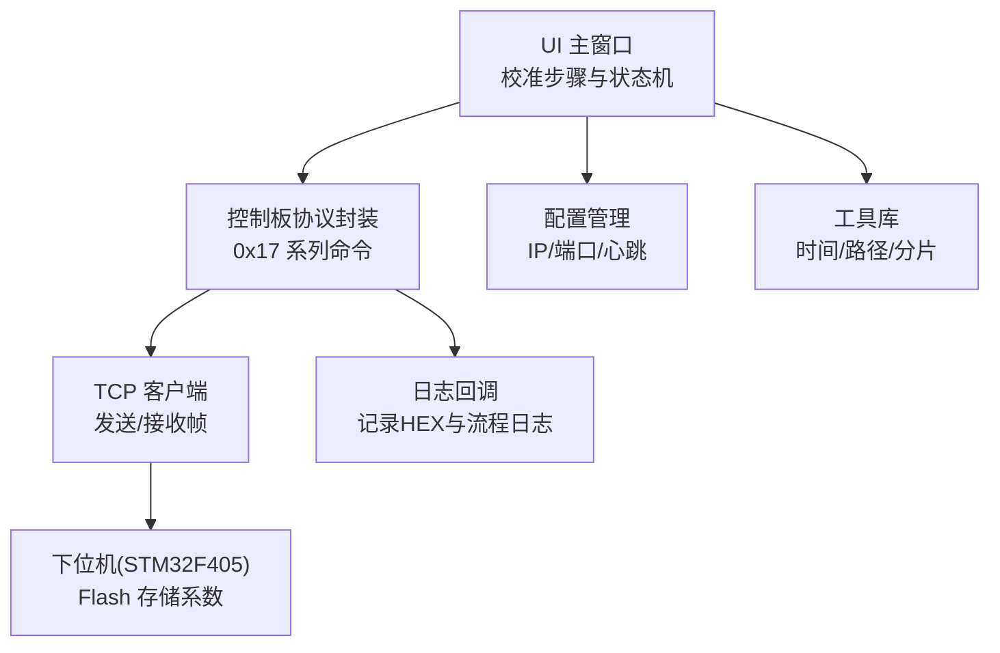
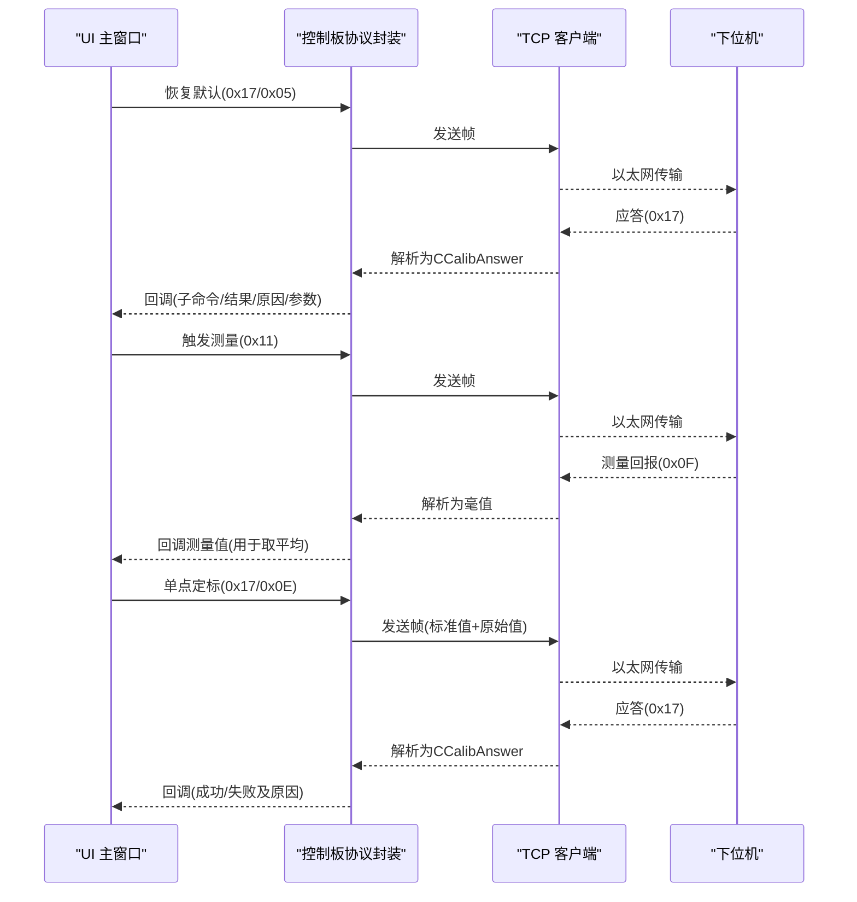
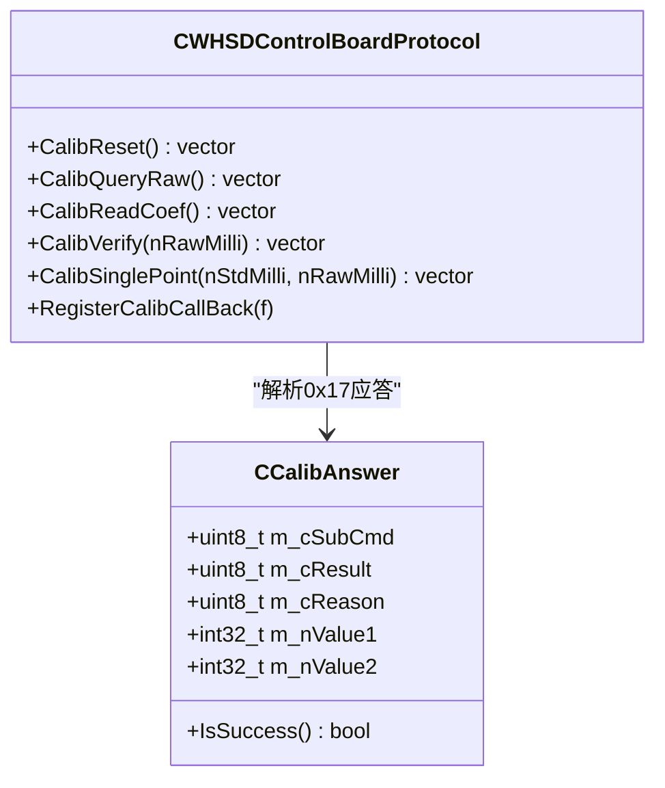
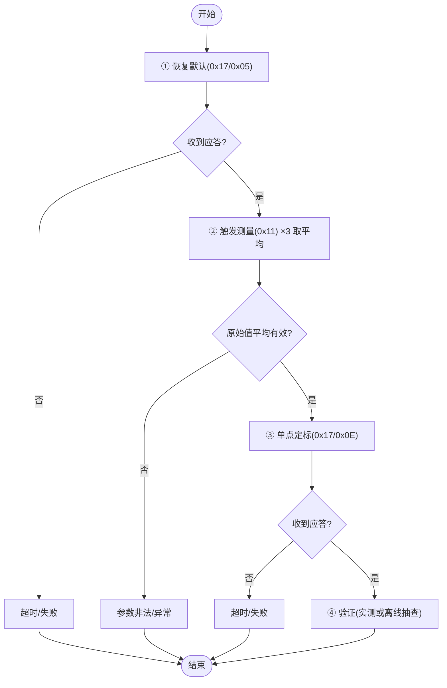
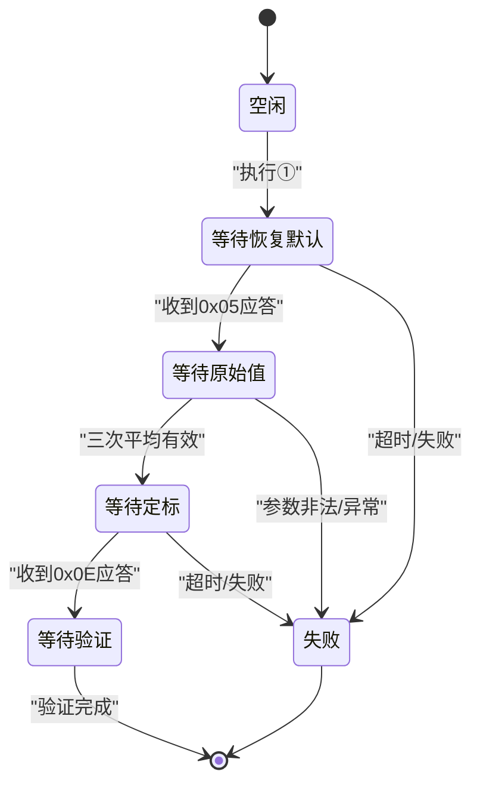
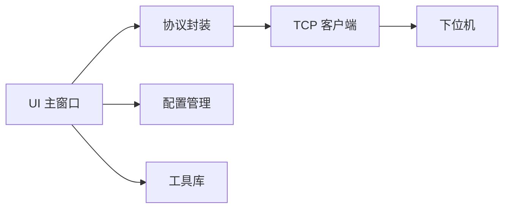

# 校准功能

<cite>
**本文引用的文件**
- [单点定标协议与流程_V1.0.html](file://Insulator_Zero_Value_Detection_Robot/单点定标协议与流程_V1.0.html)
- [WHSDControlBoradProtocol.h](file://Insulator_Zero_Value_Detection_Robot/Protocol/WHSDControlBoradProtocol.h)
- [WHSDControlBoradProtocol.cpp](file://Insulator_Zero_Value_Detection_Robot/Protocol/WHSDControlBoradProtocol.cpp)
- [Insulator_Zero_Value_Detection_Robot.h](file://Insulator_Zero_Value_Detection_Robot/UI/Insulator_Zero_Value_Detection_Robot.h)
- [TcpClient.h](file://Insulator_Zero_Value_Detection_Robot/DeviceCom/TcpClient.h)
- [ConfigManager.h](file://Insulator_Zero_Value_Detection_Robot/Config/ConfigManager.h)
- [ConfigManager.cpp](file://Insulator_Zero_Value_Detection_Robot/Config/ConfigManager.cpp)
- [Tools.h](file://Insulator_Zero_Value_Detection_Robot/Tools/Tools.h)
</cite>

## 目录
1. [简介](#简介)
2. [项目结构](#项目结构)
3. [核心组件](#核心组件)
4. [架构总览](#架构总览)
5. [详细组件分析](#详细组件分析)
6. [依赖关系分析](#依赖关系分析)
7. [性能考虑](#性能考虑)
8. [故障排查指南](#故障排查指南)
9. [结论](#结论)
10. [附录](#附录)

## 简介
本文件面向绝缘子零值检测机器人的“阻值单点校准”功能，系统化说明校准协议、通信细节、参数计算与精度验证、状态管理与错误处理、工具使用与调试方法、数据存储与管理策略、结果分析与质量评估标准，以及校准周期维护与定期校验要求。文档基于仓库中的协议文档与代码实现进行梳理，确保与实际工程一致。

## 项目结构
校准相关能力主要分布在以下模块：
- 协议层：定义并封装了校准命令（恢复默认、查询原始值、读回系数、补偿验证、单点定标）的打包与解析。
- 设备通信层：通过 TCP 将协议帧发送至下位机，并接收应答与测量回报。
- UI 控制层：提供校准步骤的交互界面、状态机推进、日志记录与超时保护。
- 配置层：管理设备连接参数、心跳间隔等运行配置。
- 工具层：提供二进制数据拆分、时间戳、路径管理等通用能力。

图表来源
- [Insulator_Zero_Value_Detection_Robot.h:108-127](file://Insulator_Zero_Value_Detection_Robot/UI/Insulator_Zero_Value_Detection_Robot.h#L108-L127)
- [WHSDControlBoradProtocol.h:256-287](file://Insulator_Zero_Value_Detection_Robot/Protocol/WHSDControlBoradProtocol.h#L256-L287)
- [TcpClient.h:8-46](file://Insulator_Zero_Value_Detection_Robot/DeviceCom/TcpClient.h#L8-L46)
- [ConfigManager.h:10-24](file://Insulator_Zero_Value_Detection_Robot/Config/ConfigManager.h#L10-L24)
- [Tools.h:20-78](file://Insulator_Zero_Value_Detection_Robot/Tools/Tools.h#L20-L78)

章节来源
- [Insulator_Zero_Value_Detection_Robot.h:108-127](file://Insulator_Zero_Value_Detection_Robot/UI/Insulator_Zero_Value_Detection_Robot.h#L108-L127)
- [WHSDControlBoradProtocol.h:256-287](file://Insulator_Zero_Value_Detection_Robot/Protocol/WHSDControlBoradProtocol.h#L256-L287)
- [TcpClient.h:8-46](file://Insulator_Zero_Value_Detection_Robot/DeviceCom/TcpClient.h#L8-L46)
- [ConfigManager.h:10-24](file://Insulator_Zero_Value_Detection_Robot/Config/ConfigManager.h#L10-L24)
- [Tools.h:20-78](file://Insulator_Zero_Value_Detection_Robot/Tools/Tools.h#L20-L78)

## 核心组件
- 校准协议封装类：提供恢复默认、查询原始值、读回系数、补偿验证、单点定标等命令的构造与发送；负责解析 0x17 校准应答，并通过回调通知上层。
- UI 校准状态机：按顺序执行①恢复默认→②测原始值（连测3次取平均）→③下发单点定标→④验证（实测或离线抽查）→辅助读回系数；包含超时保护与互斥逻辑。
- 设备通信：TCP 客户端负责建立连接、收发帧；协议层在收到 0x0F 测量回报时区分是否处于校准流程。
- 配置管理：读取/写入设备 IP、端口、心跳间隔等，支撑校准前连接准备。
- 工具库：提供二进制分片、Base64、路径与时间等基础能力。

章节来源
- [WHSDControlBoradProtocol.h:256-287](file://Insulator_Zero_Value_Detection_Robot/Protocol/WHSDControlBoradProtocol.h#L256-L287)
- [Insulator_Zero_Value_Detection_Robot.h:108-127](file://Insulator_Zero_Value_Detection_Robot/UI/Insulator_Zero_Value_Detection_Robot.h#L108-L127)
- [TcpClient.h:8-46](file://Insulator_Zero_Value_Detection_Robot/DeviceCom/TcpClient.h#L8-L46)
- [ConfigManager.h:10-24](file://Insulator_Zero_Value_Detection_Robot/Config/ConfigManager.h#L10-L24)
- [Tools.h:20-78](file://Insulator_Zero_Value_Detection_Robot/Tools/Tools.h#L20-L78)

## 架构总览
校准流程由 UI 驱动，调用协议层封装的命令，经 TCP 发送至下位机；下位机完成 Flash 写操作后返回校准应答，或通过 0x0F 上报测量值。UI 侧通过信号槽将协议线程的数据切换到 UI 线程处理，保证界面响应与线程安全。

图表来源
- [Insulator_Zero_Value_Detection_Robot.h:108-127](file://Insulator_Zero_Value_Detection_Robot/UI/Insulator_Zero_Value_Detection_Robot.h#L108-L127)
- [WHSDControlBoradProtocol.cpp:392-418](file://Insulator_Zero_Value_Detection_Robot/Protocol/WHSDControlBoradProtocol.cpp#L392-L418)
- [WHSDControlBoradProtocol.cpp:582-616](file://Insulator_Zero_Value_Detection_Robot/Protocol/WHSDControlBoradProtocol.cpp#L582-L616)
- [TcpClient.h:8-46](file://Insulator_Zero_Value_Detection_Robot/DeviceCom/TcpClient.h#L8-L46)

## 详细组件分析

### 校准协议与命令
- 恢复默认（0x17/0x05）：清空全部校准（两点系数、折点表、公式系数），测量通道直通（直接回报原始值）。单点定标前必发。
- 查询原始值（0x17/0x06）：回传最近一次原始 X。下位机只认最近一次 0x0F 回报后 5 秒内刷新的值，超时返回失败与原因码。
- 读回系数（0x17/0x0C）：核对 Flash 中已存的 a/b 毫值。
- 补偿验证（0x17/0x0A）：不挂电阻，直接下发任意原始值，应答回显“原始值 + 校准后值”，用于离线抽查系数是否生效。
- 单点定标（0x17/0x0E，核心命令）：下发“标准值 + 实测原始值”，固件自动计算补偿系数 c 并立即写入 Flash（擦写需 1~2 秒，应答超时建议 ≥ 3 秒）。参数必须正好 8 字节，后发覆盖先发，无须先清除。

图表来源
- [WHSDControlBoradProtocol.h:21-52](file://Insulator_Zero_Value_Detection_Robot/Protocol/WHSDControlBoradProtocol.h#L21-L52)
- [WHSDControlBoradProtocol.h:256-287](file://Insulator_Zero_Value_Detection_Robot/Protocol/WHSDControlBoradProtocol.h#L256-L287)
- [WHSDControlBoradProtocol.cpp:392-418](file://Insulator_Zero_Value_Detection_Robot/Protocol/WHSDControlBoradProtocol.cpp#L392-L418)

章节来源
- [WHSDControlBoradProtocol.h:256-287](file://Insulator_Zero_Value_Detection_Robot/Protocol/WHSDControlBoradProtocol.h#L256-L287)
- [WHSDControlBoradProtocol.cpp:582-616](file://Insulator_Zero_Value_Detection_Robot/Protocol/WHSDControlBoradProtocol.cpp#L582-L616)
- [WHSDControlBoradProtocol.cpp:392-418](file://Insulator_Zero_Value_Detection_Robot/Protocol/WHSDControlBoradProtocol.cpp#L392-L418)

### 阻值单点校准完整流程与操作步骤
- 步骤① 恢复默认：点击“执行”，等待状态变为“已恢复默认”。
- 步骤② 测原始值：点击“执行”，软件自动连测 3 次，完成后显示“原始值平均”。
- 步骤③ 下发定标：点击“执行”，等待“定标成功 c=…”提示（写 Flash 约需 1~2 秒）。
- 步骤④ 验证：点击“触发实测”，查看“验证结果”中的实测值与误差百分比；或点击“离线抽查”在不挂电阻情况下核对。
- 辅助：点击“读回系数(0x0C)”核对系数。

注意事项
- 步骤③要求原始值平均值必须大于 0 且小于标准值；若原始值 ≥ 标准值，说明模块读数偏高，软件会提示“参数非法”，此时应检查接线与硬件，切勿强行定标。
- 校准与工单测量流程互斥：工单测量进行中无法启动校准。
- 各步骤有超时保护（测量约 6 秒、写 Flash 约 5 秒、普通命令约 3 秒），超时会在日志中提示。

图表来源
- [Insulator_Zero_Value_Detection_Robot.h:108-127](file://Insulator_Zero_Value_Detection_Robot/UI/Insulator_Zero_Value_Detection_Robot.h#L108-L127)
- [WHSDControlBoradProtocol.cpp:582-616](file://Insulator_Zero_Value_Detection_Robot/Protocol/WHSDControlBoradProtocol.cpp#L582-L616)

章节来源
- [Insulator_Zero_Value_Detection_Robot.h:108-127](file://Insulator_Zero_Value_Detection_Robot/UI/Insulator_Zero_Value_Detection_Robot.h#L108-L127)

### 校准协议的技术规范与通信细节
- 物理链路：主控板 UART5（115200 8N1）→ USR-C210 以太网模组 → TCP。
- 网络参数：静态 IP 192.168.11.111，TCP 端口 8234。
- 涉及命令：0x11 触发检测、0x0F 结果回报、0x17 校准命令（子命令 0x05 / 0x06 / 0x0C / 0x0A / 0x0E）。
- 系数存储：下位机 Flash Sector4，掉电保存，上电自动加载。
- 数据格式：多字节整数一律大端；X 值与定标参数均为 int32 有符号毫值。

章节来源
- [单点定标协议与流程_V1.0.html:31-43](file://Insulator_Zero_Value_Detection_Robot/单点定标协议与流程_V1.0.html#L31-L43)
- [WHSDControlBoradProtocol.cpp:562-580](file://Insulator_Zero_Value_Detection_Robot/Protocol/WHSDControlBoradProtocol.cpp#L562-L580)

### 校准参数的计算方法与精度验证机制
- 参数含义：
  - 毫值 = 物理值 × 1000 的整数（例如 500 MΩ → 500000）。
  - 原始值 = 检测模块未经补偿的测量输出。
  - 修正值 = 补偿后的输出。
- 单点定标：下发“标准值 + 实测原始值”，固件自动计算补偿系数并写入 Flash。
- 精度验证：
  - 实测验证：触发测量，对比 0x0F 回报的修正值与标准值，计算误差百分比。
  - 离线抽查：通过 0x17/0x0A 下发任意原始值，回显“原始值 + 校准后值”，无需挂电阻即可核对系数是否生效。
  - 读回系数：通过 0x17/0x0C 核对 Flash 中已存的 a/b 毫值。

章节来源
- [单点定标协议与流程_V1.0.html:31-43](file://Insulator_Zero_Value_Detection_Robot/单点定标协议与流程_V1.0.html#L31-L43)
- [WHSDControlBoradProtocol.h:268-287](file://Insulator_Zero_Value_Detection_Robot/Protocol/WHSDControlBoradProtocol.h#L268-L287)
- [WHSDControlBoradProtocol.cpp:600-616](file://Insulator_Zero_Value_Detection_Robot/Protocol/WHSDControlBoradProtocol.cpp#L600-L616)

### 校准过程的状态管理与错误处理
- 状态机：UI 侧维护校准步骤状态（空闲、等待恢复默认、等待原始值、等待定标应答、等待验证、等待辅助命令），每步发出命令后进入等待态，靠信号槽收结果推进。
- 超时保护：测量约 6 秒、写 Flash 约 5 秒、普通命令约 3 秒，超时结束本轮等待并提示。
- 互斥：校准与工单测量流程互斥，避免 0x0F 结果被误用。
- 错误码与原因：
  - 0x01 原始值已超时
  - 0x04 Flash 写失败
  - 0x05 参数长度/格式错误
  - 0x09 参数非法
- 异常处理：当原始值 ≥ 标准值时提示“参数非法”，应检查接线与硬件，禁止强行定标。

图表来源
- [Insulator_Zero_Value_Detection_Robot.h:315-355](file://Insulator_Zero_Value_Detection_Robot/UI/Insulator_Zero_Value_Detection_Robot.h#L315-L355)
- [WHSDControlBoradProtocol.h:31-49](file://Insulator_Zero_Value_Detection_Robot/Protocol/WHSDControlBoradProtocol.h#L31-L49)

章节来源
- [Insulator_Zero_Value_Detection_Robot.h:315-355](file://Insulator_Zero_Value_Detection_Robot/UI/Insulator_Zero_Value_Detection_Robot.h#L315-L355)
- [WHSDControlBoradProtocol.h:31-49](file://Insulator_Zero_Value_Detection_Robot/Protocol/WHSDControlBoradProtocol.h#L31-L49)

### 校准工具的使用指南与调试方法
- 使用指南：
  - 在 UI 界面选择“阻值单点校准”，按步骤①至④依次执行。
  - 输入标准电阻值（MΩ），点击对应步骤“执行”。
  - 观察“流程日志”文本框，确认每一步的状态与结果。
- 调试方法：
  - 利用“流程日志”与 HEX 日志逐条比对协议示例帧，便于定位通信问题。
  - 通过“离线抽查”快速验证系数是否生效，无需挂电阻。
  - 通过“读回系数”核对 Flash 中已存系数。
  - 关注超时提示与错误原因码，结合接线与硬件检查。

章节来源
- [Insulator_Zero_Value_Detection_Robot.h:108-127](file://Insulator_Zero_Value_Detection_Robot/UI/Insulator_Zero_Value_Detection_Robot.h#L108-L127)

### 校准数据的存储与管理策略
- 下位机存储：系数存储于 Flash Sector4，掉电保存，上电自动加载。
- 上位机配置：通过配置管理读写设备 IP、端口、心跳间隔等参数，保障校准前连接稳定。
- 日志与报告：流程日志与测量数据可持久化，便于追溯与分析。

章节来源
- [单点定标协议与流程_V1.0.html:31-43](file://Insulator_Zero_Value_Detection_Robot/单点定标协议与流程_V1.0.html#L31-L43)
- [ConfigManager.cpp:16-257](file://Insulator_Zero_Value_Detection_Robot/Config/ConfigManager.cpp#L16-L257)
- [ConfigManager.cpp:259-452](file://Insulator_Zero_Value_Detection_Robot/Config/ConfigManager.cpp#L259-L452)

### 校准结果的分析和质量评估标准
- 结果分析：
  - 实测验证：对比修正值与标准值，计算误差百分比。
  - 离线抽查：比较回显的“校准后值”与预期，判断系数是否生效。
  - 读回系数：核对 a/b 毫值是否符合预期。
- 质量评估：
  - 误差百分比应在允许范围内（依据现场标准设定）。
  - 若出现“参数非法”或“原始值已超时”，应重新检查接线与硬件，必要时重复校准。
  - 多次校准后仍不稳定，需排查传感器与模块健康状态。

章节来源
- [Insulator_Zero_Value_Detection_Robot.h:108-127](file://Insulator_Zero_Value_Detection_Robot/UI/Insulator_Zero_Value_Detection_Robot.h#L108-L127)
- [单点定标协议与流程_V1.0.html:31-43](file://Insulator_Zero_Value_Detection_Robot/单点定标协议与流程_V1.0.html#L31-L43)

### 校准周期的维护和定期校验要求
- 建议周期：
  - 新设备上线或更换模块后必须进行校准。
  - 环境变化（温度、湿度）较大或长期未使用时，建议定期校验。
  - 每次批量检测前，建议进行一次快速验证（离线抽查或单次实测）。
- 维护要点：
  - 保持连接稳定（IP/端口正确，心跳正常）。
  - 记录每次校准结果与日志，便于趋势分析。
  - 发现漂移或异常及时复校或检修硬件。

[本节为通用指导，不直接分析具体文件]

## 依赖关系分析
- UI 依赖协议封装：通过信号槽接收校准应答与测量值，推进状态机。
- 协议封装依赖 TCP 客户端：发送与接收帧，解析 0x17 与 0x0F。
- 配置管理影响连接参数：IP、端口、心跳间隔决定通信稳定性。
- 工具库支持数据分片与路径管理：用于 OTA 与文件操作（校准流程间接受益）。

图表来源
- [Insulator_Zero_Value_Detection_Robot.h:108-127](file://Insulator_Zero_Value_Detection_Robot/UI/Insulator_Zero_Value_Detection_Robot.h#L108-L127)
- [WHSDControlBoradProtocol.cpp:582-616](file://Insulator_Zero_Value_Detection_Robot/Protocol/WHSDControlBoradProtocol.cpp#L582-L616)
- [TcpClient.h:8-46](file://Insulator_Zero_Value_Detection_Robot/DeviceCom/TcpClient.h#L8-L46)
- [ConfigManager.h:10-24](file://Insulator_Zero_Value_Detection_Robot/Config/ConfigManager.h#L10-L24)
- [Tools.h:20-78](file://Insulator_Zero_Value_Detection_Robot/Tools/Tools.h#L20-L78)

章节来源
- [Insulator_Zero_Value_Detection_Robot.h:108-127](file://Insulator_Zero_Value_Detection_Robot/UI/Insulator_Zero_Value_Detection_Robot.h#L108-L127)
- [WHSDControlBoradProtocol.cpp:582-616](file://Insulator_Zero_Value_Detection_Robot/Protocol/WHSDControlBoradProtocol.cpp#L582-L616)
- [TcpClient.h:8-46](file://Insulator_Zero_Value_Detection_Robot/DeviceCom/TcpClient.h#L8-L46)
- [ConfigManager.h:10-24](file://Insulator_Zero_Value_Detection_Robot/Config/ConfigManager.h#L10-L24)
- [Tools.h:20-78](file://Insulator_Zero_Value_Detection_Robot/Tools/Tools.h#L20-L78)

## 性能考虑
- 超时设置：测量约 6 秒、写 Flash 约 5 秒、普通命令约 3 秒，避免长时间阻塞。
- 并发互斥：校准与工单测量互斥，防止 0x0F 结果被误用。
- 数据解析效率：协议层对 0x17 与 0x0F 的解析采用高效缓冲与边界检查，减少误包影响。
- 网络稳定性：确保 TCP 连接稳定，心跳正常，降低重传与丢包风险。

[本节为通用指导，不直接分析具体文件]

## 故障排查指南
- 常见问题：
  - 原始值已超时：检查 0x0F 回报是否在 5 秒内刷新，确认连接与模块工作正常。
  - Flash 写失败：重试定标，检查电源与模块状态。
  - 参数长度/格式错误：确认下发的 8 字节参数（标准值 + 原始值）为大端 int32。
  - 参数非法：原始值 ≥ 标准值，检查接线与硬件，勿强行定标。
- 调试手段：
  - 查看“流程日志”与 HEX 日志，逐条比对协议示例帧。
  - 使用“离线抽查”快速验证系数是否生效。
  - 通过“读回系数”核对 Flash 中已存系数。
  - 检查配置中的 IP、端口与心跳间隔是否正确。

章节来源
- [Insulator_Zero_Value_Detection_Robot.h:108-127](file://Insulator_Zero_Value_Detection_Robot/UI/Insulator_Zero_Value_Detection_Robot.h#L108-L127)
- [WHSDControlBoradProtocol.h:31-49](file://Insulator_Zero_Value_Detection_Robot/Protocol/WHSDControlBoradProtocol.h#L31-L49)
- [ConfigManager.cpp:16-257](file://Insulator_Zero_Value_Detection_Robot/Config/ConfigManager.cpp#L16-L257)

## 结论
本文件系统阐述了绝缘子零值检测机器人“阻值单点校准”的完整流程、协议规范、参数计算与精度验证、状态管理与错误处理、工具使用与调试方法、数据存储与管理策略、结果分析与质量评估标准，以及校准周期维护与定期校验要求。通过 UI 状态机与协议封装的协同，确保校准过程稳定可靠，便于现场快速实施与问题定位。

[本节为总结性内容，不直接分析具体文件]

## 附录
- 术语：
  - 毫值：物理值 × 1000 的整数。
  - 原始值：检测模块未经补偿的测量输出。
  - 修正值：补偿后的输出。
- 参考协议：单点定标协议与流程 V1.0，涵盖命令定义、帧格式与示例帧。

[本节为补充信息，不直接分析具体文件]