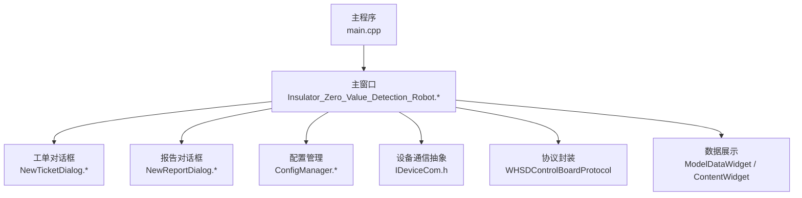
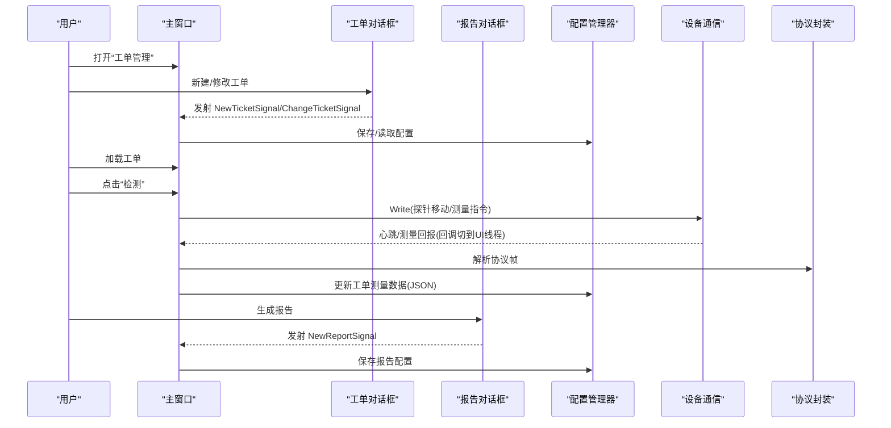
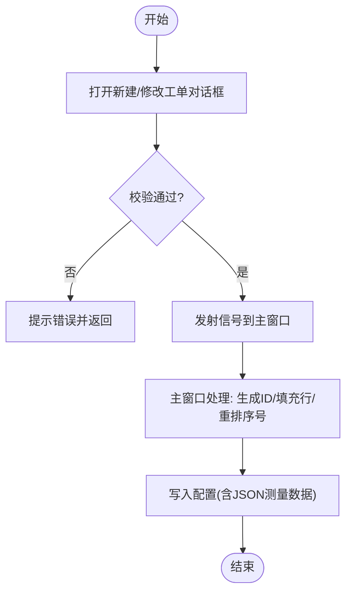
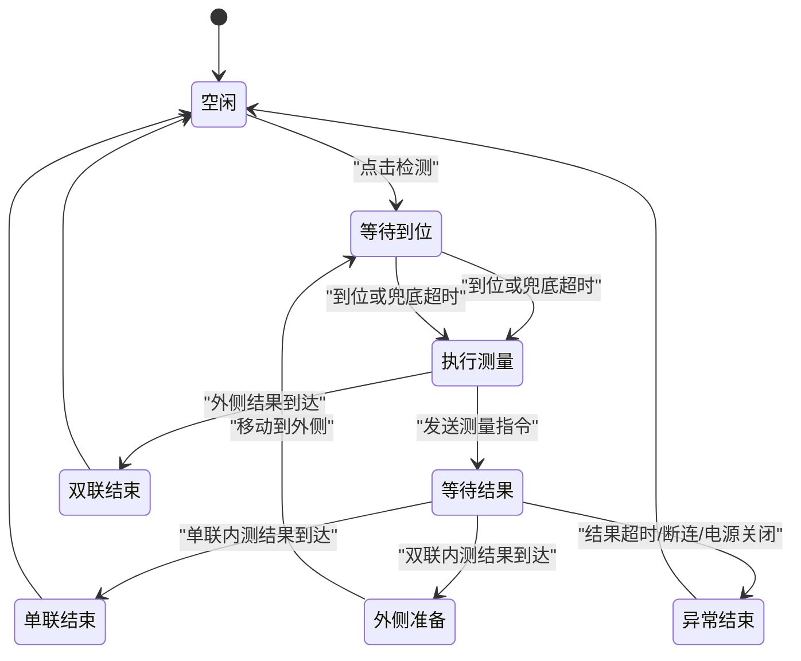
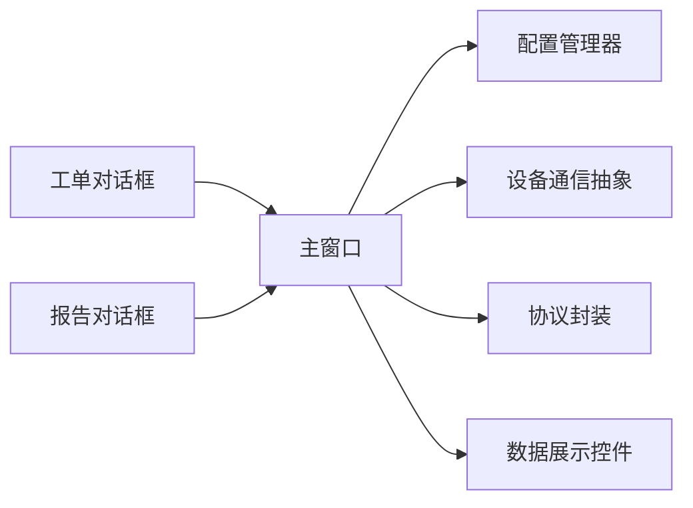

# 检测作业管理

<cite>
**本文引用的文件**
- [main.cpp](file://Insulator_Zero_Value_Detection_Robot/main.cpp)
- [Insulator_Zero_Value_Detection_Robot.h](file://Insulator_Zero_Value_Detection_Robot/UI/Insulator_Zero_Value_Detection_Robot.h)
- [Insulator_Zero_Value_Detection_Robot.cpp](file://Insulator_Zero_Value_Detection_Robot/UI/Insulator_Zero_Value_Detection_Robot.cpp)
- [NewTicketDialog.h](file://Insulator_Zero_Value_Detection_Robot/UI/NewTicketDialog.h)
- [NewTicketDialog.cpp](file://Insulator_Zero_Value_Detection_Robot/UI/NewTicketDialog.cpp)
- [NewReportDialog.h](file://Insulator_Zero_Value_Detection_Robot/UI/NewReportDialog.h)
- [NewReportDialog.cpp](file://Insulator_Zero_Value_Detection_Robot/UI/NewReportDialog.cpp)
- [ConfigManager.h](file://Insulator_Zero_Value_Detection_Robot/Config/ConfigManager.h)
- [ConfigManager.cpp](file://Insulator_Zero_Value_Detection_Robot/Config/ConfigManager.cpp)
- [IDeviceCom.h](file://Insulator_Zero_Value_Detection_Robot/DeviceCom/IDeviceCom.h)
- [contentwidget.h](file://Insulator_Zero_Value_Detection_Robot/UI/contentwidget.h)
- [modeldatawidget.h](file://Insulator_Zero_Value_Detection_Robot/UI/modeldatawidget.h)
- [操作说明书.md](file://操作说明书.md)
</cite>

## 目录
1. [简介](#简介)
2. [项目结构](#项目结构)
3. [核心组件](#核心组件)
4. [架构总览](#架构总览)
5. [详细组件分析](#详细组件分析)
6. [依赖关系分析](#依赖关系分析)
7. [性能考量](#性能考量)
8. [故障排除指南](#故障排除指南)
9. [结论](#结论)
10. [附录](#附录)

## 简介
本文件面向“绝缘子零值检测机器人”的检测作业管理功能，聚焦工单系统的全流程（创建、加载、编辑与管理）、检测流程的状态机控制机制（设备连接、检测执行、数据收集与结果处理）、用户界面操作流程与交互逻辑、检测参数配置与校验规则，并提供使用示例、最佳实践与常见问题解决方案。

## 项目结构
- 入口程序：主函数初始化Qt应用并显示主窗口。
- UI层：主窗口负责页面导航、事件绑定、测量流程状态机、告警与日志；对话框用于新建/修改工单与报告。
- 配置层：XML持久化设备控制板、相机、工单与报告配置，提供读写接口。
- 通信层：抽象设备通信接口，封装TCP等底层通信能力。
- 协议层：控制板协议封装，发送探针移动、传感器测量等指令。
- 数据展示：表格与曲线控件用于实时呈现阻值数据与趋势。

**图表来源**
- [main.cpp:11-23](file://Insulator_Zero_Value_Detection_Robot/main.cpp#L11-L23)
- [Insulator_Zero_Value_Detection_Robot.h:26-22](file://Insulator_Zero_Value_Detection_Robot/UI/Insulator_Zero_Value_Detection_Robot.h#L26-L22)
- [ConfigManager.h:185-194](file://Insulator_Zero_Value_Detection_Robot/Config/ConfigManager.h#L185-L194)
- [IDeviceCom.h:4-15](file://Insulator_Zero_Value_Detection_Robot/DeviceCom/IDeviceCom.h#L4-L15)

**章节来源**
- [main.cpp:11-23](file://Insulator_Zero_Value_Detection_Robot/main.cpp#L11-L23)
- [操作说明书.md:68-100](file://操作说明书.md#L68-L100)

## 核心组件
- 主窗口：承载UI、状态机、事件处理、与配置/通信/协议的集成。
- 工单对话框：新建/修改工单，字段校验，发射信号回主窗口。
- 报告对话框：新建报告信息，发射信号回主窗口。
- 配置管理器：读取/写入XML，维护设备、相机、工单、报告配置。
- 设备通信抽象：统一Write/回调注册/连接状态回调。
- 数据展示：表格+曲线动态更新，支持重测删除最近值。

**章节来源**
- [Insulator_Zero_Value_Detection_Robot.h:26-22](file://Insulator_Zero_Value_Detection_Robot/UI/Insulator_Zero_Value_Detection_Robot.h#L26-L22)
- [NewTicketDialog.h:10-35](file://Insulator_Zero_Value_Detection_Robot/UI/NewTicketDialog.h#L10-L35)
- [NewReportDialog.h:10-31](file://Insulator_Zero_Value_Detection_Robot/UI/NewReportDialog.h#L10-L31)
- [ConfigManager.h:10-194](file://Insulator_Zero_Value_Detection_Robot/Config/ConfigManager.h#L10-L194)
- [IDeviceCom.h:4-15](file://Insulator_Zero_Value_Detection_Robot/DeviceCom/IDeviceCom.h#L4-L15)
- [modeldatawidget.h:20-49](file://Insulator_Zero_Value_Detection_Robot/UI/modeldatawidget.h#L20-L49)

## 架构总览
检测作业管理采用“UI驱动 + 状态机 + 配置持久化 + 设备通信”的分层架构：
- UI层：用户通过导航切换页面，选择工单、发起检测、查看结果。
- 业务层：主窗口实现检测流程状态机，协调探针到位轮询、测量触发、结果超时处理。
- 数据层：配置管理器负责XML的读写，保证工单、报告、设备参数的持久化。
- 设备层：通过IDeviceCom抽象与协议封装下发控制指令，接收心跳与测量回报。

**图表来源**
- [Insulator_Zero_Value_Detection_Robot.cpp:2030-2250](file://Insulator_Zero_Value_Detection_Robot/UI/Insulator_Zero_Value_Detection_Robot.cpp#L2030-L2250)
- [NewTicketDialog.cpp:30-66](file://Insulator_Zero_Value_Detection_Robot/UI/NewTicketDialog.cpp#L30-L66)
- [NewReportDialog.cpp:19-34](file://Insulator_Zero_Value_Detection_Robot/UI/NewReportDialog.cpp#L19-L34)
- [ConfigManager.cpp:16-257](file://Insulator_Zero_Value_Detection_Robot/Config/ConfigManager.cpp#L16-L257)
- [IDeviceCom.h:4-15](file://Insulator_Zero_Value_Detection_Robot/DeviceCom/IDeviceCom.h#L4-L15)

## 详细组件分析

### 工单系统：创建、加载、编辑与管理
- 创建工单
  - 用户在“工单管理”页点击“新增”，弹出工单对话框。
  - 对话框对名称与片数进行校验（名称非空、片数1~60），确认后发射信号。
  - 主窗口生成唯一工单ID，清空历史测量数据与起止时间标记，插入列表最前并重排序号。
- 加载工单
  - 选中工单后点击“加载”，主窗口将当前工单设为活动工单，初始化相别下拉框、检测串状态与阻值曲线，回填历史测量数据。
  - 未加载工单时，“检测”按钮不可用或提示“请加载一个工单”。
- 编辑与删除
  - “修改”打开对话框预填当前工单数据，确认后覆盖对应配置项。
  - “删除”二次确认后移除行并从配置中删除，同步写回配置文件。
- 查询与过滤
  - 顶部输入框实时过滤工单表，支持重置。

**图表来源**
- [NewTicketDialog.cpp:30-66](file://Insulator_Zero_Value_Detection_Robot/UI/NewTicketDialog.cpp#L30-L66)
- [Insulator_Zero_Value_Detection_Robot.cpp:2847-2862](file://Insulator_Zero_Value_Detection_Robot/UI/Insulator_Zero_Value_Detection_Robot.cpp#L2847-L2862)
- [ConfigManager.cpp:349-414](file://Insulator_Zero_Value_Detection_Robot/Config/ConfigManager.cpp#L349-L414)

**章节来源**
- [操作说明书.md:228-281](file://操作说明书.md#L228-L281)
- [NewTicketDialog.cpp:30-110](file://Insulator_Zero_Value_Detection_Robot/UI/NewTicketDialog.cpp#L30-L110)
- [Insulator_Zero_Value_Detection_Robot.cpp:1829-1836](file://Insulator_Zero_Value_Detection_Robot/UI/Insulator_Zero_Value_Detection_Robot.cpp#L1829-L1836)
- [Insulator_Zero_Value_Detection_Robot.cpp:2847-2862](file://Insulator_Zero_Value_Detection_Robot/UI/Insulator_Zero_Value_Detection_Robot.cpp#L2847-L2862)

### 检测流程状态机：设备连接、检测执行、数据收集与结果处理
- 前置条件
  - 必须已加载工单；控制板需连接且总电源未确认关闭。
  - 若未满足，进入流程前会提示并记录告警。
- 探针到位轮询
  - 下发探针移动指令后启动轮询定时器（周期约100ms）。
  - 收到下位机到位信号或超过兜底等待（约4秒）即触发测量。
- 测量触发与超时保护
  - 触发测量：截图保存、发送测量指令、设置步骤、启动结果超时定时器（约8秒）。
  - 超时未收到回报：自动结束本次测量，探针复原，恢复按钮，记录告警。
- 结果处理
  - 单联：内测结果到达即探针复原，测量结束。
  - 双联：内测完成后切换到外侧，重复到位轮询与测量，外侧结果到达后复原结束。
- 异常处理
  - 轮询期间断连或电源关闭：立即中止流程并告警。
  - 结果超时：按现状自动结束并告警。

**图表来源**
- [Insulator_Zero_Value_Detection_Robot.cpp:2030-2250](file://Insulator_Zero_Value_Detection_Robot/UI/Insulator_Zero_Value_Detection_Robot.cpp#L2030-L2250)
- [Insulator_Zero_Value_Detection_Robot.h:188-197](file://Insulator_Zero_Value_Detection_Robot/UI/Insulator_Zero_Value_Detection_Robot.h#L188-L197)

**章节来源**
- [Insulator_Zero_Value_Detection_Robot.cpp:2030-2250](file://Insulator_Zero_Value_Detection_Robot/UI/Insulator_Zero_Value_Detection_Robot.cpp#L2030-L2250)
- [操作说明书.md:184-199](file://操作说明书.md#L184-L199)

### 用户界面操作流程与交互逻辑
- 导航与页面
  - 顶部导航切换“实时检测/工单管理/检测报告/系统设置”。
- 实时检测页
  - 左侧：工单详情面板（线路、杆塔、号侧、相别、检测/复检按钮）、机器人状态面板（连接、电机、舵机、心跳、电量、电源）。
  - 中央：视频区（截图/录像/刷新/全屏）、数据标签页（检测串状态、阻值曲线）。
- 交互要点
  - 检测前必须加载工单；检测过程中弹出不可关闭的等待窗，避免误操作。
  - 键盘与手柄可映射为探针位置/行走/停止/开始测量。
  - 数据标签页随测量实时更新，支持重测删除最近值。

**章节来源**
- [操作说明书.md:68-100](file://操作说明书.md#L68-L100)
- [操作说明书.md:104-200](file://操作说明书.md#L104-L200)
- [modeldatawidget.h:20-49](file://Insulator_Zero_Value_Detection_Robot/UI/modeldatawidget.h#L20-L49)

### 检测参数配置选项与验证规则
- 设备控制板参数
  - IP、端口、心跳间隔、工厂模式、探针角度（内测/复位/外侧）、行走电机速度、舵机速度、绝缘阈值。
- 相机参数
  - 左/中/右IP、新摄像头模式、主码流开关、主/子码流地址。
- 工单参数
  - 串数类型（单联/双联）、回路数（单回/双回/四回）、交直流类型、绝缘子片数（1~60）、线路名称、杆塔号、检测单位、检测人员、备注、起止时间（检测流程自动打点）。
- 报告参数
  - 报告编号、检测单位、检测人员、作业地点。
- 校验规则
  - 工单名称不能为空；片数范围1~60；IP格式校验（在设置页）。
  - 配置读写通过XML完成，测量数据以JSON文本存储于工单节点。

**章节来源**
- [ConfigManager.h:10-194](file://Insulator_Zero_Value_Detection_Robot/Config/ConfigManager.h#L10-L194)
- [ConfigManager.cpp:16-257](file://Insulator_Zero_Value_Detection_Robot/Config/ConfigManager.cpp#L16-L257)
- [ConfigManager.cpp:259-452](file://Insulator_Zero_Value_Detection_Robot/Config/ConfigManager.cpp#L259-L452)
- [NewTicketDialog.cpp:30-66](file://Insulator_Zero_Value_Detection_Robot/UI/NewTicketDialog.cpp#L30-L66)
- [操作说明书.md:320-340](file://操作说明书.md#L320-L340)

### 使用示例与最佳实践
- 标准作业流程
  1) 启动软件，确认控制板与摄像头网络连通。
  2) 进入“工单管理”，新建/修改工单，确保名称与片数合法。
  3) 加载工单，使“检测/复检”可用。
  4) 选择号侧与相别，点击“检测”，观察等待窗与状态面板。
  5) 测量完成后，查看检测串状态与阻值曲线，必要时进行复检。
  6) 进入“检测报告”，生成/下载报告。
- 最佳实践
  - 每次新建工单前确保对话框已重置，避免残留历史数据。
  - 检测过程中不要强行关闭等待窗；如遇异常，关注告警表与日志。
  - 定期校准测量模块，确保读数准确。
  - 保持控制板与摄像头在同一网段，检查IP与端口配置。

**章节来源**
- [操作说明书.md:184-199](file://操作说明书.md#L184-L199)
- [操作说明书.md:228-281](file://操作说明书.md#L228-L281)
- [操作说明书.md:284-317](file://操作说明书.md#L284-L317)
- [操作说明书.md:320-340](file://操作说明书.md#L320-L340)

## 依赖关系分析
- 主窗口依赖：
  - 配置管理器：读写XML配置，维护工单/报告/设备参数。
  - 设备通信抽象：统一Write与回调注册，解耦底层通信实现。
  - 协议封装：构造探针移动、传感器测量等命令帧。
  - 数据展示：表格与曲线控件动态更新测量结果。
- 对话框依赖：
  - 工单/报告对话框向主窗口发射信号，主窗口负责持久化与UI更新。
- 外部依赖：
  - Qt框架（QApplication、QTimer、QDialog等）。
  - tinyxml2用于XML解析与生成。
  - OpenCV用于截图与录像编码。

**图表来源**
- [Insulator_Zero_Value_Detection_Robot.h:26-22](file://Insulator_Zero_Value_Detection_Robot/UI/Insulator_Zero_Value_Detection_Robot.h#L26-L22)
- [ConfigManager.h:185-194](file://Insulator_Zero_Value_Detection_Robot/Config/ConfigManager.h#L185-L194)
- [IDeviceCom.h:4-15](file://Insulator_Zero_Value_Detection_Robot/DeviceCom/IDeviceCom.h#L4-L15)
- [modeldatawidget.h:20-49](file://Insulator_Zero_Value_Detection_Robot/UI/modeldatawidget.h#L20-L49)

**章节来源**
- [Insulator_Zero_Value_Detection_Robot.h:26-22](file://Insulator_Zero_Value_Detection_Robot/UI/Insulator_Zero_Value_Detection_Robot.h#L26-L22)
- [ConfigManager.cpp:16-257](file://Insulator_Zero_Value_Detection_Robot/Config/ConfigManager.cpp#L16-L257)
- [IDeviceCom.h:4-15](file://Insulator_Zero_Value_Detection_Robot/DeviceCom/IDeviceCom.h#L4-L15)

## 性能考量
- 轮询与超时
  - 探针到位轮询周期较短（约100ms），避免阻塞UI；兜底超时防止长时间等待。
  - 测量结果超时（约8秒）保障异常快速恢复，减少卡顿。
- 线程安全
  - 心跳数据快照加锁，避免跨线程读到半写数据。
  - 录像帧缓存使用互斥锁保护，避免并发写入冲突。
- I/O优化
  - 配置读写批量序列化/反序列化，减少频繁磁盘操作。
  - JSON测量数据紧凑存储，降低XML体积。

[本节为通用性能讨论，不直接分析具体文件]

## 故障排除指南
- 无法开始检测
  - 现象：提示“请加载一个工单”或“控制板未连接/总电源未开启”。
  - 排查：确认已加载工单；检查控制板TCP连接与总电源状态；查看告警表。
- 测量等待卡住
  - 现象：等待窗长时间不退出。
  - 排查：检查下位机是否响应；确认心跳计数是否递增；查看日志是否有“测量异常自动结束”。
- 无测量结果
  - 现象：结果超时，自动结束并告警。
  - 排查：检查测量模块供电与通信；确认绝缘阈值设置合理；重新校准测量模块。
- 数据不同步
  - 现象：表格/曲线未更新。
  - 排查：确认测量回调已切到UI线程；检查ModelDataWidget是否正确appendValue；重启软件刷新摄像头连接。

**章节来源**
- [Insulator_Zero_Value_Detection_Robot.cpp:2030-2250](file://Insulator_Zero_Value_Detection_Robot/UI/Insulator_Zero_Value_Detection_Robot.cpp#L2030-L2250)
- [操作说明书.md:184-199](file://操作说明书.md#L184-L199)

## 结论
检测作业管理以主窗口为核心，结合工单/报告对话框、配置管理与设备通信抽象，实现了从工单创建、加载到检测执行、结果处理的完整闭环。状态机设计保障了流程的可控性与鲁棒性，配合参数校验与告警机制，提升了现场作业的可靠性与效率。建议在实际使用中遵循标准作业流程与最佳实践，及时校准与维护设备，确保检测质量。

## 附录
- 关键常量参考
  - 探针到位轮询周期：约100ms
  - 探针到位兜底等待：约4秒
  - 测量结果超时：约8秒
- 相关入口
  - 主程序入口：main.cpp
  - 检测流程：Insulator_Zero_Value_Detection_Robot.cpp
  - 配置读写：ConfigManager.cpp
  - 设备通信：IDeviceCom.h

**章节来源**
- [Insulator_Zero_Value_Detection_Robot.cpp:67-73](file://Insulator_Zero_Value_Detection_Robot/UI/Insulator_Zero_Value_Detection_Robot.cpp#L67-L73)
- [main.cpp:11-23](file://Insulator_Zero_Value_Detection_Robot/main.cpp#L11-L23)
- [ConfigManager.cpp:16-257](file://Insulator_Zero_Value_Detection_Robot/Config/ConfigManager.cpp#L16-L257)
- [IDeviceCom.h:4-15](file://Insulator_Zero_Value_Detection_Robot/DeviceCom/IDeviceCom.h#L4-L15)