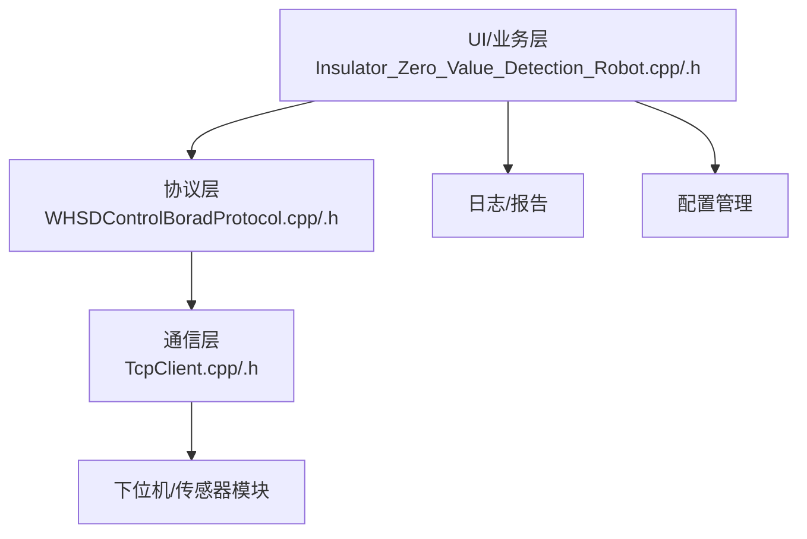
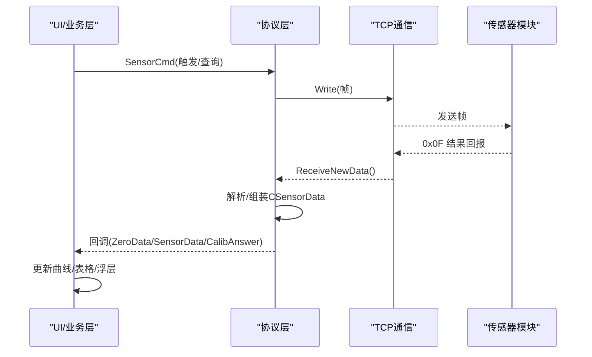
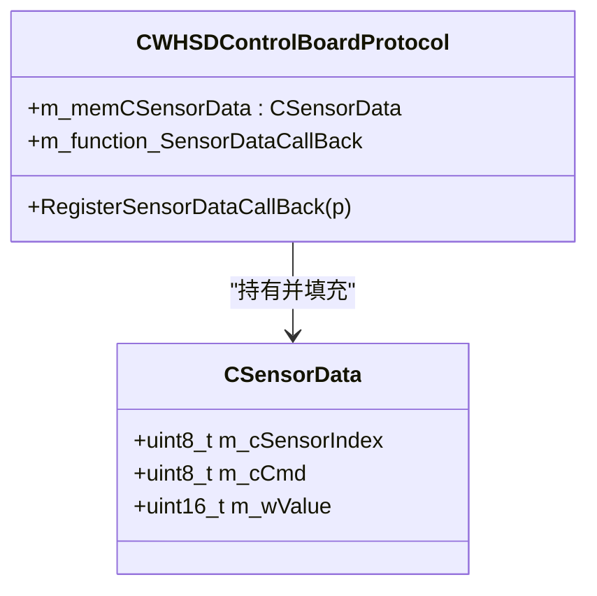
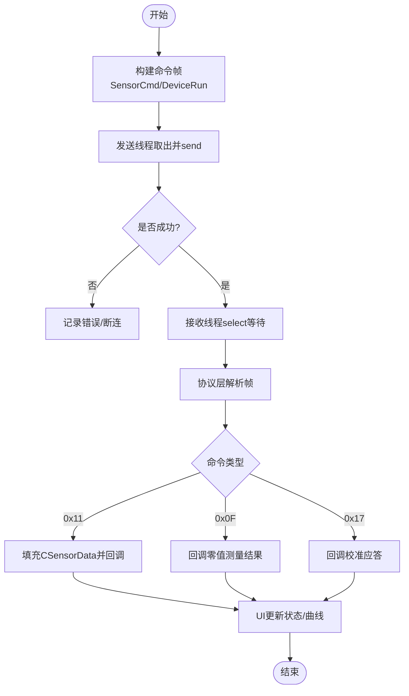
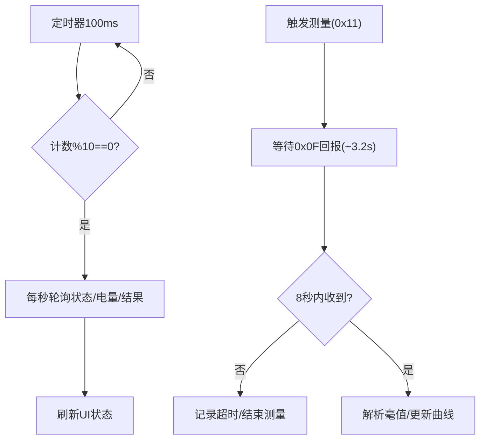
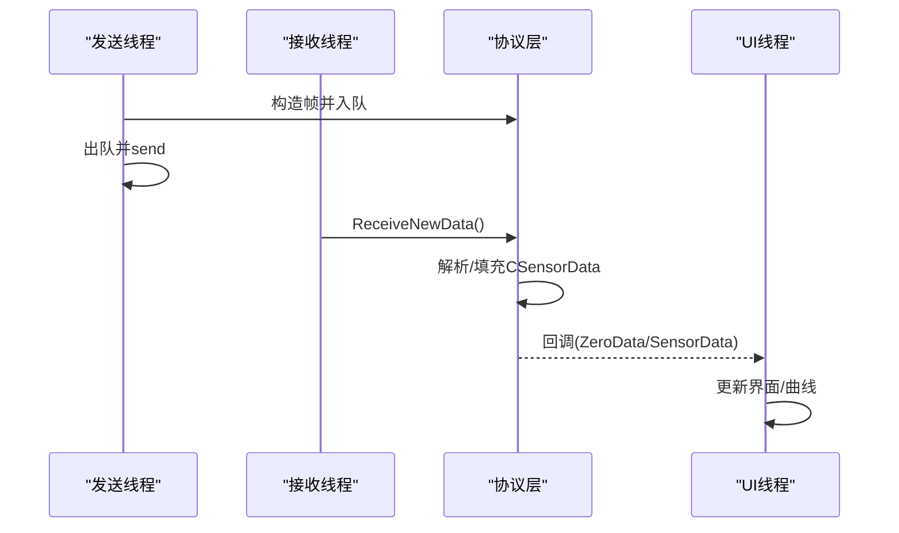
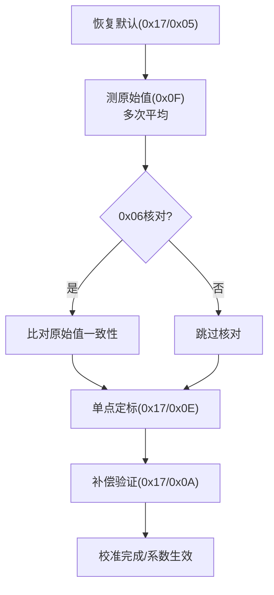
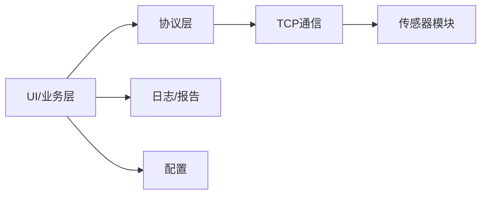

# 传感器数据采集

<cite>
**本文引用的文件**
- [WHSDControlBoradProtocol.h](file://Insulator_Zero_Value_Detection_Robot/Protocol/WHSDControlBoradProtocol.h)
- [WHSDControlBoradProtocol.cpp](file://Insulator_Zero_Value_Detection_Robot/Protocol/WHSDControlBoradProtocol.cpp)
- [TcpClient.h](file://Insulator_Zero_Value_Detection_Robot/DeviceCom/TcpClient.h)
- [TcpClient.cpp](file://Insulator_Zero_Value_Detection_Robot/DeviceCom/TcpClient.cpp)
- [Insulator_Zero_Value_Detection_Robot.cpp](file://Insulator_Zero_Value_Detection_Robot/UI/Insulator_Zero_Value_Detection_Robot.cpp)
- [Insulator_Zero_Value_Detection_Robot.h](file://Insulator_Zero_Value_Detection_Robot/UI/Insulator_Zero_Value_Detection_Robot.h)
- [单点定标协议与流程_V1.0.html](file://Insulator_Zero_Value_Detection_Robot/单点定标协议与流程_V1.0.html)
- [操作说明书.md](file://操作说明书.md)
</cite>

## 目录
1. [简介](#简介)
2. [项目结构](#项目结构)
3. [核心组件](#核心组件)
4. [架构总览](#架构总览)
5. [详细组件分析](#详细组件分析)
6. [依赖关系分析](#依赖关系分析)
7. [性能考虑](#性能考虑)
8. [故障诊断与排错](#故障诊断与排错)
9. [结论](#结论)
10. [附录](#附录)

## 简介
本文件面向绝缘子检测机器人的“传感器数据采集系统”，聚焦以下目标：
- CSensorData 数据结构设计与传感器索引管理机制
- 传感器命令发送与数据接收处理流程
- 零值检测数据的采集频率与精度控制
- 多传感器并发采集的数据同步机制
- 传感器校准流程与补偿算法实现
- 传感器数据质量验证与异常过滤方法
- 传感器设备管理与故障诊断功能
- 数据采集的实时处理与可视化显示

## 项目结构
本项目围绕“协议解析层 + 通信层 + UI/业务层”组织代码：
- 协议层：负责帧组装、解析、回调分发，包含传感器指令、心跳、校准等
- 通信层：基于 TCP 的收发线程与队列，提供可靠读写接口
- UI/业务层：测量流程编排、状态轮询、UI 展示、校准向导、日志与告警

图表来源
- [Insulator_Zero_Value_Detection_Robot.cpp:317-424](file://Insulator_Zero_Value_Detection_Robot/UI/Insulator_Zero_Value_Detection_Robot.cpp#L317-L424)
- [WHSDControlBoradProtocol.cpp:179-200](file://Insulator_Zero_Value_Detection_Robot/Protocol/WHSDControlBoradProtocol.cpp#L179-L200)
- [TcpClient.cpp:253-317](file://Insulator_Zero_Value_Detection_Robot/DeviceCom/TcpClient.cpp#L253-L317)

章节来源
- [操作说明书.md:43-198](file://操作说明书.md#L43-L198)

## 核心组件
- CSensorData：承载单次传感器命令应答或查询结果（传感器索引、命令类型、数值）
- CCalibAnswer：承载校准相关上行应答（子命令、结果、原因、参数1/2）
- CWHSDControlBoardProtocol：协议封装，负责命令构造、解析、回调派发、心跳、OTA
- CTcpClientCom：TCP 客户端，分离连接、发送、接收线程，提供异步写入与读回调
- UI 主窗口：测量流程编排、定时轮询、超时控制、UI 更新、校准向导

章节来源
- [WHSDControlBoradProtocol.h:7-52](file://Insulator_Zero_Value_Detection_Robot/Protocol/WHSDControlBoradProtocol.h#L7-L52)
- [WHSDControlBoradProtocol.h:189-355](file://Insulator_Zero_Value_Detection_Robot/Protocol/WHSDControlBoradProtocol.h#L189-L355)
- [TcpClient.h:8-46](file://Insulator_Zero_Value_Detection_Robot/DeviceCom/TcpClient.h#L8-L46)
- [Insulator_Zero_Value_Detection_Robot.h:246-293](file://Insulator_Zero_Value_Detection_Robot/UI/Insulator_Zero_Value_Detection_Robot.h#L246-L293)

## 架构总览
整体数据流从 UI 触发测量开始，经协议层打包为帧，通过 TCP 下发到传感器模块；模块处理后以 0x0F 上报结果，协议层解析并回调至 UI，完成数据入库与可视化。

图表来源
- [Insulator_Zero_Value_Detection_Robot.cpp:2121-2139](file://Insulator_Zero_Value_Detection_Robot/UI/Insulator_Zero_Value_Detection_Robot.cpp#L2121-L2139)
- [WHSDControlBoradProtocol.cpp:360-390](file://Insulator_Zero_Value_Detection_Robot/Protocol/WHSDControlBoradProtocol.cpp#L360-L390)
- [TcpClient.cpp:301-317](file://Insulator_Zero_Value_Detection_Robot/DeviceCom/TcpClient.cpp#L301-L317)

## 详细组件分析

### CSensorData 与传感器索引管理
- 字段职责
  - m_cSensorIndex：传感器索引，用于区分不同传感器通道
  - m_cCmd：命令类型，如状态查询、电量、结果等
  - m_wValue：对应命令的返回值
- 索引管理
  - 协议层在解析 0x11 传感器指令反馈时，将传感器索引与命令写入 m_memCSensorData，并通过回调函数指针传递给上层
  - UI 侧根据 m_cCmd 分支更新不同状态（状态/电量/结果）

图表来源
- [WHSDControlBoradProtocol.h:7-15](file://Insulator_Zero_Value_Detection_Robot/Protocol/WHSDControlBoradProtocol.h#L7-L15)
- [WHSDControlBoradProtocol.h:328-355](file://Insulator_Zero_Value_Detection_Robot/Protocol/WHSDControlBoradProtocol.h#L328-L355)
- [WHSDControlBoradProtocol.cpp:360-390](file://Insulator_Zero_Value_Detection_Robot/Protocol/WHSDControlBoradProtocol.cpp#L360-L390)

章节来源
- [WHSDControlBoradProtocol.h:7-15](file://Insulator_Zero_Value_Detection_Robot/Protocol/WHSDControlBoradProtocol.h#L7-L15)
- [WHSDControlBoradProtocol.cpp:360-390](file://Insulator_Zero_Value_Detection_Robot/Protocol/WHSDControlBoradProtocol.cpp#L360-L390)
- [Insulator_Zero_Value_Detection_Robot.cpp:649-673](file://Insulator_Zero_Value_Detection_Robot/UI/Insulator_Zero_Value_Detection_Robot.cpp#L649-L673)

### 传感器命令发送与数据接收流程
- 命令发送
  - UI 通过 CWHSDControlBoardProtocol::SensorCmd 构造帧，调用 m_pComDevice->Write 发送
  - 发送线程从队列取帧，使用 send 下发，错误时置断连标志
- 数据接收
  - 接收线程使用 select 等待可读，读取后交给协议层解析
  - 协议层识别 0x11/0x0F/0x17 等命令，填充 CSensorData 或 CCalibAnswer，并触发相应回调

图表来源
- [Insulator_Zero_Value_Detection_Robot.cpp:2121-2139](file://Insulator_Zero_Value_Detection_Robot/UI/Insulator_Zero_Value_Detection_Robot.cpp#L2121-L2139)
- [TcpClient.cpp:253-317](file://Insulator_Zero_Value_Detection_Robot/DeviceCom/TcpClient.cpp#L253-L317)
- [WHSDControlBoradProtocol.cpp:360-390](file://Insulator_Zero_Value_Detection_Robot/Protocol/WHSDControlBoradProtocol.cpp#L360-L390)

章节来源
- [TcpClient.cpp:253-317](file://Insulator_Zero_Value_Detection_Robot/DeviceCom/TcpClient.cpp#L253-L317)
- [WHSDControlBoradProtocol.cpp:360-390](file://Insulator_Zero_Value_Detection_Robot/Protocol/WHSDControlBoradProtocol.cpp#L360-L390)
- [Insulator_Zero_Value_Detection_Robot.cpp:2121-2139](file://Insulator_Zero_Value_Detection_Robot/UI/Insulator_Zero_Value_Detection_Robot.cpp#L2121-L2139)

### 零值检测数据采集频率与精度控制
- 采集频率
  - 状态轮询：每 1 秒轮询一次传感器状态/电量/结果（通过定时器周期与计数控制）
  - 测量结果回报：触发后约 3.2 秒由下位机主动上报 0x0F
  - 结果超时：设置 8 秒超时，未收到则判定失败并自动结束
- 精度控制
  - 数据单位：毫值（int32 大端），例如 533.711 MΩ 对应特定整型表示
  - 校准生效：执行单点定标后，0x0F 回报修正后的值；未校准时回报原始值
  - 校验手段：支持查询最近一次原始值（0x06）与补偿验证（0x0A）

图表来源
- [Insulator_Zero_Value_Detection_Robot.cpp:413-424](file://Insulator_Zero_Value_Detection_Robot/UI/Insulator_Zero_Value_Detection_Robot.cpp#L413-L424)
- [Insulator_Zero_Value_Detection_Robot.cpp:2121-2139](file://Insulator_Zero_Value_Detection_Robot/UI/Insulator_Zero_Value_Detection_Robot.cpp#L2121-L2139)
- [单点定标协议与流程_V1.0.html:63-79](file://Insulator_Zero_Value_Detection_Robot/单点定标协议与流程_V1.0.html#L63-L79)

章节来源
- [Insulator_Zero_Value_Detection_Robot.cpp:413-424](file://Insulator_Zero_Value_Detection_Robot/UI/Insulator_Zero_Value_Detection_Robot.cpp#L413-L424)
- [Insulator_Zero_Value_Detection_Robot.cpp:2121-2139](file://Insulator_Zero_Value_Detection_Robot/UI/Insulator_Zero_Value_Detection_Robot.cpp#L2121-L2139)
- [单点定标协议与流程_V1.0.html:63-79](file://Insulator_Zero_Value_Detection_Robot/单点定标协议与流程_V1.0.html#L63-L79)

### 多传感器并发采集的数据同步机制
- 并发模型
  - 发送线程与接收线程独立运行，通过队列与条件变量解耦
  - 协议层维护一个 CSensorData 实例作为临时缓冲，按命令类型分派回调
- 同步策略
  - 通过 m_cSensorIndex 与 m_cCmd 区分不同传感器与命令，避免混用
  - UI 侧对关键状态使用互斥锁保护（如手柄输入状态），确保跨线程安全
- 注意事项
  - 回调在协议线程中触发，UI 更新需切换到 UI 线程（Qt 信号槽/QueuedConnection）

图表来源
- [TcpClient.h:35-46](file://Insulator_Zero_Value_Detection_Robot/DeviceCom/TcpClient.h#L35-L46)
- [WHSDControlBoradProtocol.h:328-355](file://Insulator_Zero_Value_Detection_Robot/Protocol/WHSDControlBoradProtocol.h#L328-L355)
- [Insulator_Zero_Value_Detection_Robot.cpp:649-673](file://Insulator_Zero_Value_Detection_Robot/UI/Insulator_Zero_Value_Detection_Robot.cpp#L649-L673)

章节来源
- [TcpClient.h:35-46](file://Insulator_Zero_Value_Detection_Robot/DeviceCom/TcpClient.h#L35-L46)
- [WHSDControlBoradProtocol.h:328-355](file://Insulator_Zero_Value_Detection_Robot/Protocol/WHSDControlBoradProtocol.h#L328-L355)
- [Insulator_Zero_Value_Detection_Robot.cpp:649-673](file://Insulator_Zero_Value_Detection_Robot/UI/Insulator_Zero_Value_Detection_Robot.cpp#L649-L673)

### 传感器校准流程与补偿算法实现
- 校准步骤
  1) 恢复默认（0x17/0x05）：清空系数，通道直通
  2) 测量原始值（0x0F）：多次采样求平均，同时可查询原始值（0x06）核对
  3) 单点定标（0x17/0x0E）：下发标准值与实测原始值，固件计算系数并写Flash
  4) 补偿验证（0x17/0x0A）：不挂电阻，直接下发原始值，回显“原始值+校准后值”
- 补偿算法
  - 协议文档定义参数 a/b/c 等，固件内部计算并立即生效
  - UI 侧记录并展示系数，支持离线抽查验证
- 超时与健壮性
  - 0x0E 写 Flash 需 1~2 秒，应答超时建议 ≥ 3 秒
  - 0x06 仅认最近一次 0x0F 回报后 5 秒内的值，超时返回失败

图表来源
- [单点定标协议与流程_V1.0.html:63-79](file://Insulator_Zero_Value_Detection_Robot/单点定标协议与流程_V1.0.html#L63-L79)
- [单点定标协议与流程_V1.0.html:122-138](file://Insulator_Zero_Value_Detection_Robot/单点定标协议与流程_V1.0.html#L122-L138)
- [Insulator_Zero_Value_Detection_Robot.cpp:1002-1028](file://Insulator_Zero_Value_Detection_Robot/UI/Insulator_Zero_Value_Detection_Robot.cpp#L1002-L1028)
- [Insulator_Zero_Value_Detection_Robot.cpp:1116-1147](file://Insulator_Zero_Value_Detection_Robot/UI/Insulator_Zero_Value_Detection_Robot.cpp#L1116-L1147)
- [Insulator_Zero_Value_Detection_Robot.cpp:1149-1265](file://Insulator_Zero_Value_Detection_Robot/UI/Insulator_Zero_Value_Detection_Robot.cpp#L1149-L1265)

章节来源
- [单点定标协议与流程_V1.0.html:63-79](file://Insulator_Zero_Value_Detection_Robot/单点定标协议与流程_V1.0.html#L63-L79)
- [单点定标协议与流程_V1.0.html:122-138](file://Insulator_Zero_Value_Detection_Robot/单点定标协议与流程_V1.0.html#L122-L138)
- [Insulator_Zero_Value_Detection_Robot.cpp:1002-1028](file://Insulator_Zero_Value_Detection_Robot/UI/Insulator_Zero_Value_Detection_Robot.cpp#L1002-L1028)
- [Insulator_Zero_Value_Detection_Robot.cpp:1116-1147](file://Insulator_Zero_Value_Detection_Robot/UI/Insulator_Zero_Value_Detection_Robot.cpp#L1116-L1147)
- [Insulator_Zero_Value_Detection_Robot.cpp:1149-1265](file://Insulator_Zero_Value_Detection_Robot/UI/Insulator_Zero_Value_Detection_Robot.cpp#L1149-L1265)

### 传感器数据质量验证与异常过滤方法
- 质量验证
  - 通过 0x06 查询最近一次原始值，与 0x0F 回报对比，确认一致性
  - 通过 0x0A 补偿验证，检查“原始值→校准后值”是否符合预期
- 异常过滤
  - 超时未收到 0x0F：判定无返回值，自动结束测量并记录告警
  - 电源未知或断开：进入等待期间若检测到断连/已关电源，提前中止并复位探针
  - 状态/电量异常：轮询获取的状态/电量不在合理范围时提示未知或异常

章节来源
- [Insulator_Zero_Value_Detection_Robot.cpp:2141-2178](file://Insulator_Zero_Value_Detection_Robot/UI/Insulator_Zero_Value_Detection_Robot.cpp#L2141-L2178)
- [Insulator_Zero_Value_Detection_Robot.cpp:1002-1028](file://Insulator_Zero_Value_Detection_Robot/UI/Insulator_Zero_Value_Detection_Robot.cpp#L1002-L1028)
- [Insulator_Zero_Value_Detection_Robot.cpp:1116-1147](file://Insulator_Zero_Value_Detection_Robot/UI/Insulator_Zero_Value_Detection_Robot.cpp#L1116-L1147)

### 传感器设备管理与故障诊断功能
- 设备管理
  - 心跳包持续递增，用于判断链路健康
  - 电机状态、电池电量、总电源开关状态均通过心跳解析展示
- 故障诊断
  - 连接状态变化回调，记录断连/重连
  - 测量流程中的探针到位等待与结果超时兜底，防止卡死
  - 校准流程各阶段超时提示与失败原因说明

章节来源
- [Insulator_Zero_Value_Detection_Robot.cpp:413-559](file://Insulator_Zero_Value_Detection_Robot/UI/Insulator_Zero_Value_Detection_Robot.cpp#L413-L559)
- [Insulator_Zero_Value_Detection_Robot.cpp:635-640](file://Insulator_Zero_Value_Detection_Robot/UI/Insulator_Zero_Value_Detection_Robot.cpp#L635-L640)
- [Insulator_Zero_Value_Detection_Robot.cpp:2141-2178](file://Insulator_Zero_Value_Detection_Robot/UI/Insulator_Zero_Value_Detection_Robot.cpp#L2141-L2178)

### 数据采集的实时处理与可视化显示
- 实时处理
  - 定时器驱动状态轮询与测量流程推进
  - 回调在协议线程触发，UI 更新通过 Qt 信号槽切换线程
- 可视化显示
  - 视频区右下角浮层显示当前检测结果
  - 检测串状态以方块图展示合格/异常
  - 阻值曲线随测量值实时更新

章节来源
- [Insulator_Zero_Value_Detection_Robot.cpp:675-703](file://Insulator_Zero_Value_Detection_Robot/UI/Insulator_Zero_Value_Detection_Robot.cpp#L675-L703)
- [操作说明书.md:163-198](file://操作说明书.md#L163-L198)

## 依赖关系分析
- UI 依赖协议层进行命令构造与解析
- 协议层依赖通信层进行网络收发
- 通信层依赖操作系统 socket API
- 校准流程依赖协议文档定义的帧格式与时序

图表来源
- [Insulator_Zero_Value_Detection_Robot.cpp:317-424](file://Insulator_Zero_Value_Detection_Robot/UI/Insulator_Zero_Value_Detection_Robot.cpp#L317-L424)
- [WHSDControlBoradProtocol.cpp:179-200](file://Insulator_Zero_Value_Detection_Robot/Protocol/WHSDControlBoradProtocol.cpp#L179-L200)
- [TcpClient.cpp:253-317](file://Insulator_Zero_Value_Detection_Robot/DeviceCom/TcpClient.cpp#L253-L317)

章节来源
- [操作说明书.md:43-198](file://操作说明书.md#L43-L198)

## 性能考虑
- 网络 I/O
  - 发送/接收线程分离，使用队列与条件变量降低阻塞
  - 使用 select 非阻塞等待，避免忙等
- 数据处理
  - 协议层集中解析，减少 UI 负担
  - 回调仅在必要时触发，避免频繁 UI 更新
- 超时与重试
  - 合理的超时时间（测量结果 8 秒、校准命令 3 秒以上）提升鲁棒性
- 资源释放
  - 停止测量时及时停止相关定时器，避免资源泄漏

[本节为通用性能指导，不直接分析具体文件]

## 故障诊断与排错
- 常见问题
  - 测量超时：检查链路心跳、设备电源、探针到位信号
  - 校准失败：确认恢复默认成功、原始值稳定、参数格式正确
  - 状态/电量未知：检查轮询是否执行、设备是否在线
- 定位方法
  - 查看设备日志（下行/上行帧 HEX）
  - 观察心跳计数与连接状态
  - 使用 0x06/0x0A 辅助验证

章节来源
- [Insulator_Zero_Value_Detection_Robot.cpp:2141-2178](file://Insulator_Zero_Value_Detection_Robot/UI/Insulator_Zero_Value_Detection_Robot.cpp#L2141-L2178)
- [Insulator_Zero_Value_Detection_Robot.cpp:1267-1292](file://Insulator_Zero_Value_Detection_Robot/UI/Insulator_Zero_Value_Detection_Robot.cpp#L1267-L1292)
- [操作说明书.md:43-198](file://操作说明书.md#L43-L198)

## 结论
本系统通过清晰的协议层、稳定的通信层与健壮的 UI 流程，实现了绝缘子零值检测的可靠数据采集。CSensorData 与传感器索引管理确保了多传感器数据的准确分派；校准流程与补偿算法保障了测量精度；超时与异常处理提升了系统鲁棒性；实时可视化便于现场快速研判。

[本节为总结性内容，不直接分析具体文件]

## 附录
- 协议参考：单点定标协议与流程 V1.0
- 操作指南：实时检测页面与数据标签页使用说明

章节来源
- [单点定标协议与流程_V1.0.html:63-79](file://Insulator_Zero_Value_Detection_Robot/单点定标协议与流程_V1.0.html#L63-L79)
- [操作说明书.md:163-198](file://操作说明书.md#L163-L198)