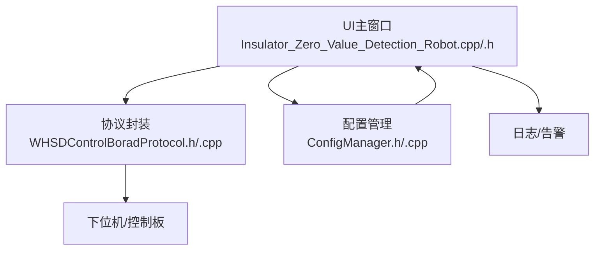
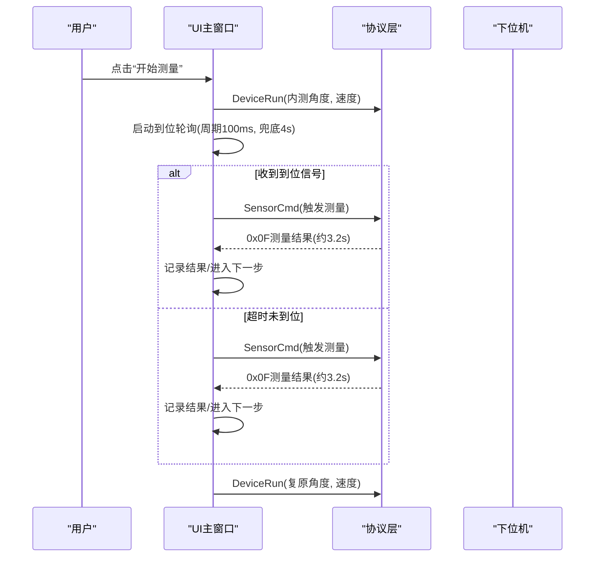
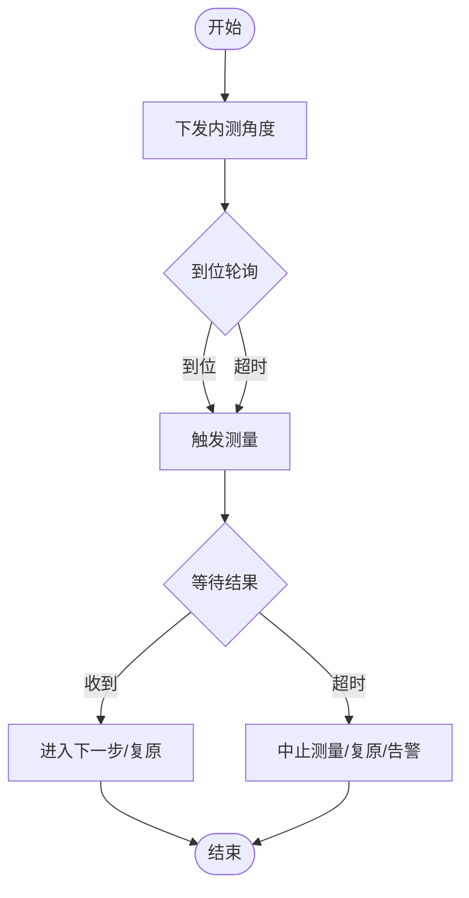
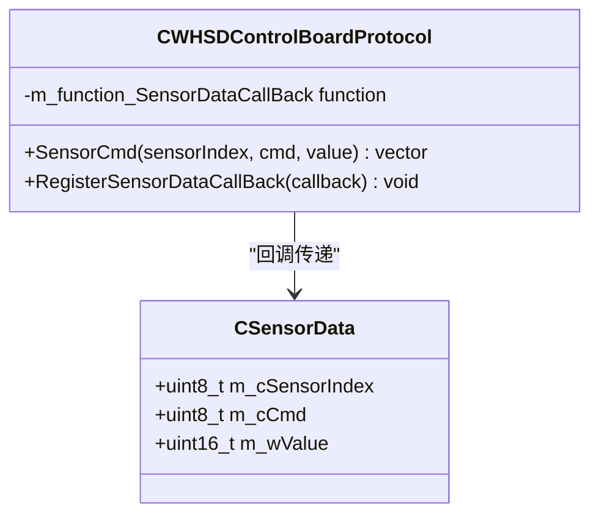
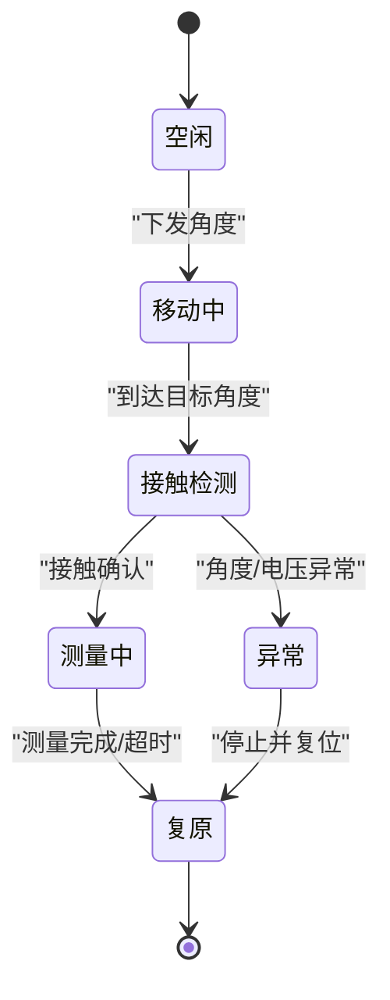
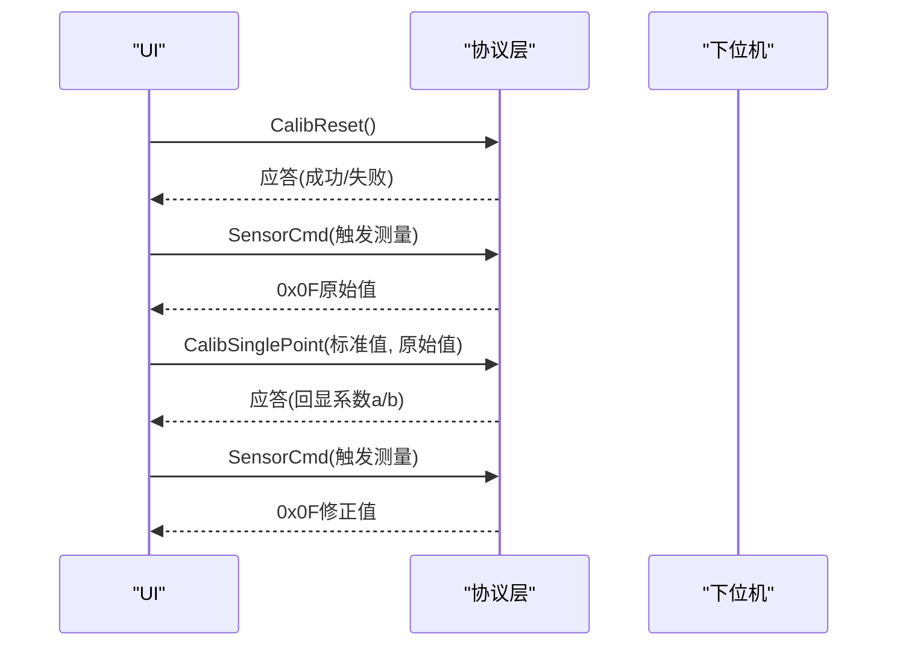
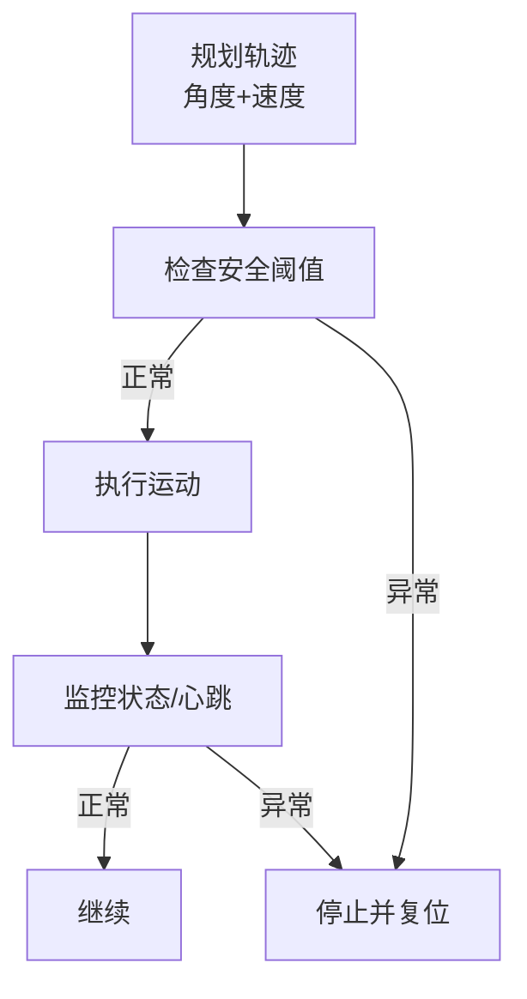
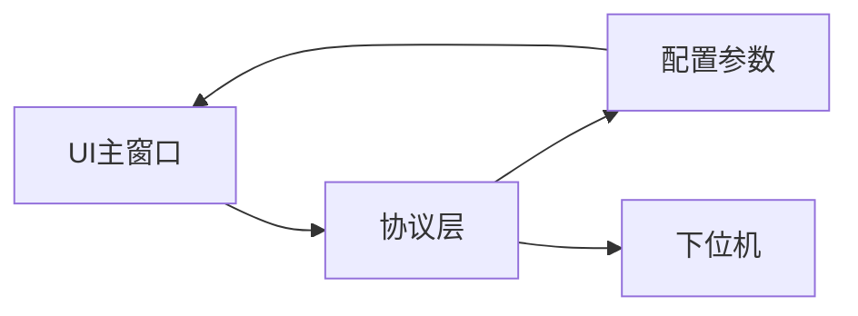

# 探针定位

<cite>
**本文引用的文件**
- [Insulator_Zero_Value_Detection_Robot.cpp](file://Insulator_Zero_Value_Detection_Robot/Insulator_Zero_Value_Detection_Robot.cpp)
- [Insulator_Zero_Value_Detection_Robot.h](file://Insulator_Zero_Value_Detection_Robot/Insulator_Zero_Value_Detection_Robot.h)
- [WHSDControlBoradProtocol.h](file://Insulator_Zero_Value_Detection_Robot/Protocol/WHSDControlBoradProtocol.h)
- [WHSDControlBoradProtocol.cpp](file://Insulator_Zero_Value_Detection_Robot/Protocol/WHSDControlBoradProtocol.cpp)
- [ConfigManager.h](file://Insulator_Zero_Value_Detection_Robot/Config/ConfigManager.h)
- [ConfigManager.cpp](file://Insulator_Zero_Value_Detection_Robot/Config/ConfigManager.cpp)
- [单点定标协议与流程_V1.0.html](file://Insulator_Zero_Value_Detection_Robot/单点定标协议与流程_V1.0.html)
- [操作说明书.md](file://操作说明书.md)
</cite>

## 目录
1. [简介](#简介)
2. [项目结构](#项目结构)
3. [核心组件](#核心组件)
4. [架构总览](#架构总览)
5. [详细组件分析](#详细组件分析)
6. [依赖关系分析](#依赖关系分析)
7. [性能考虑](#性能考虑)
8. [故障排查指南](#故障排查指南)
9. [结论](#结论)
10. [附录](#附录)

## 简介
本文件面向绝缘子检测机器人的“探针定位系统”，围绕以下目标展开：
- 说明探针精确定位算法与控制流程（含到位轮询、超时兜底、测量触发）。
- 解释激光测距传感器的数据读取与距离计算逻辑。
- 描述探针与绝缘子的接触检测与压力控制机制（基于设备状态与阈值配置）。
- 说明定位精度校准与误差补偿方法（单点定标流程与系数生效机制）。
- 给出探针运动轨迹规划与避障策略（角度位置、速度、安全阈值）。
- 包含定位过程中的安全保护与异常处理机制（电源、心跳、超时、告警）。
- 展示完整工作流程与调试方法（日志、HEX帧比对、参数保存与校验）。

## 项目结构
本项目采用分层组织：UI层负责交互与流程编排；协议层封装与下位机通信；配置层管理运行参数；工具与日志提供辅助能力。探针定位相关的关键路径集中在 UI 主窗口、协议解析与配置参数三类文件中。

图表来源
- [Insulator_Zero_Value_Detection_Robot.cpp:2062-2233](file://Insulator_Zero_Value_Detection_Robot/Insulator_Zero_Value_Detection_Robot.cpp#L2062-L2233)
- [WHSDControlBoradProtocol.cpp:213-444](file://Insulator_Zero_Value_Detection_Robot/Protocol/WHSDControlBoradProtocol.cpp#L213-L444)
- [ConfigManager.cpp:16-83](file://Insulator_Zero_Value_Detection_Robot/Config/ConfigManager.cpp#L16-L83)

章节来源
- [Insulator_Zero_Value_Detection_Robot.cpp:67-73](file://Insulator_Zero_Value_Detection_Robot/Insulator_Zero_Value_Detection_Robot.cpp#L67-L73)
- [WHSDControlBoradProtocol.h:54-111](file://Insulator_Zero_Value_Detection_Robot/Protocol/WHSDControlBoradProtocol.h#L54-L111)
- [ConfigManager.h:10-24](file://Insulator_Zero_Value_Detection_Robot/Config/ConfigManager.h#L10-L24)

## 核心组件
- 探针定位控制流：由UI主窗口驱动，完成“下发探针角度→等待到位→触发测量→结果超时处理→复原”的闭环。
- 协议通信层：统一封装设备控制命令、传感器指令、心跳与结果解析，提供回调接口。
- 配置参数：探针角度（向内/向外/复原）、舵机速度、行走电机速度、绝缘阈值等，持久化到XML。
- 校准模块：单点定标流程（恢复默认→测原始值→下发定标→验证），固件自动计算并写入Flash。

章节来源
- [Insulator_Zero_Value_Detection_Robot.h:188-197](file://Insulator_Zero_Value_Detection_Robot/Insulator_Zero_Value_Detection_Robot.h#L188-L197)
- [WHSDControlBoradProtocol.h:189-356](file://Insulator_Zero_Value_Detection_Robot/Protocol/WHSDControlBoradProtocol.h#L189-L356)
- [ConfigManager.h:10-24](file://Insulator_Zero_Value_Detection_Robot/Config/ConfigManager.h#L10-L24)

## 架构总览
探针定位系统的工作流如下：
- 用户触发测量后，UI将探针移动到“内测角度”，启动到位轮询定时器。
- 收到到位信号或超过兜底等待时间，触发一次测量（发送传感器指令）。
- 约3.2秒后，下位机主动上报测量结果（0x0F），UI接收并记录。
- 双联场景：内测完成后切换到“外侧角度”，重复上述流程。
- 测量结束或异常时，探针复原，关闭等待窗，恢复按钮，并记录告警。

图表来源
- [Insulator_Zero_Value_Detection_Robot.cpp:2062-2233](file://Insulator_Zero_Value_Detection_Robot/Insulator_Zero_Value_Detection_Robot.cpp#L2062-L2233)
- [WHSDControlBoradProtocol.cpp:321-362](file://Insulator_Zero_Value_Detection_Robot/Protocol/WHSDControlBoradProtocol.cpp#L321-L362)

## 详细组件分析

### 探针定位算法与控制流程
- 到位轮询：以固定周期查询设备状态，若收到到位信号则提前触发测量；否则在兜底时间内继续等待。
- 超时兜底：若协议未提供到位信号，则在最大等待时间后仍触发测量，避免流程卡死。
- 测量触发：通过传感器指令触发一次测量，结果由下位机主动上报。
- 双联流程：内测完成后切换至外侧角度，再次执行相同流程。
- 异常处理：任何阶段超时或未收到结果，均会中止当前测量、探针复原、关闭等待窗、恢复按钮并记录告警。

图表来源
- [Insulator_Zero_Value_Detection_Robot.cpp:67-73](file://Insulator_Zero_Value_Detection_Robot/Insulator_Zero_Value_Detection_Robot.cpp#L67-L73)
- [Insulator_Zero_Value_Detection_Robot.cpp:2062-2233](file://Insulator_Zero_Value_Detection_Robot/Insulator_Zero_Value_Detection_Robot.cpp#L2062-L2233)

章节来源
- [Insulator_Zero_Value_Detection_Robot.cpp:2062-2233](file://Insulator_Zero_Value_Detection_Robot/Insulator_Zero_Value_Detection_Robot.cpp#L2062-L2233)
- [Insulator_Zero_Value_Detection_Robot.h:188-197](file://Insulator_Zero_Value_Detection_Robot/Insulator_Zero_Value_Detection_Robot.h#L188-L197)

### 激光测距传感器数据读取与距离计算
- 传感器指令：通过传感器命令接口向指定传感器索引下发命令，获取对应数据。
- 数据解析：协议层解析传感器应答，提取数值字段并通过回调通知上层。
- 距离计算：具体物理换算由下位机完成，上位机仅接收已转换后的数值；如需自定义计算，可在回调中扩展。
- 阈值配置：激光测距最近/最远距离阈值作为安全判断依据，可通过配置下发至下位机。

图表来源
- [WHSDControlBoradProtocol.h:214-254](file://Insulator_Zero_Value_Detection_Robot/Protocol/WHSDControlBoradProtocol.h#L214-L254)
- [WHSDControlBoradProtocol.cpp:363-391](file://Insulator_Zero_Value_Detection_Robot/Protocol/WHSDControlBoradProtocol.cpp#L363-L391)

章节来源
- [WHSDControlBoradProtocol.h:54-111](file://Insulator_Zero_Value_Detection_Robot/Protocol/WHSDControlBoradProtocol.h#L54-L111)
- [WHSDControlBoradProtocol.cpp:363-391](file://Insulator_Zero_Value_Detection_Robot/Protocol/WHSDControlBoradProtocol.cpp#L363-L391)

### 探针与绝缘子的接触检测与压力控制
- 接触检测：通过设备状态位与传感器数据综合判断是否接触；当传感器数值变化或状态位指示到位时视为接触。
- 压力控制：通过舵机速度与角度限制实现软接触；结合安全阈值（如角度偏差、电压异常）防止过压。
- 安全保护：若检测到异常电压或角度越界，立即停止动作并复位，记录告警。

图表来源
- [WHSDControlBoradProtocol.h:54-111](file://Insulator_Zero_Value_Detection_Robot/Protocol/WHSDControlBoradProtocol.h#L54-L111)
- [Insulator_Zero_Value_Detection_Robot.cpp:2151-2176](file://Insulator_Zero_Value_Detection_Robot/Insulator_Zero_Value_Detection_Robot.cpp#L2151-L2176)

章节来源
- [WHSDControlBoradProtocol.h:54-111](file://Insulator_Zero_Value_Detection_Robot/Protocol/WHSDControlBoradProtocol.h#L54-L111)
- [Insulator_Zero_Value_Detection_Robot.cpp:2151-2176](file://Insulator_Zero_Value_Detection_Robot/Insulator_Zero_Value_Detection_Robot.cpp#L2151-L2176)

### 定位精度校准与误差补偿
- 单点定标流程：
  - 恢复默认：清空旧校准，测量通道直通。
  - 测原始值：触发测量，获取原始值（建议多次取平均）。
  - 下发定标：将标准值与实测原始值下发，固件计算补偿系数并写入Flash。
  - 验证：换档电阻实测或不挂电阻进行补偿验证。
- 误差补偿：固件根据公式模型计算补偿率，输出修正值；系数掉电保存，上电自动加载。

图表来源
- [单点定标协议与流程_V1.0.html:107-125](file://Insulator_Zero_Value_Detection_Robot/单点定标协议与流程_V1.0.html#L107-L125)
- [WHSDControlBoradProtocol.cpp:582-616](file://Insulator_Zero_Value_Detection_Robot/Protocol/WHSDControlBoradProtocol.cpp#L582-L616)

章节来源
- [单点定标协议与流程_V1.0.html:31-125](file://Insulator_Zero_Value_Detection_Robot/单点定标协议与流程_V1.0.html#L31-L125)
- [Insulator_Zero_Value_Detection_Robot.cpp:974-1033](file://Insulator_Zero_Value_Detection_Robot/Insulator_Zero_Value_Detection_Robot.cpp#L974-L1033)

### 探针运动的轨迹规划与避障策略
- 轨迹规划：通过配置中的探针角度（向内/向外/复原）与舵机速度控制运动路径；步进式调整确保稳定接触。
- 避障策略：结合安全轮角度阈值、成像板角度阈值及异常电压阈值，实时监测设备状态，发现异常立即停止并复位。
- 安全保护：心跳机制保证通信连续性；断链或超时触发归零保护。

图表来源
- [WHSDControlBoradProtocol.h:54-111](file://Insulator_Zero_Value_Detection_Robot/Protocol/WHSDControlBoradProtocol.h#L54-L111)
- [Insulator_Zero_Value_Detection_Robot.cpp:2151-2176](file://Insulator_Zero_Value_Detection_Robot/Insulator_Zero_Value_Detection_Robot.cpp#L2151-L2176)

章节来源
- [WHSDControlBoradProtocol.h:54-111](file://Insulator_Zero_Value_Detection_Robot/Protocol/WHSDControlBoradProtocol.h#L54-L111)
- [Insulator_Zero_Value_Detection_Robot.cpp:2151-2176](file://Insulator_Zero_Value_Detection_Robot/Insulator_Zero_Value_Detection_Robot.cpp#L2151-L2176)

### 安全保护与异常处理机制
- 电源保护：首次心跳前默认总电源为关，避免误动作；测量前置校验连接状态与电源状态。
- 心跳机制：定时发送心跳包，断链或超时触发归零保护。
- 超时处理：探针到位等待与测量结果均有超时兜底，避免流程卡死。
- 告警记录：异常发生时记录告警信息，便于追溯与分析。

章节来源
- [WHSDControlBoradProtocol.cpp:106-120](file://Insulator_Zero_Value_Detection_Robot/Protocol/WHSDControlBoradProtocol.cpp#L106-L120)
- [Insulator_Zero_Value_Detection_Robot.cpp:2052-2060](file://Insulator_Zero_Value_Detection_Robot/Insulator_Zero_Value_Detection_Robot.cpp#L2052-L2060)
- [Insulator_Zero_Value_Detection_Robot.cpp:2141-2176](file://Insulator_Zero_Value_Detection_Robot/Insulator_Zero_Value_Detection_Robot.cpp#L2141-L2176)

### 完整工作流程与调试方法
- 工作流程：
  - 用户触发测量 → 探针移动到内测角度 → 等待到位或超时 → 触发测量 → 接收结果 → 切换到外侧角度（双联）→ 重复测量 → 复原。
- 调试方法：
  - 使用HEX帧比对功能，逐字节核对下行/上行帧格式。
  - 查看设备日志与告警面板，定位异常环节。
  - 通过参数设置区调整探针角度、舵机速度、绝缘阈值等，并保存验证。

章节来源
- [Insulator_Zero_Value_Detection_Robot.cpp:2062-2233](file://Insulator_Zero_Value_Detection_Robot/Insulator_Zero_Value_Detection_Robot.cpp#L2062-L2233)
- [操作说明书.md:342-374](file://操作说明书.md#L342-L374)

## 依赖关系分析
- UI主窗口依赖协议层进行设备控制与数据接收。
- 协议层依赖配置参数进行阈值与行为控制。
- 配置层提供探针角度、速度、阈值等关键参数，影响定位精度与安全。

图表来源
- [Insulator_Zero_Value_Detection_Robot.cpp:2062-2233](file://Insulator_Zero_Value_Detection_Robot/Insulator_Zero_Value_Detection_Robot.cpp#L2062-L2233)
- [WHSDControlBoradProtocol.cpp:213-444](file://Insulator_Zero_Value_Detection_Robot/Protocol/WHSDControlBoradProtocol.cpp#L213-L444)
- [ConfigManager.cpp:16-83](file://Insulator_Zero_Value_Detection_Robot/Config/ConfigManager.cpp#L16-L83)

章节来源
- [Insulator_Zero_Value_Detection_Robot.cpp:2062-2233](file://Insulator_Zero_Value_Detection_Robot/Insulator_Zero_Value_Detection_Robot.cpp#L2062-L2233)
- [WHSDControlBoradProtocol.cpp:213-444](file://Insulator_Zero_Value_Detection_Robot/Protocol/WHSDControlBoradProtocol.cpp#L213-L444)
- [ConfigManager.cpp:16-83](file://Insulator_Zero_Value_Detection_Robot/Config/ConfigManager.cpp#L16-L83)

## 性能考虑
- 轮询周期与超时：合理设置到位轮询周期与超时时间，平衡响应速度与资源占用。
- 数据传输效率：批量处理传感器数据，减少频繁通信开销。
- 内存与线程：避免阻塞UI线程，使用异步回调处理数据解析。
- 校准频率：根据环境漂移情况定期校准，保证测量精度。

## 故障排查指南
- 常见问题：
  - 探针未到位：检查角度配置与舵机速度，确认设备状态位。
  - 测量无结果：确认心跳连接与电源状态，检查超时设置。
  - 校准失败：核对标准值与原始值范围，重试或检查硬件接线。
- 调试步骤：
  - 查看日志与告警面板，定位异常环节。
  - 使用HEX帧比对功能，核对通信帧格式。
  - 调整参数并保存，验证效果。

章节来源
- [Insulator_Zero_Value_Detection_Robot.cpp:2141-2176](file://Insulator_Zero_Value_Detection_Robot/Insulator_Zero_Value_Detection_Robot.cpp#L2141-L2176)
- [操作说明书.md:342-374](file://操作说明书.md#L342-L374)

## 结论
本探针定位系统通过精确的角度控制、到位轮询与超时兜底机制，实现了稳定可靠的探针定位与测量流程。结合单点定标校准与误差补偿，确保了测量精度。安全保护与异常处理机制保障了系统运行的安全性与鲁棒性。通过详细的调试方法与参数配置，用户可快速定位问题并优化系统性能。

## 附录
- 参数配置示例：探针角度、舵机速度、绝缘阈值等。
- 校准流程参考：单点定标协议与流程文档。
- 调试工具：HEX帧比对、日志分析、告警面板。