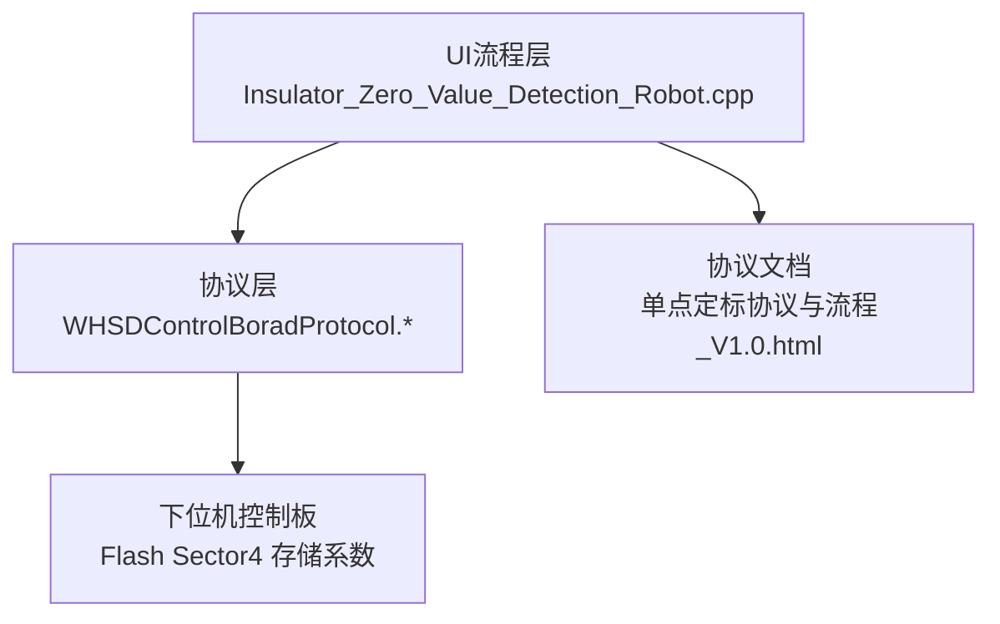
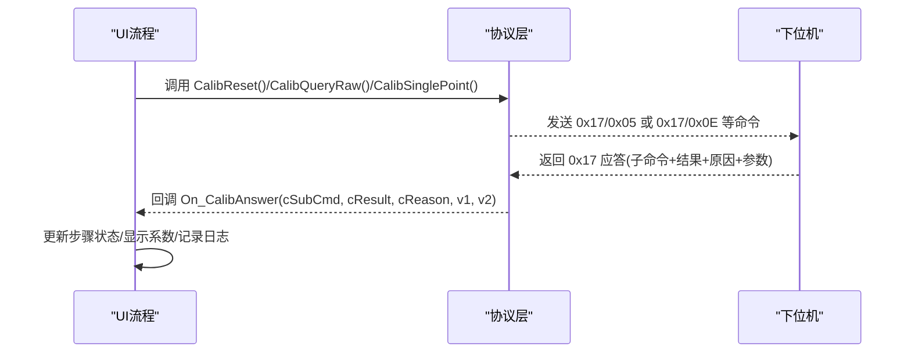
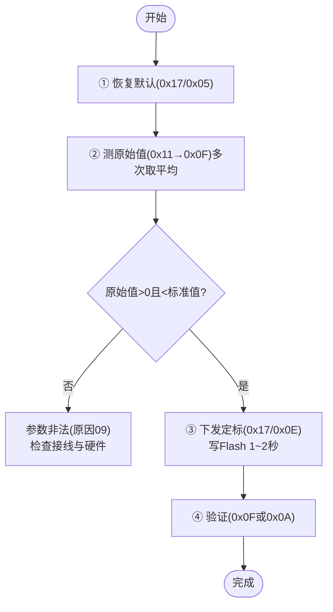
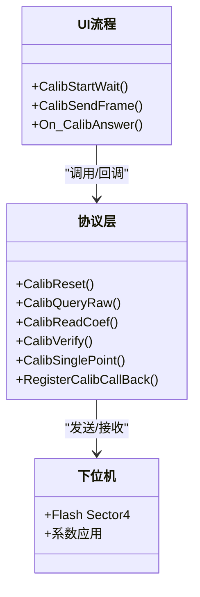

# 校准系统

<cite>
**本文引用的文件**
- [WHSDControlBoradProtocol.h](file://Insulator_Zero_Value_Detection_Robot/Protocol/WHSDControlBoradProtocol.h)
- [WHSDControlBoradProtocol.cpp](file://Insulator_Zero_Value_Detection_Robot/Protocol/WHSDControlBoradProtocol.cpp)
- [Insulator_Zero_Value_Detection_Robot.cpp](file://Insulator_Zero_Value_Detection_Robot/UI/Insulator_Zero_Value_Detection_Robot.cpp)
- [单点定标协议与流程_V1.0.html](file://Insulator_Zero_Value_Detection_Robot/单点定标协议与流程_V1.0.html)
</cite>

## 目录
1. [简介](#简介)
2. [项目结构](#项目结构)
3. [核心组件](#核心组件)
4. [架构总览](#架构总览)
5. [详细组件分析](#详细组件分析)
6. [依赖关系分析](#依赖关系分析)
7. [性能考虑](#性能考虑)
8. [故障排查指南](#故障排查指南)
9. [结论](#结论)
10. [附录](#附录)

## 简介
本文件为绝缘子检测机器人“校准系统”的技术文档，聚焦于单点定标、两点定标与多点校准的完整流程说明；解析 CCalibAnswer 数据结构中的应答信息；阐述校准系数 a、b 的计算方法与存储机制；说明 Flash 写入与备份恢复能力；提供精度验证与补偿测试方法；包含安全检查和异常处理；并给出参数导入导出与版本管理建议，以及设备标定与自检能力的实现思路。

## 项目结构
校准系统由三层组成：
- 协议层：负责与下位机（控制板）通信，封装命令帧、解析应答，暴露统一的校准接口。
- UI 流程层：编排校准步骤、状态机、超时与日志，驱动协议层执行。
- 协议文档：定义帧格式、命令语义、错误码与示例帧，作为双方契约。

图表来源
- [Insulator_Zero_Value_Detection_Robot.cpp:820-1265](file://Insulator_Zero_Value_Detection_Robot/UI/Insulator_Zero_Value_Detection_Robot.cpp#L820-L1265)
- [WHSDControlBoradProtocol.cpp:392-418](file://Insulator_Zero_Value_Detection_Robot/Protocol/WHSDControlBoradProtocol.cpp#L392-L418)
- [单点定标协议与流程_V1.0.html:45-125](file://Insulator_Zero_Value_Detection_Robot/单点定标协议与流程_V1.0.html#L45-L125)

章节来源
- [Insulator_Zero_Value_Detection_Robot.cpp:820-1265](file://Insulator_Zero_Value_Detection_Robot/UI/Insulator_Zero_Value_Detection_Robot.cpp#L820-L1265)
- [WHSDControlBoradProtocol.cpp:392-418](file://Insulator_Zero_Value_Detection_Robot/Protocol/WHSDControlBoradProtocol.cpp#L392-L418)
- [单点定标协议与流程_V1.0.html:45-125](file://Insulator_Zero_Value_Detection_Robot/单点定标协议与流程_V1.0.html#L45-L125)

## 核心组件
- CCalibAnswer：统一承载 0x17 校准命令应答的子命令、结果、原因与两个参数（毫值）。
- CWHSDControlBoardProtocol：协议封装类，提供恢复默认、查询原始值、读回系数、补偿验证、单点定标等静态接口，并在收到 0x17 时回调上层。
- UI 校准流程：以状态机推进“恢复默认 → 测原始值 → 下发定标 → 验证”，并提供超时、日志、按钮联动与界面状态更新。

章节来源
- [WHSDControlBoradProtocol.h:21-52](file://Insulator_Zero_Value_Detection_Robot/Protocol/WHSDControlBoradProtocol.h#L21-L52)
- [WHSDControlBoradProtocol.h:257-287](file://Insulator_Zero_Value_Detection_Robot/Protocol/WHSDControlBoradProtocol.h#L257-L287)
- [Insulator_Zero_Value_Detection_Robot.cpp:820-1265](file://Insulator_Zero_Value_Detection_Robot/UI/Insulator_Zero_Value_Detection_Robot.cpp#L820-L1265)

## 架构总览
校准数据流从 UI 触发开始，经协议层打包发送，下位机处理后通过 0x17 应答返回，协议层解析为 CCalibAnswer 并通过回调通知 UI，UI 根据子命令推进流程。

图表来源
- [WHSDControlBoradProtocol.cpp:392-418](file://Insulator_Zero_Value_Detection_Robot/Protocol/WHSDControlBoradProtocol.cpp#L392-L418)
- [Insulator_Zero_Value_Detection_Robot.cpp:1160-1265](file://Insulator_Zero_Value_Detection_Robot/UI/Insulator_Zero_Value_Detection_Robot.cpp#L1160-L1265)

## 详细组件分析

### CCalibAnswer 数据结构与应答解析
- 字段含义
  - m_cSubCmd：子命令，如 0x05 恢复默认、0x06 查询原始值、0x0C 读回系数、0x0A 补偿验证、0x0E 单点定标。
  - m_cResult：结果，0x01 成功，0x00 失败。
  - m_cReason：失败原因，如 0x01 原始值已超时、0x04 Flash 写失败、0x05 参数长度/格式错误、0x09 参数非法。
  - m_nValue1/m_nValue2：参数1/2，单位均为毫值（int32），不同子命令含义不同：
    - 0x05：k/b（直通状态 k=1, b=0）
    - 0x06：原始X
    - 0x0C：a/b
    - 0x0A：原始值/校准后值
    - 0x0E：a/b（b固定为0）
- 解析位置
  - 协议层在收到 0x17 时按字节偏移填充 CCalibAnswer，并调用注册回调。
- UI 处理
  - UI 侧根据子命令分支处理，设置步骤状态、显示系数、输出日志，必要时结束等待态。

章节来源
- [WHSDControlBoradProtocol.h:21-52](file://Insulator_Zero_Value_Detection_Robot/Protocol/WHSDControlBoradProtocol.h#L21-L52)
- [WHSDControlBoradProtocol.cpp:392-418](file://Insulator_Zero_Value_Detection_Robot/Protocol/WHSDControlBoradProtocol.cpp#L392-L418)
- [Insulator_Zero_Value_Detection_Robot.cpp:1160-1265](file://Insulator_Zero_Value_Detection_Robot/UI/Insulator_Zero_Value_Detection_Robot.cpp#L1160-L1265)

### 单点定标流程（标准流程）
- 步骤
  1) 恢复默认：发送 0x17/0x05，清空全部校准，测量通道直通。
  2) 测原始值：触发检测（0x11），等待 0x0F 回报原始值，连测多次取平均。
  3) 下发定标：发送 0x17/0x0E，携带“标准值 + 实测原始值”（毫值大端），固件计算系数并写入 Flash。
  4) 验证：再次触发检测读取修正值，或不挂电阻用 0x0A 抽查。
- 关键约束
  - 0x0E 参数必须正好 8 字节（标准值 4B + 原始值 4B）。
  - 写 Flash 需 1~2 秒，应答超时建议 ≥ 3 秒。
  - 若原始值≥标准值，属负补偿需求，模块会返回原因 0x09。

图表来源
- [Insulator_Zero_Value_Detection_Robot.cpp:941-1114](file://Insulator_Zero_Value_Detection_Robot/UI/Insulator_Zero_Value_Detection_Robot.cpp#L941-L1114)
- [单点定标协议与流程_V1.0.html:107-125](file://Insulator_Zero_Value_Detection_Robot/单点定标协议与流程_V1.0.html#L107-L125)

章节来源
- [Insulator_Zero_Value_Detection_Robot.cpp:941-1114](file://Insulator_Zero_Value_Detection_Robot/UI/Insulator_Zero_Value_Detection_Robot.cpp#L941-L1114)
- [单点定标协议与流程_V1.0.html:107-125](file://Insulator_Zero_Value_Detection_Robot/单点定标协议与流程_V1.0.html#L107-L125)

### 两点定标与多点校准（扩展方案）
- 现状
  - 当前代码仅实现了单点定标（0x0E）。
  - 协议注释提及“两点系数、折点表、公式系数”可被清空，表明下位机具备两点或多点能力。
- 建议实现路径
  - 在上位机增加“多点采集”流程：选择多个标准电阻（覆盖低、中、高量程），分别测得原始值序列。
  - 上位机拟合两点或多点模型，生成 a、b 或其他系数，构造 0x17/0x0E 或新增的多点命令（若下位机支持）。
  - 若下位机仅支持单点，则采用分段策略：在不同量程段分别执行单点定标，结合量程切换逻辑实现近似多点效果。
- 注意事项
  - 多点拟合需保证各点稳定与环境一致，避免漂移污染。
  - 对非线性明显的传感器，优先使用多点折点表或更高阶模型。

[本节为概念性扩展说明，不直接分析具体代码]

### 校准系数 a、b 的计算与存储
- 计算方法
  - 固件内部计算：p% = (1 − 原始值/标准值) × 100；c = p ÷ √原始值；b 固定为 0。
  - 上位机零计算，仅做合法性校验与理论值比对。
- 存储机制
  - 系数写入下位机 Flash Sector4，掉电保存，上电自动加载。
  - 读回系数（0x0C）可核对 Flash 中已存 a/b。
- 生效时机
  - 单点定标成功后立即生效，后续 0x0F 回报修正值。

章节来源
- [单点定标协议与流程_V1.0.html:57-61](file://Insulator_Zero_Value_Detection_Robot/单点定标协议与流程_V1.0.html#L57-L61)
- [单点定标协议与流程_V1.0.html:41](file://Insulator_Zero_Value_Detection_Robot/单点定标协议与流程_V1.0.html#L41)
- [Insulator_Zero_Value_Detection_Robot.cpp:1236-1249](file://Insulator_Zero_Value_Detection_Robot/UI/Insulator_Zero_Value_Detection_Robot.cpp#L1236-L1249)

### Flash 写入与备份恢复
- 写入
  - 0x0E 成功后固件擦写 Flash Sector4，耗时 1~2 秒。
- 恢复默认
  - 0x05 清空全部校准（两点系数、折点表、公式系数），恢复直通。
- 备份与恢复
  - 上位机可通过 0x0C 读回系数并持久化到本地配置/数据库，用于跨设备迁移或版本回滚。
  - 恢复时先 0x05 清空，再下发新的 0x0E 或批量多点命令（若支持）。

章节来源
- [Insulator_Zero_Value_Detection_Robot.cpp:1149-1158](file://Insulator_Zero_Value_Detection_Robot/UI/Insulator_Zero_Value_Detection_Robot.cpp#L1149-L1158)
- [Insulator_Zero_Value_Detection_Robot.cpp:941-977](file://Insulator_Zero_Value_Detection_Robot/UI/Insulator_Zero_Value_Detection_Robot.cpp#L941-L977)
- [单点定标协议与流程_V1.0.html:71-74](file://Insulator_Zero_Value_Detection_Robot/单点定标协议与流程_V1.0.html#L71-L74)

### 校准精度验证与补偿测试
- 在线验证
  - 定标后再次触发检测（0x11），读取 0x0F 修正值，与标准值对比误差。
- 离线抽查
  - 不挂电阻，直接下发任意原始值（0x0A），下位机回显“原始值 + 校准后值”，用于快速核验系数是否生效。
- 复核原始值
  - 0x0F 回报后 5 秒内可用 0x06 查询最近一次原始值，辅助判断链路与时序。

章节来源
- [Insulator_Zero_Value_Detection_Robot.cpp:1116-1147](file://Insulator_Zero_Value_Detection_Robot/UI/Insulator_Zero_Value_Detection_Robot.cpp#L1116-L1147)
- [单点定标协议与流程_V1.0.html:75-78](file://Insulator_Zero_Value_Detection_Robot/单点定标协议与流程_V1.0.html#L75-L78)
- [单点定标协议与流程_V1.0.html:100-105](file://Insulator_Zero_Value_Detection_Robot/单点定标协议与流程_V1.0.html#L100-L105)

### 安全检查与异常处理
- 前置检查
  - 工单测量进行中禁止启动定标，避免抢占 0x0F 数据。
  - 标准值必须 > 0；原始值必须 > 0 且 < 标准值，否则判定参数非法。
- 超时保护
  - 每步操作均设超时定时器，未在规定时间收到应答则标记失败并提示重试。
- 错误码处理
  - 0x01 原始值已超时：重新触发检测后立即查询。
  - 0x04 Flash 写失败：重发；反复失败检查 Flash。
  - 0x05 参数长度/格式错误：确保 0x0E 参数正好 8 字节。
  - 0x09 参数非法：检查接线与模块读数，勿强行定标。

章节来源
- [Insulator_Zero_Value_Detection_Robot.cpp:865-883](file://Insulator_Zero_Value_Detection_Robot/UI/Insulator_Zero_Value_Detection_Robot.cpp#L865-L883)
- [Insulator_Zero_Value_Detection_Robot.cpp:1267-1300](file://Insulator_Zero_Value_Detection_Robot/UI/Insulator_Zero_Value_Detection_Robot.cpp#L1267-L1300)
- [Insulator_Zero_Value_Detection_Robot.cpp:924-939](file://Insulator_Zero_Value_Detection_Robot/UI/Insulator_Zero_Value_Detection_Robot.cpp#L924-L939)

### 校准参数的导入导出与版本管理
- 导出
  - 通过 0x0C 读回 a/b，连同设备编号、日期、环境条件、标准电阻批次等信息导出至本地文件或云端。
- 导入
  - 导入前执行 0x05 恢复默认，再下发新系数（单点或多点命令）。
- 版本管理
  - 建议在导出文件中包含固件版本、协议版本、校准人、校准时间戳，便于追溯与回滚。
  - 可在 UI 中增加“版本对比”功能，当导入参数与当前设备参数不一致时提示差异。

[本节为通用实践建议，不直接分析具体代码]

### 校准设备的标定与自检
- 设备自检
  - 心跳包可获取设备状态、电池电量、工厂模式标志等，用于确认链路健康。
  - 传感器指令反馈（0x11）可用于自检传感器是否响应。
- 标定建议
  - 使用高精度标准电阻（推荐 500~1000 MΩ 档），预热稳定后再测量。
  - 同一环境同批次完成采集，减少日间漂移影响。

章节来源
- [WHSDControlBoradProtocol.cpp:784-800](file://Insulator_Zero_Value_Detection_Robot/Protocol/WHSDControlBoradProtocol.cpp#L784-L800)
- [单点定标协议与流程_V1.0.html:107-116](file://Insulator_Zero_Value_Detection_Robot/单点定标协议与流程_V1.0.html#L107-L116)

## 依赖关系分析
- UI 依赖协议层提供的校准接口与回调。
- 协议层依赖底层串口/TCP 发送与接收，解析 0x17 后统一封装为 CCalibAnswer。
- 下位机负责 Flash 存储与系数应用，UI 无需关心具体存储细节。

图表来源
- [Insulator_Zero_Value_Detection_Robot.cpp:865-911](file://Insulator_Zero_Value_Detection_Robot/UI/Insulator_Zero_Value_Detection_Robot.cpp#L865-L911)
- [WHSDControlBoradProtocol.h:257-287](file://Insulator_Zero_Value_Detection_Robot/Protocol/WHSDControlBoradProtocol.h#L257-L287)

章节来源
- [Insulator_Zero_Value_Detection_Robot.cpp:865-911](file://Insulator_Zero_Value_Detection_Robot/UI/Insulator_Zero_Value_Detection_Robot.cpp#L865-L911)
- [WHSDControlBoradProtocol.h:257-287](file://Insulator_Zero_Value_Detection_Robot/Protocol/WHSDControlBoradProtocol.h#L257-L287)

## 性能考虑
- Flash 写入延迟：0x0E 成功后需 1~2 秒，超时阈值应 ≥ 3 秒。
- 数据采集稳定性：建议多次测量取平均，减少随机噪声。
- 网络/串口链路：保持心跳，断链可能导致误判或丢失应答。
- 并发冲突：定标期间禁止工单测量流程抢占 0x0F 数据。

[本节提供通用优化建议，不直接分析具体代码]

## 故障排查指南
- 现象：0x06 返回原因 0x01
  - 处理：距上次 0x0F 超 5 秒，重新触发检测后立即查询。
- 现象：0x0E 返回原因 0x09
  - 处理：标准值/原始值 ≤ 0 或原始值 ≥ 标准值，检查接线与模块读数，勿强行定标。
- 现象：0x0E 返回原因 0x05
  - 处理：参数不是 8 字节，检查组帧（标准值 4B + 原始值 4B，毫值大端）。
- 现象：定标后整体偏移
  - 处理：模块日间漂移，同环境重测基准档，再发一次 0x0E。
- 现象：0x0E 应答慢
  - 处理：正常现象（需擦写 Flash），超时设 ≥ 3 秒。

章节来源
- [单点定标协议与流程_V1.0.html:140-148](file://Insulator_Zero_Value_Detection_Robot/单点定标协议与流程_V1.0.html#L140-L148)
- [Insulator_Zero_Value_Detection_Robot.cpp:1267-1300](file://Insulator_Zero_Value_Detection_Robot/UI/Insulator_Zero_Value_Detection_Robot.cpp#L1267-L1300)

## 结论
本校准系统以单点定标为核心，通过清晰的协议与 UI 流程实现“恢复默认 → 测原始值 → 下发定标 → 验证”的闭环。CCalibAnswer 统一承载应答信息，便于上层灵活处理。系数 a、b 由固件计算并写入 Flash，掉电保存。系统内置超时、错误码与安全检查，保障鲁棒性。对于两点/多点校准，可在现有单点基础上扩展采集与拟合逻辑，或结合量程切换实现近似多点效果。建议完善参数导入导出与版本管理，提升可维护性与可追溯性。

## 附录
- 常用命令速查
  - 触发检测：0x11
  - 恢复默认：0x17/0x05
  - 查询原始值：0x17/0x06
  - 读回系数：0x17/0x0C
  - 补偿验证：0x17/0x0A
  - 单点定标：0x17/0x0E

章节来源
- [单点定标协议与流程_V1.0.html:127-138](file://Insulator_Zero_Value_Detection_Robot/单点定标协议与流程_V1.0.html#L127-L138)