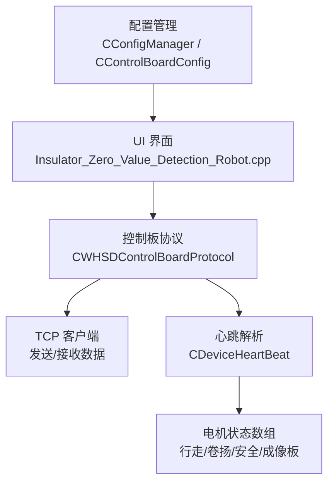
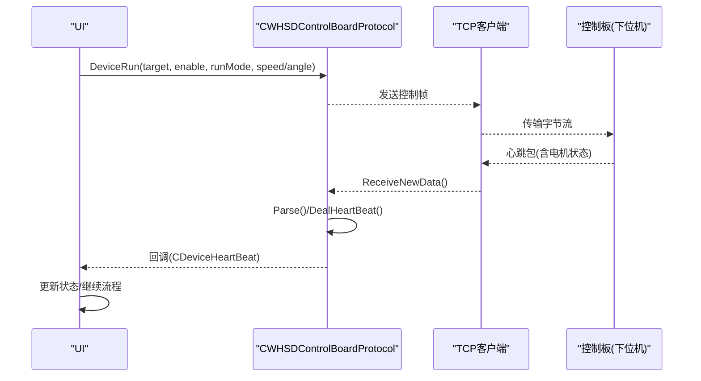
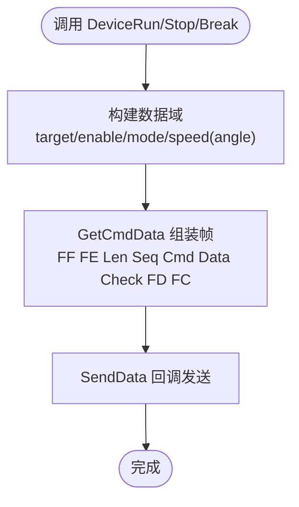
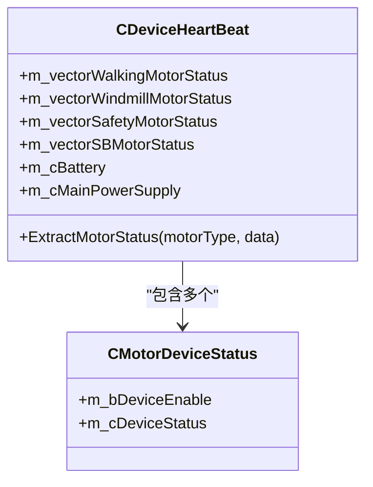
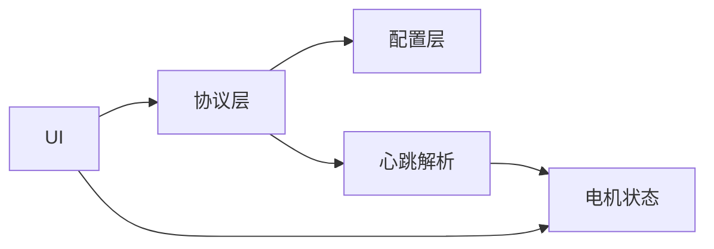

# 电机控制

<cite>
**本文引用的文件**
- [WHSDControlBoradProtocol.h](file://Insulator_Zero_Value_Detection_Robot/Protocol/WHSDControlBoradProtocol.h)
- [WHSDControlBoradProtocol.cpp](file://Insulator_Zero_Value_Detection_Robot/Protocol/WHSDControlBoradProtocol.cpp)
- [ConfigManager.h](file://Insulator_Zero_Value_Detection_Robot/Config/ConfigManager.h)
- [ConfigManager.cpp](file://Insulator_Zero_Value_Detection_Robot/Config/ConfigManager.cpp)
- [Insulator_Zero_Value_Detection_Robot.cpp](file://Insulator_Zero_Value_Detection_Robot/UI/Insulator_Zero_Value_Detection_Robot.cpp)
</cite>

## 目录
1. [简介](#简介)
2. [项目结构](#项目结构)
3. [核心组件](#核心组件)
4. [架构总览](#架构总览)
5. [详细组件分析](#详细组件分析)
6. [依赖关系分析](#依赖关系分析)
7. [性能与安全特性](#性能与安全特性)
8. [故障排查指南](#故障排查指南)
9. [结论](#结论)
10. [附录：API与使用示例](#附录api与使用示例)

## 简介
本文件面向绝缘子检测机器人的电机控制系统，聚焦以下目标：
- 说明行走电机、卷扬电机、安全轮电机和成像板电机的控制逻辑。
- 解释 DeviceRun、DeviceStop、DeviceBreak 等核心控制命令的实现机制。
- 描述速度模式与角度模式的配置和使用方法。
- 说明电机状态监控与故障检测机制（含电压异常阈值与运行超时保护）。
- 提供电机控制的 API 接口说明与实际使用示例。
- 给出电机参数配置与安全阈值设置指南。

## 项目结构
电机控制相关代码主要位于协议层与配置层：
- 协议层：负责将上层意图封装为控制板通信帧，并解析心跳包中的电机状态。
- 配置层：持久化设备连接、心跳周期、角度与速度等参数。
- UI层：在测量流程中调用协议层接口完成电机动作，并展示状态。

图表来源
- [WHSDControlBoradProtocol.cpp:179-226](file://Insulator_Zero_Value_Detection_Robot/Protocol/WHSDControlBoradProtocol.cpp#L179-L226)
- [WHSDControlBoradProtocol.cpp:784-800](file://Insulator_Zero_Value_Detection_Robot/Protocol/WHSDControlBoradProtocol.cpp#L784-L800)
- [ConfigManager.cpp:16-83](file://Insulator_Zero_Value_Detection_Robot/Config/ConfigManager.cpp#L16-L83)
- [Insulator_Zero_Value_Detection_Robot.cpp:2173-2205](file://Insulator_Zero_Value_Detection_Robot/UI/Insulator_Zero_Value_Detection_Robot.cpp#L2173-L2205)

章节来源
- [WHSDControlBoradProtocol.h:121-187](file://Insulator_Zero_Value_Detection_Robot/Protocol/WHSDControlBoradProtocol.h#L121-L187)
- [WHSDControlBoradProtocol.cpp:100-177](file://Insulator_Zero_Value_Detection_Robot/Protocol/WHSDControlBoradProtocol.cpp#L100-L177)
- [ConfigManager.h:10-24](file://Insulator_Zero_Value_Detection_Robot/Config/ConfigManager.h#L10-L24)
- [ConfigManager.cpp:16-83](file://Insulator_Zero_Value_Detection_Robot/Config/ConfigManager.cpp#L16-L83)

## 核心组件
- 控制板协议类：提供电机运行、停止、急停、全开/全关、配置下发等静态接口；内部维护心跳线程与数据解析。
- 心跳数据结构：包含四类电机（行走、卷扬、安全、成像板）的状态向量，以及电池、电源、固件信息等。
- 协议配置结构：集中定义激光测距、角度阈值、各电机电压异常阈值、成像板运行时间阈值等。
- 配置管理器：从 XML 读取/写入设备连接、心跳周期、角度与速度等参数。

章节来源
- [WHSDControlBoradProtocol.h:54-111](file://Insulator_Zero_Value_Detection_Robot/Protocol/WHSDControlBoradProtocol.h#L54-L111)
- [WHSDControlBoradProtocol.h:121-187](file://Insulator_Zero_Value_Detection_Robot/Protocol/WHSDControlBoradProtocol.h#L121-L187)
- [WHSDControlBoradProtocol.cpp:35-98](file://Insulator_Zero_Value_Detection_Robot/Protocol/WHSDControlBoradProtocol.cpp#L35-L98)
- [ConfigManager.h:10-24](file://Insulator_Zero_Value_Detection_Robot/Config/ConfigManager.h#L10-L24)
- [ConfigManager.cpp:16-83](file://Insulator_Zero_Value_Detection_Robot/Config/ConfigManager.cpp#L16-L83)

## 架构总览
电机控制采用“上层业务 -> 协议封装 -> 下位机执行 -> 心跳反馈”的闭环架构：
- 上层通过协议类的静态方法构造控制帧。
- 协议层通过回调将帧发送至 TCP 客户端。
- 下位机执行后，周期性上报心跳，包含四类电机状态。
- 上层订阅心跳回调，更新 UI 并驱动后续流程。

图表来源
- [WHSDControlBoradProtocol.cpp:488-515](file://Insulator_Zero_Value_Detection_Robot/Protocol/WHSDControlBoradProtocol.cpp#L488-L515)
- [WHSDControlBoradProtocol.cpp:213-226](file://Insulator_Zero_Value_Detection_Robot/Protocol/WHSDControlBoradProtocol.cpp#L213-L226)
- [WHSDControlBoradProtocol.cpp:784-800](file://Insulator_Zero_Value_Detection_Robot/Protocol/WHSDControlBoradProtocol.cpp#L784-L800)

## 详细组件分析

### 电机控制命令实现机制
- DeviceRun：支持两种重载
  - 速度模式：target、enable、runMode、speed（单字节速度）
  - 角度模式：target、enable、runMode、runAngel、speed（角度+双字节速度大端）
- DeviceStop：对指定 target 执行停止。
- DeviceBreak：全局急停（对所有电机生效）。
- DeviceStopAll：停止全部电机。
- TurnOnAll/TurnOffAll：总电源开关。

上述方法均通过统一的 GetCmdData 封装协议帧，包含包头、长度、序号、命令字、数据域、校验和、包尾。

图表来源
- [WHSDControlBoradProtocol.cpp:488-515](file://Insulator_Zero_Value_Detection_Robot/Protocol/WHSDControlBoradProtocol.cpp#L488-L515)
- [WHSDControlBoradProtocol.cpp:654-677](file://Insulator_Zero_Value_Detection_Robot/Protocol/WHSDControlBoradProtocol.cpp#L654-L677)

章节来源
- [WHSDControlBoradProtocol.h:220-236](file://Insulator_Zero_Value_Detection_Robot/Protocol/WHSDControlBoradProtocol.h#L220-L236)
- [WHSDControlBoradProtocol.cpp:488-515](file://Insulator_Zero_Value_Detection_Robot/Protocol/WHSDControlBoradProtocol.cpp#L488-L515)
- [WHSDControlBoradProtocol.cpp:654-677](file://Insulator_Zero_Value_Detection_Robot/Protocol/WHSDControlBoradProtocol.cpp#L654-L677)

### 运行模式：速度模式与角度模式
- 速度模式：适用于连续调速场景，传入单字节速度值。
- 角度模式：适用于定位场景，传入目标角度与速度（速度为大端双字节）。
- 角度模式在 UI 中被用于探针复位等动作，例如根据配置的下限角度与舵机速度计算速度值并下发。

章节来源
- [WHSDControlBoradProtocol.h:228-230](file://Insulator_Zero_Value_Detection_Robot/Protocol/WHSDControlBoradProtocol.h#L228-L230)
- [WHSDControlBoradProtocol.cpp:494-500](file://Insulator_Zero_Value_Detection_Robot/Protocol/WHSDControlBoradProtocol.cpp#L494-L500)
- [Insulator_Zero_Value_Detection_Robot.cpp:2202-2204](file://Insulator_Zero_Value_Detection_Robot/UI/Insulator_Zero_Value_Detection_Robot.cpp#L2202-L2204)

### 电机类型与状态监控
- 四类电机：行走、卷扬、安全、成像板（采样板）。
- 心跳解析：每类电机对应一个状态向量，每个元素包含使能位与状态位。
- 心跳字段还包含电池百分比、硬件版本信息、射线机状态、总电源开关、工厂模式标志。

图表来源
- [WHSDControlBoradProtocol.h:121-187](file://Insulator_Zero_Value_Detection_Robot/Protocol/WHSDControlBoradProtocol.h#L121-L187)
- [WHSDControlBoradProtocol.cpp:100-177](file://Insulator_Zero_Value_Detection_Robot/Protocol/WHSDControlBoradProtocol.cpp#L100-L177)
- [WHSDControlBoradProtocol.cpp:784-800](file://Insulator_Zero_Value_Detection_Robot/Protocol/WHSDControlBoradProtocol.cpp#L784-L800)

章节来源
- [WHSDControlBoradProtocol.h:121-187](file://Insulator_Zero_Value_Detection_Robot/Protocol/WHSDControlBoradProtocol.h#L121-L187)
- [WHSDControlBoradProtocol.cpp:122-177](file://Insulator_Zero_Value_Detection_Robot/Protocol/WHSDControlBoradProtocol.cpp#L122-L177)
- [WHSDControlBoradProtocol.cpp:784-800](file://Insulator_Zero_Value_Detection_Robot/Protocol/WHSDControlBoradProtocol.cpp#L784-L800)

### 安全阈值与运行超时保护
- 电压异常阈值：协议配置中包含行走、安全轮、成像板、卷扬及备用卷扬的异常电压阈值。
- 运行超时保护：协议配置中包含成像板运行时间阈值（毫秒），用于限制单次运行时长。
- 这些阈值通过 SetControlBoardConfig 下发至控制板，由下位机进行监测与保护。

章节来源
- [WHSDControlBoradProtocol.h:54-111](file://Insulator_Zero_Value_Detection_Robot/Protocol/WHSDControlBoradProtocol.h#L54-L111)
- [WHSDControlBoradProtocol.cpp:35-98](file://Insulator_Zero_Value_Detection_Robot/Protocol/WHSDControlBoradProtocol.cpp#L35-L98)
- [WHSDControlBoradProtocol.cpp:547-550](file://Insulator_Zero_Value_Detection_Robot/Protocol/WHSDControlBoradProtocol.cpp#L547-L550)

### 实际使用示例（测量流程中的电机控制）
- 在测量结果返回后，UI 层会调用 DeviceRun 以角度模式驱动探针复位，速度由配置的舵机速度换算得到。
- 该过程展示了如何将配置参数与协议接口结合，完成具体动作。

章节来源
- [Insulator_Zero_Value_Detection_Robot.cpp:2186-2205](file://Insulator_Zero_Value_Detection_Robot/UI/Insulator_Zero_Value_Detection_Robot.cpp#L2186-L2205)

## 依赖关系分析
- UI 依赖协议层进行电机控制与状态订阅。
- 协议层依赖配置层提供的参数（如角度、速度、阈值）来生成控制指令。
- 心跳解析将下位机状态映射到四类电机状态向量，供 UI 显示与逻辑判断。

图表来源
- [Insulator_Zero_Value_Detection_Robot.cpp:2186-2205](file://Insulator_Zero_Value_Detection_Robot/UI/Insulator_Zero_Value_Detection_Robot.cpp#L2186-L2205)
- [WHSDControlBoradProtocol.cpp:784-800](file://Insulator_Zero_Value_Detection_Robot/Protocol/WHSDControlBoradProtocol.cpp#L784-L800)
- [ConfigManager.cpp:16-83](file://Insulator_Zero_Value_Detection_Robot/Config/ConfigManager.cpp#L16-L83)

章节来源
- [Insulator_Zero_Value_Detection_Robot.cpp:2186-2205](file://Insulator_Zero_Value_Detection_Robot/UI/Insulator_Zero_Value_Detection_Robot.cpp#L2186-L2205)
- [WHSDControlBoradProtocol.cpp:784-800](file://Insulator_Zero_Value_Detection_Robot/Protocol/WHSDControlBoradProtocol.cpp#L784-L800)
- [ConfigManager.cpp:16-83](file://Insulator_Zero_Value_Detection_Robot/Config/ConfigManager.cpp#L16-L83)

## 性能与安全特性
- 心跳线程：独立线程周期性发送心跳，避免阻塞主流程。
- 数据解析：基于固定包头/包尾与校验和，保证帧完整性。
- 安全保护：
  - 电压异常阈值：针对行走、安全轮、成像板、卷扬及备用卷扬分别设定。
  - 运行超时保护：成像板运行时间阈值（毫秒）防止长时间卡滞。
  - 总电源开关：TurnOnAll/TurnOffAll 提供一键启停能力。
- 错误处理：协议层在解析失败或未知类型时丢弃当前帧，避免污染后续数据。

章节来源
- [WHSDControlBoradProtocol.cpp:179-226](file://Insulator_Zero_Value_Detection_Robot/Protocol/WHSDControlBoradProtocol.cpp#L179-L226)
- [WHSDControlBoradProtocol.cpp:228-444](file://Insulator_Zero_Value_Detection_Robot/Protocol/WHSDControlBoradProtocol.cpp#L228-L444)
- [WHSDControlBoradProtocol.cpp:537-550](file://Insulator_Zero_Value_Detection_Robot/Protocol/WHSDControlBoradProtocol.cpp#L537-L550)
- [WHSDControlBoradProtocol.cpp:769-782](file://Insulator_Zero_Value_Detection_Robot/Protocol/WHSDControlBoradProtocol.cpp#L769-L782)

## 故障排查指南
- 连接与心跳
  - 检查 UI 的连接状态与心跳计数是否递增。
  - 确认心跳周期配置是否正确。
- 电机无响应
  - 确认总电源已开启（TurnOnAll）。
  - 检查 DeviceRun 的目标电机、使能位、运行模式与速度/角度参数。
  - 查看心跳中的电机状态向量，确认使能与状态位变化。
- 电压异常
  - 核对协议配置中的各电机电压异常阈值是否合理。
  - 若频繁触发异常，检查供电与负载情况。
- 运行超时
  - 调整成像板运行时间阈值，确保任务能在限定时间内完成。
- 日志与回调
  - 注册设备日志回调，观察协议层输出。
  - 检查传感器数据回调与校准回调是否正常触发。

章节来源
- [WHSDControlBoradProtocol.cpp:213-444](file://Insulator_Zero_Value_Detection_Robot/Protocol/WHSDControlBoradProtocol.cpp#L213-L444)
- [WHSDControlBoradProtocol.cpp:769-800](file://Insulator_Zero_Value_Detection_Robot/Protocol/WHSDControlBoradProtocol.cpp#L769-L800)
- [ConfigManager.cpp:16-83](file://Insulator_Zero_Value_Detection_Robot/Config/ConfigManager.cpp#L16-L83)

## 结论
本系统通过协议层统一封装电机控制命令，结合心跳反馈实现四类电机的状态监控与安全保护。配置层提供灵活的角度、速度与阈值参数，UI 层在业务流程中调用协议接口完成动作。整体架构清晰、可扩展性强，便于在不同工况下调整参数与优化性能。

## 附录：API与使用示例

### 电机控制 API
- DeviceRun(target, enable, runMode, speed)：速度模式运行。
- DeviceRun(target, enable, runMode, runAngel, speed)：角度模式运行（速度为大端双字节）。
- DeviceStop(target)：停止指定电机。
- DeviceStopAll()：停止所有电机。
- DeviceBreak()：全局急停。
- TurnOnAll()：总电源开启。
- TurnOffAll()：总电源关闭。
- SetControlBoardConfig(config)：下发协议配置（含电压阈值与运行时间阈值）。

章节来源
- [WHSDControlBoradProtocol.h:220-250](file://Insulator_Zero_Value_Detection_Robot/Protocol/WHSDControlBoradProtocol.h#L220-L250)
- [WHSDControlBoradProtocol.cpp:488-550](file://Insulator_Zero_Value_Detection_Robot/Protocol/WHSDControlBoradProtocol.cpp#L488-L550)

### 使用示例（测量流程）
- 在测量结果返回后，调用角度模式运行，将探针复位到下限角度，速度由配置的舵机速度换算得到。
- 通过心跳回调获取电机状态，更新 UI 并推进下一步流程。

章节来源
- [Insulator_Zero_Value_Detection_Robot.cpp:2186-2205](file://Insulator_Zero_Value_Detection_Robot/UI/Insulator_Zero_Value_Detection_Robot.cpp#L2186-L2205)

### 参数配置与安全阈值
- 角度与速度：UpAngle、DownAngle、WalkMotorSpeed、ServoSpeed 等通过配置管理器读写。
- 电压异常阈值：WalkingV、SafeV、SBV、JYV、JY2V 等通过协议配置下发。
- 运行超时：SBRun（毫秒）限制成像板单次运行时间。

章节来源
- [ConfigManager.h:10-24](file://Insulator_Zero_Value_Detection_Robot/Config/ConfigManager.h#L10-L24)
- [ConfigManager.cpp:16-83](file://Insulator_Zero_Value_Detection_Robot/Config/ConfigManager.cpp#L16-L83)
- [WHSDControlBoradProtocol.h:54-111](file://Insulator_Zero_Value_Detection_Robot/Protocol/WHSDControlBoradProtocol.h#L54-L111)
- [WHSDControlBoradProtocol.cpp:35-98](file://Insulator_Zero_Value_Detection_Robot/Protocol/WHSDControlBoradProtocol.cpp#L35-L98)