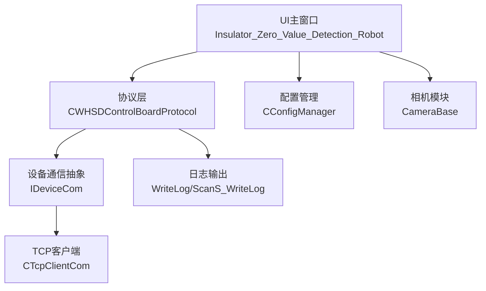
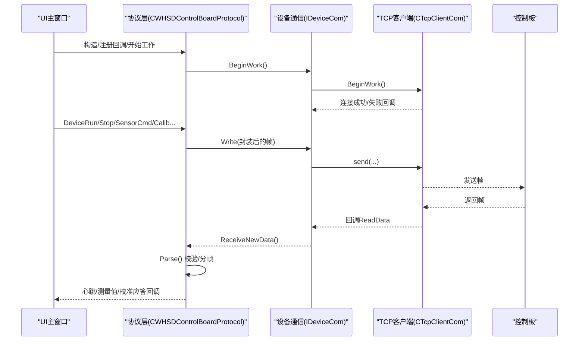
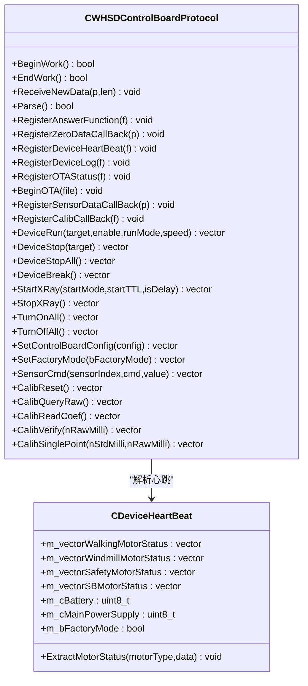
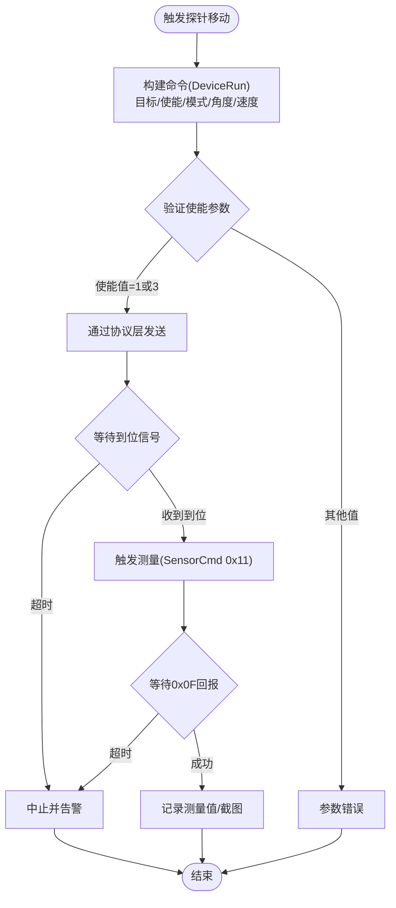
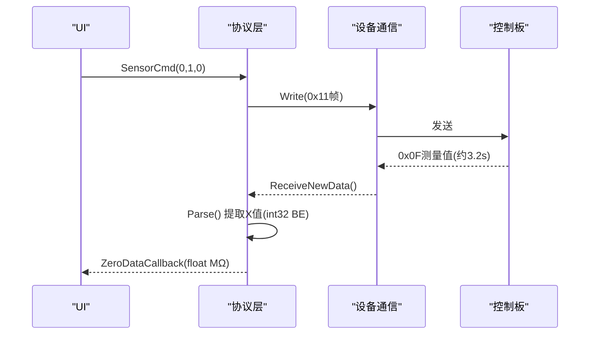
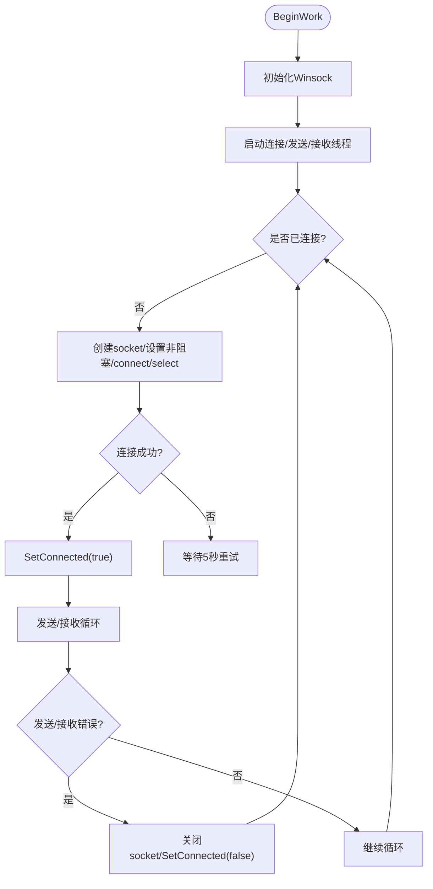
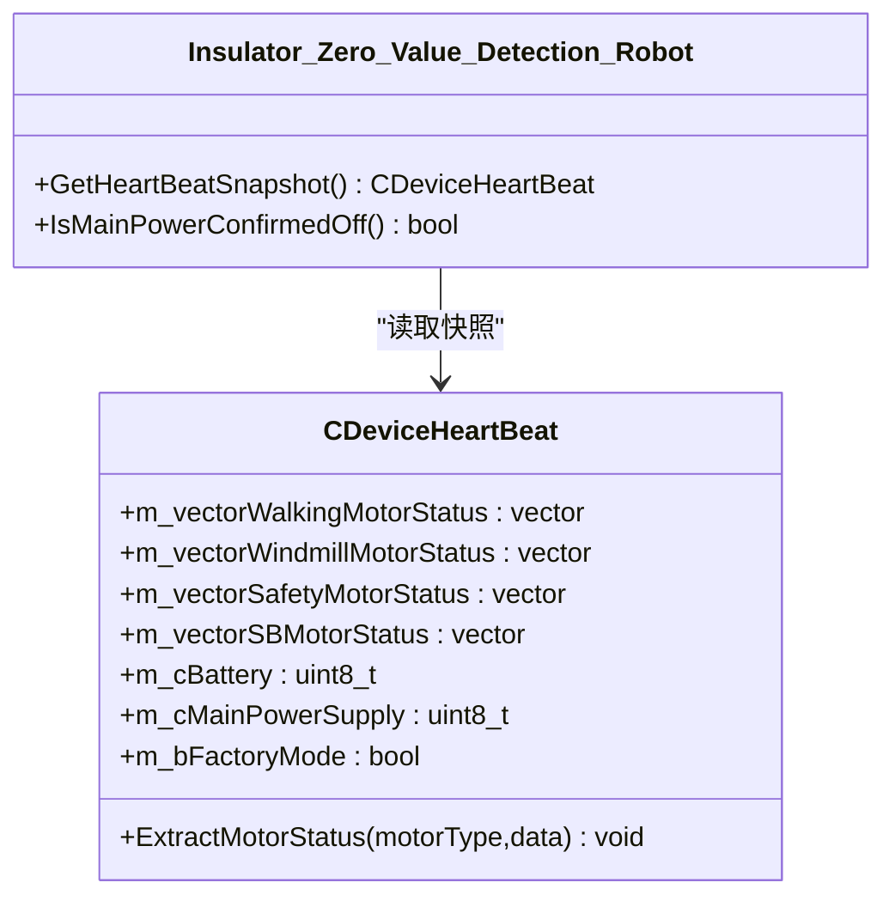
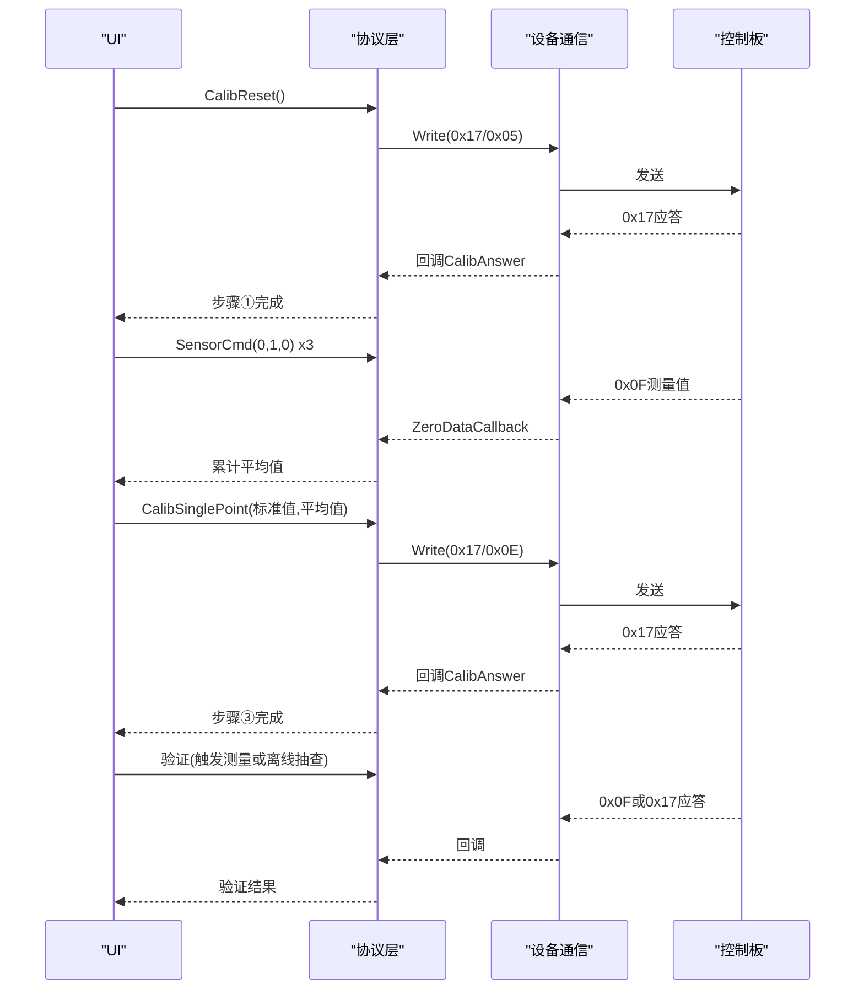
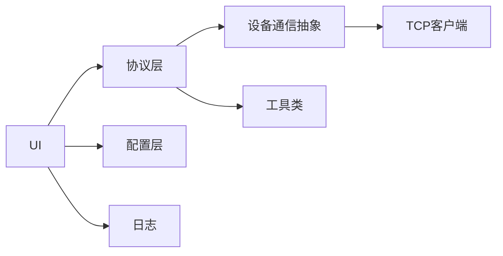

# 设备控制功能

<cite>
**本文引用的文件**
- [main.cpp](file://Insulator_Zero_Value_Detection_Robot/main.cpp)
- [WHSDControlBoradProtocol.h](file://Insulator_Zero_Value_Detection_Robot/Protocol/WHSDControlBoradProtocol.h)
- [WHSDControlBoradProtocol.cpp](file://Insulator_Zero_Value_Detection_Robot/Protocol/WHSDControlBoradProtocol.cpp)
- [TcpClient.h](file://Insulator_Zero_Value_Detection_Robot/DeviceCom/TcpClient.h)
- [TcpClient.cpp](file://Insulator_Zero_Value_Detection_Robot/DeviceCom/TcpClient.cpp)
- [IDeviceCom.h](file://Insulator_Zero_Value_Detection_Robot/DeviceCom/IDeviceCom.h)
- [ConfigManager.h](file://Insulator_Zero_Value_Detection_Robot/Config/ConfigManager.h)
- [ConfigManager.cpp](file://Insulator_Zero_Value_Detection_Robot/Config/ConfigManager.cpp)
- [Insulator_Zero_Value_Detection_Robot.h](file://Insulator_Zero_Value_Detection_Robot/UI/Insulator_Zero_Value_Detection_Robot.h)
- [Insulator_Zero_Value_Detection_Robot.cpp](file://Insulator_Zero_Value_Detection_Robot/UI/Insulator_Zero_Value_Detection_Robot.cpp)
</cite>

## 更新摘要
**变更内容**
- 更新了伺服控制使能验证逻辑，现在接受值(1, 3)而不是(1, 2)，提高了伺服操作的可靠性
- 增强了有效使能标准，改善了机器人定位和测量能力
- 在电机控制与探针定位部分添加了详细的使能参数说明

## 目录
1. [简介](#简介)
2. [项目结构](#项目结构)
3. [核心组件](#核心组件)
4. [架构总览](#架构总览)
5. [详细组件分析](#详细组件分析)
6. [依赖关系分析](#依赖关系分析)
7. [性能考虑](#性能考虑)
8. [故障排查指南](#故障排查指南)
9. [结论](#结论)
10. [附录：API与使用示例](#附录api与使用示例)

## 简介
本文件面向绝缘子零值检测机器人的"设备控制"能力，覆盖电机控制、探针定位、传感器数据采集、WHSD控制板通信协议（命令封装、数据解析、错误处理）、TCP客户端连接管理（心跳、断线重连）、设备状态监控与实时反馈、设备校准与参数配置、安全保护与异常处理策略，以及设备控制的API接口说明与使用示例。目标是让具备不同技术背景的读者都能理解并正确使用该系统的设备控制能力。

## 项目结构
本项目采用分层组织：UI层负责交互与流程编排；协议层实现与下位机控制板的通信协议；设备通信层提供TCP客户端抽象；配置层管理设备与相机等参数；日志与报告用于记录与归档。

图表来源
- [Insulator_Zero_Value_Detection_Robot.h:1-30](file://Insulator_Zero_Value_Detection_Robot/UI/Insulator_Zero_Value_Detection_Robot.h#L1-L30)
- [WHSDControlBoradProtocol.h:189-217](file://Insulator_Zero_Value_Detection_Robot/Protocol/WHSDControlBoradProtocol.h#L189-L217)
- [TcpClient.h:8-46](file://Insulator_Zero_Value_Detection_Robot/DeviceCom/TcpClient.h#L8-L46)
- [ConfigManager.h:185-199](file://Insulator_Zero_Value_Detection_Robot/Config/ConfigManager.h#L185-L199)

章节来源
- [main.cpp:11-24](file://Insulator_Zero_Value_Detection_Robot/main.cpp#L11-L24)
- [Insulator_Zero_Value_Detection_Robot.h:26-30](file://Insulator_Zero_Value_Detection_Robot/UI/Insulator_Zero_Value_Detection_Robot.h#L26-L30)

## 核心组件
- WHSD控制板协议：负责命令封装、帧校验、解析与回调分发，包含心跳线程、OTA升级、传感器数据与校准应答处理。
- TCP客户端：基于Winsock的异步收发、自动重连、发送队列与接收超时处理。
- 配置管理：从XML读取/写入设备IP、端口、心跳周期、探针角度、速度、阈值等。
- UI主控：编排测量流程、定标流程、状态显示、告警与截图/录像。

章节来源
- [WHSDControlBoradProtocol.h:189-356](file://Insulator_Zero_Value_Detection_Robot/Protocol/WHSDControlBoradProtocol.h#L189-L356)
- [TcpClient.cpp:59-121](file://Insulator_Zero_Value_Detection_Robot/DeviceCom/TcpClient.cpp#L59-L121)
- [ConfigManager.cpp:16-257](file://Insulator_Zero_Value_Detection_Robot/Config/ConfigManager.cpp#L16-L257)
- [Insulator_Zero_Value_Detection_Robot.cpp:88-102](file://Insulator_Zero_Value_Detection_Robot/UI/Insulator_Zero_Value_Detection_Robot.cpp#L88-L102)

## 架构总览
系统以UI为入口，通过协议层将控制指令下发至控制板，同时接收心跳、测量结果、传感器数据与校准应答。TCP客户端负责底层网络IO，配置模块提供运行参数。

图表来源
- [WHSDControlBoradProtocol.cpp:199-226](file://Insulator_Zero_Value_Detection_Robot/Protocol/WHSDControlBoradProtocol.cpp#L199-L226)
- [WHSDControlBoradProtocol.cpp:228-444](file://Insulator_Zero_Value_Detection_Robot/Protocol/WHSDControlBoradProtocol.cpp#L228-L444)
- [TcpClient.cpp:238-382](file://Insulator_Zero_Value_Detection_Robot/DeviceCom/TcpClient.cpp#L238-L382)

## 详细组件分析

### WHSD控制板通信协议
- 帧格式与校验：固定包头包尾，长度字段，校验和计算，支持多包粘包处理。
- 命令封装：统一通过GetCmdData组装，支持多种命令类型（电机、X射线、传感器、校准、配置等）。
- 数据解析：按命令字分发到对应处理分支，包括心跳、日志、OTA、测量结果、传感器反馈、校准应答。
- 回调机制：通过Register系列函数注册回调，将协议层事件上抛给UI或上层逻辑。
- 心跳线程：定时发送心跳帧，支持OTA期间暂停心跳。
- OTA升级：分包发送、进度上报、错误计数与退出。

图表来源
- [WHSDControlBoradProtocol.h:189-356](file://Insulator_Zero_Value_Detection_Robot/Protocol/WHSDControlBoradProtocol.h#L189-L356)
- [WHSDControlBoradProtocol.cpp:106-177](file://Insulator_Zero_Value_Detection_Robot/Protocol/WHSDControlBoradProtocol.cpp#L106-L177)

章节来源
- [WHSDControlBoradProtocol.cpp:654-677](file://Insulator_Zero_Value_Detection_Robot/Protocol/WHSDControlBoradProtocol.cpp#L654-L677)
- [WHSDControlBoradProtocol.cpp:769-800](file://Insulator_Zero_Value_Detection_Robot/Protocol/WHSDControlBoradProtocol.cpp#L769-L800)
- [WHSDControlBoradProtocol.cpp:679-759](file://Insulator_Zero_Value_Detection_Robot/Protocol/WHSDControlBoradProtocol.cpp#L679-L759)

### 电机控制与探针定位
- 电机控制：通过DeviceRun/DeviceStop/DeviceStopAll/DeviceBreak等命令控制目标电机启停、速度与模式。
- **更新** 伺服控制使能验证增强：现在接受值(1, 3)而不是(1, 2)，提高了伺服操作的可靠性。这一改进扩展了有效的使能标准，改善了机器人定位和测量能力。
- 探针定位：结合探针角度配置（UpAngle/DownAngle/UpAngle2）与运行模式，驱动探针移动到指定位置。
- 运行模式：支持角度+速度组合模式，便于精确控制探针姿态。

图表来源
- [WHSDControlBoradProtocol.cpp:529-541](file://Insulator_Zero_Value_Detection_Robot/Protocol/WHSDControlBoradProtocol.cpp#L529-L541)
- [Insulator_Zero_Value_Detection_Robot.cpp:67-73](file://Insulator_Zero_Value_Detection_Robot/UI/Insulator_Zero_Value_Detection_Robot.cpp#L67-L73)
- [Insulator_Zero_Value_Detection_Robot.cpp:894-911](file://Insulator_Zero_Value_Detection_Robot/UI/Insulator_Zero_Value_Detection_Robot.cpp#L894-L911)

章节来源
- [WHSDControlBoradProtocol.h:221-239](file://Insulator_Zero_Value_Detection_Robot/Protocol/WHSDControlBoradProtocol.h#L221-L239)
- [ConfigManager.h:10-24](file://Insulator_Zero_Value_Detection_Robot/Config/ConfigManager.h#L10-L24)
- [Insulator_Zero_Value_Detection_Robot.cpp:2030-2053](file://Insulator_Zero_Value_Detection_Robot/UI/Insulator_Zero_Value_Detection_Robot.cpp#L2030-L2053)

### 传感器数据采集
- 触发采集：通过SensorCmd(索引=0, cmd=1, value=0)触发一次测量，约3.2秒后由0x0F主动上报。
- 数据解析：0x0F数据域第7~10字节为int32有符号大端毫值，转换为MΩ后回调给UI。
- 轮询状态：定时器周期查询传感器状态（cmd=2/3/4），刷新界面状态。

图表来源
- [WHSDControlBoradProtocol.cpp:321-362](file://Insulator_Zero_Value_Detection_Robot/Protocol/WHSDControlBoradProtocol.cpp#L321-L362)
- [Insulator_Zero_Value_Detection_Robot.cpp:413-424](file://Insulator_Zero_Value_Detection_Robot/UI/Insulator_Zero_Value_Detection_Robot.cpp#L413-L424)

章节来源
- [WHSDControlBoradProtocol.cpp:557-560](file://Insulator_Zero_Value_Detection_Robot/Protocol/WHSDControlBoradProtocol.cpp#L557-560)
- [Insulator_Zero_Value_Detection_Robot.cpp:894-911](file://Insulator_Zero_Value_Detection_Robot/UI/Insulator_Zero_Value_Detection_Robot.cpp#L894-L911)

### TCP客户端连接管理、心跳检测与断线重连
- 连接管理：非阻塞socket + select，连接成功后启动发送/接收线程。
- 断线重连：ConnectionThread每5秒尝试重连，直到运行停止。
- 心跳检测：协议层LoopSendHeartBeat定时发送心跳帧；若长时间无心跳，UI可判定设备离线。
- 收发队列：发送队列保证并发安全，接收线程通过回调将数据交给协议层解析。

图表来源
- [TcpClient.cpp:59-121](file://Insulator_Zero_Value_Detection_Robot/DeviceCom/TcpClient.cpp#L59-L121)
- [TcpClient.cpp:123-236](file://Insulator_Zero_Value_Detection_Robot/DeviceCom/TcpClient.cpp#L123-L236)
- [TcpClient.cpp:238-382](file://Insulator_Zero_Value_Detection_Robot/DeviceCom/TcpClient.cpp#L238-L382)
- [WHSDControlBoradProtocol.cpp:769-782](file://Insulator_Zero_Value_Detection_Robot/Protocol/WHSDControlBoradProtocol.cpp#L769-L782)

章节来源
- [TcpClient.h:8-46](file://Insulator_Zero_Value_Detection_Robot/DeviceCom/TcpClient.h#L8-L46)
- [TcpClient.cpp:27-41](file://Insulator_Zero_Value_Detection_Robot/DeviceCom/TcpClient.cpp#L27-L41)

### 设备状态监控与实时反馈
- 心跳数据：包含各电机状态、电池电量、固件信息、X射线状态、总电源开关、工厂模式标志。
- 状态快照：UI侧加锁获取心跳快照，避免读到写一半的数据。
- 实时刷新：定时器轮询传感器状态，更新界面标签与表格。

图表来源
- [WHSDControlBoradProtocol.cpp:106-177](file://Insulator_Zero_Value_Detection_Robot/Protocol/WHSDControlBoradProtocol.cpp#L106-L177)
- [Insulator_Zero_Value_Detection_Robot.h:99-106](file://Insulator_Zero_Value_Detection_Robot/UI/Insulator_Zero_Value_Detection_Robot.h#L99-L106)

章节来源
- [WHSDControlBoradProtocol.cpp:784-800](file://Insulator_Zero_Value_Detection_Robot/Protocol/WHSDControlBoradProtocol.cpp#L784-L800)
- [Insulator_Zero_Value_Detection_Robot.cpp:413-424](file://Insulator_Zero_Value_Detection_Robot/UI/Insulator_Zero_Value_Detection_Robot.cpp#L413-L424)

### 设备校准（单点定标）流程
- 步骤①恢复默认：清空校准系数，测量通道直通。
- 步骤②测原始值：触发测量，连续3次取平均。
- 步骤③下发定标：标准值+实测原始值，写入Flash。
- 步骤④验证：触发测量看修正值，或离线抽查不挂电阻直接验证。
- 辅助：读回Flash中已存系数。

图表来源
- [WHSDControlBoradProtocol.cpp:582-616](file://Insulator_Zero_Value_Detection_Robot/Protocol/WHSDControlBoradProtocol.cpp#L582-L616)
- [Insulator_Zero_Value_Detection_Robot.cpp:974-1005](file://Insulator_Zero_Value_Detection_Robot/UI/Insulator_Zero_Value_Detection_Robot.cpp#L974-L1005)
- [Insulator_Zero_Value_Detection_Robot.cpp:1116-1147](file://Insulator_Zero_Value_Detection_Robot/UI/Insulator_Zero_Value_Detection_Robot.cpp#L1116-L1147)

章节来源
- [Insulator_Zero_Value_Detection_Robot.cpp:55-65](file://Insulator_Zero_Value_Detection_Robot/UI/Insulator_Zero_Value_Detection_Robot.cpp#L55-L65)
- [Insulator_Zero_Value_Detection_Robot.cpp:873-892](file://Insulator_Zero_Value_Detection_Robot/UI/Insulator_Zero_Value_Detection_Robot.cpp#L873-L892)

### 参数配置与维护操作
- 配置项：设备IP、端口、心跳周期、工厂模式、探针角度、行走/舵机速度、绝缘阈值等。
- 持久化：XML读写，支持批量工单与报告配置。
- 维护：保存参数后即时生效；可通过工厂模式进入调试/维护态。

章节来源
- [ConfigManager.h:10-24](file://Insulator_Zero_Value_Detection_Robot/Config/ConfigManager.h#L10-L24)
- [ConfigManager.cpp:16-257](file://Insulator_Zero_Value_Detection_Robot/Config/ConfigManager.cpp#L16-L257)
- [ConfigManager.cpp:259-452](file://Insulator_Zero_Value_Detection_Robot/Config/ConfigManager.cpp#L259-L452)
- [Insulator_Zero_Value_Detection_Robot.cpp:2498-2524](file://Insulator_Zero_Value_Detection_Robot/UI/Insulator_Zero_Value_Detection_Robot.cpp#L2498-L2524)

### 安全保护与异常处理
- 安全阈值：激光测距范围、安全轮角度、成像板角度、各电机电压异常阈值、运行时间阈值。
- 异常处理：发送/接收错误置为未连接并重连；心跳缺失视为未知状态；测量超时自动中止并告警。
- 电源保护：在未确认总电源关闭前不执行危险动作；心跳到达后才认为状态可信。

章节来源
- [WHSDControlBoradProtocol.h:54-111](file://Insulator_Zero_Value_Detection_Robot/Protocol/WHSDControlBoradProtocol.h#L54-L111)
- [WHSDControlBoradProtocol.cpp:284-304](file://Insulator_Zero_Value_Detection_Robot/Protocol/WHSDControlBoradProtocol.cpp#L284-L304)
- [Insulator_Zero_Value_Detection_Robot.cpp:2030-2053](file://Insulator_Zero_Value_Detection_Robot/UI/Insulator_Zero_Value_Detection_Robot.cpp#L2030-L2053)

## 依赖关系分析
- UI依赖协议层进行控制与数据接收，依赖配置层加载参数，依赖日志模块记录。
- 协议层依赖设备通信抽象，屏蔽具体传输细节；内部使用工具类进行数据拆分与HEX打印。
- TCP客户端依赖Winsock库，提供可靠的重连与线程安全收发。

图表来源
- [Insulator_Zero_Value_Detection_Robot.h:8-15](file://Insulator_Zero_Value_Detection_Robot/UI/Insulator_Zero_Value_Detection_Robot.h#L8-L15)
- [WHSDControlBoradProtocol.cpp:6-7](file://Insulator_Zero_Value_Detection_Robot/Protocol/WHSDControlBoradProtocol.cpp#L6-L7)
- [TcpClient.cpp:1-10](file://Insulator_Zero_Value_Detection_Robot/DeviceCom/TcpClient.cpp#L1-L10)

章节来源
- [IDeviceCom.h:1-15](file://Insulator_Zero_Value_Detection_Robot/DeviceCom/IDeviceCom.h#L1-L15)
- [WHSDControlBoradProtocol.cpp:6-7](file://Insulator_Zero_Value_Detection_Robot/Protocol/WHSDControlBoradProtocol.cpp#L6-L7)

## 性能考虑
- 协议解析：缓冲区逐帧解析，避免整包拷贝；校验失败快速丢弃，减少无效处理。
- 心跳频率：可配置的心跳间隔，平衡实时性与网络负载。
- 发送队列：多线程安全队列，避免阻塞UI线程。
- 测量时序：合理设置超时与轮询周期，避免频繁请求导致拥塞。

[本节为通用指导，不直接分析具体文件]

## 故障排查指南
- 无法连接：检查IP/端口配置；查看TCP客户端连接回调；确认防火墙与网络连通性。
- 无心跳：确认协议层BeginWork已调用；检查心跳线程是否被OTA暂停；观察UI心跳计数。
- 测量无返回值：确认已触发0x11；检查0x0F回报是否到达；调整超时时间。
- 校准失败：根据原因码判断（原始值超时、Flash写失败、参数长度/格式错误、参数非法）；重新执行步骤或检查链路。
- 电机异常：检查电压阈值配置；查看心跳中的电机状态；必要时执行急停(DeviceBreak)。
- **新增** 伺服控制问题：如果伺服控制使能参数验证失败，检查传入的使能值是否为1或3；确认硬件连接正常。

章节来源
- [TcpClient.cpp:163-236](file://Insulator_Zero_Value_Detection_Robot/DeviceCom/TcpClient.cpp#L163-L236)
- [WHSDControlBoradProtocol.cpp:284-304](file://Insulator_Zero_Value_Detection_Robot/Protocol/WHSDControlBoradProtocol.cpp#L284-L304)
- [Insulator_Zero_Value_Detection_Robot.cpp:1267-1292](file://Insulator_Zero_Value_Detection_Robot/UI/Insulator_Zero_Value_Detection_Robot.cpp#L1267-L1292)

## 结论
本系统通过清晰的协议层与设备通信抽象，实现了稳定的设备控制、传感器数据采集与校准流程。TCP客户端提供了可靠的连接管理与重连机制，配合心跳与状态监控确保运行安全。UI层编排了完整的测量与定标流程，并提供参数配置与维护能力。**最新改进**：伺服控制使能验证逻辑的增强（接受值1和3而非1和2）显著提高了伺服操作的可靠性，改善了机器人定位和测量能力。建议在生产环境中合理设置超时与阈值，完善日志与告警，以提升鲁棒性与可维护性。

[本节为总结，不直接分析具体文件]

## 附录：API与使用示例

### 设备控制API（协议层）
- 电机控制
  - DeviceRun(target, enable, runMode, speed)
  - DeviceRun(target, enable, runMode, runAngel, speed)
  - DeviceStop(target)
  - DeviceStopAll()
  - DeviceBreak()
- X射线控制
  - StartXRay(startMode, startTTL, isDelay)
  - StopXRay()
- 全局控制
  - TurnOnAll()
  - TurnOffAll()
  - SetControlBoardConfig(config)
  - SetFactoryMode(bFactoryMode)
- 传感器
  - SensorCmd(sensorIndex, cmd, value)
- 校准
  - CalibReset()
  - CalibQueryRaw()
  - CalibReadCoef()
  - CalibVerify(nRawMilli)
  - CalibSinglePoint(nStdMilli, nRawMilli)

章节来源
- [WHSDControlBoradProtocol.h:221-287](file://Insulator_Zero_Value_Detection_Robot/Protocol/WHSDControlBoradProtocol.h#L221-L287)
- [WHSDControlBoradProtocol.cpp:488-616](file://Insulator_Zero_Value_Detection_Robot/Protocol/WHSDControlBoradProtocol.cpp#L488-L616)

### 使用示例（概念流程）
- 连接设备：设置IP/端口，调用BeginWork，监听连接回调。
- 发送控制：调用DeviceRun/Stop等，通过Write发送到设备。
- 接收数据：在ReceiveNewData中解析帧，回调ZeroData/HeartBeat/CalibAnswer。
- 校准流程：依次执行恢复默认→测原始值→下发定标→验证。
- 参数配置：修改配置后调用Write持久化，必要时重启通信。
- **更新** 伺服控制参数：确保使能参数值为1或3以获得最佳性能和可靠性。

章节来源
- [TcpClient.cpp:27-41](file://Insulator_Zero_Value_Detection_Robot/DeviceCom/TcpClient.cpp#L27-L41)
- [Insulator_Zero_Value_Detection_Robot.cpp:894-911](file://Insulator_Zero_Value_Detection_Robot/UI/Insulator_Zero_Value_Detection_Robot.cpp#L894-L911)
- [Insulator_Zero_Value_Detection_Robot.cpp:974-1005](file://Insulator_Zero_Value_Detection_Robot/UI/Insulator_Zero_Value_Detection_Robot.cpp#L974-L1005)