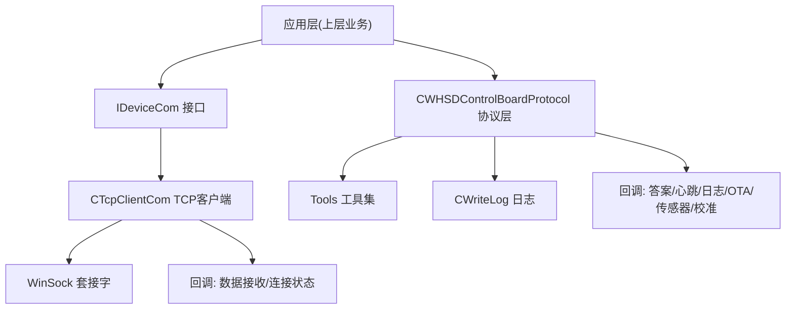
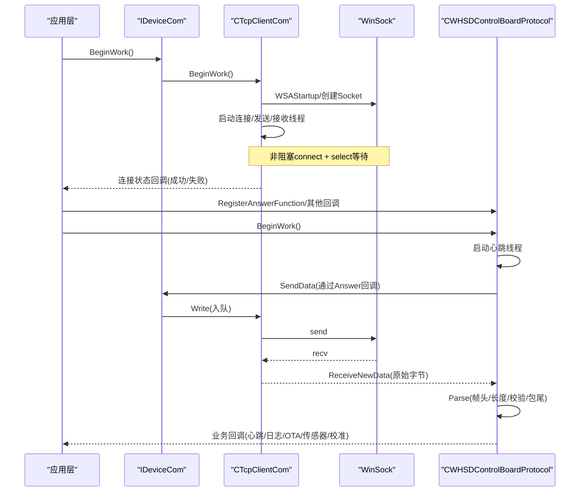
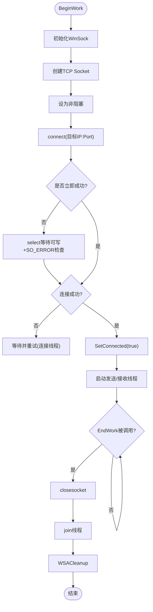
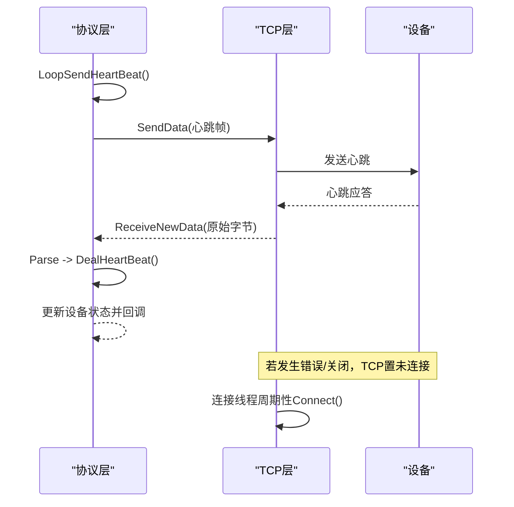
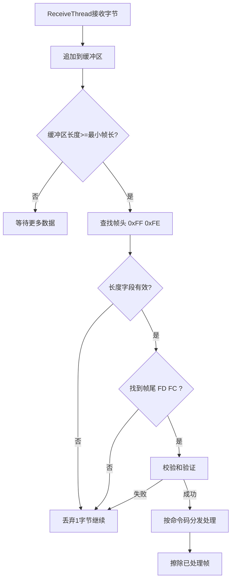
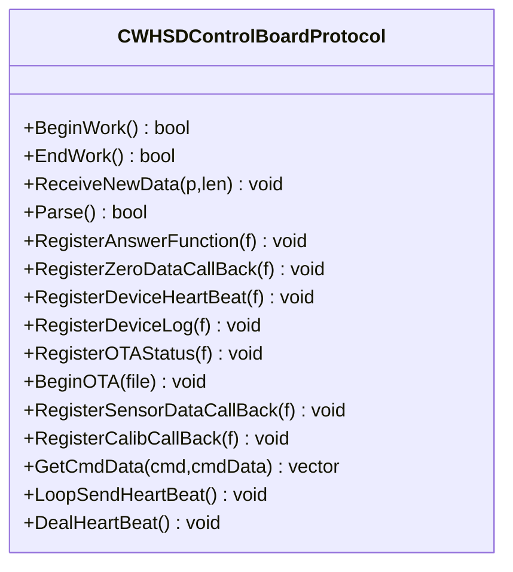
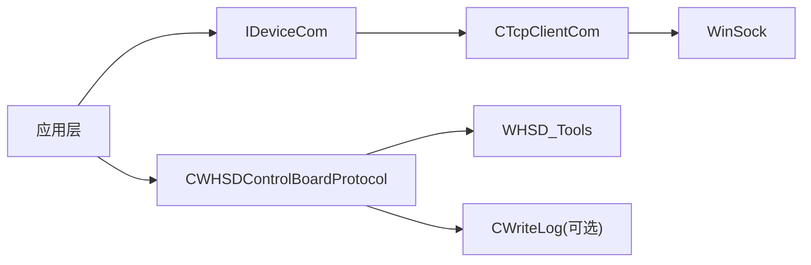

# 设备通信管理

<cite>
**本文引用的文件**
- [TcpClient.h](file://Insulator_Zero_Value_Detection_Robot/DeviceCom/TcpClient.h)
- [TcpClient.cpp](file://Insulator_Zero_Value_Detection_Robot/DeviceCom/TcpClient.cpp)
- [IDeviceCom.h](file://Insulator_Zero_Value_Detection_Robot/DeviceCom/IDeviceCom.h)
- [IDeviceCom.cpp](file://Insulator_Zero_Value_Detection_Robot/DeviceCom/IDeviceCom.cpp)
- [WHSDControlBoradProtocol.h](file://Insulator_Zero_Value_Detection_Robot/Protocol/WHSDControlBoradProtocol.h)
- [WHSDControlBoradProtocol.cpp](file://Insulator_Zero_Value_Detection_Robot/Protocol/WHSDControlBoradProtocol.cpp)
- [Tools.h](file://Insulator_Zero_Value_Detection_Robot/Tools/Tools.h)
- [ScanS_WriteLog.h](file://Insulator_Zero_Value_Detection_Robot/Log/ScanS_WriteLog.h)
</cite>

## 目录
1. [简介](#简介)
2. [项目结构](#项目结构)
3. [核心组件](#核心组件)
4. [架构总览](#架构总览)
5. [详细组件分析](#详细组件分析)
6. [依赖关系分析](#依赖关系分析)
7. [性能考虑](#性能考虑)
8. [故障排查指南](#故障排查指南)
9. [结论](#结论)
10. [附录](#附录)

## 简介
本文件为绝缘子检测机器人的“设备通信管理系统”提供全面文档，覆盖TCP客户端的连接建立、维护与断开流程；心跳检测机制与断线自动重连策略；数据包的分片传输与重组处理；通信协议的帧格式与校验机制；连接池管理与多设备并发通信方案；通信错误处理与重试机制；网络性能优化与流量控制方法；以及通信日志记录与故障排查工具。

## 项目结构
本项目在设备通信方面主要由以下模块构成：
- 设备通信抽象接口与实现：IDeviceCom 接口与 CTcpClientCom TCP 客户端实现
- 协议解析与业务封装：CWHSDControlBoardProtocol 负责帧组装、解析、心跳、OTA等
- 工具与日志：Tools 提供通用工具（如分包），WriteLog 提供线程安全日志写入

图表来源
- [IDeviceCom.h:1-15](file://Insulator_Zero_Value_Detection_Robot/DeviceCom/IDeviceCom.h#L1-L15)
- [TcpClient.h:8-46](file://Insulator_Zero_Value_Detection_Robot/DeviceCom/TcpClient.h#L8-L46)
- [WHSDControlBoradProtocol.h:189-355](file://Insulator_Zero_Value_Detection_Robot/Protocol/WHSDControlBoradProtocol.h#L189-L355)
- [Tools.h:20-78](file://Insulator_Zero_Value_Detection_Robot/Tools/Tools.h#L20-L78)
- [ScanS_WriteLog.h:5-42](file://Insulator_Zero_Value_Detection_Robot/Log/ScanS_WriteLog.h#L5-L42)

章节来源
- [IDeviceCom.h:1-15](file://Insulator_Zero_Value_Detection_Robot/DeviceCom/IDeviceCom.h#L1-L15)
- [IDeviceCom.cpp:1-13](file://Insulator_Zero_Value_Detection_Robot/DeviceCom/IDeviceCom.cpp#L1-L13)
- [TcpClient.h:8-46](file://Insulator_Zero_Value_Detection_Robot/DeviceCom/TcpClient.h#L8-L46)
- [TcpClient.cpp:21-121](file://Insulator_Zero_Value_Detection_Robot/DeviceCom/TcpClient.cpp#L21-L121)
- [WHSDControlBoradProtocol.h:189-355](file://Insulator_Zero_Value_Detection_Robot/Protocol/WHSDControlBoradProtocol.h#L189-L355)
- [WHSDControlBoradProtocol.cpp:199-226](file://Insulator_Zero_Value_Detection_Robot/Protocol/WHSDControlBoradProtocol.cpp#L199-L226)
- [Tools.h:20-78](file://Insulator_Zero_Value_Detection_Robot/Tools/Tools.h#L20-L78)
- [ScanS_WriteLog.h:5-42](file://Insulator_Zero_Value_Detection_Robot/Log/ScanS_WriteLog.h#L5-L42)

## 核心组件
- IDeviceCom：定义统一的设备通信抽象接口，包括参数设置、读写、生命周期管理、回调注册等。
- CTcpClientCom：基于 WinSock 的 TCP 客户端实现，包含连接线程、发送线程、接收线程，支持非阻塞连接、select 超时、断线重连、发送队列等。
- CWHSDControlBoardProtocol：协议层，负责帧组装/解析、心跳周期发送与处理、OTA升级、传感器数据与校准应答分发、日志上报等。
- Tools：提供分包 SplitVectorData、位操作宏等工具。
- CWriteLog：线程安全的日志写入器，支持同步/异步模式。

章节来源
- [IDeviceCom.h:1-15](file://Insulator_Zero_Value_Detection_Robot/DeviceCom/IDeviceCom.h#L1-L15)
- [TcpClient.h:8-46](file://Insulator_Zero_Value_Detection_Robot/DeviceCom/TcpClient.h#L8-L46)
- [WHSDControlBoradProtocol.h:189-355](file://Insulator_Zero_Value_Detection_Robot/Protocol/WHSDControlBoradProtocol.h#L189-L355)
- [Tools.h:20-78](file://Insulator_Zero_Value_Detection_Robot/Tools/Tools.h#L20-L78)
- [ScanS_WriteLog.h:5-42](file://Insulator_Zero_Value_Detection_Robot/Log/ScanS_WriteLog.h#L5-L42)

## 架构总览
系统采用分层设计：
- 应用层通过 IDeviceCom 接口与具体通信实现解耦
- TCP 客户端负责底层连接、收发、重连
- 协议层对数据进行帧级封装与解析，并向上层暴露语义化回调
- 工具与日志提供支撑能力

图表来源
- [TcpClient.cpp:59-121](file://Insulator_Zero_Value_Detection_Robot/DeviceCom/TcpClient.cpp#L59-L121)
- [TcpClient.cpp:163-236](file://Insulator_Zero_Value_Detection_Robot/DeviceCom/TcpClient.cpp#L163-L236)
- [TcpClient.cpp:238-382](file://Insulator_Zero_Value_Detection_Robot/DeviceCom/TcpClient.cpp#L238-L382)
- [WHSDControlBoradProtocol.cpp:199-226](file://Insulator_Zero_Value_Detection_Robot/Protocol/WHSDControlBoradProtocol.cpp#L199-L226)
- [WHSDControlBoradProtocol.cpp:228-444](file://Insulator_Zero_Value_Detection_Robot/Protocol/WHSDControlBoradProtocol.cpp#L228-L444)
- [WHSDControlBoradProtocol.cpp:769-782](file://Insulator_Zero_Value_Detection_Robot/Protocol/WHSDControlBoradProtocol.cpp#L769-L782)

## 详细组件分析

### TCP 客户端（连接建立、维护与断开）
- 连接建立
  - 初始化 WinSock，创建 TCP Socket，设置为非阻塞
  - 使用 connect 发起连接，若返回 WSAEWOULDBLOCK，则用 select 等待可写事件并检查 SO_ERROR
  - 连接成功后设置 m_connected=true 并通过回调通知上层
- 连接维护
  - 独立连接线程周期性尝试重连（未连接时每隔固定时间尝试一次）
  - 接收线程使用 select 监听可读事件，读取数据后调用上层注册的读回调
  - 发送线程从队列取数据并发送，遇到错误将置为未连接以触发重连
- 断开流程
  - EndWork 停止运行标志，关闭套接字，join 所有线程，清理 WinSock
  - CloseSocket 会关闭套接字并调用 SetConnected(false) 触发重连逻辑

图表来源
- [TcpClient.cpp:59-121](file://Insulator_Zero_Value_Detection_Robot/DeviceCom/TcpClient.cpp#L59-L121)
- [TcpClient.cpp:163-236](file://Insulator_Zero_Value_Detection_Robot/DeviceCom/TcpClient.cpp#L163-L236)
- [TcpClient.cpp:238-382](file://Insulator_Zero_Value_Detection_Robot/DeviceCom/TcpClient.cpp#L238-L382)

章节来源
- [TcpClient.cpp:59-121](file://Insulator_Zero_Value_Detection_Robot/DeviceCom/TcpClient.cpp#L59-L121)
- [TcpClient.cpp:163-236](file://Insulator_Zero_Value_Detection_Robot/DeviceCom/TcpClient.cpp#L163-L236)
- [TcpClient.cpp:238-382](file://Insulator_Zero_Value_Detection_Robot/DeviceCom/TcpClient.cpp#L238-L382)

### 心跳检测与断线自动重连
- 心跳发送
  - 协议层启动独立线程按配置周期发送心跳帧（命令码 0x00），通过 Answer 回调下发到 TCP 层
- 心跳处理
  - 收到心跳应答（命令码 0x00）后，解析设备状态（电机状态、电池、电源、固件信息等），并调用 DeviceHeartBeat 回调
- 断线重连
  - TCP 层检测到发送/接收错误或远端关闭时，置未连接状态
  - 连接线程在循环中持续尝试重连，直到重新连接成功

图表来源
- [WHSDControlBoradProtocol.cpp:769-782](file://Insulator_Zero_Value_Detection_Robot/Protocol/WHSDControlBoradProtocol.cpp#L769-L782)
- [WHSDControlBoradProtocol.cpp:784-800](file://Insulator_Zero_Value_Detection_Robot/Protocol/WHSDControlBoradProtocol.cpp#L784-L800)
- [TcpClient.cpp:123-135](file://Insulator_Zero_Value_Detection_Robot/DeviceCom/TcpClient.cpp#L123-L135)
- [TcpClient.cpp:284-293](file://Insulator_Zero_Value_Detection_Robot/DeviceCom/TcpClient.cpp#L284-L293)
- [TcpClient.cpp:349-374](file://Insulator_Zero_Value_Detection_Robot/DeviceCom/TcpClient.cpp#L349-L374)

章节来源
- [WHSDControlBoradProtocol.cpp:769-782](file://Insulator_Zero_Value_Detection_Robot/Protocol/WHSDControlBoradProtocol.cpp#L769-L782)
- [WHSDControlBoradProtocol.cpp:784-800](file://Insulator_Zero_Value_Detection_Robot/Protocol/WHSDControlBoradProtocol.cpp#L784-L800)
- [TcpClient.cpp:123-135](file://Insulator_Zero_Value_Detection_Robot/DeviceCom/TcpClient.cpp#L123-L135)
- [TcpClient.cpp:284-293](file://Insulator_Zero_Value_Detection_Robot/DeviceCom/TcpClient.cpp#L284-L293)
- [TcpClient.cpp:349-374](file://Insulator_Zero_Value_Detection_Robot/DeviceCom/TcpClient.cpp#L349-L374)

### 数据包分片传输与重组
- 分包发送（OTA）
  - OTA 文件通过 Tools::SplitVectorData 按固定长度切分为多个包
  - 每个包携带序号、长度等信息，逐包发送，并在过程中上报进度与状态
- 数据重组（接收）
  - 接收线程将收到的原始字节追加到缓冲区
  - 解析器按帧头、长度、校验和、帧尾进行完整帧提取，丢弃不完整或校验失败的片段
  - 解析完成后根据命令码分发到对应处理逻辑（心跳、日志、OTA、传感器、校准等）

图表来源
- [WHSDControlBoradProtocol.cpp:213-226](file://Insulator_Zero_Value_Detection_Robot/Protocol/WHSDControlBoradProtocol.cpp#L213-L226)
- [WHSDControlBoradProtocol.cpp:228-444](file://Insulator_Zero_Value_Detection_Robot/Protocol/WHSDControlBoradProtocol.cpp#L228-L444)
- [WHSDControlBoradProtocol.cpp:679-759](file://Insulator_Zero_Value_Detection_Robot/Protocol/WHSDControlBoradProtocol.cpp#L679-L759)
- [Tools.h:55-55](file://Insulator_Zero_Value_Detection_Robot/Tools/Tools.h#L55-L55)

章节来源
- [WHSDControlBoradProtocol.cpp:213-226](file://Insulator_Zero_Value_Detection_Robot/Protocol/WHSDControlBoradProtocol.cpp#L213-L226)
- [WHSDControlBoradProtocol.cpp:228-444](file://Insulator_Zero_Value_Detection_Robot/Protocol/WHSDControlBoradProtocol.cpp#L228-L444)
- [WHSDControlBoradProtocol.cpp:679-759](file://Insulator_Zero_Value_Detection_Robot/Protocol/WHSDControlBoradProtocol.cpp#L679-L759)
- [Tools.h:55-55](file://Insulator_Zero_Value_Detection_Robot/Tools/Tools.h#L55-L55)

### 通信协议帧格式与校验机制
- 帧格式
  - 帧头：0xFF 0xFE
  - 长度：第3字节表示整帧长度
  - 包号：第4字节递增（溢出归零）
  - 命令码：第5字节
  - 数据域：命令相关数据
  - 校验和：倒数第3字节，为前 N-3 字节之和
  - 帧尾：0xFD 0xFC
- 校验机制
  - 发送侧计算校验和并填入帧内
  - 接收侧逐字节累加求和并与帧内校验对比，不一致则丢弃该帧
- 命令与用途
  - 0x00：心跳（含设备状态）
  - 0x07：设备日志上报
  - 0x0A/0x0B/0x0C：OTA 流程（进入OTA、分包传输、完成）
  - 0x0F：测量结果回报（X值）
  - 0x11：传感器指令反馈
  - 0x17：校准命令应答

图表来源
- [WHSDControlBoradProtocol.h:189-355](file://Insulator_Zero_Value_Detection_Robot/Protocol/WHSDControlBoradProtocol.h#L189-L355)
- [WHSDControlBoradProtocol.cpp:654-677](file://Insulator_Zero_Value_Detection_Robot/Protocol/WHSDControlBoradProtocol.cpp#L654-L677)
- [WHSDControlBoradProtocol.cpp:228-444](file://Insulator_Zero_Value_Detection_Robot/Protocol/WHSDControlBoradProtocol.cpp#L228-L444)

章节来源
- [WHSDControlBoradProtocol.cpp:654-677](file://Insulator_Zero_Value_Detection_Robot/Protocol/WHSDControlBoradProtocol.cpp#L654-L677)
- [WHSDControlBoradProtocol.cpp:228-444](file://Insulator_Zero_Value_Detection_Robot/Protocol/WHSDControlBoradProtocol.cpp#L228-L444)

### 连接池管理与多设备并发通信
- 现状
  - 当前 IDeviceCom 工厂仅返回单一 TCP 客户端实例
  - 无内置连接池或多连接管理
- 建议方案
  - 扩展 IDeviceCom 工厂以支持多实例创建与管理
  - 引入连接池：按设备标识分配独立 CTcpClientCom 实例，维护连接状态、收发队列、重连策略
  - 多设备并发：每个设备独立线程组（连接/发送/接收），通过消息路由将响应匹配到对应设备上下文
  - 资源隔离：避免共享全局状态，确保各设备通信互不干扰

章节来源
- [IDeviceCom.cpp:1-13](file://Insulator_Zero_Value_Detection_Robot/DeviceCom/IDeviceCom.cpp#L1-L13)
- [TcpClient.h:8-46](file://Insulator_Zero_Value_Detection_Robot/DeviceCom/TcpClient.h#L8-L46)

### 通信错误处理与重试机制
- 发送错误
  - 非阻塞模式下，send 返回错误且非 WSAEWOULDBLOCK/WSAEINTR 时，置未连接，触发重连
- 接收错误
  - recv 返回错误或远端关闭时，置未连接，触发重连
- 重连策略
  - 连接线程每固定间隔尝试连接，直至成功
- OTA 重试
  - OTA 流程内部维护错误计数，超过阈值则终止并上报状态

章节来源
- [TcpClient.cpp:284-293](file://Insulator_Zero_Value_Detection_Robot/DeviceCom/TcpClient.cpp#L284-L293)
- [TcpClient.cpp:349-374](file://Insulator_Zero_Value_Detection_Robot/DeviceCom/TcpClient.cpp#L349-L374)
- [WHSDControlBoradProtocol.cpp:679-759](file://Insulator_Zero_Value_Detection_Robot/Protocol/WHSDControlBoradProtocol.cpp#L679-L759)

### 网络性能优化与流量控制
- 非阻塞I/O与select
  - 连接与收发均使用非阻塞模式与 select 超时，降低阻塞等待开销
- 发送队列
  - 使用条件变量与互斥锁保护发送队列，避免竞争，提高吞吐
- 批量发送
  - 发送线程一次性取出队列头部数据块发送，减少上下文切换
- 流量控制建议
  - 在上层增加背压：当发送队列过长时暂停上游数据生产
  - 调整 select 超时与重连间隔以平衡延迟与CPU占用
  - 合理设置缓冲区大小与分包长度（OTA 128字节）

章节来源
- [TcpClient.cpp:238-299](file://Insulator_Zero_Value_Detection_Robot/DeviceCom/TcpClient.cpp#L238-L299)
- [WHSDControlBoradProtocol.cpp:679-759](file://Insulator_Zero_Value_Detection_Robot/Protocol/WHSDControlBoradProtocol.cpp#L679-L759)

### 通信日志记录与故障排查工具
- 日志上报
  - 协议层收到设备日志（命令码 0x07）后，通过 RegisterDeviceLog 回调上报
- 本地调试输出
  - TCP 层在调试模式下输出收发十六进制数据，便于抓包分析
- 文件日志
  - 可使用 CWriteLog 进行持久化日志记录，支持同步/异步写入

章节来源
- [WHSDControlBoradProtocol.cpp:267-275](file://Insulator_Zero_Value_Detection_Robot/Protocol/WHSDControlBoradProtocol.cpp#L267-L275)
- [TcpClient.cpp:267-283](file://Insulator_Zero_Value_Detection_Robot/DeviceCom/TcpClient.cpp#L267-L283)
- [ScanS_WriteLog.h:5-42](file://Insulator_Zero_Value_Detection_Robot/Log/ScanS_WriteLog.h#L5-L42)

## 依赖关系分析
- 组件耦合
  - IDeviceCom 作为抽象层，屏蔽底层实现差异
  - CTcpClientCom 依赖 WinSock 与标准库线程/原子/条件变量
  - CWHSDControlBoardProtocol 依赖 Tools 工具集与回调机制
- 外部依赖
  - Windows 平台网络栈（WinSock）
  - Qt 应用框架（主程序入口）

图表来源
- [IDeviceCom.h:1-15](file://Insulator_Zero_Value_Detection_Robot/DeviceCom/IDeviceCom.h#L1-L15)
- [TcpClient.cpp:1-19](file://Insulator_Zero_Value_Detection_Robot/DeviceCom/TcpClient.cpp#L1-L19)
- [WHSDControlBoradProtocol.cpp:1-7](file://Insulator_Zero_Value_Detection_Robot/Protocol/WHSDControlBoradProtocol.cpp#L1-L7)
- [Tools.h:20-78](file://Insulator_Zero_Value_Detection_Robot/Tools/Tools.h#L20-L78)

章节来源
- [IDeviceCom.h:1-15](file://Insulator_Zero_Value_Detection_Robot/DeviceCom/IDeviceCom.h#L1-L15)
- [TcpClient.cpp:1-19](file://Insulator_Zero_Value_Detection_Robot/DeviceCom/TcpClient.cpp#L1-L19)
- [WHSDControlBoradProtocol.cpp:1-7](file://Insulator_Zero_Value_Detection_Robot/Protocol/WHSDControlBoradProtocol.cpp#L1-L7)
- [Tools.h:20-78](file://Insulator_Zero_Value_Detection_Robot/Tools/Tools.h#L20-L78)

## 性能考虑
- 使用非阻塞I/O与select避免线程长时间阻塞
- 发送队列配合条件变量减少忙轮询
- 分包长度与心跳间隔需根据实际网络状况调优
- 在高并发场景下，建议引入连接池与背压机制，防止内存与带宽拥塞

[本节为通用指导，无需特定文件引用]

## 故障排查指南
- 无法连接
  - 检查 IP/端口配置是否正确
  - 查看连接线程日志与错误码（WSAGetLastError）
  - 确认防火墙与网络设备允许访问
- 频繁断线
  - 检查网络稳定性与丢包率
  - 关注发送/接收错误分支，定位具体错误类型
  - 适当调整重连间隔与超时
- 数据解析异常
  - 核对帧头/帧尾与长度字段
  - 校验和是否一致
  - 使用调试输出打印收发十六进制数据
- OTA 失败
  - 检查错误计数与状态回调
  - 确认分包长度与序号正确
  - 观察设备是否进入/退出 OTA 模式

章节来源
- [TcpClient.cpp:163-236](file://Insulator_Zero_Value_Detection_Robot/DeviceCom/TcpClient.cpp#L163-L236)
- [TcpClient.cpp:284-293](file://Insulator_Zero_Value_Detection_Robot/DeviceCom/TcpClient.cpp#L284-L293)
- [TcpClient.cpp:349-374](file://Insulator_Zero_Value_Detection_Robot/DeviceCom/TcpClient.cpp#L349-L374)
- [WHSDControlBoradProtocol.cpp:228-444](file://Insulator_Zero_Value_Detection_Robot/Protocol/WHSDControlBoradProtocol.cpp#L228-L444)
- [WHSDControlBoradProtocol.cpp:679-759](file://Insulator_Zero_Value_Detection_Robot/Protocol/WHSDControlBoradProtocol.cpp#L679-L759)

## 结论
本通信管理系统通过清晰的层次划分与模块化设计，实现了稳定的 TCP 连接管理、可靠的心跳与重连机制、健壮的帧解析与校验、可扩展的协议封装与回调分发，以及完善的日志与调试支持。针对多设备并发与高吞吐场景，建议引入连接池与背压控制，进一步提升系统的可扩展性与鲁棒性。

[本节为总结性内容，无需特定文件引用]

## 附录
- 关键类与方法路径参考
  - 连接与生命周期：[BeginWork/EndWork:59-121](file://Insulator_Zero_Value_Detection_Robot/DeviceCom/TcpClient.cpp#L59-L121)
  - 连接与收发线程：[ConnectionThread/SendThread/ReceiveThread:123-382](file://Insulator_Zero_Value_Detection_Robot/DeviceCom/TcpClient.cpp#L123-L382)
  - 协议帧组装与解析：[GetCmdData/Parse:228-444](file://Insulator_Zero_Value_Detection_Robot/Protocol/WHSDControlBoradProtocol.cpp#L228-L444), (file://Insulator_Zero_Value_Detection_Robot/Protocol/WHSDControlBoradProtocol.cpp#L654-L677)
  - 心跳与处理：[LoopSendHeartBeat/DealHeartBeat:769-800](file://Insulator_Zero_Value_Detection_Robot/Protocol/WHSDControlBoradProtocol.cpp#L769-L800)
  - OTA 分包与传输：[OTAThread:679-759](file://Insulator_Zero_Value_Detection_Robot/Protocol/WHSDControlBoradProtocol.cpp#L679-L759)
  - 工具函数：[SplitVectorData:55-55](file://Insulator_Zero_Value_Detection_Robot/Tools/Tools.h#L55-L55)
  - 日志写入：[CWriteLog:5-42](file://Insulator_Zero_Value_Detection_Robot/Log/ScanS_WriteLog.h#L5-L42)