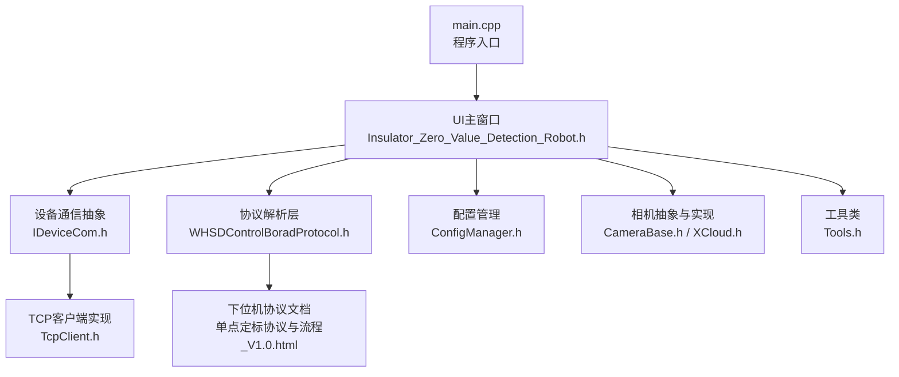
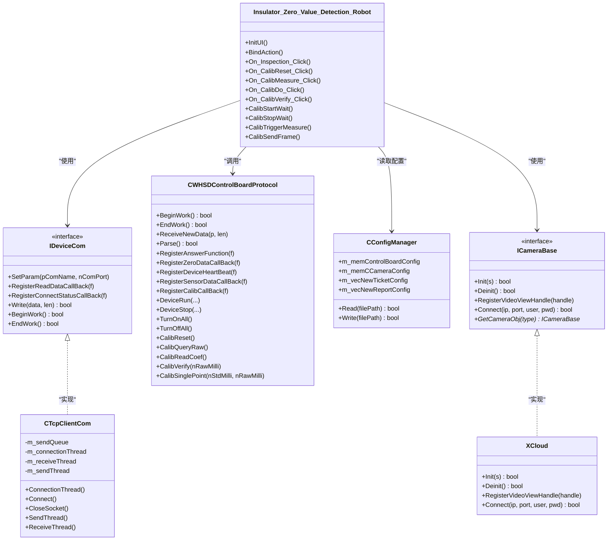
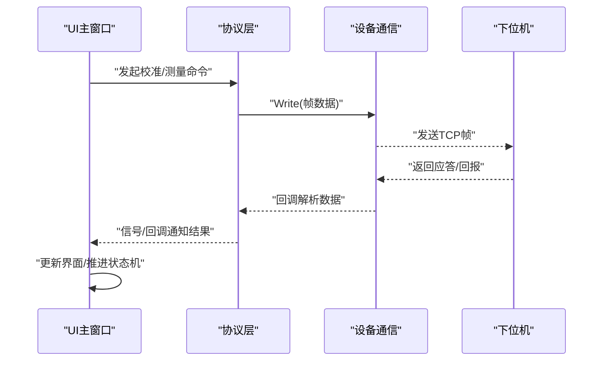
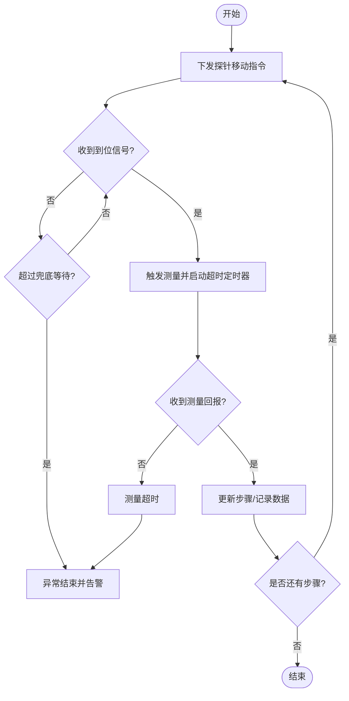
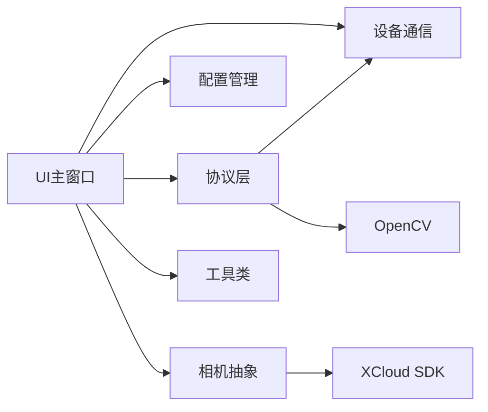

# 开发指南

<cite>
**本文引用的文件**
- [README.md](file://README.md)
- [Insulator_Zero_Value_Detection_Robot/main.cpp](file://Insulator_Zero_Value_Detection_Robot/main.cpp)
- [Insulator_Zero_Value_Detection_Robot/Insulator_Zero_Value_Detection_Robot.vcxproj](file://Insulator_Zero_Value_Detection_Robot/Insulator_Zero_Value_Detection_Robot.vcxproj)
- [Insulator_Zero_Value_Detection_Robot/UI/Insulator_Zero_Value_Detection_Robot.h](file://Insulator_Zero_Value_Detection_Robot/UI/Insulator_Zero_Value_Detection_Robot.h)
- [Insulator_Zero_Value_Detection_Robot/Camera/CameraBase.h](file://Insulator_Zero_Value_Detection_Robot/Camera/CameraBase.h)
- [Insulator_Zero_Value_Detection_Robot/Camera/XCloud.h](file://Insulator_Zero_Value_Detection_Robot/Camera/XCloud.h)
- [Insulator_Zero_Value_Detection_Robot/DeviceCom/IDeviceCom.h](file://Insulator_Zero_Value_Detection_Robot/DeviceCom/IDeviceCom.h)
- [Insulator_Zero_Value_Detection_Robot/DeviceCom/TcpClient.h](file://Insulator_Zero_Value_Detection_Robot/DeviceCom/TcpClient.h)
- [Insulator_Zero_Value_Detection_Robot/Config/ConfigManager.h](file://Insulator_Zero_Value_Detection_Robot/Config/ConfigManager.h)
- [Insulator_Zero_Value_Detection_Robot/Protocol/WHSDControlBoradProtocol.h](file://Insulator_Zero_Value_Detection_Robot/Protocol/WHSDControlBoradProtocol.h)
- [Insulator_Zero_Value_Detection_Robot/Tools/Tools.h](file://Insulator_Zero_Value_Detection_Robot/Tools/Tools.h)
- [Insulator_Zero_Value_Detection_Robot/单点定标协议与流程_V1.0.html](file://Insulator_Zero_Value_Detection_Robot/单点定标协议与流程_V1.0.html)
</cite>

## 目录
1. [简介](#简介)
2. [项目结构](#项目结构)
3. [核心组件](#核心组件)
4. [架构总览](#架构总览)
5. [详细组件分析](#详细组件分析)
6. [依赖关系分析](#依赖关系分析)
7. [性能注意事项](#性能注意事项)
8. [故障排除指南](#故障排除指南)
9. [结论](#结论)
10. [附录](#附录)

## 简介
本指南面向新加入的开发者，目标是帮助快速搭建绝缘子零值检测机器人V2的开发环境、理解代码结构与关键流程、掌握调试与测试方法、遵循统一的编码规范，并了解版本控制与第三方库集成要点。项目基于Qt Widgets构建Windows桌面应用，通过TCP与下位机通信，结合摄像头采集图像，完成绝缘子零值检测与报告生成。

## 项目结构
- 顶层解决方案包含一个Visual Studio工程，使用MSBuild与Qt MSBuild集成进行构建。
- 源码按功能模块划分：UI界面、设备通信、相机、配置管理、协议解析、日志、工具类等。
- 输出目录在Release模式下指向RunDir，便于部署与运行。

图表来源
- [Insulator_Zero_Value_Detection_Robot/main.cpp:11-23](file://Insulator_Zero_Value_Detection_Robot/main.cpp#L11-L23)
- [Insulator_Zero_Value_Detection_Robot/UI/Insulator_Zero_Value_Detection_Robot.h:26-14](file://Insulator_Zero_Value_Detection_Robot/UI/Insulator_Zero_Value_Detection_Robot.h#L26-L14)
- [Insulator_Zero_Value_Detection_Robot/DeviceCom/IDeviceCom.h:4-14](file://Insulator_Zero_Value_Detection_Robot/DeviceCom/IDeviceCom.h#L4-L14)
- [Insulator_Zero_Value_Detection_Robot/DeviceCom/TcpClient.h:8-46](file://Insulator_Zero_Value_Detection_Robot/DeviceCom/TcpClient.h#L8-L46)
- [Insulator_Zero_Value_Detection_Robot/Protocol/WHSDControlBoradProtocol.h:189-356](file://Insulator_Zero_Value_Detection_Robot/Protocol/WHSDControlBoradProtocol.h#L189-L356)
- [Insulator_Zero_Value_Detection_Robot/Config/ConfigManager.h:185-199](file://Insulator_Zero_Value_Detection_Robot/Config/ConfigManager.h#L185-L199)
- [Insulator_Zero_Value_Detection_Robot/Camera/CameraBase.h:5-14](file://Insulator_Zero_Value_Detection_Robot/Camera/CameraBase.h#L5-L14)
- [Insulator_Zero_Value_Detection_Robot/Camera/XCloud.h:6-33](file://Insulator_Zero_Value_Detection_Robot/Camera/XCloud.h#L6-L33)
- [Insulator_Zero_Value_Detection_Robot/Tools/Tools.h:20-78](file://Insulator_Zero_Value_Detection_Robot/Tools/Tools.h#L20-L78)
- [Insulator_Zero_Value_Detection_Robot/单点定标协议与流程_V1.0.html:31-42](file://Insulator_Zero_Value_Detection_Robot/单点定标协议与流程_V1.0.html#L31-L42)

章节来源
- [README.md:1-3](file://README.md#L1-L3)
- [Insulator_Zero_Value_Detection_Robot/Insulator_Zero_Value_Detection_Robot.vcxproj:1-163](file://Insulator_Zero_Value_Detection_Robot/Insulator_Zero_Value_Detection_Robot.vcxproj#L1-L163)

## 核心组件
- 程序入口与UI初始化：创建Qt应用与主窗口，显示界面。
- 设备通信抽象：统一接口封装读写、连接状态回调、开始/结束工作。
- TCP客户端：多线程收发、队列缓冲、重连机制。
- 协议解析：负责打包/解包命令帧、心跳处理、校准与测量回调。
- 配置管理：读取/写入控制板、相机、工单与报告等配置。
- 相机抽象：统一相机接入接口，XCloud为具体实现。
- 工具类：通用字符串、文件、二进制数据处理工具。

章节来源
- [Insulator_Zero_Value_Detection_Robot/main.cpp:11-23](file://Insulator_Zero_Value_Detection_Robot/main.cpp#L11-L23)
- [Insulator_Zero_Value_Detection_Robot/DeviceCom/IDeviceCom.h:4-14](file://Insulator_Zero_Value_Detection_Robot/DeviceCom/IDeviceCom.h#L4-L14)
- [Insulator_Zero_Value_Detection_Robot/DeviceCom/TcpClient.h:8-46](file://Insulator_Zero_Value_Detection_Robot/DeviceCom/TcpClient.h#L8-L46)
- [Insulator_Zero_Value_Detection_Robot/Protocol/WHSDControlBoradProtocol.h:189-356](file://Insulator_Zero_Value_Detection_Robot/Protocol/WHSDControlBoradProtocol.h#L189-L356)
- [Insulator_Zero_Value_Detection_Robot/Config/ConfigManager.h:185-199](file://Insulator_Zero_Value_Detection_Robot/Config/ConfigManager.h#L185-L199)
- [Insulator_Zero_Value_Detection_Robot/Camera/CameraBase.h:5-14](file://Insulator_Zero_Value_Detection_Robot/Camera/CameraBase.h#L5-L14)
- [Insulator_Zero_Value_Detection_Robot/Camera/XCloud.h:6-33](file://Insulator_Zero_Value_Detection_Robot/Camera/XCloud.h#L6-L33)
- [Insulator_Zero_Value_Detection_Robot/Tools/Tools.h:20-78](file://Insulator_Zero_Value_Detection_Robot/Tools/Tools.h#L20-L78)

## 架构总览
系统采用分层设计：UI层负责交互与展示；设备通信层提供统一接口；协议层负责帧组装与解析；配置层集中管理参数；相机层抽象不同硬件；工具层提供通用能力。

图表来源
- [Insulator_Zero_Value_Detection_Robot/UI/Insulator_Zero_Value_Detection_Robot.h:26-385](file://Insulator_Zero_Value_Detection_Robot/UI/Insulator_Zero_Value_Detection_Robot.h#L26-L385)
- [Insulator_Zero_Value_Detection_Robot/DeviceCom/IDeviceCom.h:4-14](file://Insulator_Zero_Value_Detection_Robot/DeviceCom/IDeviceCom.h#L4-L14)
- [Insulator_Zero_Value_Detection_Robot/DeviceCom/TcpClient.h:8-46](file://Insulator_Zero_Value_Detection_Robot/DeviceCom/TcpClient.h#L8-L46)
- [Insulator_Zero_Value_Detection_Robot/Protocol/WHSDControlBoradProtocol.h:189-356](file://Insulator_Zero_Value_Detection_Robot/Protocol/WHSDControlBoradProtocol.h#L189-L356)
- [Insulator_Zero_Value_Detection_Robot/Config/ConfigManager.h:185-199](file://Insulator_Zero_Value_Detection_Robot/Config/ConfigManager.h#L185-L199)
- [Insulator_Zero_Value_Detection_Robot/Camera/CameraBase.h:5-14](file://Insulator_Zero_Value_Detection_Robot/Camera/CameraBase.h#L5-L14)
- [Insulator_Zero_Value_Detection_Robot/Camera/XCloud.h:6-33](file://Insulator_Zero_Value_Detection_Robot/Camera/XCloud.h#L6-L33)

## 详细组件分析

### 程序入口与UI初始化
- 入口创建Qt应用并实例化主窗口，显示界面。
- Debug模式开启控制台并重定向标准输出，便于调试打印。

章节来源
- [Insulator_Zero_Value_Detection_Robot/main.cpp:11-23](file://Insulator_Zero_Value_Detection_Robot/main.cpp#L11-L23)

### 设备通信抽象与TCP实现
- IDeviceCom定义统一接口，屏蔽底层通信差异。
- CTcpClientCom实现多线程连接、接收、发送，使用队列与条件变量保证线程安全。
- 注册读数据回调与连接状态回调，供上层处理数据与状态变化。

章节来源
- [Insulator_Zero_Value_Detection_Robot/DeviceCom/IDeviceCom.h:4-14](file://Insulator_Zero_Value_Detection_Robot/DeviceCom/IDeviceCom.h#L4-L14)
- [Insulator_Zero_Value_Detection_Robot/DeviceCom/TcpClient.h:8-46](file://Insulator_Zero_Value_Detection_Robot/DeviceCom/TcpClient.h#L8-L46)

### 协议解析层（控制板协议）
- 负责命令帧组装、解析、心跳维护、回调分发。
- 提供校准相关静态方法：恢复默认、查询原始值、读回系数、补偿验证、单点定标。
- 支持传感器数据、零值数据、设备心跳、OTA状态等回调注册。

章节来源
- [Insulator_Zero_Value_Detection_Robot/Protocol/WHSDControlBoradProtocol.h:189-356](file://Insulator_Zero_Value_Detection_Robot/Protocol/WHSDControlBoradProtocol.h#L189-L356)
- [Insulator_Zero_Value_Detection_Robot/单点定标协议与流程_V1.0.html:31-42](file://Insulator_Zero_Value_Detection_Robot/单点定标协议与流程_V1.0.html#L31-L42)

### 配置管理
- 统一管理控制板、相机、工单与报告配置。
- 提供读取与写入接口，支持序列化到文件。

章节来源
- [Insulator_Zero_Value_Detection_Robot/Config/ConfigManager.h:185-199](file://Insulator_Zero_Value_Detection_Robot/Config/ConfigManager.h#L185-L199)

### 相机抽象与实现
- ICameraBase定义统一相机接口，便于扩展不同厂商SDK。
- XCloud为具体实现，封装视频流回调与连接管理。

章节来源
- [Insulator_Zero_Value_Detection_Robot/Camera/CameraBase.h:5-14](file://Insulator_Zero_Value_Detection_Robot/Camera/CameraBase.h#L5-L14)
- [Insulator_Zero_Value_Detection_Robot/Camera/XCloud.h:6-33](file://Insulator_Zero_Value_Detection_Robot/Camera/XCloud.h#L6-L33)

### 工具类
- 提供位操作宏、安全释放、时间获取、文件读写、字符串分割、Base64编解码、路径处理等常用能力。

章节来源
- [Insulator_Zero_Value_Detection_Robot/Tools/Tools.h:20-78](file://Insulator_Zero_Value_Detection_Robot/Tools/Tools.h#L20-L78)

### UI主窗口与测量/校准流程
- 主窗口协调各子系统，处理用户交互、定时器轮询、状态机推进。
- 测量流程：探针到位轮询、触发测量、结果超时处理、异常自动结束。
- 校准流程：自上而下顺序执行步骤，信号槽驱动状态切换，超时保护。

图表来源
- [Insulator_Zero_Value_Detection_Robot/UI/Insulator_Zero_Value_Detection_Robot.h:36-127](file://Insulator_Zero_Value_Detection_Robot/UI/Insulator_Zero_Value_Detection_Robot.h#L36-L127)
- [Insulator_Zero_Value_Detection_Robot/Protocol/WHSDControlBoradProtocol.h:189-356](file://Insulator_Zero_Value_Detection_Robot/Protocol/WHSDControlBoradProtocol.h#L189-L356)
- [Insulator_Zero_Value_Detection_Robot/DeviceCom/IDeviceCom.h:4-14](file://Insulator_Zero_Value_Detection_Robot/DeviceCom/IDeviceCom.h#L4-L14)

图表来源
- [Insulator_Zero_Value_Detection_Robot/UI/Insulator_Zero_Value_Detection_Robot.h:188-197](file://Insulator_Zero_Value_Detection_Robot/UI/Insulator_Zero_Value_Detection_Robot.h#L188-L197)

章节来源
- [Insulator_Zero_Value_Detection_Robot/UI/Insulator_Zero_Value_Detection_Robot.h:26-385](file://Insulator_Zero_Value_Detection_Robot/UI/Insulator_Zero_Value_Detection_Robot.h#L26-L385)

## 依赖关系分析
- 外部依赖：
  - Qt框架：core、gui、widgets、charts（Release）。
  - OpenCV：图像处理。
  - XCloud SDK：相机SDK。
- 内部依赖：
  - UI依赖协议、配置、通信、相机、工具等模块。
  - 协议依赖通信抽象，回调驱动UI更新。
  - 配置被UI与协议使用。

图表来源
- [Insulator_Zero_Value_Detection_Robot/Insulator_Zero_Value_Detection_Robot.vcxproj:38-75](file://Insulator_Zero_Value_Detection_Robot/Insulator_Zero_Value_Detection_Robot.vcxproj#L38-L75)
- [Insulator_Zero_Value_Detection_Robot/UI/Insulator_Zero_Value_Detection_Robot.h:8-21](file://Insulator_Zero_Value_Detection_Robot/UI/Insulator_Zero_Value_Detection_Robot.h#L8-L21)
- [Insulator_Zero_Value_Detection_Robot/Camera/XCloud.h:2-4](file://Insulator_Zero_Value_Detection_Robot/Camera/XCloud.h#L2-L4)

章节来源
- [Insulator_Zero_Value_Detection_Robot/Insulator_Zero_Value_Detection_Robot.vcxproj:38-75](file://Insulator_Zero_Value_Detection_Robot/Insulator_Zero_Value_Detection_Robot.vcxproj#L38-L75)

## 性能注意事项
- 多线程通信：TCP收发线程与UI线程分离，避免阻塞界面；使用队列与互斥锁保护共享数据。
- 图像采集：录制期间逐帧追加缓存，停止后统一转视频，减少频繁IO。
- 协议解析：心跳与数据解析在独立线程，回调切到UI线程更新界面。
- 编译优化：Release启用函数内联、链接优化、程序集优化。

章节来源
- [Insulator_Zero_Value_Detection_Robot/DeviceCom/TcpClient.h:32-46](file://Insulator_Zero_Value_Detection_Robot/DeviceCom/TcpClient.h#L32-L46)
- [Insulator_Zero_Value_Detection_Robot/UI/Insulator_Zero_Value_Detection_Robot.h:272-279](file://Insulator_Zero_Value_Detection_Robot/UI/Insulator_Zero_Value_Detection_Robot.h#L272-L279)
- [Insulator_Zero_Value_Detection_Robot/Protocol/WHSDControlBoradProtocol.h:304-344](file://Insulator_Zero_Value_Detection_Robot/Protocol/WHSDControlBoradProtocol.h#L304-L344)
- [Insulator_Zero_Value_Detection_Robot/Insulator_Zero_Value_Detection_Robot.vcxproj:89-103](file://Insulator_Zero_Value_Detection_Robot/Insulator_Zero_Value_Detection_Robot.vcxproj#L89-L103)

## 故障排除指南
- 无法连接下位机：检查IP与端口配置，确认TCP服务已启动；查看连接状态回调。
- 无测量回报：确认已正确发送测量命令；检查超时设置与回调注册；核对协议帧格式。
- 校准失败：核对标准值与原始值范围；确认Flash写成功；查看原因码并定位问题。
- 图像采集异常：确认相机SDK初始化成功；检查视频流回调句柄；验证网络连通性。
- 构建失败：检查Qt安装路径与模块；确认OpenCV与XCloud库路径；清理中间文件后重试。

章节来源
- [Insulator_Zero_Value_Detection_Robot/DeviceCom/TcpClient.h:18-46](file://Insulator_Zero_Value_Detection_Robot/DeviceCom/TcpClient.h#L18-L46)
- [Insulator_Zero_Value_Detection_Robot/Protocol/WHSDControlBoradProtocol.h:256-287](file://Insulator_Zero_Value_Detection_Robot/Protocol/WHSDControlBoradProtocol.h#L256-L287)
- [Insulator_Zero_Value_Detection_Robot/Camera/XCloud.h:11-14](file://Insulator_Zero_Value_Detection_Robot/Camera/XCloud.h#L11-L14)
- [Insulator_Zero_Value_Detection_Robot/Insulator_Zero_Value_Detection_Robot.vcxproj:38-75](file://Insulator_Zero_Value_Detection_Robot/Insulator_Zero_Value_Detection_Robot.vcxproj#L38-L75)

## 结论
本项目采用清晰的模块化设计与分层架构，通过统一接口屏蔽底层差异，提升可维护性与扩展性。配合完善的配置管理与工具类，能够快速迭代与稳定运行。建议在新功能开发中遵循现有命名与注释规范，保持线程安全与错误处理一致性，并通过单元测试与集成测试保障质量。

## 附录

### 开发环境配置说明
- IDE与编译器：
  - Visual Studio 2022，平台工具集v143，x64目标。
  - Windows SDK 10.0。
- Qt环境：
  - Debug：Qt 6.9.1_msvc2022_64，模块core;gui;widgets。
  - Release：Qt 6.10_msvc2022_64，模块core;gui;widgets;charts。
- 第三方库：
  - OpenCV：include与lib路径需在项目属性中配置，链接opencv_world4120.lib。
  - XCloud SDK：include与lib路径需配置，链接XCloudSDK.lib。
- 构建配置：
  - Debug：启用调试信息、SDL检查、多处理器编译。
  - Release：启用函数内联、链接优化、程序集优化。

章节来源
- [Insulator_Zero_Value_Detection_Robot/Insulator_Zero_Value_Detection_Robot.vcxproj:21-47](file://Insulator_Zero_Value_Detection_Robot/Insulator_Zero_Value_Detection_Robot.vcxproj#L21-L47)
- [Insulator_Zero_Value_Detection_Robot/Insulator_Zero_Value_Detection_Robot.vcxproj:67-103](file://Insulator_Zero_Value_Detection_Robot/Insulator_Zero_Value_Detection_Robot.vcxproj#L67-L103)

### 代码规范与编程约定
- 命名规范：
  - 类名使用大驼峰（如CConfigManager、CTcpClientCom）。
  - 成员变量前缀区分作用域（如m_表示成员，n_/w_/c_表示类型）。
  - 函数名使用动词短语（如BeginWork、RegisterReadDataCallBack）。
- 注释标准：
  - 公共接口需提供清晰的功能描述与参数说明。
  - 复杂逻辑添加行级注释，解释关键判断与边界条件。
- 文件组织：
  - 按功能模块划分目录（UI、DeviceCom、Protocol、Config、Camera、Tools、Log、Report）。
  - 头文件声明接口，源文件实现细节，保持高内聚低耦合。

章节来源
- [Insulator_Zero_Value_Detection_Robot/Config/ConfigManager.h:10-199](file://Insulator_Zero_Value_Detection_Robot/Config/ConfigManager.h#L10-L199)
- [Insulator_Zero_Value_Detection_Robot/DeviceCom/IDeviceCom.h:4-14](file://Insulator_Zero_Value_Detection_Robot/DeviceCom/IDeviceCom.h#L4-L14)
- [Insulator_Zero_Value_Detection_Robot/Protocol/WHSDControlBoradProtocol.h:189-356](file://Insulator_Zero_Value_Detection_Robot/Protocol/WHSDControlBoradProtocol.h#L189-L356)

### 调试技巧与常用工具
- 控制台输出：Debug模式开启控制台并重定向stdout，便于打印调试信息。
- 断点调试：在关键回调（如协议解析、UI事件）设置断点，观察数据流。
- 日志记录：使用日志模块记录设备通信与异常信息，便于回溯问题。
- 抓包工具：使用网络抓包工具核对TCP帧内容与时序。

章节来源
- [Insulator_Zero_Value_Detection_Robot/main.cpp:14-19](file://Insulator_Zero_Value_Detection_Robot/main.cpp#L14-L19)
- [Insulator_Zero_Value_Detection_Robot/Protocol/WHSDControlBoradProtocol.h:320-324](file://Insulator_Zero_Value_Detection_Robot/Protocol/WHSDControlBoradProtocol.h#L320-L324)

### 单元测试与集成测试编写指南
- 单元测试：
  - 针对工具类与协议解析函数编写用例，验证输入输出与边界条件。
  - 使用Mock对象模拟设备通信回调，隔离外部依赖。
- 集成测试：
  - 模拟下位机响应，端到端验证测量与校准流程。
  - 覆盖异常场景（超时、断线、非法数据），确保系统健壮性。
- 测试框架：
  - 建议使用Google Test或Qt Test，与VS集成便于自动化构建。

[本节为概念性指导，不直接分析具体文件]

### 第三方库集成方法与注意事项
- OpenCV：
  - 配置include与lib路径，链接对应库文件。
  - 注意版本匹配与运行时DLL部署。
- XCloud SDK：
  - 初始化与反初始化成对调用，避免资源泄漏。
  - 注册视频回调句柄，确保UI线程安全更新。
- Qt模块：
  - Debug与Release使用不同Qt版本与模块，确保一致的环境配置。

章节来源
- [Insulator_Zero_Value_Detection_Robot/Insulator_Zero_Value_Detection_Robot.vcxproj:67-75](file://Insulator_Zero_Value_Detection_Robot/Insulator_Zero_Value_Detection_Robot.vcxproj#L67-L75)
- [Insulator_Zero_Value_Detection_Robot/Camera/XCloud.h:11-14](file://Insulator_Zero_Value_Detection_Robot/Camera/XCloud.h#L11-L14)
- [Insulator_Zero_Value_Detection_Robot/Insulator_Zero_Value_Detection_Robot.vcxproj:38-47](file://Insulator_Zero_Value_Detection_Robot/Insulator_Zero_Value_Detection_Robot.vcxproj#L38-L47)

### 版本控制与代码提交最佳实践
- 分支策略：
  - 主分支保持稳定，功能开发在特性分支进行，合并前进行代码审查。
- 提交信息：
  - 简洁明确，包含变更目的与影响范围。
- 代码审查：
  - 关注接口设计、线程安全、错误处理与性能影响。

[本节为概念性指导，不直接分析具体文件]

### 常见开发问题解决方案
- 构建错误：
  - 检查Qt与第三方库路径是否正确，清理中间文件后重新构建。
- 运行时崩溃：
  - 检查指针有效性、线程同步与资源释放。
- 通信异常：
  - 核对协议帧格式与时序，确认回调注册与线程切换。

章节来源
- [Insulator_Zero_Value_Detection_Robot/Insulator_Zero_Value_Detection_Robot.vcxproj:38-75](file://Insulator_Zero_Value_Detection_Robot/Insulator_Zero_Value_Detection_Robot.vcxproj#L38-L75)
- [Insulator_Zero_Value_Detection_Robot/Protocol/WHSDControlBoradProtocol.h:304-344](file://Insulator_Zero_Value_Detection_Robot/Protocol/WHSDControlBoradProtocol.h#L304-L344)