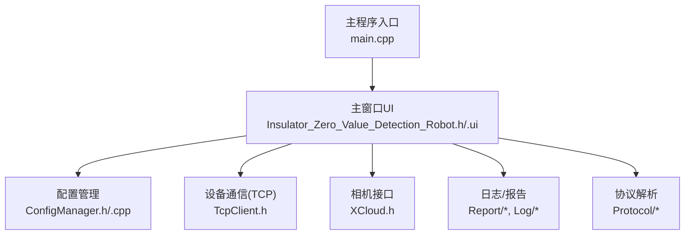
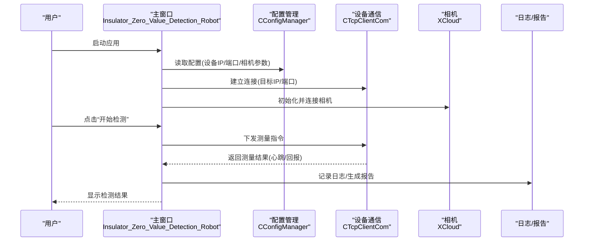
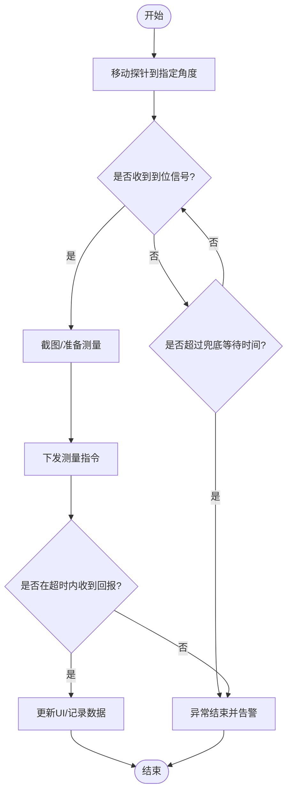
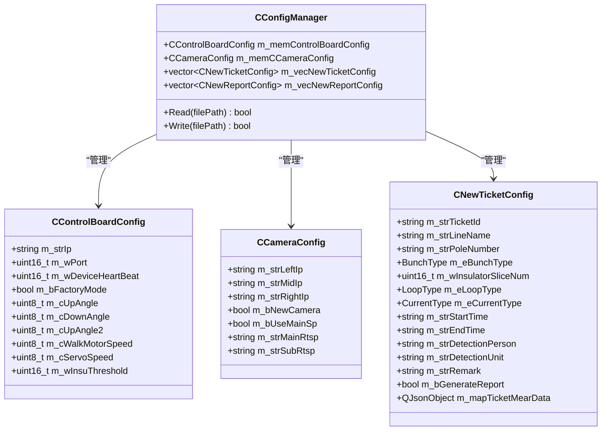
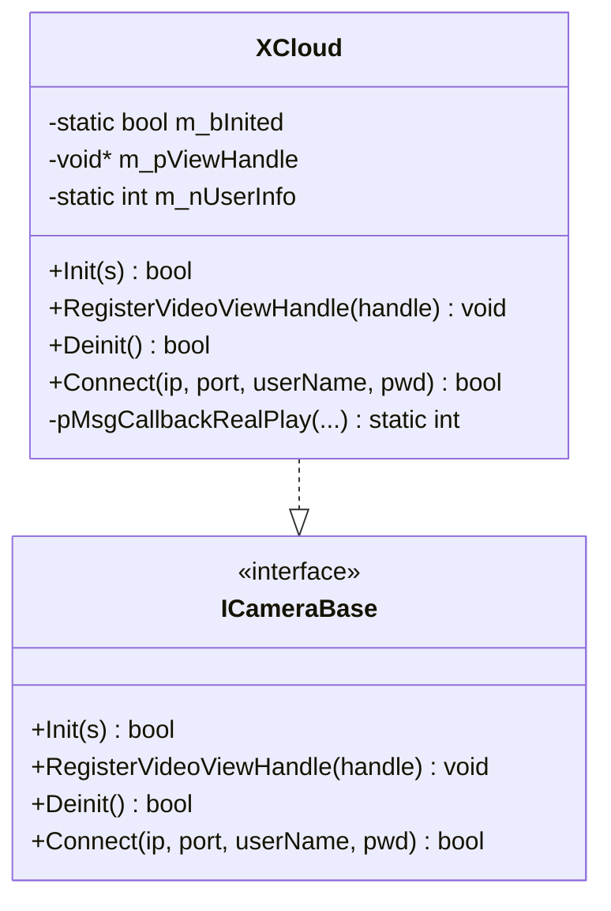

# 快速开始

<cite>
**本文引用的文件**
- [README.md](file://README.md)
- [Insulator_Zero_Value_Detection_Robot.sln](file://Insulator_Zero_Value_Detection_Robot.sln)
- [Insulator_Zero_Value_Detection_Robot.vcxproj](file://Insulator_Zero_Value_Detection_Robot/Insulator_Zero_Value_Detection_Robot.vcxproj)
- [main.cpp](file://Insulator_Zero_Value_Detection_Robot/main.cpp)
- [Insulator_Zero_Value_Detection_Robot.h](file://Insulator_Zero_Value_Detection_Robot/UI/Insulator_Zero_Value_Detection_Robot.h)
- [ConfigManager.h](file://Insulator_Zero_Value_Detection_Robot/Config/ConfigManager.h)
- [ConfigManager.cpp](file://Insulator_Zero_Value_Detection_Robot/Config/ConfigManager.cpp)
- [TcpClient.h](file://Insulator_Zero_Value_Detection_Robot/DeviceCom/TcpClient.h)
- [XCloud.h](file://Insulator_Zero_Value_Detection_Robot/Camera/XCloud.h)
- [Insulator_Zero_Value_Detection_Robot.ui](file://Insulator_Zero_Value_Detection_Robot/UI/Insulator_Zero_Value_Detection_Robot.ui)
</cite>

## 目录
1. [简介](#简介)
2. [项目结构](#项目结构)
3. [核心组件](#核心组件)
4. [架构总览](#架构总览)
5. [详细组件分析](#详细组件分析)
6. [依赖与编译配置](#依赖与编译配置)
7. [首次运行与设备连接](#首次运行与设备连接)
8. [常见问题与故障排除](#常见问题与故障排除)
9. [基本操作示例](#基本操作示例)
10. [结论](#结论)

## 简介
本项目为“绝缘子零值检测机器人V2”的桌面端软件，提供实时检测、工单管理、报告生成等功能，并通过TCP协议与下位机控制板通信，结合摄像头采集图像进行绝缘子零值检测。本快速开始指南将帮助你从零搭建开发环境、完成编译、配置参数并首次运行软件，同时给出常见问题的排查方法。

**章节来源**
- [README.md:1-3](file://README.md#L1-L3)

## 项目结构
- UI界面层：基于Qt Widgets构建主窗口与交互页面，包含实时检测、工单管理、报告管理等模块。
- 设备通信层：通过TCP客户端与下位机控制板通信，实现心跳、指令下发与数据上报。
- 相机采集层：封装不同相机SDK（如XCloud）以统一接入视频流。
- 配置管理：使用XML配置文件集中管理设备IP、端口、相机参数、阈值等。
- 日志与报告：记录运行日志，支持导出Word格式的检测报告。
- 工具与协议：通用工具函数与下位机协议解析。



**图表来源**
- [main.cpp:11-23](file://Insulator_Zero_Value_Detection_Robot/main.cpp#L11-L23)
- [Insulator_Zero_Value_Detection_Robot.h:26-384](file://Insulator_Zero_Value_Detection_Robot/UI/Insulator_Zero_Value_Detection_Robot.h#L26-L384)
- [ConfigManager.cpp:16-200](file://Insulator_Zero_Value_Detection_Robot/Config/ConfigManager.cpp#L16-L200)
- [TcpClient.h:8-46](file://Insulator_Zero_Value_Detection_Robot/DeviceCom/TcpClient.h#L8-L46)
- [XCloud.h:6-33](file://Insulator_Zero_Value_Detection_Robot/Camera/XCloud.h#L6-L33)

**章节来源**
- [Insulator_Zero_Value_Detection_Robot.ui:1-200](file://Insulator_Zero_Value_Detection_Robot/UI/Insulator_Zero_Value_Detection_Robot.ui#L1-L200)

## 核心组件
- 主窗口与业务编排：负责界面展示、用户交互、流程控制（测量、定标、截图、录像、告警）。
- 配置管理器：读取/写入XML配置，包括控制板IP、端口、心跳间隔、探针角度、电机/舵机速度、绝缘阈值、相机IP与码流等。
- 设备通信：TCP客户端，维护连接状态、发送/接收线程、回调通知。
- 相机抽象：统一接口对接不同相机SDK，支持注册视图句柄、连接、初始化与反初始化。
- 协议与日志：解析下位机协议帧，记录运行日志，辅助定位问题。
- 报告生成：基于模板生成Word检测报告。

**章节来源**
- [Insulator_Zero_Value_Detection_Robot.h:26-384](file://Insulator_Zero_Value_Detection_Robot/UI/Insulator_Zero_Value_Detection_Robot.h#L26-L384)
- [ConfigManager.h:10-199](file://Insulator_Zero_Value_Detection_Robot/Config/ConfigManager.h#L10-L199)
- [ConfigManager.cpp:16-200](file://Insulator_Zero_Value_Detection_Robot/Config/ConfigManager.cpp#L16-L200)
- [TcpClient.h:8-46](file://Insulator_Zero_Value_Detection_Robot/DeviceCom/TcpClient.h#L8-L46)
- [XCloud.h:6-33](file://Insulator_Zero_Value_Detection_Robot/Camera/XCloud.h#L6-L33)

## 架构总览
系统采用分层架构：UI层调用业务逻辑，业务逻辑协调配置、通信、相机、协议与日志，最终驱动硬件执行检测任务。



**图表来源**
- [main.cpp:11-23](file://Insulator_Zero_Value_Detection_Robot/main.cpp#L11-L23)
- [ConfigManager.cpp:16-200](file://Insulator_Zero_Value_Detection_Robot/Config/ConfigManager.cpp#L16-L200)
- [TcpClient.h:8-46](file://Insulator_Zero_Value_Detection_Robot/DeviceCom/TcpClient.h#L8-L46)
- [XCloud.h:6-33](file://Insulator_Zero_Value_Detection_Robot/Camera/XCloud.h#L6-L33)

## 详细组件分析

### 主窗口与业务流程
- 职责：初始化UI、绑定动作、处理定时器、管理测量流程状态机、处理校准流程、截图/录像、告警提示、工单与报告管理。
- 关键流程：
  - 探针到位轮询：周期检查是否收到到位信号或超过兜底等待时间，触发一次测量。
  - 测量超时保护：发出测量指令后若未在超时时间内收到回报，自动结束并告警。
  - 校准流程：恢复默认→测原始值→下发定标→验证→读回系数/离线抽查。



**图表来源**
- [Insulator_Zero_Value_Detection_Robot.h:99-127](file://Insulator_Zero_Value_Detection_Robot/UI/Insulator_Zero_Value_Detection_Robot.h#L99-L127)
- [Insulator_Zero_Value_Detection_Robot.h:188-197](file://Insulator_Zero_Value_Detection_Robot/UI/Insulator_Zero_Value_Detection_Robot.h#L188-L197)
- [Insulator_Zero_Value_Detection_Robot.h:315-374](file://Insulator_Zero_Value_Detection_Robot/UI/Insulator_Zero_Value_Detection_Robot.h#L315-L374)

**章节来源**
- [Insulator_Zero_Value_Detection_Robot.h:26-384](file://Insulator_Zero_Value_Detection_Robot/UI/Insulator_Zero_Value_Detection_Robot.h#L26-L384)

### 配置管理
- 读取XML配置项：控制板IP/端口/心跳间隔/工厂模式/探针角度/电机与舵机速度/绝缘阈值；相机左右中IP、是否新款相机、主/子码流URL等。
- 工单与报告配置：线路名称、杆塔号、串数类型、回路数、交直流类型、起止时间、检测人员与单位等。



**图表来源**
- [ConfigManager.h:10-199](file://Insulator_Zero_Value_Detection_Robot/Config/ConfigManager.h#L10-L199)

**章节来源**
- [ConfigManager.cpp:16-200](file://Insulator_Zero_Value_Detection_Robot/Config/ConfigManager.cpp#L16-L200)

### 设备通信（TCP）
- 功能：设置目标IP/端口、注册读写回调、连接/断开、发送/接收线程、连接状态回调。
- 关键点：多线程安全（队列+互斥量+条件变量），避免阻塞UI；连接失败时及时回调通知上层。

```mermaid
classDiagram
class IDeviceCom {
<<interface>>
+SetParam(pComName, nComPort) void
+RegisterReadDataCallBack(f) void
+RegisterConnectStatusCallBack(f) void
+Write(data, len) bool
+BeginWork() bool
+EndWork() bool
}
class CTcpClientCom {
-string m_strTargetIp
-uint16_t m_wTargetPort
-uint64_t m_socket
-atomic<bool> m_running
-atomic<bool> m_connected
-thread m_connectionThread
-thread m_receiveThread
-thread m_sendThread
-queue<vector<uint8_t>> m_sendQueue
-mutex m_sendQueueMutex
-condition_variable m_sendQueueCV
-function<void(bool,int)> m_connectCallback
-function<void(uint8_t*,int,uint64_t)> m_function_ReadDataCallBack
+SetParam(pComName, nComPort) void
+RegisterReadDataCallBack(f) void
+RegisterConnectStatusCallBack(f) void
+Write(data, len) bool
+BeginWork() bool
+EndWork() bool
-ConnectionThread() void
-Connect() void
-CloseSocket() void
-SetConnected(b) void
-SendThread() void
-ReceiveThread() void
}
CTcpClientCom ..|> IDeviceCom
```

**图表来源**
- [TcpClient.h:8-46](file://Insulator_Zero_Value_Detection_Robot/DeviceCom/TcpClient.h#L8-L46)

**章节来源**
- [TcpClient.h:8-46](file://Insulator_Zero_Value_Detection_Robot/DeviceCom/TcpClient.h#L8-L46)

### 相机抽象（XCloud）
- 功能：初始化、注册视图句柄、反初始化、连接（IP/端口/用户名/密码）。
- 设计：继承统一相机接口，屏蔽底层SDK差异，便于扩展其他相机。



**图表来源**
- [XCloud.h:6-33](file://Insulator_Zero_Value_Detection_Robot/Camera/XCloud.h#L6-L33)

**章节来源**
- [XCloud.h:6-33](file://Insulator_Zero_Value_Detection_Robot/Camera/XCloud.h#L6-L33)

## 依赖与编译配置
- Visual Studio版本：解决方案文件指明Visual Studio 17（对应VS2022），平台工具集v143，Windows SDK 10.0。
- Qt框架：
  - Debug配置：Qt 6.9.1_msvc2022_64，模块core;gui;widgets。
  - Release配置：Qt 6.10_msvc2022_64，模块core;gui;widgets;charts。
- OpenCV：Release配置包含OpenCV头文件与库路径，链接opencv_world4120.lib。
- 第三方库：XCloud SDK（头文件与库路径在Release配置中）。
- 输出目录：Release模式下输出至RunDir。

操作步骤（在Visual Studio中）：
1. 安装Visual Studio 2022（含C++桌面开发工作负载）。
2. 安装Qt 6.9.1与6.10（MSVC 2022 x64版本），并在Qt VS Tools中注册Kit。
3. 安装OpenCV 4.12（x64），确保include与lib路径可用。
4. 安装XCloud SDK（按厂商说明），确保include与lib路径可用。
5. 打开解决方案文件Insulator_Zero_Value_Detection_Robot.sln。
6. 选择Release|x64配置，重建解决方案。
7. 若出现找不到QtMsBuild或库路径错误，请检查vcxproj中的QtInstall、AdditionalIncludeDirectories、AdditionalLibraryDirectories与AdditionalDependencies。

**章节来源**
- [Insulator_Zero_Value_Detection_Robot.sln:2-17](file://Insulator_Zero_Value_Detection_Robot.sln#L2-L17)
- [Insulator_Zero_Value_Detection_Robot.vcxproj:13-75](file://Insulator_Zero_Value_Detection_Robot/Insulator_Zero_Value_Detection_Robot.vcxproj#L13-L75)

## 首次运行与设备连接
- 准备配置文件：
  - 创建或编辑XML配置文件，包含DeviceControlBoard与Camera节点，填写控制板IP、端口、心跳间隔、探针角度、电机/舵机速度、绝缘阈值；相机左右中IP、是否新款相机、主/子码流URL等。
  - 参考配置读取逻辑，确保字段名与层级正确。
- 启动应用：
  - 双击运行RunDir下的可执行程序，或通过Visual Studio调试运行。
  - 应用启动时会加载配置，初始化UI。
- 设备连接：
  - 在主界面设置控制板IP与端口，点击连接按钮建立TCP连接。
  - 连接成功后，心跳正常则可在界面看到设备状态。
- 相机连接：
  - 在相机设置中输入相机IP、端口、用户名与密码，点击连接。
  - 如需使用主码流或子码流，根据配置切换。
- 参数配置：
  - 在设置界面调整探针角度、电机速度、舵机速度、绝缘阈值等，保存后重启或热生效（依实现）。
- 首次检测：
  - 新建工单，选择线路、杆塔、串数、回路数、交直流类型等。
  - 点击“开始检测”，观察探针移动、到位、测量结果与告警信息。

**章节来源**
- [ConfigManager.cpp:16-200](file://Insulator_Zero_Value_Detection_Robot/Config/ConfigManager.cpp#L16-L200)
- [Insulator_Zero_Value_Detection_Robot.h:71-83](file://Insulator_Zero_Value_Detection_Robot/UI/Insulator_Zero_Value_Detection_Robot.h#L71-L83)
- [Insulator_Zero_Value_Detection_Robot.h:142-158](file://Insulator_Zero_Value_Detection_Robot/UI/Insulator_Zero_Value_Detection_Robot.h#L142-L158)

## 常见问题与故障排除
- 无法找到QtMsBuild或Qt模块：
  - 检查Qt安装路径与VS集成是否正确，确认vcxproj中QtInstall与QtModules配置。
- 链接OpenCV或XCloud库失败：
  - 确认Release配置的AdditionalIncludeDirectories与AdditionalLibraryDirectories指向正确的路径。
  - 确认AdditionalDependencies中包含opencv_world4120.lib与XCloudSDK.lib。
- 设备连接失败：
  - 检查控制板IP与端口是否正确，网络连通性是否正常。
  - 查看连接状态回调与日志，确认是否有防火墙拦截。
- 相机无画面：
  - 检查相机IP、端口、用户名与密码是否正确。
  - 确认主/子码流URL有效，必要时切换码流类型。
- 测量超时或结果异常：
  - 检查探针角度与到位信号，确认机械结构正常。
  - 查看告警面板与日志，定位具体步骤失败原因。
- 报告生成失败：
  - 检查模板文件是否存在，路径是否正确。
  - 确认生成的数据完整，无空字段导致模板渲染失败。

**章节来源**
- [Insulator_Zero_Value_Detection_Robot.vcxproj:67-75](file://Insulator_Zero_Value_Detection_Robot/Insulator_Zero_Value_Detection_Robot.vcxproj#L67-L75)
- [TcpClient.h:8-46](file://Insulator_Zero_Value_Detection_Robot/DeviceCom/TcpClient.h#L8-L46)
- [XCloud.h:6-33](file://Insulator_Zero_Value_Detection_Robot/Camera/XCloud.h#L6-L33)
- [Insulator_Zero_Value_Detection_Robot.h:188-197](file://Insulator_Zero_Value_Detection_Robot/UI/Insulator_Zero_Value_Detection_Robot.h#L188-L197)

## 基本操作示例
- 新建工单：
  - 进入“工单管理”，点击“新建工单”，填写线路名称、杆塔号、串数类型、回路数、交直流类型、起止时间、检测人员与单位等信息。
- 开始检测：
  - 选择当前工单，点击“开始检测”，观察探针移动与到位提示。
  - 测量完成后，界面显示各相测量值，支持截图与录像。
- 校准流程（可选）：
  - 进入校准区域，依次执行恢复默认、测原始值、下发定标、验证、读回系数/离线抽查。
  - 每步完成后查看日志与状态标签，确保校准成功。
- 生成报告：
  - 检测完成后，点击“生成报告”，选择模板与输出路径，生成Word检测报告。
  - 报告包含检测概况、依据与判定方法、方位定义、检测数据等。

**章节来源**
- [Insulator_Zero_Value_Detection_Robot.h:108-127](file://Insulator_Zero_Value_Detection_Robot/UI/Insulator_Zero_Value_Detection_Robot.h#L108-L127)
- [Insulator_Zero_Value_Detection_Robot.h:165-186](file://Insulator_Zero_Value_Detection_Robot/UI/Insulator_Zero_Value_Detection_Robot.h#L165-L186)
- [Insulator_Zero_Value_Detection_Robot.ui:1-200](file://Insulator_Zero_Value_Detection_Robot/UI/Insulator_Zero_Value_Detection_Robot.ui#L1-L200)

## 结论
通过本快速开始指南，你已了解项目的整体架构、核心组件、依赖与编译配置、首次运行步骤以及常见问题处理方法。建议在实际使用前先完成环境与配置校验，再进行设备连接与检测操作。如遇复杂问题，可结合日志与协议文档进一步定位。祝使用顺利！