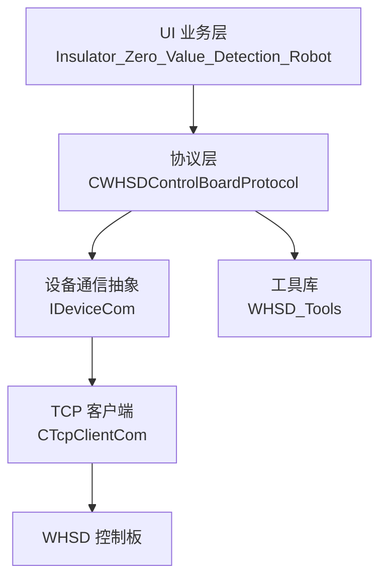
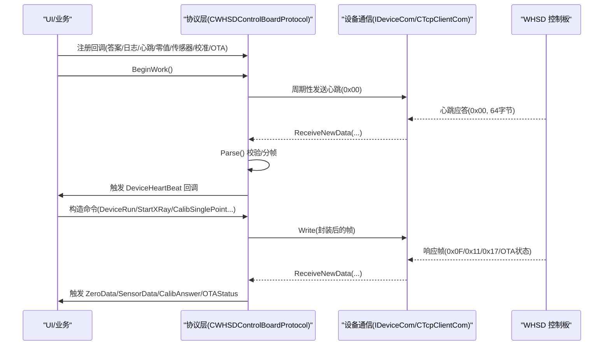
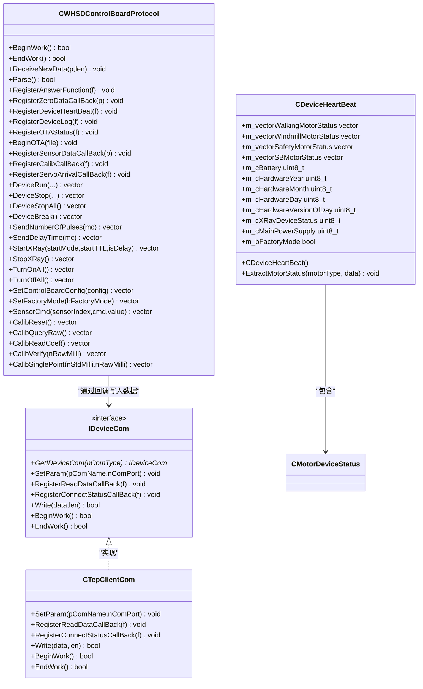
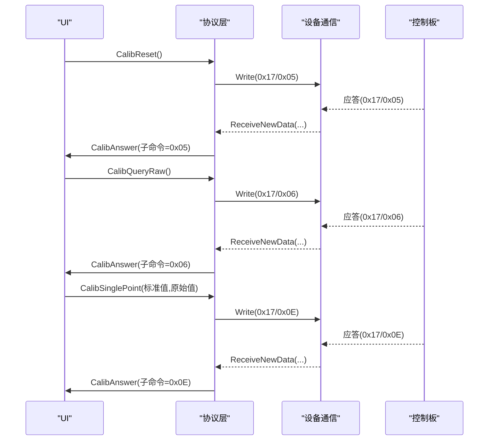
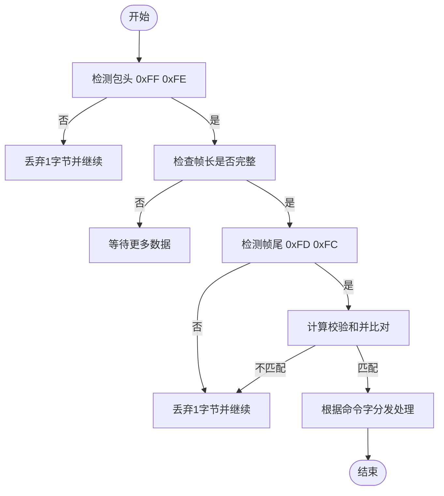
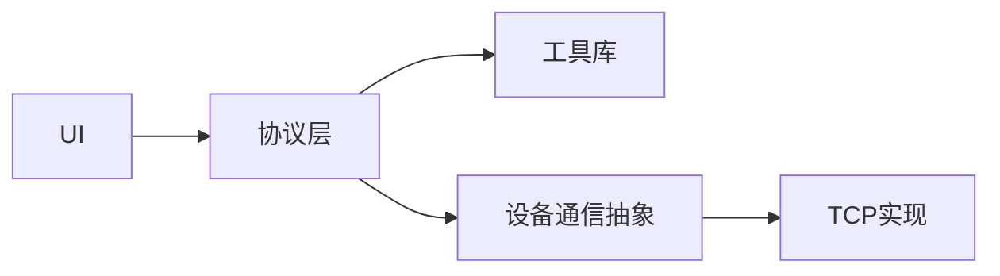

# 协议处理模块

<cite>
**本文引用的文件**
- [WHSDControlBoradProtocol.h](file://Insulator_Zero_Value_Detection_Robot/Protocol/WHSDControlBoradProtocol.h)
- [WHSDControlBoradProtocol.cpp](file://Insulator_Zero_Value_Detection_Robot/Protocol/WHSDControlBoradProtocol.cpp)
- [IDeviceCom.h](file://Insulator_Zero_Value_Detection_Robot/DeviceCom/IDeviceCom.h)
- [IDeviceCom.cpp](file://Insulator_Zero_Value_Detection_Robot/DeviceCom/IDeviceCom.cpp)
- [TcpClient.h](file://Insulator_Zero_Value_Detection_Robot/DeviceCom/TcpClient.h)
- [Tools.h](file://Insulator_Zero_Value_Detection_Robot/Tools/Tools.h)
- [Insulator_Zero_Value_Detection_Robot.h](file://Insulator_Zero_Value_Detection_Robot/UI/Insulator_Zero_Value_Detection_Robot.h)
- [Insulator_Zero_Value_Detection_Robot.cpp](file://Insulator_Zero_Value_Detection_Robot/UI/Insulator_Zero_Value_Detection_Robot.cpp)
</cite>

## 更新摘要
**变更内容**
- 更新了设备心跳数据结构的安全初始化机制
- 增强了总电源状态的默认安全策略
- 改进了首次心跳前的状态管理逻辑

## 目录
1. [简介](#简介)
2. [项目结构](#项目结构)
3. [核心组件](#核心组件)
4. [架构总览](#架构总览)
5. [详细组件分析](#详细组件分析)
6. [依赖关系分析](#依赖关系分析)
7. [性能与可靠性](#性能与可靠性)
8. [故障排查指南](#故障排查指南)
9. [结论](#结论)
10. [附录：命令与帧格式速查](#附录命令与帧格式速查)

## 简介
本模块实现 WHSD 控制板通信协议，负责命令封装、数据解析、响应分发、心跳机制、OTA 升级以及传感器/校准数据的回调。通过统一的接口与设备通信层（TCP）协作，向上层 UI 和业务逻辑提供稳定可靠的控制与数据采集能力。

## 项目结构
协议处理位于 Protocol 目录，核心类为 CWHSDControlBoardProtocol；设备通信抽象在 DeviceCom 目录，具体实现为 TCP 客户端；工具函数在 Tools 目录；UI 层负责注册回调并驱动业务流程。

**图表来源**
- [WHSDControlBoradProtocol.cpp:199-211](file://Insulator_Zero_Value_Detection_Robot/Protocol/WHSDControlBoradProtocol.cpp#L199-L211)
- [IDeviceCom.cpp:4-12](file://Insulator_Zero_Value_Detection_Robot/DeviceCom/IDeviceCom.cpp#L4-L12)
- [TcpClient.h:8-46](file://Insulator_Zero_Value_Detection_Robot/DeviceCom/TcpClient.h#L8-L46)
- [Insulator_Zero_Value_Detection_Robot.cpp:277-290](file://Insulator_Zero_Value_Detection_Robot/UI/Insulator_Zero_Value_Detection_Robot.cpp#L277-L290)

**章节来源**
- [WHSDControlBoradProtocol.h:189-356](file://Insulator_Zero_Value_Detection_Robot/Protocol/WHSDControlBoradProtocol.h#L189-L356)
- [WHSDControlBoradProtocol.cpp:1-843](file://Insulator_Zero_Value_Detection_Robot/Protocol/WHSDControlBoradProtocol.cpp#L1-L843)
- [IDeviceCom.h:4-15](file://Insulator_Zero_Value_Detection_Robot/DeviceCom/IDeviceCom.h#L4-L15)
- [TcpClient.h:8-46](file://Insulator_Zero_Value_Detection_Robot/DeviceCom/TcpClient.h#L8-L46)
- [Insulator_Zero_Value_Detection_Robot.h:12-16](file://Insulator_Zero_Value_Detection_Robot/UI/Insulator_Zero_Value_Detection_Robot.h#L12-L16)

## 核心组件
- 协议主类：CWHSDControlBoardProtocol
  - 负责帧组装/解析、校验、命令发送、心跳线程、OTA 流程、各类回调分发。
- 数据结构
  - CSensorData：传感器指令反馈数据。
  - CCalibAnswer：校准命令应答数据（子命令、结果、原因、参数1/2）。
  - CControlBoardProtocolConfig：控制板配置参数集合。
  - CMotorDeviceStatus / CDeviceHeartBeat：心跳中的电机状态与设备信息。
- 设备通信抽象：IDeviceCom（工厂方法 GetIDeviceCom），具体实现 CTcpClientCom。
- 工具库：WHSD_Tools（分包 SplitVectorData、位操作宏等）。

**章节来源**
- [WHSDControlBoradProtocol.h:7-187](file://Insulator_Zero_Value_Detection_Robot/Protocol/WHSDControlBoradProtocol.h#L7-L187)
- [WHSDControlBoradProtocol.cpp:14-177](file://Insulator_Zero_Value_Detection_Robot/Protocol/WHSDControlBoradProtocol.cpp#L14-L177)
- [IDeviceCom.h:4-15](file://Insulator_Zero_Value_Detection_Robot/DeviceCom/IDeviceCom.h#L4-L15)
- [Tools.h:5-78](file://Insulator_Zero_Value_Detection_Robot/Tools/Tools.h#L5-L78)

## 架构总览
协议层以"接收数据 -> 解析 -> 分发"为主线，配合"定时心跳 -> 设备状态上报"的双向通道。上层通过回调注册将协议事件映射到 UI 或业务逻辑。

**图表来源**
- [WHSDControlBoradProtocol.cpp:199-211](file://Insulator_Zero_Value_Detection_Robot/Protocol/WHSDControlBoradProtocol.cpp#L199-L211)
- [WHSDControlBoradProtocol.cpp:213-444](file://Insulator_Zero_Value_Detection_Robot/Protocol/WHSDControlBoradProtocol.cpp#L213-L444)
- [WHSDControlBoradProtocol.cpp:769-802](file://Insulator_Zero_Value_Detection_Robot/Protocol/WHSDControlBoradProtocol.cpp#L769-L802)
- [Insulator_Zero_Value_Detection_Robot.cpp:277-290](file://Insulator_Zero_Value_Detection_Robot/UI/Insulator_Zero_Value_Detection_Robot.cpp#L277-L290)

## 详细组件分析

### 协议帧格式与校验
- 帧头：固定 0xFF 0xFE
- 长度：第3字节表示整帧长度
- 包序号：第4字节递增（全局静态变量 cPackNumber）
- 命令字：第5字节
- 数据域：命令相关参数
- 校验和：倒数第3字节，前 N-3 字节之和
- 帧尾：0xFD 0xFC

解析流程要点：
- 查找包头后判断是否完整帧，再校验帧尾与校验和。
- 成功解析后提取命令字和数据域，进入分发分支。
- 失败时按错误位置清理缓冲区，避免粘包/半包影响后续解析。

**章节来源**
- [WHSDControlBoradProtocol.cpp:228-444](file://Insulator_Zero_Value_Detection_Robot/Protocol/WHSDControlBoradProtocol.cpp#L228-L444)
- [WHSDControlBoradProtocol.cpp:654-677](file://Insulator_Zero_Value_Detection_Robot/Protocol/WHSDControlBoradProtocol.cpp#L654-L677)

### 命令封装与发送
- 统一封装函数：GetCmdData(cmd, cmdData)，自动填充头、长度、序号、命令、数据、校验和、尾。
- 常用命令封装：
  - 电机控制：DeviceRun/DeviceStop/DeviceStopAll/DeviceBreak
  - X射线控制：StartXRay/StopXRay
  - 全开/全关：TurnOnAll/TurnOffAll
  - 配置下发：SetControlBoardConfig
  - 工厂模式：SetFactoryMode
  - 传感器指令：SensorCmd
  - 校准命令：CalibReset/CalibQueryRaw/CalibReadCoef/CalibVerify/CalibSinglePoint

注意：
- 多字节整数一律大端（高位在前），X值与校准参数为有符号 int32 毫值。
- 单点定标要求数据域正好8字节（标准值+原始值），否则下位机返回失败。

**章节来源**
- [WHSDControlBoradProtocol.cpp:488-616](file://Insulator_Zero_Value_Detection_Robot/Protocol/WHSDControlBoradProtocol.cpp#L488-L616)
- [WHSDControlBoradProtocol.cpp:562-580](file://Insulator_Zero_Value_Detection_Robot/Protocol/WHSDControlBoradProtocol.cpp#L562-L580)

### 数据解析与响应处理
- 心跳（0x00）：解析出各电机组状态、电池、固件日期、X射线状态、总电源、工厂模式，调用 DeviceHeartBeat 回调。
- 日志（0x07）：透传字符串日志，调用 WriteLog 回调。
- OTA 状态（0x0A/0x0B/0x0C）：进入/推进/结束 OTA 流程，更新内部状态并回调进度。
- 测量结果（0x0F）：从数据域读取 int32 毫值，转换为 float 毫值/1000，回调 ZeroData。
- 传感器反馈（0x11）：解析传感器索引、命令、数值，回调 SensorData。
- 校准应答（0x17）：解析子命令、结果、原因、参数1/2，回调 CalibAnswer。

**章节来源**
- [WHSDControlBoradProtocol.cpp:260-428](file://Insulator_Zero_Value_Detection_Robot/Protocol/WHSDControlBoradProtocol.cpp#L260-L428)
- [WHSDControlBoradProtocol.cpp:784-802](file://Insulator_Zero_Value_Detection_Robot/Protocol/WHSDControlBoradProtocol.cpp#L784-L802)

### 心跳机制、超时与异常恢复

**更新** 增强了设备心跳的安全初始化机制，确保在首次心跳消息到达前系统处于安全的默认状态。

- 心跳线程：每 wHeartBeatTime 毫秒发送一次心跳帧（0x00），支持暂停（OTA 期间）。
- 心跳解析：收到 64 字节心跳后，解析电机状态与设备信息，并通过回调通知上层。
- **安全初始化**：CDeviceHeartBeat 构造函数中将总电源状态 m_cMainPowerSupply 初始化为 0（关闭），防止在未收到首次心跳前读取未初始化的不确定值。
- 超时与异常：
  - OTA 过程中若多次无响应，设置错误状态并退出循环。
  - 解析失败时清理缓冲区，防止错位累积。
  - 默认安全策略：首帧心跳前，总电源视为关闭，避免误判。

**章节来源**
- [WHSDControlBoradProtocol.cpp:199-211](file://Insulator_Zero_Value_Detection_Robot/Protocol/WHSDControlBoradProtocol.cpp#L199-L211)
- [WHSDControlBoradProtocol.cpp:123-137](file://Insulator_Zero_Value_Detection_Robot/Protocol/WHSDControlBoradProtocol.cpp#L123-L137)
- [WHSDControlBoradProtocol.cpp:679-759](file://Insulator_Zero_Value_Detection_Robot/Protocol/WHSDControlBoradProtocol.cpp#L679-L759)
- [WHSDControlBoradProtocol.cpp:769-802](file://Insulator_Zero_Value_Detection_Robot/Protocol/WHSDControlBoradProtocol.cpp#L769-L802)

### OTA 升级流程
- 启动：BeginOTA(file)，拆分文件为固定长度包，进入状态机。
- 状态机：
  - 状态1：通知设备进入 OTA（0x0A），等待确认。
  - 状态2：逐包发送（0x0B），携带包序号与数据块，计算校验和。
  - 状态3：完成，发送结束命令（0x0C）。
- 错误处理：连续无响应超过阈值则置错并退出。
- 回调：实时上报进度与状态。

**章节来源**
- [WHSDControlBoradProtocol.cpp:471-476](file://Insulator_Zero_Value_Detection_Robot/Protocol/WHSDControlBoradProtocol.cpp#L471-L476)
- [WHSDControlBoradProtocol.cpp:679-759](file://Insulator_Zero_Value_Detection_Robot/Protocol/WHSDControlBoradProtocol.cpp#L679-L759)

### 与设备通信模块的协作
- 协议层通过 RegisterAnswerFunction 将"需要发送的数据"交给 IDeviceCom::Write 实际写出。
- 设备通信层（TCP）负责连接、收发线程、队列缓冲与重连。
- UI 层在初始化时绑定协议与通信层，并启动工作。

**章节来源**
- [WHSDControlBoradProtocol.cpp:631-667](file://Insulator_Zero_Value_Detection_Robot/Protocol/WHSDControlBoradProtocol.cpp#L631-L667)
- [IDeviceCom.h:4-15](file://Insulator_Zero_Value_Detection_Robot/DeviceCom/IDeviceCom.h#L4-L15)
- [TcpClient.h:8-46](file://Insulator_Zero_Value_Detection_Robot/DeviceCom/TcpClient.h#L8-L46)
- [Insulator_Zero_Value_Detection_Robot.cpp:277-290](file://Insulator_Zero_Value_Detection_Robot/UI/Insulator_Zero_Value_Detection_Robot.cpp#L277-L290)

### 类图（代码级）

**图表来源**
- [WHSDControlBoradProtocol.h:189-356](file://Insulator_Zero_Value_Detection_Robot/Protocol/WHSDControlBoradProtocol.h#L189-L356)
- [WHSDControlBoradProtocol.h:156-222](file://Insulator_Zero_Value_Detection_Robot/Protocol/WHSDControlBoradProtocol.h#L156-L222)
- [IDeviceCom.h:4-15](file://Insulator_Zero_Value_Detection_Robot/DeviceCom/IDeviceCom.h#L4-L15)
- [TcpClient.h:8-46](file://Insulator_Zero_Value_Detection_Robot/DeviceCom/TcpClient.h#L8-L46)

### 序列图：典型命令交互（单点定标）

**图表来源**
- [WHSDControlBoradProtocol.cpp:582-616](file://Insulator_Zero_Value_Detection_Robot/Protocol/WHSDControlBoradProtocol.cpp#L582-L616)
- [WHSDControlBoradProtocol.cpp:392-418](file://Insulator_Zero_Value_Detection_Robot/Protocol/WHSDControlBoradProtocol.cpp#L392-L418)

### 流程图：解析算法

**图表来源**
- [WHSDControlBoradProtocol.cpp:228-444](file://Insulator_Zero_Value_Detection_Robot/Protocol/WHSDControlBoradProtocol.cpp#L228-L444)

## 依赖关系分析
- 协议层依赖工具库进行分包与位操作。
- 协议层通过 IDeviceCom 抽象与具体 TCP 实现解耦，便于扩展其他传输方式。
- UI 层仅依赖协议层的回调接口，不直接访问底层通信细节。

**图表来源**
- [WHSDControlBoradProtocol.cpp:679-759](file://Insulator_Zero_Value_Detection_Robot/Protocol/WHSDControlBoradProtocol.cpp#L679-L759)
- [Tools.h:55-56](file://Insulator_Zero_Value_Detection_Robot/Tools/Tools.h#L55-L56)
- [IDeviceCom.cpp:4-12](file://Insulator_Zero_Value_Detection_Robot/DeviceCom/IDeviceCom.cpp#L4-L12)

**章节来源**
- [WHSDControlBoradProtocol.cpp:1-843](file://Insulator_Zero_Value_Detection_Robot/Protocol/WHSDControlBoradProtocol.cpp#L1-L843)
- [Tools.h:5-78](file://Insulator_Zero_Value_Detection_Robot/Tools/Tools.h#L5-L78)
- [IDeviceCom.cpp:4-12](file://Insulator_Zero_Value_Detection_Robot/DeviceCom/IDeviceCom.cpp#L4-L12)

## 性能与可靠性
- 解析复杂度：线性扫描缓冲区，遇到完整帧即处理，时间复杂度 O(N)。
- 内存使用：动态缓冲区随数据增长，解析成功后及时释放已消费部分，避免内存泄漏。
- 并发：心跳线程与 OTA 线程独立运行，通过原子标志与条件变量协调。
- 可靠性：
  - 校验和与帧头尾双重保障。
  - 解析失败快速回退，避免状态污染。
  - OTA 错误计数与重试上限，防止死循环。
  - **增强的安全默认态**：首帧心跳前默认电源关闭，保证系统安全性。
  - **安全初始化**：CDeviceHeartBeat 构造函数中总电源状态初始化为0，防止未初始化值导致的误判。

## 故障排查指南
- 无法解析数据：
  - 检查串口/网络是否正确接入，确保 ReceiveNewData 被正确调用。
  - 查看是否有乱码导致包头匹配失败，必要时增加日志输出。
- 心跳未到达：
  - 检查 BeginWork 是否调用，wHeartBeatTime 是否合理。
  - 确认设备侧心跳功能开启且网络连通。
- 校准失败：
  - 确认数据域长度符合要求（单点定标必须8字节）。
  - 检查原始值小于标准值的约束。
  - 关注返回的原因码（如 Flash 写失败、参数非法等）。
- OTA 失败：
  - 观察 OTA 状态回调，定位卡在哪个阶段。
  - 检查错误计数是否达到上限，必要时重启流程。
- **电源状态异常**：
  - 检查首次心跳是否正常到达。
  - 确认 CDeviceHeartBeat 构造函数中的安全初始化逻辑生效。
  - 验证总电源状态在首次心跳前保持为0（关闭）的安全默认值。

**章节来源**
- [WHSDControlBoradProtocol.cpp:228-444](file://Insulator_Zero_Value_Detection_Robot/Protocol/WHSDControlBoradProtocol.cpp#L228-L444)
- [WHSDControlBoradProtocol.cpp:679-759](file://Insulator_Zero_Value_Detection_Robot/Protocol/WHSDControlBoradProtocol.cpp#L679-L759)
- [WHSDControlBoradProtocol.cpp:392-418](file://Insulator_Zero_Value_Detection_Robot/Protocol/WHSDControlBoradProtocol.cpp#L392-L418)
- [WHSDControlBoradProtocol.cpp:123-137](file://Insulator_Zero_Value_Detection_Robot/Protocol/WHSDControlBoradProtocol.cpp#L123-L137)

## 结论
该协议处理模块以清晰的帧格式、严格的校验与健壮的错误恢复机制，实现了与 WHSD 控制板的可靠通信。通过回调机制将协议事件解耦到上层业务，结合心跳与 OTA 能力，满足工业现场对稳定性与可维护性的要求。**最新的增强包括安全初始化机制，确保在首次心跳消息到达前系统处于安全的默认状态，有效防止了未初始化值导致的潜在风险。** 建议在实际部署中完善日志记录与监控指标，以便快速定位问题。

## 附录：命令与帧格式速查
- 帧结构
  - 头：0xFF 0xFE
  - 长度：1字节
  - 序号：1字节
  - 命令：1字节
  - 数据：N字节
  - 校验：1字节（前 N-3 字节之和）
  - 尾：0xFD 0xFC
- 常用命令
  - 0x00：心跳（设备返回64字节状态）
  - 0x01：延时时间设置
  - 0x02：脉冲数设置
  - 0x03：启动X射线
  - 0x04：停止X射线
  - 0x05：电机控制（运行/停止/急停）
  - 0x08：全开/全关
  - 0x09：工厂模式
  - 0x0D：控制板配置
  - 0x0F：测量结果回报（int32 毫值）
  - 0x11：传感器指令反馈
  - 0x17：校准命令应答（子命令/结果/原因/参数1/参数2）
  - 0x0A/0x0B/0x0C：OTA 流程控制
  - 0x1A：舵机到位反馈

**章节来源**
- [WHSDControlBoradProtocol.cpp:488-616](file://Insulator_Zero_Value_Detection_Robot/Protocol/WHSDControlBoradProtocol.cpp#L488-L616)
- [WHSDControlBoradProtocol.cpp:260-428](file://Insulator_Zero_Value_Detection_Robot/Protocol/WHSDControlBoradProtocol.cpp#L260-L428)
- [WHSDControlBoradProtocol.cpp:436-454](file://Insulator_Zero_Value_Detection_Robot/Protocol/WHSDControlBoradProtocol.cpp#L436-L454)