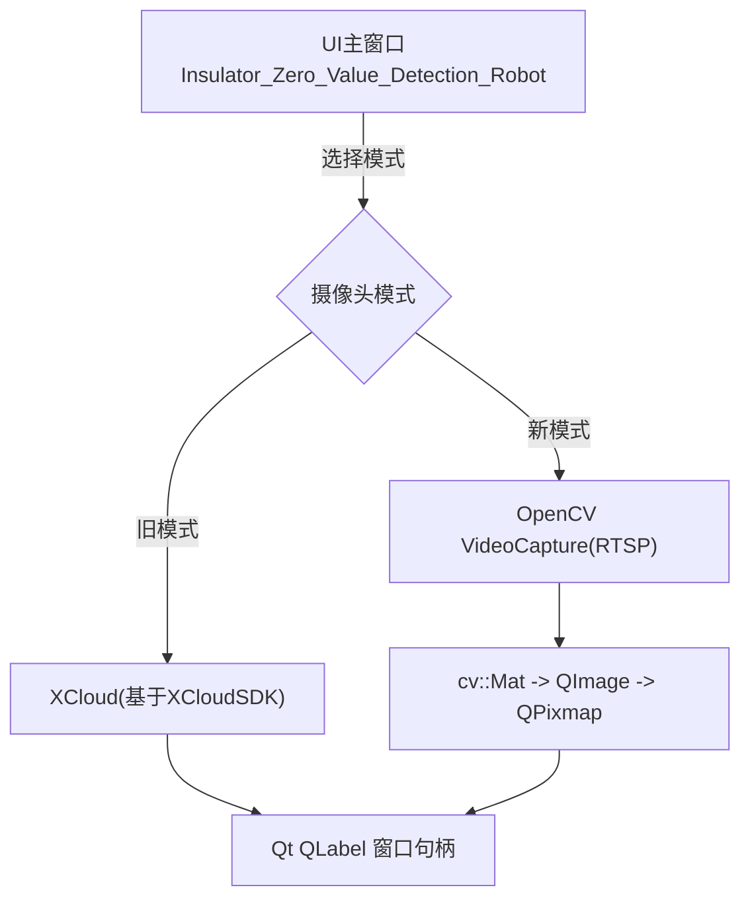
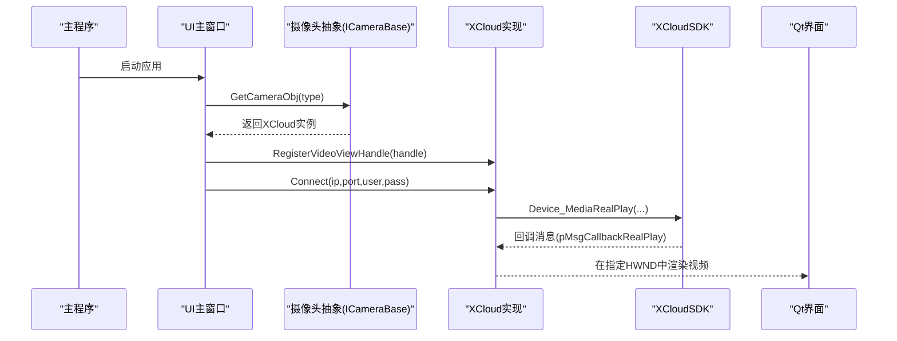
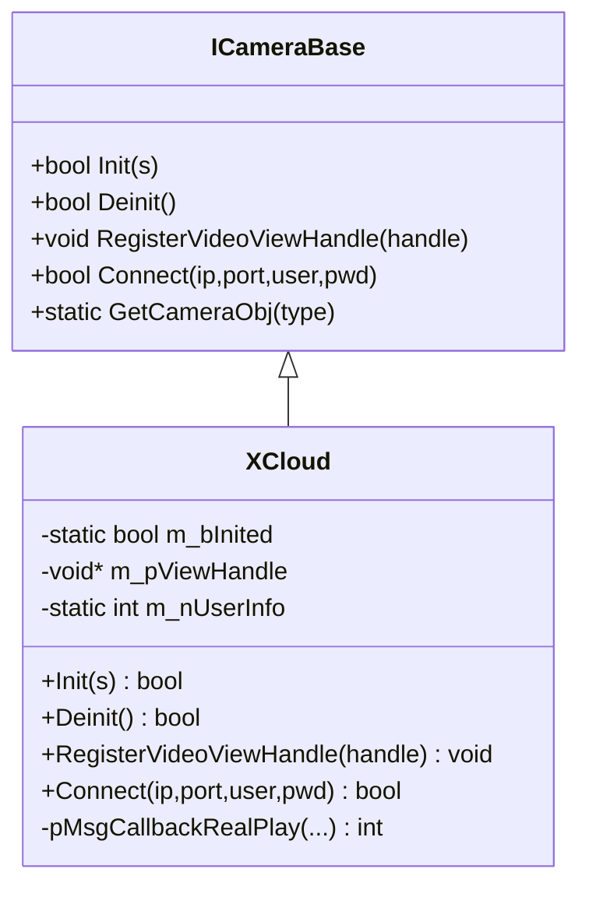
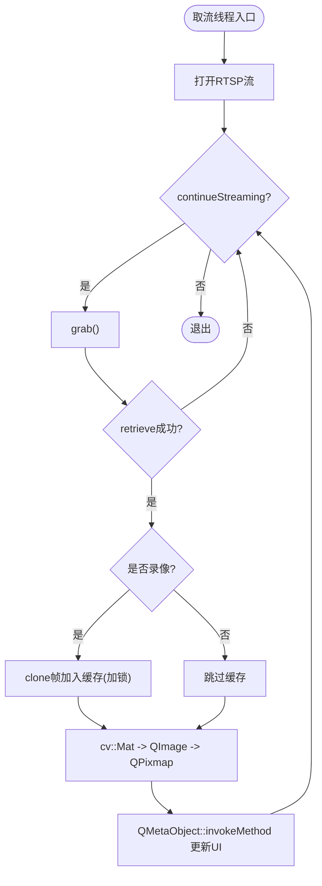
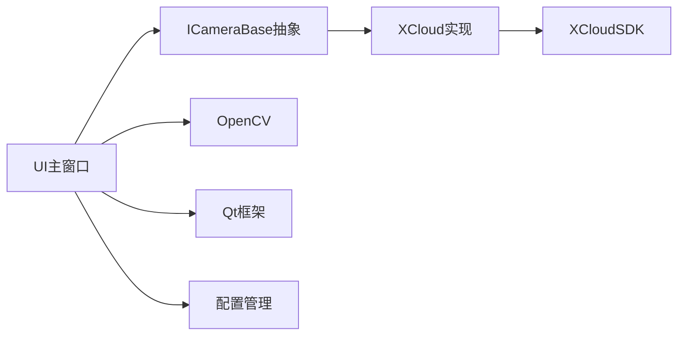

# 摄像头模块

<cite>
**本文引用的文件**
- [CameraBase.h](file://Insulator_Zero_Value_Detection_Robot/Camera/CameraBase.h)
- [CameraBase.cpp](file://Insulator_Zero_Value_Detection_Robot/Camera/CameraBase.cpp)
- [XCloud.h](file://Insulator_Zero_Value_Detection_Robot/Camera/XCloud.h)
- [XCloud.cpp](file://Insulator_Zero_Value_Detection_Robot/Camera/XCloud.cpp)
- [ConfigManager.h](file://Insulator_Zero_Value_Detection_Robot/Config/ConfigManager.h)
- [ConfigManager.cpp](file://Insulator_Zero_Value_Detection_Robot/Config/ConfigManager.cpp)
- [Insulator_Zero_Value_Detection_Robot.h](file://Insulator_Zero_Value_Detection_Robot/UI/Insulator_Zero_Value_Detection_Robot.h)
- [Insulator_Zero_Value_Detection_Robot.cpp](file://Insulator_Zero_Value_Detection_Robot/UI/Insulator_Zero_Value_Detection_Robot.cpp)
- [main.cpp](file://Insulator_Zero_Value_Detection_Robot/main.cpp)
</cite>

## 目录
1. [简介](#简介)
2. [项目结构](#项目结构)
3. [核心组件](#核心组件)
4. [架构总览](#架构总览)
5. [详细组件分析](#详细组件分析)
6. [依赖关系分析](#依赖关系分析)
7. [性能与资源管理](#性能与资源管理)
8. [故障排查指南](#故障排查指南)
9. [使用示例与集成指南](#使用示例与集成指南)
10. [结论](#结论)

## 简介
本技术文档聚焦于摄像头模块，围绕抽象接口 ICameraBase 的设计与 XCloud 具体实现展开，系统阐述视频流获取、图像捕获、录制功能的实现机制；说明摄像头设备的初始化、配置与控制方法；解释视频数据的获取、处理与存储流程；并给出异常处理、资源管理与性能优化策略。同时提供与主程序交互方式、事件处理机制以及具体的使用与集成指南。

## 项目结构
摄像头相关代码位于 Camera 目录，包含抽象接口与具体实现：
- CameraBase：定义统一的摄像头抽象接口 ICameraBase，屏蔽底层差异，提供工厂方法 GetCameraObj。
- XCloud：基于 XCloudSDK 的具体实现，负责 SDK 初始化、回调注册、连接与显示窗口句柄绑定。

主程序 UI 层通过两种模式接入摄像头：
- 旧模式（SDK直显）：通过 ICameraBase::Connect 将视频直接渲染到 Qt 控件的窗口句柄。
- 新模式（RTSP+OpenCV）：通过 OpenCV VideoCapture 拉取 RTSP 流，逐帧转换为 QImage 更新 UI，并支持录像缓存与编码。

图表来源
- [Insulator_Zero_Value_Detection_Robot.cpp:292-313](file://Insulator_Zero_Value_Detection_Robot/UI/Insulator_Zero_Value_Detection_Robot.cpp#L292-L313)
- [Insulator_Zero_Value_Detection_Robot.cpp:1371-1440](file://Insulator_Zero_Value_Detection_Robot/UI/Insulator_Zero_Value_Detection_Robot.cpp#L1371-L1440)

章节来源
- [Insulator_Zero_Value_Detection_Robot.h:14-16](file://Insulator_Zero_Value_Detection_Robot/UI/Insulator_Zero_Value_Detection_Robot.h#L14-L16)
- [Insulator_Zero_Value_Detection_Robot.cpp:292-313](file://Insulator_Zero_Value_Detection_Robot/UI/Insulator_Zero_Value_Detection_Robot.cpp#L292-L313)
- [Insulator_Zero_Value_Detection_Robot.cpp:1371-1440](file://Insulator_Zero_Value_Detection_Robot/UI/Insulator_Zero_Value_Detection_Robot.cpp#L1371-L1440)

## 核心组件
- ICameraBase：抽象接口，定义 Init、Deinit、RegisterVideoViewHandle、Connect 等统一能力，并提供静态工厂 GetCameraObj(type)。
- XCloud：实现 ICameraBase，封装 XCloudSDK 的初始化、消息回调注册、设备媒体实时播放（Connect），并将视频渲染到指定窗口句柄。
- 配置管理 CCameraConfig：保存新旧摄像头模式、主/子码流 RTSP 地址、IP 等参数，由 ConfigManager 读写 XML。
- UI 主窗口：根据配置选择摄像头模式，管理视频流线程、截图与录像逻辑，并通过信号槽与协议线程解耦。

章节来源
- [CameraBase.h:5-14](file://Insulator_Zero_Value_Detection_Robot/Camera/CameraBase.h#L5-L14)
- [CameraBase.cpp:8-19](file://Insulator_Zero_Value_Detection_Robot/Camera/CameraBase.cpp#L8-L19)
- [XCloud.h:6-33](file://Insulator_Zero_Value_Detection_Robot/Camera/XCloud.h#L6-L33)
- [XCloud.cpp:18-62](file://Insulator_Zero_Value_Detection_Robot/Camera/XCloud.cpp#L18-L62)
- [ConfigManager.h:26-37](file://Insulator_Zero_Value_Detection_Robot/Config/ConfigManager.h#L26-L37)
- [ConfigManager.cpp:115-130](file://Insulator_Zero_Value_Detection_Robot/Config/ConfigManager.cpp#L115-L130)

## 架构总览
整体采用“抽象接口 + 具体实现”的分层设计，结合 UI 层的模式切换，形成可插拔的摄像头接入方案：
- 抽象层：ICameraBase 定义统一生命周期与连接接口。
- 实现层：XCloud 对接 XCloudSDK，完成设备媒体实时播放与窗口句柄绑定。
- 适配层：UI 主窗口根据配置决定使用 SDK 直显或 RTSP+OpenCV 拉流。
- 数据流：RTSP 模式下，取流线程循环 grab/retrieve，转换后投递到 UI 线程更新显示；录制时缓存帧，停止后异步编码为视频文件。

图表来源
- [CameraBase.cpp:8-19](file://Insulator_Zero_Value_Detection_Robot/Camera/CameraBase.cpp#L8-L19)
- [XCloud.cpp:18-62](file://Insulator_Zero_Value_Detection_Robot/Camera/XCloud.cpp#L18-L62)
- [Insulator_Zero_Value_Detection_Robot.cpp:292-313](file://Insulator_Zero_Value_Detection_Robot/UI/Insulator_Zero_Value_Detection_Robot.cpp#L292-L313)

## 详细组件分析

### ICameraBase 抽象接口
- 职责：定义摄像头通用生命周期与连接能力，屏蔽底层差异。
- 关键方法：
  - Init：初始化底层资源（如 SDK）。
  - Deinit：释放资源，注销回调。
  - RegisterVideoViewHandle：设置视频渲染目标窗口句柄。
  - Connect：建立媒体流连接并开始渲染。
  - GetCameraObj：工厂方法，按类型创建具体实现。
- 设计要点：纯虚接口便于扩展新摄像头实现；静态工厂集中管理对象创建。

章节来源
- [CameraBase.h:5-14](file://Insulator_Zero_Value_Detection_Robot/Camera/CameraBase.h#L5-L14)
- [CameraBase.cpp:8-19](file://Insulator_Zero_Value_Detection_Robot/Camera/CameraBase.cpp#L8-L19)

### XCloud 具体实现
- 职责：封装 XCloudSDK 的初始化、回调注册、设备媒体实时播放。
- 关键成员与方法：
  - m_bInited：全局初始化标志，防止重复初始化。
  - m_nUserInfo：SDK 回调用户信息标识，用于注销。
  - pMsgCallbackRealPlay：SDK 消息回调入口（当前未做业务判断）。
  - Init：调用 XCloudSDK_Init，注册回调，设置初始化标志。
  - Deinit：注销回调并反初始化 SDK。
  - RegisterVideoViewHandle：保存 HWND 以便后续渲染。
  - Connect：调用 XCloudSDK_Device_MediaRealPlay 开始实时播放。
- 错误处理：Init/Connect 失败返回 false；Deinit 保证幂等释放。

图表来源
- [CameraBase.h:5-14](file://Insulator_Zero_Value_Detection_Robot/Camera/CameraBase.h#L5-L14)
- [XCloud.h:6-33](file://Insulator_Zero_Value_Detection_Robot/Camera/XCloud.h#L6-L33)
- [XCloud.cpp:18-69](file://Insulator_Zero_Value_Detection_Robot/Camera/XCloud.cpp#L18-L69)

章节来源
- [XCloud.h:6-33](file://Insulator_Zero_Value_Detection_Robot/Camera/XCloud.h#L6-L33)
- [XCloud.cpp:18-69](file://Insulator_Zero_Value_Detection_Robot/Camera/XCloud.cpp#L18-L69)

### 视频流处理（新模式：RTSP+OpenCV）
- 取流线程：
  - 从配置读取 RTSP 地址（主/子码流），设置低延迟缓冲。
  - 循环 grab/retrieve 获取最新帧，避免阻塞。
  - 若开启录像，将帧 clone 后追加到缓存队列（互斥锁保护）。
  - 将 cv::Mat 转为 QImage/QPixmap，通过 QMetaObject::invokeMethod 安全投递到 UI 线程更新 label。
- UI 线程：
  - 接收帧并缩放显示，保持纵横比与平滑变换。
  - 控制录像状态：开始/停止录像，弹框选择保存路径，异步编码为 AVI(MJPG)。
- 录像编码：
  - 停止录像时，取走缓存帧，计算实际 FPS（时长与帧数反推），限制范围。
  - 后台线程创建 VideoWriter，写入所有帧后释放，并在 UI 线程提示结果。

图表来源
- [Insulator_Zero_Value_Detection_Robot.cpp:1371-1440](file://Insulator_Zero_Value_Detection_Robot/UI/Insulator_Zero_Value_Detection_Robot.cpp#L1371-L1440)
- [Insulator_Zero_Value_Detection_Robot.cpp:1660-1751](file://Insulator_Zero_Value_Detection_Robot/UI/Insulator_Zero_Value_Detection_Robot.cpp#L1660-L1751)

章节来源
- [Insulator_Zero_Value_Detection_Robot.cpp:1371-1440](file://Insulator_Zero_Value_Detection_Robot/UI/Insulator_Zero_Value_Detection_Robot.cpp#L1371-L1440)
- [Insulator_Zero_Value_Detection_Robot.cpp:1660-1751](file://Insulator_Zero_Value_Detection_Robot/UI/Insulator_Zero_Value_Detection_Robot.cpp#L1660-L1751)

### 图像捕获与录制
- 图像捕获：
  - 通过截屏方式捕获当前窗口画面（label_9），生成图片并保存。
- 录制功能：
  - 仅在新模式（RTSP+OpenCV）下可用；旧模式因无法获取 cv::Mat 帧而不支持录像。
  - 录制期间仅缓存帧，不写盘；停止后选择路径并异步编码。
  - 使用互斥锁与原子变量确保跨线程安全。

章节来源
- [Insulator_Zero_Value_Detection_Robot.cpp:1660-1751](file://Insulator_Zero_Value_Detection_Robot/UI/Insulator_Zero_Value_Detection_Robot.cpp#L1660-L1751)

### 设备初始化、配置与控制
- 初始化：
  - 旧模式：通过 ICameraBase::GetCameraObj(0) 创建 XCloud，注册窗口句柄，Connect 开始渲染。
  - 新模式：读取配置中的 RTSP 地址，OpenCV 打开流，启动取流线程。
- 配置：
  - CCameraConfig 保存左右中 IP、新旧模式开关、主/子码流 RTSP 地址。
  - ConfigManager 负责 XML 读写，UI 保存按钮更新配置。
- 控制：
  - 旧模式：Connect 传入 ip/port/user/pwd。
  - 新模式：动态切换主/子码流，调整缓冲大小以降低延迟。

章节来源
- [Insulator_Zero_Value_Detection_Robot.cpp:292-313](file://Insulator_Zero_Value_Detection_Robot/UI/Insulator_Zero_Value_Detection_Robot.cpp#L292-L313)
- [ConfigManager.h:26-37](file://Insulator_Zero_Value_Detection_Robot/Config/ConfigManager.h#L26-L37)
- [ConfigManager.cpp:115-130](file://Insulator_Zero_Value_Detection_Robot/Config/ConfigManager.cpp#L115-L130)

### 事件处理机制
- 协议线程与 UI 线程解耦：
  - 测量结果、心跳等回调在协议线程触发，通过信号槽（QueuedConnection）切到 UI 线程处理。
- 摄像头相关事件：
  - 取流线程通过 QMetaObject::invokeMethod 将帧投递到 UI 线程更新显示。
  - 录像编码完成后，在 UI 线程弹出提示。

章节来源
- [Insulator_Zero_Value_Detection_Robot.cpp:675-753](file://Insulator_Zero_Value_Detection_Robot/UI/Insulator_Zero_Value_Detection_Robot.cpp#L675-L753)
- [Insulator_Zero_Value_Detection_Robot.cpp:1431-1440](file://Insulator_Zero_Value_Detection_Robot/UI/Insulator_Zero_Value_Detection_Robot.cpp#L1431-L1440)
- [Insulator_Zero_Value_Detection_Robot.cpp:1719-1748](file://Insulator_Zero_Value_Detection_Robot/UI/Insulator_Zero_Value_Detection_Robot.cpp#L1719-L1748)

## 依赖关系分析
- 模块耦合：
  - UI 依赖 ICameraBase 抽象，降低对具体实现的耦合。
  - XCloud 依赖 XCloudSDK，封装平台差异。
  - 配置模块独立，提供运行时参数。
- 外部依赖：
  - XCloudSDK：用于旧模式直显。
  - OpenCV：用于新模式 RTSP 拉流与编码。
  - Qt：UI 框架与线程间通信。

图表来源
- [CameraBase.h:5-14](file://Insulator_Zero_Value_Detection_Robot/Camera/CameraBase.h#L5-L14)
- [XCloud.h:6-33](file://Insulator_Zero_Value_Detection_Robot/Camera/XCloud.h#L6-L33)
- [Insulator_Zero_Value_Detection_Robot.cpp:292-313](file://Insulator_Zero_Value_Detection_Robot/UI/Insulator_Zero_Value_Detection_Robot.cpp#L292-L313)
- [Insulator_Zero_Value_Detection_Robot.cpp:1371-1440](file://Insulator_Zero_Value_Detection_Robot/UI/Insulator_Zero_Value_Detection_Robot.cpp#L1371-L1440)

章节来源
- [CameraBase.h:5-14](file://Insulator_Zero_Value_Detection_Robot/Camera/CameraBase.h#L5-L14)
- [XCloud.h:6-33](file://Insulator_Zero_Value_Detection_Robot/Camera/XCloud.h#L6-L33)
- [Insulator_Zero_Value_Detection_Robot.cpp:292-313](file://Insulator_Zero_Value_Detection_Robot/UI/Insulator_Zero_Value_Detection_Robot.cpp#L292-L313)
- [Insulator_Zero_Value_Detection_Robot.cpp:1371-1440](file://Insulator_Zero_Value_Detection_Robot/UI/Insulator_Zero_Value_Detection_Robot.cpp#L1371-L1440)

## 性能与资源管理
- 低延迟取流：
  - 设置 CAP_PROP_BUFFERSIZE=1，减少缓冲带来的延迟。
- 内存与线程安全：
  - 录像帧使用 clone 避免共享缓冲区覆盖；互斥锁保护跨线程读写。
  - 原子变量 m_bRecording 控制录制状态，避免竞态。
- 编码性能：
  - 后台线程编码，避免阻塞 UI；FPS 动态估算并限制范围，提升兼容性。
- 资源释放：
  - XCloud::Deinit 保证注销回调与 SDK 反初始化；析构函数调用 Deinit，确保资源回收。
  - UI 析构时停止取流与录像标志，避免线程继续访问已销毁对象。

章节来源
- [Insulator_Zero_Value_Detection_Robot.cpp:1391-1440](file://Insulator_Zero_Value_Detection_Robot/UI/Insulator_Zero_Value_Detection_Robot.cpp#L1391-L1440)
- [Insulator_Zero_Value_Detection_Robot.cpp:1660-1751](file://Insulator_Zero_Value_Detection_Robot/UI/Insulator_Zero_Value_Detection_Robot.cpp#L1660-L1751)
- [XCloud.cpp:13-51](file://Insulator_Zero_Value_Detection_Robot/Camera/XCloud.cpp#L13-L51)

## 故障排查指南
- 无法打开 RTSP 流：
  - 检查配置中的主/子码流地址是否正确；查看日志输出“打开RTSP流失败”。
  - 确认网络连通性与摄像头服务状态。
- 录像失败：
  - 旧模式不支持录像，需切换到新模式；或检查保存路径权限。
  - 若未捕获到任何画面，检查取流线程是否正常运行。
- SDK 初始化失败：
  - 检查 XCloudSDK_Init 返回值；确认临时路径与配置文件存在且可写。
- 视频无显示：
  - 确认窗口句柄有效；检查 Connect 是否成功；查看回调是否被注册。

章节来源
- [Insulator_Zero_Value_Detection_Robot.cpp:1397-1405](file://Insulator_Zero_Value_Detection_Robot/UI/Insulator_Zero_Value_Detection_Robot.cpp#L1397-L1405)
- [Insulator_Zero_Value_Detection_Robot.cpp:1660-1751](file://Insulator_Zero_Value_Detection_Robot/UI/Insulator_Zero_Value_Detection_Robot.cpp#L1660-L1751)
- [XCloud.cpp:18-35](file://Insulator_Zero_Value_Detection_Robot/Camera/XCloud.cpp#L18-L35)

## 使用示例与集成指南
- 集成步骤（旧模式）：
  1. 通过 ICameraBase::GetCameraObj(0) 获取 XCloud 实例。
  2. 调用 RegisterVideoViewHandle 传入 Qt 控件的 winId。
  3. 调用 Connect 传入摄像头 IP、端口、用户名、密码。
  4. 在应用退出时调用 Deinit 释放资源。
- 集成步骤（新模式）：
  1. 在配置中设置 NewCamera=true，并填写主/子码流 RTSP 地址。
  2. 启动取流线程，循环 grab/retrieve 获取帧。
  3. 将 cv::Mat 转换为 QImage/QPixmap 并更新 UI。
  4. 需要录像时，开启录制标志，停止后选择路径并异步编码。
- 与主程序交互：
  - 通过信号槽将协议线程回调切到 UI 线程处理。
  - 取流线程通过 invokeMethod 更新 UI，避免跨线程直接操作控件。
- 事件处理：
  - 录像开始/停止：切换按钮文本，记录开始时间，异步编码。
  - 截图：捕获当前窗口画面并保存。

章节来源
- [Insulator_Zero_Value_Detection_Robot.cpp:292-313](file://Insulator_Zero_Value_Detection_Robot/UI/Insulator_Zero_Value_Detection_Robot.cpp#L292-L313)
- [Insulator_Zero_Value_Detection_Robot.cpp:1371-1440](file://Insulator_Zero_Value_Detection_Robot/UI/Insulator_Zero_Value_Detection_Robot.cpp#L1371-L1440)
- [Insulator_Zero_Value_Detection_Robot.cpp:1660-1751](file://Insulator_Zero_Value_Detection_Robot/UI/Insulator_Zero_Value_Detection_Robot.cpp#L1660-L1751)

## 结论
摄像头模块通过抽象接口与具体实现分离，提供了灵活的接入方式：旧模式基于 SDK 直显，新模式基于 RTSP+OpenCV 拉流。两者均支持图像捕获与录像（新模式），并通过线程安全机制与异步编码保障性能与稳定性。配置管理使系统易于扩展与维护。建议在生产环境中优先采用新模式以获得更好的可控性与可扩展性，同时完善错误处理与日志记录以提升可维护性。