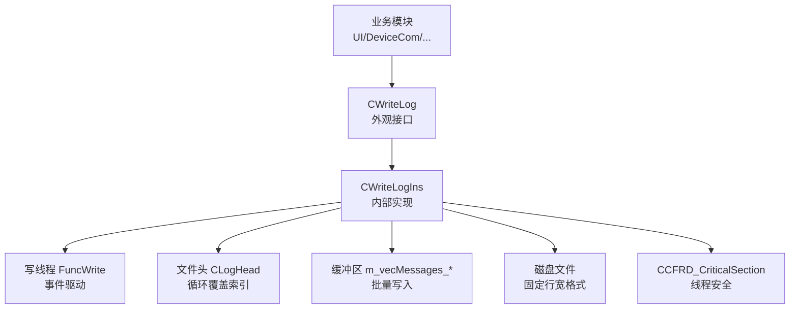
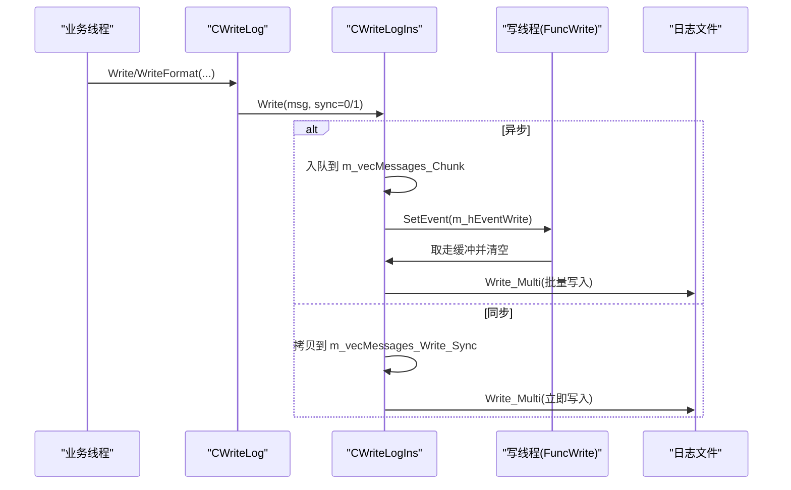
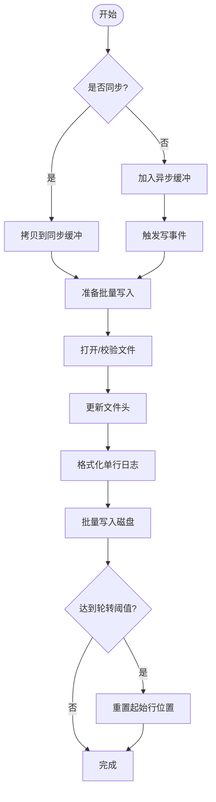
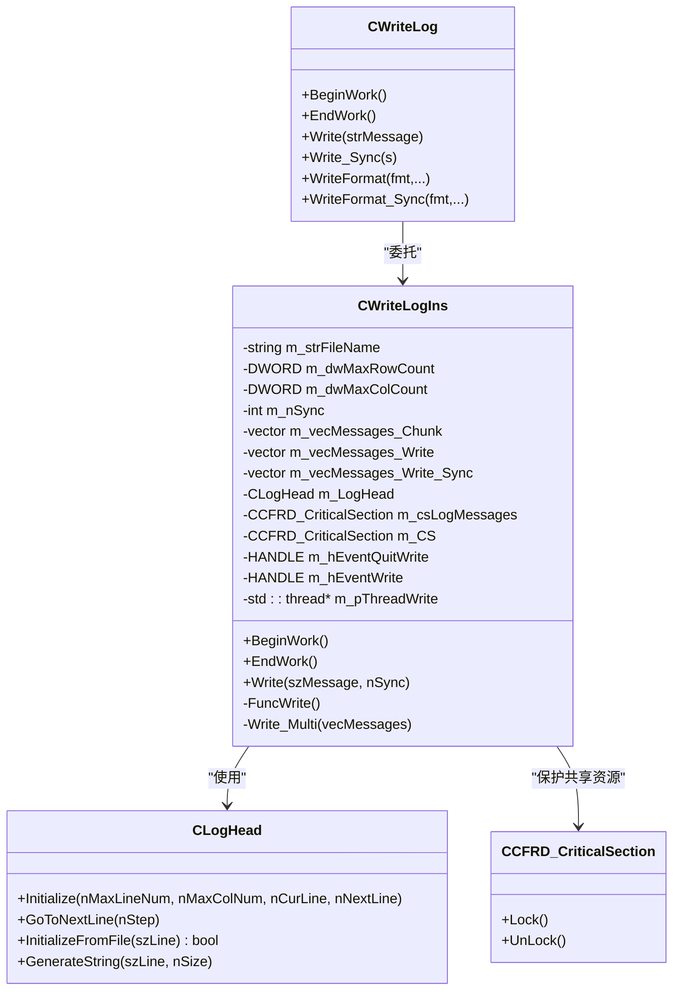

# 日志系统

<cite>
**本文引用的文件**
- [ScanS_WriteLog.h](file://Insulator_Zero_Value_Detection_Robot/Log/ScanS_WriteLog.h)
- [ScanS_WriteLog.cpp](file://Insulator_Zero_Value_Detection_Robot/Log/ScanS_WriteLog.cpp)
- [WriteLogIns.h](file://Insulator_Zero_Value_Detection_Robot/Log/WriteLogIns.h)
- [WriteLogIns.cpp](file://Insulator_Zero_Value_Detection_Robot/Log/WriteLogIns.cpp)
- [ScanS_FC.h](file://Insulator_Zero_Value_Detection_Robot/Log/ScanS_FC.h)
- [ScanS_FC.cpp](file://Insulator_Zero_Value_Detection_Robot/Log/ScanS_FC.cpp)
- [Insulator_Zero_Value_Detection_Robot.cpp](file://Insulator_Zero_Value_Detection_Robot/UI/Insulator_Zero_Value_Detection_Robot.cpp)
</cite>

## 目录
1. [简介](#简介)
2. [项目结构](#项目结构)
3. [核心组件](#核心组件)
4. [架构总览](#架构总览)
5. [详细组件分析](#详细组件分析)
6. [依赖关系分析](#依赖关系分析)
7. [性能与线程安全](#性能与线程安全)
8. [故障排查指南](#故障排查指南)
9. [结论](#结论)
10. [附录：API与使用示例](#附录api与使用示例)

## 简介
本日志系统提供高性能、线程安全的异步日志写入能力，支持固定行宽的文件布局、循环覆盖（轮转）策略、同步/异步写入模式以及格式化输出。通过独立的写线程与事件驱动机制，将业务线程的日志写入开销降至最低；同时提供错误码与健壮的错误处理路径，便于定位问题。

## 项目结构
日志子系统位于 Log 目录，采用“外观类 + 内部实现”的分层设计：
- 外观接口层：CWriteLog（对外暴露简单 API）
- 内部实现层：CWriteLogIns（异步写线程、缓冲队列、文件头管理、落盘逻辑）
- 基础工具层：ScanS_FC（临界区、时间、字符串转换等通用工具）

图表来源
- [ScanS_WriteLog.h:5-42](file://Insulator_Zero_Value_Detection_Robot/Log/ScanS_WriteLog.h#L5-L42)
- [WriteLogIns.h:65-129](file://Insulator_Zero_Value_Detection_Robot/Log/WriteLogIns.h#L65-L129)
- [WriteLogIns.cpp:43-93](file://Insulator_Zero_Value_Detection_Robot/Log/WriteLogIns.cpp#L43-L93)
- [ScanS_FC.h:20-63](file://Insulator_Zero_Value_Detection_Robot/Log/ScanS_FC.h#L20-L63)

章节来源
- [ScanS_WriteLog.h:5-42](file://Insulator_Zero_Value_Detection_Robot/Log/ScanS_WriteLog.h#L5-L42)
- [WriteLogIns.h:65-129](file://Insulator_Zero_Value_Detection_Robot/Log/WriteLogIns.h#L65-L129)
- [WriteLogIns.cpp:43-93](file://Insulator_Zero_Value_Detection_Robot/Log/WriteLogIns.cpp#L43-L93)
- [ScanS_FC.h:20-63](file://Insulator_Zero_Value_Detection_Robot/Log/ScanS_FC.h#L20-L63)

## 核心组件
- CWriteLog：对外统一入口，封装构造参数（路径、最大行数、每行字节数、同步标志），提供 BeginWork/EndWork 生命周期管理与 Write/WriteFormat 系列写入接口。
- CWriteLogIns：内部实现，维护消息缓冲、写线程、文件头状态、批量化落盘与循环覆盖。
- CLogHead：记录文件头信息（最大行数、当前行、下一行、列宽），用于定位写入位置并实现循环覆盖。
- CCFRD_CriticalSection：基于 Windows CRITICAL_SECTION 的轻量临界区，保证多线程访问共享资源的安全。
- CCFRD_Time / CCFRD_Convert：时间与字符串转换工具，辅助日志时间戳与格式化。

章节来源
- [ScanS_WriteLog.h:5-42](file://Insulator_Zero_Value_Detection_Robot/Log/ScanS_WriteLog.h#L5-L42)
- [WriteLogIns.h:26-129](file://Insulator_Zero_Value_Detection_Robot/Log/WriteLogIns.h#L26-L129)
- [ScanS_FC.h:20-63](file://Insulator_Zero_Value_Detection_Robot/Log/ScanS_FC.h#L20-L63)
- [ScanS_FC.h:132-367](file://Insulator_Zero_Value_Detection_Robot/Log/ScanS_FC.h#L132-L367)

## 架构总览
日志写入流程分为两条路径：
- 异步路径：调用 Write/WriteFormat 将日志放入缓冲队列，触发写事件，由写线程批量写入磁盘。
- 同步路径：调用 Write_Sync/WriteFormat_Sync 或构造时 nSync=1，立即将缓冲中的日志合并并落盘。

图表来源
- [ScanS_WriteLog.cpp:28-66](file://Insulator_Zero_Value_Detection_Robot/Log/ScanS_WriteLog.cpp#L28-L66)
- [WriteLogIns.cpp:128-159](file://Insulator_Zero_Value_Detection_Robot/Log/WriteLogIns.cpp#L128-L159)
- [WriteLogIns.cpp:66-93](file://Insulator_Zero_Value_Detection_Robot/Log/WriteLogIns.cpp#L66-L93)
- [WriteLogIns.cpp:161-321](file://Insulator_Zero_Value_Detection_Robot/Log/WriteLogIns.cpp#L161-L321)

## 详细组件分析

### 外观接口 CWriteLog
- 职责：屏蔽内部实现细节，提供统一的日志写入 API。
- 关键方法：
  - BeginWork/EndWork：启动/停止写线程，确保资源正确初始化与释放。
  - Write/Write_Sync：普通与同步写入。
  - WriteFormat/WriteFormat_Sync：格式化写入，内部使用可变参数组装消息。
- 注意事项：
  - 每个对象对应一个日志文件，多个对象不可写同一文件。
  - 构造参数包含路径、最大行数、每行字节数、同步标志。

章节来源
- [ScanS_WriteLog.h:5-42](file://Insulator_Zero_Value_Detection_Robot/Log/ScanS_WriteLog.h#L5-L42)
- [ScanS_WriteLog.cpp:5-66](file://Insulator_Zero_Value_Detection_Robot/Log/ScanS_WriteLog.cpp#L5-L66)

### 内部实现 CWriteLogIns
- 职责：实现异步写线程、缓冲管理、文件头维护、批量落盘与循环覆盖。
- 关键成员：
  - 缓冲队列：m_vecMessages_Chunk（待写）、m_vecMessages_Write（异步批次）、m_vecMessages_Write_Sync（同步批次）。
  - 文件头：CLogHead，维护最大行数、当前行、下一行、列宽。
  - 线程与事件：std::thread 写线程，HANDLE 事件用于唤醒。
  - 锁：CCFRD_CriticalSection 保护缓冲与文件句柄。
- 关键流程：
  - BeginWork：创建事件与写线程。
  - EndWork：发出退出事件并 join 线程，清理资源。
  - Write：入队消息，根据同步标志决定是否立即落盘。
  - FuncWrite：等待事件，取出缓冲并调用 Write_Multi。
  - Write_Multi：打开/校验文件头，更新头信息，按固定行宽写入，处理循环覆盖与溢出截断。

图表来源
- [WriteLogIns.cpp:128-159](file://Insulator_Zero_Value_Detection_Robot/Log/WriteLogIns.cpp#L128-L159)
- [WriteLogIns.cpp:161-321](file://Insulator_Zero_Value_Detection_Robot/Log/WriteLogIns.cpp#L161-L321)

章节来源
- [WriteLogIns.h:65-129](file://Insulator_Zero_Value_Detection_Robot/Log/WriteLogIns.h#L65-L129)
- [WriteLogIns.cpp:6-41](file://Insulator_Zero_Value_Detection_Robot/Log/WriteLogIns.cpp#L6-L41)
- [WriteLogIns.cpp:43-93](file://Insulator_Zero_Value_Detection_Robot/Log/WriteLogIns.cpp#L43-L93)
- [WriteLogIns.cpp:128-159](file://Insulator_Zero_Value_Detection_Robot/Log/WriteLogIns.cpp#L128-L159)
- [WriteLogIns.cpp:161-321](file://Insulator_Zero_Value_Detection_Robot/Log/WriteLogIns.cpp#L161-L321)

### 文件头与循环覆盖 CLogHead
- 职责：维护日志文件的元数据（最大行数、当前行、下一行、列宽），并在每次写入后推进指针，实现循环覆盖。
- 关键点：
  - InitializeFromFile：从文件头读取并校验一致性，若不一致则重建头。
  - GoToNextLine：计算下一批写入的起始行，考虑模运算与边界。
  - GenerateString：生成固定长度的文件头字符串，尾部填充换行符。

章节来源
- [WriteLogIns.h:26-49](file://Insulator_Zero_Value_Detection_Robot/Log/WriteLogIns.h#L26-L49)
- [WriteLogIns.cpp:323-421](file://Insulator_Zero_Value_Detection_Robot/Log/WriteLogIns.cpp#L323-L421)

### 线程安全与工具 ScanS_FC
- CCFRD_CriticalSection：封装 EnterCriticalSection/LeaveCriticalSection，提供 Lock/UnLock。
- CCFRD_Time / CCFRD_Convert：时间获取、时间差计算、字符串/数值互转、时间格式化等。
- 在日志系统中用于：
  - 保护缓冲队列与文件句柄的并发访问。
  - 生成精确到毫秒的时间戳。
  - 格式化消息内容。

章节来源
- [ScanS_FC.h:20-63](file://Insulator_Zero_Value_Detection_Robot/Log/ScanS_FC.h#L20-L63)
- [ScanS_FC.cpp:14-42](file://Insulator_Zero_Value_Detection_Robot/Log/ScanS_FC.cpp#L14-L42)
- [ScanS_FC.h:132-367](file://Insulator_Zero_Value_Detection_Robot/Log/ScanS_FC.h#L132-L367)
- [ScanS_FC.cpp:400-800](file://Insulator_Zero_Value_Detection_Robot/Log/ScanS_FC.cpp#L400-L800)

## 依赖关系分析
- CWriteLog 依赖 CWriteLogIns（通过 void* 指针转发调用）。
- CWriteLogIns 依赖：
  - CLogHead（文件头管理）
  - CCFRD_CriticalSection（线程安全）
  - CCFRD_Time（时间戳）
  - Windows 事件与 std::thread（异步写线程）
- UI 层通过 #include "Log/ScanS_WriteLog.h" 引入并使用日志功能。

图表来源
- [ScanS_WriteLog.h:5-42](file://Insulator_Zero_Value_Detection_Robot/Log/ScanS_WriteLog.h#L5-L42)
- [WriteLogIns.h:65-129](file://Insulator_Zero_Value_Detection_Robot/Log/WriteLogIns.h#L65-L129)
- [WriteLogIns.h:26-49](file://Insulator_Zero_Value_Detection_Robot/Log/WriteLogIns.h#L26-L49)
- [ScanS_FC.h:20-63](file://Insulator_Zero_Value_Detection_Robot/Log/ScanS_FC.h#L20-L63)

章节来源
- [ScanS_WriteLog.h:5-42](file://Insulator_Zero_Value_Detection_Robot/Log/ScanS_WriteLog.h#L5-L42)
- [WriteLogIns.h:65-129](file://Insulator_Zero_Value_Detection_Robot/Log/WriteLogIns.h#L65-L129)
- [ScanS_FC.h:20-63](file://Insulator_Zero_Value_Detection_Robot/Log/ScanS_FC.h#L20-L63)

## 性能与线程安全
- 异步写入：
  - 业务线程仅进行缓冲入队与事件触发，避免阻塞 I/O。
  - 写线程批量处理，减少系统调用次数，提高吞吐。
- 同步写入：
  - 对关键路径（如错误、崩溃前）可使用同步写入确保即时落盘。
- 缓冲与批大小：
  - 单次批量上限为 MaxRowCount_OneLine（256 条），避免过大内存占用。
  - 当缓冲超过上限时自动清空，防止内存增长。
- 固定行宽与循环覆盖：
  - 每行固定长度，便于随机访问与快速定位。
  - 达到最大行数后从头覆盖，避免无限增长。
- 线程安全：
  - 使用临界区保护缓冲与文件句柄，避免竞态条件。
  - 写线程独占文件操作，外部线程不直接访问文件指针。
- 性能建议：
  - 合理设置 dwMaxColCount（最小 38 字节，最大 1024 字节）。
  - 高频日志建议使用异步写入，必要时结合 Write_Sync 保证关键日志及时落盘。
  - 控制每条日志长度，避免频繁截断导致 LE_Overflow。

章节来源
- [WriteLogIns.h:68-70](file://Insulator_Zero_Value_Detection_Robot/Log/WriteLogIns.h#L68-L70)
- [WriteLogIns.cpp:128-159](file://Insulator_Zero_Value_Detection_Robot/Log/WriteLogIns.cpp#L128-L159)
- [WriteLogIns.cpp:161-321](file://Insulator_Zero_Value_Detection_Robot/Log/WriteLogIns.cpp#L161-L321)
- [ScanS_FC.h:20-63](file://Insulator_Zero_Value_Detection_Robot/Log/ScanS_FC.h#L20-L63)

## 故障排查指南
- 常见错误码：
  - LE_Init：初始化参数错误（行数或列数不合法）。
  - LE_Open：打开/创建日志文件失败。
  - LE_Overflow：消息长度超出每行限制，被截断。
- 排查步骤：
  - 检查构造参数：dwMaxRowCount 应在 1~999999 之间；dwMaxColCount 应在 38~1024 之间。
  - 确认路径存在：InitDirectory 会尝试创建目录，若权限不足将导致 LE_Open。
  - 观察日志头：文件首行为固定格式，若损坏将重建头，可能导致历史数据丢失。
  - 监控缓冲：若频繁出现 LE_Overflow，需调整 dwMaxColCount 或缩短日志内容。
- 调试技巧：
  - 使用 WriteFormat_Sync 记录关键路径，确保关键日志即时落盘。
  - 在 BeginWork/EndWork 前后添加日志，验证生命周期是否正确。
  - 借助 CCFRD_Time 的时间差计算，评估写入耗时。

章节来源
- [WriteLogIns.h:18-24](file://Insulator_Zero_Value_Detection_Robot/Log/WriteLogIns.h#L18-L24)
- [WriteLogIns.cpp:95-126](file://Insulator_Zero_Value_Detection_Robot/Log/WriteLogIns.cpp#L95-L126)
- [WriteLogIns.cpp:161-321](file://Insulator_Zero_Value_Detection_Robot/Log/WriteLogIns.cpp#L161-L321)

## 结论
该日志系统通过外观类与内部实现的解耦设计，提供了简洁易用的 API 与高性能的异步写入能力。固定行宽与循环覆盖策略确保了日志文件的可控增长与高效检索；线程安全机制保障了多线程环境下的稳定性。配合合理的配置与调试手段，可满足工业级应用的日志需求。

## 附录：API与使用示例

### 配置选项
- 路径与文件名：strPath，支持相对或绝对路径，不存在目录会自动创建。
- 最大行数：dwMaxRowCount，范围 1~999999，达到后循环覆盖。
- 每行字节数：dwMaxColCount，范围 38~1024，包含固定头部与尾部。
- 同步标志：nSync，构造时为全局默认；Write/WriteFormat 可覆盖为局部同步。

章节来源
- [ScanS_WriteLog.h:11-19](file://Insulator_Zero_Value_Detection_Robot/Log/ScanS_WriteLog.h#L11-L19)
- [WriteLogIns.h:101-109](file://Insulator_Zero_Value_Detection_Robot/Log/WriteLogIns.h#L101-L109)

### 使用方法
- 初始化：
  - 构造 CWriteLog 实例，传入路径、最大行数、每行字节数、同步标志。
  - 调用 BeginWork 启动写线程。
- 写入日志：
  - 普通写入：Write/WriteFormat。
  - 同步写入：Write_Sync/WriteFormat_Sync。
- 结束：
  - 调用 EndWork 停止写线程并释放资源。

章节来源
- [ScanS_WriteLog.h:23-38](file://Insulator_Zero_Value_Detection_Robot/Log/ScanS_WriteLog.h#L23-L38)
- [ScanS_WriteLog.cpp:18-66](file://Insulator_Zero_Value_Detection_Robot/Log/ScanS_WriteLog.cpp#L18-L66)

### 日志文件格式
- 文件头：固定长度，包含最大行数、当前行、下一行、列宽等信息。
- 日志行：固定长度，包含行号、时间戳、消息内容、尾部换行符。
- 循环覆盖：达到最大行数后从头覆盖，保持文件大小稳定。

章节来源
- [WriteLogIns.h:12-16](file://Insulator_Zero_Value_Detection_Robot/Log/WriteLogIns.h#L12-L16)
- [WriteLogIns.cpp:240-314](file://Insulator_Zero_Value_Detection_Robot/Log/WriteLogIns.cpp#L240-L314)
- [WriteLogIns.cpp:411-421](file://Insulator_Zero_Value_Detection_Robot/Log/WriteLogIns.cpp#L411-L421)

### 搜索与分析工具建议
- 文本编辑器/IDE：支持正则表达式搜索，可按时间戳或关键字过滤。
- 命令行工具：grep/awk/sed 等用于快速筛选与统计。
- 专用日志分析器：导入固定行宽文件，按列解析时间戳与消息。

[本节为概念性说明，无需代码来源]

### 实际使用示例（引用路径）
- UI 层初始化中记录日志：
  - 参考路径：[Insulator_Zero_Value_Detection_Robot.cpp:104-108](file://Insulator_Zero_Value_Detection_Robot/UI/Insulator_Zero_Value_Detection_Robot.cpp#L104-L108)

章节来源
- [Insulator_Zero_Value_Detection_Robot.cpp:104-108](file://Insulator_Zero_Value_Detection_Robot/UI/Insulator_Zero_Value_Detection_Robot.cpp#L104-L108)