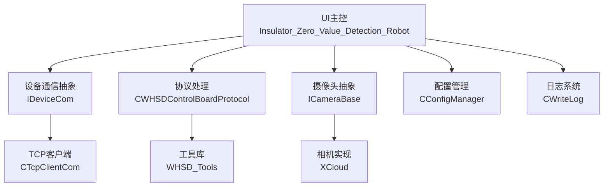
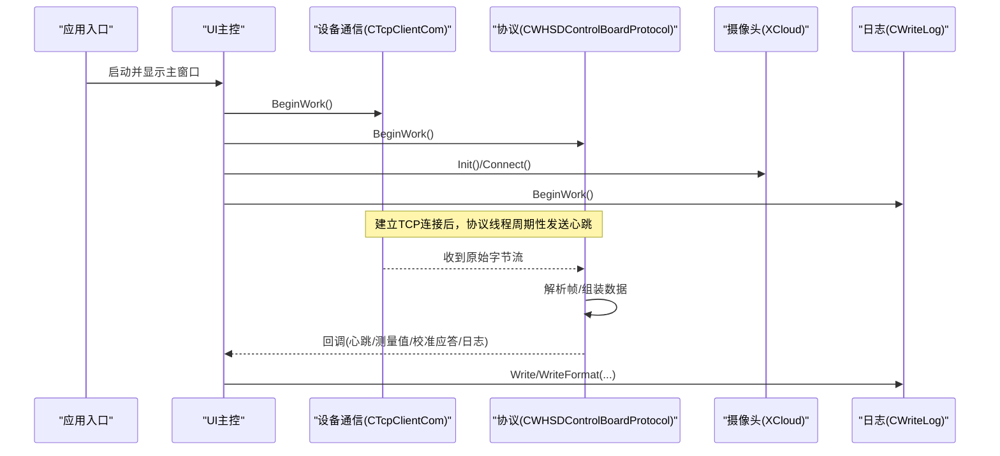
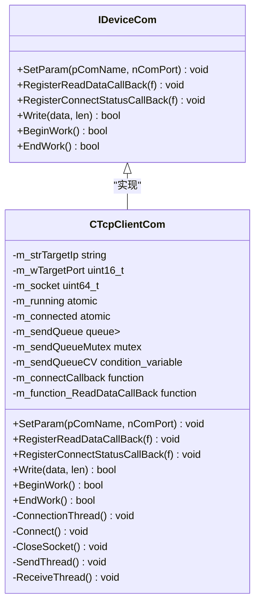
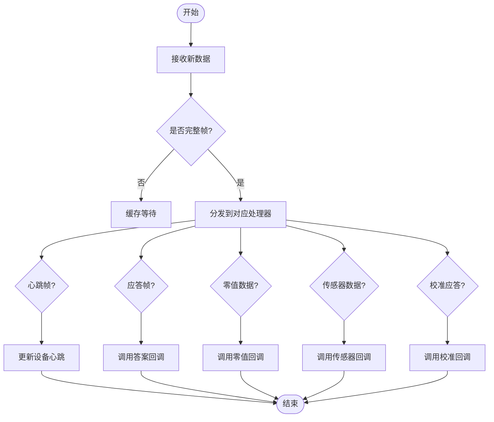
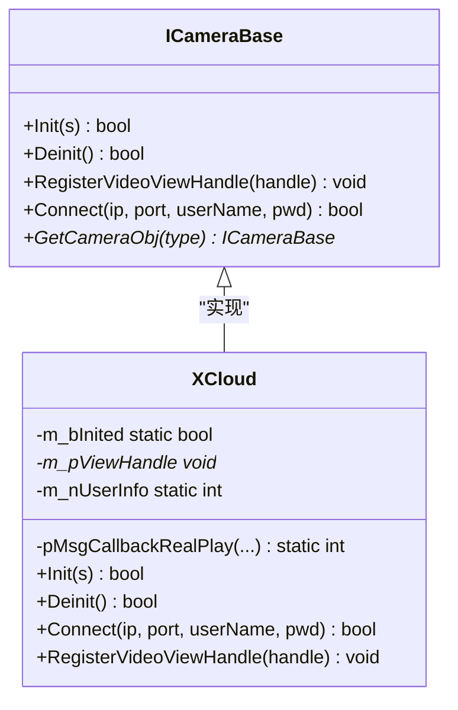
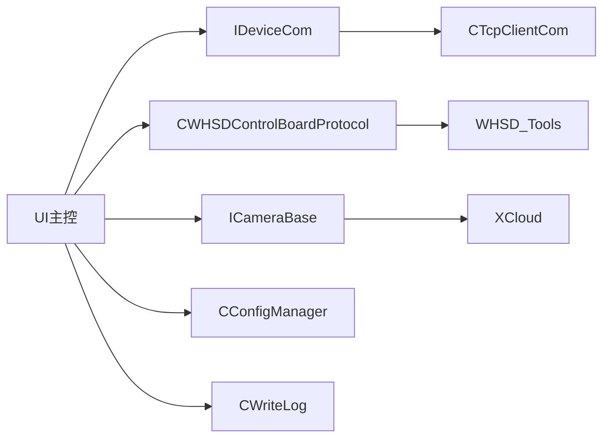

# 核心模块

<cite>
**本文引用的文件**
- [main.cpp](file://Insulator_Zero_Value_Detection_Robot/main.cpp)
- [IDeviceCom.h](file://Insulator_Zero_Value_Detection_Robot/DeviceCom/IDeviceCom.h)
- [TcpClient.h](file://Insulator_Zero_Value_Detection_Robot/DeviceCom/TcpClient.h)
- [TcpClient.cpp](file://Insulator_Zero_Value_Detection_Robot/DeviceCom/TcpClient.cpp)
- [WHSDControlBoradProtocol.h](file://Insulator_Zero_Value_Detection_Robot/Protocol/WHSDControlBoradProtocol.h)
- [WHSDControlBoradProtocol.cpp](file://Insulator_Zero_Value_Detection_Robot/Protocol/WHSDControlBoradProtocol.cpp)
- [CameraBase.h](file://Insulator_Zero_Value_Detection_Robot/Camera/CameraBase.h)
- [XCloud.h](file://Insulator_Zero_Value_Detection_Robot/Camera/XCloud.h)
- [ConfigManager.h](file://Insulator_Zero_Value_Detection_Robot/Config/ConfigManager.h)
- [ConfigManager.cpp](file://Insulator_Zero_Value_Detection_Robot/Config/ConfigManager.cpp)
- [ScanS_WriteLog.h](file://Insulator_Zero_Value_Detection_Robot/Log/ScanS_WriteLog.h)
- [ScanS_WriteLog.cpp](file://Insulator_Zero_Value_Detection_Robot/Log/ScanS_WriteLog.cpp)
- [Tools.h](file://Insulator_Zero_Value_Detection_Robot/Tools/Tools.h)
- [Insulator_Zero_Value_Detection_Robot.h](file://Insulator_Zero_Value_Detection_Robot/UI/Insulator_Zero_Value_Detection_Robot.h)
</cite>

## 目录
1. [简介](#简介)
2. [项目结构](#项目结构)
3. [核心组件](#核心组件)
4. [架构总览](#架构总览)
5. [详细组件分析](#详细组件分析)
6. [依赖关系分析](#依赖关系分析)
7. [性能考虑](#性能考虑)
8. [故障排查指南](#故障排查指南)
9. [结论](#结论)
10. [附录](#附录)

## 简介
本技术文档面向绝缘子零值检测机器人V2的核心模块，覆盖设备通信、协议处理、摄像头接入、配置管理、日志系统以及UI主控的协作方式。文档从接口设计、关键类与方法、数据流与状态机、异常处理与恢复策略、性能优化与最佳实践等维度展开，既帮助初学者理解整体架构，也为高级开发者提供深入实现细节与排错指引。

## 项目结构
项目采用分层与按功能域组织的方式：
- UI层：Qt主窗口与交互逻辑，协调各子系统
- 设备通信层：抽象接口与TCP客户端实现，负责与下位机通信
- 协议层：控制板协议封装，命令构造、解析、心跳、OTA、校准流程
- 摄像头模块：抽象相机接口与具体SDK实现（如XCloud）
- 配置管理：XML读取/写入，统一维护设备、相机、工单与报告配置
- 日志系统：线程安全日志写入，支持同步/异步模式
- 工具库：通用工具函数（位操作、文件IO、字符串处理等）

图表来源
- [Insulator_Zero_Value_Detection_Robot.h:26-385](file://Insulator_Zero_Value_Detection_Robot/UI/Insulator_Zero_Value_Detection_Robot.h#L26-L385)
- [IDeviceCom.h:4-15](file://Insulator_Zero_Value_Detection_Robot/DeviceCom/IDeviceCom.h#L4-L15)
- [TcpClient.h:8-46](file://Insulator_Zero_Value_Detection_Robot/DeviceCom/TcpClient.h#L8-L46)
- [WHSDControlBoradProtocol.h:189-356](file://Insulator_Zero_Value_Detection_Robot/Protocol/WHSDControlBoradProtocol.h#L189-L356)
- [CameraBase.h:5-14](file://Insulator_Zero_Value_Detection_Robot/Camera/CameraBase.h#L5-L14)
- [XCloud.h:6-33](file://Insulator_Zero_Value_Detection_Robot/Camera/XCloud.h#L6-L33)
- [ConfigManager.h:185-199](file://Insulator_Zero_Value_Detection_Robot/Config/ConfigManager.h#L185-L199)
- [ScanS_WriteLog.h:5-42](file://Insulator_Zero_Value_Detection_Robot/Log/ScanS_WriteLog.h#L5-L42)
- [Tools.h:20-79](file://Insulator_Zero_Value_Detection_Robot/Tools/Tools.h#L20-L79)

章节来源
- [main.cpp:11-24](file://Insulator_Zero_Value_Detection_Robot/main.cpp#L11-L24)
- [Insulator_Zero_Value_Detection_Robot.h:26-385](file://Insulator_Zero_Value_Detection_Robot/UI/Insulator_Zero_Value_Detection_Robot.h#L26-L385)

## 核心组件
- 设备通信抽象与实现
  - IDeviceCom：定义统一的设备通信接口，包括参数设置、读写回调注册、连接状态回调、写数据、开始/结束工作
  - CTcpClientCom：基于Winsock的TCP客户端，多线程（连接、接收、发送），队列缓冲，条件变量唤醒，非阻塞连接与重连机制
- 协议处理
  - CWHSDControlBoardProtocol：封装控制板协议，包含传感器数据、校准应答、设备心跳、电机状态、OTA升级、命令构造与解析、心跳线程、回调分发
- 摄像头模块
  - ICameraBase：相机抽象接口，初始化、反初始化、视频句柄注册、连接
  - XCloud：基于特定SDK的相机实现，提供实时流回调与视图句柄绑定
- 配置管理
  - CConfigManager：读取/写入XML配置文件，维护控制板、相机、工单与报告配置对象
- 日志系统
  - CWriteLog：线程安全的日志写入器，支持同步/异步写入、格式化输出、循环覆盖与最大行/列限制
- 工具库
  - WHSD_Tools：位操作宏、文件与路径工具、Base64编解码、数据分割、GUID路径生成等

章节来源
- [IDeviceCom.h:4-15](file://Insulator_Zero_Value_Detection_Robot/DeviceCom/IDeviceCom.h#L4-L15)
- [TcpClient.h:8-46](file://Insulator_Zero_Value_Detection_Robot/DeviceCom/TcpClient.h#L8-L46)
- [TcpClient.cpp:21-200](file://Insulator_Zero_Value_Detection_Robot/DeviceCom/TcpClient.cpp#L21-L200)
- [WHSDControlBoradProtocol.h:7-356](file://Insulator_Zero_Value_Detection_Robot/Protocol/WHSDControlBoradProtocol.h#L7-L356)
- [WHSDControlBoradProtocol.cpp:14-200](file://Insulator_Zero_Value_Detection_Robot/Protocol/WHSDControlBoradProtocol.cpp#L14-L200)
- [CameraBase.h:5-14](file://Insulator_Zero_Value_Detection_Robot/Camera/CameraBase.h#L5-L14)
- [XCloud.h:6-33](file://Insulator_Zero_Value_Detection_Robot/Camera/XCloud.h#L6-L33)
- [ConfigManager.h:10-199](file://Insulator_Zero_Value_Detection_Robot/Config/ConfigManager.h#L10-L199)
- [ConfigManager.cpp:8-200](file://Insulator_Zero_Value_Detection_Robot/Config/ConfigManager.cpp#L8-L200)
- [ScanS_WriteLog.h:5-42](file://Insulator_Zero_Value_Detection_Robot/Log/ScanS_WriteLog.h#L5-L42)
- [ScanS_WriteLog.cpp:5-66](file://Insulator_Zero_Value_Detection_Robot/Log/ScanS_WriteLog.cpp#L5-L66)
- [Tools.h:5-79](file://Insulator_Zero_Value_Detection_Robot/Tools/Tools.h#L5-L79)

## 架构总览
系统以UI主控为入口，协调设备通信、协议处理、摄像头、配置与日志。设备通信通过抽象接口解耦具体传输方式；协议层对下位机进行命令封装与响应解析；摄像头模块提供多路视频采集；配置管理集中化参数；日志系统贯穿全链路记录运行信息。

图表来源
- [main.cpp:11-24](file://Insulator_Zero_Value_Detection_Robot/main.cpp#L11-L24)
- [TcpClient.cpp:59-121](file://Insulator_Zero_Value_Detection_Robot/DeviceCom/TcpClient.cpp#L59-L121)
- [WHSDControlBoradProtocol.cpp:179-200](file://Insulator_Zero_Value_Detection_Robot/Protocol/WHSDControlBoradProtocol.cpp#L179-L200)
- [Insulator_Zero_Value_Detection_Robot.h:142-161](file://Insulator_Zero_Value_Detection_Robot/UI/Insulator_Zero_Value_Detection_Robot.h#L142-L161)
- [ScanS_WriteLog.cpp:18-66](file://Insulator_Zero_Value_Detection_Robot/Log/ScanS_WriteLog.cpp#L18-L66)

## 详细组件分析

### 设备通信模块（IDeviceCom与CTcpClientCom）
- 设计要点
  - 抽象接口IDeviceCom屏蔽底层差异，便于扩展其他通信方式（串口、UDP等）
  - CTcpClientCom使用三线程模型：连接线程、接收线程、发送线程；发送使用队列+条件变量避免忙等
  - 非阻塞套接字+select判断连接状态，提升连接效率
  - 原子标志m_running/m_connected保证线程安全启停
- 关键方法
  - SetParam：设置目标IP与端口
  - RegisterReadDataCallBack/RegisterConnectStatusCallBack：注册数据与连接状态回调
  - Write：将待发送数据入队并通知发送线程
  - BeginWork/EndWork：启动/停止通信，管理线程生命周期与资源清理
- 错误处理与恢复
  - 连接失败时进入重连循环，定期尝试
  - 关闭Socket并重置状态，确保资源释放
  - 线程join保证优雅退出

图表来源
- [IDeviceCom.h:4-15](file://Insulator_Zero_Value_Detection_Robot/DeviceCom/IDeviceCom.h#L4-L15)
- [TcpClient.h:8-46](file://Insulator_Zero_Value_Detection_Robot/DeviceCom/TcpClient.h#L8-L46)

章节来源
- [TcpClient.cpp:21-200](file://Insulator_Zero_Value_Detection_Robot/DeviceCom/TcpClient.cpp#L21-L200)

### 协议处理模块（CWHSDControlBoardProtocol）
- 设计要点
  - 封装控制板协议，提供命令构造静态方法与实例化的解析/回调分发
  - 支持多种业务：设备运行控制、X射线控制、传感器指令、校准流程、OTA升级、心跳上报
  - 内部维护设备心跳数据结构CDeviceHeartBeat，包含多类电机状态、电池、固件信息等
  - 通过回调机制将解析结果推送到上层（UI或业务模块）
- 关键数据结构
  - CSensorData：传感器索引、命令、值
  - CCalibAnswer：校准应答（子命令、结果、原因、参数1/2）
  - CControlBoardProtocolConfig：控制板阈值配置（激光测距、角度、电压、运行时间）
  - CMotorDeviceStatus：设备使能与状态位
  - CDeviceHeartBeat：汇总设备状态，含电机状态提取逻辑
- 关键方法
  - BeginWork/EndWork：启动协议线程（心跳、OTA）、初始化缓冲区
  - ReceiveNewData/Parse：接收原始数据并解析
  - DeviceRun/DeviceStop/StartXRay/SensorCmd等：命令构造
  - CalibReset/CalibQueryRaw/CalibReadCoef/CalibVerify/CalibSinglePoint：校准流程命令
  - RegisterAnswerFunction/RegisterZeroDataCallBack/RegisterDeviceHeartBeat/RegisterDeviceLog/RegisterOTAStatus/RegisterSensorDataCallBack/RegisterCalibCallBack：注册各类回调
- 错误处理与恢复
  - 校验Flash写超时、参数长度/格式错误、原始值超时等，通过结果码与原因码反馈
  - OTA分片传输，错误计数与重试策略

图表来源
- [WHSDControlBoradProtocol.h:189-356](file://Insulator_Zero_Value_Detection_Robot/Protocol/WHSDControlBoradProtocol.h#L189-L356)
- [WHSDControlBoradProtocol.cpp:179-200](file://Insulator_Zero_Value_Detection_Robot/Protocol/WHSDControlBoradProtocol.cpp#L179-L200)

章节来源
- [WHSDControlBoradProtocol.h:7-356](file://Insulator_Zero_Value_Detection_Robot/Protocol/WHSDControlBoradProtocol.h#L7-L356)
- [WHSDControlBoradProtocol.cpp:14-200](file://Insulator_Zero_Value_Detection_Robot/Protocol/WHSDControlBoradProtocol.cpp#L14-L200)

### 摄像头模块（ICameraBase与XCloud）
- 设计要点
  - ICameraBase定义统一接口，屏蔽不同厂商SDK差异
  - XCloud实现具体SDK对接，提供Init/Deinit/Connect/VideoViewHandle注册
  - 通过回调机制将实时视频帧推送至UI渲染
- 关键方法
  - Init：初始化SDK与资源
  - Deinit：释放资源
  - Connect：连接相机设备（IP、端口、用户名、密码）
  - RegisterVideoViewHandle：绑定视频渲染句柄
- 错误处理与恢复
  - 连接失败返回false，上层可重试或提示用户
  - 资源释放需成对调用Init/Deinit

图表来源
- [CameraBase.h:5-14](file://Insulator_Zero_Value_Detection_Robot/Camera/CameraBase.h#L5-L14)
- [XCloud.h:6-33](file://Insulator_Zero_Value_Detection_Robot/Camera/XCloud.h#L6-L33)

章节来源
- [XCloud.h:6-33](file://Insulator_Zero_Value_Detection_Robot/Camera/XCloud.h#L6-L33)

### 配置管理模块（CConfigManager）
- 设计要点
  - 使用tinyxml2解析XML配置文件，映射到结构化配置对象
  - 支持控制板配置（IP、端口、心跳周期、工厂模式、探针角度、速度、阈值）
  - 支持相机配置（左右中IP、是否新款相机、主/子码流URL）
  - 支持工单与报告配置列表持久化
- 关键方法
  - Read：从文件加载配置
  - Write：保存配置到文件
- 错误处理与恢复
  - XML解析失败返回false，调用方应回退默认值或提示用户修正
  - 字段缺失时跳过或置默认值

章节来源
- [ConfigManager.h:10-199](file://Insulator_Zero_Value_Detection_Robot/Config/ConfigManager.h#L10-L199)
- [ConfigManager.cpp:8-200](file://Insulator_Zero_Value_Detection_Robot/Config/ConfigManager.cpp#L8-L200)

### 日志系统（CWriteLog）
- 设计要点
  - 线程安全，支持多实例但不可共享同一文件
  - 支持同步/异步写入，格式化输出
  - 循环覆盖与最大行列限制，避免磁盘占用过大
- 关键方法
  - BeginWork/EndWork：开启/关闭日志服务
  - Write/Write_Sync：写入消息
  - WriteFormat/WriteFormat_Sync：格式化写入
- 错误处理与恢复
  - 文件打开失败应在调用方捕获并降级处理
  - 异步写入可能丢帧，关键日志建议使用同步写入

章节来源
- [ScanS_WriteLog.h:5-42](file://Insulator_Zero_Value_Detection_Robot/Log/ScanS_WriteLog.h#L5-L42)
- [ScanS_WriteLog.cpp:5-66](file://Insulator_Zero_Value_Detection_Robot/Log/ScanS_WriteLog.cpp#L5-L66)

### UI主控（Insulator_Zero_Value_Detection_Robot）
- 设计要点
  - Qt主窗口，集成设备通信、协议、摄像头、配置与日志
  - 信号槽机制将协议线程回调切换到UI线程，保证界面安全更新
  - 测量流程状态机：到位轮询、结果超时、异常自动结束
  - 校准流程状态机：恢复默认→测原始值→下发定标→验证→读回系数
- 关键方法
  - Callback_DeviceHeartBeat/CallBack_ZeroValue/CallBack_CalibAnswer：协议回调处理
  - On_ProbeWaitTick/On_MeasureTimeout：测量流程定时器驱动
  - StartProbeMoveAndWait/TriggerMeasureAndArm/AbortMeasure：测量流程推进
  - CalibStartWait/CalibStopWait/CalibTriggerMeasure：校准流程推进
- 错误处理与恢复
  - 超时保护：未收到回报则告警并结束流程
  - 电源确认：心跳到达且电源关闭才视为安全
  - 互斥标志：测量期间禁用相关控件，防止重入

章节来源
- [Insulator_Zero_Value_Detection_Robot.h:26-385](file://Insulator_Zero_Value_Detection_Robot/UI/Insulator_Zero_Value_Detection_Robot.h#L26-L385)

## 依赖关系分析
- UI主控依赖设备通信抽象、协议处理、摄像头抽象、配置管理与日志系统
- 设备通信抽象由TCP客户端实现，依赖Winsock与线程原语
- 协议处理依赖工具库进行位操作与数据转换，依赖设备通信发送数据
- 摄像头抽象由XCloud实现，依赖外部SDK
- 配置管理依赖XML解析库与JSON序列化库
- 日志系统依赖底层写入实现，提供统一接口

图表来源
- [Insulator_Zero_Value_Detection_Robot.h:26-385](file://Insulator_Zero_Value_Detection_Robot/UI/Insulator_Zero_Value_Detection_Robot.h#L26-L385)
- [IDeviceCom.h:4-15](file://Insulator_Zero_Value_Detection_Robot/DeviceCom/IDeviceCom.h#L4-L15)
- [TcpClient.h:8-46](file://Insulator_Zero_Value_Detection_Robot/DeviceCom/TcpClient.h#L8-L46)
- [WHSDControlBoradProtocol.h:189-356](file://Insulator_Zero_Value_Detection_Robot/Protocol/WHSDControlBoradProtocol.h#L189-L356)
- [CameraBase.h:5-14](file://Insulator_Zero_Value_Detection_Robot/Camera/CameraBase.h#L5-L14)
- [XCloud.h:6-33](file://Insulator_Zero_Value_Detection_Robot/Camera/XCloud.h#L6-L33)
- [ConfigManager.h:185-199](file://Insulator_Zero_Value_Detection_Robot/Config/ConfigManager.h#L185-L199)
- [ScanS_WriteLog.h:5-42](file://Insulator_Zero_Value_Detection_Robot/Log/ScanS_WriteLog.h#L5-L42)
- [Tools.h:20-79](file://Insulator_Zero_Value_Detection_Robot/Tools/Tools.h#L20-L79)

章节来源
- [Insulator_Zero_Value_Detection_Robot.h:26-385](file://Insulator_Zero_Value_Detection_Robot/UI/Insulator_Zero_Value_Detection_Robot.h#L26-L385)

## 性能考虑
- 设备通信
  - 使用非阻塞套接字与select减少连接等待开销
  - 发送队列+条件变量避免忙等，降低CPU占用
  - 原子标志与互斥锁保证并发安全，避免锁竞争热点
- 协议处理
  - 心跳线程独立，避免阻塞解析线程
  - 批量数据处理与最小化拷贝，提高吞吐
  - 校准写Flash耗时较长，超时设置合理（≥3秒）
- 摄像头
  - 主/子码流选择平衡画质与带宽
  - 视频句柄直接渲染，减少中间拷贝
- 配置管理
  - XML解析在启动时完成，运行时只读访问
  - JSON序列化用于工单数据，注意大对象频繁序列化的开销
- 日志系统
  - 关键路径使用同步写入，普通调试使用异步
  - 循环覆盖与大小限制避免磁盘爆满

[本节提供一般性指导，不直接分析具体文件]

## 故障排查指南
- 设备通信问题
  - 检查IP与端口配置是否正确
  - 观察连接状态回调，确认连接成功
  - 查看发送队列是否堆积，必要时重启通信
- 协议解析问题
  - 核对帧格式与字节序（协议规定大端）
  - 关注校准应答的结果码与原因码，定位失败原因
  - 心跳丢失时检查网络与设备供电
- 摄像头问题
  - 确认SDK初始化成功，视频句柄有效
  - 检查RTSP地址与认证信息
  - 网络抖动导致断流时，实现重连与缓冲策略
- 配置问题
  - XML格式错误或字段缺失会导致配置加载失败
  - 建议提供默认值与校验逻辑
- 日志问题
  - 文件权限不足或路径不存在导致写入失败
  - 异步模式下关键事件建议使用同步写入

章节来源
- [TcpClient.cpp:59-200](file://Insulator_Zero_Value_Detection_Robot/DeviceCom/TcpClient.cpp#L59-L200)
- [WHSDControlBoradProtocol.cpp:179-200](file://Insulator_Zero_Value_Detection_Robot/Protocol/WHSDControlBoradProtocol.cpp#L179-L200)
- [ConfigManager.cpp:16-200](file://Insulator_Zero_Value_Detection_Robot/Config/ConfigManager.cpp#L16-L200)
- [ScanS_WriteLog.cpp:18-66](file://Insulator_Zero_Value_Detection_Robot/Log/ScanS_WriteLog.cpp#L18-L66)

## 结论
本系统通过清晰的模块化设计与接口抽象，实现了设备通信、协议处理、摄像头接入、配置管理与日志系统的协同工作。UI主控作为调度中心，利用信号槽与状态机保障业务流程的正确性与健壮性。建议在后续迭代中继续优化并发模型、增强错误恢复能力，并完善测试覆盖与性能基准。

[本节总结性内容，不直接分析具体文件]

## 附录
- 常用命令与流程参考
  - 设备运行控制：DeviceRun/DeviceStop/DeviceBreak
  - X射线控制：StartXRay/StopXRay
  - 传感器指令：SensorCmd
  - 校准流程：CalibReset → CalibQueryRaw → CalibSinglePoint → CalibVerify → CalibReadCoef
  - OTA升级：BeginOTA分片传输，监控状态回调
- 最佳实践
  - 所有跨线程回调务必切到UI线程再更新界面
  - 关键路径使用同步日志，避免丢失重要信息
  - 配置变更需校验并持久化，避免不一致状态
  - 网络与硬件操作增加超时与重试，提升鲁棒性

[本节提供概念性说明，不直接分析具体文件]