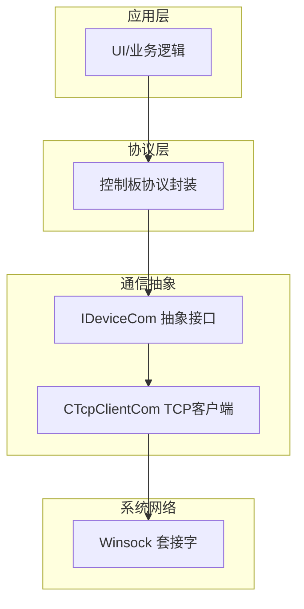
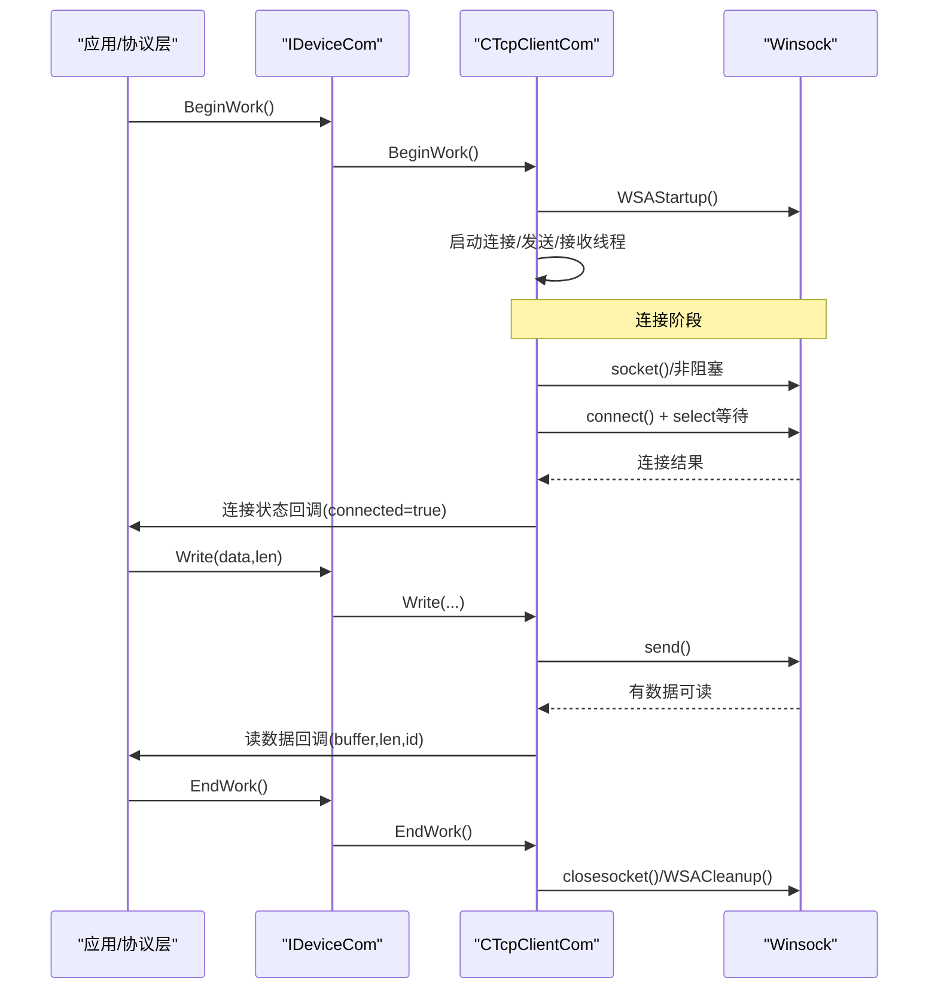
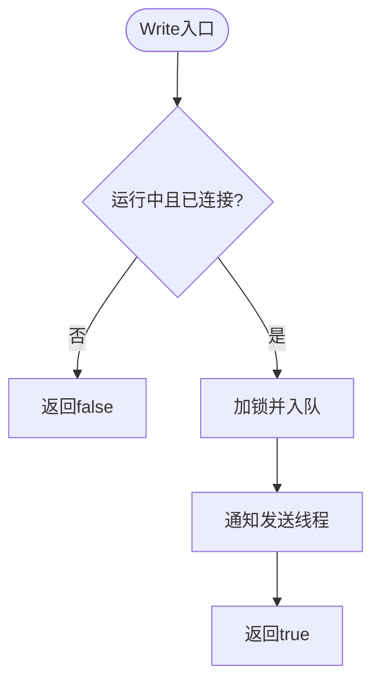
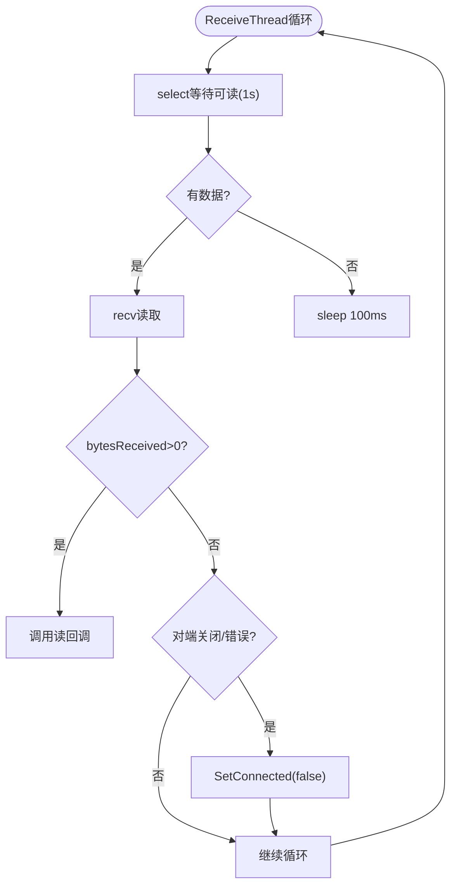

# 设备通信模块

<cite>
**本文引用的文件**
- [IDeviceCom.h](file://Insulator_Zero_Value_Detection_Robot/DeviceCom/IDeviceCom.h)
- [IDeviceCom.cpp](file://Insulator_Zero_Value_Detection_Robot/DeviceCom/IDeviceCom.cpp)
- [TcpClient.h](file://Insulator_Zero_Value_Detection_Robot/DeviceCom/TcpClient.h)
- [TcpClient.cpp](file://Insulator_Zero_Value_Detection_Robot/DeviceCom/TcpClient.cpp)
- [ConfigManager.h](file://Insulator_Zero_Value_Detection_Robot/Config/ConfigManager.h)
- [WHSDControlBoradProtocol.h](file://Insulator_Zero_Value_Detection_Robot/Protocol/WHSDControlBoradProtocol.h)
- [Insulator_Zero_Value_Detection_Robot.cpp](file://Insulator_Zero_Value_Detection_Robot/UI/Insulator_Zero_Value_Detection_Robot.cpp)
</cite>

## 目录
1. [简介](#简介)
2. [项目结构](#项目结构)
3. [核心组件](#核心组件)
4. [架构总览](#架构总览)
5. [详细组件分析](#详细组件分析)
6. [依赖关系分析](#依赖关系分析)
7. [性能与并发特性](#性能与并发特性)
8. [配置与参数](#配置与参数)
9. [错误处理与重连策略](#错误处理与重连策略)
10. [使用示例与集成方式](#使用示例与集成方式)
11. [故障排查指南](#故障排查指南)
12. [结论](#结论)

## 简介
本模块提供统一的设备通信抽象接口与基于TCP的客户端实现，负责与下位机控制板建立、维护并断开连接；通过回调机制上报接收数据与连接状态变化；提供线程安全的发送队列与异步收发能力。上层协议层（如控制板协议）通过该模块完成命令下发与数据解析，形成“UI/业务层 -> 协议层 -> 设备通信抽象 -> TCP客户端”的分层架构。

## 项目结构
- DeviceCom：设备通信抽象与具体实现
  - IDeviceCom：抽象接口定义
  - TcpClient：TCP客户端实现
- Config：配置管理（包含控制板IP/端口等）
- Protocol：控制板协议封装（命令构造、应答解析、心跳、OTA等）
- UI：主界面与业务逻辑（注册回调、发起读写、状态展示）



图表来源
- [Insulator_Zero_Value_Detection_Robot.cpp:277-290](file://Insulator_Zero_Value_Detection_Robot/UI/Insulator_Zero_Value_Detection_Robot.cpp#L277-L290)
- [WHSDControlBoradProtocol.h:189-216](file://Insulator_Zero_Value_Detection_Robot/Protocol/WHSDControlBoradProtocol.h#L189-L216)
- [IDeviceCom.h:4-15](file://Insulator_Zero_Value_Detection_Robot/DeviceCom/IDeviceCom.h#L4-L15)
- [TcpClient.h:8-46](file://Insulator_Zero_Value_Detection_Robot/DeviceCom/TcpClient.h#L8-L46)

章节来源
- [IDeviceCom.h:4-15](file://Insulator_Zero_Value_Detection_Robot/DeviceCom/IDeviceCom.h#L4-L15)
- [TcpClient.h:8-46](file://Insulator_Zero_Value_Detection_Robot/DeviceCom/TcpClient.h#L8-L46)
- [Insulator_Zero_Value_Detection_Robot.cpp:277-290](file://Insulator_Zero_Value_Detection_Robot/UI/Insulator_Zero_Value_Detection_Robot.cpp#L277-L290)

## 核心组件
- IDeviceCom：定义设备通信的统一抽象，包括参数设置、回调注册、数据写入、生命周期管理（开始/结束工作）。
- CTcpClientCom：基于Winsock的TCP客户端实现，采用多线程模型（连接、发送、接收），非阻塞I/O配合select进行超时控制，具备自动重连与状态回调。

章节来源
- [IDeviceCom.h:4-15](file://Insulator_Zero_Value_Detection_Robot/DeviceCom/IDeviceCom.h#L4-L15)
- [IDeviceCom.cpp:4-13](file://Insulator_Zero_Value_Detection_Robot/DeviceCom/IDeviceCom.cpp#L4-L13)
- [TcpClient.h:8-46](file://Insulator_Zero_Value_Detection_Robot/DeviceCom/TcpClient.h#L8-L46)
- [TcpClient.cpp:21-121](file://Insulator_Zero_Value_Detection_Robot/DeviceCom/TcpClient.cpp#L21-L121)

## 架构总览
- 分层设计
  - 协议层：将业务语义转换为字节流，并通过IDeviceCom::Write发送；同时注册接收回调以解析应答与心跳。
  - 通信抽象层：屏蔽具体传输细节，向上提供统一API。
  - 传输层：TCP客户端实现，负责连接、收发、重连、错误处理。
- 关键流程
  - 启动：BeginWork初始化网络库、启动连接/发送/接收线程。
  - 连接：ConnectionThread周期性尝试Connect；成功则SetConnected(true)并触发回调。
  - 发送：Write入队，SendThread取队发送。
  - 接收：ReceiveThread用select监听可读事件，读取后调用读回调。
  - 断开：EndWork关闭socket、停止线程、清理资源。



图表来源
- [TcpClient.cpp:59-121](file://Insulator_Zero_Value_Detection_Robot/DeviceCom/TcpClient.cpp#L59-L121)
- [TcpClient.cpp:123-236](file://Insulator_Zero_Value_Detection_Robot/DeviceCom/TcpClient.cpp#L123-L236)
- [TcpClient.cpp:238-382](file://Insulator_Zero_Value_Detection_Robot/DeviceCom/TcpClient.cpp#L238-L382)

## 详细组件分析

### IDeviceCom 抽象接口
- 职责
  - SetParam：设置目标地址与端口。
  - RegisterReadDataCallBack：注册数据到达回调。
  - RegisterConnectStatusCallBack：注册连接状态变化回调。
  - Write：发送数据（线程安全入队）。
  - BeginWork/EndWork：生命周期管理。
- 设计要点
  - 纯虚类+静态工厂GetIDeviceCom，便于扩展不同传输类型（当前仅支持TCP）。
  - 回调使用std::function，解耦上层处理逻辑。

章节来源
- [IDeviceCom.h:4-15](file://Insulator_Zero_Value_Detection_Robot/DeviceCom/IDeviceCom.h#L4-L15)
- [IDeviceCom.cpp:4-13](file://Insulator_Zero_Value_Detection_Robot/DeviceCom/IDeviceCom.cpp#L4-L13)

### CTcpClientCom TCP客户端
- 成员与职责
  - m_strTargetIp/m_wTargetPort：目标地址与端口。
  - m_socket：Winsock句柄。
  - m_running/m_connected：运行与连接状态原子变量。
  - 三线程：ConnectionThread（连接与重连）、SendThread（发送）、ReceiveThread（接收）。
  - 发送队列：m_sendQueue + mutex + condition_variable，保证线程安全与背压。
  - 回调：m_connectCallback、m_function_ReadDataCallBack。
- 关键流程
  - BeginWork：初始化Winsock，启动三线程。
  - ConnectionThread：循环检测未连接时尝试Connect；失败则休眠后重试。
  - Connect：创建非阻塞socket，connect+select判断连接是否完成或出错。
  - SendThread：从队列取数据send；若发生非可重试错误则置为断开。
  - ReceiveThread：select等待可读；收到数据调用读回调；对端关闭或错误则置为断开。
  - EndWork：置running=false，通知条件变量，关闭socket，join线程，WSACleanup。

```mermaid
classDiagram
class IDeviceCom {
<<interface>>
+SetParam(pComName, nComPort) void
+RegisterReadDataCallBack(f) void
+RegisterConnectStatusCallBack(f) void
+Write(data, len) bool
+BeginWork() bool
+EndWork() bool
}
class CTcpClientCom {
-string m_strTargetIp
-uint16_t m_wTargetPort
-uint64_t m_socket
-atomic<bool> m_running
-atomic<bool> m_connected
-thread m_connectionThread
-thread m_receiveThread
-thread m_sendThread
-queue<vector<uint8_t>> m_sendQueue
-mutex m_sendQueueMutex
-condition_variable m_sendQueueCV
-function<void(bool,int)> m_connectCallback
-function<void(uint8_t*,int,uint64_t)> m_function_ReadDataCallBack
+SetParam(...)
+RegisterReadDataCallBack(...)
+RegisterConnectStatusCallBack(...)
+Write(...)
+BeginWork()
+EndWork()
-ConnectionThread()
-Connect()
-CloseSocket()
-SetConnected(b)
-SendThread()
-ReceiveThread()
}
IDeviceCom <|.. CTcpClientCom : "实现"
```

图表来源
- [IDeviceCom.h:4-15](file://Insulator_Zero_Value_Detection_Robot/DeviceCom/IDeviceCom.h#L4-L15)
- [TcpClient.h:8-46](file://Insulator_Zero_Value_Detection_Robot/DeviceCom/TcpClient.h#L8-L46)

#### 连接建立与维护时序
```mermaid
sequenceDiagram
participant T as "ConnectionThread"
participant C as "Connect()"
participant S as "Socket"
participant U as "用户回调"
loop 每5秒
T->>C : 尝试连接
C->>S : socket()/非阻塞
C->>S : connect()
alt 非阻塞进行中
C->>S : select(写集合, 超时5s)
opt 连接成功
C->>U : SetConnected(true)
else 连接失败
C->>S : closesocket()
end
else 立即成功
C->>U : SetConnected(true)
end
end
```

图表来源
- [TcpClient.cpp:123-135](file://Insulator_Zero_Value_Detection_Robot/DeviceCom/TcpClient.cpp#L123-L135)
- [TcpClient.cpp:163-236](file://Insulator_Zero_Value_Detection_Robot/DeviceCom/TcpClient.cpp#L163-L236)

#### 数据发送流程


图表来源
- [TcpClient.cpp:43-57](file://Insulator_Zero_Value_Detection_Robot/DeviceCom/TcpClient.cpp#L43-L57)

#### 数据接收流程


图表来源
- [TcpClient.cpp:302-382](file://Insulator_Zero_Value_Detection_Robot/DeviceCom/TcpClient.cpp#L302-L382)

章节来源
- [TcpClient.cpp:21-121](file://Insulator_Zero_Value_Detection_Robot/DeviceCom/TcpClient.cpp#L21-L121)
- [TcpClient.cpp:123-236](file://Insulator_Zero_Value_Detection_Robot/DeviceCom/TcpClient.cpp#L123-L236)
- [TcpClient.cpp:238-382](file://Insulator_Zero_Value_Detection_Robot/DeviceCom/TcpClient.cpp#L238-L382)

## 依赖关系分析
- 内部依赖
  - IDeviceCom.cpp 依赖 TcpClient.h 以创建具体实现。
  - TcpClient.cpp 依赖 Winsock 头与库。
- 外部集成
  - 协议层通过 IDeviceCom::Write 发送命令，通过读回调接收数据。
  - UI层在启动时注册回调并调用 BeginWork/EndWork。


图表来源
- [Insulator_Zero_Value_Detection_Robot.cpp:277-290](file://Insulator_Zero_Value_Detection_Robot/UI/Insulator_Zero_Value_Detection_Robot.cpp#L277-L290)
- [IDeviceCom.cpp:4-13](file://Insulator_Zero_Value_Detection_Robot/DeviceCom/IDeviceCom.cpp#L4-L13)
- [TcpClient.cpp:1-19](file://Insulator_Zero_Value_Detection_Robot/DeviceCom/TcpClient.cpp#L1-L19)

章节来源
- [IDeviceCom.cpp:4-13](file://Insulator_Zero_Value_Detection_Robot/DeviceCom/IDeviceCom.cpp#L4-L13)
- [Insulator_Zero_Value_Detection_Robot.cpp:277-290](file://Insulator_Zero_Value_Detection_Robot/UI/Insulator_Zero_Value_Detection_Robot.cpp#L277-L290)

## 性能与并发特性
- 并发模型
  - 三线程分离：连接、发送、接收互不阻塞，提高吞吐与响应性。
  - 发送队列：生产者-消费者模式，避免频繁阻塞调用方。
- I/O模型
  - 非阻塞socket + select，避免阻塞式等待，降低CPU占用。
  - 接收侧1秒超时轮询，兼顾实时性与资源消耗。
- 潜在优化点
  - 发送线程仅在连接可用时工作，空闲时Sleep减少忙等。
  - 可根据业务调整接收缓冲区大小与select超时时间。
  - 可考虑批量发送合并以减少系统调用次数。

[本节为通用性能讨论，不直接分析具体代码行]

## 配置与参数
- 连接参数
  - 目标IP与端口通过 SetParam 设置。
  - 建议从配置文件加载（例如控制板配置对象中的IP与端口字段）。
- 运行时参数
  - 重连间隔：连接线程固定5秒重试。
  - 接收超时：select 1秒。
  - 发送队列：无界队列，注意内存增长风险。
- 配置来源
  - 控制板配置结构体包含IP、端口、心跳等字段，可在应用启动时读取并注入到通信模块。

章节来源
- [TcpClient.cpp:27-31](file://Insulator_Zero_Value_Detection_Robot/DeviceCom/TcpClient.cpp#L27-L31)
- [TcpClient.cpp:123-135](file://Insulator_Zero_Value_Detection_Robot/DeviceCom/TcpClient.cpp#L123-L135)
- [ConfigManager.h:10-24](file://Insulator_Zero_Value_Detection_Robot/Config/ConfigManager.h#L10-L24)

## 错误处理与重连策略
- 错误分类
  - 连接失败：Connect失败则关闭socket，连接线程周期重试。
  - 发送错误：非可重试错误（非WAEWOULDBLOCK/WSAEINTR）置为断开。
  - 接收错误：对端关闭或错误置为断开；select错误也置为断开。
- 重连策略
  - 固定间隔5秒重试，简单稳定；可按需改为指数退避。
- 资源清理
  - EndWork确保关闭socket、join线程、WSACleanup，避免资源泄漏。

章节来源
- [TcpClient.cpp:152-161](file://Insulator_Zero_Value_Detection_Robot/DeviceCom/TcpClient.cpp#L152-L161)
- [TcpClient.cpp:163-236](file://Insulator_Zero_Value_Detection_Robot/DeviceCom/TcpClient.cpp#L163-L236)
- [TcpClient.cpp:238-299](file://Insulator_Zero_Value_Detection_Robot/DeviceCom/TcpClient.cpp#L238-L299)
- [TcpClient.cpp:302-382](file://Insulator_Zero_Value_Detection_Robot/DeviceCom/TcpClient.cpp#L302-L382)
- [TcpClient.cpp:89-121](file://Insulator_Zero_Value_Detection_Robot/DeviceCom/TcpClient.cpp#L89-L121)

## 使用示例与集成方式
- 典型步骤
  1) 获取通信实例：通过 GetIDeviceCom(1) 获取TCP客户端。
  2) 设置参数：SetParam(目标IP, 端口)。
  3) 注册回调：RegisterReadDataCallBack 与 RegisterConnectStatusCallBack。
  4) 启动：BeginWork。
  5) 发送：Write(数据指针, 长度)。
  6) 停止：EndWork。
- 与协议层集成
  - 将协议层的“发送函数”绑定到 IDeviceCom::Write，以便协议层直接下发命令。
  - 将协议层的“接收处理”绑定到读回调，用于解析应答与心跳。
- 与UI集成
  - UI在初始化时完成上述绑定，并在连接状态变化时更新界面提示。

章节来源
- [IDeviceCom.cpp:4-13](file://Insulator_Zero_Value_Detection_Robot/DeviceCom/IDeviceCom.cpp#L4-L13)
- [Insulator_Zero_Value_Detection_Robot.cpp:277-290](file://Insulator_Zero_Value_Detection_Robot/UI/Insulator_Zero_Value_Detection_Robot.cpp#L277-L290)
- [WHSDControlBoradProtocol.h:189-216](file://Insulator_Zero_Value_Detection_Robot/Protocol/WHSDControlBoradProtocol.h#L189-L216)

## 故障排查指南
- 无法连接
  - 检查IP/端口是否正确；确认防火墙与路由可达。
  - 观察连接回调是否被触发；若一直未连接，查看连接线程日志。
- 发送失败
  - 确认 BeginWork 已调用且连接状态为已连接。
  - 若出现发送错误，检查是否为瞬时错误（可重试）或致命错误（需重连）。
- 接收不到数据
  - 确认对端是否主动关闭连接；检查接收回调是否注册。
  - 关注select超时与错误分支，必要时增大接收缓冲或调整超时。
- 资源泄漏
  - 确保 EndWork 被调用；检查线程是否全部join；确认WSACleanup执行。

章节来源
- [TcpClient.cpp:123-236](file://Insulator_Zero_Value_Detection_Robot/DeviceCom/TcpClient.cpp#L123-L236)
- [TcpClient.cpp:238-382](file://Insulator_Zero_Value_Detection_Robot/DeviceCom/TcpClient.cpp#L238-L382)
- [TcpClient.cpp:89-121](file://Insulator_Zero_Value_Detection_Robot/DeviceCom/TcpClient.cpp#L89-L121)

## 结论
该设备通信模块通过清晰的抽象接口与稳健的TCP客户端实现，提供了高内聚、低耦合的设备通信能力。其多线程与非阻塞I/O设计保证了良好的并发与实时性；完善的回调机制使上层协议与UI能够灵活响应连接与数据事件。结合配置管理与协议层封装，形成了可扩展、易维护的设备通信体系。