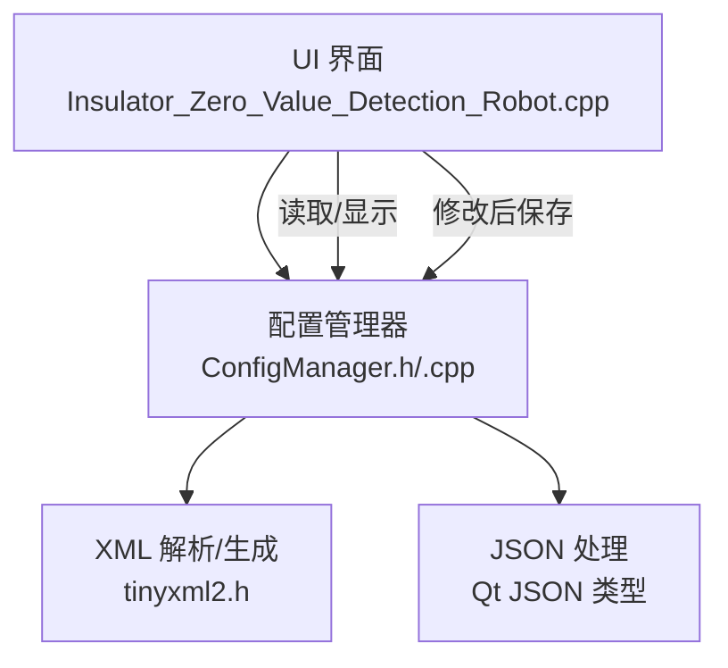
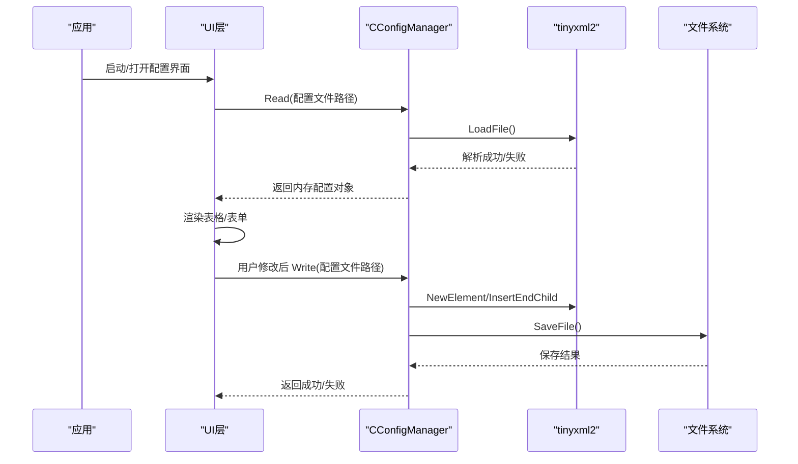
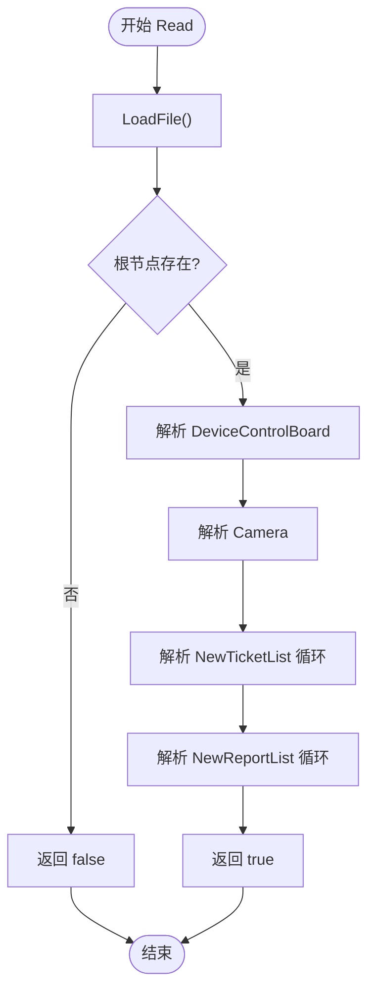
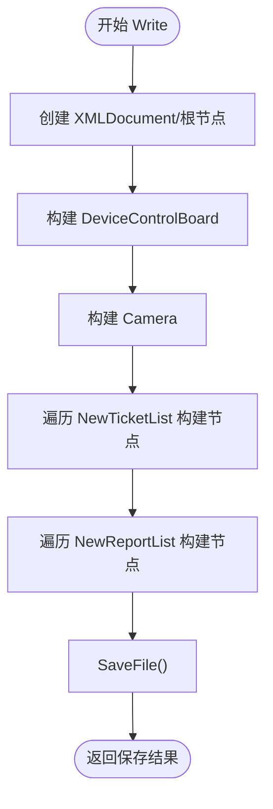
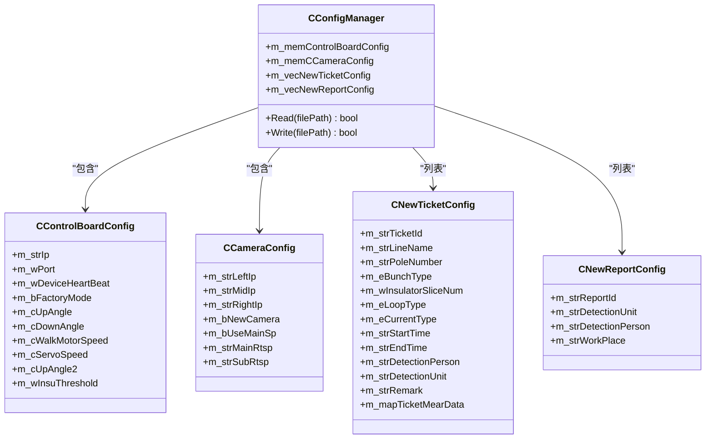

# 配置管理模块

<cite>
**本文引用的文件**
- [ConfigManager.h](file://Insulator_Zero_Value_Detection_Robot/Config/ConfigManager.h)
- [ConfigManager.cpp](file://Insulator_Zero_Value_Detection_Robot/Config/ConfigManager.cpp)
- [tinyxml2.h](file://Insulator_Zero_Value_Detection_Robot/Tools/tinyxml2.h)
- [Insulator_Zero_Value_Detection_Robot.cpp](file://Insulator_Zero_Value_Detection_Robot/UI/Insulator_Zero_Value_Detection_Robot.cpp)
</cite>

## 目录
1. [简介](#简介)
2. [项目结构](#项目结构)
3. [核心组件](#核心组件)
4. [架构总览](#架构总览)
5. [详细组件分析](#详细组件分析)
6. [依赖关系分析](#依赖关系分析)
7. [性能考虑](#性能考虑)
8. [故障排查指南](#故障排查指南)
9. [结论](#结论)
10. [附录](#附录)

## 简介
本模块负责绝缘子零值检测机器人的系统参数与业务配置的统一管理，包括设备控制板、相机、工单与报告等配置的读取、写入与运行时使用。配置文件采用XML格式，通过内置的XML解析器进行解析与生成；同时支持在部分字段中嵌入JSON数据以承载复杂测量结果。模块提供清晰的接口用于加载与保存配置，并在UI层进行展示与编辑后的持久化。

## 项目结构
配置管理模块位于 Config 目录，核心为配置管理器类及其数据结构定义；XML解析由 Tools 目录中的 tinyxml2 库提供；UI 层在初始化时消费配置数据并渲染表格与图表。

**图示来源**
- [ConfigManager.h:185-194](file://Insulator_Zero_Value_Detection_Robot/Config/ConfigManager.h#L185-L194)
- [ConfigManager.cpp:16-257](file://Insulator_Zero_Value_Detection_Robot/Config/ConfigManager.cpp#L16-L257)
- [Insulator_Zero_Value_Detection_Robot.cpp:165-182](file://Insulator_Zero_Value_Detection_Robot/UI/Insulator_Zero_Value_Detection_Robot.cpp#L165-L182)

**章节来源**
- [ConfigManager.h:10-194](file://Insulator_Zero_Value_Detection_Robot/Config/ConfigManager.h#L10-L194)
- [ConfigManager.cpp:16-452](file://Insulator_Zero_Value_Detection_Robot/Config/ConfigManager.cpp#L16-L452)
- [Insulator_Zero_Value_Detection_Robot.cpp:165-182](file://Insulator_Zero_Value_Detection_Robot/UI/Insulator_Zero_Value_Detection_Robot.cpp#L165-L182)

## 核心组件
- CControlBoardConfig：设备控制板相关参数（IP、端口、心跳、工厂模式、角度、速度、阈值等）
- CCameraConfig：相机相关参数（左/中/右相机IP、是否新相机、是否主码流、主/子码流地址）
- CNewTicketConfig：工单配置（线路、杆塔、串数、回路数、交直流类型、时间、人员、单位、备注、测量数据等）
- CNewReportConfig：报告配置（报告编号、检测单位、检测人员、作业地点）
- CConfigManager：配置读写入口，维护上述配置对象集合并提供 Read/Write 方法

**章节来源**
- [ConfigManager.h:10-194](file://Insulator_Zero_Value_Detection_Robot/Config/ConfigManager.h#L10-L194)

## 架构总览
配置管理采用“内存模型 + XML序列化”的模式：
- 启动或需要时调用 Read(filePath) 将XML解析为内存对象
- 业务逻辑直接操作内存对象
- 变更完成后调用 Write(filePath) 将内存对象写回XML
- 复杂数据（如测量结果）以JSON字符串形式嵌入XML节点，读/写时进行JSON编解码

**图示来源**
- [ConfigManager.cpp:16-257](file://Insulator_Zero_Value_Detection_Robot/Config/ConfigManager.cpp#L16-L257)
- [ConfigManager.cpp:259-452](file://Insulator_Zero_Value_Detection_Robot/Config/ConfigManager.cpp#L259-L452)

## 详细组件分析

### 配置数据结构与语义
- 设备控制板参数
  - IP、端口：控制板通信地址
  - DeviceHeartBeat：心跳间隔（毫秒）
  - FactoryMode：工厂模式开关
  - UpAngle/DownAngle/UpAngle2：探针位置角度
  - WalkMotorSpeed：行走电机速度
  - ServoSpeed：舵机速度
  - InsuThreshold：绝缘阈值
- 相机参数
  - Left/Mid/Right：三台相机IP
  - NewCamera：是否使用新款相机
  - UseMainSp：是否使用主码流
  - MainRtsp/SubRtsp：主/子码流RTSP地址
- 工单配置
  - TicketId：唯一标识
  - LineName/PoleNumber：线路与杆塔号
  - BunchType：单联/双联
  - InsulatorSliceNum：绝缘子片数
  - LoopType：同塔单回/双回/四回
  - CurrentType：交流/直流
  - StartTime/EndTime：时间范围
  - DetectionPerson/DetectionUnit：人员与单位
  - Remark：备注
  - m_mapTicketMearData：测量数据（JSON），键为侧别→相别/方向→数值数组
- 报告配置
  - ReportId/WorkPlace/DetectionPerson/DetectionUnit

**章节来源**
- [ConfigManager.h:10-194](file://Insulator_Zero_Value_Detection_Robot/Config/ConfigManager.h#L10-L194)

### XML配置文件的结构与字段映射
根节点为 Config，包含以下子节点：
- DeviceControlBoard：设备控制板参数
  - Ip, Port, DeviceHeartBeat, FactoryMode, UpAngle, DownAngle, WalkMotorSpeed, ServoSpeed, UpAngle2, InsuThreshold
- Camera：相机参数
  - Left, Mid, Right, NewCamera, UseMainSp, MainRtsp, SubRtsp
- NewTicketList：工单列表
  - Size（重复）：每个工单包含 TicketId, LineName, BunchType, InsulatorSliceNum, LoopType, PoleNumber, DetectionUnit, DetectionPerson, CurrentType, StartTime, EndTime, Remark, TicketMearData(JSON文本)
- NewReportList：报告列表
  - Size（重复）：每个报告包含 ReportId, WorkPlace, DetectionPerson, DetectionUnit

注意：
- 布尔值以整数表示（0/1）
- 枚举值以中文文本存储（如“单联”、“同塔单回”、“交流”），在读取时转换为内部枚举类型

**章节来源**
- [ConfigManager.cpp:16-257](file://Insulator_Zero_Value_Detection_Robot/Config/ConfigManager.cpp#L16-L257)
- [ConfigManager.cpp:259-452](file://Insulator_Zero_Value_Detection_Robot/Config/ConfigManager.cpp#L259-L452)

### 解析流程（Read）
- 使用 tinyxml2::XMLDocument 加载文件
- 校验根节点与必要节点存在性
- 逐元素读取并赋值到内存对象
- 对枚举字段进行文本到枚举的转换
- 对 TicketMearData 字段进行JSON解析，填充 QJsonObject
- 返回解析结果

**图示来源**
- [ConfigManager.cpp:16-257](file://Insulator_Zero_Value_Detection_Robot/Config/ConfigManager.cpp#L16-L257)

**章节来源**
- [ConfigManager.cpp:16-257](file://Insulator_Zero_Value_Detection_Robot/Config/ConfigManager.cpp#L16-L257)

### 保存流程（Write）
- 创建 XMLDocument 与根节点
- 按顺序插入各配置段节点与字段
- 对枚举字段进行枚举到文本的转换
- 对测量数据字段进行JSON序列化
- 调用 SaveFile 持久化
- 返回保存结果

**图示来源**
- [ConfigManager.cpp:259-452](file://Insulator_Zero_Value_Detection_Robot/Config/ConfigManager.cpp#L259-L452)

**章节来源**
- [ConfigManager.cpp:259-452](file://Insulator_Zero_Value_Detection_Robot/Config/ConfigManager.cpp#L259-L452)

### 与UI层的集成
- UI 在初始化阶段从配置管理器获取工单与报告配置，并填充表格
- 用户在界面修改配置后，通过配置管理器保存至XML文件
- 测量数据在UI中以JSON结构进行增删改查，最终随工单配置一起持久化

**章节来源**
- [Insulator_Zero_Value_Detection_Robot.cpp:165-182](file://Insulator_Zero_Value_Detection_Robot/UI/Insulator_Zero_Value_Detection_Robot.cpp#L165-L182)

## 依赖关系分析
- 配置管理器依赖 tinyxml2 进行XML解析与生成
- 配置管理器依赖 Qt JSON 类型进行复杂数据的序列化/反序列化
- UI 层依赖配置管理器提供的内存对象进行展示与交互

**图示来源**
- [ConfigManager.h:10-194](file://Insulator_Zero_Value_Detection_Robot/Config/ConfigManager.h#L10-L194)

**章节来源**
- [ConfigManager.h:10-194](file://Insulator_Zero_Value_Detection_Robot/Config/ConfigManager.h#L10-L194)

## 性能考虑
- XML解析与生成使用轻量级库，适合中小规模配置
- 批量写入时避免频繁I/O，建议合并多次修改后统一保存
- JSON序列化仅在必要时执行，减少CPU开销
- 大文件场景可考虑分块读取或懒加载策略（当前实现为一次性加载）

[本节为通用指导，不直接分析具体文件]

## 故障排查指南
- 解析失败常见原因
  - 文件不存在或路径错误：检查 filePath
  - XML格式错误或缺少必需节点：确保根节点与必要子节点存在
  - 字段类型不匹配：确认整数字段为合法整数，布尔字段为0/1
  - JSON字段非法：确保 TicketMearData 为合法JSON对象
- 保存失败常见原因
  - 无写入权限：检查目标目录权限
  - 磁盘空间不足：检查可用空间
- 建议在关键步骤添加日志记录，便于定位问题

**章节来源**
- [ConfigManager.cpp:16-257](file://Insulator_Zero_Value_Detection_Robot/Config/ConfigManager.cpp#L16-L257)
- [ConfigManager.cpp:259-452](file://Insulator_Zero_Value_Detection_Robot/Config/ConfigManager.cpp#L259-L452)

## 结论
配置管理模块通过清晰的数据结构与统一的XML序列化机制，实现了设备、相机、工单与报告的集中化管理。其设计简洁、易于扩展，能够支撑当前业务需求。建议在后续版本中增强配置校验与版本迁移能力，以提升健壮性与可维护性。

[本节为总结，不直接分析具体文件]

## 附录

### 参数含义、取值范围与默认值
- 设备控制板
  - Ip：字符串，设备IP地址
  - Port：无符号16位整数，端口号
  - DeviceHeartBeat：无符号16位整数，毫秒；默认200
  - FactoryMode：布尔（0/1），工厂模式开关
  - UpAngle/DownAngle/UpAngle2：无符号8位整数，角度
  - WalkMotorSpeed：无符号8位整数，速度
  - ServoSpeed：无符号8位整数，速度
  - InsuThreshold：无符号16位整数，阈值
- 相机
  - Left/Mid/Right：字符串，相机IP
  - NewCamera：布尔（0/1），是否新相机
  - UseMainSp：布尔（0/1），是否主码流
  - MainRtsp/SubRtsp：字符串，RTSP地址
- 工单
  - TicketId：字符串，唯一标识
  - LineName/PoleNumber：字符串
  - BunchType：枚举，“单联”或“双联”
  - InsulatorSliceNum：无符号16位整数
  - LoopType：枚举，“同塔单回”、“同塔双回”或“同塔四回”
  - CurrentType：枚举，“交流”或“直流”，默认交流
  - StartTime/EndTime：字符串，时间格式 yyyy-MM-dd HH:mm
  - DetectionPerson/DetectionUnit：字符串
  - Remark：字符串
  - m_mapTicketMearData：JSON对象，键为侧别→相别/方向→数值数组
- 报告
  - ReportId/WorkPlace/DetectionPerson/DetectionUnit：字符串

**章节来源**
- [ConfigManager.h:10-194](file://Insulator_Zero_Value_Detection_Robot/Config/ConfigManager.h#L10-L194)
- [ConfigManager.cpp:8-14](file://Insulator_Zero_Value_Detection_Robot/Config/ConfigManager.cpp#L8-L14)

### 配置示例（结构说明）
以下为XML结构的示意性描述（非真实内容）：
- 根节点：Config
- 子节点：
  - DeviceControlBoard：包含 Ip, Port, DeviceHeartBeat, FactoryMode, UpAngle, DownAngle, WalkMotorSpeed, ServoSpeed, UpAngle2, InsuThreshold
  - Camera：包含 Left, Mid, Right, NewCamera, UseMainSp, MainRtsp, SubRtsp
  - NewTicketList：包含多个 Size，每个 Size 包含工单字段与 TicketMearData(JSON)
  - NewReportList：包含多个 Size，每个 Size 包含报告字段

注意：
- 实际字段名称与层级需严格遵循代码中的解析与写入逻辑
- 枚举字段使用中文文本存储，需在编辑时保持一致

**章节来源**
- [ConfigManager.cpp:16-257](file://Insulator_Zero_Value_Detection_Robot/Config/ConfigManager.cpp#L16-L257)
- [ConfigManager.cpp:259-452](file://Insulator_Zero_Value_Detection_Robot/Config/ConfigManager.cpp#L259-L452)

### 热更新机制
- 当前实现未提供运行时热更新接口
- 如需热更新，可在UI层监听配置变更事件，调用 Write 后立即重新加载或刷新内存对象
- 建议在多线程环境下加锁保护配置读写，避免竞态条件

[本节为通用指导，不直接分析具体文件]

### 版本兼容性与迁移策略
- 当前实现未显式包含版本号字段
- 建议引入版本字段（如 ConfigVersion），在 Read 时根据版本进行兼容性处理
- 对于新增字段，可采用“缺失即默认值”的策略；对于废弃字段，应记录警告并忽略
- 迁移脚本可在启动时检测版本并自动升级旧配置

[本节为通用指导，不直接分析具体文件]

### 与其他模块的配置依赖关系与最佳实践
- UI层依赖配置管理器提供的内存对象进行展示与交互
- 协议与设备通信可能依赖设备控制板参数（IP、端口、心跳等）
- 相机模块依赖相机参数（IP、码流地址）
- 报告模块依赖报告配置（人员、单位、地点）
- 最佳实践：
  - 所有外部可配置项集中在配置文件中管理
  - 启动时统一加载配置，避免分散硬编码
  - 对关键参数增加校验与提示
  - 对敏感信息（如密码）进行加密存储（若适用）

**章节来源**
- [Insulator_Zero_Value_Detection_Robot.cpp:165-182](file://Insulator_Zero_Value_Detection_Robot/UI/Insulator_Zero_Value_Detection_Robot.cpp#L165-L182)
- [ConfigManager.h:10-194](file://Insulator_Zero_Value_Detection_Robot/Config/ConfigManager.h#L10-L194)