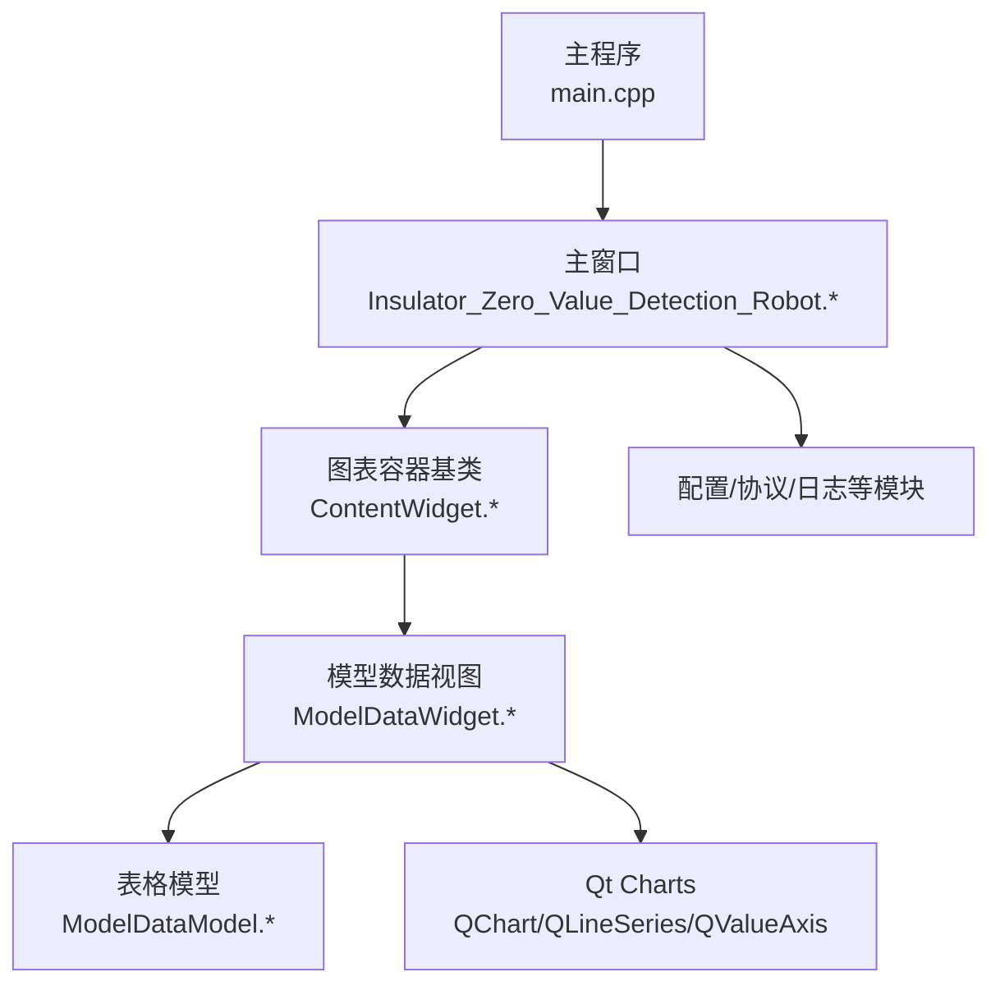
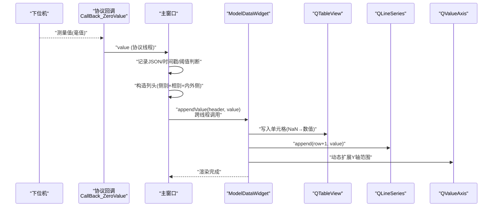
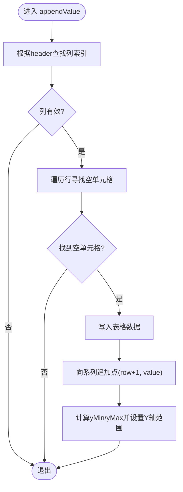
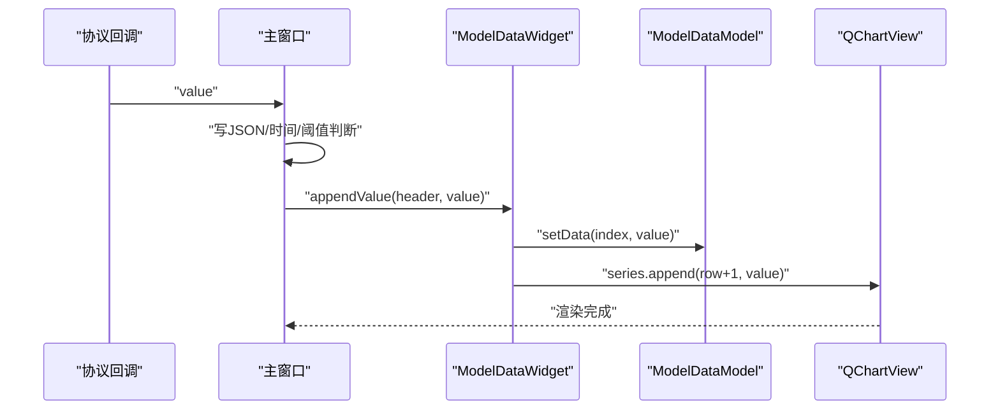
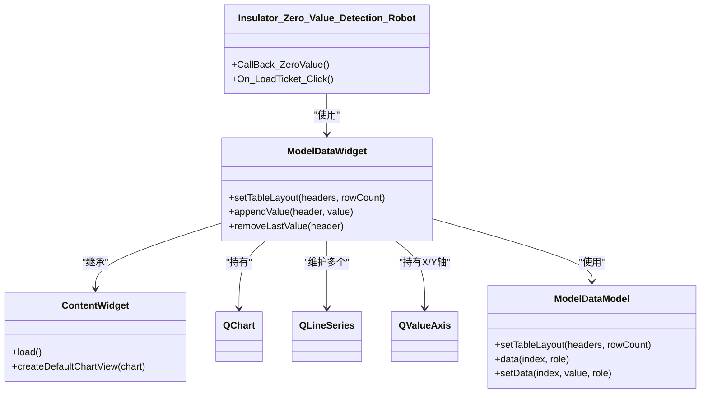

# 实时数据图表

<cite>
**本文引用的文件**
- [main.cpp](file://Insulator_Zero_Value_Detection_Robot/main.cpp)
- [Insulator_Zero_Value_Detection_Robot.h](file://Insulator_Zero_Value_Detection_Robot/UI/Insulator_Zero_Value_Detection_Robot.h)
- [Insulator_Zero_Value_Detection_Robot.cpp](file://Insulator_Zero_Value_Detection_Robot/UI/Insulator_Zero_Value_Detection_Robot.cpp)
- [contentwidget.h](file://Insulator_Zero_Value_Detection_Robot/UI/contentwidget.h)
- [contentwidget.cpp](file://Insulator_Zero_Value_Detection_Robot/UI/contentwidget.cpp)
- [modeldatawidget.h](file://Insulator_Zero_Value_Detection_Robot/UI/modeldatawidget.h)
- [modeldatawidget.cpp](file://Insulator_Zero_Value_Detection_Robot/UI/modeldatawidget.cpp)
- [modeldatamodel.h](file://Insulator_Zero_Value_Detection_Robot/UI/modeldatamodel.h)
- [modeldatamodel.cpp](file://Insulator_Zero_Value_Detection_Robot/UI/modeldatamodel.cpp)
</cite>

## 目录
1. [简介](#简介)
2. [项目结构](#项目结构)
3. [核心组件](#核心组件)
4. [架构总览](#架构总览)
5. [详细组件分析](#详细组件分析)
6. [依赖关系分析](#依赖关系分析)
7. [性能考虑](#性能考虑)
8. [故障排查指南](#故障排查指南)
9. [结论](#结论)
10. [附录](#附录)

## 简介
本章节面向“零值绝缘子检测机器人”的实时数据图表功能，聚焦基于 Qt Charts 的数据可视化能力。该功能以表格与折线图联动的方式，展示每片绝缘子的测量值随时间（片号）的变化趋势，支持：
- 动态添加数据点并自动扩展纵轴范围
- 横坐标按片号固定为 1..N，便于对齐物理位置
- 多列（多相别、内外侧）曲线并行显示，颜色与表格单元格背景色一致
- 从协议线程到 UI 线程的安全数据投递，保证界面流畅更新
- 历史数据回填与重测删除等交互能力

## 项目结构
本项目采用分层组织：UI 层包含主窗口、通用图表容器与模型驱动的数据视图；业务逻辑集中在主窗口中处理设备通信、工单与报告管理；图表相关代码位于 UI 模块内，通过 ModelDataWidget 将 QTableView 与 QChartView 组合展示。

图示来源
- [main.cpp:11-24](file://Insulator_Zero_Value_Detection_Robot/main.cpp#L11-L24)
- [Insulator_Zero_Value_Detection_Robot.h:26-385](file://Insulator_Zero_Value_Detection_Robot/UI/Insulator_Zero_Value_Detection_Robot.h#L26-L385)
- [contentwidget.h:12-32](file://Insulator_Zero_Value_Detection_Robot/UI/contentwidget.h#L12-L32)
- [modeldatawidget.h:20-49](file://Insulator_Zero_Value_Detection_Robot/UI/modeldatawidget.h#L20-L49)
- [modeldatamodel.h:12-39](file://Insulator_Zero_Value_Detection_Robot/UI/modeldatamodel.h#L12-L39)

章节来源
- [main.cpp:11-24](file://Insulator_Zero_Value_Detection_Robot/main.cpp#L11-L24)
- [Insulator_Zero_Value_Detection_Robot.h:26-385](file://Insulator_Zero_Value_Detection_Robot/UI/Insulator_Zero_Value_Detection_Robot.h#L26-L385)

## 核心组件
- ContentWidget：提供统一的图表容器初始化、默认 QChartView 创建与自适应布局能力。
- ModelDataWidget：组合 QTableView 与 QChartView，维护多组 QLineSeries，实现“表头即列名、行即片号”的二维数据映射，并在 appendValue/removeLastValue 时同步更新表格与曲线。
- ModelDataModel：自定义 QAbstractTableModel，承载 NaN 占位的二维数据，支持按区域映射背景色，使表格与曲线颜色一致。
- 主窗口：负责从协议回调接收测量值，计算当前列头（含侧别/相别/内外侧），并通过跨线程调用将数据注入 ModelDataWidget。

章节来源
- [contentwidget.cpp:17-63](file://Insulator_Zero_Value_Detection_Robot/UI/contentwidget.cpp#L17-L63)
- [modeldatawidget.cpp:24-187](file://Insulator_Zero_Value_Detection_Robot/UI/modeldatawidget.cpp#L24-L187)
- [modeldatamodel.cpp:20-113](file://Insulator_Zero_Value_Detection_Robot/UI/modeldatamodel.cpp#L20-L113)
- [Insulator_Zero_Value_Detection_Robot.cpp:700-818](file://Insulator_Zero_Value_Detection_Robot/UI/Insulator_Zero_Value_Detection_Robot.cpp#L700-L818)

## 架构总览
下图展示了从设备测量结果到图表更新的完整时序：协议回调在协议线程收到测量值后，先写入工单 JSON，再切换到 UI 线程刷新表格与曲线，同时根据阈值生成告警与状态指示。

图示来源
- [Insulator_Zero_Value_Detection_Robot.cpp:675-818](file://Insulator_Zero_Value_Detection_Robot/UI/Insulator_Zero_Value_Detection_Robot.cpp#L675-L818)
- [modeldatawidget.cpp:139-166](file://Insulator_Zero_Value_Detection_Robot/UI/modeldatawidget.cpp#L139-L166)

## 详细组件分析

### 图表容器 ContentWidget
- 职责：统一创建 QChartView、设置抗锯齿、响应尺寸变化。
- 关键点：createDefaultChartView 封装了 QChartView 的创建与渲染提示设置；resizeEvent 确保图表视图跟随容器大小变化。

章节来源
- [contentwidget.h:12-32](file://Insulator_Zero_Value_Detection_Robot/UI/contentwidget.h#L12-L32)
- [contentwidget.cpp:17-63](file://Insulator_Zero_Value_Detection_Robot/UI/contentwidget.cpp#L17-L63)

### 模型数据视图 ModelDataWidget
- 职责：维护表格与曲线的一致性，提供 setTableLayout、appendValue、removeLastValue 三个核心接口。
- 数据结构：
  - m_series：每个表头对应一个 QLineSeries，名称即为表头文本。
  - m_axisX/m_axisY：横轴为片号（1..N），纵轴为测量值，初始范围由首次数据决定并动态扩展。
  - m_splitter：控制表格与曲线的宽度分配，表格宽度按表头文字长度自适应。
- 关键流程：
  - setTableLayout：清空旧曲线与映射，重建表格布局，为每列创建系列并绑定坐标轴。
  - appendValue：定位下一个空单元格填充，追加曲线点，动态调整 Y 轴范围（带 10% 或最小 1.0 的边距）。
  - removeLastValue：回退最近一次测量值，同步删除最后一个曲线点。

图示来源
- [modeldatawidget.cpp:139-166](file://Insulator_Zero_Value_Detection_Robot/UI/modeldatawidget.cpp#L139-L166)

章节来源
- [modeldatawidget.h:20-49](file://Insulator_Zero_Value_Detection_Robot/UI/modeldatawidget.h#L20-L49)
- [modeldatawidget.cpp:24-187](file://Insulator_Zero_Value_Detection_Robot/UI/modeldatawidget.cpp#L24-L187)

### 表格模型 ModelDataModel
- 职责：承载二维数据（NaN 表示未测量），提供表头与行列计数、数据读写、背景色映射。
- 特性：
  - setTableLayout：重置模型并初始化 NaN 矩阵。
  - data：DisplayRole/EditRole 返回数值或空；BackgroundRole 根据映射区域返回颜色。
  - addMapping：将颜色与矩形区域关联，用于高亮表格列。

章节来源
- [modeldatamodel.h:12-39](file://Insulator_Zero_Value_Detection_Robot/UI/modeldatamodel.h#L12-L39)
- [modeldatamodel.cpp:20-113](file://Insulator_Zero_Value_Detection_Robot/UI/modeldatamodel.cpp#L20-L113)

### 主窗口与实时数据流
- 数据来源：协议回调 CallBack_ZeroValue 在协议线程收到测量值。
- 数据处理：
  - 若处于定标流程，则走定标信号槽；否则作为工单测量值处理。
  - 记录 JSON 数据与起止时间，并根据阈值判断是否产生告警。
  - 构造列头（侧别+相别+内外侧），通过 QMetaObject::invokeMethod 切到 UI 线程调用 ModelDataWidget::appendValue。
- 历史数据回填：加载工单时，遍历 JSON 中的测量数组，逐条调用 appendValue 恢复表格与曲线。
- 重测删除：复测时调用 removeLastValue 删除最近一条数据及曲线点。

图示来源
- [Insulator_Zero_Value_Detection_Robot.cpp:675-818](file://Insulator_Zero_Value_Detection_Robot/UI/Insulator_Zero_Value_Detection_Robot.cpp#L675-L818)
- [modeldatawidget.cpp:139-166](file://Insulator_Zero_Value_Detection_Robot/UI/modeldatawidget.cpp#L139-L166)

章节来源
- [Insulator_Zero_Value_Detection_Robot.cpp:700-818](file://Insulator_Zero_Value_Detection_Robot/UI/Insulator_Zero_Value_Detection_Robot.cpp#L700-L818)
- [Insulator_Zero_Value_Detection_Robot.cpp:1973-1993](file://Insulator_Zero_Value_Detection_Robot/UI/Insulator_Zero_Value_Detection_Robot.cpp#L1973-L1993)
- [Insulator_Zero_Value_Detection_Robot.cpp:2457-2483](file://Insulator_Zero_Value_Detection_Robot/UI/Insulator_Zero_Value_Detection_Robot.cpp#L2457-L2483)

## 依赖关系分析
- 主窗口依赖 ContentWidget/ModelDataWidget 进行图表展示。
- ModelDataWidget 依赖 QChart/QLineSeries/QValueAxis 进行绘制。
- ModelDataModel 继承自 QAbstractTableModel，被 QTableView 使用。
- 所有跨线程操作通过 QMetaObject::invokeMethod 切换至 UI 线程，避免直接操作界面导致的竞态。

图示来源
- [Insulator_Zero_Value_Detection_Robot.h:26-385](file://Insulator_Zero_Value_Detection_Robot/UI/Insulator_Zero_Value_Detection_Robot.h#L26-L385)
- [contentwidget.h:12-32](file://Insulator_Zero_Value_Detection_Robot/UI/contentwidget.h#L12-L32)
- [modeldatawidget.h:20-49](file://Insulator_Zero_Value_Detection_Robot/UI/modeldatawidget.h#L20-L49)
- [modeldatamodel.h:12-39](file://Insulator_Zero_Value_Detection_Robot/UI/modeldatamodel.h#L12-L39)

章节来源
- [Insulator_Zero_Value_Detection_Robot.h:26-385](file://Insulator_Zero_Value_Detection_Robot/UI/Insulator_Zero_Value_Detection_Robot.h#L26-L385)
- [modeldatawidget.h:20-49](file://Insulator_Zero_Value_Detection_Robot/UI/modeldatawidget.h#L20-L49)
- [modeldatamodel.h:12-39](file://Insulator_Zero_Value_Detection_Robot/UI/modeldatamodel.h#L12-L39)

## 性能考虑
- 数据追加策略：每次新增数据仅追加一个点，避免批量重绘开销；Y 轴范围增量扩展减少重排成本。
- 跨线程更新：协议回调不直接操作 UI，通过队列连接切换到 UI 线程执行，降低锁竞争与卡顿。
- 表格与曲线一致性：通过 ModelDataModel 的 NaN 占位与映射机制，减少无效渲染。
- 布局优化：表格宽度按表头文字自适应，曲线图占据剩余空间，避免不必要的 resize 抖动。
- 建议优化方向（如需大数据量场景）：
  - 对高频数据采用滑动窗口或降采样策略，限制系列点数上限。
  - 使用 QScatterSeries 替代 QLineSeries 在极大数据量时提升渲染性能。
  - 合并多次 append 为批量更新，减少信号触发次数。
  - 关闭动画或降低动画级别以提升刷新频率下的稳定性。

[本节为通用性能指导，不直接引用具体文件]

## 故障排查指南
- 现象：曲线不更新或表格空白
  - 检查 setTableLayout 是否正确调用，headers 与 rowCount 是否与工单配置一致。
  - 确认 appendValue 的 header 与建表时的列头完全一致（含侧别/内外侧后缀）。
- 现象：纵轴范围异常
  - 首次数据会初始化 yMin/yMax，后续按最大值/最小值扩展；如出现跳变，检查是否有极端异常值。
- 现象：界面卡顿
  - 确认数据回调是否通过 QMetaObject::invokeMethod 切到 UI 线程；避免在协议线程直接操作界面。
- 现象：重测删除无效
  - 检查 removeLastValue 的 header 是否与当前列头一致；确认 series.points() 非空后再删除。

章节来源
- [modeldatawidget.cpp:139-187](file://Insulator_Zero_Value_Detection_Robot/UI/modeldatawidget.cpp#L139-L187)
- [Insulator_Zero_Value_Detection_Robot.cpp:700-818](file://Insulator_Zero_Value_Detection_Robot/UI/Insulator_Zero_Value_Detection_Robot.cpp#L700-L818)

## 结论
该实时数据图表功能以 ModelDataWidget 为核心，结合 QTableView 与 QChartView，实现了“表-图”一致的可视化体验。通过协议回调到 UI 线程的安全切换、动态纵轴扩展与历史数据回填，满足了现场检测中对实时性与可追溯性的要求。未来可在大数据量场景引入滑动窗口、降采样与更高效的序列类型，进一步提升性能与交互体验。

[本节为总结性内容，不直接引用具体文件]

## 附录
- 常用接口路径参考：
  - 图表容器初始化：[contentwidget.cpp:17-63](file://Insulator_Zero_Value_Detection_Robot/UI/contentwidget.cpp#L17-L63)
  - 表格与曲线联动：[modeldatawidget.cpp:71-120](file://Insulator_Zero_Value_Detection_Robot/UI/modeldatawidget.cpp#L71-L120)
  - 数据追加与轴范围扩展：[modeldatawidget.cpp:139-166](file://Insulator_Zero_Value_Detection_Robot/UI/modeldatawidget.cpp#L139-L166)
  - 历史数据回填：[Insulator_Zero_Value_Detection_Robot.cpp:1973-1993](file://Insulator_Zero_Value_Detection_Robot/UI/Insulator_Zero_Value_Detection_Robot.cpp#L1973-L1993)
  - 实时数据流入口：[Insulator_Zero_Value_Detection_Robot.cpp:675-818](file://Insulator_Zero_Value_Detection_Robot/UI/Insulator_Zero_Value_Detection_Robot.cpp#L675-L818)