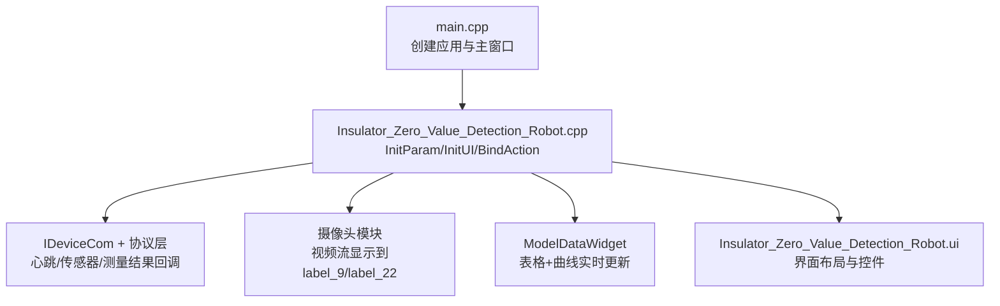
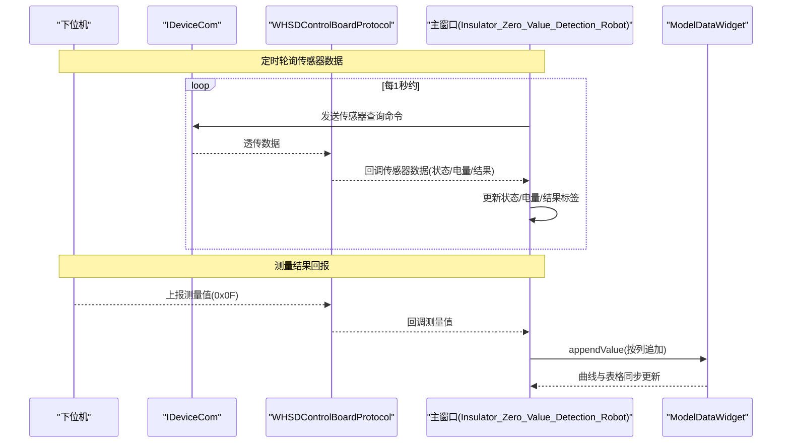
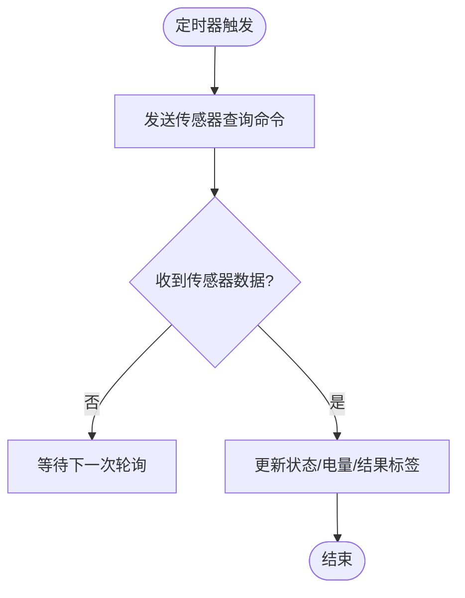
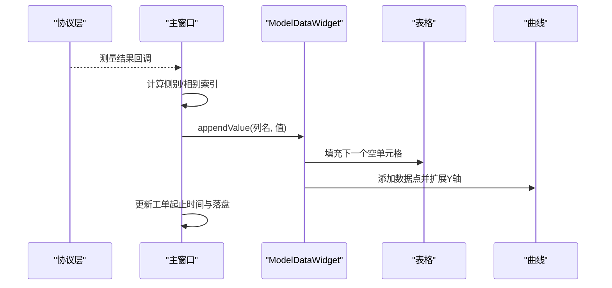
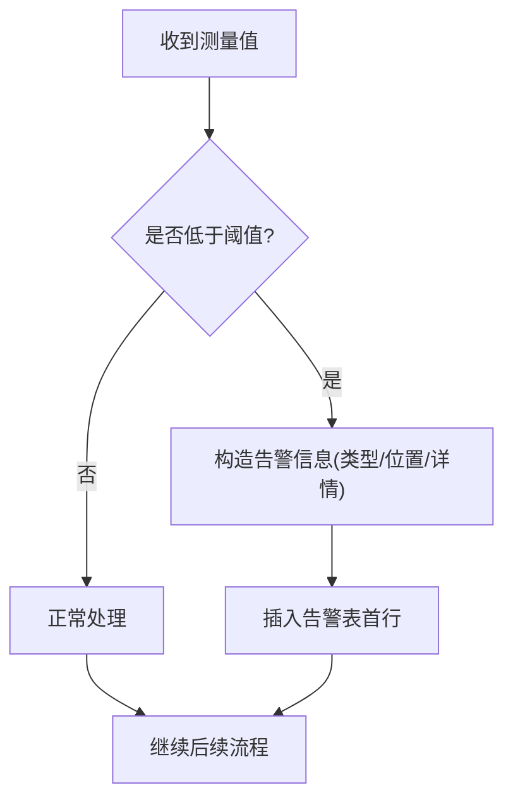
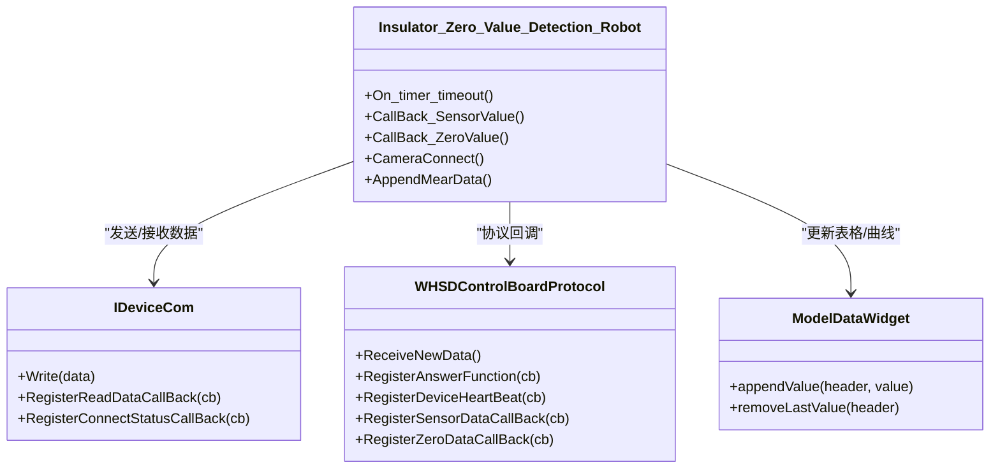

# 实时监控面板

<cite>
**本文引用的文件**
- [main.cpp](file://Insulator_Zero_Value_Detection_Robot/main.cpp)
- [Insulator_Zero_Value_Detection_Robot.h](file://Insulator_Zero_Value_Detection_Robot/UI/Insulator_Zero_Value_Detection_Robot.h)
- [Insulator_Zero_Value_Detection_Robot.cpp](file://Insulator_Zero_Value_Detection_Robot/UI/Insulator_Zero_Value_Detection_Robot.cpp)
- [Insulator_Zero_Value_Detection_Robot.ui](file://Insulator_Zero_Value_Detection_Robot/UI/Insulator_Zero_Value_Detection_Robot.ui)
- [contentwidget.h](file://Insulator_Zero_Value_Detection_Robot/UI/contentwidget.h)
- [contentwidget.cpp](file://Insulator_Zero_Value_Detection_Robot/UI/contentwidget.cpp)
- [modeldatawidget.h](file://Insulator_Zero_Value_Detection_Robot/UI/modeldatawidget.h)
- [modeldatawidget.cpp](file://Insulator_Zero_Value_Detection_Robot/UI/modeldatawidget.cpp)
- [modeldatamodel.h](file://Insulator_Zero_Value_Detection_Robot/UI/modeldatamodel.h)
- [modeldatamodel.cpp](file://Insulator_Zero_Value_Detection_Robot/UI/modeldatamodel.cpp)
</cite>

## 目录
1. [简介](#简介)
2. [项目结构](#项目结构)
3. [核心组件](#核心组件)
4. [架构总览](#架构总览)
5. [详细组件分析](#详细组件分析)
6. [依赖关系分析](#依赖关系分析)
7. [性能与刷新机制](#性能与刷新机制)
8. [故障诊断指南](#故障诊断指南)
9. [结论](#结论)
10. [附录：监控面板使用技巧与配置](#附录：监控面板使用技巧与配置)

## 简介
本文件面向“绝缘子零值检测机器人V2”的实时监控面板，聚焦于界面中设备状态、电池电量、通信质量、检测进度等实时信息的展示与交互。文档从系统架构、数据流、刷新频率、告警提示、历史数据查看与分析等方面，提供可操作的使用说明与排障建议，帮助用户高效掌握监控面板的各项功能。

## 项目结构
本项目采用Qt框架构建桌面应用，主窗口负责UI布局与事件绑定，协议层负责与下位机通信，摄像头模块负责视频流显示，图表与表格用于实时数据可视化。关键入口与UI初始化如下：
- 程序入口创建主窗口并进入事件循环
- 主窗口初始化参数、绑定定时器与控件动作、建立通信与协议回调、启动摄像头取流
- UI通过QSplitter划分视频区与标签页区域，支持拖拽调整比例

**图示来源**
- [main.cpp:11-23](file://Insulator_Zero_Value_Detection_Robot/main.cpp#L11-L23)
- [Insulator_Zero_Value_Detection_Robot.cpp:88-95](file://Insulator_Zero_Value_Detection_Robot/UI/Insulator_Zero_Value_Detection_Robot.cpp#L88-L95)
- [Insulator_Zero_Value_Detection_Robot.cpp:104-229](file://Insulator_Zero_Value_Detection_Robot/UI/Insulator_Zero_Value_Detection_Robot.cpp#L104-L229)
- [Insulator_Zero_Value_Detection_Robot.ui:19-350](file://Insulator_Zero_Value_Detection_Robot/UI/Insulator_Zero_Value_Detection_Robot.ui#L19-L350)

**章节来源**
- [main.cpp:11-23](file://Insulator_Zero_Value_Detection_Robot/main.cpp#L11-L23)
- [Insulator_Zero_Value_Detection_Robot.cpp:88-229](file://Insulator_Zero_Value_Detection_Robot/UI/Insulator_Zero_Value_Detection_Robot.cpp#L88-L229)
- [Insulator_Zero_Value_Detection_Robot.ui:19-350](file://Insulator_Zero_Value_Detection_Robot/UI/Insulator_Zero_Value_Detection_Robot.ui#L19-L350)

## 核心组件
- 主窗口类：负责UI初始化、定时器、通信注册、摄像头连接、测量流程控制、告警与工单/报告管理。
- 模型与视图：ModelDataModel/ModelDataWidget实现表格与曲线的联动更新；ContentWidget作为图表容器基类。
- 通信与协议：通过IDeviceCom与WHSDControlBoardProtocol接收心跳、传感器数据、测量结果，并转发至UI线程更新。
- 摄像头：根据配置选择新旧摄像头接入方式，将视频帧渲染到指定Label。

**章节来源**
- [Insulator_Zero_Value_Detection_Robot.h:26-385](file://Insulator_Zero_Value_Detection_Robot/UI/Insulator_Zero_Value_Detection_Robot.h#L26-L385)
- [Insulator_Zero_Value_Detection_Robot.cpp:231-315](file://Insulator_Zero_Value_Detection_Robot/UI/Insulator_Zero_Value_Detection_Robot.cpp#L231-L315)
- [modeldatawidget.h:20-49](file://Insulator_Zero_Value_Detection_Robot/UI/modeldatawidget.h#L20-L49)
- [modeldatawidget.cpp:24-120](file://Insulator_Zero_Value_Detection_Robot/UI/modeldatawidget.cpp#L24-L120)
- [contentwidget.h:12-32](file://Insulator_Zero_Value_Detection_Robot/UI/contentwidget.h#L12-L32)
- [contentwidget.cpp:17-63](file://Insulator_Zero_Value_Detection_Robot/UI/contentwidget.cpp#L17-L63)

## 架构总览
实时监控面板的数据流由“设备→协议→UI”构成，UI侧通过定时器轮询与回调驱动刷新。

**图示来源**
- [Insulator_Zero_Value_Detection_Robot.cpp:413-424](file://Insulator_Zero_Value_Detection_Robot/UI/Insulator_Zero_Value_Detection_Robot.cpp#L413-L424)
- [Insulator_Zero_Value_Detection_Robot.cpp:649-673](file://Insulator_Zero_Value_Detection_Robot/UI/Insulator_Zero_Value_Detection_Robot.cpp#L649-L673)
- [Insulator_Zero_Value_Detection_Robot.cpp:675-753](file://Insulator_Zero_Value_Detection_Robot/UI/Insulator_Zero_Value_Detection_Robot.cpp#L675-L753)
- [modeldatawidget.cpp:139-166](file://Insulator_Zero_Value_Detection_Robot/UI/modeldatawidget.cpp#L139-L166)

## 详细组件分析

### 设备状态与通信质量指示
- 连接状态：通过通信回调更新“已连接/未连接”，并在界面标签显示。
- 心跳计数：累计心跳次数，便于判断通信是否持续。
- 电机与安全状态：解析心跳中的行走电机与安全电机状态，转换为“停止/运行/故障”等文本。
- 电源与电池：显示主电源开关状态与电池百分比；若数值异常则显示“未知”。

**图示来源**
- [Insulator_Zero_Value_Detection_Robot.cpp:413-559](file://Insulator_Zero_Value_Detection_Robot/UI/Insulator_Zero_Value_Detection_Robot.cpp#L413-L559)

**章节来源**
- [Insulator_Zero_Value_Detection_Robot.cpp:413-559](file://Insulator_Zero_Value_Detection_Robot/UI/Insulator_Zero_Value_Detection_Robot.cpp#L413-L559)
- [Insulator_Zero_Value_Detection_Robot.cpp:635-640](file://Insulator_Zero_Value_Detection_Robot/UI/Insulator_Zero_Value_Detection_Robot.cpp#L635-L640)

### 电池电量显示
- 电池电量来自心跳或传感器回调，超过阈值时显示“未知”，否则显示具体数值。
- 支持在设置中保存绝缘阈值，影响低值告警判定。

**章节来源**
- [Insulator_Zero_Value_Detection_Robot.cpp:486-503](file://Insulator_Zero_Value_Detection_Robot/UI/Insulator_Zero_Value_Detection_Robot.cpp#L486-L503)
- [Insulator_Zero_Value_Detection_Robot.cpp:649-673](file://Insulator_Zero_Value_Detection_Robot/UI/Insulator_Zero_Value_Detection_Robot.cpp#L649-L673)

### 检测进度跟踪与结果展示
- 测量结果到达后，叠加显示当前检测结果，并写入工单测量数据JSON。
- 表格与曲线同步更新：每获得一个测量值，填充对应列的空单元格，并绘制曲线点；纵轴范围动态扩展。
- 双联模式：内侧/外侧分别记录，表头加入侧别维度，便于区分。

**图示来源**
- [Insulator_Zero_Value_Detection_Robot.cpp:675-753](file://Insulator_Zero_Value_Detection_Robot/UI/Insulator_Zero_Value_Detection_Robot.cpp#L675-L753)
- [modeldatawidget.cpp:139-166](file://Insulator_Zero_Value_Detection_Robot/UI/modeldatawidget.cpp#L139-L166)

**章节来源**
- [Insulator_Zero_Value_Detection_Robot.cpp:675-753](file://Insulator_Zero_Value_Detection_Robot/UI/Insulator_Zero_Value_Detection_Robot.cpp#L675-L753)
- [modeldatawidget.cpp:139-166](file://Insulator_Zero_Value_Detection_Robot/UI/modeldatawidget.cpp#L139-L166)

### 异常情况报警提示
- 当测量值低于绝缘阈值时，生成“零值/低值”告警，包含位置与详情。
- 告警插入到告警表首行，便于快速定位问题。

**图示来源**
- [Insulator_Zero_Value_Detection_Robot.cpp:755-767](file://Insulator_Zero_Value_Detection_Robot/UI/Insulator_Zero_Value_Detection_Robot.cpp#L755-L767)

**章节来源**
- [Insulator_Zero_Value_Detection_Robot.cpp:755-767](file://Insulator_Zero_Value_Detection_Robot/UI/Insulator_Zero_Value_Detection_Robot.cpp#L755-L767)

### 历史数据的查看与分析
- 工单与报告列表支持过滤与重置，便于回顾历史任务。
- 每次测量值写入工单JSON，并自动更新起止时间；支持删除与重测以修正数据。
- 曲线与表格提供直观的历史趋势对比，支持按列（侧别/相别）观察。

**章节来源**
- [Insulator_Zero_Value_Detection_Robot.cpp:710-753](file://Insulator_Zero_Value_Detection_Robot/UI/Insulator_Zero_Value_Detection_Robot.cpp#L710-L753)
- [modeldatawidget.cpp:71-120](file://Insulator_Zero_Value_Detection_Robot/UI/modeldatawidget.cpp#L71-L120)

## 依赖关系分析
- 主窗口依赖通信接口与协议层进行数据收发，依赖摄像头模块进行视频显示，依赖图表与表格组件进行数据可视化。
- 定时器驱动轮询与输入处理，确保界面响应及时。

**图示来源**
- [Insulator_Zero_Value_Detection_Robot.h:26-385](file://Insulator_Zero_Value_Detection_Robot/UI/Insulator_Zero_Value_Detection_Robot.h#L26-L385)
- [Insulator_Zero_Value_Detection_Robot.cpp:231-315](file://Insulator_Zero_Value_Detection_Robot/UI/Insulator_Zero_Value_Detection_Robot.cpp#L231-L315)
- [modeldatawidget.h:20-49](file://Insulator_Zero_Value_Detection_Robot/UI/modeldatawidget.h#L20-L49)

**章节来源**
- [Insulator_Zero_Value_Detection_Robot.h:26-385](file://Insulator_Zero_Value_Detection_Robot/UI/Insulator_Zero_Value_Detection_Robot.h#L26-L385)
- [Insulator_Zero_Value_Detection_Robot.cpp:231-315](file://Insulator_Zero_Value_Detection_Robot/UI/Insulator_Zero_Value_Detection_Robot.cpp#L231-L315)
- [modeldatawidget.h:20-49](file://Insulator_Zero_Value_Detection_Robot/UI/modeldatawidget.h#L20-L49)

## 性能与刷新机制
- 定时器周期：主定时器100ms，输入定时器10ms；传感器查询约每秒一次，避免频繁通信造成负载。
- 数据更新策略：仅在收到有效数据时更新UI；曲线纵轴动态扩展，减少重绘开销。
- 录像与截图：录制期间缓存帧，停止后统一编码；截图文件名含内测/外侧标记与时间戳。

**章节来源**
- [Insulator_Zero_Value_Detection_Robot.cpp:317-329](file://Insulator_Zero_Value_Detection_Robot/UI/Insulator_Zero_Value_Detection_Robot.cpp#L317-L329)
- [Insulator_Zero_Value_Detection_Robot.cpp:413-424](file://Insulator_Zero_Value_Detection_Robot/UI/Insulator_Zero_Value_Detection_Robot.cpp#L413-L424)
- [modeldatawidget.cpp:139-166](file://Insulator_Zero_Value_Detection_Robot/UI/modeldatawidget.cpp#L139-L166)

## 故障诊断指南
- 连接异常：检查“已连接/未连接”标签与心跳计数；确认IP与端口配置正确。
- 无传感器数据：确认定时器是否工作、传感器查询命令是否发出；查看日志输出。
- 测量结果不更新：检查回调是否切到UI线程；确认表格列名与侧别/相别匹配。
- 告警过多：核对绝缘阈值设置；确认是否为真实低值情况。

**章节来源**
- [Insulator_Zero_Value_Detection_Robot.cpp:413-559](file://Insulator_Zero_Value_Detection_Robot/UI/Insulator_Zero_Value_Detection_Robot.cpp#L413-L559)
- [Insulator_Zero_Value_Detection_Robot.cpp:635-640](file://Insulator_Zero_Value_Detection_Robot/UI/Insulator_Zero_Value_Detection_Robot.cpp#L635-L640)
- [Insulator_Zero_Value_Detection_Robot.cpp:755-767](file://Insulator_Zero_Value_Detection_Robot/UI/Insulator_Zero_Value_Detection_Robot.cpp#L755-L767)

## 结论
实时监控面板通过定时器轮询与协议回调实现了设备状态、电池电量、通信质量与检测进度的实时展示。结合表格与曲线，用户可直观跟踪检测过程并进行历史数据分析。合理的刷新频率与数据更新策略保障了界面的流畅性与准确性。通过告警机制与故障诊断指南，用户可及时发现并处理问题，提升运维效率。

## 附录：监控面板使用技巧与配置
- 自定义显示内容与布局
  - 通过QSplitter调整视频区与标签页比例，适应不同屏幕尺寸。
  - 表格列宽按表头文字宽度自适应，可通过拖拽微调。
- 刷新频率与时效性
  - 传感器查询约每秒一次，测量结果到达后立即更新；曲线纵轴动态扩展，保证最新数据可见。
- 历史数据回顾
  - 使用工单与报告列表的过滤功能快速定位历史任务；曲线与表格支持对比分析。
- 常见问题排查
  - 连接状态为“未连接”：检查网络与IP配置；查看心跳计数是否增长。
  - 无测量结果：确认测量流程是否触发；检查回调是否切到UI线程。
  - 告警误报：核对绝缘阈值设置；确认是否为真实低值情况。

**章节来源**
- [Insulator_Zero_Value_Detection_Robot.cpp:104-229](file://Insulator_Zero_Value_Detection_Robot/UI/Insulator_Zero_Value_Detection_Robot.cpp#L104-L229)
- [modeldatawidget.cpp:71-120](file://Insulator_Zero_Value_Detection_Robot/UI/modeldatawidget.cpp#L71-L120)
- [Insulator_Zero_Value_Detection_Robot.cpp:413-559](file://Insulator_Zero_Value_Detection_Robot/UI/Insulator_Zero_Value_Detection_Robot.cpp#L413-L559)