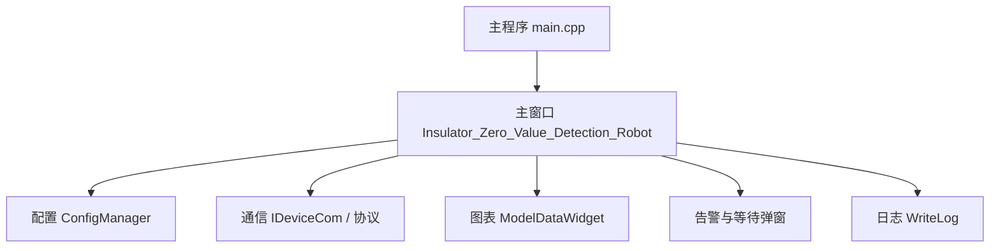
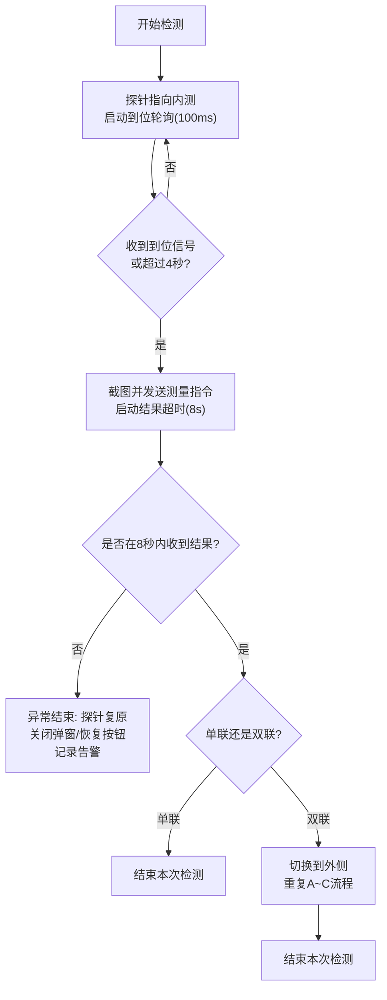
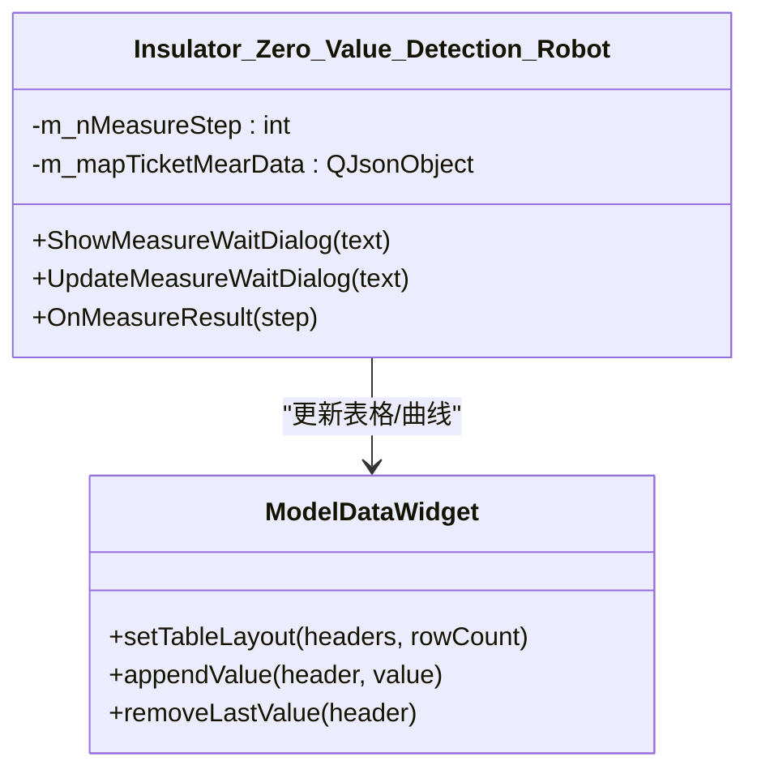
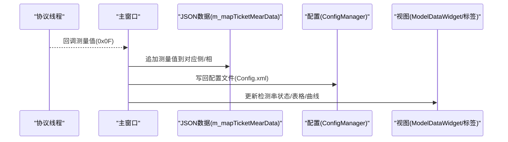
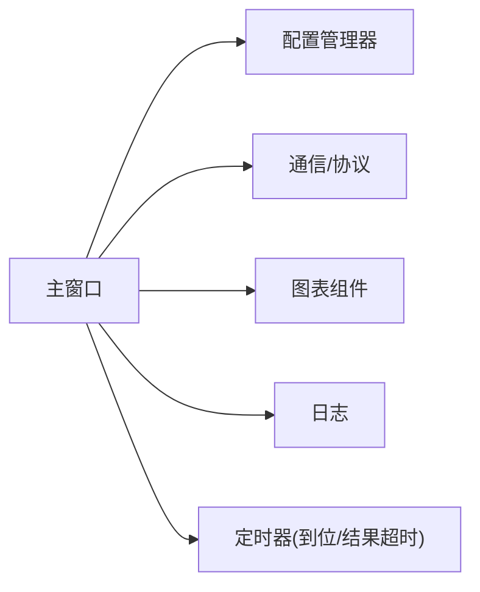

# 检测进度跟踪

<cite>
**本文引用的文件**
- [main.cpp](file://Insulator_Zero_Value_Detection_Robot/main.cpp)
- [Insulator_Zero_Value_Detection_Robot.h](file://Insulator_Zero_Value_Detection_Robot/UI/Insulator_Zero_Value_Detection_Robot.h)
- [Insulator_Zero_Value_Detection_Robot.cpp](file://Insulator_Zero_Value_Detection_Robot/UI/Insulator_Zero_Value_Detection_Robot.cpp)
- [ConfigManager.h](file://Insulator_Zero_Value_Detection_Robot/Config/ConfigManager.h)
- [modeldatawidget.h](file://Insulator_Zero_Value_Detection_Robot/UI/modeldatawidget.h)
- [modeldatawidget.cpp](file://Insulator_Zero_Value_Detection_Robot/UI/modeldatawidget.cpp)
- [contentwidget.h](file://Insulator_Zero_Value_Detection_Robot/UI/contentwidget.h)
- [操作说明书.md](file://操作说明书.md)
</cite>

## 目录
1. [简介](#简介)
2. [项目结构](#项目结构)
3. [核心组件](#核心组件)
4. [架构总览](#架构总览)
5. [详细组件分析](#详细组件分析)
6. [依赖关系分析](#依赖关系分析)
7. [性能考量](#性能考量)
8. [故障排查指南](#故障排查指南)
9. [结论](#结论)
10. [附录](#附录)

## 简介
本文件面向“绝缘子零值检测机器人”的检测进度跟踪功能，聚焦于检测任务的实时进度显示与状态管理。内容涵盖：
- 当前检测点位置、已完成数量、剩余工作量、预计完成时间的可视化表达（进度条、环形图、数字计数等）
- 检测流程的状态机（待机、检测中、暂停、完成）及进度计算逻辑
- 检测数据的实时更新机制（测量值获取、验证、存储、显示）
- 历史查询与对比分析能力，支持多任务并行时的进度管理
- 异常处理与中断恢复策略（设备故障、数据异常等）

## 项目结构
本项目采用分层组织：UI层负责界面与交互；配置层管理工单、报告与设备参数；协议与通信层负责与控制板通信；日志与报表用于记录与输出。进度跟踪贯穿UI与业务逻辑，通过定时器、状态变量与数据模型驱动。



图示来源
- [main.cpp:11-23](file://Insulator_Zero_Value_Detection_Robot/main.cpp#L11-L23)
- [Insulator_Zero_Value_Detection_Robot.h:26-22](file://Insulator_Zero_Value_Detection_Robot/UI/Insulator_Zero_Value_Detection_Robot.h#L26-L22)

章节来源
- [main.cpp:11-23](file://Insulator_Zero_Value_Detection_Robot/main.cpp#L11-L23)

## 核心组件
- 主窗口类：承载检测流程状态机、定时器、等待弹窗、告警面板、数据绑定与更新
- 配置管理器：维护控制板参数、相机参数、工单与报告集合
- 数据展示组件：表格+曲线图联动，按列（相别/方向）追加测量值并动态刷新
- 通信与协议：下发探针移动、测量指令，接收心跳与测量回报
- 日志与报告：记录关键事件、生成检测报告

章节来源
- [Insulator_Zero_Value_Detection_Robot.h:26-385](file://Insulator_Zero_Value_Detection_Robot/UI/Insulator_Zero_Value_Detection_Robot.h#L26-L385)
- [ConfigManager.h:10-199](file://Insulator_Zero_Value_Detection_Robot/Config/ConfigManager.h#L10-L199)
- [modeldatawidget.h:20-49](file://Insulator_Zero_Value_Detection_Robot/UI/modeldatawidget.h#L20-L49)

## 架构总览
检测进度跟踪由“状态机 + 定时器 + UI更新”构成闭环：
- 状态机：m_nMeasureStep 表示当前步骤（0=空闲，1=内测结果等待，2=外侧结果等待）
- 定时器：到位轮询定时器（周期触发）、结果超时定时器（单次）
- UI更新：等待弹窗文本、检测串状态方块颜色、表格与曲线图数据追加

```mermaid
sequenceDiagram
participant U as "用户"
participant W as "主窗口"
participant T1 as "到位轮询定时器"
participant T2 as "结果超时定时器"
participant P as "协议/下位机"
participant V as "视图(弹窗/标签/表格/曲线)"
U->>W : 点击检测
W->>V : 显示等待弹窗(探针指向内测,等待到位...)
W->>T1 : 启动到位轮询(周期100ms)
T1-->>W : 每周期检查到位或兜底超时
alt 收到到位信号或超时
W->>P : 发送测量指令
W->>V : 更新弹窗(正在执行第一次测量,等待结果...)
W->>T2 : 启动结果超时(8s)
P-->>W : 返回测量值(约3.2s)
W->>V : 更新检测串状态/表格/曲线
W->>W : 单联则结束;双联进入外侧流程
else 未到位且未到超时
T1-->>W : 继续轮询
end
T2-->>W : 若超时未收到结果
W->>V : 提示异常并结束
end
```

图示来源
- [Insulator_Zero_Value_Detection_Robot.cpp:67-73](file://Insulator_Zero_Value_Detection_Robot/UI/Insulator_Zero_Value_Detection_Robot.cpp#L67-L73)
- [Insulator_Zero_Value_Detection_Robot.cpp:2062-2139](file://Insulator_Zero_Value_Detection_Robot/UI/Insulator_Zero_Value_Detection_Robot.cpp#L2062-L2139)
- [Insulator_Zero_Value_Detection_Robot.cpp:2141-2176](file://Insulator_Zero_Value_Detection_Robot/UI/Insulator_Zero_Value_Detection_Robot.cpp#L2141-L2176)

## 详细组件分析

### 进度状态机与计时器
- 状态变量
  - m_nMeasureStep：0=空闲，1=等待内测结果，2=等待外侧结果
  - m_bProbeArrived：原子标志，表示探针到位信号到达
  - m_probeWaitStart：本轮到位等待起始时间，用于计算兜底超时
- 定时器
  - 到位轮询定时器：周期100ms，判断是否收到到位信号或超过4秒兜底等待
  - 结果超时定时器：单次8秒，若未收到测量回报则判定失败
- 推进逻辑
  - StartProbeMoveAndWait：记录待执行参数，启动到位轮询
  - TriggerMeasureAndArm：截图、下发测量指令、设置步骤、启动结果超时
  - OnMeasureResult：根据步骤推进（单联直接结束，双联进入外侧）
  - AbortMeasure：异常结束，探针复原、关闭弹窗、恢复按钮、记录告警



图示来源
- [Insulator_Zero_Value_Detection_Robot.cpp:2062-2139](file://Insulator_Zero_Value_Detection_Robot/UI/Insulator_Zero_Value_Detection_Robot.cpp#L2062-L2139)
- [Insulator_Zero_Value_Detection_Robot.cpp:2141-2176](file://Insulator_Zero_Value_Detection_Robot/UI/Insulator_Zero_Value_Detection_Robot.cpp#L2141-L2176)
- [Insulator_Zero_Value_Detection_Robot.cpp:2186-2229](file://Insulator_Zero_Value_Detection_Robot/UI/Insulator_Zero_Value_Detection_Robot.cpp#L2186-L2229)

章节来源
- [Insulator_Zero_Value_Detection_Robot.h:188-197](file://Insulator_Zero_Value_Detection_Robot/UI/Insulator_Zero_Value_Detection_Robot.h#L188-L197)
- [Insulator_Zero_Value_Detection_Robot.cpp:67-73](file://Insulator_Zero_Value_Detection_Robot/UI/Insulator_Zero_Value_Detection_Robot.cpp#L67-L73)
- [Insulator_Zero_Value_Detection_Robot.cpp:2062-2139](file://Insulator_Zero_Value_Detection_Robot/UI/Insulator_Zero_Value_Detection_Robot.cpp#L2062-L2139)
- [Insulator_Zero_Value_Detection_Robot.cpp:2141-2176](file://Insulator_Zero_Value_Detection_Robot/UI/Insulator_Zero_Value_Detection_Robot.cpp#L2141-L2176)
- [Insulator_Zero_Value_Detection_Robot.cpp:2186-2229](file://Insulator_Zero_Value_Detection_Robot/UI/Insulator_Zero_Value_Detection_Robot.cpp#L2186-L2229)

### 进度可视化与数据更新
- 检测串状态（进度条/环形图的替代实现）
  - 使用 labelInsideN/labelOutsideN 方块表示每片绝缘子的检测结果
  - 绿色：阻值≥阈值（合格），红色：阻值<阈值（异常）
  - 随测量值逐片点亮，直观反映“当前位置、已完成数量、剩余工作量”
- 表格与曲线（数字计数/趋势）
  - ModelDataWidget 按相别/方向建列，按片数建行
  - appendValue 将新测量值填入下一个空单元格，并在曲线上绘制点
  - 纵轴范围动态扩展，便于观察数值变化
- 等待弹窗与状态标签
  - ShowMeasureWaitDialog/UpdateMeasureWaitDialog 显示当前阶段提示
  - 状态标签在检测中切换为“检测中”，空闲为“待机”



图示来源
- [modeldatawidget.h:20-49](file://Insulator_Zero_Value_Detection_Robot/UI/modeldatawidget.h#L20-L49)
- [modeldatawidget.cpp:71-187](file://Insulator_Zero_Value_Detection_Robot/UI/modeldatawidget.cpp#L71-L187)
- [Insulator_Zero_Value_Detection_Robot.h:289-295](file://Insulator_Zero_Value_Detection_Robot/UI/Insulator_Zero_Value_Detection_Robot.h#L289-L295)

章节来源
- [modeldatawidget.cpp:71-187](file://Insulator_Zero_Value_Detection_Robot/UI/modeldatawidget.cpp#L71-L187)
- [Insulator_Zero_Value_Detection_Robot.cpp:2673-2719](file://Insulator_Zero_Value_Detection_Robot/UI/Insulator_Zero_Value_Detection_Robot.cpp#L2673-L2719)
- [操作说明书.md:167-182](file://操作说明书.md#L167-L182)

### 检测数据流：获取、验证、存储、显示
- 获取：协议线程回调测量结果（0x0F），切到UI线程槽处理
- 验证：根据阈值判断合格/异常，写入JSON数据结构
- 存储：回写到当前工单的 m_mapTicketMearData，并持久化到配置文件
- 显示：更新检测串状态方块、表格单元格、曲线点



图示来源
- [Insulator_Zero_Value_Detection_Robot.h:36-41](file://Insulator_Zero_Value_Detection_Robot/UI/Insulator_Zero_Value_Detection_Robot.h#L36-L41)
- [Insulator_Zero_Value_Detection_Robot.cpp:32-53](file://Insulator_Zero_Value_Detection_Robot/UI/Insulator_Zero_Value_Detection_Robot.cpp#L32-L53)
- [ConfigManager.h:185-199](file://Insulator_Zero_Value_Detection_Robot/Config/ConfigManager.h#L185-L199)

章节来源
- [Insulator_Zero_Value_Detection_Robot.h:36-41](file://Insulator_Zero_Value_Detection_Robot/UI/Insulator_Zero_Value_Detection_Robot.h#L36-L41)
- [Insulator_Zero_Value_Detection_Robot.cpp:32-53](file://Insulator_Zero_Value_Detection_Robot/UI/Insulator_Zero_Value_Detection_Robot.cpp#L32-L53)
- [ConfigManager.h:185-199](file://Insulator_Zero_Value_Detection_Robot/Config/ConfigManager.h#L185-L199)

### 进度指示方式与使用场景
- 进度条/环形图：以方块点亮形式体现“当前位置、已完成数量、剩余工作量”
  - 适用：直观展示每片绝缘子的检测进度与质量分布
- 数字计数：表格单元格填充数量与曲线点数
  - 适用：精确查看测量值与趋势变化
- 状态标签：检测中/待机
  - 适用：全局状态快速识别

章节来源
- [Insulator_Zero_Value_Detection_Robot.cpp:2673-2719](file://Insulator_Zero_Value_Detection_Robot/UI/Insulator_Zero_Value_Detection_Robot.cpp#L2673-L2719)
- [modeldatawidget.cpp:139-187](file://Insulator_Zero_Value_Detection_Robot/UI/modeldatawidget.cpp#L139-L187)
- [操作说明书.md:167-182](file://操作说明书.md#L167-L182)

### 多任务并行与历史查询
- 多任务并行：通过不同工单（CNewTicketConfig）隔离数据，每个工单拥有独立的 JSON 数据容器
- 历史查询：工单列表与报告列表支持检索、过滤、重置；加载工单后回填历史测量数据
- 对比分析：曲线图按列（相别/方向）绘制，便于对比不同相的阻值变化

章节来源
- [ConfigManager.h:52-183](file://Insulator_Zero_Value_Detection_Robot/Config/ConfigManager.h#L52-L183)
- [操作说明书.md:220-282](file://操作说明书.md#L220-L282)

### 异常处理与中断恢复
- 设备故障：控制板未连接或总电源未开启时，阻止进入检测流程并提示
- 数据异常：测量结果超时（8秒）自动结束，探针复原，关闭弹窗，恢复按钮，记录告警
- 中断恢复：所有定时器停止，状态清零，避免残留状态影响后续检测

章节来源
- [Insulator_Zero_Value_Detection_Robot.cpp:2053-2060](file://Insulator_Zero_Value_Detection_Robot/UI/Insulator_Zero_Value_Detection_Robot.cpp#L2053-L2060)
- [Insulator_Zero_Value_Detection_Robot.cpp:2141-2176](file://Insulator_Zero_Value_Detection_Robot/UI/Insulator_Zero_Value_Detection_Robot.cpp#L2141-L2176)

## 依赖关系分析
- 主窗口依赖配置管理器读取/写入工单与报告
- 主窗口依赖通信模块下发命令与接收回报
- 主窗口依赖图表组件更新表格与曲线
- 定时器与状态变量共同驱动进度推进



图示来源
- [Insulator_Zero_Value_Detection_Robot.h:225-235](file://Insulator_Zero_Value_Detection_Robot/UI/Insulator_Zero_Value_Detection_Robot.h#L225-L235)
- [Insulator_Zero_Value_Detection_Robot.h:301-313](file://Insulator_Zero_Value_Detection_Robot/UI/Insulator_Zero_Value_Detection_Robot.h#L301-L313)

章节来源
- [Insulator_Zero_Value_Detection_Robot.h:225-313](file://Insulator_Zero_Value_Detection_Robot/UI/Insulator_Zero_Value_Detection_Robot.h#L225-L313)

## 性能考量
- 定时器周期：到位轮询100ms，结果超时8s，兼顾响应与资源占用
- 数据更新：仅在收到测量值时更新UI，避免频繁刷新
- 图表渲染：曲线纵轴动态扩展，减少重绘开销
- 并发安全：原子变量与互斥锁保护跨线程读写（如录像帧缓存）

[本节提供通用指导，不直接分析具体文件]

## 故障排查指南
- 无法开始检测：检查控制板连接与总电源状态
- 检测卡住：确认到位轮询与结果超时定时器是否正常工作
- 数据不更新：检查测量回调是否到达UI线程，JSON数据是否正确追加
- 历史查询为空：确认工单已加载且数据已持久化

章节来源
- [Insulator_Zero_Value_Detection_Robot.cpp:2053-2060](file://Insulator_Zero_Value_Detection_Robot/UI/Insulator_Zero_Value_Detection_Robot.cpp#L2053-L2060)
- [Insulator_Zero_Value_Detection_Robot.cpp:2141-2176](file://Insulator_Zero_Value_Detection_Robot/UI/Insulator_Zero_Value_Detection_Robot.cpp#L2141-L2176)

## 结论
检测进度跟踪通过状态机、定时器与UI更新形成闭环，实现了实时、可靠、可追溯的检测过程管理。结合检测串状态方块、表格与曲线图，用户可直观掌握当前位置、已完成数量、剩余工作量与趋势变化。异常处理与中断恢复确保系统在设备故障或数据异常时仍能保持稳定。

[本节总结性内容，不直接分析具体文件]

## 附录
- 关键常量
  - 到位轮询周期：100ms
  - 到位兜底等待：4000ms
  - 测量结果超时：8000ms
- 关键状态
  - m_nMeasureStep：0=空闲，1=内测结果等待，2=外侧结果等待
- 关键UI
  - 等待弹窗：显示当前阶段提示
  - 检测串状态：方块颜色表示合格/异常
  - 表格与曲线：逐值追加，动态缩放

章节来源
- [Insulator_Zero_Value_Detection_Robot.cpp:67-73](file://Insulator_Zero_Value_Detection_Robot/UI/Insulator_Zero_Value_Detection_Robot.cpp#L67-L73)
- [Insulator_Zero_Value_Detection_Robot.h:294-313](file://Insulator_Zero_Value_Detection_Robot/UI/Insulator_Zero_Value_Detection_Robot.h#L294-L313)