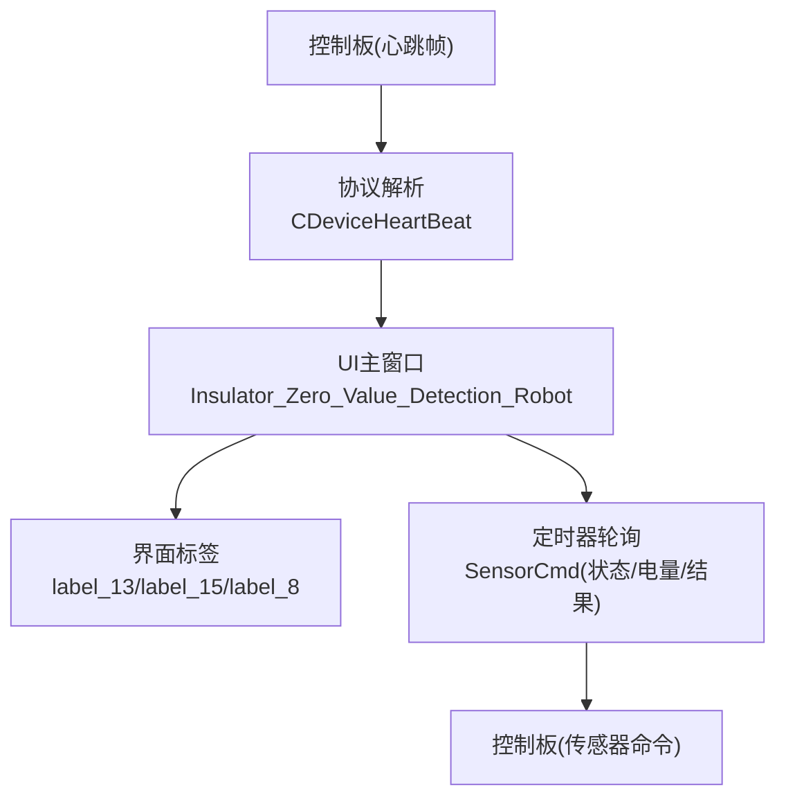
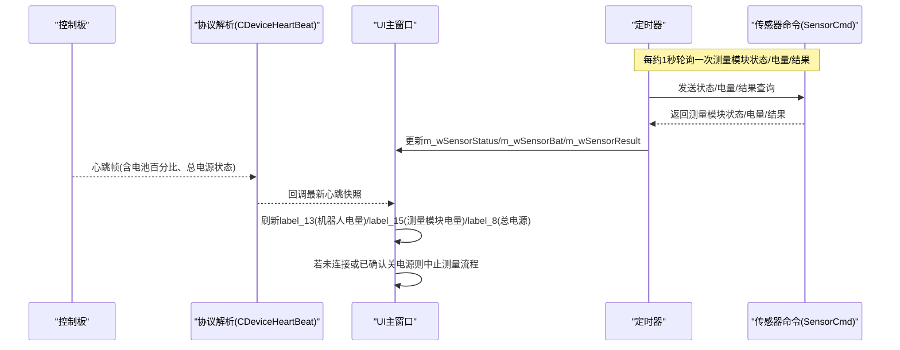
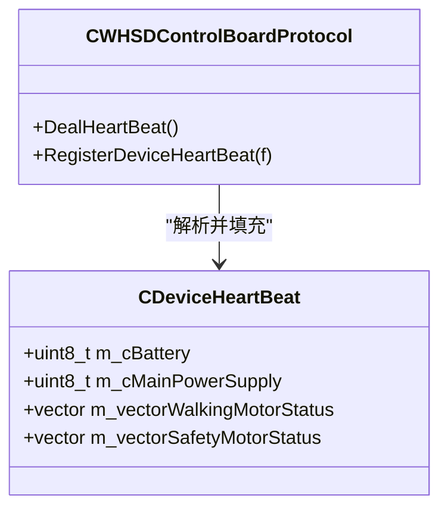
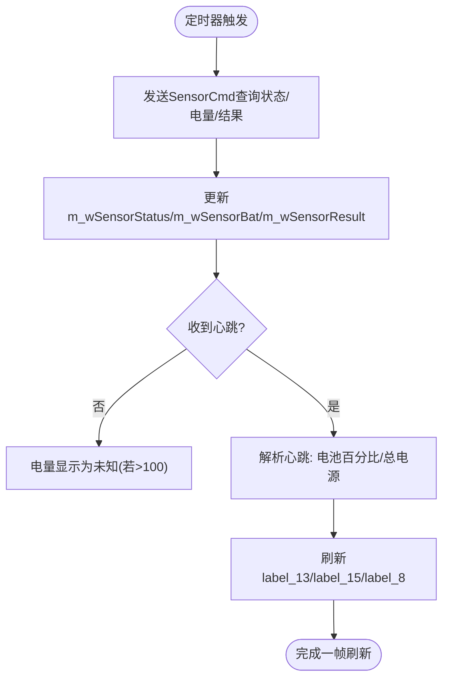
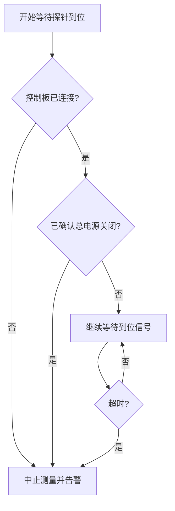
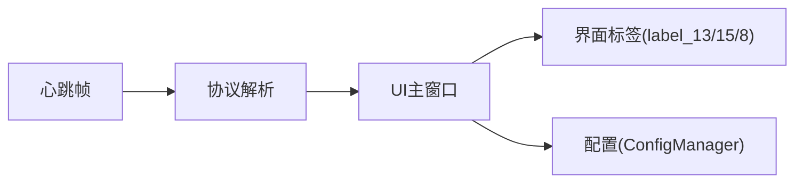

# 电池电量监控

<cite>
**本文引用的文件**
- [WHSDControlBoradProtocol.h](file://Insulator_Zero_Value_Detection_Robot/Protocol/WHSDControlBoradProtocol.h)
- [WHSDControlBoradProtocol.cpp](file://Insulator_Zero_Value_Detection_Robot/Protocol/WHSDControlBoradProtocol.cpp)
- [Insulator_Zero_Value_Detection_Robot.cpp](file://Insulator_Zero_Value_Detection_Robot/UI/Insulator_Zero_Value_Detection_Robot.cpp)
- [Insulator_Zero_Value_Detection_Robot.ui](file://Insulator_Zero_Value_Detection_Robot/UI/Insulator_Zero_Value_Detection_Robot.ui)
- [ConfigManager.h](file://Insulator_Zero_Value_Detection_Robot/Config/ConfigManager.h)
</cite>

## 目录
1. [简介](#简介)
2. [项目结构](#项目结构)
3. [核心组件](#核心组件)
4. [架构总览](#架构总览)
5. [详细组件分析](#详细组件分析)
6. [依赖关系分析](#依赖关系分析)
7. [性能与更新机制](#性能与更新机制)
8. [告警与阈值配置](#告警与阈值配置)
9. [故障诊断与建议](#故障诊断与建议)
10. [结论](#结论)

## 简介
本章节面向“电池电量监控”功能，说明机器人及测量模块的电量百分比显示、电压相关状态读取、数据更新频率与时效性、视觉反馈机制（低电量提示等）、健康评估与预测能力现状，以及告警配置与常见问题排查方法。该功能通过控制板心跳帧上报电池百分比与总电源状态，UI层定时轮询测量模块电量并刷新界面；同时提供安全策略：在未知或断电情况下中止测量，保障设备与人员安全。

## 项目结构
与电池电量监控直接相关的代码分布在协议解析、UI刷新与配置三部分：
- 协议层：负责解析控制板心跳帧中的电池百分比与总电源状态，并通过回调通知上层。
- UI层：定时器周期轮询测量模块电量与状态，并将心跳数据映射到界面标签进行显示。
- 配置层：提供控制板通信参数与阈值等配置项，便于后续扩展电量告警阈值。

图表来源
- [WHSDControlBoradProtocol.cpp:784-802](file://Insulator_Zero_Value_Detection_Robot/Protocol/WHSDControlBoradProtocol.cpp#L784-L802)
- [Insulator_Zero_Value_Detection_Robot.cpp:413-503](file://Insulator_Zero_Value_Detection_Robot/UI/Insulator_Zero_Value_Detection_Robot.cpp#L413-L503)
- [Insulator_Zero_Value_Detection_Robot.ui:894-1005](file://Insulator_Zero_Value_Detection_Robot/UI/Insulator_Zero_Value_Detection_Robot.ui#L894-L1005)

章节来源
- [WHSDControlBoradProtocol.h:121-181](file://Insulator_Zero_Value_Detection_Robot/Protocol/WHSDControlBoradProtocol.h#L121-L181)
- [WHSDControlBoradProtocol.cpp:110-120](file://Insulator_Zero_Value_Detection_Robot/Protocol/WHSDControlBoradProtocol.cpp#L110-L120)
- [Insulator_Zero_Value_Detection_Robot.cpp:413-503](file://Insulator_Zero_Value_Detection_Robot/UI/Insulator_Zero_Value_Detection_Robot.cpp#L413-L503)
- [Insulator_Zero_Value_Detection_Robot.ui:894-1005](file://Insulator_Zero_Value_Detection_Robot/UI/Insulator_Zero_Value_Detection_Robot.ui#L894-L1005)

## 核心组件
- 心跳数据结构：包含电池百分比、总电源开关状态等字段，用于承载控制板上报的设备状态。
- 心跳处理：解析心跳帧后填充上述结构，并通过回调将最新快照交给UI线程。
- UI刷新：定时器每约1秒轮询测量模块的状态、电量与结果，并将心跳快照写入界面标签。
- 安全判断：在未收到心跳或确认总电源关闭时，阻止危险操作（如探针到位等待期间自动中止）。

章节来源
- [WHSDControlBoradProtocol.h:121-181](file://Insulator_Zero_Value_Detection_Robot/Protocol/WHSDControlBoradProtocol.h#L121-L181)
- [WHSDControlBoradProtocol.cpp:784-802](file://Insulator_Zero_Value_Detection_Robot/Protocol/WHSDControlBoradProtocol.cpp#L784-L802)
- [Insulator_Zero_Value_Detection_Robot.cpp:413-503](file://Insulator_Zero_Value_Detection_Robot/UI/Insulator_Zero_Value_Detection_Robot.cpp#L413-L503)
- [Insulator_Zero_Value_Detection_Robot.cpp:1542-1553](file://Insulator_Zero_Value_Detection_Robot/UI/Insulator_Zero_Value_Detection_Robot.cpp#L1542-L1553)

## 架构总览
下图展示了从控制板心跳到UI显示的完整链路，包括测量模块电量的轮询路径与安全中止逻辑。

图表来源
- [Insulator_Zero_Value_Detection_Robot.cpp:413-503](file://Insulator_Zero_Value_Detection_Robot/UI/Insulator_Zero_Value_Detection_Robot.cpp#L413-L503)
- [WHSDControlBoradProtocol.cpp:784-802](file://Insulator_Zero_Value_Detection_Robot/Protocol/WHSDControlBoradProtocol.cpp#L784-L802)
- [Insulator_Zero_Value_Detection_Robot.cpp:2099-2110](file://Insulator_Zero_Value_Detection_Robot/UI/Insulator_Zero_Value_Detection_Robot.cpp#L2099-L2110)

## 详细组件分析

### 心跳数据与电池字段
- 心跳结构体包含电池百分比与总电源开关位，初始化时将电池置零、总电源默认置关，避免首帧前读到不确定值。
- 心跳解析函数按协议偏移量提取电池百分比与总电源状态，并调用注册的心跳回调，将最新数据推送给UI。

图表来源
- [WHSDControlBoradProtocol.h:121-181](file://Insulator_Zero_Value_Detection_Robot/Protocol/WHSDControlBoradProtocol.h#L121-L181)
- [WHSDControlBoradProtocol.cpp:784-802](file://Insulator_Zero_Value_Detection_Robot/Protocol/WHSDControlBoradProtocol.cpp#L784-L802)
- [WHSDControlBoradProtocol.cpp:110-120](file://Insulator_Zero_Value_Detection_Robot/Protocol/WHSDControlBoradProtocol.cpp#L110-L120)

章节来源
- [WHSDControlBoradProtocol.h:121-181](file://Insulator_Zero_Value_Detection_Robot/Protocol/WHSDControlBoradProtocol.h#L121-L181)
- [WHSDControlBoradProtocol.cpp:110-120](file://Insulator_Zero_Value_Detection_Robot/Protocol/WHSDControlBoradProtocol.cpp#L110-L120)
- [WHSDControlBoradProtocol.cpp:784-802](file://Insulator_Zero_Value_Detection_Robot/Protocol/WHSDControlBoradProtocol.cpp#L784-L802)

### UI电量显示与刷新
- 界面包含“机器人电池电量”、“测量模块电量”、“总电源”三个关键标签，分别对应label_13、label_15、label_8。
- 定时器每约1秒向控制板发送传感器命令，获取测量模块的状态、电量与结果，并在UI中刷新。
- 心跳回调到达后，UI将电池百分比与总电源状态写入对应标签；当数值异常（大于100）时显示“未知”。

图表来源
- [Insulator_Zero_Value_Detection_Robot.cpp:413-503](file://Insulator_Zero_Value_Detection_Robot/UI/Insulator_Zero_Value_Detection_Robot.cpp#L413-L503)
- [Insulator_Zero_Value_Detection_Robot.ui:894-1005](file://Insulator_Zero_Value_Detection_Robot/UI/Insulator_Zero_Value_Detection_Robot.ui#L894-L1005)

章节来源
- [Insulator_Zero_Value_Detection_Robot.cpp:413-503](file://Insulator_Zero_Value_Detection_Robot/UI/Insulator_Zero_Value_Detection_Robot.cpp#L413-L503)
- [Insulator_Zero_Value_Detection_Robot.ui:894-1005](file://Insulator_Zero_Value_Detection_Robot/UI/Insulator_Zero_Value_Detection_Robot.ui#L894-L1005)

### 安全策略与中断保护
- 在探针到位等待过程中，若检测到控制板断开或总电源已确认关闭，则立即停止等待并中止测量，防止误动作。
- “总电源已确认关闭”的判断要求至少收到过一次心跳且当前回报为关，避免在心跳未到达时将“未知”误判为“关”。

图表来源
- [Insulator_Zero_Value_Detection_Robot.cpp:2099-2110](file://Insulator_Zero_Value_Detection_Robot/UI/Insulator_Zero_Value_Detection_Robot.cpp#L2099-L2110)
- [Insulator_Zero_Value_Detection_Robot.cpp:1542-1553](file://Insulator_Zero_Value_Detection_Robot/UI/Insulator_Zero_Value_Detection_Robot.cpp#L1542-L1553)

章节来源
- [Insulator_Zero_Value_Detection_Robot.cpp:2099-2110](file://Insulator_Zero_Value_Detection_Robot/UI/Insulator_Zero_Value_Detection_Robot.cpp#L2099-L2110)
- [Insulator_Zero_Value_Detection_Robot.cpp:1542-1553](file://Insulator_Zero_Value_Detection_Robot/UI/Insulator_Zero_Value_Detection_Robot.cpp#L1542-L1553)

## 依赖关系分析
- 协议层依赖心跳帧格式，解析出电池百分比与总电源状态，并通过回调暴露给UI。
- UI层依赖定时器与传感器命令接口，周期性拉取测量模块电量与状态，并消费心跳回调以刷新界面。
- 配置层提供控制板通信参数与阈值，便于后续扩展电量告警阈值与行为策略。

图表来源
- [WHSDControlBoradProtocol.cpp:784-802](file://Insulator_Zero_Value_Detection_Robot/Protocol/WHSDControlBoradProtocol.cpp#L784-L802)
- [Insulator_Zero_Value_Detection_Robot.cpp:413-503](file://Insulator_Zero_Value_Detection_Robot/UI/Insulator_Zero_Value_Detection_Robot.cpp#L413-L503)
- [ConfigManager.h:10-24](file://Insulator_Zero_Value_Detection_Robot/Config/ConfigManager.h#L10-L24)

章节来源
- [WHSDControlBoradProtocol.cpp:784-802](file://Insulator_Zero_Value_Detection_Robot/Protocol/WHSDControlBoradProtocol.cpp#L784-L802)
- [Insulator_Zero_Value_Detection_Robot.cpp:413-503](file://Insulator_Zero_Value_Detection_Robot/UI/Insulator_Zero_Value_Detection_Robot.cpp#L413-L503)
- [ConfigManager.h:10-24](file://Insulator_Zero_Value_Detection_Robot/Config/ConfigManager.h#L10-L24)

## 性能与更新机制
- 更新频率：UI定时器每约1秒轮询一次测量模块的状态、电量与结果，保证界面实时刷新。
- 数据来源：
  - 机器人电池百分比来自控制板心跳帧，由协议层解析并回调至UI。
  - 测量模块电量通过传感器命令查询获得，UI侧维护变量并在定时器中刷新。
- 时效性：心跳帧到达即更新UI；传感器命令响应延迟取决于控制板与链路状况，通常秒级可见。

章节来源
- [Insulator_Zero_Value_Detection_Robot.cpp:413-424](file://Insulator_Zero_Value_Detection_Robot/UI/Insulator_Zero_Value_Detection_Robot.cpp#L413-L424)
- [WHSDControlBoradProtocol.cpp:784-802](file://Insulator_Zero_Value_Detection_Robot/Protocol/WHSDControlBoradProtocol.cpp#L784-L802)

## 告警与阈值配置
- 当前实现：
  - 界面显示“未知”当电量值大于100，表示数据异常或未就绪。
  - 安全策略在控制板断开或总电源已确认关闭时中止测量流程，起到保护作用。
- 建议扩展：
  - 在配置层增加低电量阈值（例如低于20%提示充电），并在UI层根据阈值改变颜色或弹出提示。
  - 可结合心跳间隔与连续缺失次数，增加“心跳丢失告警”，提示链路异常。
  - 可在配置文件中新增电池告警阈值字段，便于不同场景灵活调整。

章节来源
- [Insulator_Zero_Value_Detection_Robot.cpp:487-503](file://Insulator_Zero_Value_Detection_Robot/UI/Insulator_Zero_Value_Detection_Robot.cpp#L487-L503)
- [Insulator_Zero_Value_Detection_Robot.cpp:2099-2110](file://Insulator_Zero_Value_Detection_Robot/UI/Insulator_Zero_Value_Detection_Robot.cpp#L2099-L2110)
- [ConfigManager.h:10-24](file://Insulator_Zero_Value_Detection_Robot/Config/ConfigManager.h#L10-L24)

## 故障诊断与建议
- 电量显示异常（显示“未知”）
  - 可能原因：心跳帧未到达、传感器命令无响应、控制板链路异常。
  - 排查步骤：检查控制板连接状态、确认心跳计数是否增长、查看界面“总电源”状态是否为“开”。
  - 参考位置：[心跳解析与UI刷新:784-802](file://Insulator_Zero_Value_Detection_Robot/Protocol/WHSDControlBoradProtocol.cpp#L784-L802)、[UI定时器轮询:413-503](file://Insulator_Zero_Value_Detection_Robot/UI/Insulator_Zero_Value_Detection_Robot.cpp#L413-L503)。
- 总电源关闭导致测量中止
  - 现象：探针等待期间自动中止并告警。
  - 原因：检测到控制板断开或总电源已确认关闭。
  - 处理：恢复供电与连接后重试测量。
  - 参考位置：[安全中止逻辑:2099-2110](file://Insulator_Zero_Value_Detection_Robot/UI/Insulator_Zero_Value_Detection_Robot.cpp#L2099-L2110)、[电源确认判断:1542-1553](file://Insulator_Zero_Value_Detection_Robot/UI/Insulator_Zero_Value_Detection_Robot.cpp#L1542-L1553)。
- 心跳未到达导致状态未知
  - 现象：界面显示“未知”或无法判断电源状态。
  - 处理：检查通信链路与控制板运行状态，确保心跳正常上报。
  - 参考位置：[心跳默认初始化:110-120](file://Insulator_Zero_Value_Detection_Robot/Protocol/WHSDControlBoradProtocol.cpp#L110-L120)。

章节来源
- [Insulator_Zero_Value_Detection_Robot.cpp:487-503](file://Insulator_Zero_Value_Detection_Robot/UI/Insulator_Zero_Value_Detection_Robot.cpp#L487-L503)
- [Insulator_Zero_Value_Detection_Robot.cpp:2099-2110](file://Insulator_Zero_Value_Detection_Robot/UI/Insulator_Zero_Value_Detection_Robot.cpp#L2099-L2110)
- [Insulator_Zero_Value_Detection_Robot.cpp:1542-1553](file://Insulator_Zero_Value_Detection_Robot/UI/Insulator_Zero_Value_Detection_Robot.cpp#L1542-L1553)
- [WHSDControlBoradProtocol.cpp:110-120](file://Insulator_Zero_Value_Detection_Robot/Protocol/WHSDControlBoradProtocol.cpp#L110-L120)

## 结论
本项目已实现电池电量的基础监控：通过控制板心跳上报机器人电池百分比与总电源状态，UI层定时轮询测量模块电量并刷新界面；同时具备基本的安全策略，在断电或断连时中止测量，保障设备与人员安全。当前未实现电量趋势图、低电量图标变化与智能预测（剩余工作时间估算、充电建议）等功能，建议在配置层引入告警阈值并在UI层增强视觉反馈与提示，以提升用户体验与运维效率。