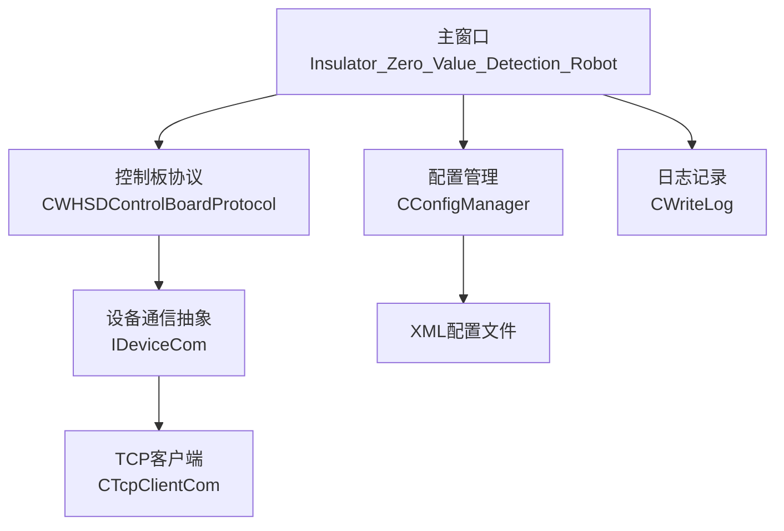
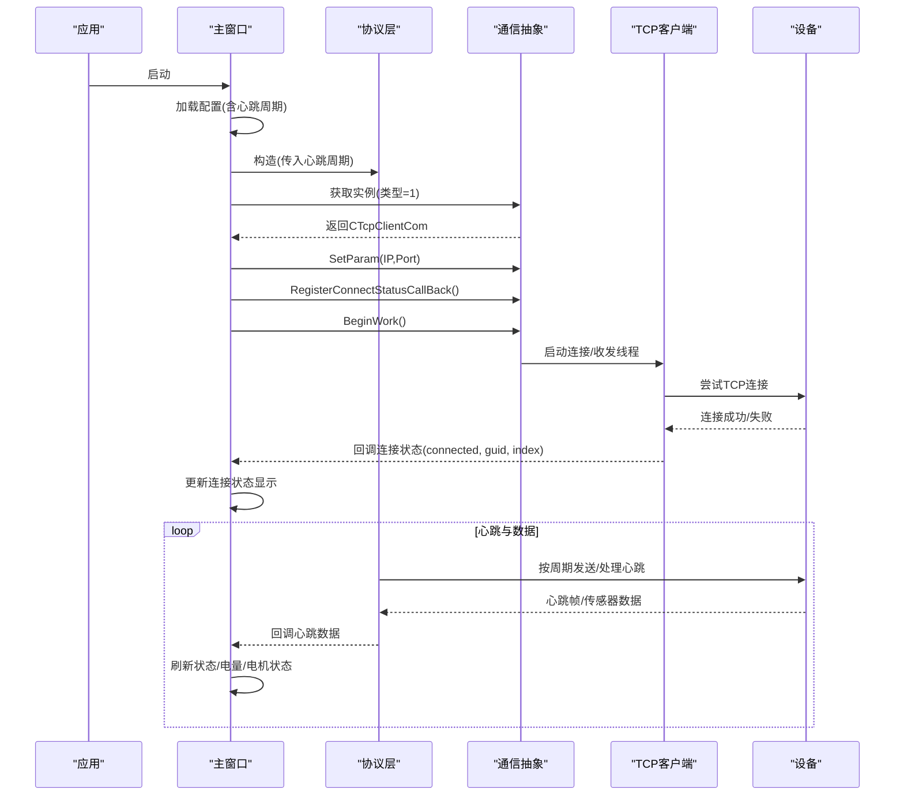
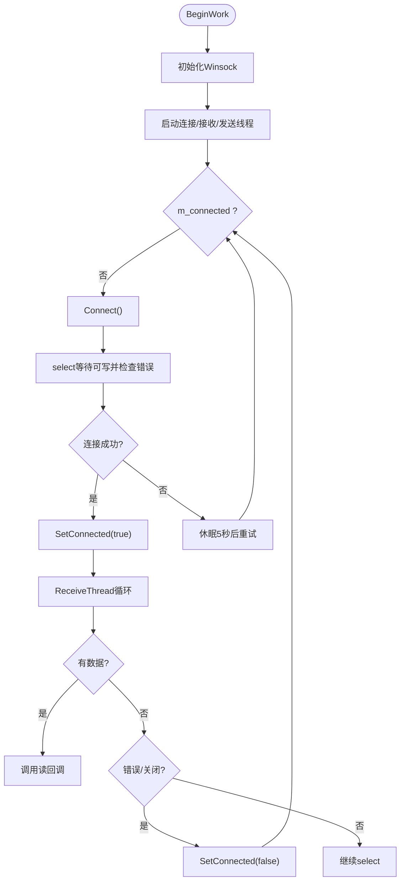
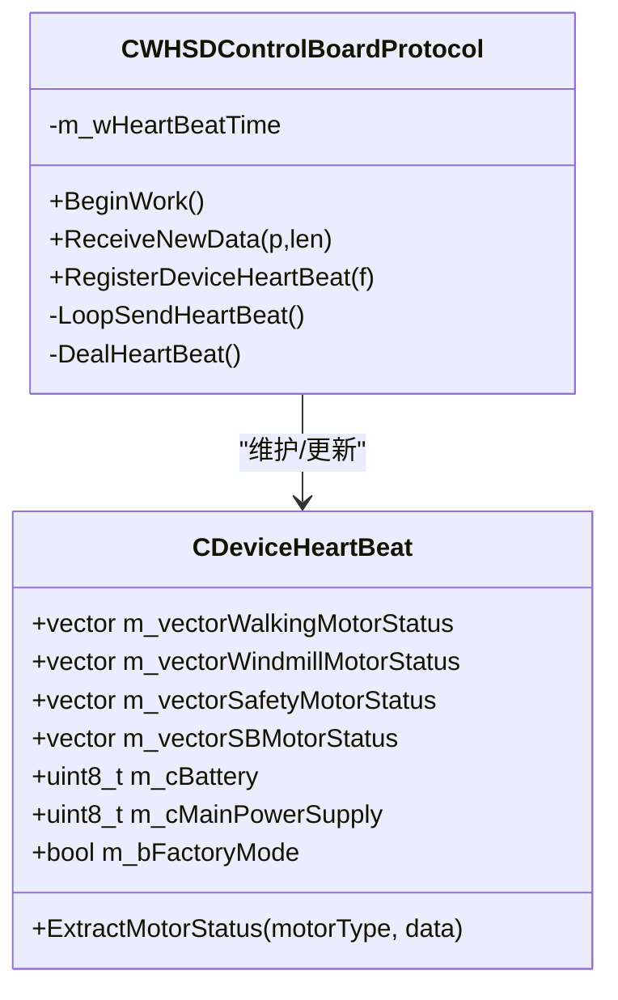
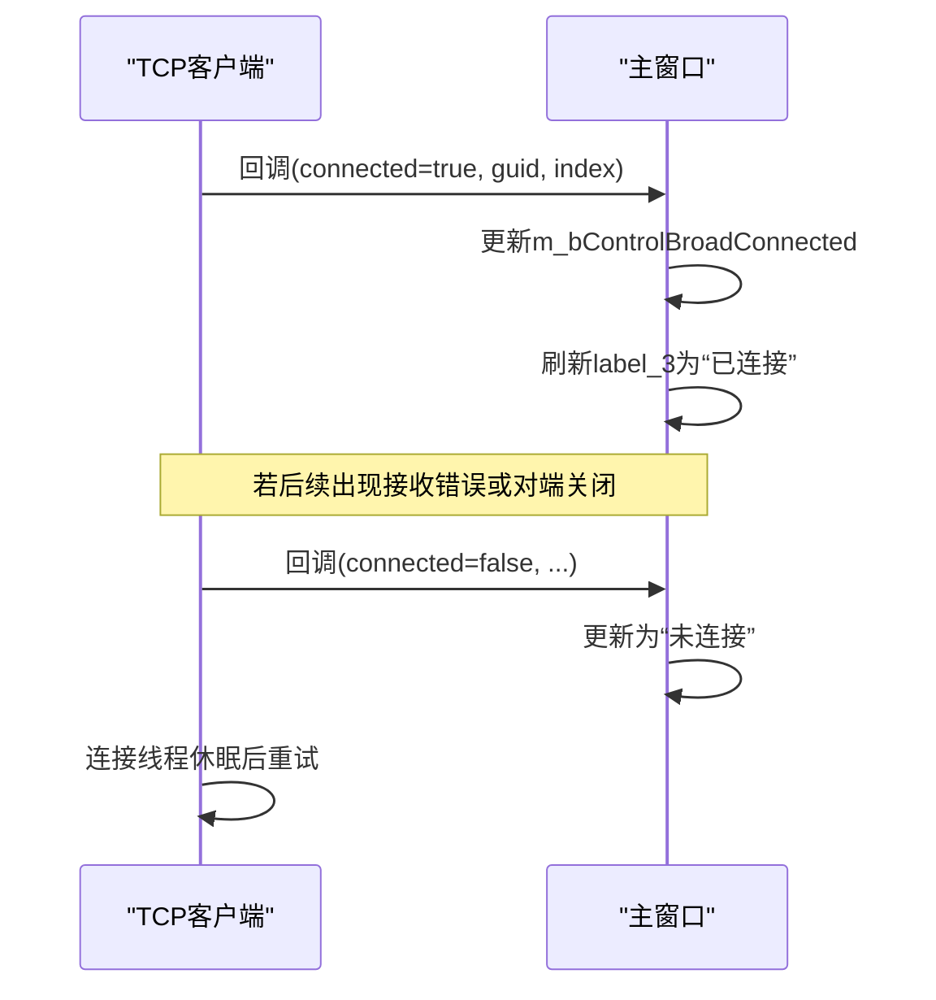
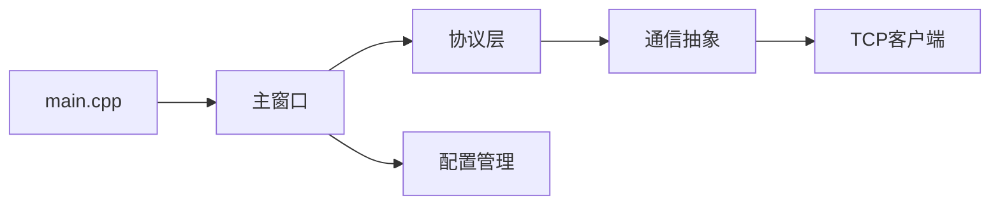

# 设备状态监控

<cite>
**本文引用的文件**
- [TcpClient.h](file://Insulator_Zero_Value_Detection_Robot/DeviceCom/TcpClient.h)
- [TcpClient.cpp](file://Insulator_Zero_Value_Detection_Robot/DeviceCom/TcpClient.cpp)
- [IDeviceCom.h](file://Insulator_Zero_Value_Detection_Robot/DeviceCom/IDeviceCom.h)
- [IDeviceCom.cpp](file://Insulator_Zero_Value_Detection_Robot/DeviceCom/IDeviceCom.cpp)
- [WHSDControlBoradProtocol.h](file://Insulator_Zero_Value_Detection_Robot/Protocol/WHSDControlBoradProtocol.h)
- [WHSDControlBoradProtocol.cpp](file://Insulator_Zero_Value_Detection_Robot/Protocol/WHSDControlBoradProtocol.cpp)
- [ConfigManager.h](file://Insulator_Zero_Value_Detection_Robot/Config/ConfigManager.h)
- [ConfigManager.cpp](file://Insulator_Zero_Value_Detection_Robot/Config/ConfigManager.cpp)
- [Insulator_Zero_Value_Detection_Robot.h](file://Insulator_Zero_Value_Detection_Robot/UI/Insulator_Zero_Value_Detection_Robot.h)
- [Insulator_Zero_Value_Detection_Robot.cpp](file://Insulator_Zero_Value_Detection_Robot/UI/Insulator_Zero_Value_Detection_Robot.cpp)
- [main.cpp](file://Insulator_Zero_Value_Detection_Robot/main.cpp)
</cite>

## 目录
1. [简介](#简介)
2. [项目结构](#项目结构)
3. [核心组件](#核心组件)
4. [架构总览](#架构总览)
5. [详细组件分析](#详细组件分析)
6. [依赖关系分析](#依赖关系分析)
7. [性能考虑](#性能考虑)
8. [故障排除指南](#故障排除指南)
9. [结论](#结论)
10. [附录](#附录)

## 简介
本文件面向“设备状态监控”功能，聚焦于设备连接状态的实时监控显示与判断逻辑。内容涵盖：
- TCP 连接状态、设备响应状态、通信质量指示的展示与含义
- 颜色变化规则（绿色正常、红色断开、黄色异常等）
- 设备心跳机制与超时检测原理
- 设备状态变化事件处理流程（连接建立、断开重连、异常恢复）
- 配置选项与自定义设置方法
- 常见连接问题的诊断与排障

## 项目结构
本项目采用分层组织：UI 层负责界面与交互；协议层解析设备帧并维护心跳数据；设备通信层提供 TCP 客户端实现；配置层管理设备参数（含心跳周期）。

图表来源
- [Insulator_Zero_Value_Detection_Robot.h:26-385](file://Insulator_Zero_Value_Detection_Robot/UI/Insulator_Zero_Value_Detection_Robot.h#L26-L385)
- [WHSDControlBoradProtocol.h:189-356](file://Insulator_Zero_Value_Detection_Robot/Protocol/WHSDControlBoradProtocol.h#L189-L356)
- [IDeviceCom.h:1-15](file://Insulator_Zero_Value_Detection_Robot/DeviceCom/IDeviceCom.h#L1-L15)
- [TcpClient.h:8-46](file://Insulator_Zero_Value_Detection_Robot/DeviceCom/TcpClient.h#L8-L46)
- [ConfigManager.h:185-199](file://Insulator_Zero_Value_Detection_Robot/Config/ConfigManager.h#L185-L199)

章节来源
- [Insulator_Zero_Value_Detection_Robot.h:26-385](file://Insulator_Zero_Value_Detection_Robot/UI/Insulator_Zero_Value_Detection_Robot.h#L26-L385)
- [Insulator_Zero_Value_Detection_Robot.cpp:231-315](file://Insulator_Zero_Value_Detection_Robot/UI/Insulator_Zero_Value_Detection_Robot.cpp#L231-L315)
- [ConfigManager.cpp:16-257](file://Insulator_Zero_Value_Detection_Robot/Config/ConfigManager.cpp#L16-L257)

## 核心组件
- 设备通信抽象 IDeviceCom：定义统一接口，便于扩展不同通信方式。
- TCP 客户端 CTcpClientCom：实现非阻塞 TCP 连接、发送/接收线程、自动重连与连接状态回调。
- 控制板协议 CWHSDControlBoradProtocol：解析设备帧、维护心跳数据、触发业务回调。
- 配置管理 CConfigManager：从 XML 读取/写入设备参数，包括心跳周期 DeviceHeartBeat。
- 主窗口 Insulator_Zero_Value_Detection_Robot：绑定 UI 与协议/通信，刷新状态显示，处理连接状态变化。

章节来源
- [IDeviceCom.h:1-15](file://Insulator_Zero_Value_Detection_Robot/DeviceCom/IDeviceCom.h#L1-L15)
- [TcpClient.h:8-46](file://Insulator_Zero_Value_Detection_Robot/DeviceCom/TcpClient.h#L8-L46)
- [WHSDControlBoradProtocol.h:189-356](file://Insulator_Zero_Value_Detection_Robot/Protocol/WHSDControlBoradProtocol.h#L189-L356)
- [ConfigManager.h:10-24](file://Insulator_Zero_Value_Detection_Robot/Config/ConfigManager.h#L10-L24)
- [Insulator_Zero_Value_Detection_Robot.h:26-385](file://Insulator_Zero_Value_Detection_Robot/UI/Insulator_Zero_Value_Detection_Robot.h#L26-L385)

## 架构总览
系统启动后，主窗口初始化配置、创建协议对象与通信对象，注册回调并启动工作。TCP 客户端负责连接管理与收发，协议层解析心跳与传感器数据，主窗口定时刷新 UI 并更新状态指示。

图表来源
- [Insulator_Zero_Value_Detection_Robot.cpp:231-315](file://Insulator_Zero_Value_Detection_Robot/UI/Insulator_Zero_Value_Detection_Robot.cpp#L231-L315)
- [TcpClient.cpp:59-121](file://Insulator_Zero_Value_Detection_Robot/DeviceCom/TcpClient.cpp#L59-L121)
- [WHSDControlBoradProtocol.h:189-356](file://Insulator_Zero_Value_Detection_Robot/Protocol/WHSDControlBoradProtocol.h#L189-L356)

## 详细组件分析

### TCP 连接与状态监控
- 连接生命周期
  - BeginWork：初始化 Winsock，启动连接线程、接收线程、发送线程。
  - ConnectionThread：循环检查 m_connected，未连接则调用 Connect；每次尝试后休眠固定间隔进行重连。
  - Connect：创建套接字、设置为非阻塞、发起 connect；使用 select 等待可写并检查错误；成功则 SetConnected(true)。
  - ReceiveThread：select 监听可读，收到数据调用读回调；对端关闭或接收错误时 SetConnected(false)。
  - SendThread：从队列取数据发送；发送错误且非临时错误时 SetConnected(false)。
  - EndWork：停止运行、通知条件变量、关闭套接字、等待线程结束、清理 Winsock。
- 连接状态回调
  - SetConnected：当 m_connected 变化时，调用注册的连接状态回调，供 UI 更新显示。

图表来源
- [TcpClient.cpp:59-121](file://Insulator_Zero_Value_Detection_Robot/DeviceCom/TcpClient.cpp#L59-L121)
- [TcpClient.cpp:123-236](file://Insulator_Zero_Value_Detection_Robot/DeviceCom/TcpClient.cpp#L123-L236)
- [TcpClient.cpp:238-382](file://Insulator_Zero_Value_Detection_Robot/DeviceCom/TcpClient.cpp#L238-L382)

章节来源
- [TcpClient.h:8-46](file://Insulator_Zero_Value_Detection_Robot/DeviceCom/TcpClient.h#L8-L46)
- [TcpClient.cpp:59-382](file://Insulator_Zero_Value_Detection_Robot/DeviceCom/TcpClient.cpp#L59-L382)

### 心跳机制与超时检测
- 心跳周期配置
  - 通过 CConfigManager 从 XML 读取 DeviceHeartBeat，默认值在构造函数中设定。
  - 主窗口构造协议对象时传入该周期。
- 心跳数据处理
  - 协议层维护 CDeviceHeartBeat 结构，包含各电机状态、电池、电源状态等。
  - 主窗口通过回调接收心跳快照，并在定时器中刷新 UI。
- 超时检测
  - 协议层内部维护心跳时间参数，用于周期性处理心跳。
  - UI 侧通过最近一次心跳时间与当前时间对比，可实现“长时间无心跳即离线”的判断（可在现有基础上扩展）。

图表来源
- [WHSDControlBoradProtocol.h:121-187](file://Insulator_Zero_Value_Detection_Robot/Protocol/WHSDControlBoradProtocol.h#L121-L187)
- [WHSDControlBoradProtocol.h:189-356](file://Insulator_Zero_Value_Detection_Robot/Protocol/WHSDControlBoradProtocol.h#L189-L356)
- [WHSDControlBoradProtocol.cpp:106-177](file://Insulator_Zero_Value_Detection_Robot/Protocol/WHSDControlBoradProtocol.cpp#L106-L177)

章节来源
- [ConfigManager.h:10-24](file://Insulator_Zero_Value_Detection_Robot/Config/ConfigManager.h#L10-L24)
- [ConfigManager.cpp:8-14](file://Insulator_Zero_Value_Detection_Robot/Config/ConfigManager.cpp#L8-L14)
- [ConfigManager.cpp:16-257](file://Insulator_Zero_Value_Detection_Robot/Config/ConfigManager.cpp#L16-L257)
- [WHSDControlBoradProtocol.h:121-187](file://Insulator_Zero_Value_Detection_Robot/Protocol/WHSDControlBoradProtocol.h#L121-L187)
- [WHSDControlBoradProtocol.cpp:106-177](file://Insulator_Zero_Value_Detection_Robot/Protocol/WHSDControlBoradProtocol.cpp#L106-L177)

### 设备状态变化的事件处理流程
- 连接建立
  - TCP 客户端连接成功后调用 SetConnected(true)，触发 UI 回调 ComDeviceConnectionChanged，更新“已连接/未连接”标签。
- 断开重连
  - 接收错误或对端关闭时 SetConnected(false)，连接线程会在下次循环尝试重连。
- 异常恢复
  - 网络恢复后，TCP 客户端再次连接成功，UI 状态切换回“已连接”。

图表来源
- [TcpClient.cpp:137-150](file://Insulator_Zero_Value_Detection_Robot/DeviceCom/TcpClient.cpp#L137-L150)
- [Insulator_Zero_Value_Detection_Robot.cpp:635-640](file://Insulator_Zero_Value_Detection_Robot/UI/Insulator_Zero_Value_Detection_Robot.cpp#L635-L640)

章节来源
- [TcpClient.cpp:137-150](file://Insulator_Zero_Value_Detection_Robot/DeviceCom/TcpClient.cpp#L137-L150)
- [Insulator_Zero_Value_Detection_Robot.cpp:635-640](file://Insulator_Zero_Value_Detection_Robot/UI/Insulator_Zero_Value_Detection_Robot.cpp#L635-L640)

### 状态指示与颜色规则
- 连接状态
  - 绿色：已连接（UI 标签显示“已连接”）
  - 红色：未连接（UI 标签显示“未连接”）
- 设备响应与通信质量
  - 黄色：通信异常（如接收错误、发送错误导致断开）
  - 绿色：通信正常（心跳持续到达、数据收发正常）
- 设备在线判断
  - 基于心跳到达情况：若超过一定时间未收到心跳，视为离线（可在现有 UI 定时器中结合最近心跳时间实现）

章节来源
- [Insulator_Zero_Value_Detection_Robot.cpp:413-559](file://Insulator_Zero_Value_Detection_Robot/UI/Insulator_Zero_Value_Detection_Robot.cpp#L413-L559)
- [TcpClient.cpp:301-382](file://Insulator_Zero_Value_Detection_Robot/DeviceCom/TcpClient.cpp#L301-L382)

### 配置选项与自定义设置
- 设备 IP/端口
  - 通过 XML 的 DeviceControlBoard > Ip/Port 配置，主窗口启动时读取并设置到通信对象。
- 心跳周期
  - DeviceHeartBeat 字段决定协议层心跳周期，默认值在配置类构造函数中设定。
- 其他参数
  - 探针角度、电机速度、绝缘阈值等均可通过 XML 配置并保存到文件。

章节来源
- [ConfigManager.cpp:16-257](file://Insulator_Zero_Value_Detection_Robot/Config/ConfigManager.cpp#L16-L257)
- [ConfigManager.cpp:259-452](file://Insulator_Zero_Value_Detection_Robot/Config/ConfigManager.cpp#L259-L452)
- [Insulator_Zero_Value_Detection_Robot.cpp:231-315](file://Insulator_Zero_Value_Detection_Robot/UI/Insulator_Zero_Value_Detection_Robot.cpp#L231-L315)

## 依赖关系分析
- 主窗口依赖协议层与配置层，并通过通信抽象与 TCP 客户端交互。
- 协议层依赖通信抽象以发送/接收数据，并维护心跳数据。
- TCP 客户端依赖操作系统网络库，实现连接管理与线程安全。

图表来源
- [main.cpp:11-24](file://Insulator_Zero_Value_Detection_Robot/main.cpp#L11-L24)
- [Insulator_Zero_Value_Detection_Robot.h:26-385](file://Insulator_Zero_Value_Detection_Robot/UI/Insulator_Zero_Value_Detection_Robot.h#L26-L385)
- [IDeviceCom.cpp:1-13](file://Insulator_Zero_Value_Detection_Robot/DeviceCom/IDeviceCom.cpp#L1-L13)

章节来源
- [main.cpp:11-24](file://Insulator_Zero_Value_Detection_Robot/main.cpp#L11-L24)
- [IDeviceCom.cpp:1-13](file://Insulator_Zero_Value_Detection_Robot/DeviceCom/IDeviceCom.cpp#L1-L13)

## 性能考虑
- 非阻塞 I/O：TCP 客户端使用非阻塞套接字与 select，避免阻塞 UI 线程。
- 线程分离：连接、发送、接收分别由独立线程处理，降低耦合度。
- 队列缓冲：发送数据入队，减少频繁系统调用。
- 心跳周期可调：通过配置调整心跳频率，平衡实时性与负载。

[本节为通用指导，不直接分析具体文件]

## 故障排除指南
- 无法连接
  - 检查 IP/端口配置是否正确。
  - 确认目标设备是否开启服务并可被访问。
  - 查看日志中连接失败原因（如 WSAEWOULDBLOCK、超时等）。
- 连接不稳定
  - 观察接收线程的错误码，是否为网络中断或协议错误。
  - 调整心跳周期与重连间隔，提升鲁棒性。
- 心跳丢失
  - 确认设备固件是否正常上报心跳。
  - 检查协议层是否收到并解析心跳帧。
  - 在 UI 中结合最近心跳时间实现离线告警。

章节来源
- [TcpClient.cpp:163-236](file://Insulator_Zero_Value_Detection_Robot/DeviceCom/TcpClient.cpp#L163-L236)
- [TcpClient.cpp:301-382](file://Insulator_Zero_Value_Detection_Robot/DeviceCom/TcpClient.cpp#L301-L382)
- [Insulator_Zero_Value_Detection_Robot.cpp:413-559](file://Insulator_Zero_Value_Detection_Robot/UI/Insulator_Zero_Value_Detection_Robot.cpp#L413-L559)

## 结论
本系统通过 TCP 客户端的非阻塞连接与自动重连、协议层的心跳机制与数据解析、以及主窗口的状态刷新与回调处理，实现了设备连接状态的实时监控与可视化。用户可通过配置文件灵活调整心跳周期与其他参数，满足不同的部署需求。建议在实际使用中结合最近心跳时间实现更精确的离线判断，并完善错误日志以便快速定位问题。

[本节为总结，不直接分析具体文件]

## 附录
- 关键入口
  - 程序入口：main.cpp
  - 主窗口初始化与绑定：Insulator_Zero_Value_Detection_Robot.cpp
- 相关常量与默认值
  - 心跳周期默认值：配置类构造函数中设定
  - 重连间隔：TCP 客户端连接线程中固定休眠时间

章节来源
- [main.cpp:11-24](file://Insulator_Zero_Value_Detection_Robot/main.cpp#L11-L24)
- [Insulator_Zero_Value_Detection_Robot.cpp:231-315](file://Insulator_Zero_Value_Detection_Robot/UI/Insulator_Zero_Value_Detection_Robot.cpp#L231-L315)
- [ConfigManager.cpp:8-14](file://Insulator_Zero_Value_Detection_Robot/Config/ConfigManager.cpp#L8-L14)
- [TcpClient.cpp:123-135](file://Insulator_Zero_Value_Detection_Robot/DeviceCom/TcpClient.cpp#L123-L135)