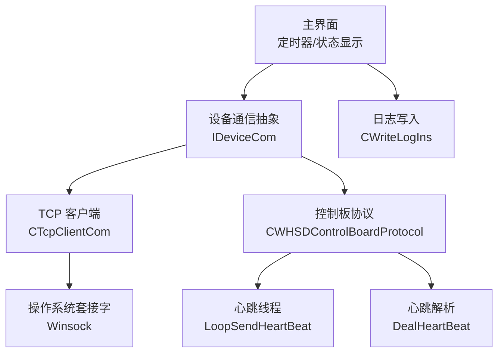
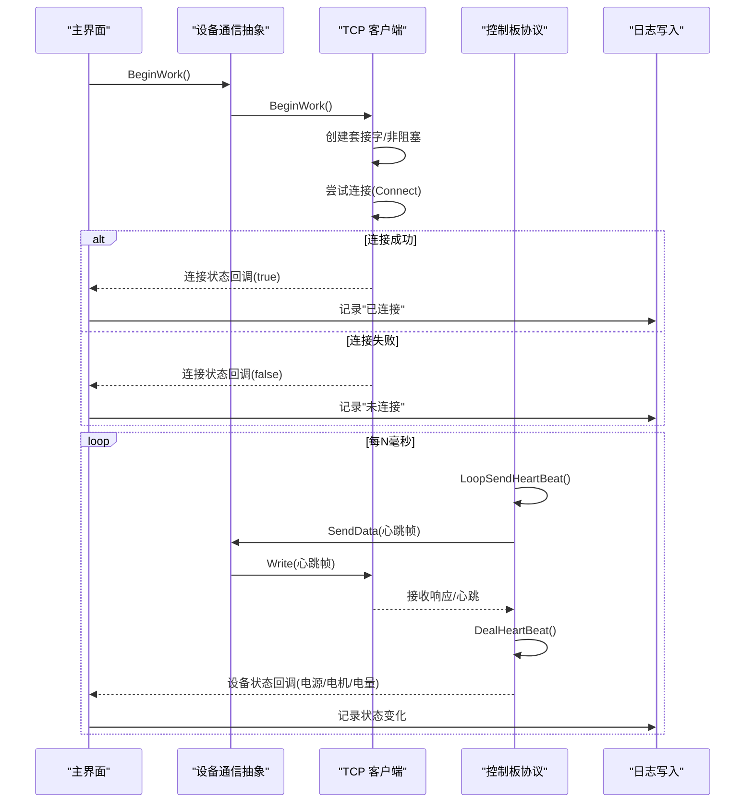
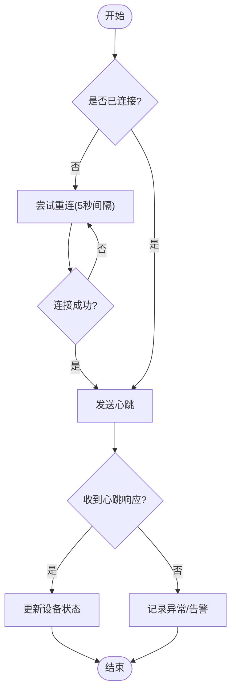
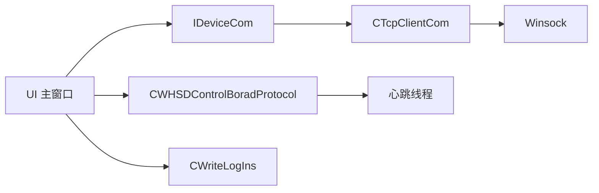

# 通信质量监控

<cite>
**本文引用的文件**
- [TcpClient.h](file://Insulator_Zero_Value_Detection_Robot/DeviceCom/TcpClient.h)
- [TcpClient.cpp](file://Insulator_Zero_Value_Detection_Robot/DeviceCom/TcpClient.cpp)
- [IDeviceCom.h](file://Insulator_Zero_Value_Detection_Robot/DeviceCom/IDeviceCom.h)
- [WHSDControlBoradProtocol.h](file://Insulator_Zero_Value_Detection_Robot/Protocol/WHSDControlBoradProtocol.h)
- [WHSDControlBoradProtocol.cpp](file://Insulator_Zero_Value_Detection_Robot/Protocol/WHSDControlBoradProtocol.cpp)
- [ConfigManager.h](file://Insulator_Zero_Value_Detection_Robot/Config/ConfigManager.h)
- [Insulator_Zero_Value_Detection_Robot.h](file://Insulator_Zero_Value_Detection_Robot/UI/Insulator_Zero_Value_Detection_Robot.h)
- [Insulator_Zero_Value_Detection_Robot.cpp](file://Insulator_Zero_Value_Detection_Robot/UI/Insulator_Zero_Value_Detection_Robot.cpp)
- [WriteLogIns.h](file://Insulator_Zero_Value_Detection_Robot/Log/WriteLogIns.h)
- [WriteLogIns.cpp](file://Insulator_Zero_Value_Detection_Robot/Log/WriteLogIns.cpp)
</cite>

## 目录
1. [简介](#简介)
2. [项目结构](#项目结构)
3. [核心组件](#核心组件)
4. [架构总览](#架构总览)
5. [详细组件分析](#详细组件分析)
6. [依赖关系分析](#依赖关系分析)
7. [性能考量](#性能考量)
8. [故障排查指南](#故障排查指南)
9. [结论](#结论)
10. [附录](#附录)

## 简介
本文件面向“通信质量监控”功能，围绕网络通信的实时监测指标、质量等级划分与可视化、数据采集与统计方法、异常检测与自动恢复机制、历史数据查看与趋势分析，以及优化建议与最佳实践进行系统化说明。文档基于仓库中的设备通信层（TCP 客户端）、协议心跳与状态上报、UI 显示与日志记录等实现进行梳理，帮助读者理解系统如何采集、展示并保障通信链路的可用性与稳定性。

## 项目结构
与通信质量监控直接相关的代码分布在以下模块：
- 设备通信层：TCP 客户端封装了连接、发送、接收、重连与错误处理，提供连接状态回调与数据回调接口。
- 协议层：周期性心跳线程负责向设备发送心跳，解析心跳帧并提取设备状态（如电源、电机状态等），通过回调通知上层。
- UI 层：定时轮询传感器数据，刷新连接状态、心跳计数等；在测量流程中结合超时与兜底等待保证健壮性。
- 日志层：异步写入带时间戳的日志文件，支持循环覆盖与同步写入，便于问题定位与趋势分析。

**图示来源**
- [TcpClient.cpp:59-121](file://Insulator_Zero_Value_Detection_Robot/DeviceCom/TcpClient.cpp#L59-L121)
- [WHSDControlBoradProtocol.cpp:770-802](file://Insulator_Zero_Value_Detection_Robot/Protocol/WHSDControlBoradProtocol.cpp#L770-L802)
- [Insulator_Zero_Value_Detection_Robot.cpp:413-429](file://Insulator_Zero_Value_Detection_Robot/UI/Insulator_Zero_Value_Detection_Robot.cpp#L413-L429)
- [WriteLogIns.cpp:128-159](file://Insulator_Zero_Value_Detection_Robot/Log/WriteLogIns.cpp#L128-L159)

**章节来源**
- [TcpClient.h:1-47](file://Insulator_Zero_Value_Detection_Robot/DeviceCom/TcpClient.h#L1-L47)
- [TcpClient.cpp:59-121](file://Insulator_Zero_Value_Detection_Robot/DeviceCom/TcpClient.cpp#L59-L121)
- [WHSDControlBoradProtocol.h:120-319](file://Insulator_Zero_Value_Detection_Robot/Protocol/WHSDControlBoradProtocol.h#L120-L319)
- [WHSDControlBoradProtocol.cpp:770-802](file://Insulator_Zero_Value_Detection_Robot/Protocol/WHSDControlBoradProtocol.cpp#L770-L802)
- [Insulator_Zero_Value_Detection_Robot.h:225-248](file://Insulator_Zero_Value_Detection_Robot/UI/Insulator_Zero_Value_Detection_Robot.h#L225-L248)
- [Insulator_Zero_Value_Detection_Robot.cpp:413-429](file://Insulator_Zero_Value_Detection_Robot/UI/Insulator_Zero_Value_Detection_Robot.cpp#L413-L429)
- [WriteLogIns.h:65-129](file://Insulator_Zero_Value_Detection_Robot/Log/WriteLogIns.h#L65-L129)
- [WriteLogIns.cpp:128-159](file://Insulator_Zero_Value_Detection_Robot/Log/WriteLogIns.cpp#L128-L159)

## 核心组件
- 设备通信抽象 IDeviceCom：定义统一的参数设置、读写、生命周期管理与回调注册接口，屏蔽底层传输差异。
- TCP 客户端 CTcpClientCom：实现非阻塞连接、发送队列、接收线程、错误处理与自动重连，暴露连接状态与数据回调。
- 控制板协议 CWHSDControlBoardProtocol：维护心跳周期、解析心跳帧、提取设备状态（电池、电源、电机等），并提供命令构造与发送。
- UI 主窗口：定时轮询传感器数据，刷新连接状态与心跳计数，管理测量流程的超时与兜底等待。
- 日志写入 CWriteLogIns：异步批量写入带时间戳的日志，支持循环覆盖与同步写入，便于追踪通信事件。

**章节来源**
- [IDeviceCom.h:1-15](file://Insulator_Zero_Value_Detection_Robot/DeviceCom/IDeviceCom.h#L1-L15)
- [TcpClient.h:8-46](file://Insulator_Zero_Value_Detection_Robot/DeviceCom/TcpClient.h#L8-L46)
- [WHSDControlBoradProtocol.h:189-319](file://Insulator_Zero_Value_Detection_Robot/Protocol/WHSDControlBoradProtocol.h#L189-L319)
- [Insulator_Zero_Value_Detection_Robot.h:225-248](file://Insulator_Zero_Value_Detection_Robot/UI/Insulator_Zero_Value_Detection_Robot.h#L225-L248)
- [WriteLogIns.h:65-129](file://Insulator_Zero_Value_Detection_Robot/Log/WriteLogIns.h#L65-L129)

## 架构总览
通信质量监控的数据流与控制流如下：
- 连接建立：TCP 客户端创建套接字、设置为非阻塞模式、尝试连接，成功则标记已连接并触发连接状态回调。
- 心跳与状态：协议层启动心跳线程，按配置周期发送心跳；收到心跳后解析设备状态并通过回调通知 UI。
- 数据收发：发送走独立线程与队列，接收使用 select 超时轮询；错误时关闭套接字并触发断开回调。
- UI 刷新：定时器每秒轮询传感器数据，更新连接状态与心跳计数；测量流程中使用超时与兜底等待避免卡死。
- 日志记录：所有关键通信事件（连接变化、数据收发、错误）通过日志写入模块持久化，支持后续分析与趋势观察。

**图示来源**
- [TcpClient.cpp:163-236](file://Insulator_Zero_Value_Detection_Robot/DeviceCom/TcpClient.cpp#L163-L236)
- [TcpClient.cpp:238-382](file://Insulator_Zero_Value_Detection_Robot/DeviceCom/TcpClient.cpp#L238-L382)
- [WHSDControlBoradProtocol.cpp:770-802](file://Insulator_Zero_Value_Detection_Robot/Protocol/WHSDControlBoradProtocol.cpp#L770-L802)
- [Insulator_Zero_Value_Detection_Robot.cpp:413-429](file://Insulator_Zero_Value_Detection_Robot/UI/Insulator_Zero_Value_Detection_Robot.cpp#L413-L429)
- [WriteLogIns.cpp:128-159](file://Insulator_Zero_Value_Detection_Robot/Log/WriteLogIns.cpp#L128-L159)

## 详细组件分析

### 通信链路健康度评估（信号强度、延迟、丢包率、带宽利用率）
- 信号强度：当前实现未直接采集无线信号强度字段；可通过外部扩展（如网卡信息或专用驱动）接入。
- 延迟时间：可基于心跳往返时间估算。心跳由协议层周期性发送，若能在预期时间内收到心跳响应，则认为链路延迟在可接受范围；否则视为高延迟或不可用。
- 丢包率：通过心跳连续到达情况统计。若在多个心跳周期内未收到响应，可判定为丢包或断链；结合重连机制计算丢包比例。
- 带宽利用率：当前实现未显式统计带宽；可通过单位时间内发送/接收字节数估算。注意心跳帧较小，不足以代表业务带宽。

建议的统计方法：
- 滑动窗口统计：以固定时间窗口（如 10 秒）统计心跳成功次数、失败次数、平均往返时间，用于平滑波动。
- 阈值告警：当窗口内成功率低于阈值或平均延迟高于阈值时，触发告警并提示用户检查网络。
- 可视化：在 UI 中以颜色标识质量等级（见下一节）。

**章节来源**
- [WHSDControlBoradProtocol.cpp:770-802](file://Insulator_Zero_Value_Detection_Robot/Protocol/WHSDControlBoradProtocol.cpp#L770-L802)
- [TcpClient.cpp:301-382](file://Insulator_Zero_Value_Detection_Robot/DeviceCom/TcpClient.cpp#L301-L382)
- [Insulator_Zero_Value_Detection_Robot.cpp:413-429](file://Insulator_Zero_Value_Detection_Robot/UI/Insulator_Zero_Value_Detection_Robot.cpp#L413-L429)

### 通信质量等级划分与视觉表示
- 等级划分建议（基于心跳成功率与延迟）：
  - 优：成功率≥95%且平均延迟≤100ms
  - 良：成功率≥80%且平均延迟≤200ms
  - 中：成功率≥60%或平均延迟≤500ms
  - 差：成功率<60%或平均延迟>500ms
- 视觉表示：
  - 使用不同颜色标识等级（例如绿/蓝/黄/红），并在 UI 上实时更新。
  - 可结合图标（如信号条、圆点）增强可读性。
- 当前实现：UI 显示连接状态与心跳计数，可作为质量等级的基础输入。

**章节来源**
- [Insulator_Zero_Value_Detection_Robot.cpp:413-429](file://Insulator_Zero_Value_Detection_Robot/UI/Insulator_Zero_Value_Detection_Robot.cpp#L413-L429)

### 数据采集算法与统计方法
- 心跳采集：协议层按配置周期发送心跳，解析心跳帧并提取设备状态（电源、电机、电量等）。
- 轮询采集：UI 定时器每秒轮询传感器数据（状态、电量、结果），确保界面实时刷新。
- 统计方法：
  - 成功率：成功心跳数/总心跳数（窗口内）
  - 平均延迟：心跳往返时间的均值（窗口内）
  - 丢包率：失败心跳数/总心跳数（窗口内）
  - 带宽利用率：单位时间发送/接收字节数（可选）

**章节来源**
- [WHSDControlBoradProtocol.cpp:770-802](file://Insulator_Zero_Value_Detection_Robot/Protocol/WHSDControlBoradProtocol.cpp#L770-L802)
- [Insulator_Zero_Value_Detection_Robot.cpp:413-429](file://Insulator_Zero_Value_Detection_Robot/UI/Insulator_Zero_Value_Detection_Robot.cpp#L413-L429)

### 异常检测与自动恢复机制
- 断线重连：TCP 客户端在连接失败或错误时关闭套接字并触发断开回调；连接线程会周期性尝试重连。
- 协议重试：心跳线程按周期发送，若未收到响应，上层可据此判断异常并触发重试逻辑。
- 错误纠正：接收线程检测到错误时关闭连接并置位断开标志；UI 根据连接状态调整行为（如禁止进入测量流程）。
- 测量流程保护：测量前校验连接状态与电源状态，避免卡在等待弹窗；到位轮询与结果超时兜底防止流程挂起。

**图示来源**
- [TcpClient.cpp:123-135](file://Insulator_Zero_Value_Detection_Robot/DeviceCom/TcpClient.cpp#L123-L135)
- [TcpClient.cpp:163-236](file://Insulator_Zero_Value_Detection_Robot/DeviceCom/TcpClient.cpp#L163-L236)
- [TcpClient.cpp:301-382](file://Insulator_Zero_Value_Detection_Robot/DeviceCom/TcpClient.cpp#L301-L382)
- [Insulator_Zero_Value_Detection_Robot.cpp:2052-2056](file://Insulator_Zero_Value_Detection_Robot/UI/Insulator_Zero_Value_Detection_Robot.cpp#L2052-L2056)

**章节来源**
- [TcpClient.cpp:123-135](file://Insulator_Zero_Value_Detection_Robot/DeviceCom/TcpClient.cpp#L123-L135)
- [TcpClient.cpp:163-236](file://Insulator_Zero_Value_Detection_Robot/DeviceCom/TcpClient.cpp#L163-L236)
- [TcpClient.cpp:301-382](file://Insulator_Zero_Value_Detection_Robot/DeviceCom/TcpClient.cpp#L301-L382)
- [Insulator_Zero_Value_Detection_Robot.cpp:2052-2056](file://Insulator_Zero_Value_Detection_Robot/UI/Insulator_Zero_Value_Detection_Robot.cpp#L2052-L2056)

### 历史数据查看与趋势分析
- 日志记录：所有关键通信事件（连接变化、数据收发、错误）通过日志写入模块持久化，包含时间戳与消息内容。
- 循环覆盖：日志文件支持最大行数配置，超过后循环覆盖，避免磁盘占用过大。
- 趋势分析：可基于日志统计心跳成功率、延迟分布、错误类型频率，生成报表或图表辅助问题定位。

**章节来源**
- [WriteLogIns.h:65-129](file://Insulator_Zero_Value_Detection_Robot/Log/WriteLogIns.h#L65-L129)
- [WriteLogIns.cpp:128-159](file://Insulator_Zero_Value_Detection_Robot/Log/WriteLogIns.cpp#L128-L159)
- [WriteLogIns.cpp:161-321](file://Insulator_Zero_Value_Detection_Robot/Log/WriteLogIns.cpp#L161-L321)

### 通信质量优化建议与最佳实践
- 网络配置优化：
  - 合理设置心跳周期与超时时间，平衡实时性与网络负载。
  - 使用稳定的局域网或专线，减少干扰与丢包。
- 设备位置调整：
  - 将设备放置在信号良好区域，避免金属遮挡与强电磁干扰。
- 流程健壮性：
  - 测量前校验连接与电源状态，避免无效操作。
  - 使用到位轮询与结果超时兜底，防止流程卡死。
- 监控与告警：
  - 基于心跳成功率与延迟设置阈值告警，及时通知运维人员。
  - 定期导出日志进行分析，发现潜在问题。

[本节为通用指导，不直接分析具体文件]

## 依赖关系分析
- 组件耦合：
  - UI 依赖设备通信抽象与协议层，获取连接状态与设备状态。
  - TCP 客户端依赖操作系统套接字，提供可靠的数据收发与重连能力。
  - 协议层依赖心跳线程与解析逻辑，向上层提供设备状态回调。
  - 日志模块被各层调用，记录关键事件。
- 外部依赖：
  - Winsock 用于 TCP 通信。
  - Qt 用于 UI 与定时器。
  - OpenCV 用于摄像头取流（与通信质量间接相关）。

**图示来源**
- [Insulator_Zero_Value_Detection_Robot.h:225-248](file://Insulator_Zero_Value_Detection_Robot/UI/Insulator_Zero_Value_Detection_Robot.h#L225-L248)
- [IDeviceCom.h:1-15](file://Insulator_Zero_Value_Detection_Robot/DeviceCom/IDeviceCom.h#L1-L15)
- [TcpClient.h:8-46](file://Insulator_Zero_Value_Detection_Robot/DeviceCom/TcpClient.h#L8-L46)
- [WHSDControlBoradProtocol.h:189-319](file://Insulator_Zero_Value_Detection_Robot/Protocol/WHSDControlBoradProtocol.h#L189-L319)
- [WriteLogIns.h:65-129](file://Insulator_Zero_Value_Detection_Robot/Log/WriteLogIns.h#L65-L129)

**章节来源**
- [Insulator_Zero_Value_Detection_Robot.h:225-248](file://Insulator_Zero_Value_Detection_Robot/UI/Insulator_Zero_Value_Detection_Robot.h#L225-L248)
- [IDeviceCom.h:1-15](file://Insulator_Zero_Value_Detection_Robot/DeviceCom/IDeviceCom.h#L1-L15)
- [TcpClient.h:8-46](file://Insulator_Zero_Value_Detection_Robot/DeviceCom/TcpClient.h#L8-L46)
- [WHSDControlBoradProtocol.h:189-319](file://Insulator_Zero_Value_Detection_Robot/Protocol/WHSDControlBoradProtocol.h#L189-L319)
- [WriteLogIns.h:65-129](file://Insulator_Zero_Value_Detection_Robot/Log/WriteLogIns.h#L65-L129)

## 性能考量
- 非阻塞 I/O：TCP 客户端使用非阻塞套接字与 select 超时，避免阻塞 UI 线程。
- 线程分离：发送、接收、心跳、日志写入均使用独立线程，降低主线程压力。
- 队列缓冲：发送数据入队，避免频繁系统调用；日志批量写入减少磁盘 IO。
- 资源清理：EndWork 中正确关闭套接字、等待线程结束、清理 Winsock，防止资源泄漏。

**章节来源**
- [TcpClient.cpp:59-121](file://Insulator_Zero_Value_Detection_Robot/DeviceCom/TcpClient.cpp#L59-L121)
- [TcpClient.cpp:238-382](file://Insulator_Zero_Value_Detection_Robot/DeviceCom/TcpClient.cpp#L238-L382)
- [WriteLogIns.cpp:128-159](file://Insulator_Zero_Value_Detection_Robot/Log/WriteLogIns.cpp#L128-L159)

## 故障排查指南
- 连接失败：
  - 检查 IP 与端口配置是否正确。
  - 查看日志中“控制板连接状态变化”记录，确认是否触发断开回调。
  - 确认防火墙或网络设备是否允许连接。
- 心跳无响应：
  - 检查协议层心跳周期配置是否合理。
  - 查看日志中是否有接收错误或超时记录。
  - 确认设备电源与运行状态是否正常。
- 测量流程卡死：
  - 检查前置校验是否通过（连接状态与电源状态）。
  - 确认到位轮询与结果超时是否生效。
  - 查看日志中测量流程相关记录，定位异常原因。

**章节来源**
- [Insulator_Zero_Value_Detection_Robot.cpp:635-639](file://Insulator_Zero_Value_Detection_Robot/UI/Insulator_Zero_Value_Detection_Robot.cpp#L635-L639)
- [Insulator_Zero_Value_Detection_Robot.cpp:2052-2056](file://Insulator_Zero_Value_Detection_Robot/UI/Insulator_Zero_Value_Detection_Robot.cpp#L2052-L2056)
- [TcpClient.cpp:301-382](file://Insulator_Zero_Value_Detection_Robot/DeviceCom/TcpClient.cpp#L301-L382)
- [WriteLogIns.cpp:128-159](file://Insulator_Zero_Value_Detection_Robot/Log/WriteLogIns.cpp#L128-L159)

## 结论
本系统通过 TCP 客户端、协议心跳与状态上报、UI 刷新与日志记录，构建了基础的通信质量监控能力。当前实现重点在于连接管理、心跳监测与异常恢复，为后续扩展信号强度、延迟、丢包率、带宽利用率等指标提供了良好基础。建议在此基础上完善质量等级划分与可视化，并结合日志数据进行趋势分析，以提升系统的可用性与可维护性。

[本节为总结，不直接分析具体文件]

## 附录
- 配置项：控制板心跳周期可在配置文件中设置，影响心跳频率与网络负载。
- 回调机制：设备状态回调与连接状态回调用于解耦通信层与 UI 层，便于扩展与维护。
- 日志格式：每条日志包含时间戳与消息内容，支持循环覆盖与同步写入，便于问题定位。

**章节来源**
- [ConfigManager.h:10-24](file://Insulator_Zero_Value_Detection_Robot/Config/ConfigManager.h#L10-L24)
- [WriteLogIns.h:65-129](file://Insulator_Zero_Value_Detection_Robot/Log/WriteLogIns.h#L65-L129)
- [WriteLogIns.cpp:128-159](file://Insulator_Zero_Value_Detection_Robot/Log/WriteLogIns.cpp#L128-L159)