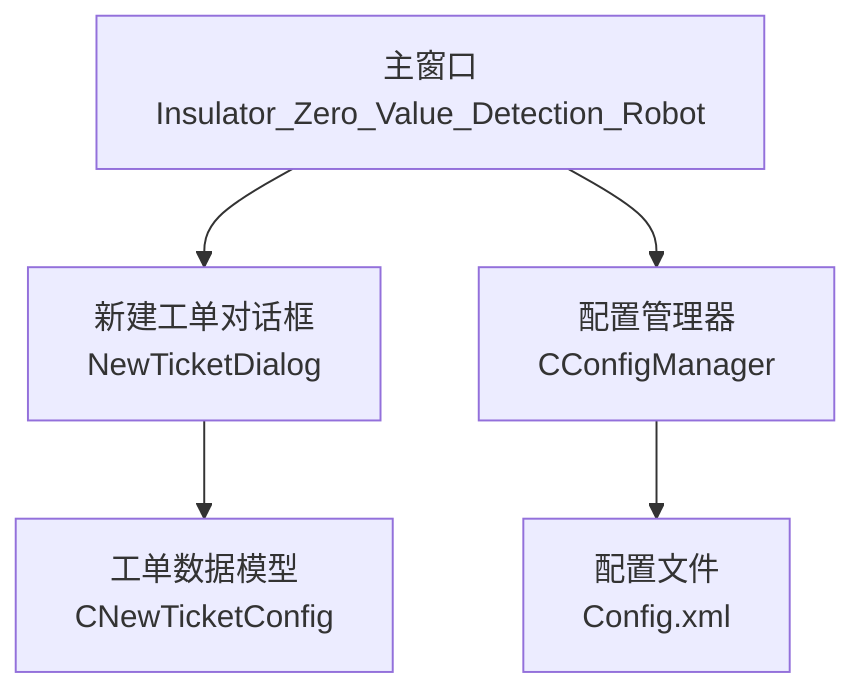
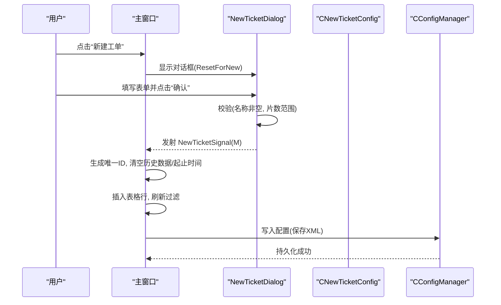
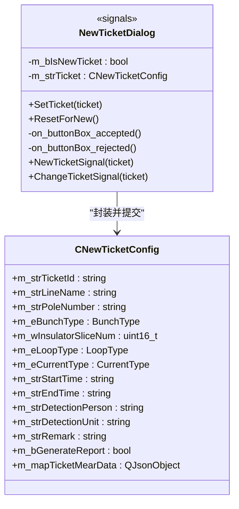
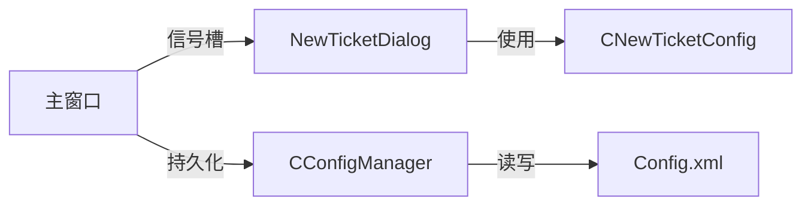

# 工单创建

<cite>
**本文引用的文件**
- [NewTicketDialog.h](file://Insulator_Zero_Value_Detection_Robot/UI/NewTicketDialog.h)
- [NewTicketDialog.cpp](file://Insulator_Zero_Value_Detection_Robot/UI/NewTicketDialog.cpp)
- [NewTicketDialog.ui](file://Insulator_Zero_Value_Detection_Robot/UI/NewTicketDialog.ui)
- [ConfigManager.h](file://Insulator_Zero_Value_Detection_Robot/Config/ConfigManager.h)
- [ConfigManager.cpp](file://Insulator_Zero_Value_Detection_Robot/Config/ConfigManager.cpp)
- [Insulator_Zero_Value_Detection_Robot.h](file://Insulator_Zero_Value_Detection_Robot/UI/Insulator_Zero_Value_Detection_Robot.h)
- [Insulator_Zero_Value_Detection_Robot.cpp](file://Insulator_Zero_Value_Detection_Robot/UI/Insulator_Zero_Value_Detection_Robot.cpp)
</cite>

## 目录
1. [简介](#简介)
2. [项目结构](#项目结构)
3. [核心组件](#核心组件)
4. [架构总览](#架构总览)
5. [详细组件分析](#详细组件分析)
6. [依赖关系分析](#依赖关系分析)
7. [性能与可用性考虑](#性能与可用性考虑)
8. [故障排除指南](#故障排除指南)
9. [结论](#结论)
10. [附录：字段说明与校验规则](#附录字段说明与校验规则)

## 简介
本章节面向绝缘子零值检测机器人V2的“工单创建”功能，系统性地说明从打开新建工单对话框到完成提交的全流程。文档覆盖：
- 界面字段含义、输入格式与校验规则
- 工单数据结构（CNewTicketConfig）各字段的定义与用途
- 数据校验机制与错误提示
- 完整操作步骤与最佳实践
- 常见问题与排错建议

## 项目结构
与工单创建直接相关的代码位于UI层与配置管理层：
- UI层：NewTicketDialog（对话框）、主窗口（触发与接收信号）
- 配置层：CNewTicketConfig（工单数据模型）、CConfigManager（持久化读写）

图表来源
- [Insulator_Zero_Value_Detection_Robot.cpp:1829-1836](file://Insulator_Zero_Value_Detection_Robot/UI/Insulator_Zero_Value_Detection_Robot.cpp#L1829-L1836)
- [NewTicketDialog.cpp:30-66](file://Insulator_Zero_Value_Detection_Robot/UI/NewTicketDialog.cpp#L30-L66)
- [ConfigManager.cpp:133-219](file://Insulator_Zero_Value_Detection_Robot/Config/ConfigManager.cpp#L133-L219)

章节来源
- [Insulator_Zero_Value_Detection_Robot.cpp:1829-1836](file://Insulator_Zero_Value_Detection_Robot/UI/Insulator_Zero_Value_Detection_Robot.cpp#L1829-L1836)
- [NewTicketDialog.cpp:30-66](file://Insulator_Zero_Value_Detection_Robot/UI/NewTicketDialog.cpp#L30-L66)
- [ConfigManager.cpp:133-219](file://Insulator_Zero_Value_Detection_Robot/Config/ConfigManager.cpp#L133-L219)

## 核心组件
- NewTicketDialog：负责展示新建/修改工单的表单，执行基础校验，并通过信号将CNewTicketConfig回传给主窗口。
- CNewTicketConfig：定义工单的数据结构与枚举类型，包含线路名称、杆塔号、串数、片数、回路数、交直流类型、起止时间、检测人员、检测单位、备注、报告标记及测量数据等。
- CConfigManager：负责将工单列表读取/写入XML配置文件，并在加载时解析为CNewTicketConfig对象集合。
- 主窗口：提供“新建工单”入口，处理对话框返回的信号，生成唯一ID、插入表格、更新配置并持久化。

章节来源
- [NewTicketDialog.h:10-35](file://Insulator_Zero_Value_Detection_Robot/UI/NewTicketDialog.h#L10-L35)
- [ConfigManager.h:52-183](file://Insulator_Zero_Value_Detection_Robot/Config/ConfigManager.h#L52-L183)
- [ConfigManager.cpp:133-219](file://Insulator_Zero_Value_Detection_Robot/Config/ConfigManager.cpp#L133-L219)
- [Insulator_Zero_Value_Detection_Robot.h:130-131](file://Insulator_Zero_Value_Detection_Robot/UI/Insulator_Zero_Value_Detection_Robot.h#L130-L131)

## 架构总览
工单创建的端到端时序如下：

图表来源
- [Insulator_Zero_Value_Detection_Robot.cpp:1829-1836](file://Insulator_Zero_Value_Detection_Robot/UI/Insulator_Zero_Value_Detection_Robot.cpp#L1829-L1836)
- [NewTicketDialog.cpp:30-66](file://Insulator_Zero_Value_Detection_Robot/UI/NewTicketDialog.cpp#L30-L66)
- [Insulator_Zero_Value_Detection_Robot.cpp:2847-2865](file://Insulator_Zero_Value_Detection_Robot/UI/Insulator_Zero_Value_Detection_Robot.cpp#L2847-L2865)
- [ConfigManager.cpp:363-385](file://Insulator_Zero_Value_Detection_Robot/Config/ConfigManager.cpp#L363-L385)

## 详细组件分析

### 新建工单对话框（NewTicketDialog）
- 职责
  - 展示新增/修改工单的表单控件
  - 对必填项和数值范围进行校验
  - 将表单数据映射到CNewTicketConfig并通过信号回传
- 关键行为
  - 开始/结束时间为只读，由检测流程自动打点，对话框内不编辑
  - 确认按钮触发校验与数据封装
  - 支持“新建”与“修改”两种模式（通过内部标志区分）
- 交互要点
  - 新建前调用ResetForNew清空历史输入与缓存配置，避免残留
  - 提交后关闭对话框

章节来源
- [NewTicketDialog.cpp:6-23](file://Insulator_Zero_Value_Detection_Robot/UI/NewTicketDialog.cpp#L6-L23)
- [NewTicketDialog.cpp:30-66](file://Insulator_Zero_Value_Detection_Robot/UI/NewTicketDialog.cpp#L30-L66)
- [NewTicketDialog.cpp:68-105](file://Insulator_Zero_Value_Detection_Robot/UI/NewTicketDialog.cpp#L68-L105)
- [NewTicketDialog.ui:50-467](file://Insulator_Zero_Value_Detection_Robot/UI/NewTicketDialog.ui#L50-L467)

#### 类图（对话框与数据模型）

图表来源
- [NewTicketDialog.h:10-35](file://Insulator_Zero_Value_Detection_Robot/UI/NewTicketDialog.h#L10-L35)
- [ConfigManager.h:52-183](file://Insulator_Zero_Value_Detection_Robot/Config/ConfigManager.h#L52-L183)

### 主窗口（工单信号处理与持久化）
- 入口：On_NewTicket_Click 打开对话框，并在打开前重置状态
- 信号处理：On_NewTicketSignal 接收新工单，生成唯一ID，清理历史数据与起止时间，插入表格，更新配置并保存
- 辅助：SetTicketRow 将CNewTicketConfig映射到表格列；RenumberTicketTable 重排序号；FilterTicketTable 支持按线路名称与检测人员过滤

章节来源
- [Insulator_Zero_Value_Detection_Robot.cpp:1829-1836](file://Insulator_Zero_Value_Detection_Robot/UI/Insulator_Zero_Value_Detection_Robot.cpp#L1829-L1836)
- [Insulator_Zero_Value_Detection_Robot.cpp:2847-2865](file://Insulator_Zero_Value_Detection_Robot/UI/Insulator_Zero_Value_Detection_Robot.cpp#L2847-L2865)
- [Insulator_Zero_Value_Detection_Robot.cpp:2926-2950](file://Insulator_Zero_Value_Detection_Robot/UI/Insulator_Zero_Value_Detection_Robot.cpp#L2926-L2950)
- [Insulator_Zero_Value_Detection_Robot.cpp:2986-3008](file://Insulator_Zero_Value_Detection_Robot/UI/Insulator_Zero_Value_Detection_Robot.cpp#L2986-L3008)

### 配置管理（CConfigManager 与 XML 持久化）
- 读取：解析XML中的NewTicketList节点，填充CNewTicketConfig对象集合
- 写入：将CNewTicketConfig对象序列化为XML元素，包括基本字段与测量数据JSON
- 关键点：枚举与字符串互转方法用于序列化/反序列化

章节来源
- [ConfigManager.cpp:133-219](file://Insulator_Zero_Value_Detection_Robot/Config/ConfigManager.cpp#L133-L219)
- [ConfigManager.cpp:363-385](file://Insulator_Zero_Value_Detection_Robot/Config/ConfigManager.cpp#L363-L385)
- [ConfigManager.h:80-152](file://Insulator_Zero_Value_Detection_Robot/Config/ConfigManager.h#L80-L152)

## 依赖关系分析
- 耦合关系
  - NewTicketDialog 依赖 CNewTicketConfig 作为数据载体
  - 主窗口依赖 NewTicketDialog 的信号槽机制解耦UI与业务
  - 主窗口依赖 CConfigManager 实现配置的持久化
- 外部依赖
  - Qt框架（QDialog/QWidget/QMessageBox/QDateTime等）
  - tinyxml2（XML读写）
  - JSON库（QJsonObject/QJsonArray）

图表来源
- [NewTicketDialog.h:18-20](file://Insulator_Zero_Value_Detection_Robot/UI/NewTicketDialog.h#L18-L20)
- [Insulator_Zero_Value_Detection_Robot.h:130-131](file://Insulator_Zero_Value_Detection_Robot/UI/Insulator_Zero_Value_Detection_Robot.h#L130-L131)
- [ConfigManager.cpp:133-219](file://Insulator_Zero_Value_Detection_Robot/Config/ConfigManager.cpp#L133-L219)

章节来源
- [NewTicketDialog.h:18-20](file://Insulator_Zero_Value_Detection_Robot/UI/NewTicketDialog.h#L18-L20)
- [Insulator_Zero_Value_Detection_Robot.h:130-131](file://Insulator_Zero_Value_Detection_Robot/UI/Insulator_Zero_Value_Detection_Robot.h#L130-L131)
- [ConfigManager.cpp:133-219](file://Insulator_Zero_Value_Detection_Robot/Config/ConfigManager.cpp#L133-L219)

## 性能与可用性考虑
- 对话框置顶显示，减少误操作干扰
- 新建前强制重置，避免历史数据污染
- 仅对必要字段做校验，降低用户负担
- 表格插入在最前并立即刷新过滤，提升可见性
- 配置写入在完成后统一执行，减少频繁IO

[本节为通用指导，无需特定文件引用]

## 故障排除指南
- 常见错误与处理
  - 名称为空：提交时弹出提示，阻止继续
  - 片数不在1~60：提交时弹出提示，阻止继续
  - 时间不可编辑：开始/结束时间由检测流程自动打点，不允许手动修改
- 排查步骤
  - 检查是否已调用ResetForNew，确保无历史残留
  - 确认对话框中下拉框选择正确（串数、回路数、交直流）
  - 查看日志输出，确认“打开新建工单对话框”与“新增工单”记录
  - 检查Config.xml是否成功写入，确认新增条目存在

章节来源
- [NewTicketDialog.cpp:30-45](file://Insulator_Zero_Value_Detection_Robot/UI/NewTicketDialog.cpp#L30-L45)
- [Insulator_Zero_Value_Detection_Robot.cpp:1829-1836](file://Insulator_Zero_Value_Detection_Robot/UI/Insulator_Zero_Value_Detection_Robot.cpp#L1829-L1836)
- [Insulator_Zero_Value_Detection_Robot.cpp:2847-2865](file://Insulator_Zero_Value_Detection_Robot/UI/Insulator_Zero_Value_Detection_Robot.cpp#L2847-L2865)

## 结论
工单创建功能通过清晰的UI交互、严格的基础校验与可靠的数据持久化，保证了工单数据的完整性与一致性。结合主窗口的信号槽机制与配置管理器的XML读写，形成了稳定可扩展的工单生命周期管理。遵循本文档的操作步骤与最佳实践，可快速创建规范的检测工单并顺利进入后续检测流程。

[本节为总结，无需特定文件引用]

## 附录：字段说明与校验规则
- 线路名称（必填）
  - 含义：标识本次检测的线路
  - 输入格式：任意文本（不能为空）
  - 校验规则：提交时检查是否为空
- 杆塔号（可选）
  - 含义：具体杆塔编号
  - 输入格式：任意文本
  - 校验规则：无强制校验
- 串数（下拉）
  - 含义：单联或双联
  - 选项：单联、双联
  - 校验规则：必须选择一项
- 绝缘子片数（必填）
  - 含义：每串绝缘子数量
  - 输入格式：整数
  - 校验规则：1~60之间
- 回路数（下拉）
  - 含义：同塔单回/双回/四回
  - 选项：单回、双回、四回
  - 校验规则：必须选择一项
- 检测单位（可选）
  - 含义：组织或单位名称
  - 输入格式：任意文本
  - 校验规则：无强制校验
- 备注信息（可选）
  - 含义：补充说明
  - 输入格式：任意文本
  - 校验规则：无强制校验
- 交/直流（下拉）
  - 含义：交流或直流
  - 选项：交流、直流
  - 校验规则：必须选择一项
- 开始时间/结束时间（只读）
  - 含义：检测任务的真实起止时间
  - 输入格式：yyyy-MM-dd HH:mm（由检测流程自动打点）
  - 校验规则：不允许手动编辑
- 检测人员（可选）
  - 含义：执行人姓名
  - 输入格式：任意文本
  - 校验规则：无强制校验

章节来源
- [NewTicketDialog.ui:50-467](file://Insulator_Zero_Value_Detection_Robot/UI/NewTicketDialog.ui#L50-L467)
- [NewTicketDialog.cpp:30-66](file://Insulator_Zero_Value_Detection_Robot/UI/NewTicketDialog.cpp#L30-L66)
- [ConfigManager.h:154-183](file://Insulator_Zero_Value_Detection_Robot/Config/ConfigManager.h#L154-L183)