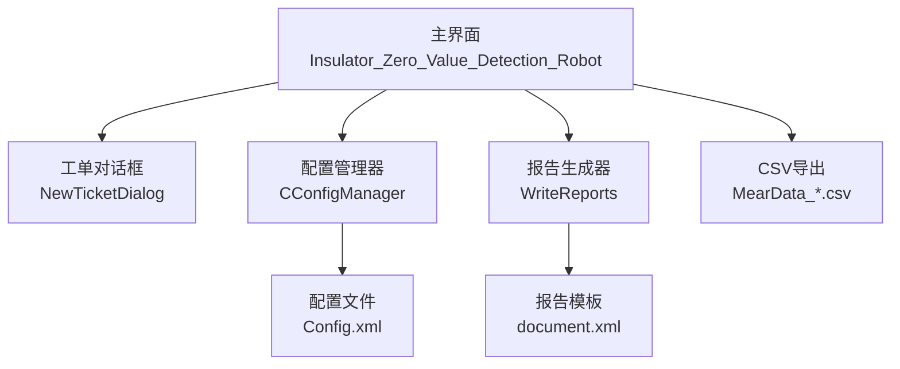
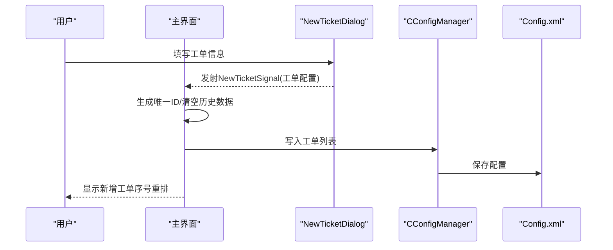
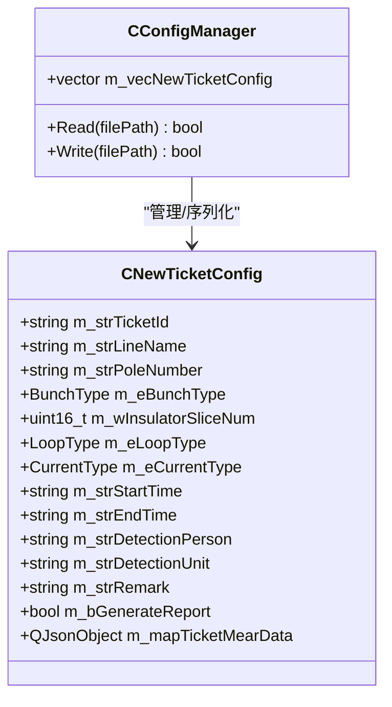
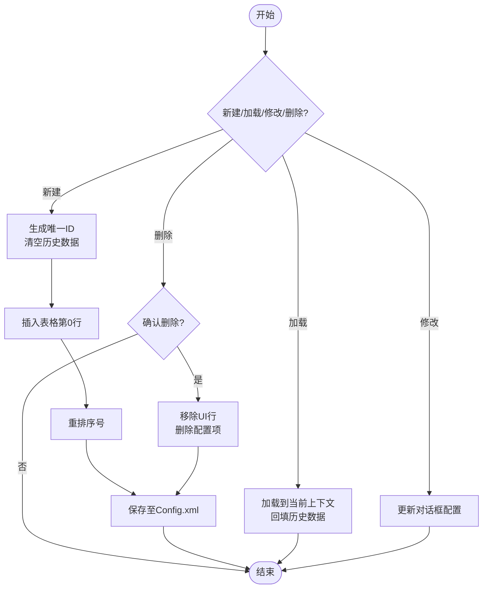
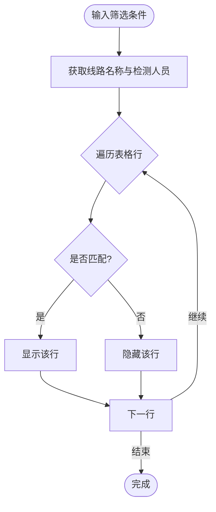
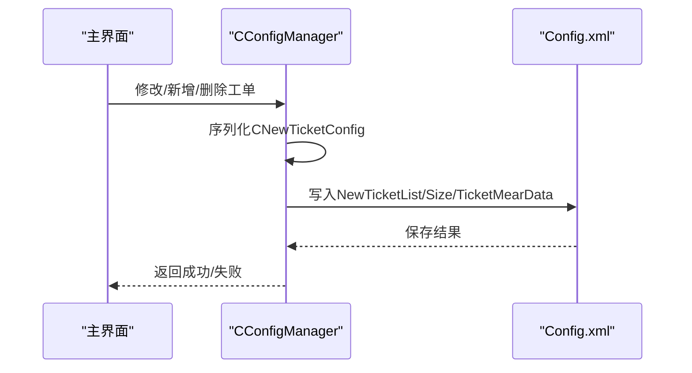
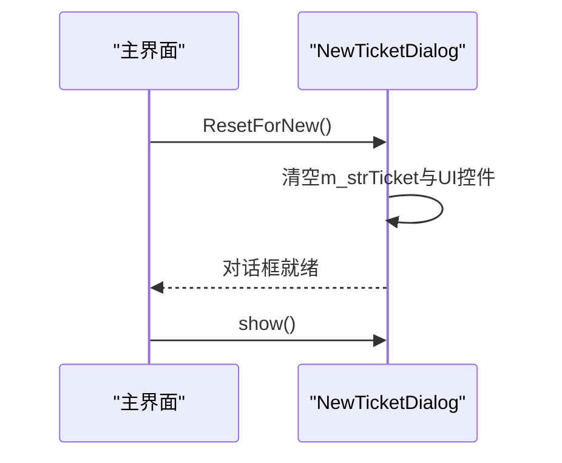
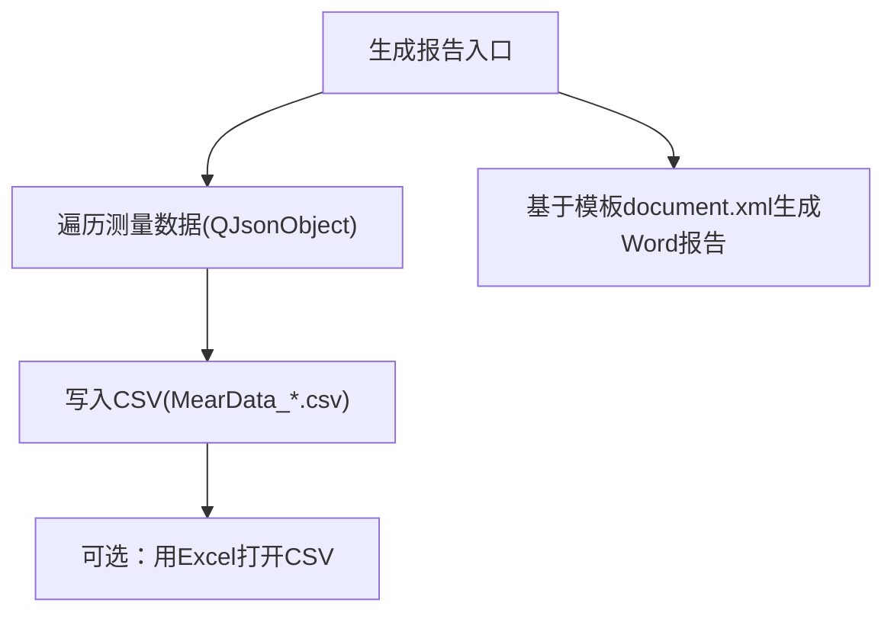
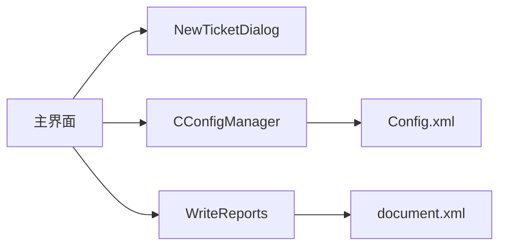

# 工单管理

<cite>
**本文引用的文件**
- [ConfigManager.h](file://Insulator_Zero_Value_Detection_Robot/Config/ConfigManager.h)
- [ConfigManager.cpp](file://Insulator_Zero_Value_Detection_Robot/Config/ConfigManager.cpp)
- [NewTicketDialog.h](file://Insulator_Zero_Value_Detection_Robot/UI/NewTicketDialog.h)
- [NewTicketDialog.cpp](file://Insulator_Zero_Value_Detection_Robot/UI/NewTicketDialog.cpp)
- [Insulator_Zero_Value_Detection_Robot.h](file://Insulator_Zero_Value_Detection_Robot/UI/Insulator_Zero_Value_Detection_Robot.h)
- [Insulator_Zero_Value_Detection_Robot.cpp](file://Insulator_Zero_Value_Detection_Robot/UI/Insulator_Zero_Value_Detection_Robot.cpp)
- [WriteReports.cpp](file://Insulator_Zero_Value_Detection_Robot/Report/WriteReports.cpp)
- [document.xml](file://Insulator_Zero_Value_Detection_Robot/Report/document.xml)
- [操作说明书.md](file://操作说明书.md)
</cite>

## 目录
1. [简介](#简介)
2. [项目结构](#项目结构)
3. [核心组件](#核心组件)
4. [架构总览](#架构总览)
5. [详细组件分析](#详细组件分析)
6. [依赖关系分析](#依赖关系分析)
7. [性能考虑](#性能考虑)
8. [故障排查指南](#故障排查指南)
9. [结论](#结论)
10. [附录](#附录)

## 简介
本章节面向绝缘子零值检测机器人V2的“工单管理”功能，围绕工单的存储、查询、删除与组织管理进行系统化说明。重点覆盖：
- 工单数据模型CNewTicketConfig在配置文件中的表示方式
- 工单历史测量数据的保存位置与格式（XML内嵌JSON、CSV导出）
- 历史记录自动保存、版本控制与清理策略
- ResetForNew方法的工作原理与使用场景
- 工单导入导出能力（当前实现为CSV导出；Excel通过CSV兼容）
- 工单搜索与筛选机制
- 最佳实践建议（归档、备份、权限控制等）

## 项目结构
与工单管理直接相关的代码分布在以下模块：
- 配置与持久化：ConfigManager（读取/写入Config.xml，包含工单列表与报告列表）
- UI交互：NewTicketDialog（新建/修改工单对话框）、主界面（工单表维护、筛选、删除、加载）
- 报告与数据导出：WriteReports（基于模板生成Word报告）、CSV导出逻辑（主界面中生成MearData_*.csv）
- 文档：操作说明书（用户流程说明）

图表来源
- [Insulator_Zero_Value_Detection_Robot.cpp:1829-1906](file://Insulator_Zero_Value_Detection_Robot/UI/Insulator_Zero_Value_Detection_Robot.cpp#L1829-L1906)
- [ConfigManager.cpp:16-257](file://Insulator_Zero_Value_Detection_Robot/Config/ConfigManager.cpp#L16-L257)
- [WriteReports.cpp:206-228](file://Insulator_Zero_Value_Detection_Robot/Report/WriteReports.cpp#L206-L228)

章节来源
- [Insulator_Zero_Value_Detection_Robot.h:202-223](file://Insulator_Zero_Value_Detection_Robot/UI/Insulator_Zero_Value_Detection_Robot.h#L202-L223)
- [ConfigManager.h:52-199](file://Insulator_Zero_Value_Detection_Robot/Config/ConfigManager.h#L52-L199)
- [操作说明书.md:265-308](file://操作说明书.md#L265-L308)

## 核心组件
- CNewTicketConfig：工单数据模型，包含工单标识、线路信息、串数类型、回路数、交直流类型、起止时间、检测人员/单位、备注、是否已生成报告标志，以及测量数据（QJsonObject）。
- CConfigManager：负责从Config.xml读取/写入所有配置项，包括设备控制板参数、相机参数、工单列表（m_vecNewTicketConfig）和报告列表（m_vecNewReportConfig）。
- NewTicketDialog：新建/修改工单的UI对话框，提供ResetForNew用于重置状态，避免残留上一个工单的数据。
- 主界面：提供工单的新建、加载、修改、删除、筛选、序号重排、时间列刷新、CSV导出等功能。

章节来源
- [ConfigManager.h:52-199](file://Insulator_Zero_Value_Detection_Robot/Config/ConfigManager.h#L52-L199)
- [ConfigManager.cpp:132-217](file://Insulator_Zero_Value_Detection_Robot/Config/ConfigManager.cpp#L132-L217)
- [NewTicketDialog.h:10-35](file://Insulator_Zero_Value_Detection_Robot/UI/NewTicketDialog.h#L10-L35)
- [NewTicketDialog.cpp:30-105](file://Insulator_Zero_Value_Detection_Robot/UI/NewTicketDialog.cpp#L30-L105)
- [Insulator_Zero_Value_Detection_Robot.cpp:1829-1906](file://Insulator_Zero_Value_Detection_Robot/UI/Insulator_Zero_Value_Detection_Robot.cpp#L1829-L1906)

## 架构总览
工单管理的整体流程如下：
- 新建工单：用户在对话框输入基本信息，提交后由主界面生成唯一ID并插入表格，随后保存到Config.xml。
- 加载工单：选择行后加载到当前工单上下文，并回填历史测量数据。
- 修改/删除：支持编辑与删除，删除时同步更新内存与配置文件，并重排序号。
- 筛选：支持按线路名称与检测人员实时过滤。
- 导出：生成CSV文件，便于Excel打开；报告可基于模板生成Word文档。

图表来源
- [NewTicketDialog.cpp:30-66](file://Insulator_Zero_Value_Detection_Robot/UI/NewTicketDialog.cpp#L30-L66)
- [Insulator_Zero_Value_Detection_Robot.cpp:2847-2862](file://Insulator_Zero_Value_Detection_Robot/UI/Insulator_Zero_Value_Detection_Robot.cpp#L2847-L2862)
- [ConfigManager.cpp:349-414](file://Insulator_Zero_Value_Detection_Robot/Config/ConfigManager.cpp#L349-L414)

## 详细组件分析

### 数据模型与存储：CNewTicketConfig与Config.xml
- CNewTicketConfig字段涵盖工单基本属性与测量数据容器（QJsonObject），其中测量数据以JSON文本形式嵌入XML节点中，便于跨平台解析与扩展。
- ConfigManager::Read/Write负责将CNewTicketConfig序列化为XML元素，并在读取时反序列化为对象。工单列表位于NewTicketList下，每个Size节点对应一个工单。

图表来源
- [ConfigManager.h:52-199](file://Insulator_Zero_Value_Detection_Robot/Config/ConfigManager.h#L52-L199)
- [ConfigManager.cpp:132-217](file://Insulator_Zero_Value_Detection_Robot/Config/ConfigManager.cpp#L132-L217)
- [ConfigManager.cpp:349-414](file://Insulator_Zero_Value_Detection_Robot/Config/ConfigManager.cpp#L349-L414)

章节来源
- [ConfigManager.h:52-199](file://Insulator_Zero_Value_Detection_Robot/Config/ConfigManager.h#L52-L199)
- [ConfigManager.cpp:132-217](file://Insulator_Zero_Value_Detection_Robot/Config/ConfigManager.cpp#L132-L217)
- [ConfigManager.cpp:349-414](file://Insulator_Zero_Value_Detection_Robot/Config/ConfigManager.cpp#L349-L414)

### 工单生命周期与状态管理
- 新建：主界面接收信号后生成唯一ID，清空历史测量数据与起止时间，插入表格最前并重新编号。
- 加载：选中行后将配置复制到当前工单上下文，并加载其历史测量数据。
- 修改：通过对话框设置现有配置并提交变更。
- 删除：确认后从UI移除并从配置管理器删除对应项，保存配置并重排序号。

图表来源
- [Insulator_Zero_Value_Detection_Robot.cpp:1829-1906](file://Insulator_Zero_Value_Detection_Robot/UI/Insulator_Zero_Value_Detection_Robot.cpp#L1829-L1906)
- [Insulator_Zero_Value_Detection_Robot.cpp:2847-2862](file://Insulator_Zero_Value_Detection_Robot/UI/Insulator_Zero_Value_Detection_Robot.cpp#L2847-L2862)
- [Insulator_Zero_Value_Detection_Robot.cpp:2941-2971](file://Insulator_Zero_Value_Detection_Robot/UI/Insulator_Zero_Value_Detection_Robot.cpp#L2941-L2971)

章节来源
- [Insulator_Zero_Value_Detection_Robot.cpp:1829-1906](file://Insulator_Zero_Value_Detection_Robot/UI/Insulator_Zero_Value_Detection_Robot.cpp#L1829-L1906)
- [Insulator_Zero_Value_Detection_Robot.cpp:2847-2862](file://Insulator_Zero_Value_Detection_Robot/UI/Insulator_Zero_Value_Detection_Robot.cpp#L2847-L2862)
- [Insulator_Zero_Value_Detection_Robot.cpp:2941-2971](file://Insulator_Zero_Value_Detection_Robot/UI/Insulator_Zero_Value_Detection_Robot.cpp#L2941-L2971)

### 工单搜索与筛选
- 支持按“线路名称”和“检测人员”进行模糊匹配，实时隐藏不匹配的行。
- 提供重置按钮清空筛选条件并恢复全部显示。

图表来源
- [Insulator_Zero_Value_Detection_Robot.cpp:2986-3008](file://Insulator_Zero_Value_Detection_Robot/UI/Insulator_Zero_Value_Detection_Robot.cpp#L2986-L3008)
- [Insulator_Zero_Value_Detection_Robot.cpp:3034-3043](file://Insulator_Zero_Value_Detection_Robot/UI/Insulator_Zero_Value_Detection_Robot.cpp#L3034-L3043)

章节来源
- [Insulator_Zero_Value_Detection_Robot.cpp:2986-3008](file://Insulator_Zero_Value_Detection_Robot/UI/Insulator_Zero_Value_Detection_Robot.cpp#L2986-L3008)
- [Insulator_Zero_Value_Detection_Robot.cpp:3034-3043](file://Insulator_Zero_Value_Detection_Robot/UI/Insulator_Zero_Value_Detection_Robot.cpp#L3034-L3043)

### 历史记录管理与自动保存
- 历史测量数据保存在CNewTicketConfig的QJsonObject中，并通过ConfigManager序列化为XML节点（TicketMearData）。
- 每次保存配置（如删除、新增、修改）都会调用Write将最新状态写回Config.xml，确保一致性。
- 当前实现未显式提供“版本控制”或“自动清理策略”，建议在外部流程中进行定期归档与备份。

图表来源
- [ConfigManager.cpp:349-414](file://Insulator_Zero_Value_Detection_Robot/Config/ConfigManager.cpp#L349-L414)
- [Insulator_Zero_Value_Detection_Robot.cpp:1891-1903](file://Insulator_Zero_Value_Detection_Robot/UI/Insulator_Zero_Value_Detection_Robot.cpp#L1891-L1903)

章节来源
- [ConfigManager.cpp:349-414](file://Insulator_Zero_Value_Detection_Robot/Config/ConfigManager.cpp#L349-L414)
- [Insulator_Zero_Value_Detection_Robot.cpp:1891-1903](file://Insulator_Zero_Value_Detection_Robot/UI/Insulator_Zero_Value_Detection_Robot.cpp#L1891-L1903)

### ResetForNew方法的工作原理与使用场景
- 作用：在打开新建工单对话框前，清空内部缓存的工单配置（含历史测量数据），并将状态标记为新建态，同时清空所有输入框与下拉框，起止时间设置为当前时间占位。
- 使用场景：主界面在点击“新建”时调用，避免上一个工单（尤其是修改过的）残留影响新工单。

图表来源
- [NewTicketDialog.cpp:86-105](file://Insulator_Zero_Value_Detection_Robot/UI/NewTicketDialog.cpp#L86-L105)
- [Insulator_Zero_Value_Detection_Robot.cpp:1829-1836](file://Insulator_Zero_Value_Detection_Robot/UI/Insulator_Zero_Value_Detection_Robot.cpp#L1829-L1836)

章节来源
- [NewTicketDialog.cpp:86-105](file://Insulator_Zero_Value_Detection_Robot/UI/NewTicketDialog.cpp#L86-L105)
- [Insulator_Zero_Value_Detection_Robot.cpp:1829-1836](file://Insulator_Zero_Value_Detection_Robot/UI/Insulator_Zero_Value_Detection_Robot.cpp#L1829-L1836)

### 工单导入导出功能
- 导出CSV：在生成报告时，系统会将当前工单的测量数据按侧别、方向、序号导出为MearData_*.csv文件，UTF-8编码并带BOM，便于Excel打开。
- Excel导入：当前代码未实现Excel/CSV导入工单的功能，仅支持CSV导出。如需批量导入，可在外部工具中准备CSV并按接口规范转换为Config.xml或调用相应API。
- Word报告：基于document.xml模板填充数据，生成检测报告。

图表来源
- [Insulator_Zero_Value_Detection_Robot.cpp:2776-2818](file://Insulator_Zero_Value_Detection_Robot/UI/Insulator_Zero_Value_Detection_Robot.cpp#L2776-L2818)
- [WriteReports.cpp:206-228](file://Insulator_Zero_Value_Detection_Robot/Report/WriteReports.cpp#L206-L228)
- [document.xml:1-2](file://Insulator_Zero_Value_Detection_Robot/Report/document.xml#L1-L2)

章节来源
- [Insulator_Zero_Value_Detection_Robot.cpp:2776-2818](file://Insulator_Zero_Value_Detection_Robot/UI/Insulator_Zero_Value_Detection_Robot.cpp#L2776-L2818)
- [WriteReports.cpp:206-228](file://Insulator_Zero_Value_Detection_Robot/Report/WriteReports.cpp#L206-L228)
- [document.xml:1-2](file://Insulator_Zero_Value_Detection_Robot/Report/document.xml#L1-L2)

### 最佳实践建议
- 定期归档：建议将Config.xml与CSV文件按日期归档，便于审计与回溯。
- 数据备份：对运行目录下的配置文件与输出文件进行定期备份，防止数据丢失。
- 权限控制：限制Config.xml与输出目录的读写权限，仅授权人员可修改。
- 版本控制：引入外部版本控制系统（如Git）管理配置文件与报告模板，记录变更历史。
- 清理策略：建立定期清理规则，删除过期工单与报告，释放存储空间。

[本节为通用建议，不直接引用具体代码文件]

## 依赖关系分析
- 主界面依赖NewTicketDialog进行工单创建/编辑，依赖CConfigManager进行配置持久化，依赖WriteReports进行报告生成。
- CConfigManager依赖tinyxml2进行XML解析与生成，依赖QJsonDocument进行JSON序列化/反序列化。
- 报告生成依赖document.xml模板。

图表来源
- [Insulator_Zero_Value_Detection_Robot.cpp:1829-1906](file://Insulator_Zero_Value_Detection_Robot/UI/Insulator_Zero_Value_Detection_Robot.cpp#L1829-L1906)
- [ConfigManager.cpp:16-257](file://Insulator_Zero_Value_Detection_Robot/Config/ConfigManager.cpp#L16-L257)
- [WriteReports.cpp:206-228](file://Insulator_Zero_Value_Detection_Robot/Report/WriteReports.cpp#L206-L228)

章节来源
- [Insulator_Zero_Value_Detection_Robot.cpp:1829-1906](file://Insulator_Zero_Value_Detection_Robot/UI/Insulator_Zero_Value_Detection_Robot.cpp#L1829-L1906)
- [ConfigManager.cpp:16-257](file://Insulator_Zero_Value_Detection_Robot/Config/ConfigManager.cpp#L16-L257)
- [WriteReports.cpp:206-228](file://Insulator_Zero_Value_Detection_Robot/Report/WriteReports.cpp#L206-L228)

## 性能考虑
- 筛选操作为O(n)线性扫描，适用于常规规模工单列表；若工单数量增长，可考虑索引或分页优化。
- CSV导出采用顺序写入，适合中等规模数据；大数据量时可考虑分块写入以提升稳定性。
- XML读写涉及JSON序列化/反序列化，注意避免频繁全量写入，可在必要时合并多次变更后再统一保存。

[本节为通用指导，不直接引用具体代码文件]

## 故障排查指南
- 工单删除后序号不连续：检查是否调用了重排序号函数。
- 筛选无效：确认筛选条件输入是否正确，以及事件绑定是否生效。
- CSV导出失败：检查文件路径与权限，查看日志输出定位问题。
- 配置保存失败：检查Config.xml路径与写入权限，确认XML结构完整性。

章节来源
- [Insulator_Zero_Value_Detection_Robot.cpp:2941-2971](file://Insulator_Zero_Value_Detection_Robot/UI/Insulator_Zero_Value_Detection_Robot.cpp#L2941-L2971)
- [Insulator_Zero_Value_Detection_Robot.cpp:2986-3008](file://Insulator_Zero_Value_Detection_Robot/UI/Insulator_Zero_Value_Detection_Robot.cpp#L2986-L3008)
- [Insulator_Zero_Value_Detection_Robot.cpp:2776-2818](file://Insulator_Zero_Value_Detection_Robot/UI/Insulator_Zero_Value_Detection_Robot.cpp#L2776-L2818)

## 结论
本项目的工单管理功能围绕CNewTicketConfig与CConfigManager构建，实现了工单的创建、加载、修改、删除、筛选与CSV导出，并通过XML持久化保证数据一致性。当前未内置Excel/CSV导入与版本控制/清理策略，建议通过外部流程补充。遵循最佳实践可有效提升数据安全性与可维护性。

[本节为总结性内容，不直接引用具体代码文件]

## 附录
- 用户操作流程参考：加载工单、生成报告等步骤详见操作说明书。

章节来源
- [操作说明书.md:265-308](file://操作说明书.md#L265-L308)