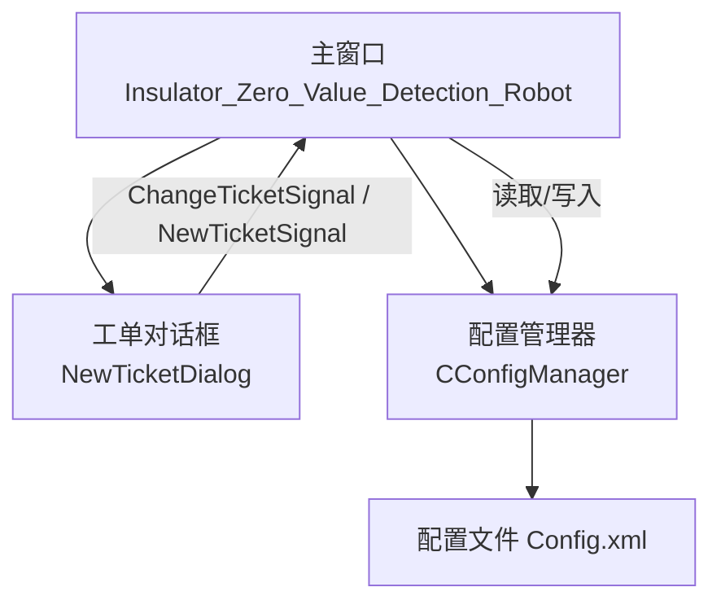
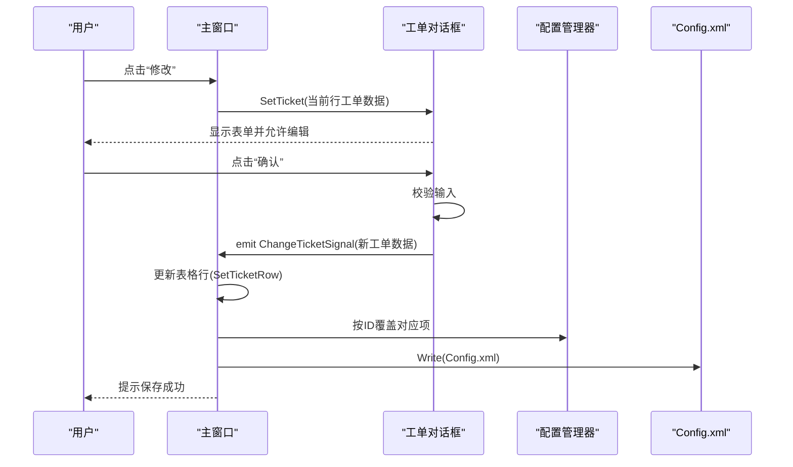
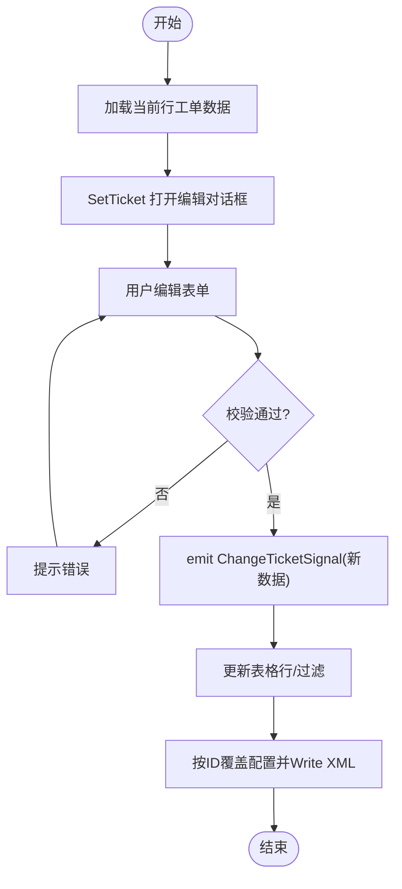
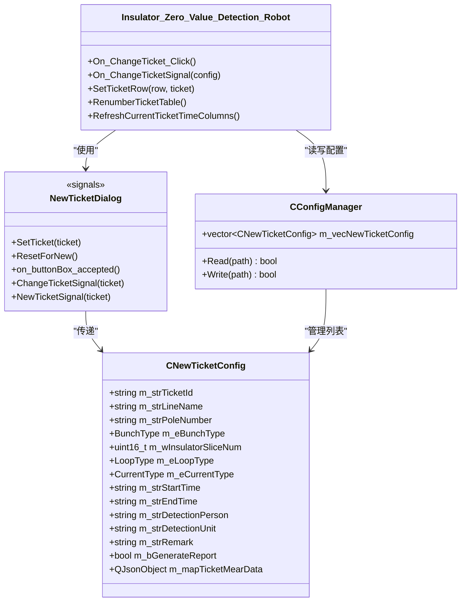

# 工单编辑

<cite>
**本文引用的文件**
- [Insulator_Zero_Value_Detection_Robot.h](file://Insulator_Zero_Value_Detection_Robot/UI/Insulator_Zero_Value_Detection_Robot.h)
- [Insulator_Zero_Value_Detection_Robot.cpp](file://Insulator_Zero_Value_Detection_Robot/UI/Insulator_Zero_Value_Detection_Robot.cpp)
- [NewTicketDialog.h](file://Insulator_Zero_Value_Detection_Robot/UI/NewTicketDialog.h)
- [NewTicketDialog.cpp](file://Insulator_Zero_Value_Detection_Robot/UI/NewTicketDialog.cpp)
- [ConfigManager.h](file://Insulator_Zero_Value_Detection_Robot/Config/ConfigManager.h)
- [ConfigManager.cpp](file://Insulator_Zero_Value_Detection_Robot/Config/ConfigManager.cpp)
</cite>

## 目录
1. [简介](#简介)
2. [项目结构](#项目结构)
3. [核心组件](#核心组件)
4. [架构总览](#架构总览)
5. [详细组件分析](#详细组件分析)
6. [依赖关系分析](#依赖关系分析)
7. [性能与一致性考虑](#性能与一致性考虑)
8. [故障排查指南](#故障排查指南)
9. [结论](#结论)
10. [附录：最佳实践](#附录最佳实践)

## 简介
本章节面向绝缘子零值检测机器人V2的“工单编辑”功能，聚焦以下目标：
- 说明如何加载已有工单、修改工单信息、更新检测配置。
- 详细说明 NewTicketDialog::SetTicket 的使用方式与参数传递机制。
- 解释 ChangeTicketSignal 信号的作用与触发时机，以及它如何驱动其他组件同步更新。
- 描述工单编辑时的数据同步机制，确保修改后的数据正确反映到系统（UI表格、内存配置、持久化XML）。
- 提供批量修改、数据备份、版本管理、冲突处理与数据恢复的建议。

## 项目结构
与工单编辑直接相关的代码分布在UI层、对话框层与配置管理层：
- UI主窗口负责按钮绑定、事件响应、表格维护与配置持久化。
- 新建/编辑工单对话框封装了表单输入、校验与信号发射。
- 配置管理器负责CNewTicketConfig的读写与XML序列化。

**图表来源**
- [Insulator_Zero_Value_Detection_Robot.cpp:340-352](file://Insulator_Zero_Value_Detection_Robot/UI/Insulator_Zero_Value_Detection_Robot.cpp#L340-L352)
- [Insulator_Zero_Value_Detection_Robot.cpp:2723-2743](file://Insulator_Zero_Value_Detection_Robot/UI/Insulator_Zero_Value_Detection_Robot.cpp#L2723-L2743)
- [ConfigManager.cpp:133-192](file://Insulator_Zero_Value_Detection_Robot/Config/ConfigManager.cpp#L133-L192)
- [ConfigManager.cpp:363-385](file://Insulator_Zero_Value_Detection_Robot/Config/ConfigManager.cpp#L363-L385)

**章节来源**
- [Insulator_Zero_Value_Detection_Robot.h:17-21](file://Insulator_Zero_Value_Detection_Robot/UI/Insulator_Zero_Value_Detection_Robot.h#L17-L21)
- [Insulator_Zero_Value_Detection_Robot.cpp:340-352](file://Insulator_Zero_Value_Detection_Robot/UI/Insulator_Zero_Value_Detection_Robot.cpp#L340-L352)

## 核心组件
- 主窗口 Insulator_Zero_Value_Detection_Robot
  - 负责绑定“新建/修改/加载/删除”等按钮事件。
  - 接收对话框发出的 NewTicketSignal 与 ChangeTicketSignal，完成UI表格更新与配置持久化。
  - 提供 SetTicketRow、RenumberTicketTable、RefreshCurrentTicketTimeColumns 等辅助方法维护表格显示。
- 工单对话框 NewTicketDialog
  - 提供 SetTicket 将已有工单数据填充到表单。
  - 在用户确认后，根据内部状态 m_bIsNewTicket 决定发射 NewTicketSignal 或 ChangeTicketSignal。
  - 提供 ResetForNew 用于新建前清空历史残留。
- 配置模型 CNewTicketConfig
  - 定义工单字段：ID、线路名称、杆塔号、串数类型、片数、回路类型、电流类型、起止时间、检测人员、检测单位、备注、是否已生成报告、测量数据JSON等。
  - 提供枚举与字符串互转工具方法。
- 配置管理器 CConfigManager
  - 维护 m_vecNewTicketConfig 列表。
  - Read/Write 实现从/向 Config.xml 序列化/反序列化。

**章节来源**
- [ConfigManager.h:52-183](file://Insulator_Zero_Value_Detection_Robot/Config/ConfigManager.h#L52-L183)
- [ConfigManager.h:185-199](file://Insulator_Zero_Value_Detection_Robot/Config/ConfigManager.h#L185-L199)
- [NewTicketDialog.h:18-35](file://Insulator_Zero_Value_Detection_Robot/UI/NewTicketDialog.h#L18-L35)
- [Insulator_Zero_Value_Detection_Robot.h:129-133](file://Insulator_Zero_Value_Detection_Robot/UI/Insulator_Zero_Value_Detection_Robot.h#L129-L133)

## 架构总览
工单编辑采用“对话框 -> 信号 -> 主窗口 -> 配置持久化”的单向数据流，保证UI与存储的一致性。

**图表来源**
- [Insulator_Zero_Value_Detection_Robot.cpp:1908-1920](file://Insulator_Zero_Value_Detection_Robot/UI/Insulator_Zero_Value_Detection_Robot.cpp#L1908-L1920)
- [NewTicketDialog.cpp:30-66](file://Insulator_Zero_Value_Detection_Robot/UI/NewTicketDialog.cpp#L30-L66)
- [Insulator_Zero_Value_Detection_Robot.cpp:2723-2743](file://Insulator_Zero_Value_Detection_Robot/UI/Insulator_Zero_Value_Detection_Robot.cpp#L2723-L2743)
- [ConfigManager.cpp:363-385](file://Insulator_Zero_Value_Detection_Robot/Config/ConfigManager.cpp#L363-L385)

## 详细组件分析

### 工单编辑流程（修改）
- 入口：主窗口 On_ChangeTicket_Click
  - 获取当前选中行的工单数据，调用 newTicketDialog->SetTicket(...) 打开编辑对话框。
- 对话框侧：NewTicketDialog::on_buttonBox_accepted
  - 校验名称非空、片数范围[1,60]。
  - 构造新的 CNewTicketConfig，保留起止时间（由检测流程自动打点），设置检测人员等可编辑字段。
  - 若为编辑模式（m_bIsNewTicket == false），发射 ChangeTicketSignal；否则发射 NewTicketSignal。
- 主窗口侧：On_ChangeTicketSignal
  - 更新表格当前行（SetTicketRow），刷新过滤结果。
  - 在配置管理器列表中按ID匹配并覆盖旧项。
  - 调用 Write 持久化至 Config.xml。

**图表来源**
- [Insulator_Zero_Value_Detection_Robot.cpp:1908-1920](file://Insulator_Zero_Value_Detection_Robot/UI/Insulator_Zero_Value_Detection_Robot.cpp#L1908-L1920)
- [NewTicketDialog.cpp:30-66](file://Insulator_Zero_Value_Detection_Robot/UI/NewTicketDialog.cpp#L30-L66)
- [Insulator_Zero_Value_Detection_Robot.cpp:2723-2743](file://Insulator_Zero_Value_Detection_Robot/UI/Insulator_Zero_Value_Detection_Robot.cpp#L2723-L2743)

**章节来源**
- [Insulator_Zero_Value_Detection_Robot.cpp:1908-1920](file://Insulator_Zero_Value_Detection_Robot/UI/Insulator_Zero_Value_Detection_Robot.cpp#L1908-L1920)
- [NewTicketDialog.cpp:30-66](file://Insulator_Zero_Value_Detection_Robot/UI/NewTicketDialog.cpp#L30-L66)
- [Insulator_Zero_Value_Detection_Robot.cpp:2723-2743](file://Insulator_Zero_Value_Detection_Robot/UI/Insulator_Zero_Value_Detection_Robot.cpp#L2723-L2743)

### SetTicket 方法与参数传递
- 作用：将已有工单数据填充到对话框控件，进入编辑模式。
- 关键行为：
  - 复制传入的 CNewTicketConfig 到内部缓存 m_strTicket。
  - 将各字段映射到界面控件（文本框、下拉框、日期时间等）。
  - 设置 m_bIsNewTicket = false，使后续确认时走“修改”分支，发射 ChangeTicketSignal。
- 注意事项：
  - 起止时间只读且由检测流程自动打点，编辑时不覆盖其值。
  - 建议在每次新建前调用 ResetForNew，避免残留上一个工单的输入与历史数据。

**章节来源**
- [NewTicketDialog.cpp:68-84](file://Insulator_Zero_Value_Detection_Robot/UI/NewTicketDialog.cpp#L68-L84)
- [NewTicketDialog.cpp:86-105](file://Insulator_Zero_Value_Detection_Robot/UI/NewTicketDialog.cpp#L86-L105)

### ChangeTicketSignal 信号的作用与触发时机
- 触发时机：用户在编辑对话框中点击“确认”，且内部状态为“编辑模式”时。
- 作用：通知主窗口进行数据更新与持久化。
- 主窗口处理：
  - 更新表格当前行显示。
  - 在配置管理器列表中找到相同ID的工单项并覆盖。
  - 调用 Write 将变更保存到 Config.xml。

**章节来源**
- [NewTicketDialog.cpp:58-64](file://Insulator_Zero_Value_Detection_Robot/UI/NewTicketDialog.cpp#L58-L64)
- [Insulator_Zero_Value_Detection_Robot.cpp:2723-2743](file://Insulator_Zero_Value_Detection_Robot/UI/Insulator_Zero_Value_Detection_Robot.cpp#L2723-L2743)

### 数据同步机制
- UI同步：SetTicketRow 将 CNewTicketConfig 写入表格指定行，保持序号列与业务列一致。
- 内存同步：按 ID 在 m_pConfig->m_vecNewTicketConfig 中定位并覆盖，确保后续操作基于最新数据。
- 持久化同步：调用 Write 将完整配置写入 Config.xml，重启后通过 Read 恢复。
- 时间列同步：当当前工单起止时间变化时，可通过 RefreshCurrentTicketTimeColumns 刷新表格第7/8列。

**章节来源**
- [Insulator_Zero_Value_Detection_Robot.cpp:2926-2939](file://Insulator_Zero_Value_Detection_Robot/UI/Insulator_Zero_Value_Detection_Robot.cpp#L2926-L2939)
- [Insulator_Zero_Value_Detection_Robot.cpp:2952-2971](file://Insulator_Zero_Value_Detection_Robot/UI/Insulator_Zero_Value_Detection_Robot.cpp#L2952-L2971)
- [ConfigManager.cpp:133-192](file://Insulator_Zero_Value_Detection_Robot/Config/ConfigManager.cpp#L133-L192)
- [ConfigManager.cpp:363-385](file://Insulator_Zero_Value_Detection_Robot/Config/ConfigManager.cpp#L363-L385)

### 类与关系图

**图表来源**
- [Insulator_Zero_Value_Detection_Robot.h:129-133](file://Insulator_Zero_Value_Detection_Robot/UI/Insulator_Zero_Value_Detection_Robot.h#L129-L133)
- [NewTicketDialog.h:18-35](file://Insulator_Zero_Value_Detection_Robot/UI/NewTicketDialog.h#L18-L35)
- [ConfigManager.h:52-183](file://Insulator_Zero_Value_Detection_Robot/Config/ConfigManager.h#L52-L183)
- [ConfigManager.h:185-199](file://Insulator_Zero_Value_Detection_Robot/Config/ConfigManager.h#L185-L199)

## 依赖关系分析
- 松耦合设计：对话框仅通过信号与主窗口通信，不直接访问配置管理器，降低耦合度。
- 单一职责：主窗口负责协调UI与配置，对话框专注输入与校验，配置管理器专注序列化。
- 潜在循环依赖：无直接循环引用；通过信号槽解耦。
- 外部依赖：tinyxml2用于XML读写（在配置管理器中）。

**图表来源**
- [Insulator_Zero_Value_Detection_Robot.cpp:340-352](file://Insulator_Zero_Value_Detection_Robot/UI/Insulator_Zero_Value_Detection_Robot.cpp#L340-L352)
- [Insulator_Zero_Value_Detection_Robot.cpp:2723-2743](file://Insulator_Zero_Value_Detection_Robot/UI/Insulator_Zero_Value_Detection_Robot.cpp#L2723-L2743)
- [ConfigManager.cpp:363-385](file://Insulator_Zero_Value_Detection_Robot/Config/ConfigManager.cpp#L363-L385)

**章节来源**
- [Insulator_Zero_Value_Detection_Robot.cpp:340-352](file://Insulator_Zero_Value_Detection_Robot/UI/Insulator_Zero_Value_Detection_Robot.cpp#L340-L352)
- [Insulator_Zero_Value_Detection_Robot.cpp:2723-2743](file://Insulator_Zero_Value_Detection_Robot/UI/Insulator_Zero_Value_Detection_Robot.cpp#L2723-L2743)

## 性能与一致性考虑
- 表格更新效率：SetTicketRow 仅更新指定行，避免重建整表；RenumberTicketTable 仅更新序号列文本，不破坏UserRole数据。
- 过滤性能：FilterTicketTable 基于当前输入实时过滤，适合中小规模数据；若工单数量增长，可考虑延迟过滤或索引优化。
- 持久化频率：每次修改即写盘，保证数据不丢失；在高并发场景下可考虑合并写入策略。
- 线程安全：UI与配置写入均在UI线程执行，避免竞态条件。

[本节为通用指导，无需特定文件引用]

## 故障排查指南
- 问题：修改后表格未更新
  - 检查是否正确调用 SetTicketRow 并传入当前行号。
  - 确认 ChangeTicketSignal 已连接至 On_ChangeTicketSignal。
- 问题：配置未持久化
  - 检查 Write 调用路径与文件权限。
  - 验证 Config.xml 中对应工单项是否被覆盖。
- 问题：起止时间未生效
  - 确认起止时间由检测流程自动打点，不在编辑时手动覆盖。
  - 如需刷新显示，调用 RefreshCurrentTicketTimeColumns。
- 问题：新建/编辑状态混淆
  - 确保新建前调用 ResetForNew，避免残留历史数据。
  - 编辑模式下 m_bIsNewTicket 应为 false，从而发射 ChangeTicketSignal。

**章节来源**
- [Insulator_Zero_Value_Detection_Robot.cpp:2952-2971](file://Insulator_Zero_Value_Detection_Robot/UI/Insulator_Zero_Value_Detection_Robot.cpp#L2952-L2971)
- [NewTicketDialog.cpp:86-105](file://Insulator_Zero_Value_Detection_Robot/UI/NewTicketDialog.cpp#L86-L105)
- [Insulator_Zero_Value_Detection_Robot.cpp:2723-2743](file://Insulator_Zero_Value_Detection_Robot/UI/Insulator_Zero_Value_Detection_Robot.cpp#L2723-L2743)

## 结论
工单编辑功能通过清晰的信号槽机制实现了UI、内存与持久化的统一。SetTicket 负责加载与填充，ChangeTicketSignal 驱动更新与保存。遵循本文的最佳实践可进一步提升稳定性与可维护性。

[本节为总结性内容，无需特定文件引用]

## 附录：最佳实践
- 批量修改
  - 建议在主窗口提供“批量编辑”入口，收集多个工单ID，构建临时数据集合，统一校验后一次性覆盖并写入，减少多次I/O。
  - 对大批量操作增加进度提示与撤销能力。
- 数据备份
  - 在每次重大编辑前备份 Config.xml（如添加时间戳后缀）。
  - 支持导出/导入工单清单，便于跨设备迁移。
- 版本管理
  - 为工单增加版本号字段或在XML中记录修改时间戳，便于审计与回溯。
  - 结合外部版本控制系统（如Git）管理配置文件。
- 冲突处理
  - 多实例编辑同一工单时，以最后写入为准；可在写入前比较版本号或时间戳，提示冲突并让用户选择保留策略。
  - 对于关键工单，引入“锁定”机制，防止并发修改。
- 数据恢复
  - 提供“回滚到上次保存”的功能，基于最近一次成功的 Write 快照。
  - 异常退出后，启动时检测配置文件完整性，必要时恢复备份。

[本节为通用指导，无需特定文件引用]