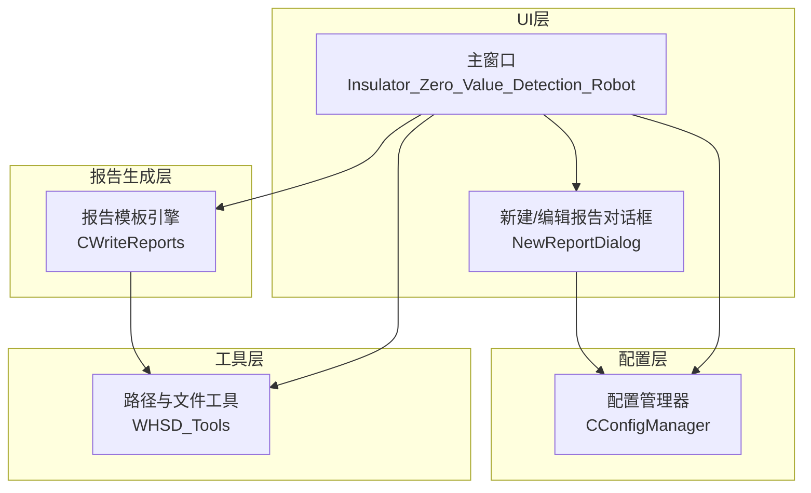
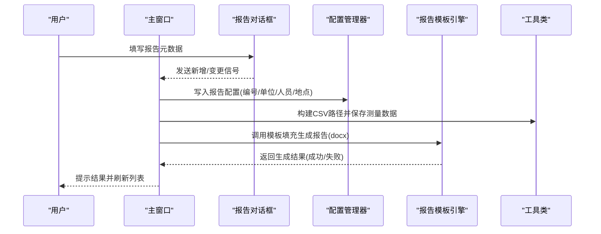
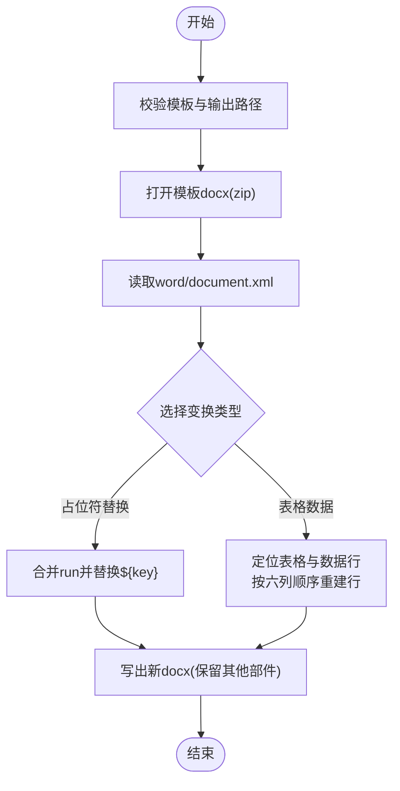
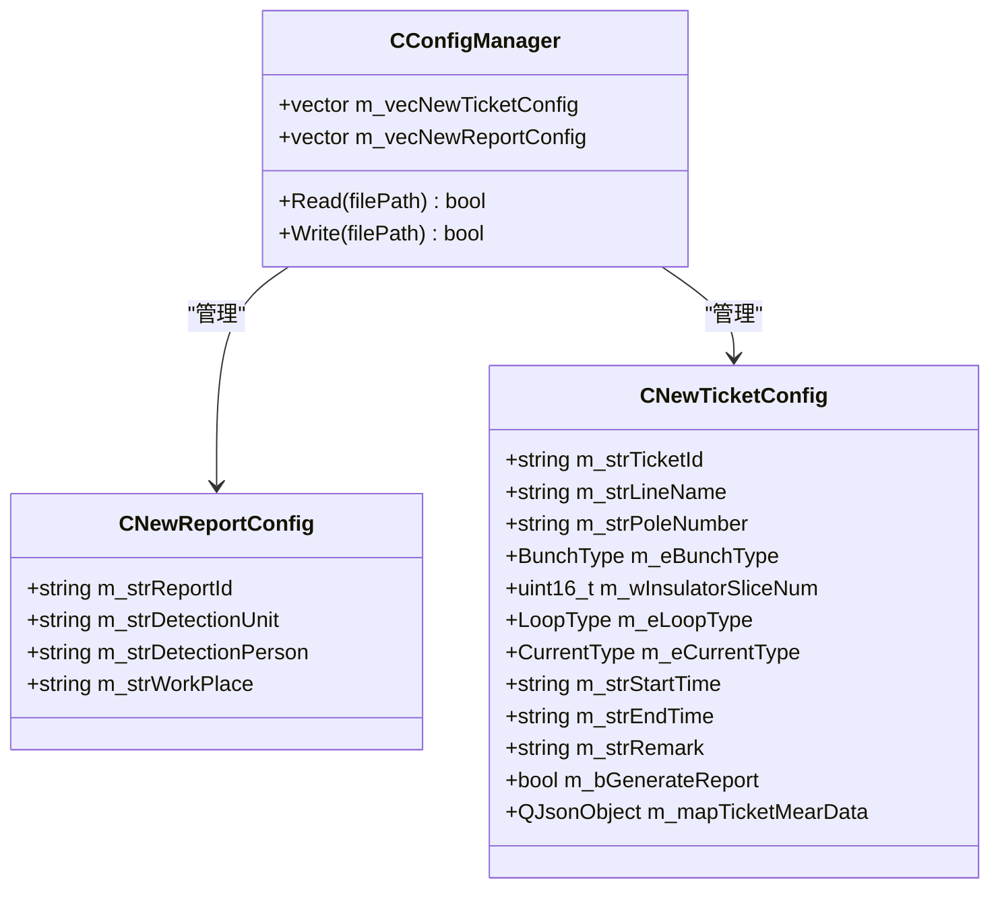
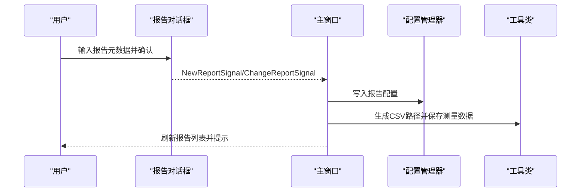
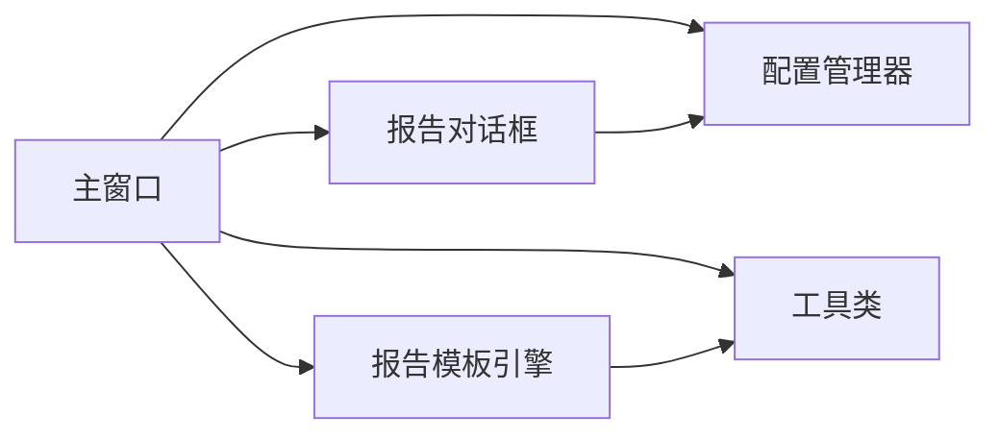

# 历史报告管理

<cite>
**本文引用的文件**
- [WriteReports.h](file://Insulator_Zero_Value_Detection_Robot/Report/WriteReports.h)
- [WriteReports.cpp](file://Insulator_Zero_Value_Detection_Robot/Report/WriteReports.cpp)
- [ConfigManager.h](file://Insulator_Zero_Value_Detection_Robot/Config/ConfigManager.h)
- [ConfigManager.cpp](file://Insulator_Zero_Value_Detection_Robot/Config/ConfigManager.cpp)
- [NewReportDialog.h](file://Insulator_Zero_Value_Detection_Robot/UI/NewReportDialog.h)
- [NewReportDialog.cpp](file://Insulator_Zero_Value_Detection_Robot/UI/NewReportDialog.cpp)
- [Insulator_Zero_Value_Detection_Robot.h](file://Insulator_Zero_Value_Detection_Robot/UI/Insulator_Zero_Value_Detection_Robot.h)
- [Insulator_Zero_Value_Detection_Robot.cpp](file://Insulator_Zero_Value_Detection_Robot/UI/Insulator_Zero_Value_Detection_Robot.cpp)
- [Tools.cpp](file://Insulator_Zero_Value_Detection_Robot/Tools/Tools.cpp)
- [操作说明书.md](file://操作说明书.md)
</cite>

## 目录
1. [简介](#简介)
2. [项目结构](#项目结构)
3. [核心组件](#核心组件)
4. [架构总览](#架构总览)
5. [详细组件分析](#详细组件分析)
6. [依赖关系分析](#依赖关系分析)
7. [性能考虑](#性能考虑)
8. [故障排查指南](#故障排查指南)
9. [结论](#结论)
10. [附录](#附录)

## 简介
本章节面向“绝缘子零值检测机器人V2”的历史报告管理功能，围绕报告的存储结构与命名规范、查询检索、浏览查看、编辑修改、分享传输以及归档清理等能力进行系统化说明。文档基于仓库中报告生成与配置管理相关代码，结合界面交互流程，给出可落地的实现建议与最佳实践。

## 项目结构
与历史报告管理直接相关的模块主要分布在以下位置：
- Report：报告模板填充与数据表写入（docx 模板引擎）
- Config：报告元数据持久化（XML 配置）
- UI：报告新增/编辑对话框、报告列表展示与筛选、下载导出入口
- Tools：通用路径与目录创建工具，辅助报告与测量数据的保存

图表来源
- [Insulator_Zero_Value_Detection_Robot.h:26-133](file://Insulator_Zero_Value_Detection_Robot/UI/Insulator_Zero_Value_Detection_Robot.h#L26-L133)
- [NewReportDialog.h:10-31](file://Insulator_Zero_Value_Detection_Robot/UI/NewReportDialog.h#L10-L31)
- [ConfigManager.h:185-199](file://Insulator_Zero_Value_Detection_Robot/Config/ConfigManager.h#L185-L199)
- [WriteReports.h:24-88](file://Insulator_Zero_Value_Detection_Robot/Report/WriteReports.h#L24-L88)
- [Tools.cpp:52-108](file://Insulator_Zero_Value_Detection_Robot/Tools/Tools.cpp#L52-L108)

章节来源
- [Insulator_Zero_Value_Detection_Robot.h:26-133](file://Insulator_Zero_Value_Detection_Robot/UI/Insulator_Zero_Value_Detection_Robot.h#L26-L133)
- [NewReportDialog.h:10-31](file://Insulator_Zero_Value_Detection_Robot/UI/NewReportDialog.h#L10-L31)
- [ConfigManager.h:185-199](file://Insulator_Zero_Value_Detection_Robot/Config/ConfigManager.h#L185-L199)
- [WriteReports.h:24-88](file://Insulator_Zero_Value_Detection_Robot/Report/WriteReports.h#L24-L88)
- [Tools.cpp:52-108](file://Insulator_Zero_Value_Detection_Robot/Tools/Tools.cpp#L52-L108)

## 核心组件
- 报告模板引擎（CWriteReports）
  - 通过读取 docx 模板的 word/document.xml，替换占位符并重建表格行，输出新的 docx 报告文件。
  - 支持文本占位符替换与双联测量数据自适应填表。
- 配置管理器（CConfigManager）
  - 负责报告元数据（编号、单位、人员、地点等）的读写，使用 XML 持久化。
  - 维护报告与工单的配置集合，提供增删改查接口。
- 报告对话框（NewReportDialog）
  - 提供报告的新建与编辑输入，提交后触发信号更新主窗口的报告列表与配置。
- 主窗口（Insulator_Zero_Value_Detection_Robot）
  - 承载报告列表展示、筛选、删除、下载等操作；在新增/更新报告时同步写回配置，并导出测量数据为 CSV。
- 工具类（WHSD_Tools）
  - 提供自动保存目录创建、时间戳文件名生成、绝对路径解析等能力，支撑报告与数据文件的落地。

章节来源
- [WriteReports.h:24-88](file://Insulator_Zero_Value_Detection_Robot/Report/WriteReports.h#L24-L88)
- [WriteReports.cpp:40-132](file://Insulator_Zero_Value_Detection_Robot/Report/WriteReports.cpp#L40-L132)
- [ConfigManager.h:39-50](file://Insulator_Zero_Value_Detection_Robot/Config/ConfigManager.h#L39-L50)
- [ConfigManager.cpp:239-274](file://Insulator_Zero_Value_Detection_Robot/Config/ConfigManager.cpp#L239-L274)
- [NewReportDialog.h:10-31](file://Insulator_Zero_Value_Detection_Robot/UI/NewReportDialog.h#L10-L31)
- [NewReportDialog.cpp:19-44](file://Insulator_Zero_Value_Detection_Robot/UI/NewReportDialog.cpp#L19-L44)
- [Insulator_Zero_Value_Detection_Robot.cpp:2745-2845](file://Insulator_Zero_Value_Detection_Robot/UI/Insulator_Zero_Value_Detection_Robot.cpp#L2745-L2845)
- [Tools.cpp:52-108](file://Insulator_Zero_Value_Detection_Robot/Tools/Tools.cpp#L52-L108)

## 架构总览
报告管理的整体流程如下：用户在 UI 中创建或编辑报告元数据，系统将其持久化为配置；随后根据工单测量数据生成报告文件，并将测量数据导出为 CSV 便于后续分析与共享。

图表来源
- [NewReportDialog.cpp:19-44](file://Insulator_Zero_Value_Detection_Robot/UI/NewReportDialog.cpp#L19-L44)
- [Insulator_Zero_Value_Detection_Robot.cpp:2745-2845](file://Insulator_Zero_Value_Detection_Robot/UI/Insulator_Zero_Value_Detection_Robot.cpp#L2745-L2845)
- [ConfigManager.cpp:239-274](file://Insulator_Zero_Value_Detection_Robot/Config/ConfigManager.cpp#L239-L274)
- [WriteReports.cpp:40-132](file://Insulator_Zero_Value_Detection_Robot/Report/WriteReports.cpp#L40-L132)
- [Tools.cpp:52-108](file://Insulator_Zero_Value_Detection_Robot/Tools/Tools.cpp#L52-L108)

## 详细组件分析

### 报告模板引擎（CWriteReports）
- 功能要点
  - 读取 docx 模板，提取并处理 word/document.xml，将 ${key} 占位符替换为实际数据。
  - 对表格中的测量数据进行自适应行数重建，按“大号侧A/B/C、小号侧A/B/C”六列顺序填充。
  - 输出新 docx 文件，保持模板样式、图片、页眉页脚等不变。
- 关键流程
  - 校验模板与输出路径，避免覆盖模板。
  - 打开模板 zip，读取 document.xml，应用变换函数（占位符替换或表格重建）。
  - 写出所有部件到目标 docx。
- 复杂度与优化
  - 正则匹配与字符串替换为主要开销，建议在大数据量时合并多次替换以减少遍历次数。
  - 表格行重建采用样板行克隆，避免重复解析，提升效率。

图表来源
- [WriteReports.cpp:40-132](file://Insulator_Zero_Value_Detection_Robot/Report/WriteReports.cpp#L40-L132)
- [WriteReports.cpp:206-321](file://Insulator_Zero_Value_Detection_Robot/Report/WriteReports.cpp#L206-L321)

章节来源
- [WriteReports.h:24-88](file://Insulator_Zero_Value_Detection_Robot/Report/WriteReports.h#L24-L88)
- [WriteReports.cpp:40-132](file://Insulator_Zero_Value_Detection_Robot/Report/WriteReports.cpp#L40-L132)
- [WriteReports.cpp:206-321](file://Insulator_Zero_Value_Detection_Robot/Report/WriteReports.cpp#L206-L321)

### 配置管理与元数据持久化（CConfigManager）
- 功能要点
  - 维护报告元数据（报告编号、检测单位、检测人员、作业地点）与工单信息。
  - 通过 XML 文件持久化配置，支持读取与写入。
- 数据结构
  - 报告配置对象包含编号、单位、人员、地点字段。
  - 工单配置包含串数类型、回路数、电流类型、起止时间、备注、是否已生成报告标志及测量数据 JSON。
- 版本控制建议
  - 当前未内置版本字段，可在配置中增加版本号或时间戳以支持增量更新与回溯。

图表来源
- [ConfigManager.h:39-183](file://Insulator_Zero_Value_Detection_Robot/Config/ConfigManager.h#L39-L183)
- [ConfigManager.h:185-199](file://Insulator_Zero_Value_Detection_Robot/Config/ConfigManager.h#L185-L199)

章节来源
- [ConfigManager.h:39-183](file://Insulator_Zero_Value_Detection_Robot/Config/ConfigManager.h#L39-L183)
- [ConfigManager.h:185-199](file://Insulator_Zero_Value_Detection_Robot/Config/ConfigManager.h#L185-L199)
- [ConfigManager.cpp:239-274](file://Insulator_Zero_Value_Detection_Robot/Config/ConfigManager.cpp#L239-L274)

### 报告对话框与主窗口交互（NewReportDialog / Insulator_Zero_Value_Detection_Robot）
- 报告新增/编辑
  - 用户在对话框中输入报告元数据，确认后触发信号，主窗口接收并更新报告列表与配置。
- 报告列表与筛选
  - 主窗口维护报告表格，支持按线路名称与检测人员模糊过滤。
  - 提供重置按钮清空筛选条件。
- 下载与导出
  - 根据操作说明书，报告列表支持“下载”选中报告文件；新增报告时同时导出测量数据为 CSV。

图表来源
- [NewReportDialog.cpp:19-44](file://Insulator_Zero_Value_Detection_Robot/UI/NewReportDialog.cpp#L19-L44)
- [Insulator_Zero_Value_Detection_Robot.cpp:2745-2845](file://Insulator_Zero_Value_Detection_Robot/UI/Insulator_Zero_Value_Detection_Robot.cpp#L2745-L2845)
- [操作说明书.md:284-308](file://操作说明书.md#L284-L308)

章节来源
- [NewReportDialog.h:10-31](file://Insulator_Zero_Value_Detection_Robot/UI/NewReportDialog.h#L10-L31)
- [NewReportDialog.cpp:19-44](file://Insulator_Zero_Value_Detection_Robot/UI/NewReportDialog.cpp#L19-L44)
- [Insulator_Zero_Value_Detection_Robot.cpp:2745-2845](file://Insulator_Zero_Value_Detection_Robot/UI/Insulator_Zero_Value_Detection_Robot.cpp#L2745-L2845)
- [操作说明书.md:284-308](file://操作说明书.md#L284-L308)

### 存储结构与命名规范
- 报告文件
  - 由模板引擎生成的 docx 报告文件，建议存放于独立目录并按“报告编号_时间戳.docx”命名，便于追溯。
- 测量数据
  - 新增报告时导出 CSV，命名为“MearData_报告编号.csv”，位于应用目录或指定输出路径。
- 配置文件
  - 报告与工单元数据保存在 Config.xml，使用 tinyxml2 读写。
- 自动保存
  - 工具类支持按日期创建 AutoSave 子目录并以时间戳命名文件，可用于截图或中间数据归档。

章节来源
- [Insulator_Zero_Value_Detection_Robot.cpp:2776-2818](file://Insulator_Zero_Value_Detection_Robot/UI/Insulator_Zero_Value_Detection_Robot.cpp#L2776-L2818)
- [Tools.cpp:52-108](file://Insulator_Zero_Value_Detection_Robot/Tools/Tools.cpp#L52-L108)
- [ConfigManager.cpp:239-274](file://Insulator_Zero_Value_Detection_Robot/Config/ConfigManager.cpp#L239-L274)

### 查询与检索
- 当前实现
  - 报告列表支持按“线路名称”和“检测人员”进行模糊过滤。
  - 提供重置按钮清空筛选条件。
- 扩展建议
  - 可增加按时间范围、电压等级、检测结果等多维度筛选。
  - 引入分页显示以提升大数据量下的列表性能。

章节来源
- [Insulator_Zero_Value_Detection_Robot.cpp:3010-3032](file://Insulator_Zero_Value_Detection_Robot/UI/Insulator_Zero_Value_Detection_Robot.cpp#L3010-L3032)
- [操作说明书.md:290-304](file://操作说明书.md#L290-L304)

### 浏览与查看
- 当前实现
  - 报告列表展示序号、报告编号、检测单位、检测人员、线路信息。
  - 支持下载选中报告文件。
- 扩展建议
  - 在线预览：集成 docx 预览组件或转换为 PDF 预览。
  - 缩略图：为报告封面生成缩略图，提升浏览体验。
  - 分页：当报告数量较大时启用分页加载。

章节来源
- [操作说明书.md:294-304](file://操作说明书.md#L294-L304)

### 编辑与修改
- 当前实现
  - 报告对话框支持新建与编辑报告元数据（编号、单位、人员、地点），确认后更新配置并刷新列表。
- 扩展建议
  - 支持对已生成报告的补充说明与更正记录，例如追加修订日志或生成新版本文件。
  - 提供差异对比与版本切换能力。

章节来源
- [NewReportDialog.cpp:19-44](file://Insulator_Zero_Value_Detection_Robot/UI/NewReportDialog.cpp#L19-L44)
- [Insulator_Zero_Value_Detection_Robot.cpp:2821-2845](file://Insulator_Zero_Value_Detection_Robot/UI/Insulator_Zero_Value_Detection_Robot.cpp#L2821-L2845)

### 分享与传输
- 当前实现
  - 支持下载报告文件；测量数据以 CSV 形式导出，便于外部分析。
- 扩展建议
  - 本地复制：一键复制到剪贴板或指定文件夹。
  - 网络传输：集成 FTP/HTTP 上传至服务器或云盘。
  - 邮件发送：打包报告与 CSV 并通过邮件客户端发送。

章节来源
- [操作说明书.md:298-304](file://操作说明书.md#L298-L304)
- [Insulator_Zero_Value_Detection_Robot.cpp:2776-2818](file://Insulator_Zero_Value_Detection_Robot/UI/Insulator_Zero_Value_Detection_Robot.cpp#L2776-L2818)

### 归档与清理策略
- 当前实现
  - 工具类支持递归创建目录与按时间戳命名文件，便于归档。
- 扩展建议
  - 定期归档：按月份或季度将历史报告与 CSV 迁移至归档目录。
  - 清理策略：设置保留周期，自动删除过期文件或压缩归档。
  - 数据安全：对敏感信息进行脱敏或加密存储。

章节来源
- [Tools.cpp:471-514](file://Insulator_Zero_Value_Detection_Robot/Tools/Tools.cpp#L471-L514)

## 依赖关系分析
- 主窗口依赖报告对话框、配置管理器、报告模板引擎与工具类。
- 报告对话框向主窗口发送信号，主窗口负责配置写入与数据导出。
- 报告模板引擎依赖工具类进行路径与目录操作。
- 配置管理器通过 XML 持久化报告与工单元数据。

图表来源
- [Insulator_Zero_Value_Detection_Robot.h:26-133](file://Insulator_Zero_Value_Detection_Robot/UI/Insulator_Zero_Value_Detection_Robot.h#L26-L133)
- [NewReportDialog.h:10-31](file://Insulator_Zero_Value_Detection_Robot/UI/NewReportDialog.h#L10-L31)
- [ConfigManager.h:185-199](file://Insulator_Zero_Value_Detection_Robot/Config/ConfigManager.h#L185-L199)
- [WriteReports.h:24-88](file://Insulator_Zero_Value_Detection_Robot/Report/WriteReports.h#L24-L88)
- [Tools.cpp:52-108](file://Insulator_Zero_Value_Detection_Robot/Tools/Tools.cpp#L52-L108)

章节来源
- [Insulator_Zero_Value_Detection_Robot.h:26-133](file://Insulator_Zero_Value_Detection_Robot/UI/Insulator_Zero_Value_Detection_Robot.h#L26-L133)
- [NewReportDialog.h:10-31](file://Insulator_Zero_Value_Detection_Robot/UI/NewReportDialog.h#L10-L31)
- [ConfigManager.h:185-199](file://Insulator_Zero_Value_Detection_Robot/Config/ConfigManager.h#L185-L199)
- [WriteReports.h:24-88](file://Insulator_Zero_Value_Detection_Robot/Report/WriteReports.h#L24-L88)
- [Tools.cpp:52-108](file://Insulator_Zero_Value_Detection_Robot/Tools/Tools.cpp#L52-L108)

## 性能考虑
- 报告生成
  - 模板 XML 的正则替换与表格重建可能带来 CPU 开销，建议批量替换与缓存样板行。
- 列表渲染
  - 大量报告时启用分页与懒加载，减少 UI 压力。
- 文件 I/O
  - 使用异步写入与缓冲，避免阻塞 UI；对大文件分块处理。
- 内存管理
  - 及时释放临时对象，避免内存泄漏；对大数组使用移动语义。

[本节为通用指导，不直接分析具体文件]

## 故障排查指南
- 模板打开失败
  - 检查模板路径是否存在且可读；确保模板为有效 docx。
- 输出目录创建失败
  - 检查权限与磁盘空间；确认路径合法。
- 配置写入失败
  - 检查 XML 文件路径与权限；验证 XML 结构正确性。
- CSV 导出失败
  - 检查路径与权限；确认文件未被占用。

章节来源
- [WriteReports.cpp:40-105](file://Insulator_Zero_Value_Detection_Robot/Report/WriteReports.cpp#L40-L105)
- [ConfigManager.cpp:239-274](file://Insulator_Zero_Value_Detection_Robot/Config/ConfigManager.cpp#L239-L274)
- [Insulator_Zero_Value_Detection_Robot.cpp:2776-2818](file://Insulator_Zero_Value_Detection_Robot/UI/Insulator_Zero_Value_Detection_Robot.cpp#L2776-L2818)

## 结论
历史报告管理功能在现有代码基础上已具备报告元数据管理、模板填充生成报告、测量数据导出与基础筛选能力。为进一步满足生产需求，建议增强多维度检索、在线预览、分页显示、版本控制与归档清理等特性，以提升用户体验与系统可维护性。

[本节为总结性内容，不直接分析具体文件]

## 附录
- 术语解释
  - 报告编号：唯一标识一次检测报告。
  - 测量数据：按侧别与相别的阻值数组，用于报告表格填充与 CSV 导出。
  - 模板引擎：基于 docx 模板的 XML 替换与表格重建机制。
- 参考文件
  - 报告模板与生成逻辑见 Report 目录。
  - 配置与元数据管理见 Config 目录。
  - 界面交互与筛选逻辑见 UI 目录。
  - 路径与文件操作见 Tools 目录。

[本节为附加信息，不直接分析具体文件]