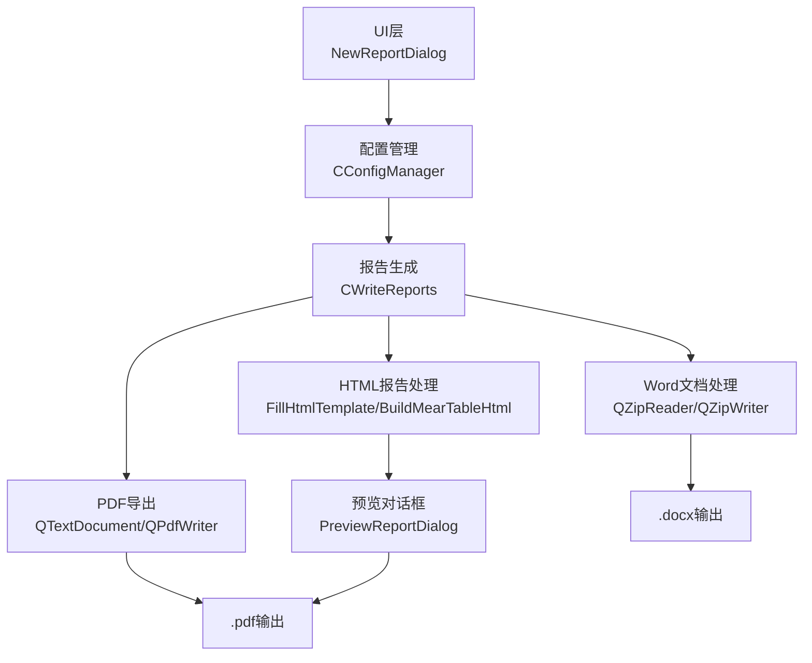
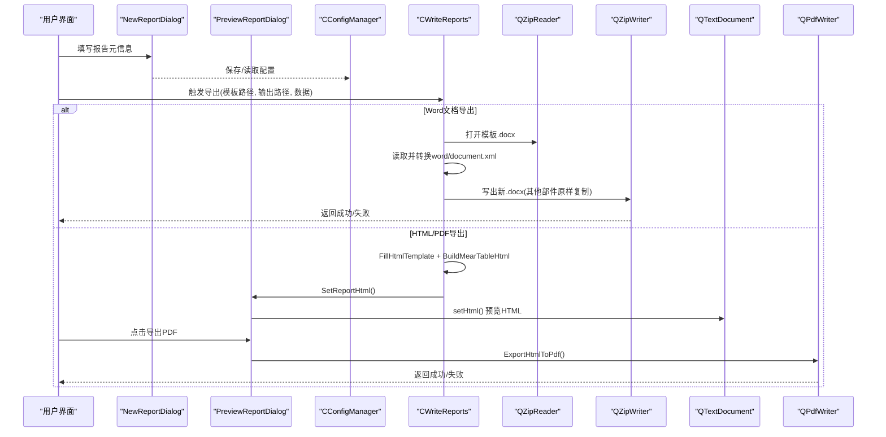
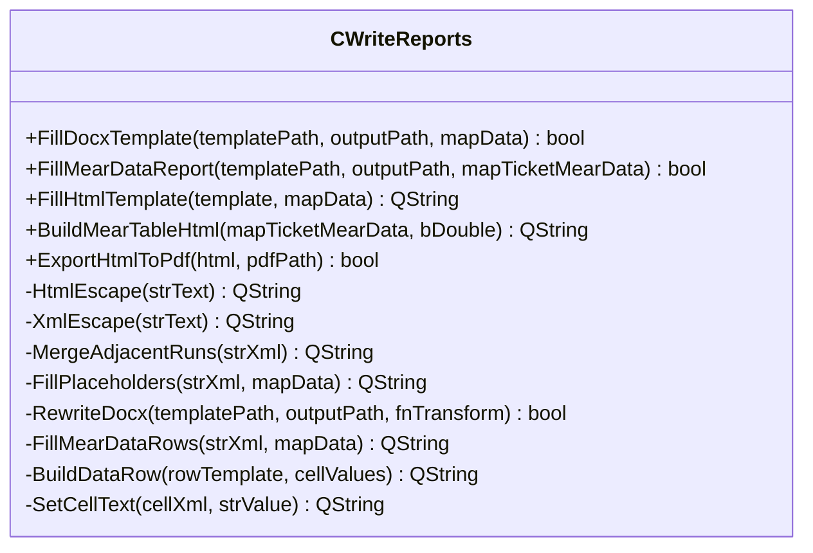
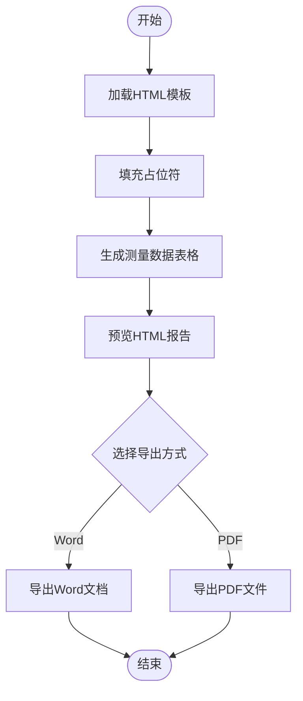
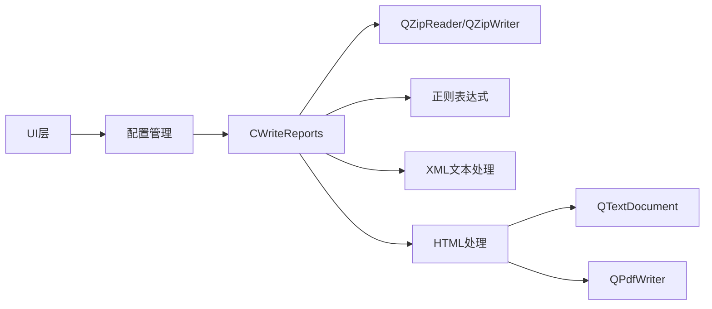

# 导出格式支持

<cite>
**本文引用的文件**
- [WriteReports.h](file://Insulator_Zero_Value_Detection_Robot/Report/WriteReports.h)
- [WriteReports.cpp](file://Insulator_Zero_Value_Detection_Robot/Report/WriteReports.cpp)
- [ReportTemplate.html](file://Insulator_Zero_Value_Detection_Robot/Report/ReportTemplate.html)
- [PreviewReportDialog.h](file://Insulator_Zero_Value_Detection_Robot/UI/PreviewReportDialog.h)
- [PreviewReportDialog.cpp](file://Insulator_Zero_Value_Detection_Robot/UI/PreviewReportDialog.cpp)
- [PreviewReportDialog.ui](file://Insulator_Zero_Value_Detection_Robot/UI/PreviewReportDialog.ui)
- [example.cpp](file://Insulator_Zero_Value_Detection_Robot/Report/example.cpp)
- [document.xml](file://Insulator_Zero_Value_Detection_Robot/Report/document.xml)
- [ConfigManager.h](file://Insulator_Zero_Value_Detection_Robot/Config/ConfigManager.h)
- [NewReportDialog.h](file://Insulator_Zero_Value_Detection_Robot/UI/NewReportDialog.h)
- [NewReportDialog.cpp](file://Insulator_Zero_Value_Detection_Robot/UI/NewReportDialog.cpp)
</cite>

## 更新摘要
**所做更改**
- 新增HTML格式报告生成和预览功能
- 实现HTML到PDF的转换导出能力
- 扩展报告导出格式的多样性，从单一Word文档扩展到多种格式
- 新增报告预览对话框，支持HTML富文本显示和PDF导出

## 目录
1. [简介](#简介)
2. [项目结构](#项目结构)
3. [核心组件](#核心组件)
4. [架构总览](#架构总览)
5. [详细组件分析](#详细组件分析)
6. [依赖关系分析](#依赖关系分析)
7. [性能与质量优化](#性能与质量优化)
8. [故障排查指南](#故障排查指南)
9. [结论](#结论)
10. [附录](#附录)

## 简介
本章节面向绝缘子零值检测机器人V2的报告导出能力，现已实现Word文档(.docx)、HTML网页和PDF文件的完整导出功能。系统采用"模板+占位符替换+表格行自适应"的核心技术路线，无需安装Microsoft Word，跨平台可用。当前实现包括.docx模板填充、HTML富文本报告生成、以及通过Qt的QTextDocument和QPdfWriter实现的HTML到PDF转换。

## 项目结构
报告导出相关代码集中在Report目录，UI层通过配置对话框收集报告元信息，配置管理器负责持久化与读取。新增的HTML报告功能包含独立的HTML模板文件和预览对话框。

图表来源
- [WriteReports.cpp:40-105](file://Insulator_Zero_Value_Detection_Robot/Report/WriteReports.cpp#L40-L105)
- [WriteReports.cpp:341-469](file://Insulator_Zero_Value_Detection_Robot/Report/WriteReports.cpp#L341-L469)
- [PreviewReportDialog.cpp:25-56](file://Insulator_Zero_Value_Detection_Robot/UI/PreviewReportDialog.cpp#L25-L56)
- [ConfigManager.h:39-50](file://Insulator_Zero_Value_Detection_Robot/Config/ConfigManager.h#L39-L50)

章节来源
- [WriteReports.h:20-107](file://Insulator_Zero_Value_Detection_Robot/Report/WriteReports.h#L20-L107)
- [WriteReports.cpp:10-470](file://Insulator_Zero_Value_Detection_Robot/Report/WriteReports.cpp#L10-L470)
- [PreviewReportDialog.h:1-31](file://Insulator_Zero_Value_Detection_Robot/UI/PreviewReportDialog.h#L1-L31)
- [PreviewReportDialog.cpp:1-61](file://Insulator_Zero_Value_Detection_Robot/UI/PreviewReportDialog.cpp#L1-L61)

## 核心组件
- CWriteReports：提供.docx模板填充、HTML报告生成和PDF导出能力。
- QZipReader/QZipWriter：用于解压/重组.docx（本质为ZIP容器），仅修改word/document.xml，其余资源原样保留。
- QTextDocument/QPdfWriter：用于HTML富文本渲染和PDF文件生成。
- PreviewReportDialog：提供HTML报告的预览和导出功能界面。
- 正则表达式工具：合并被Word拆分的run、定位表格与单元格、提取文本节点等。
- 配置与UI：NewReportDialog收集报告元信息；CNewReportConfig/CConfigManager负责数据结构与持久化。

章节来源
- [WriteReports.h:20-107](file://Insulator_Zero_Value_Detection_Robot/Report/WriteReports.h#L20-L107)
- [WriteReports.cpp:20-470](file://Insulator_Zero_Value_Detection_Robot/Report/WriteReports.cpp#L20-L470)
- [PreviewReportDialog.h:1-31](file://Insulator_Zero_Value_Detection_Robot/UI/PreviewReportDialog.h#L1-L31)
- [ConfigManager.h:39-50](file://Insulator_Zero_Value_Detection_Robot/Config/ConfigManager.h#L39-L50)

## 架构总览
下图展示从UI到报告生成的调用链路与数据处理流程，包括新增的HTML和PDF导出路径。

图表来源
- [WriteReports.cpp:40-105](file://Insulator_Zero_Value_Detection_Robot/Report/WriteReports.cpp#L40-L105)
- [WriteReports.cpp:341-469](file://Insulator_Zero_Value_Detection_Robot/Report/WriteReports.cpp#L341-L469)
- [PreviewReportDialog.cpp:25-56](file://Insulator_Zero_Value_Detection_Robot/UI/PreviewReportDialog.cpp#L25-L56)
- [NewReportDialog.cpp:19-34](file://Insulator_Zero_Value_Detection_Robot/UI/NewReportDialog.cpp#L19-L34)

## 详细组件分析

### 组件A：CWriteReports（报告生成）
职责
- 将.docx模板中的占位符${key}替换为实际数据。
- 根据双联测量数据在模板第一张表中动态生成数据行，保持样式一致。
- 生成HTML富文本报告，支持占位符替换和测量数据表格构建。
- 将HTML内容转换为PDF文件，支持A4页面布局和中文显示。
- 对XML和HTML文本进行安全转义，避免特殊字符导致渲染异常。

关键方法
- FillDocxTemplate：通用占位符替换（Word文档）。
- FillMearDataReport：按业务规则填充测量数据表（Word文档）。
- FillHtmlTemplate：HTML模板占位符替换。
- BuildMearTableHtml：生成测量数据HTML表格。
- ExportHtmlToPdf：HTML到PDF转换导出。
- RewriteDocx：统一入口，封装ZIP读写与XML变换。
- MergeAdjacentRuns / FillPlaceholders / XmlEscape / HtmlEscape：底层文本处理。
- BuildDataRow / SetCellText / FillMearDataRows：表格行构建与数据映射。

复杂度与行为
- 正则扫描XML，时间复杂度近似O(N)，N为XML大小。
- 表格行数量由六列数组的最大片数决定，每行固定14个单元格。
- 剥离w14:paraId/textId以避免多行ID重复导致的Word报错。
- HTML表格支持双联和单联模式，自动计算行数和列数。

章节来源
- [WriteReports.h:20-107](file://Insulator_Zero_Value_Detection_Robot/Report/WriteReports.h#L20-L107)
- [WriteReports.cpp:20-470](file://Insulator_Zero_Value_Detection_Robot/Report/WriteReports.cpp#L20-L470)

#### 类图（代码级）

图表来源
- [WriteReports.h:20-107](file://Insulator_Zero_Value_Detection_Robot/Report/WriteReports.h#L20-L107)

### 组件B：模板与XML处理
- Word模板结构：.docx是ZIP容器，正文位于word/document.xml，包含段落、表格、样式、图片等。
- HTML模板结构：ReportTemplate.html定义报告的基本结构和占位符。
- 占位符替换策略：先合并相邻的<w:t>片段，再全局替换${key}，并对特殊字符进行转义。
- 表格行生成：定位第一张表，识别数据行范围，以首条数据行为样板克隆并填充14个单元格。
- HTML表格生成：根据测量数据动态生成表格，支持双联和单联模式。

章节来源
- [WriteReports.cpp:20-127](file://Insulator_Zero_Value_Detection_Robot/Report/WriteReports.cpp#L20-L127)
- [WriteReports.cpp:341-439](file://Insulator_Zero_Value_Detection_Robot/Report/WriteReports.cpp#L341-L439)
- [ReportTemplate.html:1-44](file://Insulator_Zero_Value_Detection_Robot/Report/ReportTemplate.html#L1-L44)
- [document.xml:1-2](file://Insulator_Zero_Value_Detection_Robot/Report/document.xml#L1-L2)

#### 流程图（HTML报告生成）

图表来源
- [WriteReports.cpp:341-469](file://Insulator_Zero_Value_Detection_Robot/Report/WriteReports.cpp#L341-L469)
- [PreviewReportDialog.cpp:25-56](file://Insulator_Zero_Value_Detection_Robot/UI/PreviewReportDialog.cpp#L25-L56)

### 组件C：预览对话框
- PreviewReportDialog：提供HTML报告的预览和PDF导出功能。
- 使用QTextBrowser显示HTML内容，支持富文本渲染。
- 集成PDF导出功能，通过CWriteReports::ExportHtmlToPdf实现。
- 提供友好的用户界面，包括导出按钮和关闭按钮。

章节来源
- [PreviewReportDialog.h:1-31](file://Insulator_Zero_Value_Detection_Robot/UI/PreviewReportDialog.h#L1-L31)
- [PreviewReportDialog.cpp:1-61](file://Insulator_Zero_Value_Detection_Robot/UI/PreviewReportDialog.cpp#L1-L61)
- [PreviewReportDialog.ui:1-127](file://Insulator_Zero_Value_Detection_Robot/UI/PreviewReportDialog.ui#L1-L127)

### 组件D：配置与UI
- NewReportDialog：收集报告编号、检测单位、检测人员、作业地点等信息，并通过信号传递。
- CNewReportConfig：承载报告元数据字段。
- CConfigManager：负责配置的读取与写入（含报告列表）。

章节来源
- [NewReportDialog.h:10-31](file://Insulator_Zero_Value_Detection_Robot/UI/NewReportDialog.h#L10-L31)
- [NewReportDialog.cpp:19-34](file://Insulator_Zero_Value_Detection_Robot/UI/NewReportDialog.cpp#L19-L34)
- [ConfigManager.h:39-50](file://Insulator_Zero_Value_Detection_Robot/Config/ConfigManager.h#L39-L50)
- [ConfigManager.cpp:221-256](file://Insulator_Zero_Value_Detection_Robot/Config/ConfigManager.cpp#L221-L256)

## 依赖关系分析
- CWriteReports依赖Qt的QZipReader/QZipWriter进行.docx的解压与重组。
- 依赖QTextDocument和QPdfWriter进行HTML渲染和PDF生成。
- 依赖正则表达式进行XML结构解析与内容替换。
- 与UI和配置模块解耦，通过函数参数传入模板路径、输出路径与数据对象。

图表来源
- [WriteReports.cpp:40-105](file://Insulator_Zero_Value_Detection_Robot/Report/WriteReports.cpp#L40-L105)
- [WriteReports.cpp:341-469](file://Insulator_Zero_Value_Detection_Robot/Report/WriteReports.cpp#L341-L469)

章节来源
- [WriteReports.h:20-107](file://Insulator_Zero_Value_Detection_Robot/Report/WriteReports.h#L20-L107)
- [WriteReports.cpp:10-470](file://Insulator_Zero_Value_Detection_Robot/Report/WriteReports.cpp#L10-L470)

## 性能与质量优化
- 模板复用：同一模板多次导出时，可缓存模板文件句柄或预解析结果以减少IO开销。
- 正则优化：对频繁使用的正则表达式使用静态变量（已在代码中体现），降低编译与匹配开销。
- 内存占用：大文档XML处理时注意分块与流式写入，避免一次性加载过大字符串。
- 显示与打印质量：
  - 保持模板样式不变，仅替换内容与表格行，确保字体、间距、边框一致。
  - 对特殊字符进行转义，避免Word和HTML渲染异常。
  - 表格行列自适应，避免多余空行或截断。
  - PDF导出使用A4页面布局，设置合适的页边距和分辨率。

[本节为通用指导，不直接分析具体文件]

## 故障排查指南
常见问题与定位
- 模板或输出路径为空：检查入参合法性，日志会提示路径问题。
- 模板与输出路径相同：防止覆盖自身，需区分输入输出。
- 模板打开失败：确认模板存在且为有效.docx或HTML文件。
- word/document.xml为空：模板损坏或缺失正文。
- 未找到数据表或数据行：模板表格结构不符合预期（需14列且首列为数字）。
- 测量数据为空：表格将不含任何片号数据行，属正常情况但会记录警告。
- HTML预览空白：检查HTML模板是否正确加载，占位符是否已正确替换。
- PDF导出失败：检查输出路径权限，确认Qt PDF支持库已正确链接。

章节来源
- [WriteReports.cpp:40-105](file://Insulator_Zero_Value_Detection_Robot/Report/WriteReports.cpp#L40-L105)
- [WriteReports.cpp:341-469](file://Insulator_Zero_Value_Detection_Robot/Report/WriteReports.cpp#L341-L469)
- [PreviewReportDialog.cpp:32-56](file://Insulator_Zero_Value_Detection_Robot/UI/PreviewReportDialog.cpp#L32-L56)

## 结论
当前系统实现了高可靠性的多格式报告导出能力，包括Word文档(.docx)、HTML网页和PDF文件。系统具备模板占位符替换、表格行自适应、HTML富文本渲染和PDF转换等核心特性，满足绝缘子零值检测报告的多样化输出需求。通过统一的CWriteReports接口，用户可以灵活选择适合的报告格式进行导出。

[本节为总结性内容，不直接分析具体文件]

## 附录

### A. 支持的导出格式与适用场景
- Word文档(.docx)
  - 特点：保留完整排版、样式、页眉页脚、图表嵌入；适合正式归档与打印。
  - 适用：需要高质量排版与签章留白的场景。
  - 状态：✅ 已实现
- HTML网页
  - 特点：易于预览与分享；适合在线查看和快速浏览。
  - 适用：需要快速预览和简单排版的场景。
  - 状态：✅ 已实现
- PDF文件
  - 特点：跨平台稳定呈现；适合分发与审阅。
  - 适用：需要标准化格式和打印质量的场景。
  - 状态：✅ 已实现（通过HTML转换）
- Excel表格
  - 特点：便于数据分析与二次加工；适合批量导出原始数据。
  - 适用：需要进一步数据分析的场景。
  - 状态：❌ 尚未实现

章节来源
- [WriteReports.h:20-107](file://Insulator_Zero_Value_Detection_Robot/Report/WriteReports.h#L20-L107)
- [WriteReports.cpp:341-469](file://Insulator_Zero_Value_Detection_Robot/Report/WriteReports.cpp#L341-L469)

### B. 导出配置选项（当前实现与扩展建议）
- 页面设置
  - 当前：Word文档沿用模板页面尺寸与边距；PDF使用A4页面，15mm边距。
  - 扩展：新增页边距、纸张方向、分节控制等自定义选项。
- 字体选择
  - 当前：Word文档使用模板内嵌字体；PDF使用Microsoft YaHei默认字体。
  - 扩展：提供字体映射与替换策略，保证跨平台一致性。
- 图表嵌入
  - 当前：Word模板中已有图表可随模板一并输出；HTML表格动态生成。
  - 扩展：支持动态插入图表（如折线图、柱状图）。
- 水印添加
  - 当前：未实现。
  - 扩展：在页眉/背景层注入水印元素。

章节来源
- [WriteReports.cpp:441-469](file://Insulator_Zero_Value_Detection_Robot/Report/WriteReports.cpp#L441-L469)

### C. 格式转换技术实现要点
- 文档结构解析
  - .docx：基于ZIP容器，解析word/document.xml。
  - HTML：直接使用HTML字符串，通过QTextDocument渲染。
  - PDF：通过QPdfWriter将QTextDocument内容转换为PDF格式。
  - Excel：基于.xlsx结构（ZIP+XML）或CSV中间表示。
- 内容渲染
  - 占位符替换、表格行生成、单元格文本设置。
  - HTML表格动态生成，支持双联和单联模式。
- 样式应用
  - 优先复用模板样式；必要时动态注入样式。
  - PDF导出使用标准A4布局和默认字体。

章节来源
- [WriteReports.cpp:47-112](file://Insulator_Zero_Value_Detection_Robot/Report/WriteReports.cpp#L47-L112)
- [WriteReports.cpp:341-469](file://Insulator_Zero_Value_Detection_Robot/Report/WriteReports.cpp#L341-L469)

### D. 批量导出处理能力
- 设计思路
  - 任务队列：将多个报告导出请求加入队列，串行或并行执行。
  - 进度监控：回调或信号上报每个任务的进度与状态。
  - 错误处理：单个任务失败不影响其他任务，汇总错误日志。
- 当前状态
  - 尚未实现批量导出；可在UI层增加批量操作入口，调用CWriteReports接口循环生成。

[本节为概念性说明，不直接分析具体文件]

### E. 导出进度监控与错误处理机制（建议）
- 进度监控
  - 使用信号/回调通知UI更新进度条。
  - 支持取消长时间运行的任务。
- 错误处理
  - 捕获IO异常、XML解析异常、模板缺失等。
  - 提供友好的错误提示与重试机制。

[本节为概念性说明，不直接分析具体文件]

### F. 示例用法参考
- 占位符替换示例：见example.cpp，演示如何准备数据并调用填充函数。
- 模板结构参考：document.xml展示了标题、段落、表格等结构；ReportTemplate.html定义了HTML报告模板。
- HTML报告生成：通过FillHtmlTemplate和BuildMearTableHtml生成完整的HTML报告。
- PDF导出：通过ExportHtmlToPdf将HTML内容转换为PDF文件。

章节来源
- [example.cpp:17-71](file://Insulator_Zero_Value_Detection_Robot/Report/example.cpp#L17-L71)
- [document.xml:1-2](file://Insulator_Zero_Value_Detection_Robot/Report/document.xml#L1-L2)
- [ReportTemplate.html:1-44](file://Insulator_Zero_Value_Detection_Robot/Report/ReportTemplate.html#L1-L44)
- [WriteReports.cpp:341-469](file://Insulator_Zero_Value_Detection_Robot/Report/WriteReports.cpp#L341-L469)