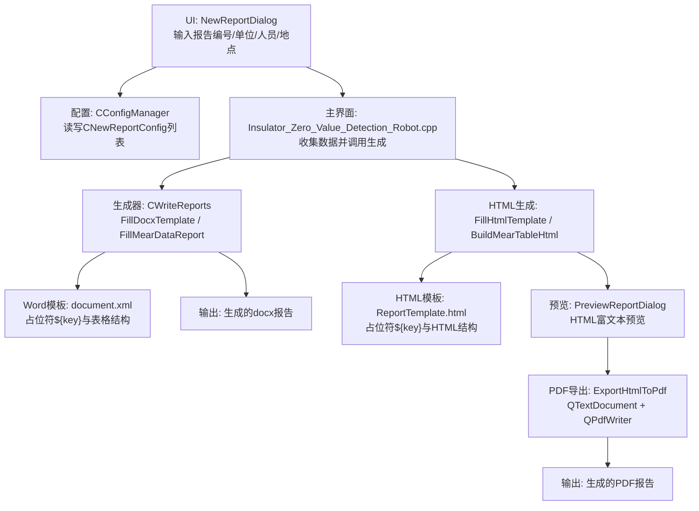
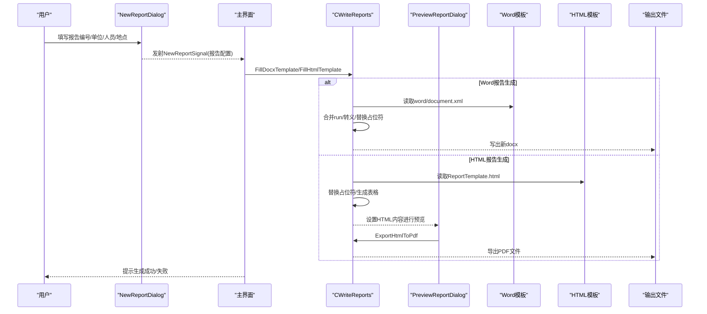
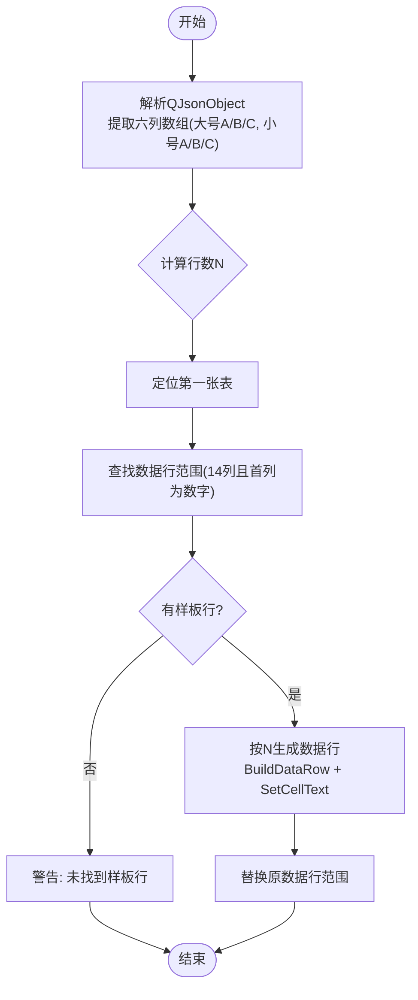
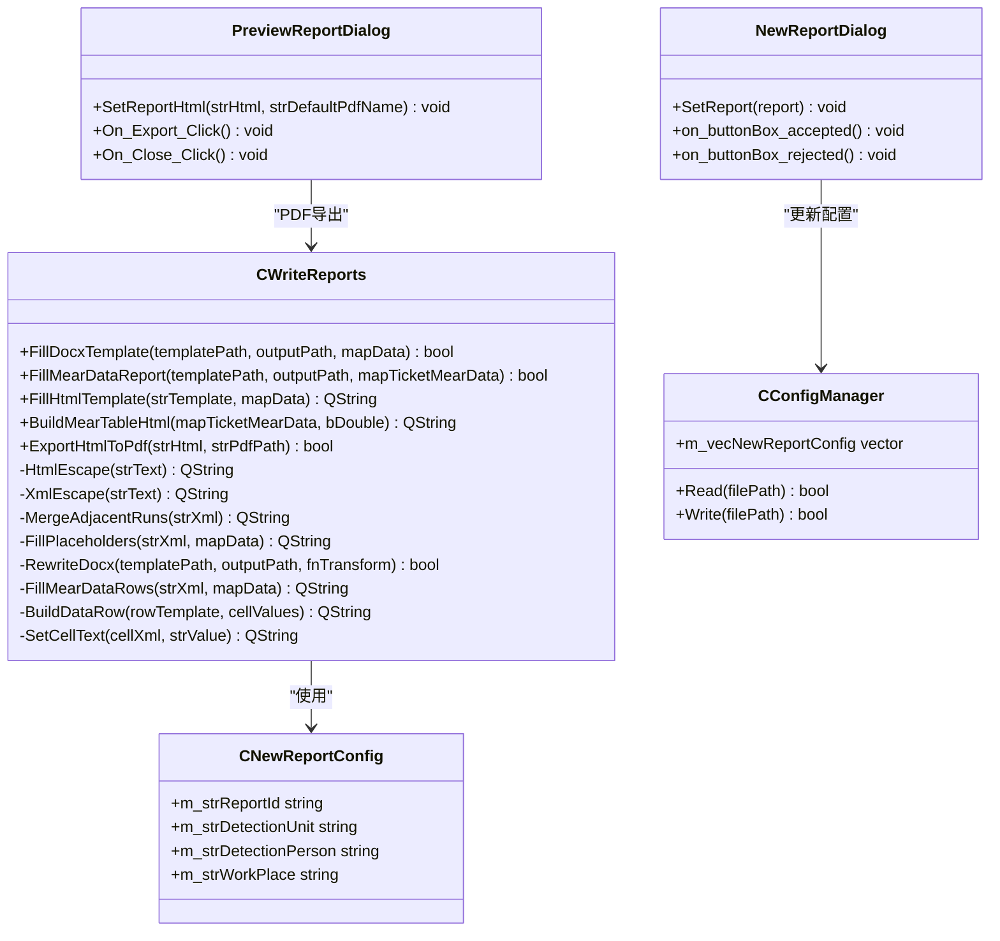

# 报告模板管理

<cite>
**本文引用的文件**
- [WriteReports.h](file://Insulator_Zero_Value_Detection_Robot/Report/WriteReports.h)
- [WriteReports.cpp](file://Insulator_Zero_Value_Detection_Robot/Report/WriteReports.cpp)
- [ReportTemplate.html](file://Insulator_Zero_Value_Detection_Robot/Report/ReportTemplate.html)
- [document.xml](file://Insulator_Zero_Value_Detection_Robot/Report/document.xml)
- [example.cpp](file://Insulator_Zero_Value_Detection_Robot/Report/example.cpp)
- [ConfigManager.h](file://Insulator_Zero_Value_Detection_Robot/Config/ConfigManager.h)
- [ConfigManager.cpp](file://Insulator_Zero_Value_Detection_Robot/Config/ConfigManager.cpp)
- [NewReportDialog.h](file://Insulator_Zero_Value_Detection_Robot/UI/NewReportDialog.h)
- [NewReportDialog.cpp](file://Insulator_Zero_Value_Detection_Robot/UI/NewReportDialog.cpp)
- [NewReportDialog.ui](file://Insulator_Zero_Value_Detection_Robot/UI/NewReportDialog.ui)
- [PreviewReportDialog.h](file://Insulator_Zero_Value_Detection_Robot/UI/PreviewReportDialog.h)
- [PreviewReportDialog.cpp](file://Insulator_Zero_Value_Detection_Robot/UI/PreviewReportDialog.cpp)
- [PreviewReportDialog.ui](file://Insulator_Zero_Value_Detection_Robot/UI/PreviewReportDialog.ui)
- [Insulator_Zero_Value_Detection_Robot.cpp](file://Insulator_Zero_Value_Detection_Robot/UI/Insulator_Zero_Value_Detection_Robot.cpp)
</cite>

## 更新摘要
**变更内容**
- 新增HTML报告模板生成功能，支持富文本报告预览和PDF导出
- 增强报告生成系统的灵活性和专业性，提供多种输出格式选择
- 完善模板管理机制，支持HTML和Word两种模板格式
- 优化用户体验，提供实时预览和便捷导出功能

## 目录
1. [简介](#简介)
2. [项目结构](#项目结构)
3. [核心组件](#核心组件)
4. [架构总览](#架构总览)
5. [详细组件分析](#详细组件分析)
6. [依赖关系分析](#依赖关系分析)
7. [性能与兼容性](#性能与兼容性)
8. [故障排查指南](#故障排查指南)
9. [结论](#结论)
10. [附录](#附录)

## 简介
本文件为"绝缘子零值检测机器人V2"的报告模板管理功能提供完整说明。系统现支持基于Word模板和HTML模板的双重报告生成能力，通过XML占位符替换、HTML模板处理和表格数据行自适应填充，实现检测报告的可配置化、可复用与可扩展。文档涵盖模板结构设计（XML组织、HTML模板、占位符规则、样式保留）、创建与编辑方法、各模块配置方式、模板验证与测试、版本管理与共享机制、以及导入导出策略。

## 项目结构
报告模板相关代码集中在 Report 目录，UI 层负责用户输入与触发，配置层负责持久化报告元数据。系统现支持两种报告格式：Word文档（docx）和HTML富文本（可导出PDF）。

**图表来源**
- [WriteReports.h:20-88](file://Insulator_Zero_Value_Detection_Robot/Report/WriteReports.h#L20-L88)
- [WriteReports.cpp:40-115](file://Insulator_Zero_Value_Detection_Robot/Report/WriteReports.cpp#L40-L115)
- [Insulator_Zero_Value_Detection_Robot.cpp:1969-2053](file://Insulator_Zero_Value_Detection_Robot/UI/Insulator_Zero_Value_Detection_Robot.cpp#L1969-L2053)
- [PreviewReportDialog.cpp:25-55](file://Insulator_Zero_Value_Detection_Robot/UI/PreviewReportDialog.cpp#L25-L55)

**章节来源**
- [WriteReports.h:20-88](file://Insulator_Zero_Value_Detection_Robot/Report/WriteReports.h#L20-L88)
- [WriteReports.cpp:40-115](file://Insulator_Zero_Value_Detection_Robot/Report/WriteReports.cpp#L40-L115)
- [Insulator_Zero_Value_Detection_Robot.cpp:1969-2053](file://Insulator_Zero_Value_Detection_Robot/UI/Insulator_Zero_Value_Detection_Robot.cpp#L1969-L2053)
- [PreviewReportDialog.cpp:25-55](file://Insulator_Zero_Value_Detection_Robot/UI/PreviewReportDialog.cpp#L25-L55)

## 核心组件
- **CWriteReports**：报告生成核心类，负责读取docx模板、处理XML、替换占位符、重建表格数据行并写出新docx；同时支持HTML模板处理和PDF导出。
- **CNewReportConfig**：报告元数据模型（报告编号、检测单位、检测人员、作业地点），用于UI交互与配置持久化。
- **NewReportDialog**：报告信息录入对话框，采集用户输入并通过信号传递到主界面。
- **PreviewReportDialog**：报告预览对话框，支持HTML富文本预览和PDF导出功能。
- **ConfigManager**：负责将报告配置写入/读取至XML配置文件，维护多份报告配置。

**章节来源**
- [WriteReports.h:20-88](file://Insulator_Zero_Value_Detection_Robot/Report/WriteReports.h#L20-L88)
- [ConfigManager.h:39-50](file://Insulator_Zero_Value_Detection_Robot/Config/ConfigManager.h#L39-L50)
- [NewReportDialog.h:10-31](file://Insulator_Zero_Value_Detection_Robot/UI/NewReportDialog.h#L10-L31)
- [PreviewReportDialog.h:9-29](file://Insulator_Zero_Value_Detection_Robot/UI/PreviewReportDialog.h#L9-L29)
- [ConfigManager.cpp:221-256](file://Insulator_Zero_Value_Detection_Robot/Config/ConfigManager.cpp#L221-L256)

## 架构总览
报告生成采用"模板+数据"的方式，现支持两种格式：
- **Word模板**：标准docx文件，正文位于word/document.xml，包含占位符与表格结构。
- **HTML模板**：HTML文件，包含占位符与HTML结构，支持富文本显示。
- **数据**：由UI和配置层提供的键值对或结构化测量数据。
- **生成**：解析模板进行占位符替换，Word格式仅替换document.xml内容，HTML格式直接渲染后导出PDF。

**图表来源**
- [WriteReports.cpp:40-115](file://Insulator_Zero_Value_Detection_Robot/Report/WriteReports.cpp#L40-L115)
- [WriteReports.cpp:342-469](file://Insulator_Zero_Value_Detection_Robot/Report/WriteReports.cpp#L342-L469)
- [Insulator_Zero_Value_Detection_Robot.cpp:1969-2053](file://Insulator_Zero_Value_Detection_Robot/UI/Insulator_Zero_Value_Detection_Robot.cpp#L1969-L2053)
- [PreviewReportDialog.cpp:25-55](file://Insulator_Zero_Value_Detection_Robot/UI/PreviewReportDialog.cpp#L25-L55)

## 详细组件分析

### 模板结构与占位符规则
- **Word模板**：使用标准docx，正文XML位于word/document.xml，占位符语法为 ${key}。
- **HTML模板**：使用HTML文件（ReportTemplate.html），占位符语法同样为 ${key}，支持富文本格式。
- **占位符处理**：系统将自动合并被Word拆分的run，并对特殊字符进行转义后替换。
- **样式与布局**：除document.xml外，所有资源原样保留；HTML模板支持CSS样式但受限于Qt QTextDocument的子集。
- **示例参考**：example.cpp展示了最小可用的占位符替换流程。

**更新** 新增HTML模板支持，提供更灵活的富文本报告生成能力。

**章节来源**
- [WriteReports.h:20-35](file://Insulator_Zero_Value_Detection_Robot/Report/WriteReports.h#L20-L35)
- [WriteReports.cpp:20-38](file://Insulator_Zero_Value_Detection_Robot/Report/WriteReports.cpp#L20-L38)
- [ReportTemplate.html:1-44](file://Insulator_Zero_Value_Detection_Robot/Report/ReportTemplate.html#L1-L44)
- [example.cpp:17-71](file://Insulator_Zero_Value_Detection_Robot/Report/example.cpp#L17-L71)

### 标题区域与检测信息表
- **标题区域**：可在模板中预留占位符用于报告标题、日期、公司信息等。
- **检测信息表**：模板中包含固定结构的表格行，系统会识别首列为数字的行作为数据行样板，按实际数据量自适应增删行。
- **字段映射**：通过QHash<QString, QString>将占位符名映射到具体文本，如报告编号、检测单位、检测人员、作业地点等。

**章节来源**
- [WriteReports.h:27-35](file://Insulator_Zero_Value_Detection_Robot/Report/WriteReports.h#L27-L35)
- [WriteReports.cpp:107-127](file://Insulator_Zero_Value_Detection_Robot/Report/WriteReports.cpp#L107-L127)
- [ConfigManager.h:39-50](file://Insulator_Zero_Value_Detection_Robot/Config/ConfigManager.h#L39-L50)

### 数据表与双联测量数据填充
- **目标**：填充报告中的"数据表"，支持双联测量数据的行列自适应。
- **数据结构**：QJsonObject，第一层key为侧别（含"大号"、"小号"），第二层key为相别（A/B/C），值为该相测量值数组（每片内侧与外侧成对）。
- **行生成**：根据最大片数计算行数，以模板中首个14列且首列为纯数字的数据行为样板，克隆并填充单元格文本；无数据时清空数据行。
- **单元格处理**：SetCellText将第一个w:t写入值，其余w:t清空，避免重复显示。

**图表来源**
- [WriteReports.cpp:206-320](file://Insulator_Zero_Value_Detection_Robot/Report/WriteReports.cpp#L206-L320)

**章节来源**
- [WriteReports.h:43-61](file://Insulator_Zero_Value_Detection_Robot/Report/WriteReports.h#L43-L61)
- [WriteReports.cpp:129-151](file://Insulator_Zero_Value_Detection_Robot/Report/WriteReports.cpp#L129-L151)
- [WriteReports.cpp:153-204](file://Insulator_Zero_Value_Detection_Robot/Report/WriteReports.cpp#L153-L204)
- [WriteReports.cpp:206-320](file://Insulator_Zero_Value_Detection_Robot/Report/WriteReports.cpp#L206-L320)

### HTML报告模板功能
- **HTML模板文件**：ReportTemplate.html定义了报告的HTML结构和占位符位置。
- **模板加载机制**：系统优先从exe目录加载ReportTemplate.html，缺失时使用内置默认模板兜底。
- **富文本预览**：通过PreviewReportDialog展示HTML富文本报告，支持实时预览效果。
- **PDF导出功能**：使用QTextDocument + QPdfWriter将HTML报告导出为PDF格式，支持A4页面布局和中文显示。
- **测量数据表格**：BuildMearTableHtml函数动态生成测量数据表格，支持单联和双联模式。

**更新** 新增完整的HTML报告生成和导出功能，提供更专业的报告输出选项。

**章节来源**
- [ReportTemplate.html:1-44](file://Insulator_Zero_Value_Detection_Robot/Report/ReportTemplate.html#L1-L44)
- [WriteReports.cpp:342-469](file://Insulator_Zero_Value_Detection_Robot/Report/WriteReports.cpp#L342-L469)
- [Insulator_Zero_Value_Detection_Robot.cpp:1969-2053](file://Insulator_Zero_Value_Detection_Robot/UI/Insulator_Zero_Value_Detection_Robot.cpp#L1969-L2053)
- [PreviewReportDialog.cpp:25-55](file://Insulator_Zero_Value_Detection_Robot/UI/PreviewReportDialog.cpp#L25-L55)

### 模板创建与编辑方法
- **准备模板**：
  - Word模板：使用Word创建报告模板，插入占位符 ${key} 于需要动态填充的位置。
  - HTML模板：使用文本编辑器创建HTML模板，定义报告结构和样式。
- **表格模板**：在数据表中至少保留一行符合规则的样板行（14列，首列为数字），系统将据此克隆数据行。
- **样式与布局**：保持模板样式不变，系统不会修改非document.xml的资源；HTML模板支持CSS但受限于Qt QTextDocument。
- **验证**：运行example.cpp或调用FillDocxTemplate进行小样本验证，确认占位符替换与表格填充正确。

**更新** 新增HTML模板创建方法，支持富文本格式的报告设计。

**章节来源**
- [WriteReports.h:20-35](file://Insulator_Zero_Value_Detection_Robot/Report/WriteReports.h#L20-L35)
- [WriteReports.cpp:20-38](file://Insulator_Zero_Value_Detection_Robot/Report/WriteReports.cpp#L20-L38)
- [WriteReports.cpp:206-320](file://Insulator_Zero_Value_Detection_Robot/Report/WriteReports.cpp#L206-L320)
- [ReportTemplate.html:1-44](file://Insulator_Zero_Value_Detection_Robot/Report/ReportTemplate.html#L1-L44)
- [example.cpp:17-71](file://Insulator_Zero_Value_Detection_Robot/Report/example.cpp#L17-L71)

### 模板验证与测试
- **单元测试建议**：
  - 空数据场景：验证无数据时数据表是否清空。
  - 特殊字符：验证包含 < > & 的文本是否正确转义。
  - 跨run占位符：验证被Word拆分的run是否能合并并正确替换。
  - 路径校验：模板与输出路径相同或无效时的错误处理。
- **集成测试**：
  - 从UI输入报告信息，触发生成，检查输出docx内容与格式。
  - 使用真实测量数据填充数据表，核对行列数量与数值对应关系。
  - 测试HTML模板渲染效果和PDF导出质量。

**更新** 新增HTML模板相关的测试用例和验证方法。

**章节来源**
- [WriteReports.cpp:40-115](file://Insulator_Zero_Value_Detection_Robot/Report/WriteReports.cpp#L40-L115)
- [WriteReports.cpp:206-320](file://Insulator_Zero_Value_Detection_Robot/Report/WriteReports.cpp#L206-L320)
- [WriteReports.cpp:342-469](file://Insulator_Zero_Value_Detection_Robot/Report/WriteReports.cpp#L342-L469)
- [example.cpp:17-71](file://Insulator_Zero_Value_Detection_Robot/Report/example.cpp#L17-L71)

### 版本管理与共享机制
- **版本管理**：
  - 模板文件命名规范：建议包含版本号与日期，如 report_template_v1_20260101.docx 或 report_template_v1_20260101.html。
  - 变更日志：记录模板结构变化、新增占位符、表格列调整等。
- **共享机制**：
  - 团队共享：将模板文件置于共享目录，统一更新占位符与表格结构。
  - 标准化：制定模板规范文档，明确占位符命名约定、表格列定义与数据类型。
- **迁移与备份**：
  - 导出：将模板与当前报告配置打包为压缩包，便于在不同环境部署。
  - 导入：恢复模板与配置，确保系统一致性。

**更新** 新增HTML模板的版本管理和共享机制说明。

### 模板导入导出功能
- **导出**：
  - 模板导出：将模板docx或html复制到指定目录，附带配置清单（报告编号、单位、人员、地点）。
  - 报告导出：生成的docx报告可直接归档或邮件发送；HTML报告可通过预览对话框导出PDF。
- **导入**：
  - 模板导入：选择模板文件，系统读取其结构并验证占位符与表格样板行。
  - 配置导入：从XML配置文件加载报告配置列表，供UI展示与编辑。

**更新** 新增HTML模板的导入导出功能和PDF报告导出能力。

**章节来源**
- [ConfigManager.cpp:221-256](file://Insulator_Zero_Value_Detection_Robot/Config/ConfigManager.cpp#L221-L256)
- [WriteReports.cpp:40-115](file://Insulator_Zero_Value_Detection_Robot/Report/WriteReports.cpp#L40-L115)
- [PreviewReportDialog.cpp:32-55](file://Insulator_Zero_Value_Detection_Robot/UI/PreviewReportDialog.cpp#L32-L55)

## 依赖关系分析
- **UI层依赖配置层**：NewReportDialog采集用户输入，通过信号传递给主界面，主界面更新配置列表。
- **生成器依赖模板与数据**：CWriteReports读取模板docx或HTML，解析并进行占位符替换与表格填充。
- **预览层依赖生成器**：PreviewReportDialog使用CWriteReports的PDF导出功能。
- **配置层持久化**：ConfigManager读写XML配置文件，维护多份报告配置。

**图表来源**
- [WriteReports.h:20-88](file://Insulator_Zero_Value_Detection_Robot/Report/WriteReports.h#L20-88)
- [ConfigManager.h:39-50](file://Insulator_Zero_Value_Detection_Robot/Config/ConfigManager.h#L39-L50)
- [NewReportDialog.h:10-31](file://Insulator_Zero_Value_Detection_Robot/UI/NewReportDialog.h#L10-L31)
- [PreviewReportDialog.h:9-29](file://Insulator_Zero_Value_Detection_Robot/UI/PreviewReportDialog.h#L9-L29)

**章节来源**
- [WriteReports.h:20-88](file://Insulator_Zero_Value_Detection_Robot/Report/WriteReports.h#L20-88)
- [ConfigManager.h:39-50](file://Insulator_Zero_Value_Detection_Robot/Config/ConfigManager.h#L39-L50)
- [NewReportDialog.h:10-31](file://Insulator_Zero_Value_Detection_Robot/UI/NewReportDialog.h#L10-L31)
- [PreviewReportDialog.h:9-29](file://Insulator_Zero_Value_Detection_Robot/UI/PreviewReportDialog.h#L9-L29)

## 性能与兼容性
- **性能**：
  - 模板解析：仅处理word/document.xml，其他资源原样复制，减少I/O开销；HTML模板直接字符串替换，性能高效。
  - 正则匹配：使用QRegularExpression高效匹配XML片段，避免全量字符串操作。
- **兼容性**：
  - 跨平台：无需安装Word，基于Qt私有Zip接口直接操作docx；HTML报告基于Qt QTextDocument，跨平台兼容性好。
  - 样式保留：非XML资源不受影响，确保模板样式一致；HTML报告使用Qt支持的HTML子集，确保渲染一致性。

**更新** 新增HTML报告的性能优势和跨平台兼容性说明。

**章节来源**
- [WriteReports.cpp:40-115](file://Insulator_Zero_Value_Detection_Robot/Report/WriteReports.cpp#L40-L115)
- [WriteReports.cpp:342-469](file://Insulator_Zero_Value_Detection_Robot/Report/WriteReports.cpp#L342-L469)
- [WriteReports.h:10-18](file://Insulator_Zero_Value_Detection_Robot/Report/WriteReports.h#L10-L18)

## 故障排查指南
- **常见问题**：
  - 模板路径为空或无效：检查传入路径是否正确。
  - 模板与输出路径相同：避免覆盖源模板。
  - word/document.xml为空：确认模板文件完整性。
  - 未找到数据表或样板行：检查模板表格结构是否符合要求（14列，首列为数字）。
  - HTML模板加载失败：确认ReportTemplate.html文件存在且可读。
  - PDF导出失败：检查输出目录权限和字体支持情况。
- **调试建议**：
  - 打印警告信息：关注qWarning输出的提示信息。
  - 小样本测试：使用example.cpp快速验证占位符替换逻辑。
  - 逐步验证：先验证占位符替换，再验证表格填充。
  - HTML调试：在浏览器中打开生成的HTML文件验证渲染效果。

**更新** 新增HTML模板和PDF导出的故障排查方法。

**章节来源**
- [WriteReports.cpp:40-115](file://Insulator_Zero_Value_Detection_Robot/Report/WriteReports.cpp#L40-L115)
- [WriteReports.cpp:206-320](file://Insulator_Zero_Value_Detection_Robot/Report/WriteReports.cpp#L206-L320)
- [WriteReports.cpp:342-469](file://Insulator_Zero_Value_Detection_Robot/Report/WriteReports.cpp#L342-L469)
- [example.cpp:17-71](file://Insulator_Zero_Value_Detection_Robot/Report/example.cpp#L17-L71)

## 结论
本系统通过基于docx模板和HTML模板的双重报告生成方案，实现了灵活、可配置、可复用的检测报告输出能力。占位符替换与表格数据行自适应填充确保了模板的通用性与扩展性。新增的HTML报告功能提供了富文本预览和PDF导出能力，增强了报告的专业性和实用性。结合UI交互与配置持久化，用户可便捷地创建、编辑、验证与共享模板，满足团队协作与标准化的需求。未来可进一步增强模板可视化编辑与自动化测试能力，提升用户体验与开发效率。

**更新** 总结了新增HTML报告功能对整个报告生成系统的增强作用。

## 附录
- **模板文件位置**：
  - Word模板：Report/document.xml
  - HTML模板：Report/ReportTemplate.html
- **示例代码**：Report/example.cpp
- **配置模型**：Config/ConfigManager.h
- **UI对话框**：
  - 报告录入：UI/NewReportDialog.*
  - 报告预览：UI/PreviewReportDialog.*

**更新** 新增HTML模板和相关UI组件的文件位置信息。

**章节来源**
- [document.xml:1-2](file://Insulator_Zero_Value_Detection_Robot/Report/document.xml#L1-L2)
- [ReportTemplate.html:1-44](file://Insulator_Zero_Value_Detection_Robot/Report/ReportTemplate.html#L1-L44)
- [example.cpp:17-71](file://Insulator_Zero_Value_Detection_Robot/Report/example.cpp#L17-L71)
- [ConfigManager.h:39-50](file://Insulator_Zero_Value_Detection_Robot/Config/ConfigManager.h#L39-L50)
- [NewReportDialog.ui:1-271](file://Insulator_Zero_Value_Detection_Robot/UI/NewReportDialog.ui#L1-L271)
- [PreviewReportDialog.ui:1-127](file://Insulator_Zero_Value_Detection_Robot/UI/PreviewReportDialog.ui#L1-L127)