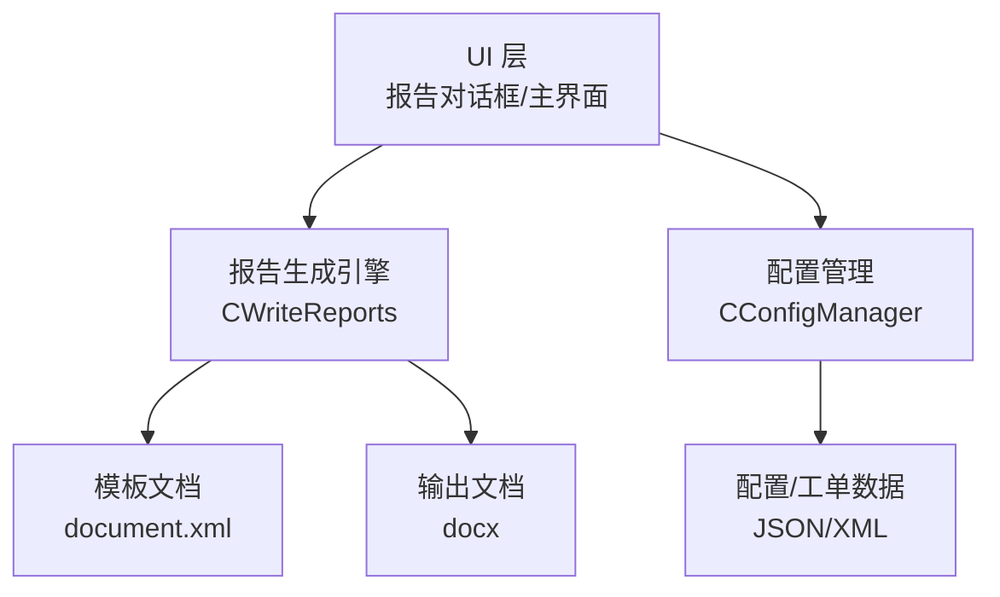
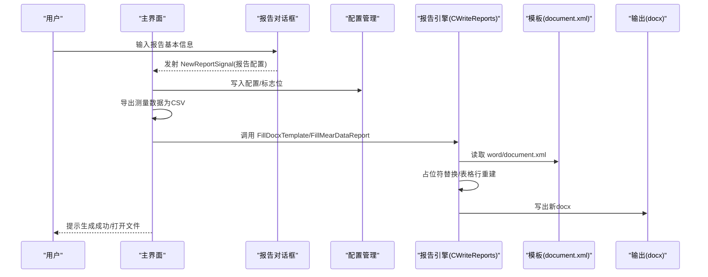
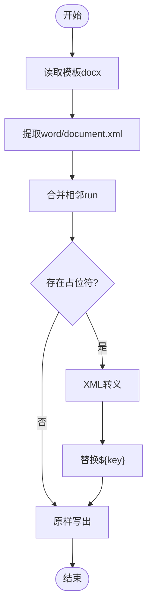
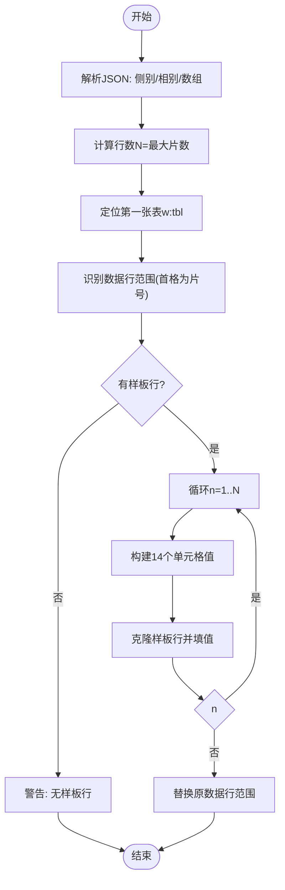
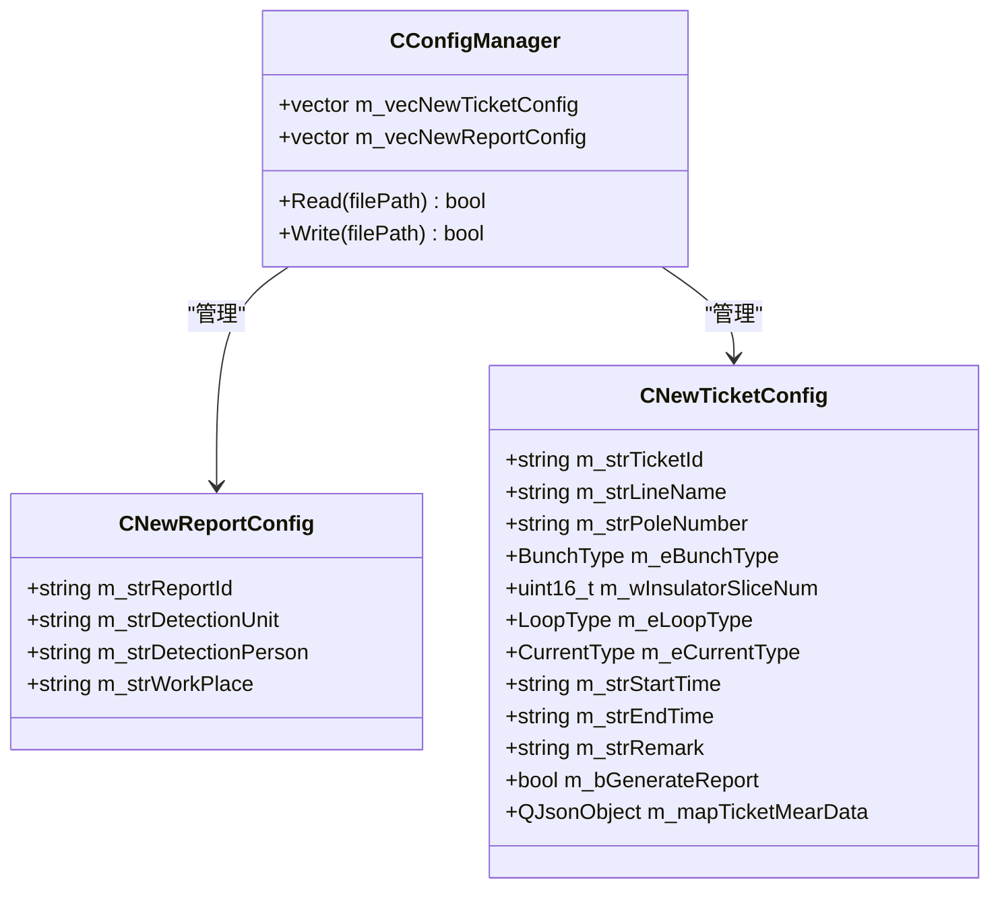
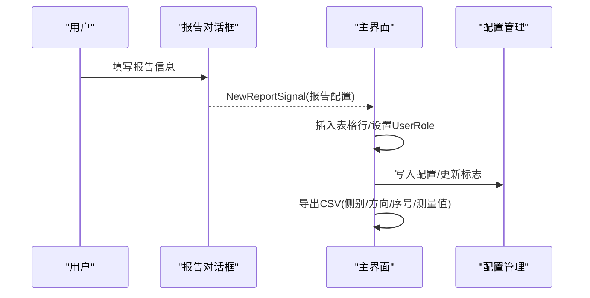
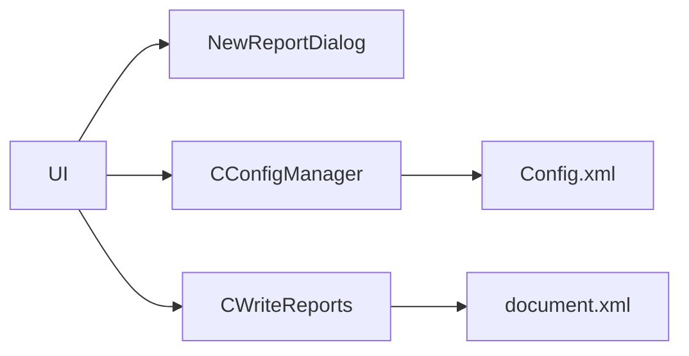

# 报告生成与管理

<cite>
**本文引用的文件**
- [WriteReports.h](file://Insulator_Zero_Value_Detection_Robot/Report/WriteReports.h)
- [WriteReports.cpp](file://Insulator_Zero_Value_Detection_Robot/Report/WriteReports.cpp)
- [document.xml](file://Insulator_Zero_Value_Detection_Robot/Report/document.xml)
- [example.cpp](file://Insulator_Zero_Value_Detection_Robot/Report/example.cpp)
- [ConfigManager.h](file://Insulator_Zero_Value_Detection_Robot/Config/ConfigManager.h)
- [ConfigManager.cpp](file://Insulator_Zero_Value_Detection_Robot/Config/ConfigManager.cpp)
- [NewReportDialog.h](file://Insulator_Zero_Value_Detection_Robot/UI/NewReportDialog.h)
- [NewReportDialog.cpp](file://Insulator_Zero_Value_Detection_Robot/UI/NewReportDialog.cpp)
- [Insulator_Zero_Value_Detection_Robot.cpp](file://Insulator_Zero_Value_Detection_Robot/UI/Insulator_Zero_Value_Detection_Robot.cpp)
</cite>

## 目录
1. [简介](#简介)
2. [项目结构](#项目结构)
3. [核心组件](#核心组件)
4. [架构总览](#架构总览)
5. [详细组件分析](#详细组件分析)
6. [依赖关系分析](#依赖关系分析)
7. [性能考虑](#性能考虑)
8. [故障排查指南](#故障排查指南)
9. [结论](#结论)
10. [附录](#附录)

## 简介
本章节面向绝缘子零值检测机器人V2的报告生成功能，系统性说明从模板选择、数据填充、表格自适应到导出与存档的完整流程。重点覆盖：
- 报告模板的选择与占位符替换机制
- 测量数据的自动填充与表格行自适应
- 报告内容结构与生成规则（基本信息、数据表、结果分析与建议）
- 导出与分享（Word/PDF、打印、电子存档）
- 模板自定义编辑方法
- 历史报告的查询与管理（按时间、线路、检测结果筛选）
- 质量控制措施（准确性与完整性校验）

## 项目结构
报告功能主要分布在以下模块：
- Report：报告模板与生成引擎（docx 模板解析、XML 占位符替换、表格数据行重建）
- UI：报告创建对话框与主界面按钮事件处理、报告列表管理、CSV 导出
- Config：报告配置与工单配置的数据模型及持久化读写

图表来源
- [WriteReports.h:20-88](file://Insulator_Zero_Value_Detection_Robot/Report/WriteReports.h#L20-L88)
- [WriteReports.cpp:40-105](file://Insulator_Zero_Value_Detection_Robot/Report/WriteReports.cpp#L40-L105)
- [ConfigManager.h:39-183](file://Insulator_Zero_Value_Detection_Robot/Config/ConfigManager.h#L39-L183)
- [Insulator_Zero_Value_Detection_Robot.cpp:2745-2819](file://Insulator_Zero_Value_Detection_Robot/UI/Insulator_Zero_Value_Detection_Robot.cpp#L2745-L2819)

章节来源
- [WriteReports.h:20-88](file://Insulator_Zero_Value_Detection_Robot/Report/WriteReports.h#L20-L88)
- [WriteReports.cpp:40-105](file://Insulator_Zero_Value_Detection_Robot/Report/WriteReports.cpp#L40-L105)
- [ConfigManager.h:39-183](file://Insulator_Zero_Value_Detection_Robot/Config/ConfigManager.h#L39-L183)
- [Insulator_Zero_Value_Detection_Robot.cpp:2745-2819](file://Insulator_Zero_Value_Detection_Robot/UI/Insulator_Zero_Value_Detection_Robot.cpp#L2745-L2819)

## 核心组件
- CWriteReports：报告生成引擎，提供模板占位符替换与测量数据表格填充能力
  - FillDocxTemplate：基于 ${key} 占位符替换文本
  - FillMearDataReport：将双联测量数据写入报告第一张表的片数数据行，支持行数自适应
  - 内部工具：XmlEscape、MergeAdjacentRuns、RewriteDocx、BuildDataRow、SetCellText
- CNewReportConfig/CNewTicketConfig：报告与工单的配置数据结构，承载基本信息与测量数据
- NewReportDialog：新建/编辑报告信息的对话框，提交后更新主界面并持久化
- 主界面事件：接收信号、维护报告列表、导出 CSV、触发报告生成

章节来源
- [WriteReports.h:20-88](file://Insulator_Zero_Value_Detection_Robot/Report/WriteReports.h#L20-L88)
- [WriteReports.cpp:10-321](file://Insulator_Zero_Value_Detection_Robot/Report/WriteReports.cpp#L10-L321)
- [ConfigManager.h:39-183](file://Insulator_Zero_Value_Detection_Robot/Config/ConfigManager.h#L39-L183)
- [NewReportDialog.h:10-31](file://Insulator_Zero_Value_Detection_Robot/UI/NewReportDialog.h#L10-L31)
- [NewReportDialog.cpp:4-49](file://Insulator_Zero_Value_Detection_Robot/UI/NewReportDialog.cpp#L4-L49)
- [Insulator_Zero_Value_Detection_Robot.cpp:2745-2819](file://Insulator_Zero_Value_Detection_Robot/UI/Insulator_Zero_Value_Detection_Robot.cpp#L2745-L2819)

## 架构总览
报告生成的整体流程如下：
- 用户在 UI 中填写报告基本信息并提交
- 系统保存报告配置与工单信息，并导出测量数据为 CSV
- 调用 CWriteReports 对 docx 模板进行占位符替换与表格数据填充
- 输出最终报告文档，供打印或转换为 PDF 存档

图表来源
- [NewReportDialog.cpp:19-33](file://Insulator_Zero_Value_Detection_Robot/UI/NewReportDialog.cpp#L19-L33)
- [Insulator_Zero_Value_Detection_Robot.cpp:2745-2819](file://Insulator_Zero_Value_Detection_Robot/UI/Insulator_Zero_Value_Detection_Robot.cpp#L2745-L2819)
- [WriteReports.cpp:40-105](file://Insulator_Zero_Value_Detection_Robot/Report/WriteReports.cpp#L40-L105)
- [WriteReports.cpp:207-320](file://Insulator_Zero_Value_Detection_Robot/Report/WriteReports.cpp#L207-L320)

## 详细组件分析

### 报告模板与占位符替换
- 技术路线：docx 本质是 zip 容器，正文在 word/document.xml；通过合并相邻 run 使 ${xxx} 成为连续文本，再统一替换
- 关键实现：
  - MergeAdjacentRuns：跨 run 合并 w:t，确保占位符不被拆分
  - FillPlaceholders：遍历 mapData，执行 ${key} -> 转义后的值
  - RewriteDocx：仅替换 document.xml，其余部件原样复制，避免破坏样式/图片/页眉页脚
- 使用示例参考：example.cpp 展示了最小可用流程

图表来源
- [WriteReports.cpp:20-38](file://Insulator_Zero_Value_Detection_Robot/Report/WriteReports.cpp#L20-L38)
- [WriteReports.cpp:40-105](file://Insulator_Zero_Value_Detection_Robot/Report/WriteReports.cpp#L40-L105)
- [example.cpp:27-71](file://Insulator_Zero_Value_Detection_Robot/Report/example.cpp#L27-L71)

章节来源
- [WriteReports.h:20-41](file://Insulator_Zero_Value_Detection_Robot/Report/WriteReports.h#L20-L41)
- [WriteReports.cpp:20-105](file://Insulator_Zero_Value_Detection_Robot/Report/WriteReports.cpp#L20-L105)
- [example.cpp:17-71](file://Insulator_Zero_Value_Detection_Robot/Report/example.cpp#L17-L71)

### 测量数据表格填充与行自适应
- 目标：将双联测量数据写入报告第一张表的片数数据行，行数随实际测量片数自适应
- 数据约定：
  - 侧别：含“大号”→表左半，“小号”→表右半
  - 相别：A/B/C 对应列组
  - 每相数组按[内侧,外侧]成对存放，第 n 片索引为 2(n-1) 与 2(n-1)+1
  - 数据行数 = 六个相列数组的最大片数
- 关键实现：
  - FillMearDataRows：解析 JSON，定位第一张表，识别数据行范围，以样板行克隆生成 N 行
  - BuildDataRow：剥离重复 ID，按 14 单元格顺序填入数据
  - SetCellText：安全写入第一个 w:t，清空其余 w:t，避免格式错乱

图表来源
- [WriteReports.cpp:207-320](file://Insulator_Zero_Value_Detection_Robot/Report/WriteReports.cpp#L207-L320)

章节来源
- [WriteReports.h:43-61](file://Insulator_Zero_Value_Detection_Robot/Report/WriteReports.h#L43-L61)
- [WriteReports.cpp:153-320](file://Insulator_Zero_Value_Detection_Robot/Report/WriteReports.cpp#L153-L320)

### 报告基本信息与配置管理
- 报告基本信息字段：报告编号、检测单位、检测人员、作业地点
- 工单配置字段：线路名称、杆塔号、串数类型、回路数、交直流类型、起止时间、备注、是否已生成报告、测量数据(JSON)
- 配置持久化：通过 CConfigManager 读写 XML，包含报告与工单列表

图表来源
- [ConfigManager.h:39-183](file://Insulator_Zero_Value_Detection_Robot/Config/ConfigManager.h#L39-L183)
- [ConfigManager.cpp:211-256](file://Insulator_Zero_Value_Detection_Robot/Config/ConfigManager.cpp#L211-L256)

章节来源
- [ConfigManager.h:39-183](file://Insulator_Zero_Value_Detection_Robot/Config/ConfigManager.h#L39-L183)
- [ConfigManager.cpp:211-256](file://Insulator_Zero_Value_Detection_Robot/Config/ConfigManager.cpp#L211-L256)

### UI 交互与报告列表管理
- 新建报告对话框：收集基本信息，提交后发射信号
- 主界面：接收信号，插入报告行，更新标志位，持久化配置，导出 CSV
- 报告操作：生成报告、删除报告、重置报告等按钮事件绑定

图表来源
- [NewReportDialog.cpp:19-33](file://Insulator_Zero_Value_Detection_Robot/UI/NewReportDialog.cpp#L19-L33)
- [Insulator_Zero_Value_Detection_Robot.cpp:2745-2819](file://Insulator_Zero_Value_Detection_Robot/UI/Insulator_Zero_Value_Detection_Robot.cpp#L2745-L2819)

章节来源
- [NewReportDialog.h:10-31](file://Insulator_Zero_Value_Detection_Robot/UI/NewReportDialog.h#L10-L31)
- [NewReportDialog.cpp:4-49](file://Insulator_Zero_Value_Detection_Robot/UI/NewReportDialog.cpp#L4-L49)
- [Insulator_Zero_Value_Detection_Robot.cpp:2745-2819](file://Insulator_Zero_Value_Detection_Robot/UI/Insulator_Zero_Value_Detection_Robot.cpp#L2745-L2819)

### 报告内容结构与生成规则
- 基本信息：报告编号、检测单位、检测人员、作业地点（来自 CNewReportConfig）
- 检测概况：巡检产品、检测方法、无人机型号、检测时间（可结合模板与配置）
- 依据与判定：检测依据与判定方法（模板固定内容，可按需扩展）
- 方位定义与判定规则：大小号侧、同塔单/双/四回、串命名、片编号规则（模板内文）
- 检测数据情况：数据表（由 FillMearDataReport 填充），展示各相内外侧测量值
- 结论与建议：可在模板中添加占位符，后续通过 FillDocxTemplate 注入结论与建议文本

章节来源
- [document.xml:1-2](file://Insulator_Zero_Value_Detection_Robot/Report/document.xml#L1-L2)
- [WriteReports.h:43-61](file://Insulator_Zero_Value_Detection_Robot/Report/WriteReports.h#L43-L61)
- [WriteReports.cpp:207-320](file://Insulator_Zero_Value_Detection_Robot/Report/WriteReports.cpp#L207-L320)

### 导出与分享（Word/PDF、打印、电子存档）
- Word 导出：直接生成 .docx 文件，无需安装 Word 即可写入
- PDF 转换：可使用系统或第三方工具将 docx 转为 PDF（例如 Microsoft Word 另存为 PDF、LibreOffice 命令行转换、或在线服务）
- 打印：在 Word 中直接打印生成的报告
- 电子存档：将 docx 与 CSV 归档至指定目录，便于检索与审计

章节来源
- [WriteReports.cpp:40-105](file://Insulator_Zero_Value_Detection_Robot/Report/WriteReports.cpp#L40-L105)
- [Insulator_Zero_Value_Detection_Robot.cpp:2776-2819](file://Insulator_Zero_Value_Detection_Robot/UI/Insulator_Zero_Value_Detection_Robot.cpp#L2776-L2819)

### 模板自定义编辑方法
- 在模板 docx 中使用 ${key} 作为占位符（如 ${report_id}、${unit}、${person}、${conclusion}）
- 保持表格结构稳定：数据表第一张表需包含至少一个 14 单元格的数据行样板（首格为片号数字）
- 修改样式/图片/页眉页脚不影响生成逻辑，因为仅替换 document.xml
- 验证：运行 example.cpp 或调用 FillDocxTemplate 测试占位符替换效果

章节来源
- [WriteReports.h:20-41](file://Insulator_Zero_Value_Detection_Robot/Report/WriteReports.h#L20-L41)
- [WriteReports.cpp:20-38](file://Insulator_Zero_Value_Detection_Robot/Report/WriteReports.cpp#L20-L38)
- [example.cpp:27-71](file://Insulator_Zero_Value_Detection_Robot/Report/example.cpp#L27-L71)

### 历史报告的查询与管理
- 报告列表：主界面 tableWidget_3 显示报告编号、单位、人员、地点
- 筛选：可通过 FilterReportTable 实现按条件筛选（当前代码已预留接口）
- 新增/更新：On_NewReportSignal/On_ChangeReportSignal 更新列表与配置
- 删除/重置：On_DeleteReport_Click/On_ResetReport_Click 提供删除与重置能力

章节来源
- [Insulator_Zero_Value_Detection_Robot.cpp:2745-2845](file://Insulator_Zero_Value_Detection_Robot/UI/Insulator_Zero_Value_Detection_Robot.cpp#L2745-L2845)

### 质量控制措施
- 路径校验：模板与输出路径不能为空且不能相同
- 模板完整性：必须存在 word/document.xml
- 表格样板：必须存在 14 单元格数据行样板，否则跳过填充并告警
- XML 转义：特殊字符 < > & 自动转义，避免 Word 解析错误
- 日志记录：失败场景输出警告日志，便于定位问题

章节来源
- [WriteReports.cpp:40-76](file://Insulator_Zero_Value_Detection_Robot/Report/WriteReports.cpp#L40-L76)
- [WriteReports.cpp:237-294](file://Insulator_Zero_Value_Detection_Robot/Report/WriteReports.cpp#L237-L294)

## 依赖关系分析
- UI 依赖报告对话框与主界面事件处理
- 主界面依赖配置管理进行数据持久化
- 报告引擎依赖模板文档与 Qt 私有 Zip 读写接口
- 配置管理依赖 tinyxml2 进行 XML 读写

图表来源
- [Insulator_Zero_Value_Detection_Robot.cpp:2745-2845](file://Insulator_Zero_Value_Detection_Robot/UI/Insulator_Zero_Value_Detection_Robot.cpp#L2745-L2845)
- [ConfigManager.cpp:211-256](file://Insulator_Zero_Value_Detection_Robot/Config/ConfigManager.cpp#L211-L256)
- [WriteReports.cpp:40-105](file://Insulator_Zero_Value_Detection_Robot/Report/WriteReports.cpp#L40-L105)

章节来源
- [Insulator_Zero_Value_Detection_Robot.cpp:2745-2845](file://Insulator_Zero_Value_Detection_Robot/UI/Insulator_Zero_Value_Detection_Robot.cpp#L2745-L2845)
- [ConfigManager.cpp:211-256](file://Insulator_Zero_Value_Detection_Robot/Config/ConfigManager.cpp#L211-L256)
- [WriteReports.cpp:40-105](file://Insulator_Zero_Value_Detection_Robot/Report/WriteReports.cpp#L40-L105)

## 性能考虑
- 模板解析：仅读取一次模板，复用 QZipReader 列表，减少 IO
- XML 处理：正则匹配与替换在内存中进行，适合中等规模模板
- 表格行生成：按样板行克隆，避免复杂 DOM 操作，提升效率
- 输出策略：仅替换 document.xml，其他资源原样复制，降低处理开销

## 故障排查指南
- 模板打开失败：检查模板路径与权限
- 模板与输出路径相同：避免覆盖源模板
- word/document.xml 为空：确认模板有效
- 未找到数据表/样板行：检查模板表格结构是否符合要求
- CSV 导出失败：检查文件路径与写入权限

章节来源
- [WriteReports.cpp:40-76](file://Insulator_Zero_Value_Detection_Robot/Report/WriteReports.cpp#L40-L76)
- [WriteReports.cpp:237-294](file://Insulator_Zero_Value_Detection_Robot/Report/WriteReports.cpp#L237-L294)
- [Insulator_Zero_Value_Detection_Robot.cpp:2776-2819](file://Insulator_Zero_Value_Detection_Robot/UI/Insulator_Zero_Value_Detection_Robot.cpp#L2776-L2819)

## 结论
本报告生成功能以 docx 模板为核心，通过占位符替换与表格数据行自适应，实现了自动化、可定制化的检测报告生成。配合配置管理与 UI 交互，形成了完整的报告创建、导出、存档与管理闭环。通过严格的路径与模板校验、XML 转义与日志记录，保障了报告内容的准确性与完整性，满足电力行业规范要求。

## 附录
- 模板占位符示例：${report_id}、${unit}、${person}、${conclusion}
- 数据表结构：14 单元格/行，顺序为片号与大号/小号 A/B/C 内外侧测量值
- 导出格式：docx（原生）、PDF（外部工具转换）、CSV（测量数据）