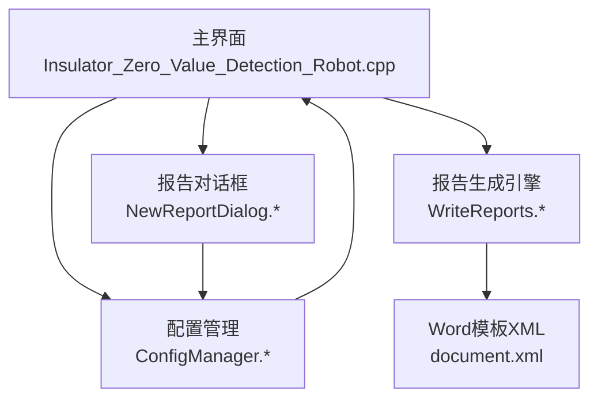
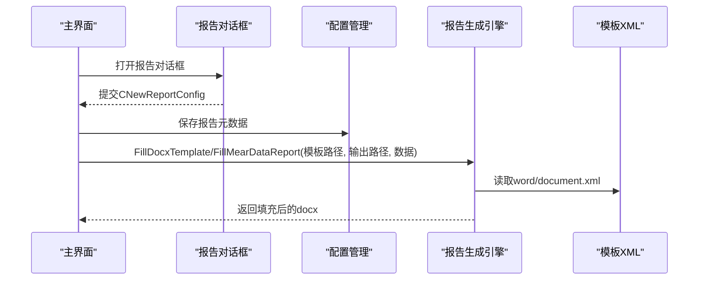
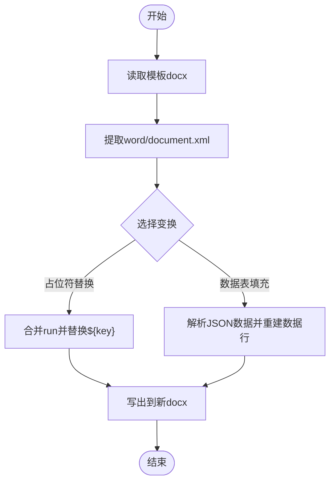
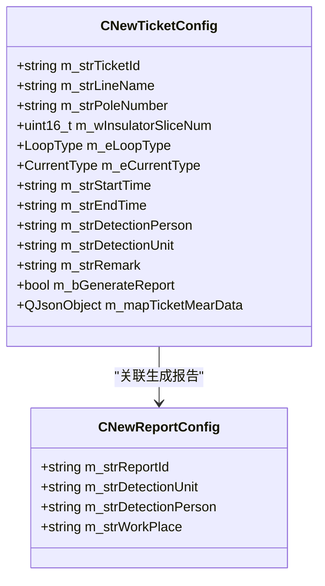
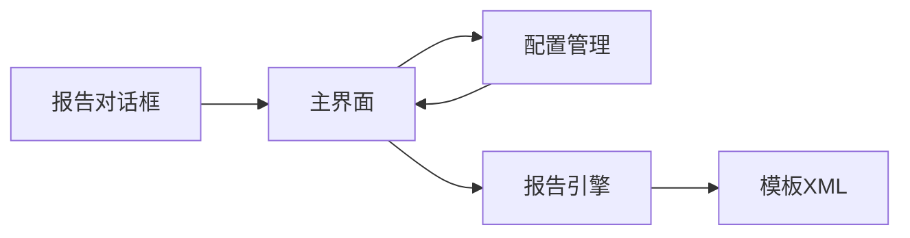

# 数据填充与生成

<cite>
**本文引用的文件**
- [WriteReports.h](file://Insulator_Zero_Value_Detection_Robot/Report/WriteReports.h)
- [WriteReports.cpp](file://Insulator_Zero_Value_Detection_Robot/Report/WriteReports.cpp)
- [document.xml](file://Insulator_Zero_Value_Detection_Robot/Report/document.xml)
- [ConfigManager.h](file://Insulator_Zero_Value_Detection_Robot/Config/ConfigManager.h)
- [ConfigManager.cpp](file://Insulator_Zero_Value_Detection_Robot/Config/ConfigManager.cpp)
- [NewReportDialog.h](file://Insulator_Zero_Value_Detection_Robot/UI/NewReportDialog.h)
- [NewReportDialog.cpp](file://Insulator_Zero_Value_Detection_Robot/UI/NewReportDialog.cpp)
- [NewReportDialog.ui](file://Insulator_Zero_Value_Detection_Robot/UI/NewReportDialog.ui)
- [Insulator_Zero_Value_Detection_Robot.cpp](file://Insulator_Zero_Value_Detection_Robot/UI/Insulator_Zero_Value_Detection_Robot.cpp)
- [操作说明书.md](file://操作说明书.md)
</cite>

## 目录
1. [简介](#简介)
2. [项目结构](#项目结构)
3. [核心组件](#核心组件)
4. [架构总览](#架构总览)
5. [详细组件分析](#详细组件分析)
6. [依赖关系分析](#依赖关系分析)
7. [性能考虑](#性能考虑)
8. [故障排查指南](#故障排查指南)
9. [结论](#结论)
10. [附录](#附录)

## 简介
本文件面向“绝缘子零值检测机器人V2”的数据填充与报告生成功能，系统性说明从检测数据采集、字段映射、数据校验与质量控制，到复杂数据处理（数值计算、单位转换、格式化输出）、异常处理策略、数据预览与编辑、以及批量报告生成的完整流程。文档同时提供代码级流程图与时序图，帮助读者快速理解实现细节与扩展点。

## 项目结构
围绕报告生成与数据填充，主要涉及以下模块：
- 报告模板与生成引擎：Report/WriteReports.* 与 Report/document.xml
- 配置与数据结构：Config/ConfigManager.*
- 用户交互与报告信息录入：UI/NewReportDialog.*
- 主界面与测量数据汇聚：UI/Insulator_Zero_Value_Detection_Robot.cpp
- 使用说明：操作说明书.md

图表来源
- [Insulator_Zero_Value_Detection_Robot.cpp:2745-2818](file://Insulator_Zero_Value_Detection_Robot/UI/Insulator_Zero_Value_Detection_Robot.cpp#L2745-L2818)
- [NewReportDialog.cpp:19-44](file://Insulator_Zero_Value_Detection_Robot/UI/NewReportDialog.cpp#L19-L44)
- [ConfigManager.cpp:221-256](file://Insulator_Zero_Value_Detection_Robot/Config/ConfigManager.cpp#L221-L256)
- [WriteReports.cpp:40-115](file://Insulator_Zero_Value_Detection_Robot/Report/WriteReports.cpp#L40-L115)

章节来源
- [Insulator_Zero_Value_Detection_Robot.cpp:2745-2818](file://Insulator_Zero_Value_Detection_Robot/UI/Insulator_Zero_Value_Detection_Robot.cpp#L2745-L2818)
- [NewReportDialog.cpp:19-44](file://Insulator_Zero_Value_Detection_Robot/UI/NewReportDialog.cpp#L19-L44)
- [ConfigManager.cpp:221-256](file://Insulator_Zero_Value_Detection_Robot/Config/ConfigManager.cpp#L221-L256)
- [WriteReports.cpp:40-115](file://Insulator_Zero_Value_Detection_Robot/Report/WriteReports.cpp#L40-L115)

## 核心组件
- 报告生成引擎 CWriteReports：负责读取docx模板、替换占位符、自适应填充测量数据表行、安全写出结果文件。
- 配置管理器 CConfigManager：持久化工单与报告元数据，读写XML配置。
- 报告对话框 NewReportDialog：收集报告编号、检测单位、检测人员、作业地点等元数据。
- 主界面 Insulator_Zero_Value_Detection_Robot：汇聚测量数据、触发报告生成、导出CSV原始数据。

章节来源
- [WriteReports.h:24-88](file://Insulator_Zero_Value_Detection_Robot/Report/WriteReports.h#L24-L88)
- [ConfigManager.h:39-50](file://Insulator_Zero_Value_Detection_Robot/Config/ConfigManager.h#L39-L50)
- [NewReportDialog.h:10-31](file://Insulator_Zero_Value_Detection_Robot/UI/NewReportDialog.h#L10-L31)
- [Insulator_Zero_Value_Detection_Robot.cpp:2745-2818](file://Insulator_Zero_Value_Detection_Robot/UI/Insulator_Zero_Value_Detection_Robot.cpp#L2745-L2818)

## 架构总览
报告生成采用“模板+数据”的解耦设计：
- 模板层：基于docx模板中的${key}占位符与固定表格结构（第一张表为数据表）。
- 数据层：以QJsonObject/QJsonArray组织侧别×相别×测量值数组；以QHash<QString,QString>组织文本占位符键值对。
- 引擎层：通过RewriteDocx统一读取模板、应用变换函数、原样复制其他部件并写出新docx。

图表来源
- [WriteReports.cpp:40-115](file://Insulator_Zero_Value_Detection_Robot/Report/WriteReports.cpp#L40-L115)
- [Insulator_Zero_Value_Detection_Robot.cpp:2745-2818](file://Insulator_Zero_Value_Detection_Robot/UI/Insulator_Zero_Value_Detection_Robot.cpp#L2745-L2818)
- [NewReportDialog.cpp:19-44](file://Insulator_Zero_Value_Detection_Robot/UI/NewReportDialog.cpp#L19-L44)

## 详细组件分析

### 报告生成引擎 CWriteReports
- 功能要点
  - 占位符替换：合并跨run的w:t片段，将${key}替换为转义后的值，避免XML非法字符导致显示异常。
  - 模板重写：仅修改word/document.xml，其余部件（样式、图片、页眉页脚）原样复制，保证格式稳定。
  - 测量数据表填充：根据双联测量数据自动计算行数，按14列布局写入每片内侧/外侧值，缺失值留空。
  - 单元格文本设置：精准定位第一个w:t写入目标值，清空后续w:t，避免重复内容。
- 关键接口
  - FillDocxTemplate(strTemplatePath, strOutputPath, mapData)
  - FillMearDataReport(strTemplatePath, strOutputPath, mapTicketMearData)
- 复杂度与性能
  - 正则匹配与字符串替换为主，时间复杂度近似O(N)，N为XML长度；适合常规报告规模。
  - 通过只改写document.xml，减少I/O与内存占用。

图表来源
- [WriteReports.cpp:20-38](file://Insulator_Zero_Value_Detection_Robot/Report/WriteReports.cpp#L20-L38)
- [WriteReports.cpp:131-151](file://Insulator_Zero_Value_Detection_Robot/Report/WriteReports.cpp#L131-L151)
- [WriteReports.cpp:206-320](file://Insulator_Zero_Value_Detection_Robot/Report/WriteReports.cpp#L206-L320)

章节来源
- [WriteReports.h:24-88](file://Insulator_Zero_Value_Detection_Robot/Report/WriteReports.h#L24-L88)
- [WriteReports.cpp:10-115](file://Insulator_Zero_Value_Detection_Robot/Report/WriteReports.cpp#L10-L115)
- [WriteReports.cpp:153-320](file://Insulator_Zero_Value_Detection_Robot/Report/WriteReports.cpp#L153-L320)

### 测量数据模型与映射规则
- 数据结构
  - QJsonObject mapTicketMearData：第一层key为“大号/小号”，第二层key为“A/B/C”相别，值为QJsonArray测量值数组。
  - 双联模式下，每片包含内侧与外侧两个值，数组按[内,外]成对存放。
- 映射规则
  - 数据表每行14单元格：[片号, 大号A内, 大号A外, 大号B内, 大号B外, 大号C内, 大号C外, 片号, 小号A内, 小号A外, 小号B内, 小号B外, 小号C内, 小号C外]。
  - 行数N = max(ceil(size/2)) across 6列，确保所有相别数据对齐。
- 单位与格式化
  - 数值直接转为字符串写入单元格；如需单位转换或精度控制，可在调用方构造mapTicketMearData时完成。

图表来源
- [ConfigManager.h:39-50](file://Insulator_Zero_Value_Detection_Robot/Config/ConfigManager.h#L39-L50)
- [ConfigManager.h:52-183](file://Insulator_Zero_Value_Detection_Robot/Config/ConfigManager.h#L52-L183)

章节来源
- [ConfigManager.h:39-50](file://Insulator_Zero_Value_Detection_Robot/Config/ConfigManager.h#L39-L50)
- [ConfigManager.h:52-183](file://Insulator_Zero_Value_Detection_Robot/Config/ConfigManager.h#L52-L183)
- [WriteReports.cpp:206-320](file://Insulator_Zero_Value_Detection_Robot/Report/WriteReports.cpp#L206-L320)

### 数据验证与质量控制
- 前置校验
  - 未加载工单时禁止进入测量流程，防止空数据生成报告。
  - 控制板连接状态与电源状态检查，避免等待弹窗卡死。
- 容量限制
  - 双联上限=2×片数，单联上限=片数；超出提示“请换相或换号侧”。
- 阈值判定
  - 依据配置的绝缘阈值对单片阻值进行合格/异常着色显示，辅助人工复核。
- 超时与异常
  - 探针到位轮询与测量结果超时兜底，异常时自动中止并记录告警。

章节来源
- [Insulator_Zero_Value_Detection_Robot.cpp:2030-2053](file://Insulator_Zero_Value_Detection_Robot/UI/Insulator_Zero_Value_Detection_Robot.cpp#L2030-L2053)
- [Insulator_Zero_Value_Detection_Robot.cpp:2074-2233](file://Insulator_Zero_Value_Detection_Robot/UI/Insulator_Zero_Value_Detection_Robot.cpp#L2074-L2233)
- [Insulator_Zero_Value_Detection_Robot.cpp:2700-2721](file://Insulator_Zero_Value_Detection_Robot/UI/Insulator_Zero_Value_Detection_Robot.cpp#L2700-L2721)

### 复杂数据处理逻辑
- 数值计算
  - 定标流程中三次测量取平均，计算误差百分比用于验证。
- 单位转换
  - 报告数据表默认输出原始数值；如需单位转换（如kΩ→MΩ），建议在构造QJsonArray前完成。
- 格式化输出
  - CSV导出保留三位小数；报告单元格写入数字字符串，保持模板样式。

章节来源
- [Insulator_Zero_Value_Detection_Robot.cpp:1064-1076](file://Insulator_Zero_Value_Detection_Robot/UI/Insulator_Zero_Value_Detection_Robot.cpp#L1064-L1076)
- [Insulator_Zero_Value_Detection_Robot.cpp:2776-2818](file://Insulator_Zero_Value_Detection_Robot/UI/Insulator_Zero_Value_Detection_Robot.cpp#L2776-L2818)

### 异常数据处理策略
- 缺失数据
  - 数据表某位置无对应测量值时，写入空字符串，不破坏表格结构。
- 错误数据
  - XML特殊字符经转义后写入，避免Word解析错误。
- 显示方式
  - 异常项在UI中以红色背景标识，便于快速定位问题片。

章节来源
- [WriteReports.cpp:10-18](file://Insulator_Zero_Value_Detection_Robot/Report/WriteReports.cpp#L10-L18)
- [WriteReports.cpp:292-294](file://Insulator_Zero_Value_Detection_Robot/Report/WriteReports.cpp#L292-L294)
- [Insulator_Zero_Value_Detection_Robot.cpp:2708-2718](file://Insulator_Zero_Value_Detection_Robot/UI/Insulator_Zero_Value_Detection_Robot.cpp#L2708-L2718)

### 数据预览与编辑
- 报告元数据编辑
  - 通过NewReportDialog输入报告编号、检测单位、检测人员、作业地点，确认后保存到配置。
- 测量数据预览
  - 主界面表格展示当前工单的测量进度与结果，支持复检删除最近一次测量值并重测。
- 数据导出
  - 生成报告时同步导出CSV，便于离线核对与二次加工。

章节来源
- [NewReportDialog.cpp:19-44](file://Insulator_Zero_Value_Detection_Robot/UI/NewReportDialog.cpp#L19-L44)
- [操作说明书.md:310-316](file://操作说明书.md#L310-L316)
- [Insulator_Zero_Value_Detection_Robot.cpp:2776-2818](file://Insulator_Zero_Value_Detection_Robot/UI/Insulator_Zero_Value_Detection_Robot.cpp#L2776-L2818)

### 批量报告生成能力
- 当前实现
  - 报告列表支持新增、删除、下载；生成报告前若已存在会询问覆盖。
  - 每次生成针对当前加载工单，生成完成后更新配置并保存CSV。
- 扩展建议
  - 可封装批处理接口，遍历m_vecNewReportConfig或m_vecNewTicketConfig，循环调用FillDocxTemplate/FillMearDataReport，实现多任务批量生成。

章节来源
- [操作说明书.md:310-316](file://操作说明书.md#L310-L316)
- [Insulator_Zero_Value_Detection_Robot.cpp:2745-2818](file://Insulator_Zero_Value_Detection_Robot/UI/Insulator_Zero_Value_Detection_Robot.cpp#L2745-L2818)

## 依赖关系分析
- 组件耦合
  - 主界面依赖配置管理读写报告元数据；依赖报告引擎生成docx。
  - 报告对话框仅负责采集元数据，通过信号回传主界面。
  - 报告引擎独立于业务流，仅依赖Qt容器与XML处理能力。
- 外部依赖
  - Qt Core（QZipReader/QZipWriter、QRegularExpression、QJsonObject等）。
  - TinyXML2用于配置文件的读写。

图表来源
- [Insulator_Zero_Value_Detection_Robot.cpp:2745-2818](file://Insulator_Zero_Value_Detection_Robot/UI/Insulator_Zero_Value_Detection_Robot.cpp#L2745-L2818)
- [NewReportDialog.cpp:19-44](file://Insulator_Zero_Value_Detection_Robot/UI/NewReportDialog.cpp#L19-L44)
- [WriteReports.cpp:40-115](file://Insulator_Zero_Value_Detection_Robot/Report/WriteReports.cpp#L40-L115)
- [ConfigManager.cpp:221-256](file://Insulator_Zero_Value_Detection_Robot/Config/ConfigManager.cpp#L221-L256)

章节来源
- [Insulator_Zero_Value_Detection_Robot.cpp:2745-2818](file://Insulator_Zero_Value_Detection_Robot/UI/Insulator_Zero_Value_Detection_Robot.cpp#L2745-L2818)
- [WriteReports.cpp:40-115](file://Insulator_Zero_Value_Detection_Robot/Report/WriteReports.cpp#L40-L115)
- [ConfigManager.cpp:221-256](file://Insulator_Zero_Value_Detection_Robot/Config/ConfigManager.cpp#L221-L256)

## 性能考虑
- I/O优化
  - 仅重写document.xml，其他资源原样复制，减少磁盘写入量。
- 内存使用
  - 使用QByteArray与流式写入，避免全量加载大文件。
- CPU开销
  - 正则表达式用于合并run与定位表格行，注意模板XML复杂度影响；建议保持模板结构稳定。

## 故障排查指南
- 常见问题
  - 模板路径为空或输出路径相同：引擎返回失败并记录警告。
  - 模板不存在或document.xml为空：无法继续，需检查模板完整性。
  - 未找到数据表或样板行：跳过测量数据填充，需确认模板表格结构。
- 调试建议
  - 查看日志输出（qWarning/设备日志），定位具体失败阶段。
  - 检查CSV导出是否成功，确认测量数据是否正确汇聚。

章节来源
- [WriteReports.cpp:46-76](file://Insulator_Zero_Value_Detection_Robot/Report/WriteReports.cpp#L46-L76)
- [WriteReports.cpp:237-294](file://Insulator_Zero_Value_Detection_Robot/Report/WriteReports.cpp#L237-L294)
- [Insulator_Zero_Value_Detection_Robot.cpp:2776-2818](file://Insulator_Zero_Value_Detection_Robot/UI/Insulator_Zero_Value_Detection_Robot.cpp#L2776-L2818)

## 结论
本系统通过模板化报告生成与结构化数据模型，实现了绝缘子零值检测数据的自动采集、映射、校验与输出。CWriteReports提供了稳定高效的docx填充能力，结合主界面的数据汇聚与配置管理，形成了完整的报告生成闭环。未来可扩展批量生成、更多单位转换与更丰富的可视化预览，进一步提升用户体验与效率。

## 附录
- 模板结构参考：document.xml中包含标题、目录、检测概况、数据表等固定结构与占位符。
- 操作流程参考：操作说明书.md描述了报告生成入口、字段填写与覆盖确认流程。

章节来源
- [document.xml:1-2](file://Insulator_Zero_Value_Detection_Robot/Report/document.xml#L1-L2)
- [操作说明书.md:310-316](file://操作说明书.md#L310-L316)