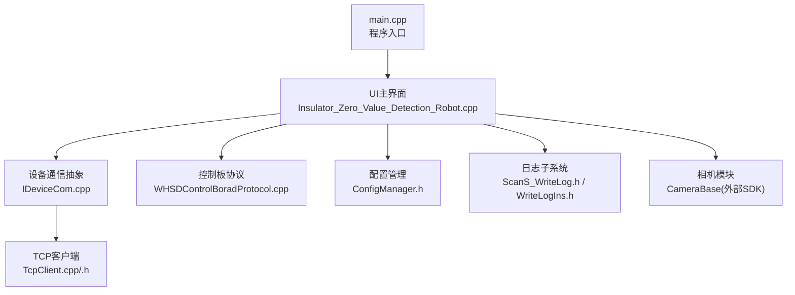
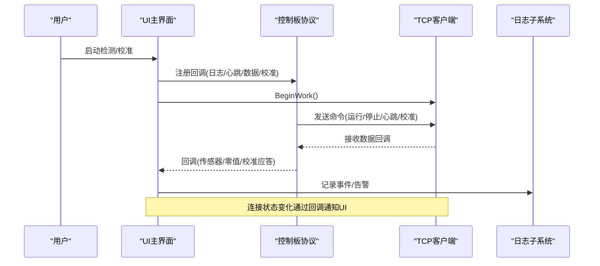
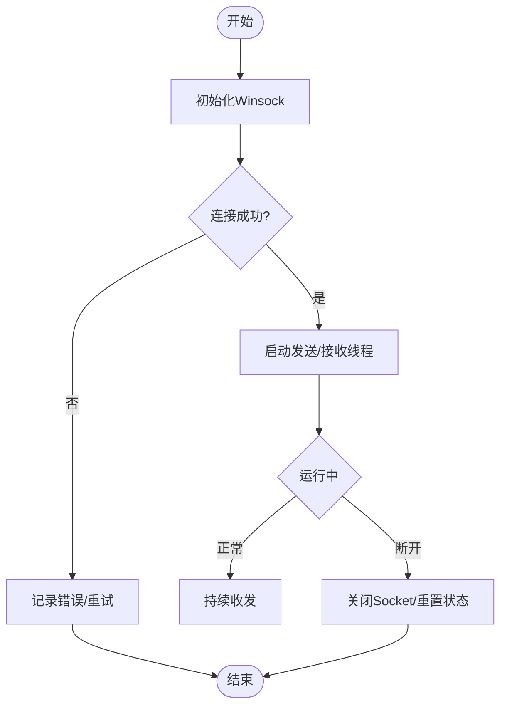
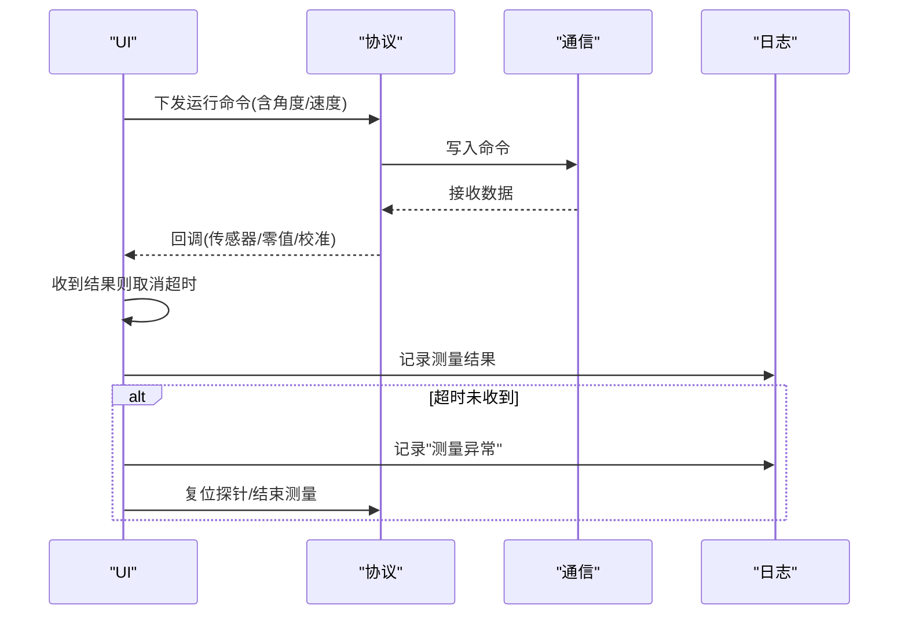
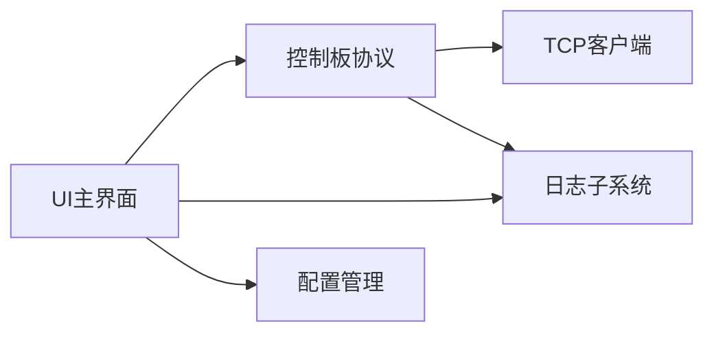

# 故障排除与常见问题

<cite>
**本文引用的文件**
- [README.md](file://README.md)
- [main.cpp](file://Insulator_Zero_Value_Detection_Robot/main.cpp)
- [Insulator_Zero_Value_Detection_Robot.cpp](file://Insulator_Zero_Value_Detection_Robot/UI/Insulator_Zero_Value_Detection_Robot.cpp)
- [IDeviceCom.cpp](file://Insulator_Zero_Value_Detection_Robot/DeviceCom/IDeviceCom.cpp)
- [TcpClient.h](file://Insulator_Zero_Value_Detection_Robot/DeviceCom/TcpClient.h)
- [TcpClient.cpp](file://Insulator_Zero_Value_Detection_Robot/DeviceCom/TcpClient.cpp)
- [WHSDControlBoradProtocol.cpp](file://Insulator_Zero_Value_Detection_Robot/Protocol/WHSDControlBoradProtocol.cpp)
- [ConfigManager.h](file://Insulator_Zero_Value_Detection_Robot/Config/ConfigManager.h)
- [ScanS_WriteLog.h](file://Insulator_Zero_Value_Detection_Robot/Log/ScanS_WriteLog.h)
- [WriteLogIns.h](file://Insulator_Zero_Value_Detection_Robot/Log/WriteLogIns.h)
- [单点定标协议与流程_V1.0.html](file://Insulator_Zero_Value_Detection_Robot/单点定标协议与流程_V1.0.html)
- [Insulator_Zero_Value_Detection_Robot.vcxproj.user](file://Insulator_Zero_Value_Detection_Robot/Insulator_Zero_Value_Detection_Robot.vcxproj.user)
</cite>

## 目录
1. [简介](#简介)
2. [项目结构](#项目结构)
3. [核心组件](#核心组件)
4. [架构总览](#架构总览)
5. [详细组件分析](#详细组件分析)
6. [依赖关系分析](#依赖关系分析)
7. [性能注意事项](#性能注意事项)
8. [故障排查指南](#故障排查指南)
9. [结论](#结论)
10. [附录：错误代码与处理参考](#附录错误代码与处理参考)

## 简介
本文件面向绝缘子零值检测机器人V2的用户与维护人员，提供系统化的故障排除与常见问题解答。内容覆盖设备连接失败、通信异常、检测数据错误、软件崩溃等典型问题；给出日志查看与分析方法、系统性排查流程、错误代码含义与处置措施、预防性维护建议与最佳实践，以及技术支持联系方式与反馈渠道说明。

## 项目结构
- 应用入口与UI初始化在 main.cpp 中完成，启动Qt主循环并显示主窗口。
- 设备通信抽象层 IDeviceCom 通过工厂方法创建具体实现（当前为TCP客户端）。
- TCP客户端 CTcpClientCom 负责建立连接、收发线程、连接状态回调。
- 控制板协议 CWHSDControlBoradProtocol 封装命令帧、心跳、校准、OTA等逻辑，并提供回调接口。
- 配置管理 CConfigManager 读取/写入控制板、相机、工单与报告相关参数。
- 日志子系统由 CWriteLog/CWriteLogIns 提供异步/同步写日志能力，输出到 RunDir/Log 目录。
- UI 主界面 Insulator_Zero_Value_Detection_Robot.cpp 协调各模块，处理测量流程、告警、超时、校准等。

图表来源
- [main.cpp:11-23](file://Insulator_Zero_Value_Detection_Robot/main.cpp#L11-L23)
- [Insulator_Zero_Value_Detection_Robot.cpp:231-315](file://Insulator_Zero_Value_Detection_Robot/UI/Insulator_Zero_Value_Detection_Robot.cpp#L231-L315)
- [IDeviceCom.cpp:4-12](file://Insulator_Zero_Value_Detection_Robot/DeviceCom/IDeviceCom.cpp#L4-L12)
- [TcpClient.h:8-46](file://Insulator_Zero_Value_Detection_Robot/DeviceCom/TcpClient.h#L8-L46)
- [WHSDControlBoradProtocol.cpp:488-504](file://Insulator_Zero_Value_Detection_Robot/Protocol/WHSDControlBoradProtocol.cpp#L488-L504)
- [ConfigManager.h:10-24](file://Insulator_Zero_Value_Detection_Robot/Config/ConfigManager.h#L10-L24)
- [ScanS_WriteLog.h:5-42](file://Insulator_Zero_Value_Detection_Robot/Log/ScanS_WriteLog.h#L5-L42)
- [WriteLogIns.h:65-129](file://Insulator_Zero_Value_Detection_Robot/Log/WriteLogIns.h#L65-L129)

章节来源
- [README.md:1-3](file://README.md#L1-L3)
- [Insulator_Zero_Value_Detection_Robot.vcxproj.user:6-17](file://Insulator_Zero_Value_Detection_Robot/Insulator_Zero_Value_Detection_Robot.vcxproj.user#L6-L17)

## 核心组件
- 设备通信层
  - IDeviceCom：统一设备通信接口，支持按类型创建具体实现（如TCP）。
  - CTcpClientCom：基于Winsock的TCP客户端，包含连接、发送、接收线程，使用条件变量和互斥量保护发送队列，支持连接状态回调。
- 控制板协议
  - CWHSDControlBoradProtocol：封装控制板命令（运行、停止、心跳、校准、OTA等），注册回调（日志、心跳、传感器数据、零值数据、校准应答），内部维护心跳线程。
- 配置管理
  - CConfigManager：管理控制板IP/端口、阈值、相机RTSP/直连参数、工单与报告信息。
- 日志子系统
  - CWriteLog/CWriteLogIns：支持多行缓冲、循环覆盖、同步/异步写入，用于设备日志与调试输出。
- UI与业务流程
  - 主界面负责参数初始化、设备连接、相机连接、测量流程、告警记录、超时处理、校准流程等。

章节来源
- [IDeviceCom.cpp:4-12](file://Insulator_Zero_Value_Detection_Robot/DeviceCom/IDeviceCom.cpp#L4-L12)
- [TcpClient.h:8-46](file://Insulator_Zero_Value_Detection_Robot/DeviceCom/TcpClient.h#L8-L46)
- [TcpClient.cpp:21-57](file://Insulator_Zero_Value_Detection_Robot/DeviceCom/TcpClient.cpp#L21-L57)
- [WHSDControlBoradProtocol.cpp:478-504](file://Insulator_Zero_Value_Detection_Robot/Protocol/WHSDControlBoradProtocol.cpp#L478-L504)
- [ConfigManager.h:10-24](file://Insulator_Zero_Value_Detection_Robot/Config/ConfigManager.h#L10-L24)
- [ScanS_WriteLog.h:5-42](file://Insulator_Zero_Value_Detection_Robot/Log/ScanS_WriteLog.h#L5-L42)
- [WriteLogIns.h:65-129](file://Insulator_Zero_Value_Detection_Robot/Log/WriteLogIns.h#L65-L129)
- [Insulator_Zero_Value_Detection_Robot.cpp:231-315](file://Insulator_Zero_Value_Detection_Robot/UI/Insulator_Zero_Value_Detection_Robot.cpp#L231-L315)

## 架构总览
系统采用分层架构：UI层驱动业务，协议层封装控制板交互，通信层负责网络传输，配置层提供运行时参数，日志层记录关键事件。

图表来源
- [Insulator_Zero_Value_Detection_Robot.cpp:277-290](file://Insulator_Zero_Value_Detection_Robot/UI/Insulator_Zero_Value_Detection_Robot.cpp#L277-L290)
- [WHSDControlBoradProtocol.cpp:478-504](file://Insulator_Zero_Value_Detection_Robot/Protocol/WHSDControlBoradProtocol.cpp#L478-L504)
- [TcpClient.cpp:43-57](file://Insulator_Zero_Value_Detection_Robot/DeviceCom/TcpClient.cpp#L43-L57)
- [ScanS_WriteLog.h:29-38](file://Insulator_Zero_Value_Detection_Robot/Log/ScanS_WriteLog.h#L29-L38)

## 详细组件分析

### 设备连接与通信（TCP）
- 连接流程
  - 设置目标IP与端口，BeginWork初始化Winsock并启动连接线程。
  - 连接成功后设置m_connected=true，触发连接状态回调。
  - 发送与接收分别由独立线程处理，使用条件变量唤醒发送线程。
- 常见故障点
  - Winsock初始化失败、SO_ERROR非零、select错误、recv返回0或负数导致断开。
  - 未连接时Write直接返回false，上层需重试或提示。
- 诊断要点
  - 检查设备IP/端口是否正确，防火墙是否放行。
  - 观察连接状态回调与日志“控制板连接状态变化”。
  - 若频繁断开，检查网络稳定性与对端服务存活。

图表来源
- [TcpClient.cpp:59-73](file://Insulator_Zero_Value_Detection_Robot/DeviceCom/TcpClient.cpp#L59-L73)
- [TcpClient.cpp:196-235](file://Insulator_Zero_Value_Detection_Robot/DeviceCom/TcpClient.cpp#L196-L235)
- [TcpClient.cpp:238-382](file://Insulator_Zero_Value_Detection_Robot/DeviceCom/TcpClient.cpp#L238-L382)

章节来源
- [TcpClient.h:8-46](file://Insulator_Zero_Value_Detection_Robot/DeviceCom/TcpClient.h#L8-L46)
- [TcpClient.cpp:21-57](file://Insulator_Zero_Value_Detection_Robot/DeviceCom/TcpClient.cpp#L21-L57)
- [TcpClient.cpp:196-382](file://Insulator_Zero_Value_Detection_Robot/DeviceCom/TcpClient.cpp#L196-L382)
- [Insulator_Zero_Value_Detection_Robot.cpp:635-640](file://Insulator_Zero_Value_Detection_Robot/UI/Insulator_Zero_Value_Detection_Robot.cpp#L635-L640)

### 控制板协议与心跳
- 功能
  - 封装设备运行/停止命令，心跳定时发送，校准流程（0x0F原始值采集、0x0E写入系数）、OTA升级。
  - 注册日志回调、心跳回调、传感器数据回调、零值数据回调、校准回调。
- 常见故障点
  - 心跳超时、校准应答慢（Flash擦写需1~2秒）、校验失败、包序号错乱。
- 诊断要点
  - 关注校准步骤状态与超时提示。
  - 检查链路质量与对端响应时间。
  - 确认参数格式（如标准值/原始值字节序与长度）。

章节来源
- [WHSDControlBoradProtocol.cpp:257-321](file://Insulator_Zero_Value_Detection_Robot/Protocol/WHSDControlBoradProtocol.cpp#L257-L321)
- [WHSDControlBoradProtocol.cpp:478-504](file://Insulator_Zero_Value_Detection_Robot/Protocol/WHSDControlBoradProtocol.cpp#L478-L504)
- [WHSDControlBoradProtocol.cpp:723-783](file://Insulator_Zero_Value_Detection_Robot/Protocol/WHSDControlBoradProtocol.cpp#L723-L783)
- [Insulator_Zero_Value_Detection_Robot.cpp:1250-1313](file://Insulator_Zero_Value_Detection_Robot/UI/Insulator_Zero_Value_Detection_Robot.cpp#L1250-L1313)

### 测量流程与超时处理
- 流程
  - 选择侧别/方向后进入测量步骤，探针到位信号触发测量。
  - 收到测量结果后取消超时计时，更新UI与曲线。
  - 若超时未收到结果，自动中止测量并复位探针。
- 常见故障点
  - 检测模块无返回值、链路中断、探针未到位、电源未确认关闭。
- 诊断要点
  - 查看“测量异常”告警与日志“测量流程:结果超时...”。
  - 检查控制板连接状态与传感器数据回调。
  - 确认阈值配置与测量步序。

图表来源
- [Insulator_Zero_Value_Detection_Robot.cpp:2180-2206](file://Insulator_Zero_Value_Detection_Robot/UI/Insulator_Zero_Value_Detection_Robot.cpp#L2180-L2206)
- [Insulator_Zero_Value_Detection_Robot.cpp:2141-2176](file://Insulator_Zero_Value_Detection_Robot/UI/Insulator_Zero_Value_Detection_Robot.cpp#L2141-L2176)
- [WHSDControlBoradProtocol.cpp:488-504](file://Insulator_Zero_Value_Detection_Robot/Protocol/WHSDControlBoradProtocol.cpp#L488-L504)

章节来源
- [Insulator_Zero_Value_Detection_Robot.cpp:2141-2206](file://Insulator_Zero_Value_Detection_Robot/UI/Insulator_Zero_Value_Detection_Robot.cpp#L2141-L2206)

### 校准流程（单点定标）
- 步骤
  - 恢复默认应答超时、采集三次原始值、执行0x0E写入系数、验证修正值。
- 常见故障点
  - 0x0F应答原因0x01（距上次0x0F超5秒）、0x0E应答原因0x09（标准值/原始值≤0或原始值≥标准值）、参数长度错误、Flash擦写慢导致超时。
- 诊断要点
  - 严格按顺序执行，避免跨步操作。
  - 检查接线与模块读数，勿强行定标。
  - 将超时阈值设≥3秒以容纳Flash擦写。

章节来源
- [单点定标协议与流程_V1.0.html:140-148](file://Insulator_Zero_Value_Detection_Robot/单点定标协议与流程_V1.0.html#L140-L148)
- [Insulator_Zero_Value_Detection_Robot.cpp:1250-1313](file://Insulator_Zero_Value_Detection_Robot/UI/Insulator_Zero_Value_Detection_Robot.cpp#L1250-L1313)

### 相机连接与视频流
- 模式
  - 旧相机：通过SDK初始化并连接左右摄像头。
  - 新相机：使用OpenCV打开RTSP流，设置低延迟参数。
- 常见故障点
  - RTSP URL为空或不可用、FFMPEG后端无法打开流、网络带宽不足。
- 诊断要点
  - 检查相机IP/URL配置，确保网络可达。
  - 查看日志“打开RTSP流失败”提示。
  - 调整码流（主/子）与缓冲区大小。

章节来源
- [Insulator_Zero_Value_Detection_Robot.cpp:1315-1405](file://Insulator_Zero_Value_Detection_Robot/UI/Insulator_Zero_Value_Detection_Robot.cpp#L1315-L1405)
- [ConfigManager.h:26-37](file://Insulator_Zero_Value_Detection_Robot/Config/ConfigManager.h#L26-L37)

### 配置管理与参数保存
- 内容
  - 控制板IP/端口、阈值、探针角度、相机IP/RTSP、工单与报告信息。
- 常见故障点
  - 配置文件路径不存在、读写权限不足、参数格式错误。
- 诊断要点
  - 修改相机IP后需重启软件生效。
  - 保存参数后检查提示与日志。

章节来源
- [ConfigManager.h:10-24](file://Insulator_Zero_Value_Detection_Robot/Config/ConfigManager.h#L10-L24)
- [Insulator_Zero_Value_Detection_Robot.cpp:2526-2541](file://Insulator_Zero_Value_Detection_Robot/UI/Insulator_Zero_Value_Detection_Robot.cpp#L2526-L2541)

## 依赖关系分析
- UI依赖协议层进行设备控制与数据接收。
- 协议层依赖通信层进行网络I/O。
- 通信层依赖操作系统网络栈（Winsock）。
- 日志子系统被UI与协议层共同使用，用于记录关键事件。
- 配置层为UI与协议层提供运行时参数。

图表来源
- [Insulator_Zero_Value_Detection_Robot.cpp:277-290](file://Insulator_Zero_Value_Detection_Robot/UI/Insulator_Zero_Value_Detection_Robot.cpp#L277-L290)
- [WHSDControlBoradProtocol.cpp:478-504](file://Insulator_Zero_Value_Detection_Robot/Protocol/WHSDControlBoradProtocol.cpp#L478-L504)
- [TcpClient.cpp:43-57](file://Insulator_Zero_Value_Detection_Robot/DeviceCom/TcpClient.cpp#L43-L57)
- [ScanS_WriteLog.h:29-38](file://Insulator_Zero_Value_Detection_Robot/Log/ScanS_WriteLog.h#L29-L38)

章节来源
- [Insulator_Zero_Value_Detection_Robot.cpp:277-290](file://Insulator_Zero_Value_Detection_Robot/UI/Insulator_Zero_Value_Detection_Robot.cpp#L277-L290)
- [WHSDControlBoradProtocol.cpp:478-504](file://Insulator_Zero_Value_Detection_Robot/Protocol/WHSDControlBoradProtocol.cpp#L478-L504)
- [TcpClient.cpp:43-57](file://Insulator_Zero_Value_Detection_Robot/DeviceCom/TcpClient.cpp#L43-L57)
- [ScanS_WriteLog.h:29-38](file://Insulator_Zero_Value_Detection_Robot/Log/ScanS_WriteLog.h#L29-L38)

## 性能注意事项
- 网络I/O使用select与条件变量，避免忙等待，降低CPU占用。
- 日志写入采用异步缓冲，减少UI阻塞。
- 相机流设置最小缓冲区以降低延迟。
- 校准过程中Flash擦写耗时较长，需合理设置超时阈值。

[本节为通用性能讨论，不直接分析具体文件]

## 故障排查指南

### 快速定位流程
1. 重启软件
   - 适用于临时卡死或资源占用异常。
2. 检查设备连接
   - 确认控制板IP/端口正确，网络连通。
   - 观察“控制板连接状态变化”日志与UI状态。
3. 检查相机连接
   - 确认RTSP URL或相机IP有效，网络可达。
   - 查看“打开RTSP流失败”日志。
4. 检查测量与校准
   - 查看“测量异常”告警与校准步骤状态。
   - 根据错误原因（如0x0F/0x0E应答原因）对照附录处理。
5. 收集日志
   - 导出RunDir/Log下的设备日志，附关键时间段记录。
6. 硬件检查
   - 检查供电、线缆、探针位置与机械限位。
7. 联系支持
   - 提供日志、配置截图、操作步骤与复现条件。

### 日志查看与分析
- 日志位置
  - 运行目录下的 Log 文件夹（构建输出目录为 RunDir）。
- 日志内容
  - 设备连接状态、测量流程、校准步骤、告警信息、相机连接状态。
- 分析方法
  - 搜索关键词：“连接状态变化”、“测量异常”、“打开RTSP流失败”、“定标失败”、“应答超时”。
  - 结合时间戳定位问题发生阶段。

章节来源
- [Insulator_Zero_Value_Detection_Robot.cpp:231-245](file://Insulator_Zero_Value_Detection_Robot/UI/Insulator_Zero_Value_Detection_Robot.cpp#L231-L245)
- [Insulator_Zero_Value_Detection_Robot.cpp:635-640](file://Insulator_Zero_Value_Detection_Robot/UI/Insulator_Zero_Value_Detection_Robot.cpp#L635-L640)
- [Insulator_Zero_Value_Detection_Robot.cpp:1315-1405](file://Insulator_Zero_Value_Detection_Robot/UI/Insulator_Zero_Value_Detection_Robot.cpp#L1315-L1405)
- [Insulator_Zero_Value_Detection_Robot.cpp:2141-2176](file://Insulator_Zero_Value_Detection_Robot/UI/Insulator_Zero_Value_Detection_Robot.cpp#L2141-L2176)
- [ScanS_WriteLog.h:5-42](file://Insulator_Zero_Value_Detection_Robot/Log/ScanS_WriteLog.h#L5-L42)
- [WriteLogIns.h:65-129](file://Insulator_Zero_Value_Detection_Robot/Log/WriteLogIns.h#L65-L129)

### 常见问题与解决
- 设备连接失败
  - 检查IP/端口、防火墙、网线/交换机。
  - 观察TCP客户端连接状态与日志。
  - 若Winsock初始化失败，检查系统网络组件。
- 通信异常
  - select错误或recv异常导致断开，检查网络稳定性。
  - 协议层心跳超时，检查对端服务与链路质量。
- 检测数据错误
  - 校准失败或参数错误，按单点定标协议重新执行。
  - 阈值配置不当导致误报，检查绝缘阈值设置。
- 软件崩溃
  - 捕获控制台输出（Debug模式已重定向到控制台）。
  - 检查内存与第三方库加载（Qt、OpenCV、XCloud SDK）。

章节来源
- [TcpClient.cpp:59-73](file://Insulator_Zero_Value_Detection_Robot/DeviceCom/TcpClient.cpp#L59-L73)
- [TcpClient.cpp:196-382](file://Insulator_Zero_Value_Detection_Robot/DeviceCom/TcpClient.cpp#L196-L382)
- [Insulator_Zero_Value_Detection_Robot.cpp:1250-1313](file://Insulator_Zero_Value_Detection_Robot/UI/Insulator_Zero_Value_Detection_Robot.cpp#L1250-L1313)
- [Insulator_Zero_Value_Detection_Robot.cpp:2141-2176](file://Insulator_Zero_Value_Detection_Robot/UI/Insulator_Zero_Value_Detection_Robot.cpp#L2141-L2176)
- [main.cpp:14-18](file://Insulator_Zero_Value_Detection_Robot/main.cpp#L14-L18)

### 预防性维护与最佳实践
- 定期清理日志文件，避免磁盘占满。
- 校准前确认接线与模块读数正常，避免强行定标。
- 修改相机IP后重启软件使配置生效。
- 保持网络稳定，避免频繁断连。
- 记录每次校准与测量参数，便于回溯。

[本节为通用维护建议，不直接分析具体文件]

### 技术支持与反馈
- 请提供以下信息以便快速定位问题：
  - 设备型号与固件版本（如有）。
  - 问题发生时间与操作步骤。
  - 完整日志文件（RunDir/Log下）。
  - 配置截图与控制板IP/端口。
  - 复现条件与环境（网络、供电、机械状态）。
- 反馈渠道
  - 通过项目仓库Issues或邮件提交问题描述与附件。
  - 如需远程协助，请提前预约并准备现场环境。

[本节为通用支持说明，不直接分析具体文件]

## 结论
本指南提供了从简单重启到复杂硬件检查的系统化故障排查流程，结合日志分析与错误代码参考，帮助用户快速定位并解决问题。遵循预防性维护与最佳实践可显著降低故障发生率。如遇疑难问题，请按技术支持要求提供详细信息以获得及时帮助。

[本节为总结性内容，不直接分析具体文件]

## 附录：错误代码与处理参考
- 0x0F 应答原因 0x01
  - 现象：距上次0x0F超过5秒。
  - 处理：重新触发检测后立即查询。
- 0x0E 应答原因 0x09
  - 现象：标准值/原始值≤0，或原始值≥标准值。
  - 处理：检查接线与模块读数，勿强行定标。
- 0x0E 应答原因 0x05
  - 现象：参数不是8字节。
  - 处理：检查组帧（标准值4B+原始值4B，毫值大端）。
- 0x0E 应答慢（1~2秒）
  - 现象：Flash擦写耗时。
  - 处理：超时阈值设为≥3秒。

章节来源
- [单点定标协议与流程_V1.0.html:140-148](file://Insulator_Zero_Value_Detection_Robot/单点定标协议与流程_V1.0.html#L140-L148)