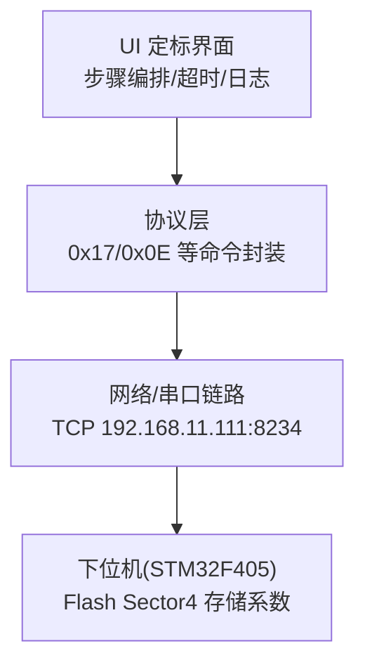
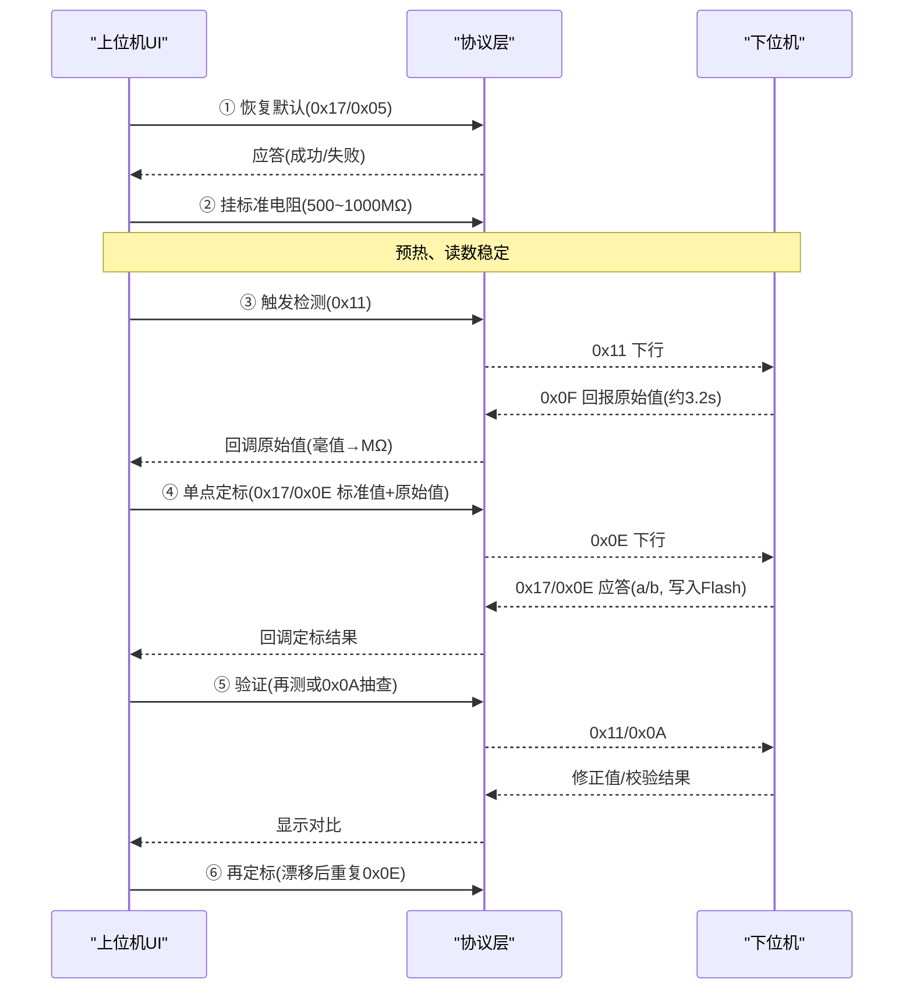
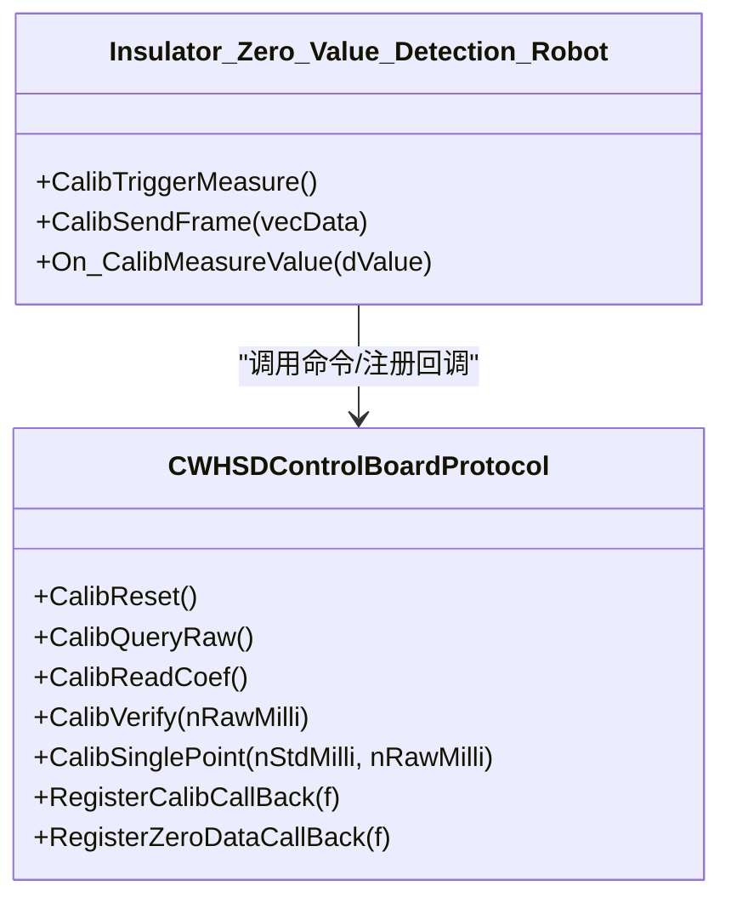

# 单点定标操作流程

<cite>
**本文引用的文件**
- [单点定标协议与流程_V1.0.html](file://Insulator_Zero_Value_Detection_Robot/单点定标协议与流程_V1.0.html)
- [WHSDControlBoradProtocol.cpp](file://Insulator_Zero_Value_Detection_Robot/Protocol/WHSDControlBoradProtocol.cpp)
- [WHSDControlBoradProtocol.h](file://Insulator_Zero_Value_Detection_Robot/Protocol/WHSDControlBoradProtocol.h)
- [Insulator_Zero_Value_Detection_Robot.cpp](file://Insulator_Zero_Value_Detection_Robot/UI/Insulator_Zero_Value_Detection_Robot.cpp)
- [Insulator_Zero_Value_Detection_Robot.h](file://Insulator_Zero_Value_Detection_Robot/UI/Insulator_Zero_Value_Detection_Robot.h)
- [README.md](file://README.md)
</cite>

## 目录
1. [简介](#简介)
2. [项目结构](#项目结构)
3. [核心组件](#核心组件)
4. [架构总览](#架构总览)
5. [详细组件分析](#详细组件分析)
6. [依赖关系分析](#依赖关系分析)
7. [性能注意事项](#性能注意事项)
8. [故障排查指南](#故障排查指南)
9. [结论](#结论)
10. [附录：帧速查表与示例数据](#附录帧速查表与示例数据)

## 简介
本指南面向绝缘子零值检测机器人V2的现场校准人员，提供“单点定标”的完整六步操作手册。内容基于仓库中的协议文档与上位机实现，覆盖通信命令、帧格式、参数设置、应答处理、环境要求、超时与心跳、以及结果验证与最佳实践。目标是在保证测量准确性的前提下，快速完成一次可靠的单点定标。

## 项目结构
本项目包含协议解析、UI交互、设备通信等模块。单点定标相关的关键位置如下：
- 协议与帧封装：位于 Protocol 目录，负责构建/解析 0x17/0x0E 等命令及通用帧格式。
- UI 定标流程：位于 UI 目录，编排六步流程、超时控制、日志记录与状态显示。
- 协议文档：根目录下 HTML 文档定义了帧格式、命令语义、异常码与示例帧。

图表来源
- [Insulator_Zero_Value_Detection_Robot.cpp:894-910](file://Insulator_Zero_Value_Detection_Robot/UI/Insulator_Zero_Value_Detection_Robot.cpp#L894-L910)
- [WHSDControlBoradProtocol.cpp:654-677](file://Insulator_Zero_Value_Detection_Robot/Protocol/WHSDControlBoradProtocol.cpp#L654-L677)
- [单点定标协议与流程_V1.0.html:34-42](file://Insulator_Zero_Value_Detection_Robot/单点定标协议与流程_V1.0.html#L34-L42)

章节来源
- [README.md:1-3](file://README.md#L1-L3)
- [单点定标协议与流程_V1.0.html:34-42](file://Insulator_Zero_Value_Detection_Robot/单点定标协议与流程_V1.0.html#L34-L42)

## 核心组件
- 协议封装类：提供恢复默认、查询原始值、读回系数、补偿验证、单点定标等命令构造与解析。
- 定标应答模型：统一表示 0x17 子命令的应答（子命令、结果、原因、参数1/2）。
- UI 定标流程：驱动六步流程，管理超时定时器、采集多次原始值取平均、下发定标并展示结果。

章节来源
- [WHSDControlBoradProtocol.h:17-52](file://Insulator_Zero_Value_Detection_Robot/Protocol/WHSDControlBoradProtocol.h#L17-L52)
- [WHSDControlBoradProtocol.cpp:582-616](file://Insulator_Zero_Value_Detection_Robot/Protocol/WHSDControlBoradProtocol.cpp#L582-L616)
- [Insulator_Zero_Value_Detection_Robot.h:347-374](file://Insulator_Zero_Value_Detection_Robot/UI/Insulator_Zero_Value_Detection_Robot.h#L347-L374)

## 架构总览
单点定标涉及的上位机与下位机交互时序如下：

图表来源
- [Insulator_Zero_Value_Detection_Robot.cpp:894-910](file://Insulator_Zero_Value_Detection_Robot/UI/Insulator_Zero_Value_Detection_Robot.cpp#L894-L910)
- [WHSDControlBoradProtocol.cpp:321-418](file://Insulator_Zero_Value_Detection_Robot/Protocol/WHSDControlBoradProtocol.cpp#L321-L418)
- [单点定标协议与流程_V1.0.html:107-125](file://Insulator_Zero_Value_Detection_Robot/单点定标协议与流程_V1.0.html#L107-L125)

## 详细组件分析

### 通用帧格式与校验
- 帧头/帧尾：固定帧头 FF FE，帧尾 FD FC。
- 长度：整帧字节数（含自身）。
- 地址：通常为 01。
- 命令字：如 0x11、0x0F、0x17。
- 数据域：N 字节，按协议定义。
- 校验：从帧头到数据域末尾所有字节累加和的低8位。
- 多字节整数：一律大端；X值与定标参数为 int32 毫值。

章节来源
- [单点定标协议与流程_V1.0.html:45-55](file://Insulator_Zero_Value_Detection_Robot/单点定标协议与流程_V1.0.html#L45-L55)
- [WHSDControlBoradProtocol.cpp:654-677](file://Insulator_Zero_Value_Detection_Robot/Protocol/WHSDControlBoradProtocol.cpp#L654-L677)

### 关键通信命令
- 触发检测 0x11（下行）：数据域含传感器序号与命令，用于启动一次测量。
- 测量结果回报 0x0F（上行）：约 3.2 秒后主动上报，X值位于数据域第7~10字节，int32 有符号大端毫值；未校准时为原始值，定标生效后为修正值。
- 恢复默认 0x17/0x05：清空全部校准，通道直通。
- 查询原始值 0x17/0x06：返回最近一次原始X，仅在最近一次 0x0F 回报后 5 秒内有效。
- 单点定标 0x17/0x0E（核心）：下行数据域为“标准值(4B)+实测原始值(4B)”，均为 int32 毫值大端；成功后固件计算系数 a/b 并立即生效、写入 Flash。
- 辅助验证 0x17/0x0C 读回系数、0x17/0x0A 补偿验证：不挂电阻直接校验系数是否生效。

章节来源
- [单点定标协议与流程_V1.0.html:63-105](file://Insulator_Zero_Value_Detection_Robot/单点定标协议与流程_V1.0.html#L63-L105)
- [WHSDControlBoradProtocol.cpp:582-616](file://Insulator_Zero_Value_Detection_Robot/Protocol/WHSDControlBoradProtocol.cpp#L582-L616)

### 定标原理与参数说明
- 需求补偿率 p% = (1 − 实测原始值 / 标准值) × 100。
- 补偿系数 c = p ÷ √实测原始值（b 固定为 0）。
- 安全钳位：p < 0 按 0 计，p > 95% 按 95% 计。
- 定标档零误差，其余各档按 √x 规律自动延伸补偿。
- 毫值：物理值 × 1000 的整数（例如 500 MΩ → 500000）。

章节来源
- [单点定标协议与流程_V1.0.html:57-62](file://Insulator_Zero_Value_Detection_Robot/单点定标协议与流程_V1.0.html#L57-L62)

### 六步校准流程（操作级）
1) 恢复默认
- 目的：清空旧校准，确保后续测量为直通原始值。
- 命令：0x17/0x05。
- 注意：定标前必发。

2) 挂标准电阻与环境准备
- 建议范围：500~1000 MΩ（√x 模型中段最稳）。
- 环境：模块预热，待读数稳定后再测量。

3) 测原始值
- 命令：0x11 触发检测，等待 0x0F 回报（约 3.2 秒）。
- 取值：读取 X 值（毫值转 MΩ），建议连测 2~3 次取平均。
- 复核：5 秒内可用 0x17/0x06 查询原始值进行比对。

4) 下发定标
- 命令：0x17/0x0E，数据域为标准值 + 实测原始值（毫值大端）。
- 应答：成功后回显 a/b（c = a/1000，b=0），校准立即生效并写入 Flash。
- 超时：写 Flash 需 1~2 秒，建议应答超时 ≥ 3 秒。

5) 验证
- 方法一：换其他档电阻实测，对比 0x0F 回报与标准值。
- 方法二：不挂电阻，使用 0x17/0x0A 补偿验证，核对“原始值→校准后值”。
- 方法三：使用 0x17/0x0C 读回系数，确认 Flash 中已存 a/b。

6) 再定标
- 场景：模块漂移后重测该电阻，再次下发 0x0E 即可（后发覆盖先发，无须先清除）。

章节来源
- [单点定标协议与流程_V1.0.html:107-125](file://Insulator_Zero_Value_Detection_Robot/单点定标协议与流程_V1.0.html#L107-L125)
- [Insulator_Zero_Value_Detection_Robot.cpp:1007-1034](file://Insulator_Zero_Value_Detection_Robot/UI/Insulator_Zero_Value_Detection_Robot.cpp#L1007-L1034)

### 通信命令使用方法与帧示例
- 触发检测 0x11（下行）：数据域含传感器序号与命令，用于启动一次测量。
- 测量结果回报 0x0F（上行）：约 3.2 秒后主动上报，X值位于数据域第7~10字节，int32 有符号大端毫值。
- 恢复默认 0x17/0x05：清空全部校准，测量通道直通。
- 查询原始值 0x17/0x06：仅认最近一次 0x0F 回报后 5 秒内的值。
- 单点定标 0x17/0x0E：下行数据域为标准值(4B)+实测原始值(4B)，均为 int32 毫值大端；成功后回显 a/b。
- 辅助验证 0x17/0x0C 读回系数、0x17/0x0A 补偿验证。

章节来源
- [单点定标协议与流程_V1.0.html:63-105](file://Insulator_Zero_Value_Detection_Robot/单点定标协议与流程_V1.0.html#L63-L105)

### 实际测试数据与帧示例
- 500 MΩ / 419.333 MΩ 的定标过程：
  - 下行：0x17/0x0E 携带标准值 500000（毫值）与原始值 419333（毫值）。
  - 应答：成功，回显 a=788（c=0.788）、b=0；校准立即生效并写入 Flash。
  - 内部核算：p% = (1 − 419.333/500) × 100 = 16.1334%；c = 16.1334 ÷ √419.333 ≈ 0.788。
- 其他示例：
  - 500 / 415 的定标帧。
  - 1000 / 788 的定标帧。
  - 补偿验证 0x0A 以原始值 788 MΩ 为例。

章节来源
- [单点定标协议与流程_V1.0.html:79-92](file://Insulator_Zero_Value_Detection_Robot/单点定标协议与流程_V1.0.html#L79-L92)
- [单点定标协议与流程_V1.0.html:127-138](file://Insulator_Zero_Value_Detection_Robot/单点定标协议与流程_V1.0.html#L127-L138)

### 错误码与应答处理
- 0x0E 应答原因：
  - 0x01：原始值已超时（0x06 查询时距上次 0x0F 超 5 秒）。
  - 0x04：Flash 写失败（重发；反复失败检查 Flash）。
  - 0x05：参数长度/格式错误（必须正好 8 字节）。
  - 0x09：参数非法（标准值或原始值 ≤ 0，或原始值 ≥ 标准值；勿强行定标）。

章节来源
- [单点定标协议与流程_V1.0.html:93-99](file://Insulator_Zero_Value_Detection_Robot/单点定标协议与流程_V1.0.html#L93-L99)
- [WHSDControlBoradProtocol.h:31-49](file://Insulator_Zero_Value_Detection_Robot/Protocol/WHSDControlBoradProtocol.h#L31-L49)

### UI 定标流程与状态管理
- 步骤编排：通过 UI 状态机推进六步流程，每步完成后解锁下一步。
- 超时控制：单次等待下位机应答/回报使用定时器，避免阻塞。
- 数据采集：多次触发 0x11，收集 0x0F 回报的原始值，取平均作为定标输入。
- 结果展示：显示系数 c、步骤状态与日志。

章节来源
- [Insulator_Zero_Value_Detection_Robot.cpp:873-892](file://Insulator_Zero_Value_Detection_Robot/UI/Insulator_Zero_Value_Detection_Robot.cpp#L873-L892)
- [Insulator_Zero_Value_Detection_Robot.cpp:1007-1034](file://Insulator_Zero_Value_Detection_Robot/UI/Insulator_Zero_Value_Detection_Robot.cpp#L1007-L1034)
- [Insulator_Zero_Value_Detection_Robot.h:347-374](file://Insulator_Zero_Value_Detection_Robot/UI/Insulator_Zero_Value_Detection_Robot.h#L347-L374)

## 依赖关系分析
- UI 依赖协议层提供的命令封装函数（CalibReset、CalibQueryRaw、CalibReadCoef、CalibVerify、CalibSinglePoint）。
- 协议层负责帧组装、校验、解析与回调（测量结果、校准应答）。
- 网络/串口链路承载 TCP 通信（静态 IP 192.168.11.111，端口 8234）。
- 下位机将系数写入 Flash Sector4，掉电保存。

图表来源
- [WHSDControlBoradProtocol.h:256-287](file://Insulator_Zero_Value_Detection_Robot/Protocol/WHSDControlBoradProtocol.h#L256-L287)
- [Insulator_Zero_Value_Detection_Robot.cpp:894-910](file://Insulator_Zero_Value_Detection_Robot/UI/Insulator_Zero_Value_Detection_Robot.cpp#L894-L910)

章节来源
- [单点定标协议与流程_V1.0.html:34-42](file://Insulator_Zero_Value_Detection_Robot/单点定标协议与流程_V1.0.html#L34-L42)
- [WHSDControlBoradProtocol.cpp:654-677](file://Insulator_Zero_Value_Detection_Robot/Protocol/WHSDControlBoradProtocol.cpp#L654-L677)

## 性能注意事项
- 心跳保持：全程保持心跳，断链 30 秒会触发舵机归零。
- 超时设置：0x0E 写 Flash 需 1~2 秒，应答超时建议 ≥ 3 秒。
- 读数稳定：测量前确保模块预热，读数稳定后再采集原始值。
- 帧完整性：帧尾 FD FC 后勿多发字节，避免解析错乱。
- 同环境同批次：尽量在同一环境与批次完成测量与验证，避免日间漂移污染系数。

章节来源
- [单点定标协议与流程_V1.0.html:125-125](file://Insulator_Zero_Value_Detection_Robot/单点定标协议与流程_V1.0.html#L125-L125)
- [单点定标协议与流程_V1.0.html:140-148](file://Insulator_Zero_Value_Detection_Robot/单点定标协议与流程_V1.0.html#L140-L148)

## 故障排查指南
- 0x06 应答原因 0x01：距上次 0x0F 超 5 秒；重新触发检测后立即查询。
- 0x0E 应答原因 0x09：标准值/原始值 ≤ 0，或原始值 ≥ 标准值；检查接线与模块读数，勿强行定标。
- 0x0E 应答原因 0x05：参数不是 8 字节；检查组帧（标准值 4B + 原始值 4B，毫值大端）。
- 定标后各档整体偏移：模块日间漂移；同环境重测基准档，再发一次 0x0E。
- 0x0E 应答慢（1~2 秒）：正常现象（需擦写 Flash Sector4），超时设 ≥ 3 秒。

章节来源
- [单点定标协议与流程_V1.0.html:140-148](file://Insulator_Zero_Value_Detection_Robot/单点定标协议与流程_V1.0.html#L140-L148)

## 结论
单点定标通过“恢复默认—挂标准电阻—测原始值—下发定标—验证—再定标”的六步流程，结合稳定的通信命令与严格的帧格式校验，可在现场快速完成高精度校准。遵循环境要求、心跳与超时策略，配合 0x0A/0x0C 等辅助验证手段，可显著提升校准可靠性与可追溯性。

## 附录：帧速查表与示例数据
- 触发检测 0x11：FF FE 0C 01 11 00 01 00 00 1C FD FC
- 恢复默认 0x05：FF FE 09 01 17 05 23 FD FC
- 查询原始值 0x06：FF FE 09 01 17 06 24 FD FC
- 单点定标 0x0E（500 / 419.333）：FF FE 11 01 17 0E 00 07 A1 20 00 06 66 05 6D FD FC
- 单点定标 0x0E（500 / 415）：FF FE 11 01 17 0E 00 07 A1 20 00 06 55 18 6F FD FC
- 单点定标 0x0E（1000 / 788）：FF FE 11 01 17 0E 00 0F 42 40 00 0C 06 20 F7 FD FC
- 读回系数 0x0C：FF FE 09 01 17 0C 2A FD FC
- 补偿验证 0x0A（原始值 788 MΩ）：FF FE 0D 01 17 0A 00 0C 06 20 5E FD FC

章节来源
- [单点定标协议与流程_V1.0.html:127-138](file://Insulator_Zero_Value_Detection_Robot/单点定标协议与流程_V1.0.html#L127-L138)