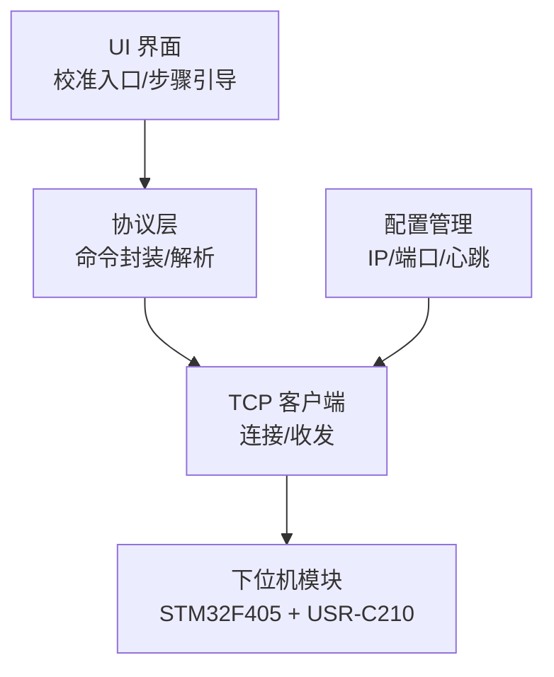
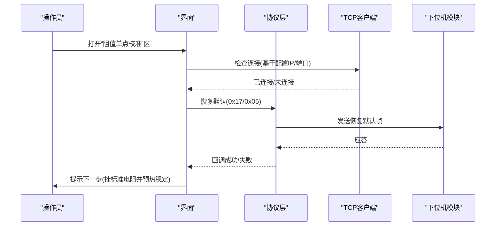
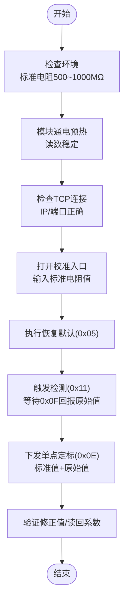
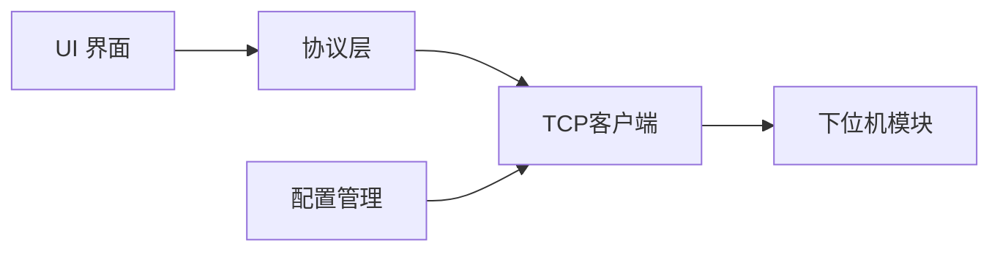

# 校准前准备

<cite>
**本文引用的文件**
- [单点定标协议与流程_V1.0.html](file://Insulator_Zero_Value_Detection_Robot/单点定标协议与流程_V1.0.html)
- [操作说明书.md](file://操作说明书.md)
- [Insulator_Zero_Value_Detection_Robot.cpp](file://Insulator_Zero_Value_Detection_Robot/UI/Insulator_Zero_Value_Detection_Robot.cpp)
- [Insulator_Zero_Value_Detection_Robot.ui](file://Insulator_Zero_Value_Detection_Robot/UI/Insulator_Zero_Value_Detection_Robot.ui)
- [WHSDControlBoradProtocol.cpp](file://Insulator_Zero_Value_Detection_Robot/Protocol/WHSDControlBoradProtocol.cpp)
- [TcpClient.cpp](file://Insulator_Zero_Value_Detection_Robot/DeviceCom/TcpClient.cpp)
- [ConfigManager.cpp](file://Insulator_Zero_Value_Detection_Robot/Config/ConfigManager.cpp)
</cite>

## 目录
1. [简介](#简介)
2. [项目结构](#项目结构)
3. [核心组件](#核心组件)
4. [架构总览](#架构总览)
5. [详细组件分析](#详细组件分析)
6. [依赖关系分析](#依赖关系分析)
7. [性能注意事项](#性能注意事项)
8. [故障排查指南](#故障排查指南)
9. [结论](#结论)
10. [附录：校准前准备清单](#附录校准前准备清单)

## 简介
本指南面向绝缘子零值检测机器人的“阻值单点校准”场景，聚焦校准前的准备工作。内容涵盖标准电阻选择原则、环境要求（含预热与稳定性）、设备连接检查（TCP通信建立）、界面操作准备（打开校准入口、确认设备状态），并提供完整准备清单与常见问题预防措施，确保校准过程顺利执行。

## 项目结构
本项目采用分层组织：UI层负责人机交互与校准流程引导；协议层封装与下位机的帧格式、命令组装与解析；通信层提供TCP客户端能力；配置层管理设备IP、端口、心跳等参数；另有协议文档明确校准流程与网络参数。

图表来源
- [Insulator_Zero_Value_Detection_Robot.cpp:225-228](file://Insulator_Zero_Value_Detection_Robot/UI/Insulator_Zero_Value_Detection_Robot.cpp#L225-L228)
- [WHSDControlBoradProtocol.cpp:582-616](file://Insulator_Zero_Value_Detection_Robot/Protocol/WHSDControlBoradProtocol.cpp#L582-L616)
- [TcpClient.cpp:59-86](file://Insulator_Zero_Value_Detection_Robot/DeviceCom/TcpClient.cpp#L59-L86)
- [ConfigManager.cpp:16-51](file://Insulator_Zero_Value_Detection_Robot/Config/ConfigManager.cpp#L16-L51)
- [单点定标协议与流程_V1.0.html:34-42](file://Insulator_Zero_Value_Detection_Robot/单点定标协议与流程_V1.0.html#L34-L42)

章节来源
- [Insulator_Zero_Value_Detection_Robot.cpp:225-228](file://Insulator_Zero_Value_Detection_Robot/UI/Insulator_Zero_Value_Detection_Robot.cpp#L225-L228)
- [单点定标协议与流程_V1.0.html:34-42](file://Insulator_Zero_Value_Detection_Robot/单点定标协议与流程_V1.0.html#L34-L42)

## 核心组件
- 校准协议与流程：定义单点定标的原理、命令字、帧格式与时序，明确标准电阻范围与测量时序。
- 界面与流程控制：提供校准入口、步骤按钮、超时等待、日志输出与状态显示。
- 协议封装：将标准值/原始值按大端毫值拼装为0x17/0x0E命令，并处理应答回调。
- TCP通信：负责建立到模块的TCP连接、发送/接收数据、断链重连与超时处理。
- 配置管理：读取/写入设备IP、端口、心跳周期等参数，影响通信链路。

章节来源
- [单点定标协议与流程_V1.0.html:57-125](file://Insulator_Zero_Value_Detection_Robot/单点定标协议与流程_V1.0.html#L57-L125)
- [Insulator_Zero_Value_Detection_Robot.cpp:873-1313](file://Insulator_Zero_Value_Detection_Robot/UI/Insulator_Zero_Value_Detection_Robot.cpp#L873-L1313)
- [WHSDControlBoradProtocol.cpp:582-616](file://Insulator_Zero_Value_Detection_Robot/Protocol/WHSDControlBoradProtocol.cpp#L582-L616)
- [TcpClient.cpp:59-86](file://Insulator_Zero_Value_Detection_Robot/DeviceCom/TcpClient.cpp#L59-L86)
- [ConfigManager.cpp:16-51](file://Insulator_Zero_Value_Detection_Robot/Config/ConfigManager.cpp#L16-L51)

## 架构总览
校准前准备涉及“环境就绪—设备连接—界面就绪—参数校验”四个阶段，随后进入正式校准流程。

图表来源
- [Insulator_Zero_Value_Detection_Robot.cpp:941-977](file://Insulator_Zero_Value_Detection_Robot/UI/Insulator_Zero_Value_Detection_Robot.cpp#L941-L977)
- [WHSDControlBoradProtocol.cpp:582-586](file://Insulator_Zero_Value_Detection_Robot/Protocol/WHSDControlBoradProtocol.cpp#L582-L586)
- [单点定标协议与流程_V1.0.html:107-125](file://Insulator_Zero_Value_Detection_Robot/单点定标协议与流程_V1.0.html#L107-L125)

## 详细组件分析

### 标准电阻选择原则
- 推荐范围：建议使用500~1000 MΩ档的标准电阻进行校准，该区间位于√x模型中段，稳定性最佳。
- 原因说明：固件采用√x补偿模型，中段取值可获得更稳健的系数计算结果。
- 输入校验：界面支持输入标准电阻值（单位MΩ），内部会转换为毫值参与后续计算。

章节来源
- [单点定标协议与流程_V1.0.html:107-112](file://Insulator_Zero_Value_Detection_Robot/单点定标协议与流程_V1.0.html#L107-L112)
- [Insulator_Zero_Value_Detection_Robot.ui:6076-6108](file://Insulator_Zero_Value_Detection_Robot/UI/Insulator_Zero_Value_Detection_Robot.ui#L6076-L6108)
- [Insulator_Zero_Value_Detection_Robot.cpp:913-921](file://Insulator_Zero_Value_Detection_Robot/UI/Insulator_Zero_Value_Detection_Robot.cpp#L913-L921)

### 环境要求（预热与稳定性）
- 模块预热：接入标准电阻后需通电预热，待读数稳定再进行测量。
- 温度稳定性：建议在同一环境、同一批次完成测原始值与验证，避免日间漂移污染系数。
- 测量时机：触发检测后约3.2秒回报原始值，建议在稳定环境下连续测量多次取平均。

章节来源
- [单点定标协议与流程_V1.0.html:107-115](file://Insulator_Zero_Value_Detection_Robot/单点定标协议与流程_V1.0.html#L107-L115)
- [操作说明书.md:362-367](file://操作说明书.md#L362-L367)

### 设备连接检查（TCP通信）
- 网络参数：模块通过USR-C210以太网模组以TCP方式通信，静态IP与端口由配置决定。
- 连接流程：启动时初始化Winsock，创建非阻塞套接字，尝试连接目标IP/端口；连接成功后开启收发线程。
- 断链重连：连接断开或错误时自动置为未连接，并在后台循环中周期性重试。
- 心跳机制：协议层定时发送心跳，保证链路活跃；若长时间无心跳可能触发安全动作（如舵机归零）。

章节来源
- [单点定标协议与流程_V1.0.html:34-42](file://Insulator_Zero_Value_Detection_Robot/单点定标协议与流程_V1.0.html#L34-L42)
- [TcpClient.cpp:59-86](file://Insulator_Zero_Value_Detection_Robot/DeviceCom/TcpClient.cpp#L59-L86)
- [TcpClient.cpp:163-236](file://Insulator_Zero_Value_Detection_Robot/DeviceCom/TcpClient.cpp#L163-L236)
- [WHSDControlBoradProtocol.cpp:769-800](file://Insulator_Zero_Value_Detection_Robot/Protocol/WHSDControlBoradProtocol.cpp#L769-L800)
- [ConfigManager.cpp:16-51](file://Insulator_Zero_Value_Detection_Robot/Config/ConfigManager.cpp#L16-L51)

### 界面操作准备
- 入口位置：在“系统设置”页面右侧找到“阻值单点校准”区。
- 参数输入：在“标准电阻值(MΩ)”输入框填入标准电阻标称值（建议500~1000 MΩ）。
- 设备状态：确认控制板已连接（界面显示“已连接”），否则先修复TCP连接。
- 步骤顺序：校准步骤自上而下依次执行，上一步未完成则下一步不可操作。

章节来源
- [操作说明书.md:350-367](file://操作说明书.md#L350-L367)
- [Insulator_Zero_Value_Detection_Robot.ui:6064-6129](file://Insulator_Zero_Value_Detection_Robot/UI/Insulator_Zero_Value_Detection_Robot.ui#L6064-L6129)
- [Insulator_Zero_Value_Detection_Robot.cpp:635-640](file://Insulator_Zero_Value_Detection_Robot/UI/Insulator_Zero_Value_Detection_Robot.cpp#L635-L640)

### 校准前准备流程图

图表来源
- [单点定标协议与流程_V1.0.html:107-125](file://Insulator_Zero_Value_Detection_Robot/单点定标协议与流程_V1.0.html#L107-L125)
- [Insulator_Zero_Value_Detection_Robot.cpp:894-910](file://Insulator_Zero_Value_Detection_Robot/UI/Insulator_Zero_Value_Detection_Robot.cpp#L894-L910)
- [WHSDControlBoradProtocol.cpp:582-616](file://Insulator_Zero_Value_Detection_Robot/Protocol/WHSDControlBoradProtocol.cpp#L582-L616)

## 依赖关系分析
- UI依赖协议层生成命令帧，并通过TCP客户端发送到下位机。
- 协议层依赖配置层的IP/端口/心跳参数，确保通信链路可用。
- TCP客户端依赖操作系统网络栈，具备断链重连与超时处理。
- 校准流程严格遵循协议文档定义的命令序列与时序约束。

图表来源
- [Insulator_Zero_Value_Detection_Robot.cpp:225-228](file://Insulator_Zero_Value_Detection_Robot/UI/Insulator_Zero_Value_Detection_Robot.cpp#L225-L228)
- [WHSDControlBoradProtocol.cpp:582-616](file://Insulator_Zero_Value_Detection_Robot/Protocol/WHSDControlBoradProtocol.cpp#L582-L616)
- [TcpClient.cpp:59-86](file://Insulator_Zero_Value_Detection_Robot/DeviceCom/TcpClient.cpp#L59-L86)
- [ConfigManager.cpp:16-51](file://Insulator_Zero_Value_Detection_Robot/Config/ConfigManager.cpp#L16-L51)

章节来源
- [Insulator_Zero_Value_Detection_Robot.cpp:225-228](file://Insulator_Zero_Value_Detection_Robot/UI/Insulator_Zero_Value_Detection_Robot.cpp#L225-L228)
- [WHSDControlBoradProtocol.cpp:582-616](file://Insulator_Zero_Value_Detection_Robot/Protocol/WHSDControlBoradProtocol.cpp#L582-L616)
- [TcpClient.cpp:59-86](file://Insulator_Zero_Value_Detection_Robot/DeviceCom/TcpClient.cpp#L59-L86)
- [ConfigManager.cpp:16-51](file://Insulator_Zero_Value_Detection_Robot/Config/ConfigManager.cpp#L16-L51)

## 性能注意事项
- 0x0E写Flash耗时约1~2秒，上位机应答超时应设置为≥3秒，避免误判失败。
- 0x0F回报约3.2秒，建议等待时间≥5秒以确保收到原始值。
- 保持心跳持续发送，断链可能导致安全动作（如舵机归零）。
- 尽量在同一环境与批次内完成测原始值与验证，减少漂移影响。

章节来源
- [单点定标协议与流程_V1.0.html:107-125](file://Insulator_Zero_Value_Detection_Robot/单点定标协议与流程_V1.0.html#L107-L125)
- [Insulator_Zero_Value_Detection_Robot.cpp:1267-1313](file://Insulator_Zero_Value_Detection_Robot/UI/Insulator_Zero_Value_Detection_Robot.cpp#L1267-L1313)
- [WHSDControlBoradProtocol.cpp:769-800](file://Insulator_Zero_Value_Detection_Robot/Protocol/WHSDControlBoradProtocol.cpp#L769-L800)

## 故障排查指南
- 0x06查询原始值返回原因01：距上次0x0F回报超5秒，需重新触发检测后立即查询。
- 0x0E单点定标返回原因09：标准值或原始值≤0，或原始值≥标准值（负补偿需求），应检查接线与模块读数，勿强行定标。
- 0x0E返回原因05：参数长度/格式错误，需检查组帧（标准值4B+原始值4B，毫值大端）。
- 0x0E应答慢：正常现象（擦写Flash需1~2秒），请设置超时≥3秒。
- 连接失败：检查配置中的IP/端口是否正确，确认TCP客户端已启动并处于运行状态。

章节来源
- [单点定标协议与流程_V1.0.html:140-148](file://Insulator_Zero_Value_Detection_Robot/单点定标协议与流程_V1.0.html#L140-L148)
- [Insulator_Zero_Value_Detection_Robot.cpp:924-939](file://Insulator_Zero_Value_Detection_Robot/UI/Insulator_Zero_Value_Detection_Robot.cpp#L924-L939)
- [TcpClient.cpp:163-236](file://Insulator_Zero_Value_Detection_Robot/DeviceCom/TcpClient.cpp#L163-L236)

## 结论
校准前准备的核心在于：选用合适的标准电阻（500~1000 MΩ）、确保模块预热与环境稳定、建立可靠的TCP通信、在界面中正确输入参数并按步骤执行。遵循上述准备要点与故障排查方法，可显著提升校准成功率与测量一致性。

## 附录：校准前准备清单
- 标准电阻
  - 选择500~1000 MΩ档的标准电阻，确保精度与稳定性。
  - 在界面“标准电阻值(MΩ)”输入框填入标称值。
- 环境要求
  - 模块通电预热，待读数稳定后再测量。
  - 尽量在同一环境与批次内完成测原始值与验证。
- 设备连接
  - 检查配置中的设备IP与端口是否正确。
  - 确认TCP客户端已启动且显示“已连接”。
  - 保持心跳持续发送，避免断链触发安全动作。
- 界面操作
  - 进入“系统设置”页面右侧“阻值单点校准”区。
  - 点击“执行”完成恢复默认(0x05)。
  - 点击“执行”测原始值（自动连测3次取平均）。
  - 点击“执行”下发单点定标(0x0E)，等待应答。
  - 可选：使用辅助命令验证（读回系数/补偿验证）。
- 常见预防
  - 0x0E写Flash需1~2秒，设置超时≥3秒。
  - 0x0F回报约3.2秒，等待时间≥5秒。
  - 出现原因码09/05/01时，按指南逐项排查。

章节来源
- [操作说明书.md:350-374](file://操作说明书.md#L350-L374)
- [单点定标协议与流程_V1.0.html:107-148](file://Insulator_Zero_Value_Detection_Robot/单点定标协议与流程_V1.0.html#L107-L148)
- [Insulator_Zero_Value_Detection_Robot.cpp:873-1313](file://Insulator_Zero_Value_Detection_Robot/UI/Insulator_Zero_Value_Detection_Robot.cpp#L873-L1313)
- [WHSDControlBoradProtocol.cpp:582-616](file://Insulator_Zero_Value_Detection_Robot/Protocol/WHSDControlBoradProtocol.cpp#L582-L616)
- [TcpClient.cpp:59-86](file://Insulator_Zero_Value_Detection_Robot/DeviceCom/TcpClient.cpp#L59-L86)
- [ConfigManager.cpp:16-51](file://Insulator_Zero_Value_Detection_Robot/Config/ConfigManager.cpp#L16-L51)