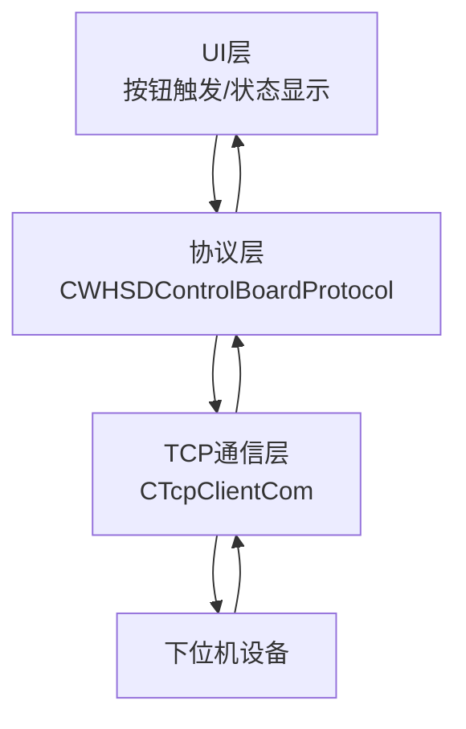
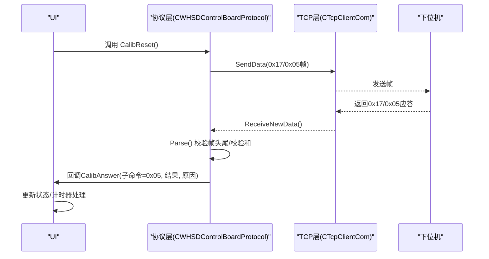
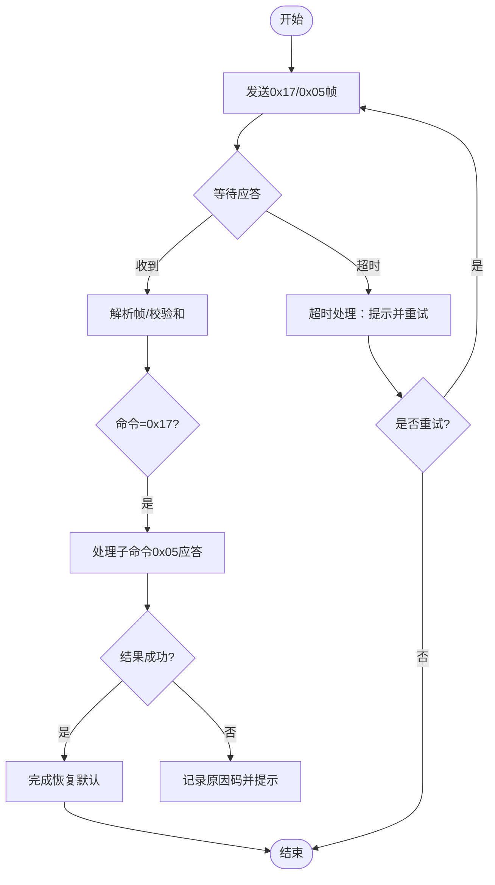
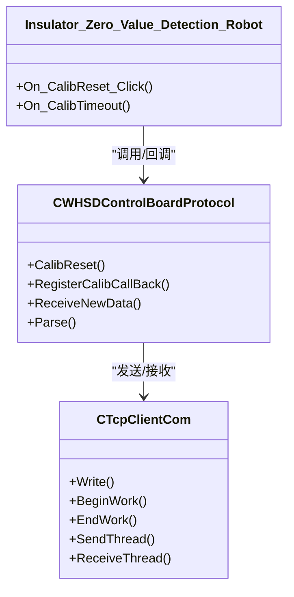

# 第一步：恢复默认参数

<cite>
**本文引用的文件**
- [WHSDControlBoradProtocol.cpp](file://Insulator_Zero_Value_Detection_Robot/Protocol/WHSDControlBoradProtocol.cpp)
- [WHSDControlBoradProtocol.h](file://Insulator_Zero_Value_Detection_Robot/Protocol/WHSDControlBoradProtocol.h)
- [TcpClient.cpp](file://Insulator_Zero_Value_Detection_Robot/DeviceCom/TcpClient.cpp)
- [TcpClient.h](file://Insulator_Zero_Value_Detection_Robot/DeviceCom/TcpClient.h)
- [单点定标协议与流程_V1.0.html](file://Insulator_Zero_Value_Detection_Robot/单点定标协议与流程_V1.0.html)
- [Insulator_Zero_Value_Detection_Robot.cpp](file://Insulator_Zero_Value_Detection_Robot/UI/Insulator_Zero_Value_Detection_Robot.cpp)
- [Insulator_Zero_Value_Detection_Robot.h](file://Insulator_Zero_Value_Detection_Robot/UI/Insulator_Zero_Value_Detection_Robot.h)
</cite>

## 目录
1. [简介](#简介)
2. [项目结构](#项目结构)
3. [核心组件](#核心组件)
4. [架构总览](#架构总览)
5. [详细组件分析](#详细组件分析)
6. [依赖关系分析](#依赖关系分析)
7. [性能考虑](#性能考虑)
8. [故障排查指南](#故障排查指南)
9. [结论](#结论)
10. [附录](#附录)

## 简介
本章节聚焦单点定标的第一步操作：恢复默认参数。该步骤通过下发 0x17/0x05 命令，清空设备内部全部校准数据（两点系数、折点表、公式系数），使测量通道直通（0x0F 直接回报原始值）。此操作是后续“测原始值—下发定标—验证”流程的前置条件，确保定标结果不受历史校准影响。

## 项目结构
围绕“恢复默认参数”的关键代码分布在以下位置：
- 协议封装与帧构造：Protocol/WHSDControlBoradProtocol.*
- TCP 通信与收发线程：DeviceCom/TcpClient.*
- UI 流程控制与超时处理：UI/Insulator_Zero_Value_Detection_Robot.*
- 协议文档与帧示例：单点定标协议与流程_V1.0.html

图表来源
- [WHSDControlBoradProtocol.cpp:179-226](file://Insulator_Zero_Value_Detection_Robot/Protocol/WHSDControlBoradProtocol.cpp#L179-L226)
- [TcpClient.cpp:238-382](file://Insulator_Zero_Value_Detection_Robot/DeviceCom/TcpClient.cpp#L238-L382)
- [Insulator_Zero_Value_Detection_Robot.cpp:1002-1292](file://Insulator_Zero_Value_Detection_Robot/UI/Insulator_Zero_Value_Detection_Robot.cpp#L1002-L1292)

章节来源
- [WHSDControlBoradProtocol.cpp:179-226](file://Insulator_Zero_Value_Detection_Robot/Protocol/WHSDControlBoradProtocol.cpp#L179-L226)
- [TcpClient.cpp:238-382](file://Insulator_Zero_Value_Detection_Robot/DeviceCom/TcpClient.cpp#L238-L382)
- [Insulator_Zero_Value_Detection_Robot.cpp:1002-1292](file://Insulator_Zero_Value_Detection_Robot/UI/Insulator_Zero_Value_Detection_Robot.cpp#L1002-L1292)

## 核心组件
- CWHSDControlBoardProtocol：负责协议帧的构造、解析与回调分发；提供 CalibReset() 生成 0x17/0x05 命令帧。
- CTcpClientCom：负责 TCP 连接、发送队列、接收线程与错误重连；将数据透传给上层协议解析。
- UI 逻辑：调用 CalibReset() 并等待 0x17/0x05 应答，处理超时与失败原因，驱动下一步流程。

章节来源
- [WHSDControlBoradProtocol.h:256-260](file://Insulator_Zero_Value_Detection_Robot/Protocol/WHSDControlBoradProtocol.h#L256-L260)
- [WHSDControlBoradProtocol.cpp:582-586](file://Insulator_Zero_Value_Detection_Robot/Protocol/WHSDControlBoradProtocol.cpp#L582-L586)
- [TcpClient.h:8-46](file://Insulator_Zero_Value_Detection_Robot/DeviceCom/TcpClient.h#L8-L46)
- [TcpClient.cpp:43-87](file://Insulator_Zero_Value_Detection_Robot/DeviceCom/TcpClient.cpp#L43-L87)
- [Insulator_Zero_Value_Detection_Robot.h:108-115](file://Insulator_Zero_Value_Detection_Robot/UI/Insulator_Zero_Value_Detection_Robot.h#L108-L115)

## 架构总览
恢复默认参数的端到端流程如下：
- UI 触发“恢复默认”按钮，进入等待应答状态。
- 协议层构造 0x17/0x05 帧并通过 TCP 发送。
- 设备收到后执行恢复默认，返回 0x17/0x05 应答。
- 协议层解析应答，调用注册回调通知 UI。
- UI 根据应答结果更新界面并推进或终止流程。

图表来源
- [WHSDControlBoradProtocol.cpp:582-586](file://Insulator_Zero_Value_Detection_Robot/Protocol/WHSDControlBoradProtocol.cpp#L582-L586)
- [WHSDControlBoradProtocol.cpp:213-226](file://Insulator_Zero_Value_Detection_Robot/Protocol/WHSDControlBoradProtocol.cpp#L213-L226)
- [WHSDControlBoradProtocol.cpp:228-444](file://Insulator_Zero_Value_Detection_Robot/Protocol/WHSDControlBoradProtocol.cpp#L228-L444)
- [TcpClient.cpp:238-382](file://Insulator_Zero_Value_Detection_Robot/DeviceCom/TcpClient.cpp#L238-L382)
- [Insulator_Zero_Value_Detection_Robot.cpp:1180-1188](file://Insulator_Zero_Value_Detection_Robot/UI/Insulator_Zero_Value_Detection_Robot.cpp#L1180-L1188)

## 详细组件分析

### 0x17/0x05 命令的作用与效果
- 作用：清空全部校准数据（两点系数、折点表、公式系数），恢复测量通道直通（0x0F 直接回报原始值）。
- 效果：确保后续定标基于干净基线，避免历史校准干扰。
- 适用时机：每次单点定标前必发。

章节来源
- [WHSDControlBoradProtocol.h:256-260](file://Insulator_Zero_Value_Detection_Robot/Protocol/WHSDControlBoradProtocol.h#L256-L260)
- [单点定标协议与流程_V1.0.html:71-74](file://Insulator_Zero_Value_Detection_Robot/单点定标协议与流程_V1.0.html#L71-L74)

### 帧格式构造与参数设置
- 通用帧格式：帧头 FF FE，长度 LEN（整帧字节数），地址 01，命令字 CMD，数据域 N 字节，校验 CHK（从帧头到数据域末尾累加和的低8位），帧尾 FD FC。
- 0x17/0x05 帧：命令字 0x17，数据域为子命令 0x05；长度与校验由 GetCmdData() 自动计算。
- 多字节整数一律大端；X 值与定标参数均为 int32 毫值。

章节来源
- [单点定标协议与流程_V1.0.html:45-55](file://Insulator_Zero_Value_Detection_Robot/单点定标协议与流程_V1.0.html#L45-L55)
- [WHSDControlBoradProtocol.cpp:654-677](file://Insulator_Zero_Value_Detection_Robot/Protocol/WHSDControlBoradProtocol.cpp#L654-L677)
- [WHSDControlBoradProtocol.cpp:582-586](file://Insulator_Zero_Value_Detection_Robot/Protocol/WHSDControlBoradProtocol.cpp#L582-L586)

### 命令下发后的应答处理机制
- 解析流程：ReceiveNewData() 将数据追加至缓冲区，Parse() 查找帧头/帧尾并校验和，提取命令字与数据域，按命令分发处理。
- 0x17/0x05 应答：数据域包含子命令、结果、原因及可选参数；UI 通过注册的 Calib 回调获取并处理。
- 超时处理：UI 在等待阶段使用定时器，若超时则提示“应答超时”，并引导检查链路或重试。
- 错误重试：根据原因码判断是否可重试（如 Flash 写失败等），必要时提示用户重新执行。

图表来源
- [WHSDControlBoradProtocol.cpp:213-226](file://Insulator_Zero_Value_Detection_Robot/Protocol/WHSDControlBoradProtocol.cpp#L213-L226)
- [WHSDControlBoradProtocol.cpp:228-444](file://Insulator_Zero_Value_Detection_Robot/Protocol/WHSDControlBoradProtocol.cpp#L228-L444)
- [Insulator_Zero_Value_Detection_Robot.cpp:1267-1292](file://Insulator_Zero_Value_Detection_Robot/UI/Insulator_Zero_Value_Detection_Robot.cpp#L1267-L1292)

章节来源
- [WHSDControlBoradProtocol.cpp:213-226](file://Insulator_Zero_Value_Detection_Robot/Protocol/WHSDControlBoradProtocol.cpp#L213-L226)
- [WHSDControlBoradProtocol.cpp:228-444](file://Insulator_Zero_Value_Detection_Robot/Protocol/WHSDControlBoradProtocol.cpp#L228-L444)
- [Insulator_Zero_Value_Detection_Robot.cpp:1267-1292](file://Insulator_Zero_Value_Detection_Robot/UI/Insulator_Zero_Value_Detection_Robot.cpp#L1267-L1292)

### 恢复默认参数的具体效果
- 清除之前的校准数据：两点系数、折点表、公式系数均被清空。
- 重置测量参数：测量通道直通，0x0F 直接回报原始值，不再应用任何补偿。
- 为后续定标提供干净基线：确保单点定标计算的系数仅基于当前标准电阻与实测原始值。

章节来源
- [WHSDControlBoradProtocol.h:256-260](file://Insulator_Zero_Value_Detection_Robot/Protocol/WHSDControlBoradProtocol.h#L256-L260)
- [单点定标协议与流程_V1.0.html:71-74](file://Insulator_Zero_Value_Detection_Robot/单点定标协议与流程_V1.0.html#L71-L74)

### 完整操作流程与日志示例
- 操作步骤：
  1) 点击“恢复默认”按钮，UI 进入等待应答状态。
  2) 协议层构造 0x17/0x05 帧并通过 TCP 发送。
  3) 设备返回 0x17/0x05 应答，UI 根据结果更新状态。
  4) 若成功，继续下一步“测原始值”；若失败，根据原因码提示并决定是否重试。
- 通信日志示例（HEX）：
  - 下行：FF FE 09 01 17 05 23 FD FC
  - 上行：17 05 01 00 + k/b 回显（k=1, b=0）
- 参考路径：
  - [帧示例与说明:71-74](file://Insulator_Zero_Value_Detection_Robot/单点定标协议与流程_V1.0.html#L71-L74)
  - [协议构造函数:582-586](file://Insulator_Zero_Value_Detection_Robot/Protocol/WHSDControlBoradProtocol.cpp#L582-L586)
  - [UI 回调处理:1180-1188](file://Insulator_Zero_Value_Detection_Robot/UI/Insulator_Zero_Value_Detection_Robot.cpp#L1180-L1188)

章节来源
- [单点定标协议与流程_V1.0.html:71-74](file://Insulator_Zero_Value_Detection_Robot/单点定标协议与流程_V1.0.html#L71-L74)
- [WHSDControlBoradProtocol.cpp:582-586](file://Insulator_Zero_Value_Detection_Robot/Protocol/WHSDControlBoradProtocol.cpp#L582-L586)
- [Insulator_Zero_Value_Detection_Robot.cpp:1180-1188](file://Insulator_Zero_Value_Detection_Robot/UI/Insulator_Zero_Value_Detection_Robot.cpp#L1180-L1188)

## 依赖关系分析
- UI 依赖协议层提供的 CalibReset() 与 Calib 回调。
- 协议层依赖 TCP 层进行数据发送与接收。
- TCP 层依赖 Winsock 实现连接、发送与接收，具备超时与错误处理。
- 协议层与 UI 层通过回调解耦，便于扩展与测试。

图表来源
- [Insulator_Zero_Value_Detection_Robot.h:108-115](file://Insulator_Zero_Value_Detection_Robot/UI/Insulator_Zero_Value_Detection_Robot.h#L108-L115)
- [WHSDControlBoradProtocol.h:189-356](file://Insulator_Zero_Value_Detection_Robot/Protocol/WHSDControlBoradProtocol.h#L189-L356)
- [TcpClient.h:8-46](file://Insulator_Zero_Value_Detection_Robot/DeviceCom/TcpClient.h#L8-L46)

章节来源
- [Insulator_Zero_Value_Detection_Robot.h:108-115](file://Insulator_Zero_Value_Detection_Robot/UI/Insulator_Zero_Value_Detection_Robot.h#L108-L115)
- [WHSDControlBoradProtocol.h:189-356](file://Insulator_Zero_Value_Detection_Robot/Protocol/WHSDControlBoradProtocol.h#L189-L356)
- [TcpClient.h:8-46](file://Insulator_Zero_Value_Detection_Robot/DeviceCom/TcpClient.h#L8-L46)

## 性能考虑
- 心跳维持：全程保持心跳，断链可能触发设备归零等保护动作。
- 超时设置：0x0E 写 Flash 需 1~2 秒，建议应答超时 ≥ 3 秒；0x06 查询原始值仅在最近一次 0x0F 回报后 5 秒内有效。
- 帧速与缓冲：协议层对接收数据进行缓冲与逐帧解析，避免粘包/半包问题。

章节来源
- [单点定标协议与流程_V1.0.html:107-125](file://Insulator_Zero_Value_Detection_Robot/单点定标协议与流程_V1.0.html#L107-L125)
- [WHSDControlBoradProtocol.cpp:213-226](file://Insulator_Zero_Value_Detection_Robot/Protocol/WHSDControlBoradProtocol.cpp#L213-L226)

## 故障排查指南
- 通信失败：
  - 检查 TCP 连接状态与端口配置；确认设备 IP 与端口正确。
  - 查看 TCP 层日志（发送/接收 HEX），确认帧是否发出与到达。
- 应答异常：
  - 原因码 0x01：距上次 0x0F 超 5 秒；重新触发检测后立即查询。
  - 原因码 0x05：参数长度/格式错误；检查组帧（标准值 4B + 原始值 4B，毫值大端）。
  - 原因码 0x09：参数非法；检查接线与模块读数，勿强行定标。
- 超时处理：
  - UI 定时器超时提示“应答超时”，建议检查链路或重试。
  - 对于 0x0E 写 Flash 场景，适当延长超时时间。

章节来源
- [单点定标协议与流程_V1.0.html:140-148](file://Insulator_Zero_Value_Detection_Robot/单点定标协议与流程_V1.0.html#L140-L148)
- [Insulator_Zero_Value_Detection_Robot.cpp:1267-1292](file://Insulator_Zero_Value_Detection_Robot/UI/Insulator_Zero_Value_Detection_Robot.cpp#L1267-L1292)

## 结论
恢复默认参数是单点定标流程的基石，通过 0x17/0x05 命令清空历史校准，确保后续定标基于干净基线。协议层负责帧构造与解析，TCP 层保障可靠传输，UI 层管理流程与超时。遵循协议规范与超时策略，可有效提升定标成功率与稳定性。

## 附录
- 关键函数与类路径：
  - 协议构造与解析：[WHSDControlBoradProtocol.cpp](file://Insulator_Zero_Value_Detection_Robot/Protocol/WHSDControlBoradProtocol.cpp)
  - TCP 通信：[TcpClient.cpp](file://Insulator_Zero_Value_Detection_Robot/DeviceCom/TcpClient.cpp)
  - UI 流程：[Insulator_Zero_Value_Detection_Robot.cpp](file://Insulator_Zero_Value_Detection_Robot/UI/Insulator_Zero_Value_Detection_Robot.cpp)
  - 协议文档：[单点定标协议与流程_V1.0.html](file://Insulator_Zero_Value_Detection_Robot/单点定标协议与流程_V1.0.html)