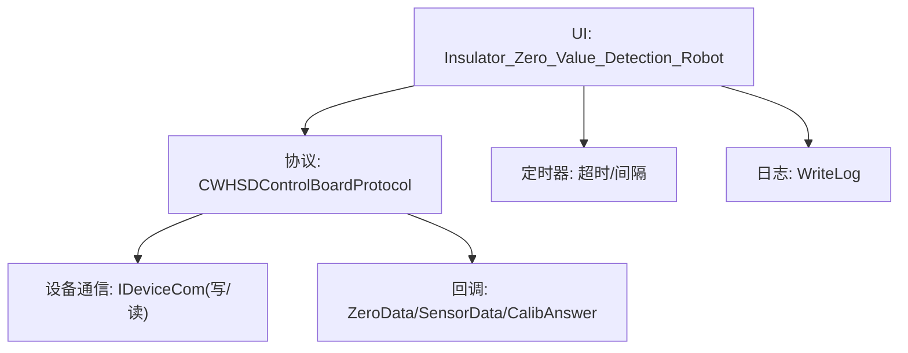
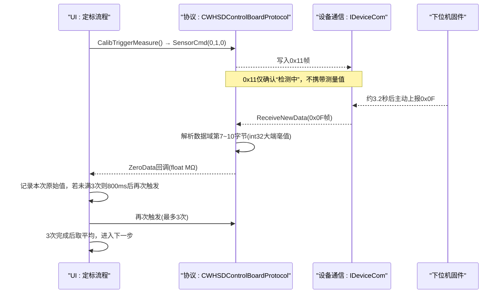
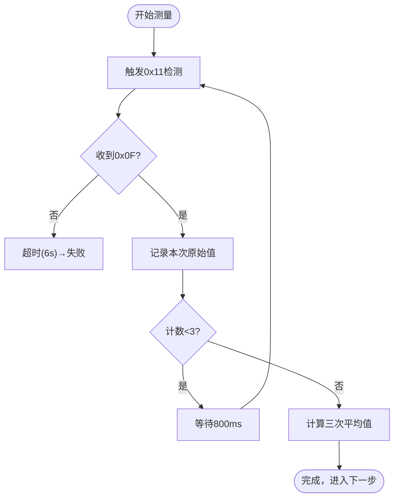
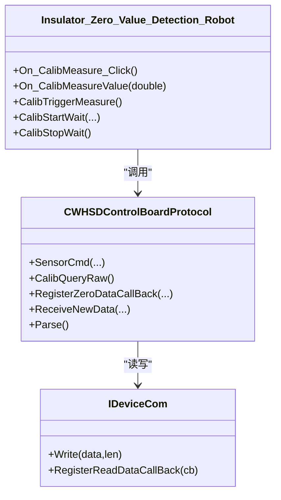

# 第三步：测量原始值

<cite>
**本文引用的文件**
- [WHSDControlBoradProtocol.h](file://Insulator_Zero_Value_Detection_Robot/Protocol/WHSDControlBoradProtocol.h)
- [WHSDControlBoradProtocol.cpp](file://Insulator_Zero_Value_Detection_Robot/Protocol/WHSDControlBoradProtocol.cpp)
- [Insulator_Zero_Value_Detection_Robot.h](file://Insulator_Zero_Value_Detection_Robot/UI/Insulator_Zero_Value_Detection_Robot.h)
- [Insulator_Zero_Value_Detection_Robot.cpp](file://Insulator_Zero_Value_Detection_Robot/UI/Insulator_Zero_Value_Detection_Robot.cpp)
</cite>

## 目录
1. [简介](#简介)
2. [项目结构](#项目结构)
3. [核心组件](#核心组件)
4. [架构总览](#架构总览)
5. [详细组件分析](#详细组件分析)
6. [依赖关系分析](#依赖关系分析)
7. [性能与精度](#性能与精度)
8. [故障排查指南](#故障排查指南)
9. [结论](#结论)
10. [附录：通信帧示例与数据处理流程](#附录通信帧示例与数据处理流程)

## 简介
本章节聚焦单点定标的“第三步：测量原始值”。该步骤通过下发传感器触发命令（0x11）启动一次检测，等待下位机在约3.2秒后主动上报测量结果（0x0F）。为保证稳定性，系统会连续测量3次，每次间隔800ms，并对三次原始值取平均作为后续定标输入。同时提供数值范围检查、异常处理、超时保护以及完整的通信帧与数据解析说明。

## 项目结构
围绕“测量原始值”的关键代码分布在协议层与UI控制层：
- 协议层负责封装/解析0x11触发与0x0F回报的帧格式，并将解析后的毫值转换为MΩ回调到上层。
- UI层负责驱动“连测3次”的流程控制、超时管理、结果聚合与展示。

图表来源
- [Insulator_Zero_Value_Detection_Robot.cpp:266-290](file://Insulator_Zero_Value_Detection_Robot/UI/Insulator_Zero_Value_Detection_Robot.cpp#L266-L290)
- [WHSDControlBoradProtocol.cpp:213-444](file://Insulator_Zero_Value_Detection_Robot/Protocol/WHSDControlBoradProtocol.cpp#L213-L444)

章节来源
- [Insulator_Zero_Value_Detection_Robot.cpp:266-290](file://Insulator_Zero_Value_Detection_Robot/UI/Insulator_Zero_Value_Detection_Robot.cpp#L266-L290)
- [WHSDControlBoradProtocol.cpp:213-444](file://Insulator_Zero_Value_Detection_Robot/Protocol/WHSDControlBoradProtocol.cpp#L213-L444)

## 核心组件
- 协议类CWHSDControlBoardProtocol
  - 提供SensorCmd用于发送0x11触发；解析0x0F回报并调用ZeroData回调。
  - 提供CalibQueryRaw用于0x06查询最近一次原始值（用于复核比对）。
- UI主窗口类Insulator_Zero_Value_Detection_Robot
  - 维护定标状态机，实现“连测3次、间隔800ms、超时保护、平均值计算”。
  - 将协议线程的回调通过信号槽切到UI线程处理，避免跨线程操作界面。

章节来源
- [WHSDControlBoradProtocol.h:254-266](file://Insulator_Zero_Value_Detection_Robot/Protocol/WHSDControlBoradProtocol.h#L254-L266)
- [WHSDControlBoradProtocol.cpp:557-560](file://Insulator_Zero_Value_Detection_Robot/Protocol/WHSDControlBoradProtocol.cpp#L557-L560)
- [WHSDControlBoradProtocol.cpp:321-362](file://Insulator_Zero_Value_Detection_Robot/Protocol/WHSDControlBoradProtocol.cpp#L321-L362)
- [Insulator_Zero_Value_Detection_Robot.h:315-374](file://Insulator_Zero_Value_Detection_Robot/UI/Insulator_Zero_Value_Detection_Robot.h#L315-L374)
- [Insulator_Zero_Value_Detection_Robot.cpp:979-1055](file://Insulator_Zero_Value_Detection_Robot/UI/Insulator_Zero_Value_Detection_Robot.cpp#L979-L1055)

## 架构总览
下图展示了从UI发起测量到收到0x0F回报的完整时序，包括多次测量与间隔控制。

图表来源
- [Insulator_Zero_Value_Detection_Robot.cpp:894-910](file://Insulator_Zero_Value_Detection_Robot/UI/Insulator_Zero_Value_Detection_Robot.cpp#L894-L910)
- [Insulator_Zero_Value_Detection_Robot.cpp:979-1055](file://Insulator_Zero_Value_Detection_Robot/UI/Insulator_Zero_Value_Detection_Robot.cpp#L979-L1055)
- [WHSDControlBoradProtocol.cpp:321-362](file://Insulator_Zero_Value_Detection_Robot/Protocol/WHSDControlBoradProtocol.cpp#L321-L362)

## 详细组件分析

### 0x11触发检测与0x0F结果回报流程
- 触发命令
  - UI调用CalibTriggerMeasure，内部使用SensorCmd(0,1,0)构造0x11帧并发送。
  - 0x11为“触发一次检测”，下位机应答仅表示“检测中”，真正的测量值由0x0F主动上报。
- 结果回报
  - 协议层在Parse中识别0x0F帧，读取数据域第7~10字节（int32有符号大端毫值），除以1000得到MΩ，并通过ZeroData回调返回给UI。
  - UI在回调中根据当前是否处于定标流程，决定是否走定标分支或工单测量分支。

章节来源
- [Insulator_Zero_Value_Detection_Robot.cpp:894-910](file://Insulator_Zero_Value_Detection_Robot/UI/Insulator_Zero_Value_Detection_Robot.cpp#L894-L910)
- [WHSDControlBoradProtocol.cpp:321-362](file://Insulator_Zero_Value_Detection_Robot/Protocol/WHSDControlBoradProtocol.cpp#L321-L362)
- [Insulator_Zero_Value_Detection_Robot.cpp:675-684](file://Insulator_Zero_Value_Detection_Robot/UI/Insulator_Zero_Value_Detection_Robot.cpp#L675-L684)

### 多次测量取平均的实现原理
- 次数与间隔
  - 常量CALIB_MEASURE_COUNT=3，CALIB_MEASURE_INTERVAL_MS=800ms。
  - 每收到一次0x0F，记录一次原始值；若未满3次，则在800ms后再次触发下一次测量。
- 平均值计算
  - 三次完成后对数组求和并除以3，得到平均原始值（单位MΩ），再转为毫值供后续定标使用。
- 超时保护
  - 每次触发后启动单次超时定时器（默认6秒），若在超时内未收到足够次数则判定失败并提示重试。

图表来源
- [Insulator_Zero_Value_Detection_Robot.cpp:979-1055](file://Insulator_Zero_Value_Detection_Robot/UI/Insulator_Zero_Value_Detection_Robot.cpp#L979-L1055)
- [Insulator_Zero_Value_Detection_Robot.cpp:1267-1313](file://Insulator_Zero_Value_Detection_Robot/UI/Insulator_Zero_Value_Detection_Robot.cpp#L1267-L1313)

章节来源
- [Insulator_Zero_Value_Detection_Robot.cpp:979-1055](file://Insulator_Zero_Value_Detection_Robot/UI/Insulator_Zero_Value_Detection_Robot.cpp#L979-L1055)
- [Insulator_Zero_Value_Detection_Robot.cpp:1267-1313](file://Insulator_Zero_Value_Detection_Robot/UI/Insulator_Zero_Value_Detection_Robot.cpp#L1267-L1313)

### 测量结果的验证方法
- 数值范围检查
  - 在后续定标步骤前，会对原始值进行合法性检查：必须大于0且小于标准值（否则为负补偿需求，模块读数偏高）。
  - 对于0x06查询原始值，若失败可能返回原因码0x01（距上次0x0F回报超5秒，原始值已失效）。
- 异常数据处理
  - 若0x0F未按时到达，视为测量失败，需重新执行该步骤。
  - 若0x0E写Flash失败或参数非法，按原因码提示并中止流程。

章节来源
- [Insulator_Zero_Value_Detection_Robot.cpp:1078-1114](file://Insulator_Zero_Value_Detection_Robot/UI/Insulator_Zero_Value_Detection_Robot.cpp#L1078-L1114)
- [Insulator_Zero_Value_Detection_Robot.cpp:1267-1313](file://Insulator_Zero_Value_Detection_Robot/UI/Insulator_Zero_Value_Detection_Robot.cpp#L1267-L1313)
- [WHSDControlBoradProtocol.cpp:392-418](file://Insulator_Zero_Value_Detection_Robot/Protocol/WHSDControlBoradProtocol.cpp#L392-L418)

### 通信帧示例与数据处理
- 0x11触发帧
  - 命令字0x11，数据域包含传感器索引、子命令1（触发）、参数（0）。
  - 协议封装函数：SensorCmd(sensorIndex, cmd, value)。
- 0x0F回报帧
  - 命令字0x0F，数据域类型字段指示数据类型，X值位于数据域第7~10字节（int32有符号大端毫值）。
  - 协议解析：GetInt32BE读取毫值，除以1000得到MΩ，回调到UI。
- 0x06查询原始值
  - 用于在0x0F回报后5秒内复核最近一次原始值，便于比对与日志记录。

章节来源
- [WHSDControlBoradProtocol.cpp:557-560](file://Insulator_Zero_Value_Detection_Robot/Protocol/WHSDControlBoradProtocol.cpp#L557-L560)
- [WHSDControlBoradProtocol.cpp:321-362](file://Insulator_Zero_Value_Detection_Robot/Protocol/WHSDControlBoradProtocol.cpp#L321-L362)
- [WHSDControlBoradProtocol.cpp:588-592](file://Insulator_Zero_Value_Detection_Robot/Protocol/WHSDControlBoradProtocol.cpp#L588-L592)

## 依赖关系分析
- UI层依赖协议层提供的接口：
  - SensorCmd用于触发测量。
  - CalibQueryRaw用于复核原始值。
  - RegisterZeroDataCallBack用于接收0x0F回报。
- 协议层依赖设备通信接口：
  - RegisterAnswerFunction用于回写响应帧。
  - ReceiveNewData用于接收并解析下行帧。
- 回调机制：
  - 协议线程回调ZeroData，通过信号槽切换到UI线程处理，避免跨线程访问UI。

图表来源
- [Insulator_Zero_Value_Detection_Robot.cpp:266-290](file://Insulator_Zero_Value_Detection_Robot/UI/Insulator_Zero_Value_Detection_Robot.cpp#L266-L290)
- [Insulator_Zero_Value_Detection_Robot.cpp:894-910](file://Insulator_Zero_Value_Detection_Robot/UI/Insulator_Zero_Value_Detection_Robot.cpp#L894-L910)
- [WHSDControlBoradProtocol.cpp:213-444](file://Insulator_Zero_Value_Detection_Robot/Protocol/WHSDControlBoradProtocol.cpp#L213-L444)

章节来源
- [Insulator_Zero_Value_Detection_Robot.cpp:266-290](file://Insulator_Zero_Value_Detection_Robot/UI/Insulator_Zero_Value_Detection_Robot.cpp#L266-L290)
- [WHSDControlBoradProtocol.cpp:213-444](file://Insulator_Zero_Value_Detection_Robot/Protocol/WHSDControlBoradProtocol.cpp#L213-L444)

## 性能与精度
- 采样策略
  - 3次测量取平均，有效降低随机噪声影响，提高稳定性。
  - 每次测量间隔800ms，给予模块读数稳定时间。
- 超时设计
  - 单次测量超时6秒，覆盖0x0F约3.2秒的回报时间，留有余量。
- 精度与误差
  - 0x0F回报为int32毫值，分辨率1mΩ（0.001MΩ）。
  - 平均值计算采用浮点累加后除3，最终显示保留三位小数。
  - 若出现异常值（如负值或远大于标准值），应在后续定标前拦截并提示硬件问题。

[本节为通用指导，不直接分析具体文件]

## 故障排查指南
- 0x0F未按时回报
  - 检查链路连接与心跳是否正常。
  - 确认是否在0x0F回报后5秒内未进行0x06复核导致原始值失效。
- 0x06查询失败
  - 原因码0x01表示原始值已超时，需重新触发检测。
- 0x0E定标失败
  - 原因码0x04表示Flash写失败，可重发；反复失败需检查Flash。
  - 原因码0x05表示参数长度/格式错误（参数必须正好8字节）。
  - 原因码0x09表示参数非法（原始值≤0或≥标准值），模块读数偏高，请检查接线与硬件。

章节来源
- [Insulator_Zero_Value_Detection_Robot.cpp:1267-1313](file://Insulator_Zero_Value_Detection_Robot/UI/Insulator_Zero_Value_Detection_Robot.cpp#L1267-L1313)
- [WHSDControlBoradProtocol.cpp:392-418](file://Insulator_Zero_Value_Detection_Robot/Protocol/WHSDControlBoradProtocol.cpp#L392-L418)

## 结论
“测量原始值”是单点定标的关键环节。通过0x11触发检测与0x0F回报机制，结合3次测量取平均与800ms间隔，系统在保证稳定性的同时提升了测量精度。配合严格的数值范围检查与超时保护，能够有效识别异常并引导用户排查问题。后续定标步骤基于该平均值进行系数计算与写入，确保校准结果可靠。

[本节为总结性内容，不直接分析具体文件]

## 附录：通信帧示例与数据处理流程
- 0x11触发帧
  - 命令字0x11，数据域包含传感器索引、子命令1（触发）、参数（0）。
  - 协议封装：SensorCmd(0,1,0)。
- 0x0F回报帧
  - 命令字0x0F，数据域类型字段指示数据类型，X值位于数据域第7~10字节（int32有符号大端毫值）。
  - 协议解析：GetInt32BE读取毫值，除以1000得到MΩ，回调到UI。
- 0x06查询原始值
  - 用于在0x0F回报后5秒内复核最近一次原始值，便于比对与日志记录。

章节来源
- [WHSDControlBoradProtocol.cpp:557-560](file://Insulator_Zero_Value_Detection_Robot/Protocol/WHSDControlBoradProtocol.cpp#L557-L560)
- [WHSDControlBoradProtocol.cpp:321-362](file://Insulator_Zero_Value_Detection_Robot/Protocol/WHSDControlBoradProtocol.cpp#L321-L362)
- [WHSDControlBoradProtocol.cpp:588-592](file://Insulator_Zero_Value_Detection_Robot/Protocol/WHSDControlBoradProtocol.cpp#L588-L592)