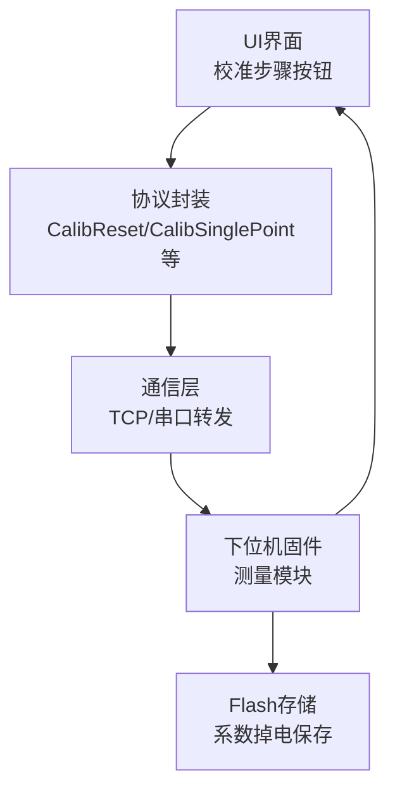
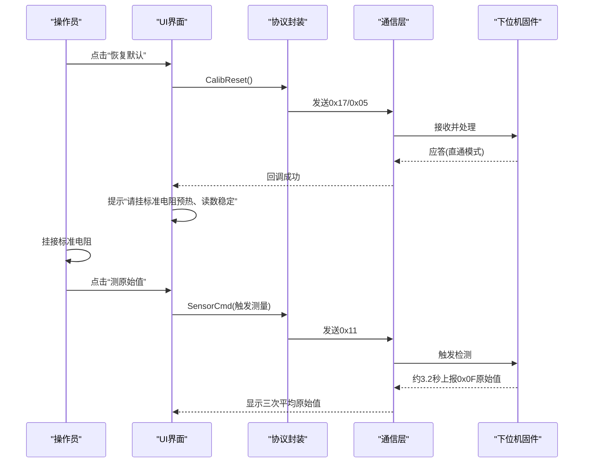
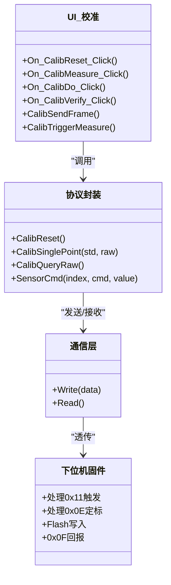

# 第二步：挂接标准电阻

<cite>
**本文引用的文件**
- [单点定标协议与流程_V1.0.html](file://Insulator_Zero_Value_Detection_Robot/单点定标协议与流程_V1.0.html)
- [Insulator_Zero_Value_Detection_Robot.cpp](file://Insulator_Zero_Value_Detection_Robot/UI/Insulator_Zero_Value_Detection_Robot.cpp)
- [Insulator_Zero_Value_Detection_Robot.h](file://Insulator_Zero_Value_Detection_Robot/UI/Insulator_Zero_Value_Detection_Robot.h)
- [WHSDControlBoradProtocol.h](file://Insulator_Zero_Value_Detection_Robot/Protocol/WHSDControlBoradProtocol.h)
- [操作说明书.md](file://操作说明书.md)
</cite>

## 目录
1. [简介](#简介)
2. [项目结构与定位](#项目结构与定位)
3. [核心组件与职责](#核心组件与职责)
4. [架构总览](#架构总览)
5. [详细步骤解析：挂接标准电阻](#详细步骤解析挂接标准电阻)
6. [依赖关系分析](#依赖关系分析)
7. [性能与稳定性考虑](#性能与稳定性考虑)
8. [故障排查与安全注意事项](#故障排查与安全注意事项)
9. [结论](#结论)
10. [附录：图示与参考](#附录图示与参考)

## 简介
本章节聚焦“单点定标的第二步：挂接标准电阻”，围绕以下目标展开：
- 说明标准电阻的正确连接方法与注意事项，确保连接可靠、接触良好。
- 描述探针定位到标准电阻的操作步骤（机械运动控制与位置确认）。
- 提供验证标准电阻已正确连接的方法（视觉检查与电气测试）。
- 给出安全注意事项与常见故障处理方法。
- 结合界面与日志提示，帮助现场人员快速完成并确认该步骤。

## 项目结构与定位
- 校准流程由UI层驱动，通过协议层封装命令帧，经通信层下发至下位机（测量模块），最终由固件计算补偿系数并写入Flash。
- “挂接标准电阻”是校准流程中的关键前置动作：在恢复默认后，必须将标准电阻接入测量通道，待读数稳定后再进行原始值测量与定标。

图表来源
- [Insulator_Zero_Value_Detection_Robot.cpp:820-1300](file://Insulator_Zero_Value_Detection_Robot/UI/Insulator_Zero_Value_Detection_Robot.cpp#L820-L1300)
- [WHSDControlBoradProtocol.h:224-259](file://Insulator_Zero_Value_Detection_Robot/Protocol/WHSDControlBoradProtocol.h#L224-L259)
- [单点定标协议与流程_V1.0.html:107-124](file://Insulator_Zero_Value_Detection_Robot/单点定标协议与流程_V1.0.html#L107-L124)

章节来源
- [Insulator_Zero_Value_Detection_Robot.cpp:820-1300](file://Insulator_Zero_Value_Detection_Robot/UI/Insulator_Zero_Value_Detection_Robot.cpp#L820-L1300)
- [单点定标协议与流程_V1.0.html:107-124](file://Insulator_Zero_Value_Detection_Robot/单点定标协议与流程_V1.0.html#L107-L124)

## 核心组件与职责
- UI校准流程控制器：负责步骤状态管理、超时保护、日志记录、按钮启用/禁用、与协议层的交互。
- 协议封装层：提供恢复默认、查询原始值、单点定标、读回系数、补偿验证等命令的构造方法。
- 下位机固件：执行测量、计算补偿系数、写入Flash，并通过0x0F回报测量结果。
- 通信链路：TCP/串口透传，心跳保活，断链检测。

章节来源
- [Insulator_Zero_Value_Detection_Robot.cpp:820-1300](file://Insulator_Zero_Value_Detection_Robot/UI/Insulator_Zero_Value_Detection_Robot.cpp#L820-L1300)
- [WHSDControlBoradProtocol.h:224-259](file://Insulator_Zero_Value_Detection_Robot/Protocol/WHSDControlBoradProtocol.h#L224-L259)
- [单点定标协议与流程_V1.0.html:45-124](file://Insulator_Zero_Value_Detection_Robot/单点定标协议与流程_V1.0.html#L45-L124)

## 架构总览
校准流程采用“UI驱动 + 协议封装 + 下位机执行”的分层架构。第二步“挂接标准电阻”本身是物理操作，但软件侧通过后续测量与校验间接验证其有效性。

图表来源
- [Insulator_Zero_Value_Detection_Robot.cpp:941-1055](file://Insulator_Zero_Value_Detection_Robot/UI/Insulator_Zero_Value_Detection_Robot.cpp#L941-L1055)
- [单点定标协议与流程_V1.0.html:64-78](file://Insulator_Zero_Value_Detection_Robot/单点定标协议与流程_V1.0.html#L64-L78)

## 详细步骤解析：挂接标准电阻
### 1) 连接前的准备
- 确保已完成“恢复默认”（0x17/0x05），测量通道处于直通状态，此时0x0F回报的是未补偿的原始值。
- 建议选用500~1000 MΩ档的标准电阻，该范围在√x模型中段最稳，有利于获得可靠的补偿系数。

章节来源
- [单点定标协议与流程_V1.0.html:107-115](file://Insulator_Zero_Value_Detection_Robot/单点定标协议与流程_V1.0.html#L107-L115)
- [Insulator_Zero_Value_Detection_Robot.cpp:1170-1188](file://Insulator_Zero_Value_Detection_Robot/UI/Insulator_Zero_Value_Detection_Robot.cpp#L1170-L1188)

### 2) 标准电阻的正确连接方法与注意事项
- 连接方式：将标准电阻的两端分别接入测量模块的输入端子，保证极性无关（阻值测量通常为无极性），接触面清洁无氧化。
- 固定与防抖：使用合适的夹具或接线端子固定电阻，避免振动导致接触不良；线缆尽量短且粗，减少寄生电感与接触电阻。
- 预热与稳定：连接后等待模块预热与读数稳定再进行测量，避免温度漂移影响原始值。
- 环境要求：远离强电磁干扰源，避免高温高湿环境；保持通风良好。

章节来源
- [单点定标协议与流程_V1.0.html:107-115](file://Insulator_Zero_Value_Detection_Robot/单点定标协议与流程_V1.0.html#L107-L115)

### 3) 探针定位到标准电阻的操作步骤
- 机械运动控制：通过键盘或手柄控制探针角度（内测/外侧），使探针接触标准电阻的测试点。
- 位置确认：观察视频画面确认探针已准确接触标准电阻测试点；必要时微调角度与位置。
- 截图辅助：在自动测量流程中，系统会在到位后截图以记录位置，便于回溯与核对。

章节来源
- [Insulator_Zero_Value_Detection_Robot.h:181-195](file://Insulator_Zero_Value_Detection_Robot/UI/Insulator_Zero_Value_Detection_Robot.h#L181-L195)
- [Insulator_Zero_Value_Detection_Robot.cpp:2062-2071](file://Insulator_Zero_Value_Detection_Robot/UI/Insulator_Zero_Value_Detection_Robot.cpp#L2062-L2071)

### 4) 验证标准电阻已正确连接
- 视觉检查：通过实时视频确认探针与标准电阻接触良好，无松动、偏移。
- 电气测试：
  - 触发测量（0x11）后等待0x0F回报原始值，建议连测2~3次取平均。
  - 使用0x06复核最近一次原始值（需在5秒内），用于交叉验证。
  - 若原始值平均值大于0且小于标准值，说明连接有效且读数合理；若原始值≥标准值，则可能为接线错误或模块读数偏高，需检查硬件。

章节来源
- [单点定标协议与流程_V1.0.html:64-78](file://Insulator_Zero_Value_Detection_Robot/单点定标协议与流程_V1.0.html#L64-L78)
- [Insulator_Zero_Value_Detection_Robot.cpp:994-1055](file://Insulator_Zero_Value_Detection_Robot/UI/Insulator_Zero_Value_Detection_Robot.cpp#L994-L1055)

### 5) 操作流程与界面反馈
- 步骤①恢复默认：成功后界面提示“请挂标准电阻预热、读数稳定”。
- 步骤②测原始值：自动连测3次，显示每次原始值与平均值；完成后解锁步骤③。
- 步骤③下发定标：将标准值与原始值（毫值大端）下发，固件计算系数并写入Flash，界面显示“写Flash中(1~2秒)”。
- 步骤④验证：再次触发测量，对比修正值与标准值误差；或使用0x0A离线抽查。

章节来源
- [Insulator_Zero_Value_Detection_Robot.cpp:941-1114](file://Insulator_Zero_Value_Detection_Robot/UI/Insulator_Zero_Value_Detection_Robot.cpp#L941-L1114)
- [操作说明书.md:376-392](file://操作说明书.md#L376-L392)

## 依赖关系分析
- UI层依赖协议层提供的校准命令封装方法，如CalibReset、CalibSinglePoint、CalibQueryRaw等。
- 协议层依赖通信层进行数据收发，确保心跳保活与断链检测。
- 下位机固件负责测量、计算与存储，返回结果供UI层解析与展示。

图表来源
- [Insulator_Zero_Value_Detection_Robot.cpp:820-1300](file://Insulator_Zero_Value_Detection_Robot/UI/Insulator_Zero_Value_Detection_Robot.cpp#L820-L1300)
- [WHSDControlBoradProtocol.h:224-259](file://Insulator_Zero_Value_Detection_Robot/Protocol/WHSDControlBoradProtocol.h#L224-L259)

章节来源
- [Insulator_Zero_Value_Detection_Robot.cpp:820-1300](file://Insulator_Zero_Value_Detection_Robot/UI/Insulator_Zero_Value_Detection_Robot.cpp#L820-L1300)
- [WHSDControlBoradProtocol.h:224-259](file://Insulator_Zero_Value_Detection_Robot/Protocol/WHSDControlBoradProtocol.h#L224-L259)

## 性能与稳定性考虑
- 超时保护：测量约6秒、写Flash约5秒、普通命令约3秒，超时会在日志中提示，避免流程卡死。
- 心跳保活：全程保持心跳，断链30秒触发舵机归零，防止机械失控。
- 并发互斥：校准与工单测量流程互斥，避免数据抢占与状态混乱。
- 参数合法性：上位机先做合法性检查（原始值必须大于0且小于标准值），减少无效定标尝试。

章节来源
- [操作说明书.md:376-392](file://操作说明书.md#L376-L392)
- [Insulator_Zero_Value_Detection_Robot.cpp:865-892](file://Insulator_Zero_Value_Detection_Robot/UI/Insulator_Zero_Value_Detection_Robot.cpp#L865-L892)

## 故障排查与安全注意事项
### 常见故障与处理
- 原始值≥标准值：模块读数偏高，检查接线与硬件，勿强行定标。
- 0x06查询原始值原因0x01：距上次0x0F超5秒，重新触发检测后立即查询。
- 0x0E定标原因0x09：参数非法，检查标准值与原始值格式（毫值大端，8字节）。
- 定标应答慢：正常现象（Flash擦写需1~2秒），设置超时≥3秒。

章节来源
- [单点定标协议与流程_V1.0.html:140-148](file://Insulator_Zero_Value_Detection_Robot/单点定标协议与流程_V1.0.html#L140-L148)
- [Insulator_Zero_Value_Detection_Robot.cpp:924-939](file://Insulator_Zero_Value_Detection_Robot/UI/Insulator_Zero_Value_Detection_Robot.cpp#L924-L939)

### 安全注意事项
- 断电操作：连接或断开标准电阻前，建议关闭总电源，避免带电插拔造成损坏。
- 防静电：佩戴防静电手环，避免静电击穿测量模块。
- 防短路：确保标准电阻两端不与其他导体接触，避免短路。
- 环境监控：注意温度、湿度变化对测量精度的影响，必要时重新定标。

章节来源
- [操作说明书.md:376-392](file://操作说明书.md#L376-L392)

## 结论
“挂接标准电阻”是单点定标的关键前置步骤，直接影响后续补偿系数的准确性。通过正确的连接方法、稳定的预热与读数、严格的视觉与电气验证，以及完善的超时与互斥保护，可确保定标过程高效、可靠。现场操作中应严格遵循流程，遇到异常及时排查，避免强行定标导致数据失真。

## 附录：图示与参考
- 校准流程图：展示从恢复默认到定标完成的完整序列。
- 界面状态颜色：灰色“未执行”、蓝色“进行中/等待应答”、绿色“成功/完成”、红色“失败”。
- 图片示例：可参考项目中的测试文档图片，用于对照实际连接与探针位置。

章节来源
- [操作说明书.md:453-497](file://操作说明书.md#L453-L497)