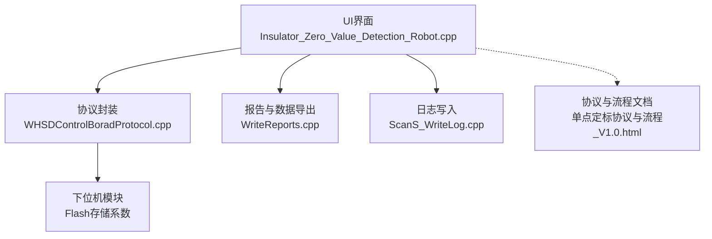
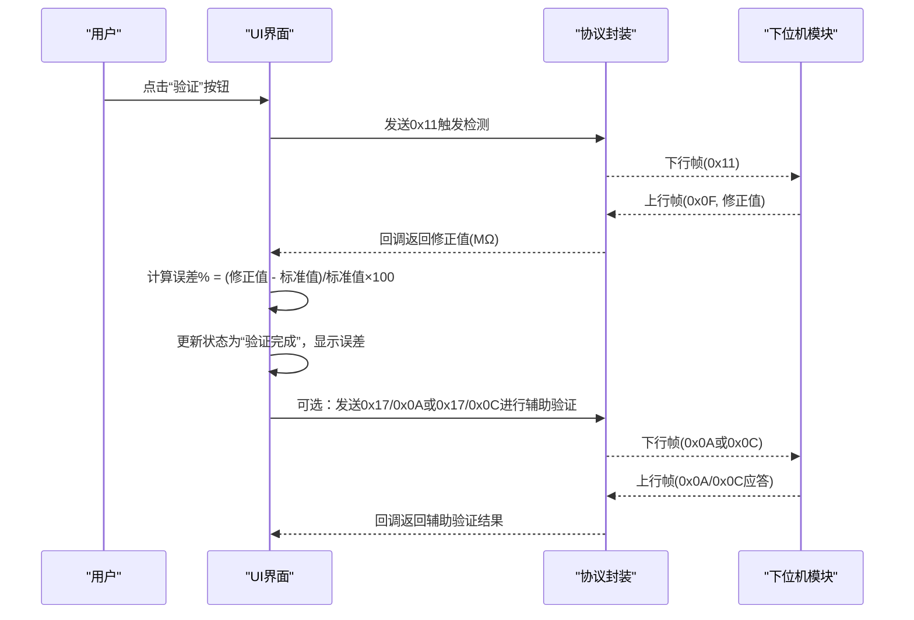
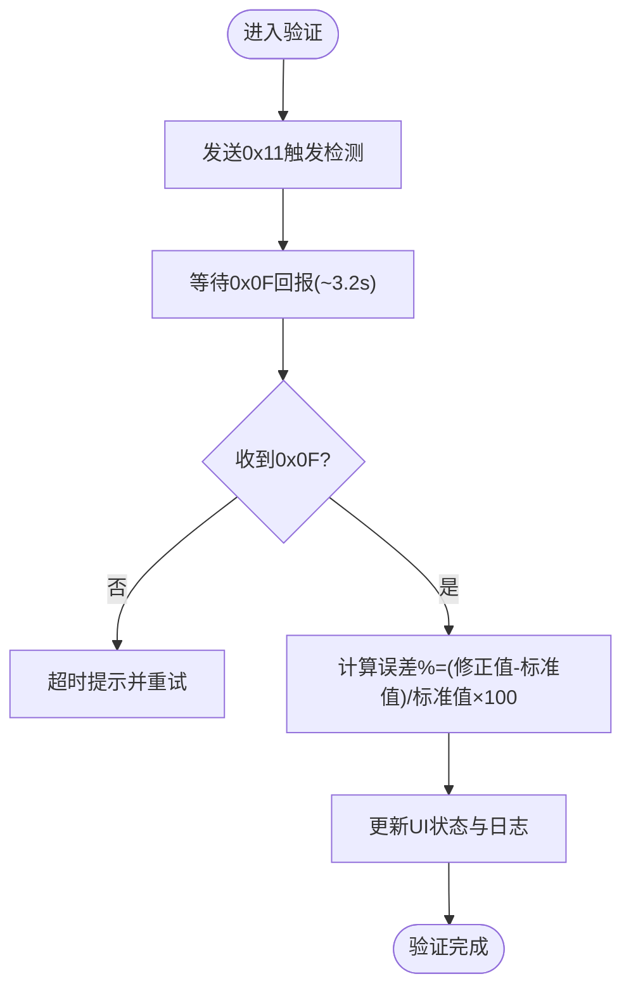
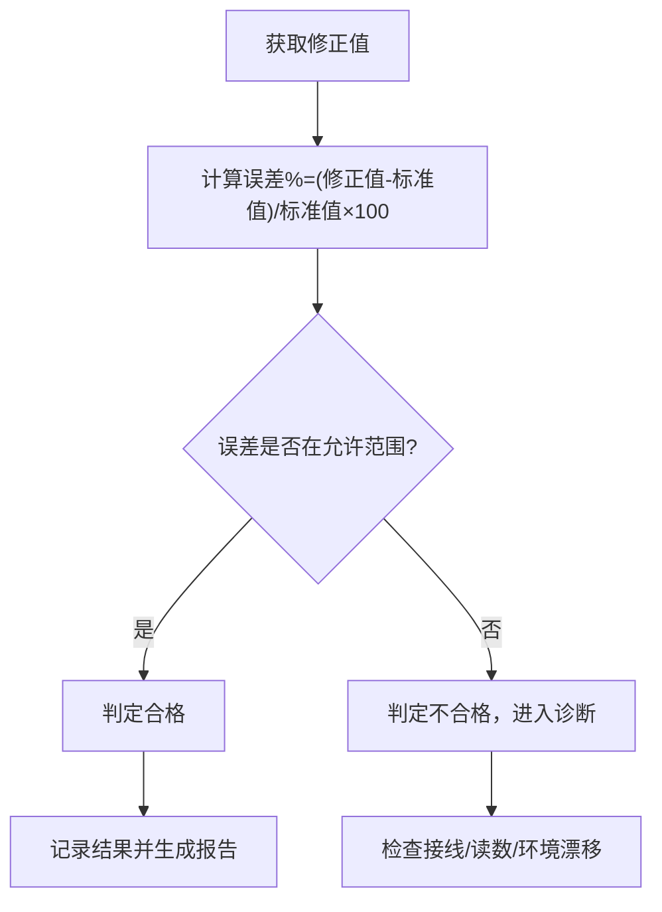
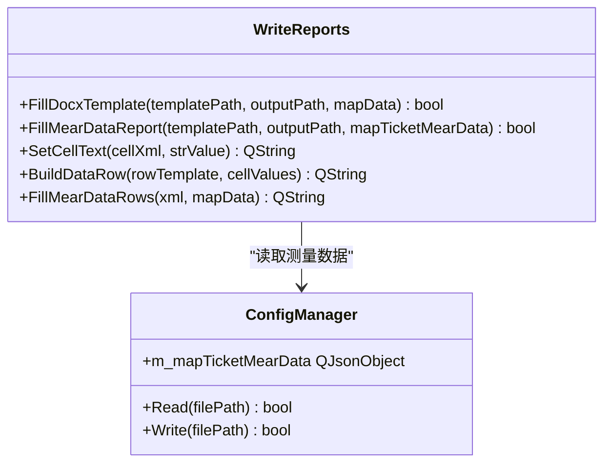
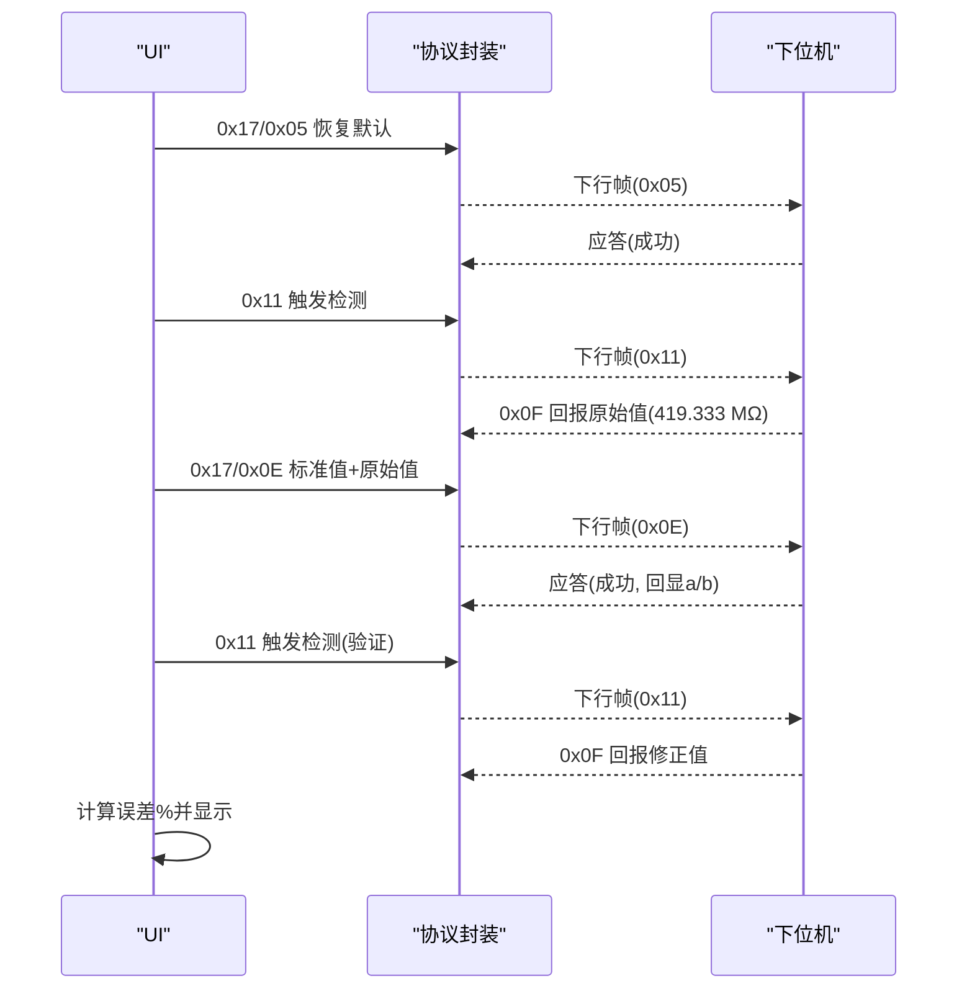
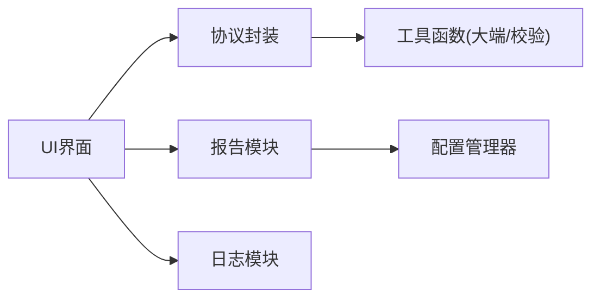

# 第五步：验证校准结果

<cite>
**本文引用的文件**
- [单点定标协议与流程_V1.0.html](file://Insulator_Zero_Value_Detection_Robot/单点定标协议与流程_V1.0.html)
- [WHSDControlBoradProtocol.cpp](file://Insulator_Zero_Value_Detection_Robot/Protocol/WHSDControlBoradProtocol.cpp)
- [Insulator_Zero_Value_Detection_Robot.cpp](file://Insulator_Zero_Value_Detection_Robot/UI/Insulator_Zero_Value_Detection_Robot.cpp)
- [WriteReports.cpp](file://Insulator_Zero_Value_Detection_Robot/Report/WriteReports.cpp)
- [ScanS_WriteLog.cpp](file://Insulator_Zero_Value_Detection_Robot/Log/ScanS_WriteLog.cpp)
- [操作说明书.md](file://操作说明书.md)
</cite>

## 目录
1. [简介](#简介)
2. [项目结构](#项目结构)
3. [核心组件](#核心组件)
4. [架构总览](#架构总览)
5. [详细组件分析](#详细组件分析)
6. [依赖关系分析](#依赖关系分析)
7. [性能考虑](#性能考虑)
8. [故障诊断指南](#故障诊断指南)
9. [结论](#结论)
10. [附录](#附录)

## 简介
本章节聚焦单点定标的“第五步：验证校准结果”。目标是说明如何通过重新测量来验证校准的准确性，包括测量流程、结果对比、精度评估（误差计算与合格标准）、记录与分析（数据存储与报告生成），以及验证失败的诊断方法与调整策略。文档同时给出一个完整测试案例：以500 MΩ标准电阻、实测原始值419.333 MΩ为例，演示从下发单点定标到验证的全流程。

## 项目结构
与“验证校准结果”直接相关的代码与文档分布在以下位置：
- 协议与流程定义：单点定标命令、帧格式、应答含义、异常原因等
- 上位机UI与流程控制：触发测量、等待应答、计算误差、显示状态与日志
- 通信协议封装：帧组装、解析、回调分发
- 报告与数据导出：Word模板填充、CSV导出
- 日志写入：系统级日志接口

图表来源
- [Insulator_Zero_Value_Detection_Robot.cpp:974-1292](file://Insulator_Zero_Value_Detection_Robot/UI/Insulator_Zero_Value_Detection_Robot.cpp#L974-L1292)
- [WHSDControlBoradProtocol.cpp:228-444](file://Insulator_Zero_Value_Detection_Robot/Protocol/WHSDControlBoradProtocol.cpp#L228-L444)
- [WriteReports.cpp:107-115](file://Insulator_Zero_Value_Detection_Robot/Report/WriteReports.cpp#L107-L115)
- [ScanS_WriteLog.cpp:28-36](file://Insulator_Zero_Value_Detection_Robot/Log/ScanS_WriteLog.cpp#L28-L36)
- [单点定标协议与流程_V1.0.html:45-125](file://Insulator_Zero_Value_Detection_Robot/单点定标协议与流程_V1.0.html#L45-L125)

章节来源
- [单点定标协议与流程_V1.0.html:45-125](file://Insulator_Zero_Value_Detection_Robot/单点定标协议与流程_V1.0.html#L45-L125)
- [Insulator_Zero_Value_Detection_Robot.cpp:974-1292](file://Insulator_Zero_Value_Detection_Robot/UI/Insulator_Zero_Value_Detection_Robot.cpp#L974-L1292)
- [WHSDControlBoradProtocol.cpp:228-444](file://Insulator_Zero_Value_Detection_Robot/Protocol/WHSDControlBoradProtocol.cpp#L228-L444)
- [WriteReports.cpp:107-115](file://Insulator_Zero_Value_Detection_Robot/Report/WriteReports.cpp#L107-L115)
- [ScanS_WriteLog.cpp:28-36](file://Insulator_Zero_Value_Detection_Robot/Log/ScanS_WriteLog.cpp#L28-L36)

## 核心组件
- 协议与流程文档：定义了单点定标命令0x17/0x0E、测量回报0x0F、辅助验证0x0A、读回系数0x0C及异常原因码；明确毫值单位与大端格式、Flash存储与掉电保存。
- 上位机UI流程：实现步骤①恢复默认、②测原始值（三次平均）、③下发定标、④验证（再次测量并对比标准值）、⑤离线抽查（0x0A）与读回系数（0x0C）。
- 协议封装：负责帧组装、校验和计算、解析0x0F/0x17应答，并将数据通过回调交给UI处理。
- 报告与数据：支持Word模板填充与CSV导出，便于记录与归档。
- 日志：提供同步/异步写入能力，用于记录校准过程与异常信息。

章节来源
- [单点定标协议与流程_V1.0.html:57-125](file://Insulator_Zero_Value_Detection_Robot/单点定标协议与流程_V1.0.html#L57-L125)
- [Insulator_Zero_Value_Detection_Robot.cpp:974-1292](file://Insulator_Zero_Value_Detection_Robot/UI/Insulator_Zero_Value_Detection_Robot.cpp#L974-L1292)
- [WHSDControlBoradProtocol.cpp:582-616](file://Insulator_Zero_Value_Detection_Robot/Protocol/WHSDControlBoradProtocol.cpp#L582-L616)
- [WriteReports.cpp:107-115](file://Insulator_Zero_Value_Detection_Robot/Report/WriteReports.cpp#L107-L115)
- [ScanS_WriteLog.cpp:28-36](file://Insulator_Zero_Value_Detection_Robot/Log/ScanS_WriteLog.cpp#L28-L36)

## 架构总览
下图展示了“验证校准结果”在系统中的调用链路与数据流：

图表来源
- [Insulator_Zero_Value_Detection_Robot.cpp:1116-1127](file://Insulator_Zero_Value_Detection_Robot/UI/Insulator_Zero_Value_Detection_Robot.cpp#L1116-L1127)
- [Insulator_Zero_Value_Detection_Robot.cpp:1007-1076](file://Insulator_Zero_Value_Detection_Robot/UI/Insulator_Zero_Value_Detection_Robot.cpp#L1007-L1076)
- [WHSDControlBoradProtocol.cpp:321-362](file://Insulator_Zero_Value_Detection_Robot/Protocol/WHSDControlBoradProtocol.cpp#L321-L362)
- [单点定标协议与流程_V1.0.html:63-105](file://Insulator_Zero_Value_Detection_Robot/单点定标协议与流程_V1.0.html#L63-L105)

## 详细组件分析

### 验证测量流程与结果对比
- 触发测量：UI在“验证”步骤中发送0x11触发检测，等待约3.2秒后接收0x0F回报。
- 结果解读：若已生效定标，0x0F回报为修正值；否则为原始值。UI将修正值与标准值对比，计算相对误差百分比。
- 状态与日志：UI更新步骤④状态为“验证完成”，并在流程日志中记录修正值、标准值与误差。

图表来源
- [Insulator_Zero_Value_Detection_Robot.cpp:1116-1127](file://Insulator_Zero_Value_Detection_Robot/UI/Insulator_Zero_Value_Detection_Robot.cpp#L1116-L1127)
- [Insulator_Zero_Value_Detection_Robot.cpp:1007-1076](file://Insulator_Zero_Value_Detection_Robot/UI/Insulator_Zero_Value_Detection_Robot.cpp#L1007-L1076)
- [单点定标协议与流程_V1.0.html:63-70](file://Insulator_Zero_Value_Detection_Robot/单点定标协议与流程_V1.0.html#L63-L70)

章节来源
- [Insulator_Zero_Value_Detection_Robot.cpp:1116-1127](file://Insulator_Zero_Value_Detection_Robot/UI/Insulator_Zero_Value_Detection_Robot.cpp#L1116-L1127)
- [Insulator_Zero_Value_Detection_Robot.cpp:1007-1076](file://Insulator_Zero_Value_Detection_Robot/UI/Insulator_Zero_Value_Detection_Robot.cpp#L1007-L1076)
- [单点定标协议与流程_V1.0.html:63-70](file://Insulator_Zero_Value_Detection_Robot/单点定标协议与流程_V1.0.html#L63-L70)

### 校准精度评估方法
- 误差计算：相对误差百分比 = (修正值 - 标准值) / 标准值 × 100%。UI在验证步骤中直接计算并显示。
- 合格标准判断：
  - 协议文档未给出固定阈值，但建议采用“同环境同批次”测量，避免日间漂移污染系数。
  - 工程上可结合业务需求设定误差阈值（例如±1%或±2%），由UI扩展逻辑实现。
- 补偿验证（0x0A）：不挂电阻，直接下发任意原始值，下位机回显“原始值 + 校准后值”，可用于快速核对补偿效果。

图表来源
- [Insulator_Zero_Value_Detection_Robot.cpp:1064-1070](file://Insulator_Zero_Value_Detection_Robot/UI/Insulator_Zero_Value_Detection_Robot.cpp#L1064-L1070)
- [单点定标协议与流程_V1.0.html:100-105](file://Insulator_Zero_Value_Detection_Robot/单点定标协议与流程_V1.0.html#L100-L105)

章节来源
- [Insulator_Zero_Value_Detection_Robot.cpp:1064-1070](file://Insulator_Zero_Value_Detection_Robot/UI/Insulator_Zero_Value_Detection_Robot.cpp#L1064-L1070)
- [单点定标协议与流程_V1.0.html:100-105](file://Insulator_Zero_Value_Detection_Robot/单点定标协议与流程_V1.0.html#L100-L105)

### 数据存储与报告生成
- 数据存储：
  - 校准系数：下位机Flash Sector4存储，掉电保存；上位机可通过0x0C读回系数进行复核。
  - 测量数据：工单测量数据以JSON结构保存在配置管理器中，并可导出为CSV。
- 报告生成：
  - Word模板填充：使用占位符替换机制生成报告，支持表格行自适应填充。
  - CSV导出：按侧别、方向、序号、测量值顺序输出，便于后续分析。

图表来源
- [WriteReports.cpp:107-115](file://Insulator_Zero_Value_Detection_Robot/Report/WriteReports.cpp#L107-L115)
- [WriteReports.cpp:131-139](file://Insulator_Zero_Value_Detection_Robot/Report/WriteReports.cpp#L131-L139)
- [ConfigManager.h:176-198](file://Insulator_Zero_Value_Detection_Robot/Config/ConfigManager.h#L176-L198)

章节来源
- [WriteReports.cpp:107-115](file://Insulator_Zero_Value_Detection_Robot/Report/WriteReports.cpp#L107-L115)
- [WriteReports.cpp:131-139](file://Insulator_Zero_Value_Detection_Robot/Report/WriteReports.cpp#L131-L139)
- [ConfigManager.h:176-198](file://Insulator_Zero_Value_Detection_Robot/Config/ConfigManager.h#L176-L198)

### 实际测试案例：500 MΩ / 419.333 MΩ
- 背景：使用500 MΩ标准电阻，实测原始值为419.333 MΩ。
- 定标过程：
  - 恢复默认：发送0x17/0x05清空旧校准。
  - 测原始值：发送0x11触发检测，等待0x0F回报，记录原始值；建议连测2~3次取平均。
  - 下发定标：发送0x17/0x0E，参数为标准值与实测原始值（毫值大端）；下位机计算补偿系数并写入Flash。
- 验证过程：
  - 再次触发检测，接收0x0F回报的修正值。
  - 计算误差百分比并与标准值对比。
  - 可选：使用0x0A进行离线抽查，或直接0x0C读回系数复核。

图表来源
- [单点定标协议与流程_V1.0.html:71-92](file://Insulator_Zero_Value_Detection_Robot/单点定标协议与流程_V1.0.html#L71-L92)
- [Insulator_Zero_Value_Detection_Robot.cpp:1078-1114](file://Insulator_Zero_Value_Detection_Robot/UI/Insulator_Zero_Value_Detection_Robot.cpp#L1078-L1114)
- [Insulator_Zero_Value_Detection_Robot.cpp:1116-1127](file://Insulator_Zero_Value_Detection_Robot/UI/Insulator_Zero_Value_Detection_Robot.cpp#L1116-L1127)

章节来源
- [单点定标协议与流程_V1.0.html:71-92](file://Insulator_Zero_Value_Detection_Robot/单点定标协议与流程_V1.0.html#L71-L92)
- [Insulator_Zero_Value_Detection_Robot.cpp:1078-1114](file://Insulator_Zero_Value_Detection_Robot/UI/Insulator_Zero_Value_Detection_Robot.cpp#L1078-L1114)
- [Insulator_Zero_Value_Detection_Robot.cpp:1116-1127](file://Insulator_Zero_Value_Detection_Robot/UI/Insulator_Zero_Value_Detection_Robot.cpp#L1116-L1127)

## 依赖关系分析
- UI依赖协议封装进行帧发送与解析，并通过回调接收测量结果与校准应答。
- 协议封装依赖工具函数进行大端整数转换与校验和计算。
- 报告模块依赖配置管理器的测量数据，进行Word模板填充与CSV导出。
- 日志模块提供统一写入接口，供UI与协议层记录关键事件。

图表来源
- [Insulator_Zero_Value_Detection_Robot.cpp:974-1292](file://Insulator_Zero_Value_Detection_Robot/UI/Insulator_Zero_Value_Detection_Robot.cpp#L974-L1292)
- [WHSDControlBoradProtocol.cpp:562-580](file://Insulator_Zero_Value_Detection_Robot/Protocol/WHSDControlBoradProtocol.cpp#L562-L580)
- [WriteReports.cpp:107-115](file://Insulator_Zero_Value_Detection_Robot/Report/WriteReports.cpp#L107-L115)
- [ScanS_WriteLog.cpp:28-36](file://Insulator_Zero_Value_Detection_Robot/Log/ScanS_WriteLog.cpp#L28-L36)

章节来源
- [Insulator_Zero_Value_Detection_Robot.cpp:974-1292](file://Insulator_Zero_Value_Detection_Robot/UI/Insulator_Zero_Value_Detection_Robot.cpp#L974-L1292)
- [WHSDControlBoradProtocol.cpp:562-580](file://Insulator_Zero_Value_Detection_Robot/Protocol/WHSDControlBoradProtocol.cpp#L562-L580)
- [WriteReports.cpp:107-115](file://Insulator_Zero_Value_Detection_Robot/Report/WriteReports.cpp#L107-L115)
- [ScanS_WriteLog.cpp:28-36](file://Insulator_Zero_Value_Detection_Robot/Log/ScanS_WriteLog.cpp#L28-L36)

## 性能考虑
- Flash擦写耗时：0x0E写Flash需1~2秒，上位机应答超时应设置≥3秒，避免误判失败。
- 心跳维持：全程保持心跳，断链30秒可能触发舵机归零，影响校准稳定性。
- 测量时机：测原始值与验证尽量在同一环境与同一批次完成，避免日间漂移导致系数偏差。

章节来源
- [单点定标协议与流程_V1.0.html:117-125](file://Insulator_Zero_Value_Detection_Robot/单点定标协议与流程_V1.0.html#L117-L125)
- [Insulator_Zero_Value_Detection_Robot.cpp:1267-1292](file://Insulator_Zero_Value_Detection_Robot/UI/Insulator_Zero_Value_Detection_Robot.cpp#L1267-L1292)

## 故障诊断指南
- 常见异常与处理：
  - 0x06查询原始值超时：距上次0x0F超5秒；重新触发检测后立即查询。
  - 0x0E参数非法：标准值/原始值≤0，或原始值≥标准值；检查接线与模块读数，勿强行定标。
  - 0x0E参数长度错误：参数必须正好8字节；检查组帧（标准值4B + 原始值4B，毫值大端）。
  - 定标后各档整体偏移：模块日间漂移；同环境重测基准档，再发一次0x0E。
  - 0x0E应答慢：正常现象（需擦写Flash Sector4），超时设≥3秒。
- 诊断步骤：
  - 检查链路心跳与连接状态。
  - 使用0x0C读回系数，确认Flash中已存系数。
  - 使用0x0A进行离线抽查，核对补偿效果。
  - 查看流程日志与系统日志，定位具体失败环节。

章节来源
- [单点定标协议与流程_V1.0.html:140-148](file://Insulator_Zero_Value_Detection_Robot/单点定标协议与流程_V1.0.html#L140-L148)
- [Insulator_Zero_Value_Detection_Robot.cpp:1190-1235](file://Insulator_Zero_Value_Detection_Robot/UI/Insulator_Zero_Value_Detection_Robot.cpp#L1190-L1235)
- [Insulator_Zero_Value_Detection_Robot.cpp:1267-1292](file://Insulator_Zero_Value_Detection_Robot/UI/Insulator_Zero_Value_Detection_Robot.cpp#L1267-L1292)

## 结论
“验证校准结果”是单点定标的关键闭环步骤。通过重新测量并对比标准值，计算相对误差百分比，可直观评估校准准确性。系统提供了完整的测量流程、辅助验证命令、系数读回与报告导出能力，配合详细的异常原因码与日志记录，便于快速定位问题并进行调整。建议在稳定环境下执行校准与验证，必要时重复校准以应对模块漂移。

## 附录
- 相关操作入口：系统设置中的“阻值单点校准”区域提供校准模块相关操作入口。
- 报告生成：生成前若该工单已存在报告，软件会询问是否重新生成，确认后覆盖旧报告。

章节来源
- [操作说明书.md:310-340](file://操作说明书.md#L310-L340)