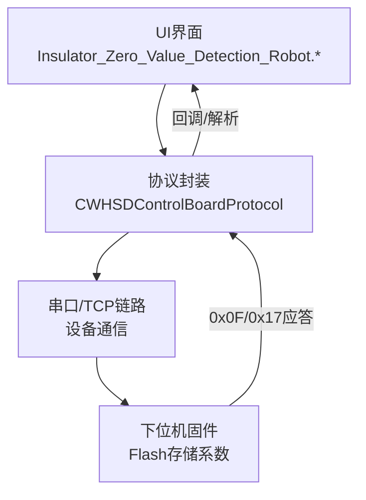
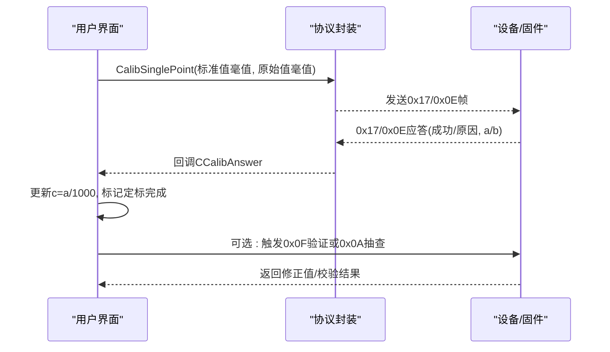
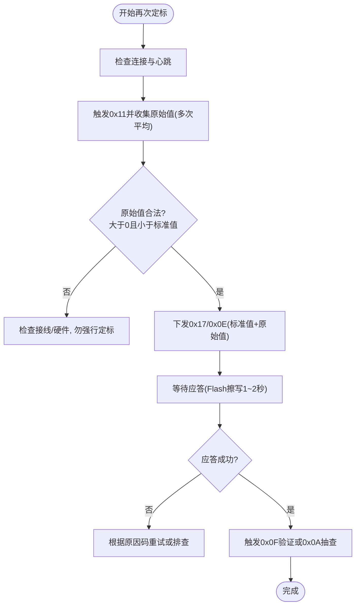
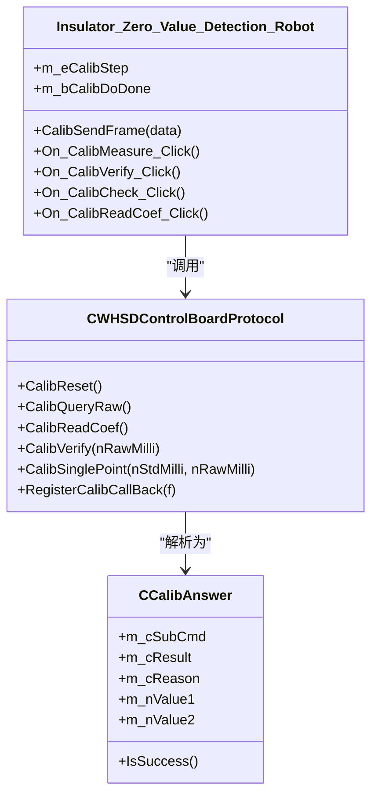

# 第六步：再次定标（可选）

<cite>
**本文引用的文件**
- [单点定标协议与流程_V1.0.html](file://Insulator_Zero_Value_Detection_Robot/单点定标协议与流程_V1.0.html)
- [WHSDControlBoradProtocol.h](file://Insulator_Zero_Value_Detection_Robot/Protocol/WHSDControlBoradProtocol.h)
- [WHSDControlBoradProtocol.cpp](file://Insulator_Zero_Value_Detection_Robot/Protocol/WHSDControlBoradProtocol.cpp)
- [Insulator_Zero_Value_Detection_Robot.h](file://Insulator_Zero_Value_Detection_Robot/UI/Insulator_Zero_Value_Detection_Robot.h)
- [Insulator_Zero_Value_Detection_Robot.cpp](file://Insulator_Zero_Value_Detection_Robot/UI/Insulator_Zero_Value_Detection_Robot.cpp)
- [操作说明书.md](file://操作说明书.md)
</cite>

## 目录
1. [简介](#简介)
2. [项目结构定位](#项目结构定位)
3. [核心组件](#核心组件)
4. [架构总览](#架构总览)
5. [详细组件分析](#详细组件分析)
6. [依赖关系分析](#依赖关系分析)
7. [性能注意事项](#性能注意事项)
8. [故障排除指南](#故障排除指南)
9. [结论](#结论)
10. [附录](#附录)

## 简介
本章节聚焦“单点定标的第六步：再次定标（可选）”。当模块出现漂移、环境变化或校准精度不达标时，可通过“再次定标”快速更新补偿系数。该步骤无需先清除旧校准，直接下发新的标准值与实测原始值即可覆盖旧系数，并立即生效、写入 Flash。

## 项目结构定位
- 协议与命令封装：位于 Protocol 层，负责构建 0x17 系列命令帧（恢复默认、查询原始值、读回系数、补偿验证、单点定标）。
- UI 流程控制：位于 UI 层，按步骤驱动测量、等待应答、超时处理、日志输出与状态显示。
- 协议文档：提供通信帧格式、命令语义、异常码与完整流程说明。

图表来源
- [Insulator_Zero_Value_Detection_Robot.cpp:974-1292](file://Insulator_Zero_Value_Detection_Robot/UI/Insulator_Zero_Value_Detection_Robot.cpp#L974-L1292)
- [WHSDControlBoradProtocol.cpp:582-616](file://Insulator_Zero_Value_Detection_Robot/Protocol/WHSDControlBoradProtocol.cpp#L582-L616)
- [单点定标协议与流程_V1.0.html:45-125](file://Insulator_Zero_Value_Detection_Robot/单点定标协议与流程_V1.0.html#L45-L125)

章节来源
- [Insulator_Zero_Value_Detection_Robot.cpp:974-1292](file://Insulator_Zero_Value_Detection_Robot/UI/Insulator_Zero_Value_Detection_Robot.cpp#L974-L1292)
- [WHSDControlBoradProtocol.cpp:582-616](file://Insulator_Zero_Value_Detection_Robot/Protocol/WHSDControlBoradProtocol.cpp#L582-L616)
- [单点定标协议与流程_V1.0.html:45-125](file://Insulator_Zero_Value_Detection_Robot/单点定标协议与流程_V1.0.html#L45-L125)

## 核心组件
- 协议层
  - 单点定标命令构造：CalibSinglePoint(标准值毫值, 原始值毫值)
  - 辅助命令：CalibReset()、CalibQueryRaw()、CalibReadCoef()、CalibVerify()
  - 数据解析：0x17 子命令应答统一为“子命令+结果+原因+参数1(4B)+参数2(4B)”
- UI 层
  - 步骤状态机：空闲→恢复默认→测原始值→下发定标→验证→辅助命令
  - 超时与重试：针对各步骤设置超时定时器，失败提示并允许重试
  - 日志与展示：记录 HEX 帧、计算理论 c、显示 a/b、误差百分比等

章节来源
- [WHSDControlBoradProtocol.h:17-52](file://Insulator_Zero_Value_Detection_Robot/Protocol/WHSDControlBoradProtocol.h#L17-L52)
- [WHSDControlBoradProtocol.cpp:582-616](file://Insulator_Zero_Value_Detection_Robot/Protocol/WHSDControlBoradProtocol.cpp#L582-L616)
- [Insulator_Zero_Value_Detection_Robot.h:317-384](file://Insulator_Zero_Value_Detection_Robot/UI/Insulator_Zero_Value_Detection_Robot.h#L317-L384)
- [Insulator_Zero_Value_Detection_Robot.cpp:974-1292](file://Insulator_Zero_Value_Detection_Robot/UI/Insulator_Zero_Value_Detection_Robot.cpp#L974-L1292)

## 架构总览
再次定标在整体流程中属于“第③步：下发定标”的重复执行。其调用链如下：

图表来源
- [Insulator_Zero_Value_Detection_Robot.cpp:1104-1114](file://Insulator_Zero_Value_Detection_Robot/UI/Insulator_Zero_Value_Detection_Robot.cpp#L1104-L1114)
- [Insulator_Zero_Value_Detection_Robot.cpp:1236-1257](file://Insulator_Zero_Value_Detection_Robot/UI/Insulator_Zero_Value_Detection_Robot.cpp#L1236-L1257)
- [WHSDControlBoradProtocol.cpp:582-616](file://Insulator_Zero_Value_Detection_Robot/Protocol/WHSDControlBoradProtocol.cpp#L582-L616)
- [单点定标协议与流程_V1.0.html:79-125](file://Insulator_Zero_Value_Detection_Robot/单点定标协议与流程_V1.0.html#L79-L125)

## 详细组件分析

### 何时需要再次定标
- 校准精度不达标：验证阶段发现多档电阻误差偏大，或离线抽查（0x0A）偏差明显。
- 环境变化：温度、湿度、供电波动导致模块读数漂移；同环境不同时刻读数差异较大。
- 长期运行后：模块存在日间漂移，需在同一环境下重新测量基准档并再次下发 0x0E。

章节来源
- [单点定标协议与流程_V1.0.html:107-125](file://Insulator_Zero_Value_Detection_Robot/单点定标协议与流程_V1.0.html#L107-L125)
- [Insulator_Zero_Value_Detection_Robot.cpp:1116-1147](file://Insulator_Zero_Value_Detection_Robot/UI/Insulator_Zero_Value_Detection_Robot.cpp#L1116-L1147)

### 再次定标的完整流程
- 准备：保持心跳连接，确保设备在线；标准电阻稳定接入并预热。
- 测量原始值：触发检测（0x11），等待约 3.2 秒获取 0x0F 回报；建议连测 2~3 次取平均，并在 5 秒内用 0x06 复核。
- 下发定标：将标准值与原始值平均值以毫值大端形式通过 CalibSinglePoint 下发；固件计算补偿系数并写入 Flash，应答回显 a/b。
- 验证：可再次触发 0x0F 查看修正值，或使用 0x0A 进行离线抽查；也可用 0x0C 读回系数核对。

图表来源
- [Insulator_Zero_Value_Detection_Robot.cpp:974-1114](file://Insulator_Zero_Value_Detection_Robot/UI/Insulator_Zero_Value_Detection_Robot.cpp#L974-L1114)
- [Insulator_Zero_Value_Detection_Robot.cpp:1236-1292](file://Insulator_Zero_Value_Detection_Robot/UI/Insulator_Zero_Value_Detection_Robot.cpp#L1236-L1292)
- [单点定标协议与流程_V1.0.html:107-125](file://Insulator_Zero_Value_Detection_Robot/单点定标协议与流程_V1.0.html#L107-L125)

章节来源
- [Insulator_Zero_Value_Detection_Robot.cpp:974-1114](file://Insulator_Zero_Value_Detection_Robot/UI/Insulator_Zero_Value_Detection_Robot.cpp#L974-L1114)
- [Insulator_Zero_Value_Detection_Robot.cpp:1236-1292](file://Insulator_Zero_Value_Detection_Robot/UI/Insulator_Zero_Value_Detection_Robot.cpp#L1236-L1292)
- [单点定标协议与流程_V1.0.html:107-125](file://Insulator_Zero_Value_Detection_Robot/单点定标协议与流程_V1.0.html#L107-L125)

### 比较多次定标结果与选择最优参数
- 读回系数对比：使用 0x0C 读取当前 a/b，并与历史值对比，观察是否合理变化。
- 验证误差对比：对同一组标准电阻在不同时间/环境下测量，计算修正值与标准值的相对误差；选择误差更小的一组作为最优。
- 离线抽查一致性：使用 0x0A 对多个原始值进行抽查，若修正后值符合预期且稳定，则表明系数有效。

章节来源
- [Insulator_Zero_Value_Detection_Robot.cpp:1149-1213](file://Insulator_Zero_Value_Detection_Robot/UI/Insulator_Zero_Value_Detection_Robot.cpp#L1149-L1213)
- [单点定标协议与流程_V1.0.html:100-105](file://Insulator_Zero_Value_Detection_Robot/单点定标协议与流程_V1.0.html#L100-L105)

### 调优建议与最佳实践
- 标准电阻选择：建议 500~1000 MΩ 范围，处于 √x 模型中段更稳定。
- 测量稳定性：预热模块、多次测量取平均；尽量在同环境、同批次完成测量与验证，避免漂移污染系数。
- 参数合法性：原始值必须大于 0 且小于标准值；否则固件会返回原因 0x09，应检查接线与硬件。
- 超时设置：0x0E 写 Flash 需 1~2 秒，上位机应答超时建议 ≥ 3 秒；0x0F 回报约 3.2 秒，等待超时建议 ≥ 5 秒。
- 覆盖策略：再次定标直接下发新 0x0E 即可覆盖旧系数，无须先清除。

章节来源
- [单点定标协议与流程_V1.0.html:107-125](file://Insulator_Zero_Value_Detection_Robot/单点定标协议与流程_V1.0.html#L107-L125)
- [操作说明书.md:350-374](file://操作说明书.md#L350-L374)
- [Insulator_Zero_Value_Detection_Robot.cpp:1093-1114](file://Insulator_Zero_Value_Detection_Robot/UI/Insulator_Zero_Value_Detection_Robot.cpp#L1093-L1114)

### 故障排除指南
- 0x06 查询原始值原因 0x01：距上次 0x0F 超 5 秒；重新触发检测后立即查询。
- 0x0E 原因 0x09：标准值/原始值 ≤ 0 或原始值 ≥ 标准值；检查接线与模块读数，勿强行定标。
- 0x0E 原因 0x05：参数不是 8 字节；检查组帧（标准值 4B + 原始值 4B，毫值大端）。
- 定标后整体偏移：模块日间漂移；同环境重测基准档，再发一次 0x0E。
- 0x0E 应答慢：正常现象（Flash Sector4 擦写需 1~2 秒），超时设 ≥ 3 秒。

章节来源
- [单点定标协议与流程_V1.0.html:140-148](file://Insulator_Zero_Value_Detection_Robot/单点定标协议与流程_V1.0.html#L140-L148)
- [Insulator_Zero_Value_Detection_Robot.cpp:1267-1292](file://Insulator_Zero_Value_Detection_Robot/UI/Insulator_Zero_Value_Detection_Robot.cpp#L1267-L1292)

## 依赖关系分析
- UI 依赖协议封装：通过 CWHSDControlBoardProtocol 提供的静态方法生成 0x17 系列命令帧。
- 协议层依赖底层链路：通过回调发送数据并解析应答，将 0x17 子命令应答转换为 CCalibAnswer 对象。
- 固件侧存储：系数写入 Flash Sector4，掉电保存；再次定标直接覆盖。

图表来源
- [Insulator_Zero_Value_Detection_Robot.h:317-384](file://Insulator_Zero_Value_Detection_Robot/UI/Insulator_Zero_Value_Detection_Robot.h#L317-L384)
- [Insulator_Zero_Value_Detection_Robot.cpp:974-1292](file://Insulator_Zero_Value_Detection_Robot/UI/Insulator_Zero_Value_Detection_Robot.cpp#L974-L1292)
- [WHSDControlBoradProtocol.h:17-52](file://Insulator_Zero_Value_Detection_Robot/Protocol/WHSDControlBoradProtocol.h#L17-L52)
- [WHSDControlBoradProtocol.cpp:582-616](file://Insulator_Zero_Value_Detection_Robot/Protocol/WHSDControlBoradProtocol.cpp#L582-L616)

章节来源
- [Insulator_Zero_Value_Detection_Robot.h:317-384](file://Insulator_Zero_Value_Detection_Robot/UI/Insulator_Zero_Value_Detection_Robot.h#L317-L384)
- [Insulator_Zero_Value_Detection_Robot.cpp:974-1292](file://Insulator_Zero_Value_Detection_Robot/UI/Insulator_Zero_Value_Detection_Robot.cpp#L974-L1292)
- [WHSDControlBoradProtocol.h:17-52](file://Insulator_Zero_Value_Detection_Robot/Protocol/WHSDControlBoradProtocol.h#L17-L52)
- [WHSDControlBoradProtocol.cpp:582-616](file://Insulator_Zero_Value_Detection_Robot/Protocol/WHSDControlBoradProtocol.cpp#L582-L616)

## 性能注意事项
- Flash 写入耗时：0x0E 写 Flash 需 1~2 秒，应避免频繁连续下发；必要时增加间隔。
- 超时配置：0x0F 回报约 3.2 秒，建议等待超时 ≥ 5 秒；0x0E 应答超时 ≥ 3 秒。
- 心跳维持：全程保持心跳，断链可能触发舵机归零等保护动作。

章节来源
- [单点定标协议与流程_V1.0.html:117-125](file://Insulator_Zero_Value_Detection_Robot/单点定标协议与流程_V1.0.html#L117-L125)
- [Insulator_Zero_Value_Detection_Robot.cpp:1267-1292](file://Insulator_Zero_Value_Detection_Robot/UI/Insulator_Zero_Value_Detection_Robot.cpp#L1267-L1292)

## 故障排除指南
- 常见原因码与处理
  - 0x01：原始值已超时；重新触发检测后立即查询。
  - 0x04：Flash 写失败；检查链路并重试，反复失败检查 Flash。
  - 0x05：参数长度/格式错误；确保标准值 4B + 原始值 4B，毫值大端。
  - 0x09：参数非法；检查接线与模块读数，勿强行定标。
- 日志与调试
  - 使用 UI 日志查看 HEX 帧与中间值，便于逐字节比对协议示例帧。
  - 使用 0x06 复核原始值，确认最近一次 0x0F 回报后的值是否在有效期内。

章节来源
- [单点定标协议与流程_V1.0.html:140-148](file://Insulator_Zero_Value_Detection_Robot/单点定标协议与流程_V1.0.html#L140-L148)
- [Insulator_Zero_Value_Detection_Robot.cpp:1180-1213](file://Insulator_Zero_Value_Detection_Robot/UI/Insulator_Zero_Value_Detection_Robot.cpp#L1180-L1213)

## 结论
再次定标是维护测量精度的关键手段。通过“测量原始值 → 下发 0x0E → 验证/抽查”的闭环流程，可在环境变化或漂移时快速恢复准确测量。遵循参数合法性、超时设置与日志排查的最佳实践，可显著提升校准成功率与稳定性。

## 附录
- 相关操作步骤参考：见“阻值单点校准”章节，包含按钮顺序与状态显示说明。
- 协议帧速查表：用于快速对照 HEX 帧与命令用途。

章节来源
- [操作说明书.md:350-374](file://操作说明书.md#L350-L374)
- [单点定标协议与流程_V1.0.html:127-138](file://Insulator_Zero_Value_Detection_Robot/单点定标协议与流程_V1.0.html#L127-L138)