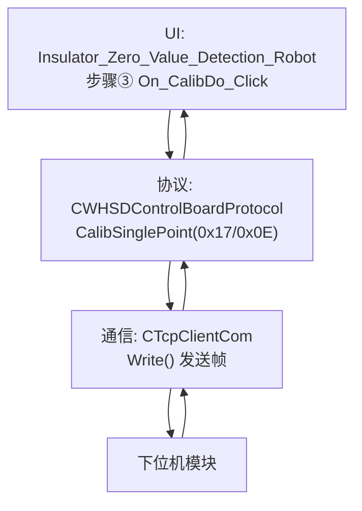
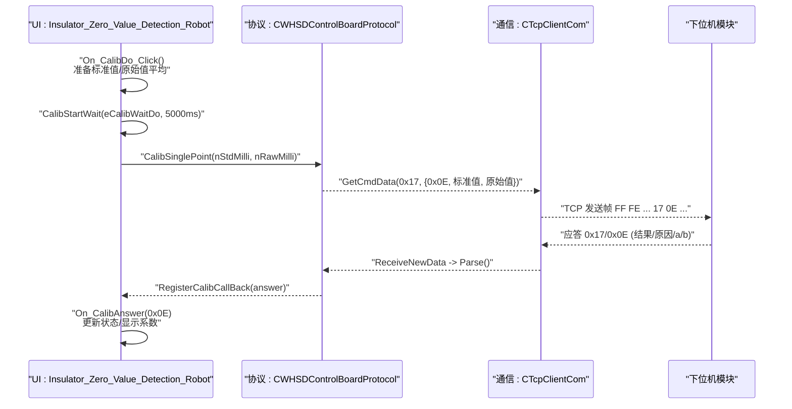
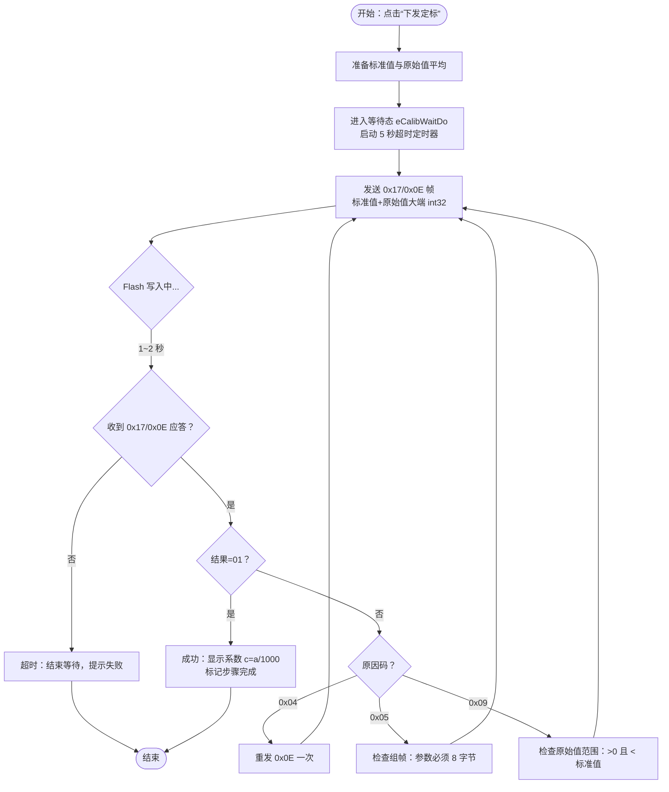
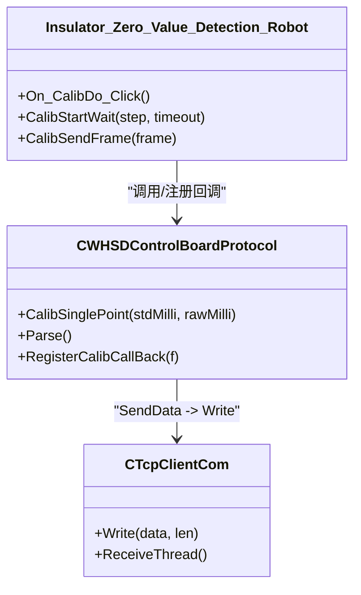

# 第四步：下发定标参数

<cite>
**本文引用的文件**
- [WHSDControlBoradProtocol.cpp](file://Insulator_Zero_Value_Detection_Robot/Protocol/WHSDControlBoradProtocol.cpp)
- [WHSDControlBoradProtocol.h](file://Insulator_Zero_Value_Detection_Robot/Protocol/WHSDControlBoradProtocol.h)
- [TcpClient.cpp](file://Insulator_Zero_Value_Detection_Robot/DeviceCom/TcpClient.cpp)
- [TcpClient.h](file://Insulator_Zero_Value_Detection_Robot/DeviceCom/TcpClient.h)
- [Insulator_Zero_Value_Detection_Robot.cpp](file://Insulator_Zero_Value_Detection_Robot/UI/Insulator_Zero_Value_Detection_Robot.cpp)
- [Insulator_Zero_Value_Detection_Robot.h](file://Insulator_Zero_Value_Detection_Robot/UI/Insulator_Zero_Value_Detection_Robot.h)
- [单点定标协议与流程_V1.0.html](file://Insulator_Zero_Value_Detection_Robot/单点定标协议与流程_V1.0.html)
</cite>

## 目录
1. [简介](#简介)
2. [项目结构](#项目结构)
3. [核心组件](#核心组件)
4. [架构总览](#架构总览)
5. [详细组件分析](#详细组件分析)
6. [依赖关系分析](#依赖关系分析)
7. [性能考虑](#性能考虑)
8. [故障排查指南](#故障排查指南)
9. [结论](#结论)
10. [附录](#附录)

## 简介
本章节聚焦“单点定标”的第四步操作：下发定标参数（命令 0x17/0x0E）。内容涵盖：
- 0x17/0x0E 命令的工作原理、帧格式构造与参数计算
- Flash 写入耗时特性与超时设置（代码中为 5 秒）
- 定标参数的计算逻辑（基于标准电阻值与测量原始值的关系）
- 完整的命令发送与应答处理示例，含错误重试机制
- 定标参数的存储位置与后续使用方式

## 项目结构
围绕“第四步：下发定标参数”，涉及三层协作：
- UI 层：负责用户触发、状态机推进、超时控制与日志展示
- 协议层：封装 0x17/0x0E 帧构造、解析与回调分发
- 通信层：TCP 客户端负责数据收发

图表来源
- [Insulator_Zero_Value_Detection_Robot.cpp:1078-1114](file://Insulator_Zero_Value_Detection_Robot/UI/Insulator_Zero_Value_Detection_Robot.cpp#L1078-L1114)
- [WHSDControlBoradProtocol.cpp:608-616](file://Insulator_Zero_Value_Detection_Robot/Protocol/WHSDControlBoradProtocol.cpp#L608-L616)
- [TcpClient.cpp:43-57](file://Insulator_Zero_Value_Detection_Robot/DeviceCom/TcpClient.cpp#L43-L57)

章节来源
- [Insulator_Zero_Value_Detection_Robot.cpp:55-65](file://Insulator_Zero_Value_Detection_Robot/UI/Insulator_Zero_Value_Detection_Robot.cpp#L55-L65)
- [WHSDControlBoradProtocol.cpp:608-616](file://Insulator_Zero_Value_Detection_Robot/Protocol/WHSDControlBoradProtocol.cpp#L608-L616)
- [TcpClient.cpp:43-57](file://Insulator_Zero_Value_Detection_Robot/DeviceCom/TcpClient.cpp#L43-L57)

## 核心组件
- 协议封装类：提供 CalibSinglePoint 构造 0x17/0x0E 帧；解析 0x17 应答并调用回调
- UI 状态机：On_CalibDo_Click 发起等待与发送；CalibStartWait 管理超时；CalibSendFrame 统一发送与记录
- 通信层：CTcpClientCom 将帧写入 TCP 套接字，接收线程回传数据给协议层解析

关键职责与交互：
- UI 层：准备标准值与原始值平均值，进入 eCalibWaitDo 等待态，启动 5 秒超时定时器
- 协议层：按大端 int32 拼接标准值与原始值，生成完整帧并通过 SendData 回调交给 TCP 层
- 通信层：通过 TCP 发送帧，并将收到的字节流交由协议层 Parse 解析

章节来源
- [Insulator_Zero_Value_Detection_Robot.cpp:1078-1114](file://Insulator_Zero_Value_Detection_Robot/UI/Insulator_Zero_Value_Detection_Robot.cpp#L1078-L1114)
- [Insulator_Zero_Value_Detection_Robot.cpp:865-900](file://Insulator_Zero_Value_Detection_Robot/UI/Insulator_Zero_Value_Detection_Robot.cpp#L865-L900)
- [WHSDControlBoradProtocol.cpp:608-616](file://Insulator_Zero_Value_Detection_Robot/Protocol/WHSDControlBoradProtocol.cpp#L608-L616)
- [WHSDControlBoradProtocol.cpp:213-444](file://Insulator_Zero_Value_Detection_Robot/Protocol/WHSDControlBoradProtocol.cpp#L213-L444)
- [TcpClient.cpp:43-57](file://Insulator_Zero_Value_Detection_Robot/DeviceCom/TcpClient.cpp#L43-L57)

## 架构总览
下图展示了从 UI 触发到协议解析、再到 TCP 收发的完整时序。重点体现 0x17/0x0E 的发送与应答处理路径。

图表来源
- [Insulator_Zero_Value_Detection_Robot.cpp:1078-1114](file://Insulator_Zero_Value_Detection_Robot/UI/Insulator_Zero_Value_Detection_Robot.cpp#L1078-L1114)
- [WHSDControlBoradProtocol.cpp:608-616](file://Insulator_Zero_Value_Detection_Robot/Protocol/WHSDControlBoradProtocol.cpp#L608-L616)
- [WHSDControlBoradProtocol.cpp:213-444](file://Insulator_Zero_Value_Detection_Robot/Protocol/WHSDControlBoradProtocol.cpp#L213-L444)
- [TcpClient.cpp:43-57](file://Insulator_Zero_Value_Detection_Robot/DeviceCom/TcpClient.cpp#L43-L57)

## 详细组件分析

### 0x17/0x0E 命令工作原理与帧格式
- 命令字：0x17（校准命令），子命令：0x0E（单点定标）
- 数据域：标准值（int32 毫值，大端）、实测原始值（int32 毫值，大端），共 8 字节
- 校验：整帧累加和的低 8 位
- 帧头帧尾：FF FE … FD FC
- 应答：结果（01=成功，00=失败）、原因码、a（毫值）、b（毫值）

实现要点：
- 协议层 AppendInt32BE 将多字节整数以大端追加到数据域
- GetCmdData 组装帧长度、序号、命令字、数据域、校验和、帧尾
- 解析时根据子命令区分参数个数与含义

章节来源
- [WHSDControlBoradProtocol.cpp:562-580](file://Insulator_Zero_Value_Detection_Robot/Protocol/WHSDControlBoradProtocol.cpp#L562-L580)
- [WHSDControlBoradProtocol.cpp:654-677](file://Insulator_Zero_Value_Detection_Robot/Protocol/WHSDControlBoradProtocol.cpp#L654-L677)
- [WHSDControlBoradProtocol.cpp:392-418](file://Insulator_Zero_Value_Detection_Robot/Protocol/WHSDControlBoradProtocol.cpp#L392-L418)
- [单点定标协议与流程_V1.0.html:45-55](file://Insulator_Zero_Value_Detection_Robot/单点定标协议与流程_V1.0.html#L45-L55)
- [单点定标协议与流程_V1.0.html:79-92](file://Insulator_Zero_Value_Detection_Robot/单点定标协议与流程_V1.0.html#L79-L92)

### 定标参数计算逻辑
- 固件内部计算补偿率 p% = (1 − 原始值/标准值) × 100
- 补偿系数 c = p ÷ √原始值（b 固定为 0）
- 上位机零计算，仅下发标准值与实测原始值
- 成功后应答回显 a（c = a ÷ 1000），b 通常为 0

注意：
- 原始值必须大于 0 且小于标准值，否则返回原因 0x09（参数非法）
- 若原始值 ≥ 标准值，说明模块读数偏高，应检查硬件与接线

章节来源
- [单点定标协议与流程_V1.0.html:57-61](file://Insulator_Zero_Value_Detection_Robot/单点定标协议与流程_V1.0.html#L57-L61)
- [Insulator_Zero_Value_Detection_Robot.cpp:1093-1110](file://Insulator_Zero_Value_Detection_Robot/UI/Insulator_Zero_Value_Detection_Robot.cpp#L1093-L1110)

### Flash 写入耗时与超时设置
- 0x17/0x0E 会擦写 Flash Sector4，耗时约 1~2 秒
- 代码中设置 5 秒超时等待（CALIB_FLASH_TIMEOUT_MS），确保应答稳定
- 若超时未收到应答，视为本次等待失败，需检查链路或重发

章节来源
- [Insulator_Zero_Value_Detection_Robot.cpp:55-65](file://Insulator_Zero_Value_Detection_Robot/UI/Insulator_Zero_Value_Detection_Robot.cpp#L55-L65)
- [Insulator_Zero_Value_Detection_Robot.cpp:1111-1114](file://Insulator_Zero_Value_Detection_Robot/UI/Insulator_Zero_Value_Detection_Robot.cpp#L1111-L1114)
- [单点定标协议与流程_V1.0.html:125-125](file://Insulator_Zero_Value_Detection_Robot/单点定标协议与流程_V1.0.html#L125-L125)

### 命令发送与应答处理示例（含错误重试）
- 发送：UI 调用 CalibSendFrame(CWHSDControlBoardProtocol::CalibSinglePoint(...))
- 解析：协议层 Parse 识别 0x17，提取子命令/结果/原因/参数，调用 RegisterCalibCallBack
- UI 处理：On_CalibAnswer(0x0E) 更新界面、记录日志、标记步骤完成
- 错误重试：
  - 原因 0x04（Flash 写失败）：建议重发一次 0x0E
  - 原因 0x05（参数长度/格式错误）：检查组帧是否为 8 字节参数
  - 原因 0x09（参数非法）：检查原始值是否 >0 且 < 标准值

章节来源
- [Insulator_Zero_Value_Detection_Robot.cpp:1236-1249](file://Insulator_Zero_Value_Detection_Robot/UI/Insulator_Zero_Value_Detection_Robot.cpp#L1236-L1249)
- [WHSDControlBoradProtocol.cpp:392-418](file://Insulator_Zero_Value_Detection_Robot/Protocol/WHSDControlBoradProtocol.cpp#L392-L418)
- [单点定标协议与流程_V1.0.html:94-99](file://Insulator_Zero_Value_Detection_Robot/单点定标协议与流程_V1.0.html#L94-L99)

### 定标参数的存储位置与后续使用
- 存储位置：下位机 Flash Sector4，掉电保存，上电自动加载
- 后续使用：定标生效后，0x0F 回报修正后的值；可通过 0x17/0x0C 读回系数核对
- 漂移处理：模块漂移后重新测量同一电阻，再发一次 0x0E 即可覆盖旧系数

章节来源
- [单点定标协议与流程_V1.0.html:34-42](file://Insulator_Zero_Value_Detection_Robot/单点定标协议与流程_V1.0.html#L34-L42)
- [单点定标协议与流程_V1.0.html:113-116](file://Insulator_Zero_Value_Detection_Robot/单点定标协议与流程_V1.0.html#L113-L116)
- [单点定标协议与流程_V1.0.html:101-105](file://Insulator_Zero_Value_Detection_Robot/单点定标协议与流程_V1.0.html#L101-L105)

### 流程图：第四步下发定标参数

图表来源
- [Insulator_Zero_Value_Detection_Robot.cpp:1078-1114](file://Insulator_Zero_Value_Detection_Robot/UI/Insulator_Zero_Value_Detection_Robot.cpp#L1078-L1114)
- [WHSDControlBoradProtocol.cpp:608-616](file://Insulator_Zero_Value_Detection_Robot/Protocol/WHSDControlBoradProtocol.cpp#L608-L616)
- [单点定标协议与流程_V1.0.html:94-99](file://Insulator_Zero_Value_Detection_Robot/单点定标协议与流程_V1.0.html#L94-L99)

## 依赖关系分析
- UI 依赖协议层：通过 CalibSinglePoint 构造帧，通过 RegisterCalibCallBack 接收应答
- 协议层依赖通信层：通过 SendData 回调将帧交给 TCP 层发送
- 通信层独立于业务：只负责 TCP 连接、发送与接收，不关心帧语义

图表来源
- [Insulator_Zero_Value_Detection_Robot.cpp:1078-1114](file://Insulator_Zero_Value_Detection_Robot/UI/Insulator_Zero_Value_Detection_Robot.cpp#L1078-L1114)
- [WHSDControlBoradProtocol.cpp:608-616](file://Insulator_Zero_Value_Detection_Robot/Protocol/WHSDControlBoradProtocol.cpp#L608-L616)
- [TcpClient.cpp:43-57](file://Insulator_Zero_Value_Detection_Robot/DeviceCom/TcpClient.cpp#L43-L57)

章节来源
- [Insulator_Zero_Value_Detection_Robot.h:315-374](file://Insulator_Zero_Value_Detection_Robot/UI/Insulator_Zero_Value_Detection_Robot.h#L315-L374)
- [WHSDControlBoradProtocol.h:17-52](file://Insulator_Zero_Value_Detection_Robot/Protocol/WHSDControlBoradProtocol.h#L17-L52)
- [TcpClient.h:8-46](file://Insulator_Zero_Value_Detection_Robot/DeviceCom/TcpClient.h#L8-L46)

## 性能考虑
- 0x17/0x0E 写 Flash 耗时 1~2 秒，超时设置为 5 秒，避免误判失败
- 0x0F 测量结果回报约 3.2 秒，相关等待超时通常设为 ≥5 秒
- 网络层使用非阻塞 I/O 与 select 轮询，减少阻塞影响
- 协议层解析采用缓冲区循环处理，保证连续帧正确拆分

章节来源
- [Insulator_Zero_Value_Detection_Robot.cpp:55-65](file://Insulator_Zero_Value_Detection_Robot/UI/Insulator_Zero_Value_Detection_Robot.cpp#L55-L65)
- [TcpClient.cpp:123-236](file://Insulator_Zero_Value_Detection_Robot/DeviceCom/TcpClient.cpp#L123-L236)
- [TcpClient.cpp:301-382](file://Insulator_Zero_Value_Detection_Robot/DeviceCom/TcpClient.cpp#L301-L382)
- [WHSDControlBoradProtocol.cpp:213-444](file://Insulator_Zero_Value_Detection_Robot/Protocol/WHSDControlBoradProtocol.cpp#L213-L444)

## 故障排查指南
- 原因 0x01：查询原始值超时（距上次 0x0F 超 5 秒），需立即触发检测并查询
- 原因 0x04：Flash 写失败，建议重发 0x0E；反复失败检查 Flash 健康
- 原因 0x05：参数长度/格式错误，确认数据域为标准值+原始值共 8 字节
- 原因 0x09：参数非法，检查原始值范围（>0 且 < 标准值），必要时检查硬件接线
- 响应慢：0x0E 写 Flash 需 1~2 秒属正常，超时设 ≥3 秒（代码中为 5 秒）

章节来源
- [单点定标协议与流程_V1.0.html:140-148](file://Insulator_Zero_Value_Detection_Robot/单点定标协议与流程_V1.0.html#L140-L148)
- [Insulator_Zero_Value_Detection_Robot.cpp:1093-1110](file://Insulator_Zero_Value_Detection_Robot/UI/Insulator_Zero_Value_Detection_Robot.cpp#L1093-L1110)

## 结论
第四步“下发定标参数”通过 0x17/0x0E 将标准值与实测原始值发送给下位机，固件自动计算补偿系数并写入 Flash，随后立即生效。代码中针对 Flash 写入耗时设置了 5 秒超时，确保可靠性。通过合理的帧构造、解析与回调机制，结合错误重试与异常排查，可稳定完成单点定标。

## 附录
- 帧速查表与示例帧见协议文档
- 辅助验证命令（0x0A）可用于离线抽查系数是否生效
- 读回系数（0x0C）用于核对 Flash 中已存 a/b

章节来源
- [单点定标协议与流程_V1.0.html:127-138](file://Insulator_Zero_Value_Detection_Robot/单点定标协议与流程_V1.0.html#L127-L138)
- [单点定标协议与流程_V1.0.html:100-105](file://Insulator_Zero_Value_Detection_Robot/单点定标协议与流程_V1.0.html#L100-L105)